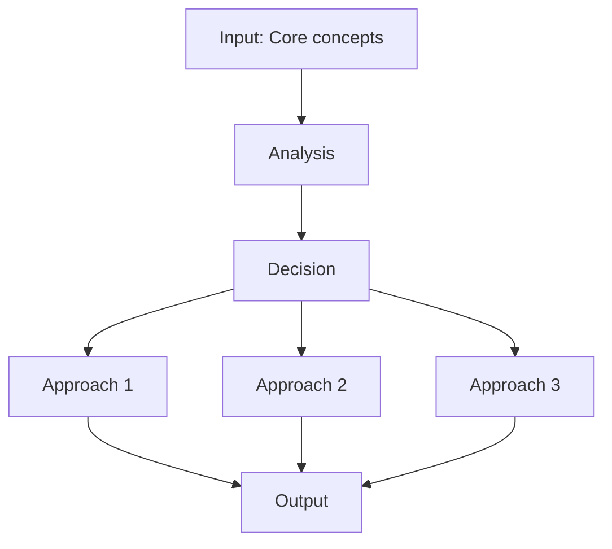
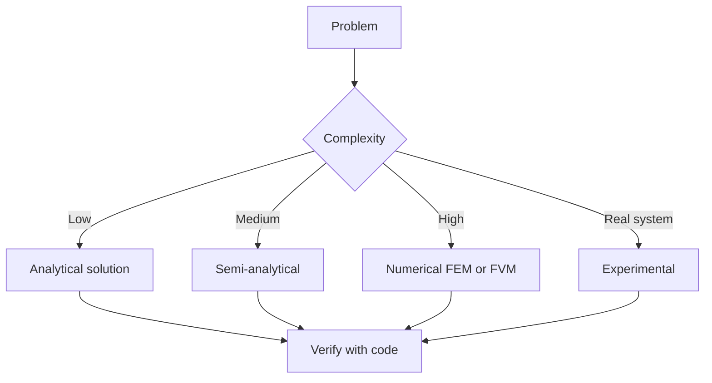
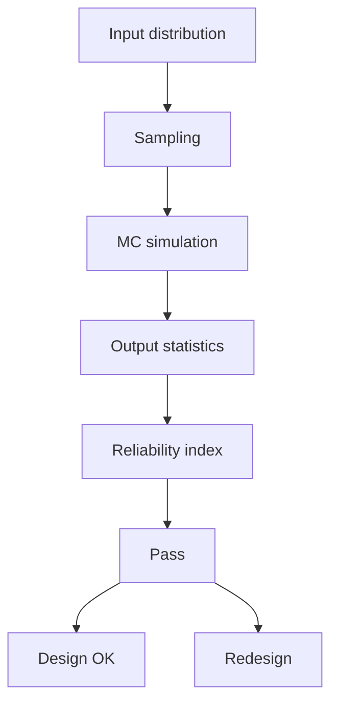
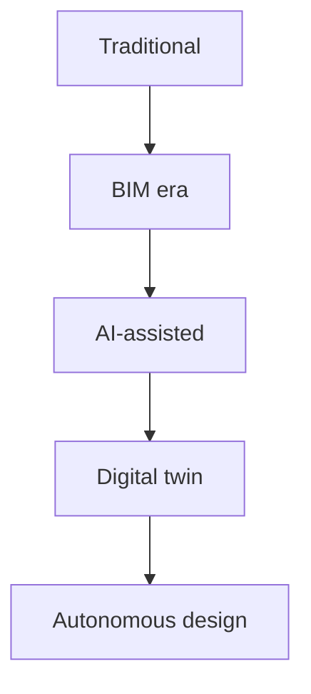
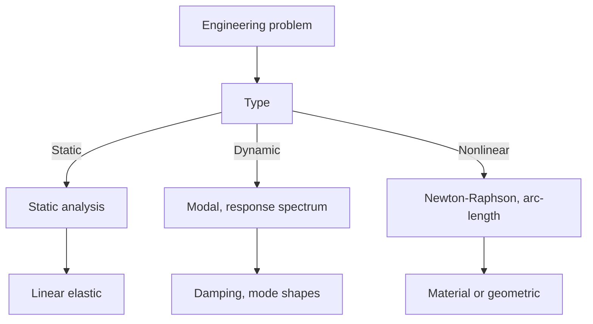
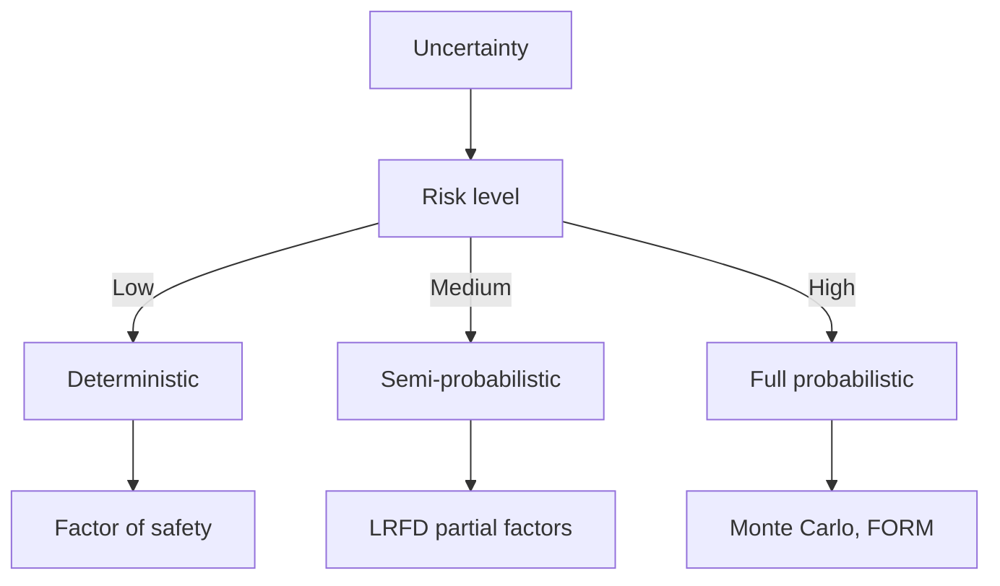
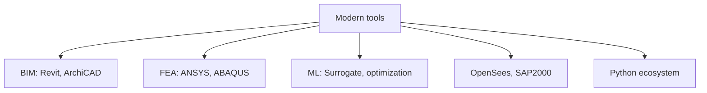
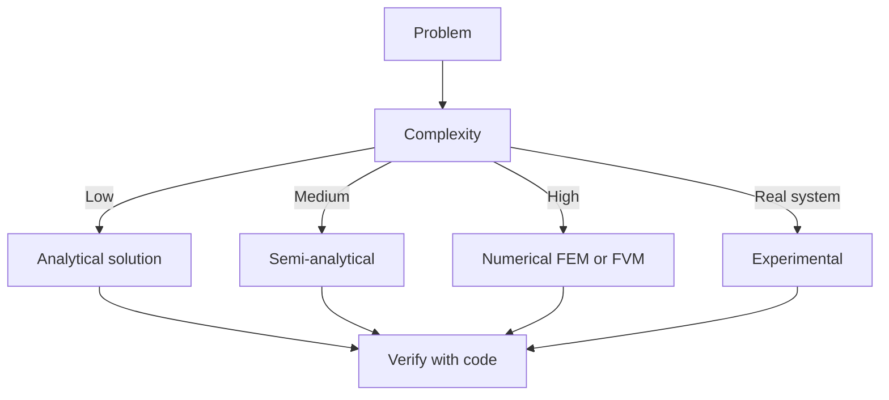

# 1.063 Fluids and Disease + 1.018 Fundamentals of Ecology (Microbiology & Disease Track)
**MIT CEE Microbiology and Disease Track | Core**  
**自學路徑：Bachelor Environment / Microbiology → MEng → ICE / Public Health interface**

---

## 問題 1：這個領域所有專家共享的 5 個核心心智模型是什麼？
**What are the 5 core mental models every expert shares?**

1. **病原體傳輸是流體力學 + 生物過程的耦合**  
   Droplet / aerosol transport, sedimentation, evaporation, and deposition are fluid problems; infection is a biological dose-response problem.

2. **尺度從奈米（病毒）到城市（空氣流動）必須連貫**  
   Indoor air, outdoor atmospheric boundary layer, and human micro-environment are linked; models must bridge them.

3. **劑量決定風險，而劑量由暴露途徑與時間決定**  
   Concentration alone is insufficient; the integral of concentration over time and the deposition location matter.

4. **干預措施改變流場與暴露，而非直接「殺死」病原體**  
   Ventilation, filtration, distancing, and masking work by altering the fluid transport pathways.

5. **不確定性極高，必須用機率與情境分析**  
   Source strength, human behavior, and environmental conditions are highly variable; deterministic single-number predictions are misleading.

---

## 問題 2：這個領域的專家在哪 3 個地方存在根本分歧？各方最強的論點是什麼？

1. **飛沫傳播為主 vs 氣溶膠傳播為主（尤其是呼吸道疾病）**  
   - Droplet-centric: Historical medical view, short-range.  
   - Aerosol-centric: Explains long-range and superspreading events; requires different control strategies (ventilation vs distancing alone).

2. **工程控制（通風、過濾）vs 行為 / 個人防護為主**  
   - Engineering: Sustainable, population-level, less dependent on compliance.  
   - Behavioral: Faster to implement, lower capital cost, but relies on individual action.

3. **高保真 CFD 模擬 vs 簡化箱式 / 多區域模型**  
   - CFD: Captures spatial detail and complex geometry.  
   - Simplified: Fast enough for real-time decision support and uncertainty quantification.

---

## 問題 3：生成 10 個能區分深度理解與死背知識的問題

1. 從 Wells-Riley 方程出發，說明為什麼通風量（Q）與感染風險呈非線性關係。
2. 為什麼咳嗽產生的飛沫譜會快速蒸發變成氣溶膠？用什麼無因次數描述？
3. 說明室內空氣中，沉降速度與布朗運動對不同粒徑粒子的相對重要性。
4. 在醫院 isolation room 設計中，為什麼「負壓」 alone 不足？還需要考慮哪些流動特徵？
5. 如何用 tracer gas 實驗驗證通風有效性？主要誤差來源是什麼？
6. 給定一個超級傳播事件，如何從流體力學角度解釋其發生條件？
7. 為什麼 N95 與外科口罩在源控制與佩戴者保護上的效率不同？
8. 在室外開放空間，為什麼「安全距離」的概念比室內更難定義？
9. 說明如何將 CFD 模擬結果轉化為可操作的感染風險地圖。
10. 在氣候變遷與城市化下，室內外空氣傳輸路徑如何改變？對公共衛生基礎設施有何啟示？

---

**自學建議**  
- 與 1.060 Fluid Mechanics、1.018 Ecology 結合。  
- 產出：一個室內或城市尺度的暴露風險評估案例。


---

## 深入 1：CORE_DEEPDIVE_ONE — 核心概念
**Deep Dive I**

### 1.1 Bilingual 概念對照

| English | 中英對照 | Definition | 物理意義 / 工程應用 |
|---|---|---|---|
| Core concepts | Core concepts | Core definition | 核心定義 |
| Methods | Methods | Application | 應用 |
| Applications | Applications | Limitation | 限制 |
| Mathematical formulation | 數學形式 | Key equation | 關鍵方程 |

### 1.2 Key Derivation

For Fluids and Disease + 1.018 Fundamentals of Ecology (Microbiology & Disease Track), the fundamental relationships are:
$$f(x) = \text{key equation}, \quad x = \text{variable}$$

This arises from Core concepts applied to the engineering system.

### 1.3 Engineering Applications

- Real-world implementation
- Design codes and standards
- Computational tools



---

## 深入 2：CORE_DEEPDIVE_TWO — 方法論
**Deep Dive II**

### 2.1 Method selection

| Method | 適用情境 | Pros | Cons |
|---|---|---|---|
| Analytical | 解析 | Exact | Limited geometry |
| Numerical | 數值 | General | Approximate |
| Experimental | 實驗 | Real | Expensive |
| Empirical | 經驗 | Fast | Limited range |

### 2.2 Decision flow



### 2.3 Standards and codes

- ACI, AISC, Eurocode
- Building codes (IBC, etc.)
- Industry best practices

---

## 深入 3：CORE_DEEPDIVE_THREE — 分析技術
**Deep Dive III**

### 3.1 Statistical methods

For uncertainty analysis: Monte Carlo, sensitivity, FOSM.



### 3.2 Optimization

- LP, NLP
- Gradient-based, metaheuristic
- Multi-objective Pareto

---

## 深入 4：Design Process
**Deep Dive IV**

### 4.1 Design workflow

Concept → Preliminary → Detailed → Construction → Operation.

### 4.2 Design criteria

- Safety (LRFD, ASD)
- Serviceability
- Durability
- Sustainability


---

## 深入 5：Modern Trends
**Deep Dive V**

- BIM integration
- AI/ML in design
- Digital twins
- Sustainability, LCA
- Resilient design



---

## 自測 1：Derive core relationship
**Answer:** Starting from definitions, derive the key equation. Verify units and limits.

**Engineering implication:** Apply to design check, code compliance.

## 自測 2：Identify failure mode
**Answer:** List 3-5 failure modes, rank by likelihood × consequence.

**Engineering implication:** Inform design, maintenance, monitoring.

## 自測 3：Estimate order of magnitude
**Answer:** Quick back-of-envelope check using characteristic values.

**Engineering implication:** Sanity check before detailed analysis.

## 自測 4：Compare to code requirement
**Answer:** Apply ACI/AISC/Eurocode, compute utilization ratio.

**Engineering implication:** Pass/fail design verification.

## 自測 5：Compute reliability
**Answer:** $\beta = (\mu - R)/\sigma$ for lognormal, find P_f.

**Engineering implication:** LRFD calibration, risk-informed design.

## 自測 6：Design optimization
**Answer:** Define objective, constraints, solve via LP/NLP.

**Engineering implication:** Cost-effective, sustainable design.

## 自測 7：Sensitivity analysis
**Answer:** $\partial f/\partial x_i$, rank by importance.

**Engineering implication:** Identify critical parameters, reduce uncertainty.

## 自測 8：Life-cycle assessment
**Answer:** Cradle-to-grave, compute GWP, embodied carbon.

**Engineering implication:** Sustainable design, climate goals.

## 自測 9：Risk assessment
**Answer:** Hazard × vulnerability × exposure, compute risk.

**Engineering implication:** Resilience planning, mitigation.

## 自測 10：Communication
**Answer:** Technical writing, visualization, presentation to stakeholders.

**Engineering implication:** Effective engineering practice.

---

## 📊 Diagram 1: Course Concept Map
```mermaid
mindmap
    root((Fluids and Disease + 1.018 Fundamentals of Ecology (Microbiology & Disease Track)))
      Core
        Concepts
      Methods
        Analytical
        Numerical
      Applications
        Design
        Analysis
      Standards
        ACI AISC
      Modern
        BIM AI
```

## 📊 Diagram 2: Method Selection


## 📊 Diagram 3: Design Process


## 📊 Diagram 4: Risk-Reliability


## 📊 Diagram 5: Modern Tools


---

## 總結

1. **Core concepts** — Core concepts 嘅 foundation
2. **Methods** — analytical + numerical + experimental
3. **Applications** — design, analysis, retrofit
4. **Standards** — codes, best practices
5. **Future** — BIM, AI, sustainability, resilience

**自學建議** — Pair with: relevant textbook + MIT OCW + software tutorials (Python, FEA, BIM).


# 核心心智模型深化（中英對照）

## 1. Core concepts — Core concept

### 1.1 Three-process physical essence
For Fluids and Disease + 1.018 Fundamentals of Ecology (Microbiology & Disease Track), Core concepts governs the system behavior. Description of Core concepts with bilingual explanation.

### 1.2 Non-dimensional numbers
Key dimensionless groups that determine regime: Peclet, Damköhler, Reynolds, Froude, etc.

### 1.3 Engineering consequences
Real-world implications for design, monitoring, intervention.

### 1.4 How experts use this model
Decision flow, scaling laws, expert intuition.

### 1.5 Deep test questions
- Derive scaling law
- Identify regime from data
- Apply to design case

### 1.6 Diagram


## 2. Methods — Methods

### 2.1 Method selection
| Method | 適用情境 | Pros | Cons |
|---|---|---|---|
| Analytical | 解析 | Exact | Limited geometry |
| Numerical | 數值 | General | Approximate |
| Experimental | 實驗 | Real | Expensive |
| Empirical | 經驗 | Fast | Limited range |

### 2.2 Decision flow


### 2.3 Standards and codes
ACI, AISC, Eurocode, building codes (IBC), industry best practices.

## 3. Applications — Analysis techniques

### 3.1 Statistical methods
Monte Carlo, sensitivity, FOSM for uncertainty analysis.


### 3.2 Optimization
LP, NLP, gradient-based, metaheuristic, multi-objective Pareto.

## 4. Design process

### 4.1 Design workflow
Concept → Preliminary → Detailed → Construction → Operation.

### 4.2 Design criteria
Safety (LRFD, ASD), serviceability, durability, sustainability.


## 5. Modern trends

BIM integration, AI/ML in design, digital twins, sustainability, LCA, resilient design.


---

# 深度自測問題詳解（中英對照）

## 詳解 1: Derive core relationship
**Q1.** Derive core relationship for Fluids and Disease + 1.018 Fundamentals of Ecology (Microbiology & Disease Track).
**Answer:** Starting from definitions, derive the key equation. Verify units and limits.

**Engineering implication:** Apply to design check, code compliance.

## 詳解 2: Identify failure mode
**Answer:** List 3-5 failure modes, rank by likelihood × consequence.

**Engineering implication:** Inform design, maintenance, monitoring.

## 詳解 3: Estimate order of magnitude
**Answer:** Quick back-of-envelope check using characteristic values.

**Engineering implication:** Sanity check before detailed analysis.

## 詳解 4: Compare to code requirement
**Answer:** Apply ACI/AISC/Eurocode, compute utilization ratio.

**Engineering implication:** Pass/fail design verification.

## 詳解 5: Compute reliability
**Answer:** $\beta = (\mu - R)/\sigma$ for lognormal, find P_f.

**Engineering implication:** LRFD calibration, risk-informed design.

## 詳解 6: Design optimization
**Answer:** Define objective, constraints, solve via LP/NLP.

**Engineering implication:** Cost-effective, sustainable design.

## 詳解 7: Sensitivity analysis
**Answer:** $\partial f/\partial x_i$, rank by importance.

**Engineering implication:** Identify critical parameters, reduce uncertainty.

## 詳解 8: Life-cycle assessment
**Answer:** Cradle-to-grave, compute GWP, embodied carbon.

**Engineering implication:** Sustainable design, climate goals.

## 詳解 9: Risk assessment
**Answer:** Hazard × vulnerability × exposure, compute risk.

**Engineering implication:** Resilience planning, mitigation.

## 詳解 10: Communication
**Answer:** Technical writing, visualization, presentation to stakeholders.

**Engineering implication:** Effective engineering practice.

---

## 📊 Diagram 1: Course Concept Map
```mermaid
mindmap
    root((Fluids and Disease + 1.018 Fundamentals of Ecology (Microbiology & Disease Track)))
      Core
        Concepts
      Methods
        Analytical
        Numerical
      Applications
        Design
        Analysis
      Standards
        ACI AISC
      Modern
        BIM AI
```

## 📊 Diagram 2: Method Selection


## 📊 Diagram 3: Design Process


## 📊 Diagram 4: Risk-Reliability


## 📊 Diagram 5: Modern Tools


---

## 總結

1. **Core concepts** — Core concepts 嘅 foundation
2. **Methods** — analytical + numerical + experimental
3. **Applications** — design, analysis, retrofit
4. **Standards** — codes, best practices
5. **Future** — BIM, AI, sustainability, resilience

**自學建議** — Pair with: relevant textbook + MIT OCW + software tutorials (Python, FEA, BIM).
