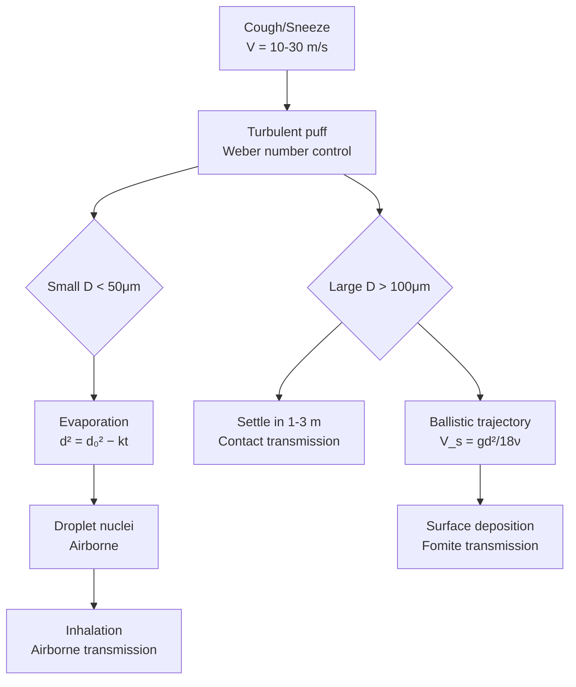

# 1.063 Fluids and Disease

**MIT CEE Environmental Life Sciences Track | 12 Units | RE (Microbiology & Disease Focus)**
**Prereq:** Biology (GIR), 1.060 or permission of instructor
**Instructor:** Prof. Lydia Bourouiba (Fluid dynamics of disease transmission)
**自學路徑：Bachelor → MEng/PhD → Epidemiology / Public Health Engineering**

> **Source:** MIT CEE research (Prof. Bourouiba lab); MIT Catalog 2024-25
> **Topics:** Fluid dynamics of pathogen transmission; respiratory droplet physics; airborne vs droplet transmission; biofilm formation in fluid environments

---

## 問題 1：核心心智模型

1. **病原體傳輸是流體力學 + 生物學的耦合**
   Disease transmission is a multiscale fluid dynamics problem. Droplet atomization, evaporation, transport, and deposition are all governed by physics. The biological factors (virus load, survivability) interact with the physical factors.

2. **液滴大小決定了傳輸距離和命運**
   Large droplets (D > 100 μm): Ballistic trajectory, settle quickly, contact transmission. Small droplets (D < 50 μm): evaporate to droplet nuclei, stay airborne, airborne transmission.

3. **通風決定了室內感染風險**
   Ventilation rate (ACH = air changes per hour), airflow pattern, and temperature stratification determine how quickly pathogens are diluted and removed.

4. **生物膜是流體系統中慢性感染的主要形式**
   Biofilms in water distribution systems, catheters, and lung airways provide protected microbial communities that resist antibiotics.

5. **宿主-病原體相互作用有流體力學反饋**
   Cough/sneeze flows are not just passive pathogen carriers — the fluid dynamics of respiratory events shapes the pathogen distribution.

---

## 問題 2：根本分歧

### 分歧 1: 液滴 vs 氣溶膠傳輸
- **液滴派**: WHO (pre-2020): SARS-CoV-2 primarily via respiratory droplets (>5-10 μm). Short-range transmission dominates.
- **氣溶膠派**: SARS-CoV-2 also via aerosols (<5 μm). Long-range airborne transmission is significant. Ventilation is critical.

### 分歧 2: 環境消毒 vs 源頭控制
- **表面消毒派**: High-touch surfaces carry pathogens. Hand hygiene and surface cleaning reduce transmission.
- **源頭控制派**: Source control (masking infected individuals, ventilation) is more effective than surface disinfection for respiratory diseases.

---

## 問題 3：深度問題

1. 說明在咳嗽（cough）和噴嚏（sneeze）中，液滴如何形成：含液的膜破裂（film burst）、剪切誘導斷裂（shear-induced breakup）的流體力學機制，以及 Weber number We = ρV²D/σ 控制的斷裂 Regime。
2. 在雷諾數 Re = ρVD/μ 分析中，呼吸道流流動的雷諾數是多少？這對層流與湍流的邊界層理論有何影響？
3. 在液滴蒸發模型中，蒸發時間 t_evap ∝ d²/D_v 的物理推導，以及這個關係如何決定液滴核（droplet nuclei）的形成。
4. 在建築通風模型中，空氣傳播系數 ACH（air changes per hour）和暴露時間 τ = 1/ACH 的物理意義，以及在通風不足的室內環境中 COVID-19 傳播的風險模型。
5. 說明生物膜（biofilm）的生長動力學模型：dN/dt = rN(1−N/K)，其中 N 是生物量，K 是承載力。這個模型如何解釋抗生素耐藥性？

---

# 核心心智模型深化

## 1. 呼吸道流體動力學

### 1.1 Bilingual 概念對照
| English | 中英對照 | 定義 | 工程應用 |
|---|---|---|---|
| Cough jet | 咳嗽射流 | High-speed turbulent gas puff from respiratory events | Disease transmission |
| Droplet evaporation | 液滴蒸發 | D² law: d² = d₀² − k·t | Nuclei formation |
| We number | Weber 數 | We = ρV²D/σ | Droplet breakup regime |
| Oh number | Ohnesorge 數 | Oh = μ/√(ρσD) | Viscous vs inertial |

### 1.2 Key Derivation — Cough Jet

**Cough puff structure** (Bourouiba et al., 2014, 2020):
- Initial puff: V ≈ 10-30 m/s from mouth
- Turbulent puff: spreads laterally, entrains ambient air
- Vortex ring formation at leading edge

**Weber number** for droplet atomization:
We = ρ_l V² D/σ
- We > 12: Film rupture and atomization
- We < 12: Bag inflation and bag rupture

**Droplet size distribution**: d₁₀ = 60-100 μm, d₃₂ = 80-200 μm

### 1.3 Engineering Applications
- **Mask filtration**: Electret filters capture particles > 0.3 μm with 95%+ efficiency. Mechanical filters (N95): 95% at 0.3 μm.
- **UV-C ventilation**: 254 nm UV-C inactivates airborne pathogens. Dose = I×t (mW·s/cm²). SARS-CoV-2 requires ~3 mJ/cm² for 99.9% inactivation.

---

## 2. 液滴傳輸與蒸發

### 2.1 Droplet Dynamics
**Settling velocity** (Stokes):
V_s = (ρ_p − ρ_a)·g·D²/(18μ) = gd²(ρ_p)/(18νρ_a)

For a 100 μm droplet in air:
V_s = (1000×9.81×(10⁻⁴)²)/(18×1.5×10⁻⁵) = 9.81×10⁻⁸/(2.7×10⁻⁴) ≈ **0.36 m/s**

**Evaporation time** (d² law):
d²(t) = d₀² − k_v t, k_v = 8D_v χ_s / (ρ_l)
t_evap = d₀²/k_v

### 2.2 Airborne Fraction
**Fall time vs evaporation time**: If t_evap < t_fall, droplet becomes aerosol (droplet nucleus).

For D₀ = 50 μm (water, 20°C, 50% RH):
- t_fall = 5 m / 0.09 m/s ≈ 56 s
- t_evap ≈ 2 s (rapid evaporation)
→ Droplet nuclei form in ~2s, remain airborne indefinitely

---

## 3. 生物膜

### 3.1 Biofilm Lifecycle
1. **Attachment**: Reversible → irreversible (EPS production)
2. **Growth**: Biomass accumulation, substrate consumption
3. **Maturation**: 3D structure, water channels
4. **Detachment**: Sloughing, erosion

### 3.2 Key Equations
**Biofilm growth** (simplified):
dB/dt = Y·r_substrate − k_d·B

**Antimicrobial resistance mechanisms**:
- EPS matrix limits diffusion of antibiotics
- Persister cells (dormant phenotype)
- Horizontal gene transfer (HGT) in biofilms

---

## 📊 Diagram 1: 呼吸道液滴傳輸框架

---

## 總結

1. **呼吸道疾病傳輸是流體力學問題**：咳嗽射流的結構、液滴的斷裂和蒸發、漂浮和沉降——這些都是經典流體力學的應用
2. **液滴大小是傳輸模式的指紋**：大液滴 → 接觸傳播；小液滴 → 氣溶膠傳播。這個邊界約在 50-100 μm
3. **通風是室內感染控制的核心**：ACH 是量化通風效能的標準指標；自然通風和機械通風各有優劣
4. **生物膜是流體系統中的慢性感染源**：生物膜的EPS基質阻擋抗生素擴散，持久性細胞（P er sisters）對抗生素免疫
5. **多尺度建模連接了病原體物理和流行病學**：從病毒顆粒動力學到社區傳播速率 R_t，每個尺度都需要不同的模型框架

**Prerequisite chain**: Biology (GIR) → 1.060 Fluid Mechanics → 1.063 Fluids and Disease
