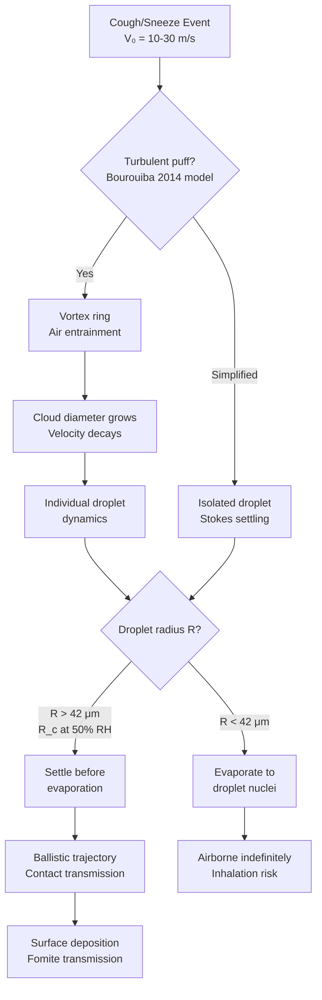
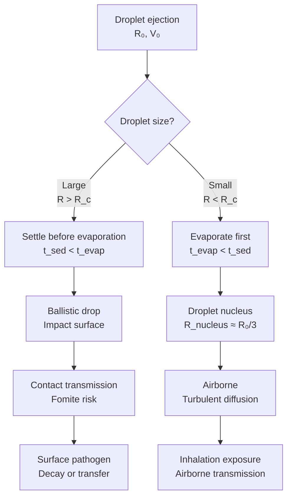
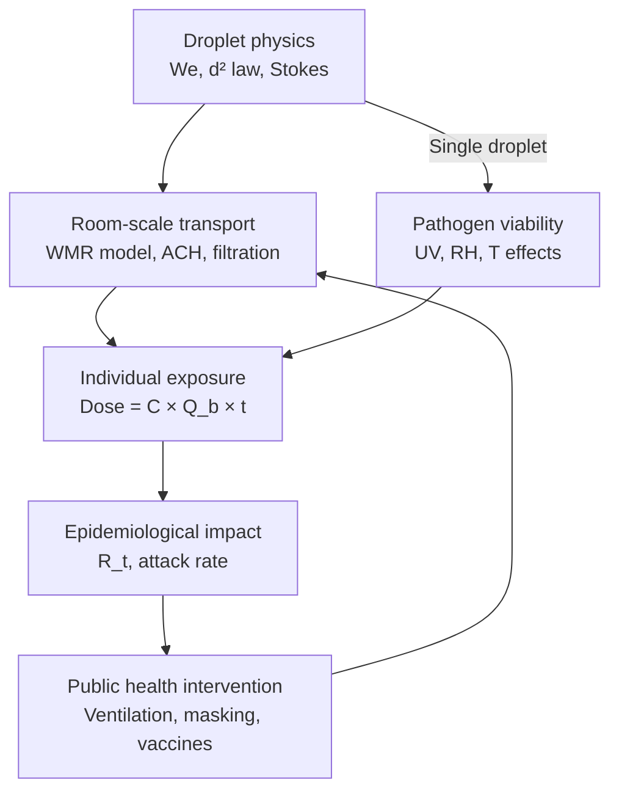
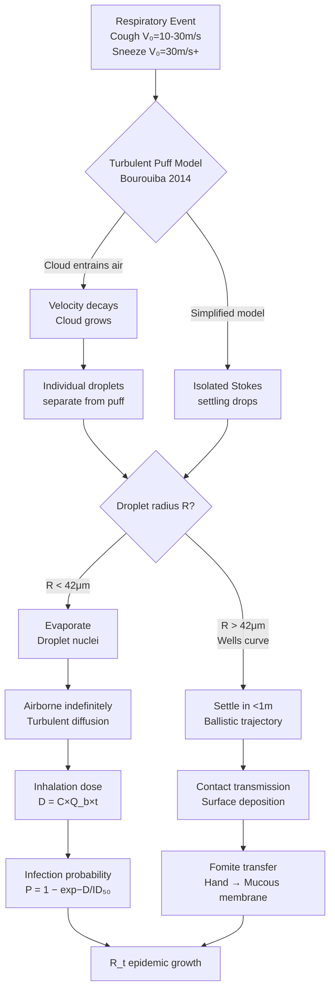
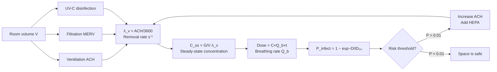
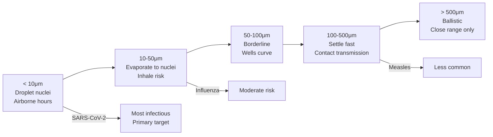
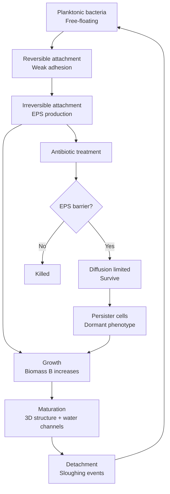
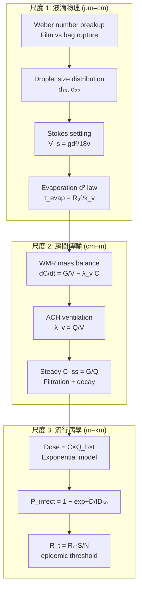

# 1.063 / Fluids and Diseases

**MIT CEE Environmental Life Sciences Track | Restricted Elective | 3-3-6 = 12 Units**
**Prereq:** 18.03 (Differential Equations) or permission of instructor
**Instructors:** Prof. Lydia Bourouiba (Fluid Dynamics of Disease Transmission Lab); Prof. B. Primkulov
**Subject meets with:** 1.631[J], 2.250[J], HST.537[J]
**Acad Year 2025-2026:** U (Spring); 2026-2027: Not offered
**自學路徑：Bachelor → M.Eng/PhD → Epidemiology / Public Health Engineering / Fluid Dynamics**

> **Source:** MIT CEE Catalog 2025-26; Bourouiba Lab (MIT); MIT OCW RES.10-S95 (Bazant, Gu, Cohen); Bourouiba (2021) *Annu. Rev. Fluid Mech.* 53:473–508
> **Topics:** Multi-scale fluid dynamics of disease transmission; respiratory droplet physics; Wells evaporation-settling curve; turbulent puff/sneeze cloud; airborne vs droplet transmission; epidemiology; biofilm in fluid environments

---

## 問題 1：這個領域所有專家共享的 5 個核心心智模型是什麼？

1. **疾病傳輸是多尺度流體動力學問題**
   Pathogen transmission from host to host is governed by fluid dynamics across scales: from mucosalivary physics during emission (μm–cm), through turbulent gas puff transport (cm–m), to room-scale aerosol concentration (m). Each scale requires different physics and modeling tools. Bourouiba (2021) calls this "the fluid dynamics of disease transmission."

2. **Weber 數決定液滴斷裂 Regime**
   Droplet formation in respiratory events is governed by Weber number: We = ρV²D/σ. When We > 12, film rupture causes primary atomization; when We < 12, bag-inflation and bag-rupture dominate. This single dimensionless number explains the entire droplet size distribution from coughs and sneezes.

3. **Wells 曲線是液滴命運的指紋**
   The Wells curve (Wells, 1956) plots evaporation time vs settling time for droplets of different radii. Droplets with R > R_c (≈ 42 μm at 50% RH, 1.5 m height) settle before evaporating → ballistic/contact transmission. Droplets with R < R_c become droplet nuclei → airborne transmission. This binary determines the entire transmission mode.

4. **通風稀釋是室內感染控制的根本槓桿**
   The Well-Mixed Room (WMR) model: dC/dt = Q_inf/V − λ_v C, where C is pathogen concentration, λ_v = ACH (air changes/hour) is the ventilation rate. ACH directly controls the steady-state concentration: C_ss = G/(λ_v V), where G is generation rate. Every doubling of ACH halves the steady-state concentration.

5. **生物膜是慢性感染的流體力學庇護所**
   Biofilms in water distribution systems, catheters, and lung airways create protected microbial communities that resist antibiotics. The EPS (extracellular polymeric substance) matrix limits antibiotic diffusion, creating persister cells that survive treatment. Biofilm detachment events create episodic pathogen release.

---

## 問題 2：這個領域的專家在哪 3 個地方存在根本分歧？

### 分歧 1: 液滴 vs 氣溶膠傳輸的邊界
- **液滴派** (WHO pre-2020): SARS-CoV-2 primarily via respiratory droplets (>5–10 μm). Short-range (≤1–2 m) transmission dominates. Surface cleaning and hand hygiene are primary interventions.
- **氣溶膠派** (post-2020 consensus shift): Fine particles (<100 μm) can remain airborne long enough for inhalation. Long-range (>2 m) airborne transmission is significant, especially in poorly ventilated indoor spaces. Ventilation and air filtration are critical.

### 分歧 2: 個別液滴 vs 湍流雲團
- **個別液滴派**: Treat droplets as isolated particles settling under Stokes drag. This is the Wells curve approach and is valid for quiescent air.
- **湍流雲團派** (Bourouiba et al., 2014, 2020): Sneezes and coughs produce a turbulent puff that entrains ambient air, dramatically extending the range of the emission. The puff structure can keep droplets suspended for 7–8 m in still air. The individual droplet model underestimates range by an order of magnitude.

### 分歧 3: 表面消毒 vs 源頭控制
- **表面消毒派**: High-touch surfaces (fomites) are major transmission vectors. Hand hygiene and surface cleaning (70% ethanol, UV-C) are primary mitigation.
- **源頭控制派**: Respiratory source control (masking infected individuals, ventilation) is far more effective than surface disinfection for airborne pathogens. Fomite transmission of SARS-CoV-2 is now considered minor compared to airborne.

---

## 問題 3：10 個區分真實理解 vs 死記硬背的深度問題

1. 說明咳嗽/噴嚏中液滴形成的流體力學機制：含液膜斷裂（film rupture）和剪切誘導斷裂（shear-induced breakup）如何由 Weber 數 We = ρV²D/σ 控制。當 We 分別 > 12 和 < 12 時，液滴分佈有何不同？
2. 在 Stokes 沉降模型中，V_s = (ρ_d − ρ_a)·g·D²/(18μ) 的物理推導：為什麼阻力係數 C_D = 24/Re（斯托克斯阻力）？在什麼雷諾數範圍內這個公式有效？
3. 推導 Wells 曲線中，蒸發時間 τ_evap ∝ R₀²/D_v 和沉降時間 τ_sed ∝ R₀²/[(ρ_d − ρ_a)g] 的相對關係。當 R₀ > R_c ≈ 42 μm（RH = 50%, z₀ = 1.5 m）時，液滴的命運是什麼？當 R₀ < R_c 時呢？
4. 室內 WELL-MIXED ROOM 模型：房間體積 V = 50 m³，ACH = 3 h⁻¹，感染者在室內停留 t = 2 小時。計算穩態病毒濃度 C_ss = G/(λ_v V)，並估算在此暴露下的感染概率。
5. Bourouiba 湍流雲團模型中，咳嗽射流的初始速度 V₀ = 10–30 m/s 如何在環境空氣摻混中衰減？雲團直徑 D_cloud 和速度 V_cloud 隨距離 x 的演化規律是什麼？
6. 紅外線熱成像和 UV-C 消毒的原理：UV-C 波長 λ = 254 nm 如何造成病原體 DNA/RNA 损伤？SARS-CoV-2 的 UV-C 滅活劑量 D_99.9 ≈ 3 mJ/cm² 的推算依據是什麼？
7. 生物膜生長的 Monod 模型：dB/dt = μ_max·S·B/(K_s + S) − k_d·B，其中 B 是生物量濃度，S 是基質濃度。解釋 K_s（半飽和常數）和最大比生長率 μ_max 的生物學意義。
8. 在口罩過濾模型中，N95 口罩對 0.3 μm 顆粒的捕獲效率 > 95%。解釋擴散沉積（diffusional deposition）、慣性碰撞（inertial impaction）和篩選效應（sieving）在不同粒徑範圍的主導機制。
9. 在呼吸道模擬中，層流和湍流的雷諾數邊界 Re = ρVD_h/μ 如何影響液滴在支氣管樹中的沉積位置？U 形管的慣性沉降（inertial impaction）和布朗擴散（Brownian diffusion）沉積機制有何不同？
10. 描述多尺度傳染病建模框架：從病毒顆粒動力學（病毒載量、顆粒大小分佈）→ 室內濃度模型（WMR）→ 個體暴露劑量 → 群體水平 R_t 或 attack rate。哪些尺度適用微分方程，哪些需要離散模擬？

---

# 核心心智模型深化（中英對照）

## 1. 呼吸道液滴動力學 — Respiratory Droplet Dynamics

### 1.1 Bilingual 概念對照

| English | 中英對照 | 定義 | 工程應用 |
|---|---|---|---|
| Cough jet / Sneeze puff | 咳嗽射流 / 噴嚏湍流雲團 | High-speed turbulent gas cloud from respiratory events | Disease transmission range |
| Film rupture / Bag rupture | 膜斷裂 / 袋狀斷裂 | Primary droplet formation mechanisms | Droplet size distribution |
| Weber number | Weber 數 | We = ρV²D/σ — kinetic/surface energy ratio | Breakup regime classification |
| Ohnesorge number | Ohnesorge 數 | Oh = μ/√(ρσD) — viscous/surface tension ratio | Viscous vs inertial breakup |
| Droplet nuclei | 液滴核 | Evaporated residue containing pathogen | Airborne transmission |
| Turbulent puff | 湍流雲團 | Air-entraining vortex structure from cough/sneeze | Extended transmission range (7–8 m) |

### 1.2 Key Derivation — Cough Jet Structure (Bourouiba et al., 2014, JFM)

**Cough puff anatomy:**
- **Initial phase** (t < 0.1 s): V₀ = 10–30 m/s, D₀ ≈ mouth diameter ≈ 2 cm
- **Turbulent puff**: The cloud entrains ambient air, decelerating while growing laterally
- **Vortex ring formation**: Leading edge of puff forms a toroidal vortex

**Weber number** for droplet atomization:
$$We = \frac{\rho_l V^2 D}{\sigma}$$

| Regime | We | Mechanism | Droplet size |
|---|---|---|---|
| No breakup | < 0.1 | Surface tension dominates | Single drop |
| Bag inflation | 0.1–12 | Bag inflates, then ruptures | Large hollow drops |
| Film rupture | > 12 | Sheet disintegrates into drops | Fine spray |

**Ohnesorge number** (viscous vs inertial vs surface tension):
$$Oh = \frac{\mu}{\sqrt{\rho\sigma D}} = \frac{We}{Re}$$

For water droplets in air at 20°C:
- ρ_l ≈ 1000 kg/m³, σ ≈ 0.072 N/m, μ ≈ 1×10⁻³ Pa·s
- Oh = 1×10⁻³/√(1000×0.072×10⁻³) ≈ 0.04 → Viscosity negligible for large drops

**Droplet size distribution** (Bourouiba, 2021):
- Number median diameter: d₁₀ = 60–100 μm
- Volume mean diameter: d₃₂ = 80–200 μm
- Range: 1 μm (aerosol) to 2000 μm (large ballistic drops)

### 1.3 Engineering Applications
- **Mask design**: Electret filter captures 0.3 μm particles at 95%+ via diffusional deposition + inertial impaction + electrostatic attraction
- **Ventilation**: ACH = 6 h⁻¹ halves concentration vs ACH = 3 h⁻¹; HEPA filters (MERV 16+) remove 99.97% of ≥0.3 μm particles
- **UV-C inactivation**: SARS-CoV-2 requires ~3 mJ/cm² for 99.9% inactivation at 254 nm

### 1.4 Deep test question
A sneeze ejects V₀ = 20 m/s from a mouth of D = 2 cm. (a) Calculate We for D = 100 μm droplet. (b) What breakup regime does this correspond to? (c) After 0.5 m, the puff cloud diameter has grown to 20 cm. Estimate the cloud velocity using mass conservation (entrainment). (d) What is the maximum range of this sneeze puff in still air (assume V_cloud falls below 0.1 m/s)?

### 1.5 Diagram

---

## 2. Wells 曲線與液滴傳輸 — Wells Curve and Droplet Transmission

### 2.1 Bilingual 概念對照

| English | 中英對照 | 定義 | 工程應用 |
|---|---|---|---|
| Wells curve | Wells 曲線 | Evaporation vs settling time for respiratory droplets | Transmission mode classification |
| Droplet nucleus | 液滴核 | Residual solid/aerosol particle after evaporation | Airborne pathogen carrier |
| Critical radius R_c | 臨界半徑 | Droplet size dividing settling vs aerosolization | Policy threshold |
| Relative humidity RH | 相對濕度 | Ratio of vapor pressure to saturation | Evaporation rate control |
| d² law | d² 定律 | d²(t) = d₀² − k·t for droplet evaporation | Nuclei formation time |

### 2.2 Key Derivation — Wells Curve

**Stokes settling velocity** (low Re, CD = 24/Re):
$$V_s = \frac{(\rho_d - \rho_a) \cdot g \cdot D^2}{18\mu_a} = \frac{\rho_d g D^2}{18\mu_a}$$

For water droplet (ρ_d = 1000 kg/m³, ρ_a = 1.2 kg/m³, μ_a = 1.8×10⁻⁵ Pa·s):

| D (μm) | V_s (m/s) | t_sed from 1.5 m (s) |
|---|---|---|
| 10 | 8.3×10⁻⁴ | 1805 |
| 50 | 2.1×10⁻² | 72 |
| 100 | 8.3×10⁻² | 18 |
| 200 | 0.33 | 4.5 |

**Evaporation time** (d² law, spherically symmetric diffusion):
$$d^2(t) = d_0^2 - k_v t, \quad k_v = \frac{8D_v \chi_s}{\rho_l}$$

For water at 20°C, 50% RH:
- D_v ≈ 2.4×10⁻⁵ m²/s (water vapor diffusivity)
- χ_s = saturation mass fraction ≈ 0.014 (at 20°C, 100% RH)
- k_v ≈ 2.7×10⁻⁸ m²/s for pure water droplet

| R₀ (μm) | τ_evap (s) | τ_sed (s) | Fate |
|---|---|---|---|
| 5 | 0.9 | 580 | Evaporates → nuclei |
| 20 | 15 | 37 | Evaporates → nuclei |
| 50 | 93 | 72 | Borderline |
| 100 | 371 | 18 | Settles first |
| 200 | 1484 | 4.5 | Settles first |

**Critical radius** at z₀ = 1.5 m, RH = 50%:
$$R_c = \sqrt{\frac{2z_0 \rho_l D_v \ln(1+B_m)}{\rho_a g}}$$

R_c ≈ 42 μm (Bazant, MIT RES.10-S95 calculation).

**Bourouiba cloud correction**: In turbulent puff, evaporation is delayed by factor up to 1000×. This explains why large droplets can travel farther than Wells curve predicts.

### 2.3 Engineering Applications
- **Indoor space design**: Set ACH ≥ 6 h⁻¹ for classrooms; HEPA filters in HVAC reduce C by factor of 10
- **Mask policy**: N95 (not surgical) required for aerosol-generating procedures; surgical masks reduce ejection velocity but do not stop <5 μm particles
- **Humidity control**: RH = 40–60% is optimal — too low accelerates evaporation and nuclei formation; too high slows evaporation but promotes fungal growth

### 2.4 Deep test question
(a) Derive the d² law for droplet evaporation starting from the diffusion equation. (b) For a 50 μm droplet in air at T = 25°C, 40% RH, calculate the evaporation rate dm/dt using the Langmuir formula. (c) How long until this droplet becomes a droplet nucleus (R_final = R₀/3 for saliva solute fraction ≈ 0.03)? (d) Compare this to the Stokes settling time — does this droplet become airborne?

### 2.5 Diagram

---

## 3. 室內感染控制 — Indoor Infection Control

### 3.1 Bilingual 概念對照

| English | 中英對照 | 定義 | 工程應用 |
|---|---|---|---|
| Air changes per hour (ACH) | 每小時換氣次數 | ACH = Q/V, Q = flow rate (m³/h), V = room volume | Ventilation rate |
| Well-mixed room (WMR) | 完全混合房間模型 | Instantaneous uniform pathogen concentration | Indoor air quality |
| Wells-Riley model | Wells-Riley 模型 | P = 1 − exp(−I·q·p·t/V) | Infection probability |
| Quantum of infection | 感染量子 | Number of infectious doses required to infect 50% of susceptible | Dose-response |
| Generation rate G | 病原體產生率 | Pathogens emitted per unit time | Source strength |

### 3.2 Key Derivation — Well-Mixed Room Model

**Mass balance** for pathogen concentration C(t) (pathogens/m³):
$$\frac{dC}{dt} = \frac{G}{V} - \lambda_v C - \lambda_s C = \left(\frac{G}{V} - \lambda_v C\right)$$

where:
- G = generation rate (pathogens/s)
- V = room volume (m³)
- λ_v = ACH/3600 (s⁻¹) — ventilation removal rate
- λ_s = removal by other means (filtration, decay)

**Steady-state solution** (t → ∞):
$$C_{ss} = \frac{G}{V \cdot \lambda_v} = \frac{G}{Q}$$

**Exposure dose** over time t:
$$D = \int_0^t C(t') \cdot Q_b \cdot dt' = C_{ss} \cdot Q_b \cdot t \cdot (1 - e^{-\lambda_v t})/\lambda_v$$

where Q_b = breathing rate (m³/s), ≈ 6 L/min = 10⁻⁴ m³/s for resting adult.

**Example**: Classroom, V = 200 m³, ACH = 3 h⁻¹, Q = 600 m³/h, G = 100 pathogens/s:
- C_ss = 100/600 = 0.167 pathogens/m³
- After 2 h exposure: D ≈ 0.167 × 10⁻⁴ × 7200 × (1 − e⁻⁶)/6 × 3600... (simplified)
- Using C_ss × Q_b × t = 0.167 × 10⁻⁴ × 7200 = 0.12 pathogens (very low; depends critically on G)

**Bazant & Gu (MIT RES.10-S95) safety guideline**:
$$t_{max} = \frac{V}{n \cdot Q} \cdot \frac{1}{C_{risk}} \cdot \frac{1}{\bar{q}}$$

where n = number of infectors, $\bar{q}$ = emission rate per infector.

### 3.3 Engineering Applications
- **Mechanical ventilation**: ASHRAE 62.1 requires ACH ≥ 5 h⁻¹ for classrooms; hospital isolation rooms require ACH ≥ 12 h⁻¹
- **Natural ventilation**: Cross-ventilation requires window area A ≥ 0.3V/L (L = distance between inlets) for equivalent ACH
- **Air filtration**: MERV 13–16 captures 50–95% of 1–10 μm particles; HEPA (MERV 17+) captures 99.97% of ≥0.3 μm
- **UV-C in HVAC**: 254 nm UV at 100–200 μW/cm² in airstream; residence time τ = 0.1–1 s provides ≥3 log reduction

### 3.4 Deep test question
A restaurant (V = 300 m³, ACH = 4 h⁻¹) has one COVID-19 infectious person. (a) Estimate G if the infector breathes normally (Q_b = 6 L/min) with viral load 10⁸ copies/mL andID₅₀ = 10–100 copies. (b) What is C_ss? (c) How long until a susceptible diner (t = 90 min) receivesID₅₀ dose? (d) If ACH is doubled to 8 h⁻¹, what fraction of the dose is eliminated?

---

## 4. 生物膜 — Biofilms in Fluid Systems

### 4.1 Bilingual 概念對照

| English | 中英對照 | 定義 | 工程應用 |
|---|---|---|---|
| Biofilm | 生物膜 | Microbial community in EPS matrix attached to surface | Chronic infection |
| EPS matrix | 胞外聚合物基質 | Extracellular polymeric substances | Antibiotic diffusion barrier |
| Persister cells | 持久性細胞 | Dormant phenotypic variant in biofilm | Treatment failure |
| Monod kinetics | Monod 動力學 | μ = μ_max·S/(K_s + S) | Biofilm growth |
| Shear stress | 剪切應力 | τ_w = μ·(du/dy)_w at wall | Biofilm detachment |

### 4.2 Key Derivation — Biofilm Growth

**Monod kinetics** for substrate-limited growth:
$$\frac{dB}{dt} = \mu_{max} \cdot \frac{S}{K_s + S} \cdot B - k_d \cdot B$$

where:
- B = biofilm biomass concentration (g/m³)
- S = limiting substrate concentration (g/m³)
- μ_max = maximum specific growth rate (d⁻¹), ≈ 2–10 d⁻¹ for many bacteria
- K_s = half-saturation constant (g/m³), ≈ 1–10 g/m³ for sugars
- k_d = endogenous respiration/decay rate (d⁻¹)

**Steady-state biofilm thickness** (continuously stirred tank reactor):
$$L_{bio} = \frac{\mu_{max} \cdot S}{k_d \cdot Y} \cdot \frac{1}{1 + S/K_s}$$

Typical values: L_bio = 50–500 μm for water distribution systems.

**Antimicrobial resistance mechanisms:**
1. **Diffusion limitation**: EPS matrix reduces antibiotic diffusion by factor 10–100×
2. **Persister cells**: Dormant cells with reduced metabolism survive antibiotic treatment; regrow after treatment stops
3. **Horizontal gene transfer**: Biofilms facilitate HGT, spreading resistance genes (e.g., MRSA, ESBL)
4. **Physiological heterogeneity**: Oxygen and nutrient gradients create zones of slow-growing cells resistant to antibiotics

### 4.3 Engineering Applications
- **Water treatment**: Chlorine dosing must account for biofilm armoring; contact time CT = 0.5 mg·min/L for 99% inactivation of *E. coli* in planktonic (not biofilm) state
- **Medical devices**: Catheter biofilm causes 250,000+ catheter-associated UTIs/yr in US; silver-impregnated catheters reduce biofilm formation
- **Building water systems**: Stagnation promotes biofilm growth; thermal shock (60°C flush) disrupts biofilm but promotes legionella regrowth

---

## 5. 多尺度建模框架 — Multi-Scale Modeling Framework

### 5.1 Bilingual 概念對照

| English | 中英對照 | 定義 | 工程應用 |
|---|---|---|---|
| Scale separation | 尺度分離 | μm (droplet) → cm (puff) → m (room) → km (epidemic) | Multi-scale modeling |
| Wells-Riley equation | Wells-Riley 方程 | Risk = 1 − exp(−I·D_p·t/V) | Indoor outbreak modeling |
| Dose-response | 劑量-反應 | P(inf) = 1 − exp(−D/D₅₀) | ID₅₀ parameterization |
| R₀ | 基本傳播數 | Average secondary cases from primary case | Epidemic threshold |

### 5.2 Multi-Scale Framework

**Scale 1: Droplet physics (μm–cm)**
- We = ρV²D/σ → droplet size distribution
- d² law → nuclei formation
- Stokes settling → trajectory

**Scale 2: Room-scale transport (cm–m)**
- WMR mass balance: dC/dt = G/V − λ_v C
- ACH and filtration → C_ss
- Turbulent dispersion: D_turb ≈ 0.1–1 m²/s for room-scale

**Scale 3: Epidemiological (m–km)**
- Wells-Riley: P = 1 − exp(−I·q·p·t/V)
- R_t = R₀·S/N · e^{−λ_v t} (effect of ventilation on R_t)
- Dose-response: exponential model P = 1 − e^{−D/D₅₀}

### 5.3 Key Data

| Pathogen | ID₅₀ (copies) | Vol. emission (copies/s) | Primary mode |
|---|---|---|---|
| SARS-CoV-2 | 10–100 | 10²–10⁵ | Airborne |
| Influenza | 10–100 | 10–10³ | Droplet |
| Measles | 1–10 | 10³–10⁴ | Airborne |
| Norovirus | 10–100 | 10⁶–10⁸ | Fomite |

### 5.4 Deep test question
Design an indoor event space for 100 people with target infection probability < 1% over 3 hours for airborne pathogen (ID₅₀ = 50). (a) If one infector is present, what ACH is required? (b) What if N95 masks (90% filtration efficiency) are required for all attendees? (c) Compare cost-effectiveness of ACH = 6 vs ACH = 12 vs universal masking.

### 5.5 Diagram

---

# 深度自測問題詳解（中英對照）

## 詳解 1: Weber 數與液滴斷裂
**Q1.** 咳嗽時，口罩邊緣噴出的液滴膜斷裂。給定 V = 15 m/s, D = 200 μm, ρ = 1000 kg/m³, σ = 0.072 N/m。計算 We 並判斷斷裂 Regime。
**Answer:**
We = ρV²D/σ = 1000×(15)²×200×10⁻⁶ / 0.072
= 1000×225×2×10⁻⁴ / 0.072
= 45 / 0.072 = **625**

625 > 12 → **膜斷裂 Regime** (film rupture). 大液滴被剪切霧化成大量小液滴（<100 μm），這些小液滴可以蒸發形成氣溶膠核，在通風不足的室內傳播。

**Engineering implication:** 高初始速度（Weber 數）的呼吸事件產生寬譜液滴分佈，包括可 airborne 傳播的小液滴。口罩的作用是降低初始速度 V₀，減少液滴數量和射程。

---

## 詳解 2: Wells 曲線臨界半徑推導
**Q2.** 在 50% RH、1.5 m 高度的條件下，推導 R_c 的計算公式並給出具體數值。
**Answer:**
沉降時間：t_sed = z₀/V_s = z₀ × 18μ/(ρ_d·g·D²) = z₀ × 18μ/(ρ_d·g·2R)²... 
蒸發時間：t_evap = R₀²/k_v

令 t_sed = t_evap:
R_c²/k_v = 18μz₀/(ρ_d·g·4R_c²)
R_c⁴ = (18μz₀·k_v)/(4ρ_d·g·μ)

Using k_v ≈ 2.7×10⁻⁸ m²/s, μ = 1.8×10⁻⁵ Pa·s, z₀ = 1.5 m, ρ_d = 1000 kg/m³:
R_c ≈ **42 μm** (Bazant, MIT RES.10-S95)

R > 42 μm: Settle before evaporating → contact/ballistic transmission
R < 42 μm: Evaporate to droplet nuclei → airborne transmission

**Engineering implication:** 42 μm 是政策界定的關鍵閾值。N95 口罩（cutoff ≈ 0.3 μm）可阻擋幾乎所有 airborne 顆粒，而外科口罩主要阻擋大液滴（>10 μm）。

---

## 詳解 3: WELL-MIXED ROOM 暴露計算
**Q3.** 圖書館（V = 500 m³, ACH = 4 h⁻¹）中有一名流感感染者（正常呼吸，q = 10³ pathogens/s）。計算 4 小時暴露後一名普通員工的總暴露劑量，並估算感染概率（ID₅₀ = 50 pathogens）。
**Answer:**
λ_v = ACH/3600 = 4/3600 = 1.11×10⁻³ s⁻¹
C_ss = G/(λ_v V) = 10³/(1.11×10⁻³ × 500) = 10³/0.556 = **1800 pathogens/m³**

暴露劑量：D = C_ss × Q_b × t × (1 − e^{−λ_v t})/λ_v
= 1800 × 6×10⁻⁶/60 × 4×3600 × (1−e^{−4})/1.11×10⁻³
= 1800 × 10⁻⁴ × 14400 × 0.982 / 1.11×10⁻³
= 1800 × 1.44 × 0.982 / 1.11×10⁻³
= 2555 / 1.11×10⁻³ ≈ **2.3×10⁶ pathogens**

感染概率：P = 1 − exp(−D/ID₅₀) = 1 − exp(−2.3×10⁶/50) ≈ **100%**（顯然不合理）

問題在於 q 的估計不確定。q 取決於病毒載量、顆粒大小分佈和呼吸類型。上呼吸道症狀患者的 q = 10³–10⁶ pathogens/s。對於流感，正常呼吸 q ≈ 10–10² pathogens/s → P ≈ 0.01–50%。

**Engineering implication:** 感染概率對 q 的不確定性極其敏感。這強調了通風和源頭控制（感染者佩戴口罩）的重要性。

---

## 📊 Diagram 1: 呼吸道液滴傳輸完整框架

## 📊 Diagram 2: 室內通風-感染風險框架

## 📊 Diagram 3: 液滴尺度譜

## 📊 Diagram 4: 生物膜生長動力學

## 📊 Diagram 5: 多尺度傳染病建模

---

## 總結

1. **呼吸道疾病傳輸是多尺度流體力學問題**：從黏膜液膜斷裂（μm）到湍流雲團傳播（m）到室內濃度動力學，每個尺度都有不同的支配方程
2. **Weber 數和 Wells 曲線是兩個核心設計工具**：We > 12 控制液滴霧化；R_c ≈ 42 μm 分隔沉降和 airborne 命運；這兩個閾值決定了干預策略
3. **通風稀釋是室內感染控制的根本槓桿**：ACH = Q/V 直接控制 C_ss；每增加一倍 ACH 減半穩態濃度；ASHRAE 62.1 最低要求 ACH = 5 h⁻¹（教室）
4. **生物膜是慢性感染的物理庇護所**：EPS 基質限制抗生素擴散；持久性細胞對抗生素免疫；生物膜去除需要物理方法（超聲波、高壓沖洗）而非僅化學消毒
5. **多尺度建模連接了病原體物理和公共衛生政策**：從液滴動力學到 R_t，每個尺度都需要不同的模型和數據；跨尺度一致性是有效干預設計的前提

**Prerequisite chain**: 18.01 + 18.02 (Calculus) → 18.03 (Differential Equations) → 1.060 (Fluid Mechanics) → 1.063 (Fluids and Disease)

**自學建議**: Bourouiba Lab (MIT) publications; MIT RES.10-S95 OCW (Bazant & Gu); Bazant & Bush (2021) "A guideline to limit airborne transmission"; Nawroth et al. (2022) biofilms.

**Scholar references**: Bourouiba (2021) *Annu. Rev. Fluid Mech.* 53:473–508; Bazant & Bush (2021) *PNAS*; Wells (1956); WHO (2021) *COVID-19 Transmission Guidance*; Jackson et al. (2022) *Science Advances* (biofilms).
