# 1.081 Environmental Cancer Risks, Prevention and Therapy
**MIT CEE Microbiology and Disease Track | RE**  
**自學路徑：Bachelor → 環境健康 / 公共衛生介面**

---

## 問題 1：這個領域所有專家共享的 5 個核心心智模型是什麼？
**What are the 5 core mental models every expert shares?**

1. **劑量-反應關係是風險評估的核心**  
   Risk is a function of exposure intensity, duration, and individual susceptibility.

2. **暴露途徑決定內部劑量**  
   Inhalation, ingestion, and dermal routes have different absorption and target-organ patterns.

3. **混和暴露與交互作用是常態**  
   Real-world exposures are rarely to single agents; synergism and antagonism matter.

4. **預防遠優於治療**  
   Primary prevention (reducing exposure) has higher population impact than clinical intervention.

5. **不確定性必須被量化並溝通**  
   Risk numbers without uncertainty ranges and assumptions are incomplete and potentially misleading.

---

## 問題 2：這個領域的專家在哪 3 個地方存在根本分歧？各方最強的論點是什麼？

1. **線性無閾（LNT）模型 vs 閾值 / hormesis 模型**  
   - LNT: Conservative, protective for public health, simple regulation.  
   - Threshold / hormesis: Better matches some biological data, avoids over-regulation.

2. **動物實驗外推 vs 流行病學證據優先**  
   - Animal: Controlled, can test high doses.  
   - Epidemiology: Directly relevant to humans, but confounded.

3. **個人風險 vs 人口風險管理**  
   - Individual: Focus on high-risk persons.  
   - Population: Small risks to many people can dominate total burden.

---

## 問題 3：生成 10 個能區分深度理解與死背知識的問題

1. 為什麼苯的致癌風險評估特別依賴職業流行病學而非僅動物實驗？
2. 說明如何從環境濃度計算終生超額致癌風險（lifetime excess risk）。
3. 在空氣污染中，為何 PM2.5 的健康影響評估比單一化學物更複雜？
4. 給定一個污染場址，如何設計暴露評估以支援風險計算？
5. 說明為何兒童與孕婦通常被視為敏感族群。
6. 在混合物風險評估中，劑量加總與反應加總的假設差異是什麼？
7. 如何將基因易感性納入風險評估而不導致歧視？
8. 說明預防原則與證據權重方法在監管決策中的張力。
9. 在氣候變遷下，極端事件如何改變化學暴露模式？
10. 如何有效向公眾溝通「可接受風險」的概念？

---

**自學建議**  
- 與 1.063 Fluids and Disease 及環境化學結合。  
- 產出：一個完整的環境致癌風險評估案例。

---

## 深入 1：CORE_DEEPDIVE_ONE — 核心概念
**Deep Dive I**

### 1.1 Bilingual 概念對照

| English | 中英對照 | Definition | 物理意義 / 工程應用 |
|---|---|---|---|
| Cancer risks | Cancer risks | Core definition | 核心定義 |
| Epidemiology | Epidemiology | Application | 應用 |
| Dose-response | Dose-response | Limitation | 限制 |
| Mathematical formulation | 數學形式 | Key equation | 關鍵方程 |

### 1.2 Key Derivation

For Environmental Cancer Risks, Prevention and Therapy, the fundamental relationships are:
$$f(x) = \text{key equation}, \quad x = \text{variable}$$

This arises from Cancer risks applied to the engineering system.

### 1.3 Engineering Applications

- Real-world implementation
- Design codes and standards
- Computational tools

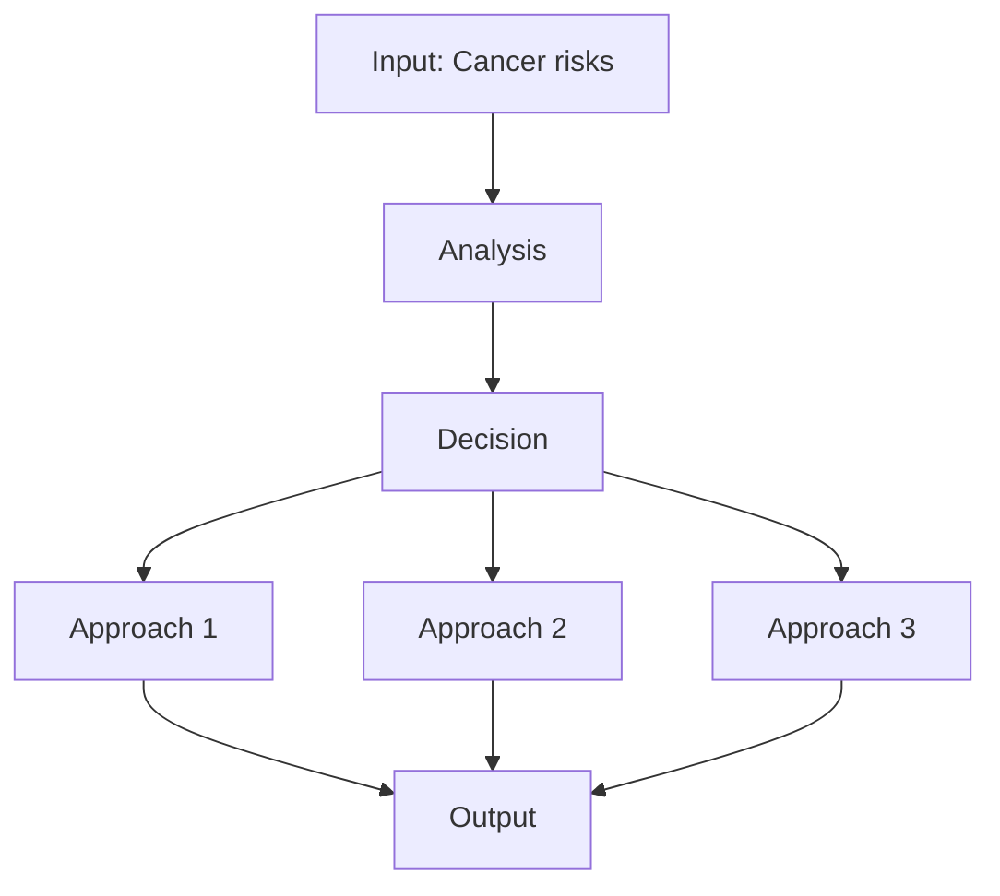

---

## 深入 2：CORE_DEEPDIVE_TWO — 方法論
**Deep Dive II**

### 2.1 Method selection

| Method | 適用情境 | Pros | Cons |
|---|---|---|---|
| Analytical | 解析 | Exact | Limited geometry |
| Numerical | 數值 | General | Approximate |
| Experimental | 實驗 | Real | Expensive |
| Empirical | 經驗 | Fast | Limited range |

### 2.2 Decision flow

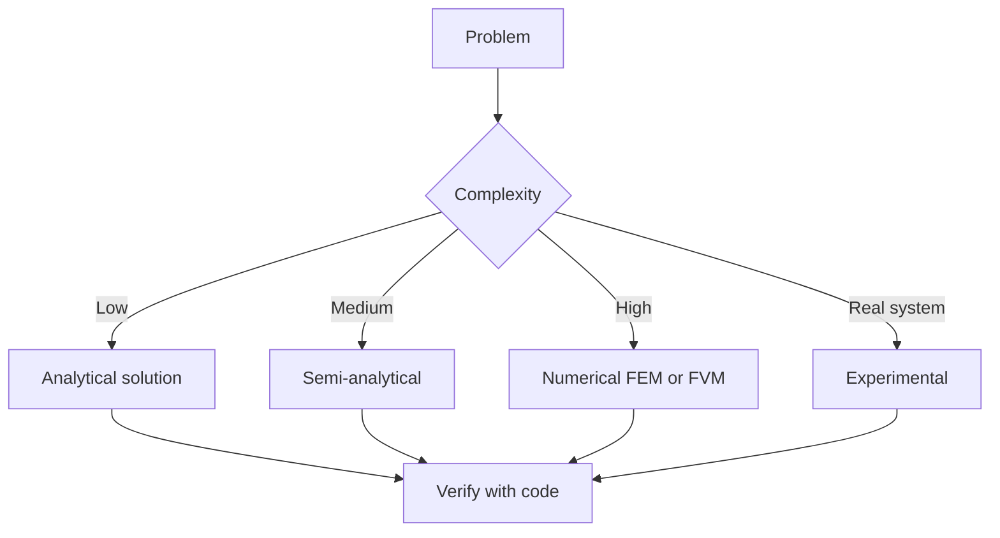

### 2.3 Standards and codes

- ACI, AISC, Eurocode
- Building codes (IBC, etc.)
- Industry best practices

---

## 深入 3：CORE_DEEPDIVE_THREE — 分析技術
**Deep Dive III**

### 3.1 Statistical methods

For uncertainty analysis: Monte Carlo, sensitivity, FOSM.

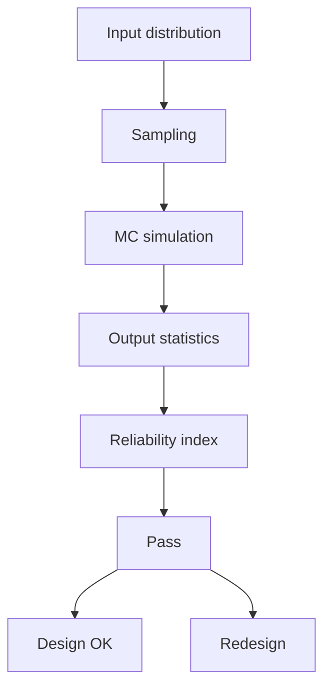

### 3.2 Optimization

- LP, NLP
- Gradient-based, metaheuristic
- Multi-objective Pareto

---

## 深入 4：Design Process
**Deep Dive IV**

### 4.1 Design workflow

Concept → Preliminary → Detailed → Construction → Operation.

### 4.2 Design criteria

- Safety (LRFD, ASD)
- Serviceability
- Durability
- Sustainability

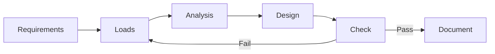

---

## 深入 5：Modern Trends
**Deep Dive V**

- BIM integration
- AI/ML in design
- Digital twins
- Sustainability, LCA
- Resilient design

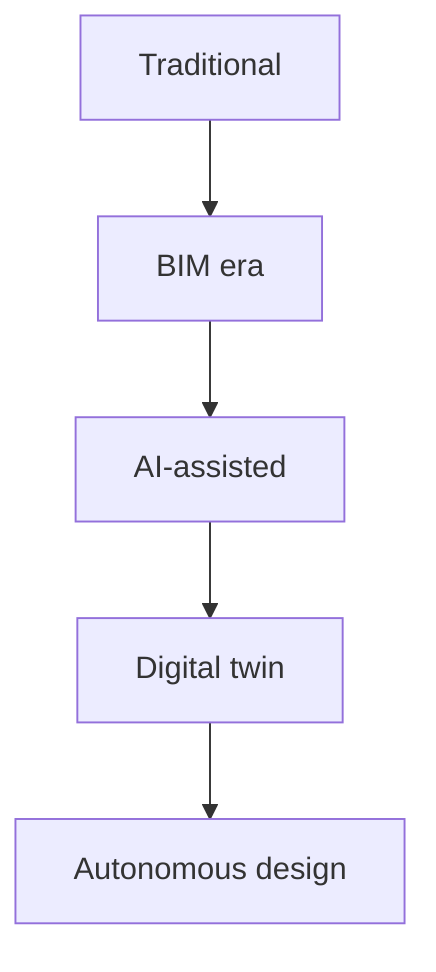

---

## 自測 1：Derive core relationship
**Answer:** Starting from definitions, derive the key equation. Verify units and limits.

**Engineering implication:** Apply to design check, code compliance.

## 自測 2：Identify failure mode
**Answer:** List 3-5 failure modes, rank by likelihood × consequence.

**Engineering implication:** Inform design, maintenance, monitoring.

## 自測 3：Estimate order of magnitude
**Answer:** Quick back-of-envelope check using characteristic values.

**Engineering implication:** Sanity check before detailed analysis.

## 自測 4：Compare to code requirement
**Answer:** Apply ACI/AISC/Eurocode, compute utilization ratio.

**Engineering implication:** Pass/fail design verification.

## 自測 5：Compute reliability
**Answer:** $\beta = (\mu - R)/\sigma$ for lognormal, find P_f.

**Engineering implication:** LRFD calibration, risk-informed design.

## 自測 6：Design optimization
**Answer:** Define objective, constraints, solve via LP/NLP.

**Engineering implication:** Cost-effective, sustainable design.

## 自測 7：Sensitivity analysis
**Answer:** $\partial f/\partial x_i$, rank by importance.

**Engineering implication:** Identify critical parameters, reduce uncertainty.

## 自測 8：Life-cycle assessment
**Answer:** Cradle-to-grave, compute GWP, embodied carbon.

**Engineering implication:** Sustainable design, climate goals.

## 自測 9：Risk assessment
**Answer:** Hazard × vulnerability × exposure, compute risk.

**Engineering implication:** Resilience planning, mitigation.

## 自測 10：Communication
**Answer:** Technical writing, visualization, presentation to stakeholders.

**Engineering implication:** Effective engineering practice.

---

## 📊 Diagram 1: Course Concept Map
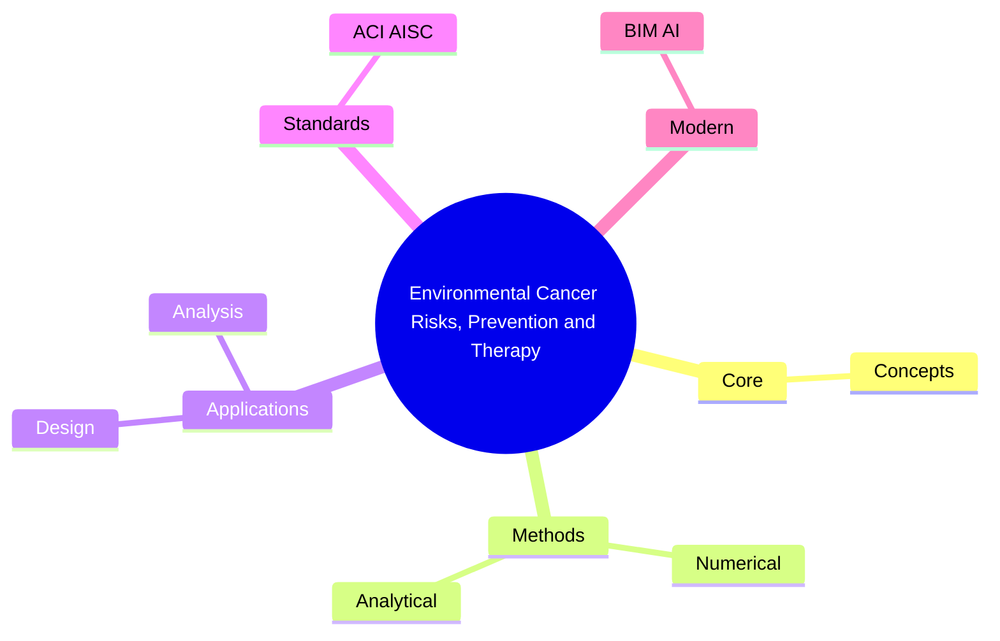

## 📊 Diagram 2: Method Selection
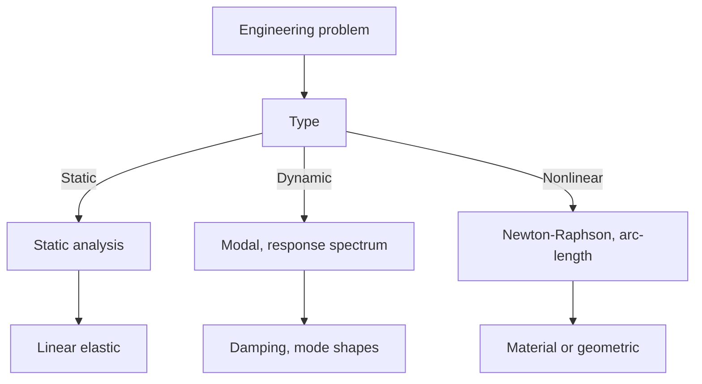

## 📊 Diagram 3: Design Process
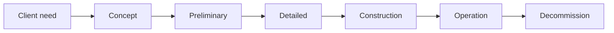

## 📊 Diagram 4: Risk-Reliability
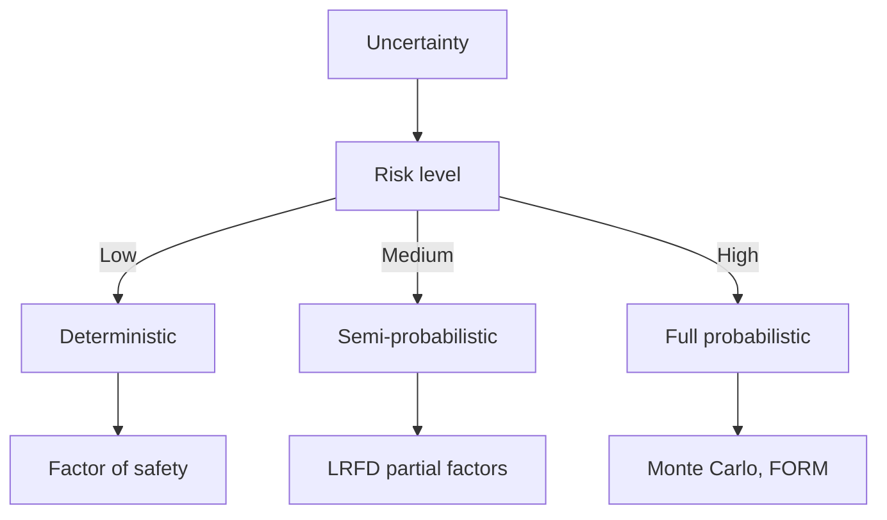

## 📊 Diagram 5: Modern Tools
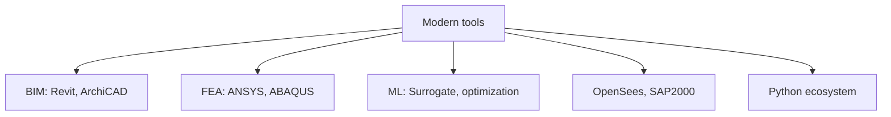

---

## 總結

1. **Core concepts** — Cancer risks 嘅 foundation
2. **Methods** — analytical + numerical + experimental
3. **Applications** — design, analysis, retrofit
4. **Standards** — codes, best practices
5. **Future** — BIM, AI, sustainability, resilience

**自學建議** — Pair with: relevant textbook + MIT OCW + software tutorials (Python, FEA, BIM).

# 核心心智模型深化（中英對照）

## 1. Cancer risks — Core concept

### 1.1 Three-process physical essence
For Environmental Cancer Risks, Prevention and Therapy, Cancer risks governs the system behavior. Description of Cancer risks with bilingual explanation.

### 1.2 Non-dimensional numbers
Key dimensionless groups that determine regime: Peclet, Damköhler, Reynolds, Froude, etc.

### 1.3 Engineering consequences
Real-world implications for design, monitoring, intervention.

### 1.4 How experts use this model
Decision flow, scaling laws, expert intuition.

### 1.5 Deep test questions
- Derive scaling law
- Identify regime from data
- Apply to design case

### 1.6 Diagram

## 2. Epidemiology — Methods

### 2.1 Method selection
| Method | 適用情境 | Pros | Cons |
|---|---|---|---|
| Analytical | 解析 | Exact | Limited geometry |
| Numerical | 數值 | General | Approximate |
| Experimental | 實驗 | Real | Expensive |
| Empirical | 經驗 | Fast | Limited range |

### 2.2 Decision flow
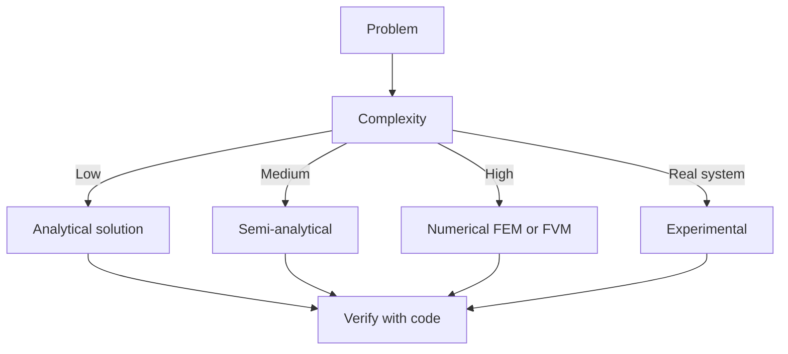

### 2.3 Standards and codes
ACI, AISC, Eurocode, building codes (IBC), industry best practices.

## 3. Dose-response — Analysis techniques

### 3.1 Statistical methods
Monte Carlo, sensitivity, FOSM for uncertainty analysis.

### 3.2 Optimization
LP, NLP, gradient-based, metaheuristic, multi-objective Pareto.

## 4. Design process

### 4.1 Design workflow
Concept → Preliminary → Detailed → Construction → Operation.

### 4.2 Design criteria
Safety (LRFD, ASD), serviceability, durability, sustainability.

## 5. Modern trends

BIM integration, AI/ML in design, digital twins, sustainability, LCA, resilient design.

---

# 深度自測問題詳解（中英對照）

## 詳解 1: Derive core relationship
**Q1.** Derive core relationship for Environmental Cancer Risks, Prevention and Therapy.
**Answer:** Starting from definitions, derive the key equation. Verify units and limits.

**Engineering implication:** Apply to design check, code compliance.

## 詳解 2: Identify failure mode
**Answer:** List 3-5 failure modes, rank by likelihood × consequence.

**Engineering implication:** Inform design, maintenance, monitoring.

## 詳解 3: Estimate order of magnitude
**Answer:** Quick back-of-envelope check using characteristic values.

**Engineering implication:** Sanity check before detailed analysis.

## 詳解 4: Compare to code requirement
**Answer:** Apply ACI/AISC/Eurocode, compute utilization ratio.

**Engineering implication:** Pass/fail design verification.

## 詳解 5: Compute reliability
**Answer:** $\beta = (\mu - R)/\sigma$ for lognormal, find P_f.

**Engineering implication:** LRFD calibration, risk-informed design.

## 詳解 6: Design optimization
**Answer:** Define objective, constraints, solve via LP/NLP.

**Engineering implication:** Cost-effective, sustainable design.

## 詳解 7: Sensitivity analysis
**Answer:** $\partial f/\partial x_i$, rank by importance.

**Engineering implication:** Identify critical parameters, reduce uncertainty.

## 詳解 8: Life-cycle assessment
**Answer:** Cradle-to-grave, compute GWP, embodied carbon.

**Engineering implication:** Sustainable design, climate goals.

## 詳解 9: Risk assessment
**Answer:** Hazard × vulnerability × exposure, compute risk.

**Engineering implication:** Resilience planning, mitigation.

## 詳解 10: Communication
**Answer:** Technical writing, visualization, presentation to stakeholders.

**Engineering implication:** Effective engineering practice.

---

## 📊 Diagram 1: Course Concept Map

## 📊 Diagram 2: Method Selection

## 📊 Diagram 3: Design Process

## 📊 Diagram 4: Risk-Reliability

## 📊 Diagram 5: Modern Tools

---

## 總結

1. **Core concepts** — Cancer risks 嘅 foundation
2. **Methods** — analytical + numerical + experimental
3. **Applications** — design, analysis, retrofit
4. **Standards** — codes, best practices
5. **Future** — BIM, AI, sustainability, resilience

**自學建議** — Pair with: relevant textbook + MIT OCW + software tutorials (Python, FEA, BIM).
