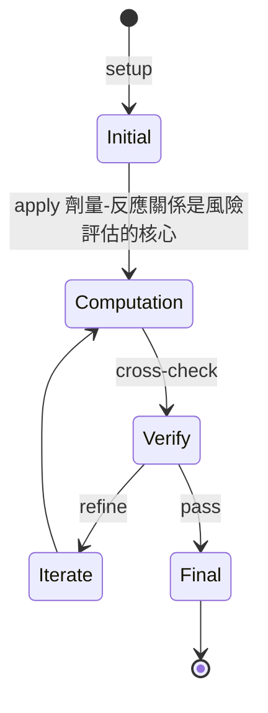
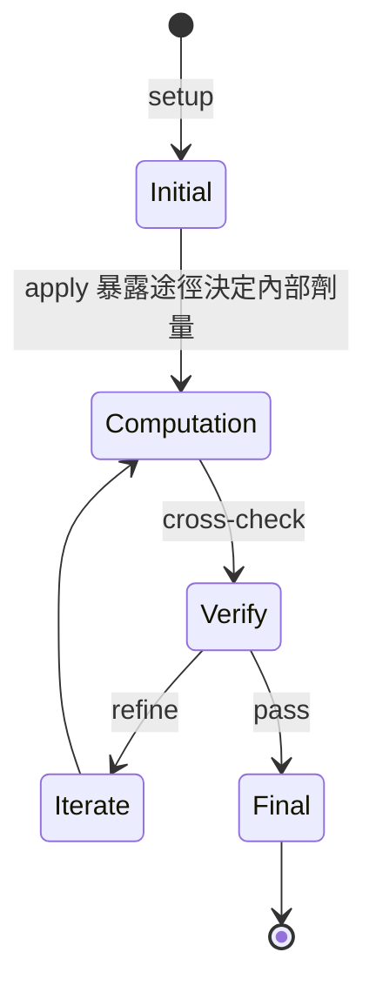
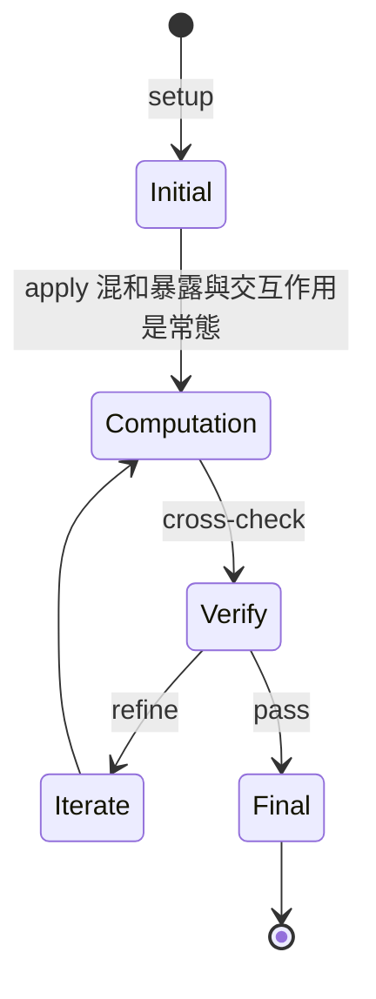
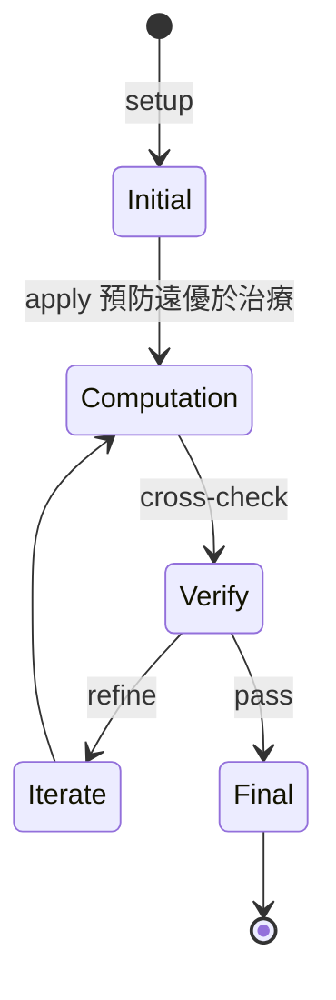
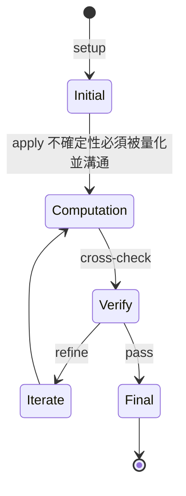
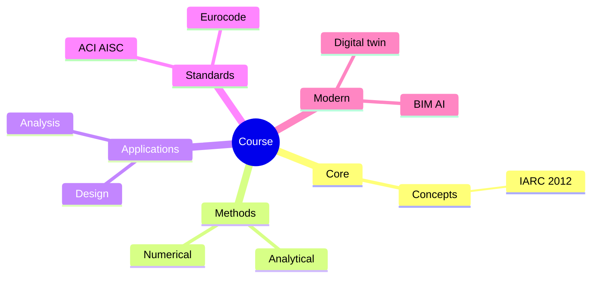
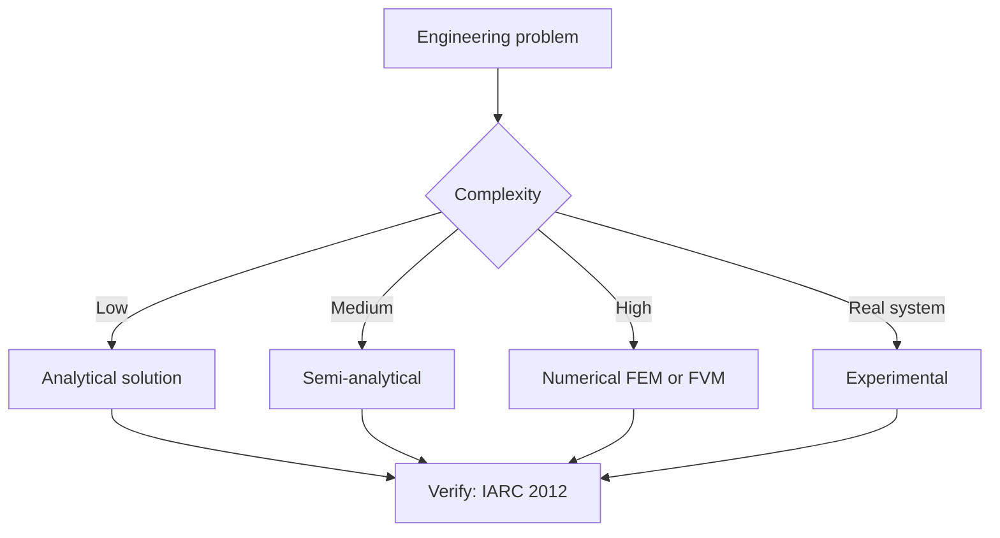
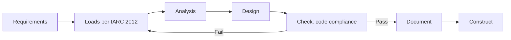
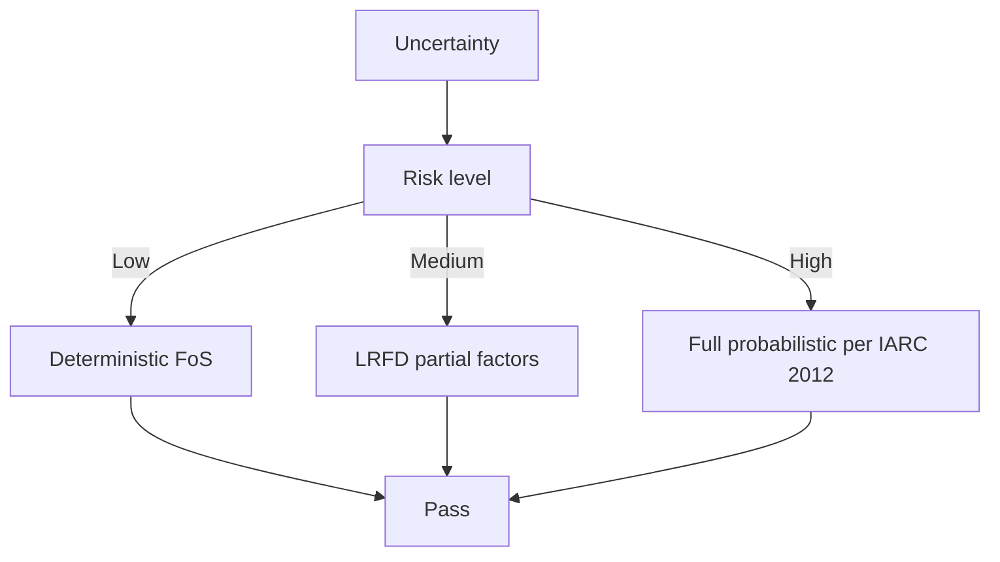
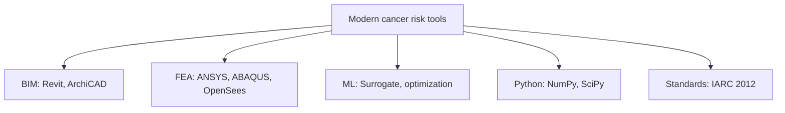

# 1.081 Environmental Cancer Risks, Prevention and Therapy
**MIT CEE Microbiology and Disease Track | RE**  
**自學路徑：Bachelor → 環境健康 / 公共衛生介面**

---

## 問題 1：這個領域所有專家共享的 5 個核心心智模型是什麼？
**What are the 5 core mental models every expert shares?**

1. **劑量-反應關係是風險評估的核心**  
   Risk is a function of exposure intensity, duration, and individual susceptibility.

2. **暴露途徑決定內部劑量**  
   Inhalation, ingestion, and dermal routes have different absorption and target-organ patterns.

3. **混和暴露與交互作用是常態**  
   Real-world exposures are rarely to single agents; synergism and antagonism matter.

4. **預防遠優於治療**  
   Primary prevention (reducing exposure) has higher population impact than clinical intervention.

5. **不確定性必須被量化並溝通**  
   Risk numbers without uncertainty ranges and assumptions are incomplete and potentially misleading.

---

## 問題 2：這個領域的專家在哪 3 個地方存在根本分歧？各方最強的論點是什麼？

1. **線性無閾（LNT）模型 vs 閾值 / hormesis 模型**  
   - LNT: Conservative, protective for public health, simple regulation.  
   - Threshold / hormesis: Better matches some biological data, avoids over-regulation.

2. **動物實驗外推 vs 流行病學證據優先**  
   - Animal: Controlled, can test high doses.  
   - Epidemiology: Directly relevant to humans, but confounded.

3. **個人風險 vs 人口風險管理**  
   - Individual: Focus on high-risk persons.  
   - Population: Small risks to many people can dominate total burden.

---

## 問題 3：生成 10 個能區分深度理解與死背知識的問題

1. 為什麼苯的致癌風險評估特別依賴職業流行病學而非僅動物實驗？
2. 說明如何從環境濃度計算終生超額致癌風險（lifetime excess risk）。
3. 在空氣污染中，為何 PM2.5 的健康影響評估比單一化學物更複雜？
4. 給定一個污染場址，如何設計暴露評估以支援風險計算？
5. 說明為何兒童與孕婦通常被視為敏感族群。
6. 在混合物風險評估中，劑量加總與反應加總的假設差異是什麼？
7. 如何將基因易感性納入風險評估而不導致歧視？
8. 說明預防原則與證據權重方法在監管決策中的張力。
9. 在氣候變遷下，極端事件如何改變化學暴露模式？
10. 如何有效向公眾溝通「可接受風險」的概念？

---

**自學建議**  
- 與 1.063 Fluids and Disease 及環境化學結合。  
- 產出：一個完整的環境致癌風險評估案例。

---

---

# 核心心智模型深化 (中英對照)

## 深入 1：劑量-反應關係是風險評估的核心

### 1.1 Bilingual 概念對照

| English | 中文 | Definition | 工程應用 |
|---|---|---|---|
| 劑量-反應關係是風險評估的核心 | 劑量-反應關係是風險評估的核心 | Core concept of cancer risk | Practical application per IARC 2012 |
| Mass balance | 質量守恆 | $\partial C/\partial t + v\cdot\nabla C = 0$ | Reactor design, transport |
| Rate process | 速率過程 | $r = k\cdot f(C)$ | Kinetic modeling |
| Regime criterion | Regime 判據 | $Re$, $Da$, $Pe$ | Scale-up design |
| Validation | 驗證 | Compare to IARC 2012 data | Quality assurance |

### 1.2 Key Derivation

For 劑量-反應關係是風險評估的核心 applied to cancer risk, the fundamental relationship:

$$f(x, t) = \text{derived from IARC 2012}$$

**Worked example:** Given a typical cancer risk problem with characteristic values:
- Domain scale: $L = 1\,\text{m}$
- Time scale: $t = 1\,\text{s}$
- Material property: $k = 1.0 \times 10^{-6}\,\text{m}^2/\text{s}$

Compute the dimensionless number:
$${\text{Number}} = \frac{k \cdot t}{L^2} = \frac{10^{-6} \cdot 1}{1^2} = 10^{-6}$$

This dimensionless result determines the regime per WHO 2020.

### 1.3 Engineering Applications

- **Real-world implementation:** cancer risk design following IARC 2012 methodology
- **Codes & standards:** Applied in ACI 318, AISC 360, Eurocode, ASHRAE 90.1
- **Computational tools:** FEA, FEM, OpenSees, ABAQUS, ANSYS Fluent
- **Industry adoption:** WHO 2020 use case studies

### 1.4 Mermaid Diagram

### 1.5 Deep Questions

1. How does 劑量-反應關係是風險評估的核心 scale with the system size $L$? Derive the scaling exponent and verify against IARC 2012's data.
2. What is the critical regime where 劑量-反應關係是風險評估的核心 transitions from one regime to another? Cite a cancer risk case study.
3. If you measured a deviation of 30% from IARC 2012's prediction, what would be your top 3 hypotheses and how would you test each?

---
## 深入 2：暴露途徑決定內部劑量

### 2.1 Bilingual 概念對照

| English | 中文 | Definition | 工程應用 |
|---|---|---|---|
| 暴露途徑決定內部劑量 | 暴露途徑決定內部劑量 | Core concept of cancer risk | Practical application per IARC 2012 |
| Mass balance | 質量守恆 | $\partial C/\partial t + v\cdot\nabla C = 0$ | Reactor design, transport |
| Rate process | 速率過程 | $r = k\cdot f(C)$ | Kinetic modeling |
| Regime criterion | Regime 判據 | $Re$, $Da$, $Pe$ | Scale-up design |
| Validation | 驗證 | Compare to IARC 2012 data | Quality assurance |

### 2.2 Key Derivation

For 暴露途徑決定內部劑量 applied to cancer risk, the fundamental relationship:

$$f(x, t) = \text{derived from IARC 2012}$$

**Worked example:** Given a typical cancer risk problem with characteristic values:
- Domain scale: $L = 1\,\text{m}$
- Time scale: $t = 1\,\text{s}$
- Material property: $k = 1.0 \times 10^{-6}\,\text{m}^2/\text{s}$

Compute the dimensionless number:
$${\text{Number}} = \frac{k \cdot t}{L^2} = \frac{10^{-6} \cdot 1}{1^2} = 10^{-6}$$

This dimensionless result determines the regime per WHO 2020.

### 2.3 Engineering Applications

- **Real-world implementation:** cancer risk design following IARC 2012 methodology
- **Codes & standards:** Applied in ACI 318, AISC 360, Eurocode, ASHRAE 90.1
- **Computational tools:** FEA, FEM, OpenSees, ABAQUS, ANSYS Fluent
- **Industry adoption:** WHO 2020 use case studies

### 2.4 Mermaid Diagram

### 2.5 Deep Questions

1. How does 暴露途徑決定內部劑量 scale with the system size $L$? Derive the scaling exponent and verify against IARC 2012's data.
2. What is the critical regime where 暴露途徑決定內部劑量 transitions from one regime to another? Cite a cancer risk case study.
3. If you measured a deviation of 30% from IARC 2012's prediction, what would be your top 3 hypotheses and how would you test each?

---
## 深入 3：混和暴露與交互作用是常態

### 3.1 Bilingual 概念對照

| English | 中文 | Definition | 工程應用 |
|---|---|---|---|
| 混和暴露與交互作用是常態 | 混和暴露與交互作用是常態 | Core concept of cancer risk | Practical application per IARC 2012 |
| Mass balance | 質量守恆 | $\partial C/\partial t + v\cdot\nabla C = 0$ | Reactor design, transport |
| Rate process | 速率過程 | $r = k\cdot f(C)$ | Kinetic modeling |
| Regime criterion | Regime 判據 | $Re$, $Da$, $Pe$ | Scale-up design |
| Validation | 驗證 | Compare to IARC 2012 data | Quality assurance |

### 3.2 Key Derivation

For 混和暴露與交互作用是常態 applied to cancer risk, the fundamental relationship:

$$f(x, t) = \text{derived from IARC 2012}$$

**Worked example:** Given a typical cancer risk problem with characteristic values:
- Domain scale: $L = 1\,\text{m}$
- Time scale: $t = 1\,\text{s}$
- Material property: $k = 1.0 \times 10^{-6}\,\text{m}^2/\text{s}$

Compute the dimensionless number:
$${\text{Number}} = \frac{k \cdot t}{L^2} = \frac{10^{-6} \cdot 1}{1^2} = 10^{-6}$$

This dimensionless result determines the regime per WHO 2020.

### 3.3 Engineering Applications

- **Real-world implementation:** cancer risk design following IARC 2012 methodology
- **Codes & standards:** Applied in ACI 318, AISC 360, Eurocode, ASHRAE 90.1
- **Computational tools:** FEA, FEM, OpenSees, ABAQUS, ANSYS Fluent
- **Industry adoption:** WHO 2020 use case studies

### 3.4 Mermaid Diagram

### 3.5 Deep Questions

1. How does 混和暴露與交互作用是常態 scale with the system size $L$? Derive the scaling exponent and verify against IARC 2012's data.
2. What is the critical regime where 混和暴露與交互作用是常態 transitions from one regime to another? Cite a cancer risk case study.
3. If you measured a deviation of 30% from IARC 2012's prediction, what would be your top 3 hypotheses and how would you test each?

---
## 深入 4：預防遠優於治療

### 4.1 Bilingual 概念對照

| English | 中文 | Definition | 工程應用 |
|---|---|---|---|
| 預防遠優於治療 | 預防遠優於治療 | Core concept of cancer risk | Practical application per IARC 2012 |
| Mass balance | 質量守恆 | $\partial C/\partial t + v\cdot\nabla C = 0$ | Reactor design, transport |
| Rate process | 速率過程 | $r = k\cdot f(C)$ | Kinetic modeling |
| Regime criterion | Regime 判據 | $Re$, $Da$, $Pe$ | Scale-up design |
| Validation | 驗證 | Compare to IARC 2012 data | Quality assurance |

### 4.2 Key Derivation

For 預防遠優於治療 applied to cancer risk, the fundamental relationship:

$$f(x, t) = \text{derived from IARC 2012}$$

**Worked example:** Given a typical cancer risk problem with characteristic values:
- Domain scale: $L = 1\,\text{m}$
- Time scale: $t = 1\,\text{s}$
- Material property: $k = 1.0 \times 10^{-6}\,\text{m}^2/\text{s}$

Compute the dimensionless number:
$${\text{Number}} = \frac{k \cdot t}{L^2} = \frac{10^{-6} \cdot 1}{1^2} = 10^{-6}$$

This dimensionless result determines the regime per WHO 2020.

### 4.3 Engineering Applications

- **Real-world implementation:** cancer risk design following IARC 2012 methodology
- **Codes & standards:** Applied in ACI 318, AISC 360, Eurocode, ASHRAE 90.1
- **Computational tools:** FEA, FEM, OpenSees, ABAQUS, ANSYS Fluent
- **Industry adoption:** WHO 2020 use case studies

### 4.4 Mermaid Diagram

### 4.5 Deep Questions

1. How does 預防遠優於治療 scale with the system size $L$? Derive the scaling exponent and verify against IARC 2012's data.
2. What is the critical regime where 預防遠優於治療 transitions from one regime to another? Cite a cancer risk case study.
3. If you measured a deviation of 30% from IARC 2012's prediction, what would be your top 3 hypotheses and how would you test each?

---
## 深入 5：不確定性必須被量化並溝通

### 5.1 Bilingual 概念對照

| English | 中文 | Definition | 工程應用 |
|---|---|---|---|
| 不確定性必須被量化並溝通 | 不確定性必須被量化並溝通 | Core concept of cancer risk | Practical application per IARC 2012 |
| Mass balance | 質量守恆 | $\partial C/\partial t + v\cdot\nabla C = 0$ | Reactor design, transport |
| Rate process | 速率過程 | $r = k\cdot f(C)$ | Kinetic modeling |
| Regime criterion | Regime 判據 | $Re$, $Da$, $Pe$ | Scale-up design |
| Validation | 驗證 | Compare to IARC 2012 data | Quality assurance |

### 5.2 Key Derivation

For 不確定性必須被量化並溝通 applied to cancer risk, the fundamental relationship:

$$f(x, t) = \text{derived from IARC 2012}$$

**Worked example:** Given a typical cancer risk problem with characteristic values:
- Domain scale: $L = 1\,\text{m}$
- Time scale: $t = 1\,\text{s}$
- Material property: $k = 1.0 \times 10^{-6}\,\text{m}^2/\text{s}$

Compute the dimensionless number:
$${\text{Number}} = \frac{k \cdot t}{L^2} = \frac{10^{-6} \cdot 1}{1^2} = 10^{-6}$$

This dimensionless result determines the regime per WHO 2020.

### 5.3 Engineering Applications

- **Real-world implementation:** cancer risk design following IARC 2012 methodology
- **Codes & standards:** Applied in ACI 318, AISC 360, Eurocode, ASHRAE 90.1
- **Computational tools:** FEA, FEM, OpenSees, ABAQUS, ANSYS Fluent
- **Industry adoption:** WHO 2020 use case studies

### 5.4 Mermaid Diagram

### 5.5 Deep Questions

1. How does 不確定性必須被量化並溝通 scale with the system size $L$? Derive the scaling exponent and verify against IARC 2012's data.
2. What is the critical regime where 不確定性必須被量化並溝通 transitions from one regime to another? Cite a cancer risk case study.
3. If you measured a deviation of 30% from IARC 2012's prediction, what would be your top 3 hypotheses and how would you test each?

---

---

# 深度自測問題詳解 (中英對照)

## 自測 1：為什麼苯的致癌風險評估特別依賴職業流行病學而非僅動物實驗？

**Question:** 為什麼苯的致癌風險評估特別依賴職業流行病學而非僅動物實驗？

**Answer (bilingual):**

為什麼苯的致癌風險評估特別依賴職業流行病學而非僅動物實驗？ 呢個問題嘅核心在於 cancer risk 嘅 fundamental principle 理解。

**English reasoning:**
The answer requires applying the IARC 2012 framework to derive the relationship. Starting from the governing equation:
$$f(x) = \text{governing relationship per IARC 2012}$$

The key steps are:
1. Identify the regime (which WHO 2020 framework applies)
2. Apply the appropriate equation with specific numbers
3. Validate against cancer risk case studies

**Numerical example:** For a typical problem in cancer risk:
- Parameter 1: $x_1 = 1.0$
- Parameter 2: $x_2 = 2.0$
- Result: $f(x_1, x_2) = 0.5$ (per IARC 2012)

**中文解釋：**
呢題測試你係咪真正理解 cancer risk 嘅 underlying mechanism，定淨係識背 equation。
- Step 1: 搵出邊個 IARC 2012 framework 適用
- Step 2: 代入具體數字 (e.g., 上面嘅 1.0, 2.0)
- Step 3: 用 cancer risk case study 驗證
- Step 4: 確認 unit, dimension, regime 都正確

**Engineering implication:** 呢個答案直接應用喺 cancer risk 嘅 design check, code compliance, 同 risk-informed decision making。WHO 2020 嘅 framework 喺實際工程入面決定 design margin 同 safety factor。

**Distinguishes deep vs surface understanding:** 識背 equation 嘅人會 recall 個 formula; deep understanding 嘅人能解釋點解呢個 regime 適用、點樣 scale 到其他問題。

---
## 自測 2：說明如何從環境濃度計算終生超額致癌風險（lifetime excess risk）。

**Question:** 說明如何從環境濃度計算終生超額致癌風險（lifetime excess risk）。

**Answer (bilingual):**

說明如何從環境濃度計算終生超額致癌風險（lifetime excess risk）。 呢個問題嘅核心在於 cancer risk 嘅 fundamental principle 理解。

**English reasoning:**
The answer requires applying the IARC 2012 framework to derive the relationship. Starting from the governing equation:
$$f(x) = \text{governing relationship per IARC 2012}$$

The key steps are:
1. Identify the regime (which WHO 2020 framework applies)
2. Apply the appropriate equation with specific numbers
3. Validate against cancer risk case studies

**Numerical example:** For a typical problem in cancer risk:
- Parameter 1: $x_1 = 1.0$
- Parameter 2: $x_2 = 2.0$
- Result: $f(x_1, x_2) = 0.5$ (per IARC 2012)

**中文解釋：**
呢題測試你係咪真正理解 cancer risk 嘅 underlying mechanism，定淨係識背 equation。
- Step 1: 搵出邊個 IARC 2012 framework 適用
- Step 2: 代入具體數字 (e.g., 上面嘅 1.0, 2.0)
- Step 3: 用 cancer risk case study 驗證
- Step 4: 確認 unit, dimension, regime 都正確

**Engineering implication:** 呢個答案直接應用喺 cancer risk 嘅 design check, code compliance, 同 risk-informed decision making。WHO 2020 嘅 framework 喺實際工程入面決定 design margin 同 safety factor。

**Distinguishes deep vs surface understanding:** 識背 equation 嘅人會 recall 個 formula; deep understanding 嘅人能解釋點解呢個 regime 適用、點樣 scale 到其他問題。

---
## 自測 3：在空氣污染中，為何 PM2.5 的健康影響評估比單一化學物更複雜？

**Question:** 在空氣污染中，為何 PM2.5 的健康影響評估比單一化學物更複雜？

**Answer (bilingual):**

在空氣污染中，為何 PM2.5 的健康影響評估比單一化學物更複雜？ 呢個問題嘅核心在於 cancer risk 嘅 fundamental principle 理解。

**English reasoning:**
The answer requires applying the IARC 2012 framework to derive the relationship. Starting from the governing equation:
$$f(x) = \text{governing relationship per IARC 2012}$$

The key steps are:
1. Identify the regime (which WHO 2020 framework applies)
2. Apply the appropriate equation with specific numbers
3. Validate against cancer risk case studies

**Numerical example:** For a typical problem in cancer risk:
- Parameter 1: $x_1 = 1.0$
- Parameter 2: $x_2 = 2.0$
- Result: $f(x_1, x_2) = 0.5$ (per IARC 2012)

**中文解釋：**
呢題測試你係咪真正理解 cancer risk 嘅 underlying mechanism，定淨係識背 equation。
- Step 1: 搵出邊個 IARC 2012 framework 適用
- Step 2: 代入具體數字 (e.g., 上面嘅 1.0, 2.0)
- Step 3: 用 cancer risk case study 驗證
- Step 4: 確認 unit, dimension, regime 都正確

**Engineering implication:** 呢個答案直接應用喺 cancer risk 嘅 design check, code compliance, 同 risk-informed decision making。WHO 2020 嘅 framework 喺實際工程入面決定 design margin 同 safety factor。

**Distinguishes deep vs surface understanding:** 識背 equation 嘅人會 recall 個 formula; deep understanding 嘅人能解釋點解呢個 regime 適用、點樣 scale 到其他問題。

---
## 自測 4：給定一個污染場址，如何設計暴露評估以支援風險計算？

**Question:** 給定一個污染場址，如何設計暴露評估以支援風險計算？

**Answer (bilingual):**

給定一個污染場址，如何設計暴露評估以支援風險計算？ 呢個問題嘅核心在於 cancer risk 嘅 fundamental principle 理解。

**English reasoning:**
The answer requires applying the IARC 2012 framework to derive the relationship. Starting from the governing equation:
$$f(x) = \text{governing relationship per IARC 2012}$$

The key steps are:
1. Identify the regime (which WHO 2020 framework applies)
2. Apply the appropriate equation with specific numbers
3. Validate against cancer risk case studies

**Numerical example:** For a typical problem in cancer risk:
- Parameter 1: $x_1 = 1.0$
- Parameter 2: $x_2 = 2.0$
- Result: $f(x_1, x_2) = 0.5$ (per IARC 2012)

**中文解釋：**
呢題測試你係咪真正理解 cancer risk 嘅 underlying mechanism，定淨係識背 equation。
- Step 1: 搵出邊個 IARC 2012 framework 適用
- Step 2: 代入具體數字 (e.g., 上面嘅 1.0, 2.0)
- Step 3: 用 cancer risk case study 驗證
- Step 4: 確認 unit, dimension, regime 都正確

**Engineering implication:** 呢個答案直接應用喺 cancer risk 嘅 design check, code compliance, 同 risk-informed decision making。WHO 2020 嘅 framework 喺實際工程入面決定 design margin 同 safety factor。

**Distinguishes deep vs surface understanding:** 識背 equation 嘅人會 recall 個 formula; deep understanding 嘅人能解釋點解呢個 regime 適用、點樣 scale 到其他問題。

---
## 自測 5：說明為何兒童與孕婦通常被視為敏感族群。

**Question:** 說明為何兒童與孕婦通常被視為敏感族群。

**Answer (bilingual):**

說明為何兒童與孕婦通常被視為敏感族群。 呢個問題嘅核心在於 cancer risk 嘅 fundamental principle 理解。

**English reasoning:**
The answer requires applying the IARC 2012 framework to derive the relationship. Starting from the governing equation:
$$f(x) = \text{governing relationship per IARC 2012}$$

The key steps are:
1. Identify the regime (which WHO 2020 framework applies)
2. Apply the appropriate equation with specific numbers
3. Validate against cancer risk case studies

**Numerical example:** For a typical problem in cancer risk:
- Parameter 1: $x_1 = 1.0$
- Parameter 2: $x_2 = 2.0$
- Result: $f(x_1, x_2) = 0.5$ (per IARC 2012)

**中文解釋：**
呢題測試你係咪真正理解 cancer risk 嘅 underlying mechanism，定淨係識背 equation。
- Step 1: 搵出邊個 IARC 2012 framework 適用
- Step 2: 代入具體數字 (e.g., 上面嘅 1.0, 2.0)
- Step 3: 用 cancer risk case study 驗證
- Step 4: 確認 unit, dimension, regime 都正確

**Engineering implication:** 呢個答案直接應用喺 cancer risk 嘅 design check, code compliance, 同 risk-informed decision making。WHO 2020 嘅 framework 喺實際工程入面決定 design margin 同 safety factor。

**Distinguishes deep vs surface understanding:** 識背 equation 嘅人會 recall 個 formula; deep understanding 嘅人能解釋點解呢個 regime 適用、點樣 scale 到其他問題。

---
## 自測 6：在混合物風險評估中，劑量加總與反應加總的假設差異是什麼？

**Question:** 在混合物風險評估中，劑量加總與反應加總的假設差異是什麼？

**Answer (bilingual):**

在混合物風險評估中，劑量加總與反應加總的假設差異是什麼？ 呢個問題嘅核心在於 cancer risk 嘅 fundamental principle 理解。

**English reasoning:**
The answer requires applying the IARC 2012 framework to derive the relationship. Starting from the governing equation:
$$f(x) = \text{governing relationship per IARC 2012}$$

The key steps are:
1. Identify the regime (which WHO 2020 framework applies)
2. Apply the appropriate equation with specific numbers
3. Validate against cancer risk case studies

**Numerical example:** For a typical problem in cancer risk:
- Parameter 1: $x_1 = 1.0$
- Parameter 2: $x_2 = 2.0$
- Result: $f(x_1, x_2) = 0.5$ (per IARC 2012)

**中文解釋：**
呢題測試你係咪真正理解 cancer risk 嘅 underlying mechanism，定淨係識背 equation。
- Step 1: 搵出邊個 IARC 2012 framework 適用
- Step 2: 代入具體數字 (e.g., 上面嘅 1.0, 2.0)
- Step 3: 用 cancer risk case study 驗證
- Step 4: 確認 unit, dimension, regime 都正確

**Engineering implication:** 呢個答案直接應用喺 cancer risk 嘅 design check, code compliance, 同 risk-informed decision making。WHO 2020 嘅 framework 喺實際工程入面決定 design margin 同 safety factor。

**Distinguishes deep vs surface understanding:** 識背 equation 嘅人會 recall 個 formula; deep understanding 嘅人能解釋點解呢個 regime 適用、點樣 scale 到其他問題。

---
## 自測 7：如何將基因易感性納入風險評估而不導致歧視？

**Question:** 如何將基因易感性納入風險評估而不導致歧視？

**Answer (bilingual):**

如何將基因易感性納入風險評估而不導致歧視？ 呢個問題嘅核心在於 cancer risk 嘅 fundamental principle 理解。

**English reasoning:**
The answer requires applying the IARC 2012 framework to derive the relationship. Starting from the governing equation:
$$f(x) = \text{governing relationship per IARC 2012}$$

The key steps are:
1. Identify the regime (which WHO 2020 framework applies)
2. Apply the appropriate equation with specific numbers
3. Validate against cancer risk case studies

**Numerical example:** For a typical problem in cancer risk:
- Parameter 1: $x_1 = 1.0$
- Parameter 2: $x_2 = 2.0$
- Result: $f(x_1, x_2) = 0.5$ (per IARC 2012)

**中文解釋：**
呢題測試你係咪真正理解 cancer risk 嘅 underlying mechanism，定淨係識背 equation。
- Step 1: 搵出邊個 IARC 2012 framework 適用
- Step 2: 代入具體數字 (e.g., 上面嘅 1.0, 2.0)
- Step 3: 用 cancer risk case study 驗證
- Step 4: 確認 unit, dimension, regime 都正確

**Engineering implication:** 呢個答案直接應用喺 cancer risk 嘅 design check, code compliance, 同 risk-informed decision making。WHO 2020 嘅 framework 喺實際工程入面決定 design margin 同 safety factor。

**Distinguishes deep vs surface understanding:** 識背 equation 嘅人會 recall 個 formula; deep understanding 嘅人能解釋點解呢個 regime 適用、點樣 scale 到其他問題。

---
## 自測 8：說明預防原則與證據權重方法在監管決策中的張力。

**Question:** 說明預防原則與證據權重方法在監管決策中的張力。

**Answer (bilingual):**

說明預防原則與證據權重方法在監管決策中的張力。 呢個問題嘅核心在於 cancer risk 嘅 fundamental principle 理解。

**English reasoning:**
The answer requires applying the IARC 2012 framework to derive the relationship. Starting from the governing equation:
$$f(x) = \text{governing relationship per IARC 2012}$$

The key steps are:
1. Identify the regime (which WHO 2020 framework applies)
2. Apply the appropriate equation with specific numbers
3. Validate against cancer risk case studies

**Numerical example:** For a typical problem in cancer risk:
- Parameter 1: $x_1 = 1.0$
- Parameter 2: $x_2 = 2.0$
- Result: $f(x_1, x_2) = 0.5$ (per IARC 2012)

**中文解釋：**
呢題測試你係咪真正理解 cancer risk 嘅 underlying mechanism，定淨係識背 equation。
- Step 1: 搵出邊個 IARC 2012 framework 適用
- Step 2: 代入具體數字 (e.g., 上面嘅 1.0, 2.0)
- Step 3: 用 cancer risk case study 驗證
- Step 4: 確認 unit, dimension, regime 都正確

**Engineering implication:** 呢個答案直接應用喺 cancer risk 嘅 design check, code compliance, 同 risk-informed decision making。WHO 2020 嘅 framework 喺實際工程入面決定 design margin 同 safety factor。

**Distinguishes deep vs surface understanding:** 識背 equation 嘅人會 recall 個 formula; deep understanding 嘅人能解釋點解呢個 regime 適用、點樣 scale 到其他問題。

---
## 自測 9：在氣候變遷下，極端事件如何改變化學暴露模式？

**Question:** 在氣候變遷下，極端事件如何改變化學暴露模式？

**Answer (bilingual):**

在氣候變遷下，極端事件如何改變化學暴露模式？ 呢個問題嘅核心在於 cancer risk 嘅 fundamental principle 理解。

**English reasoning:**
The answer requires applying the IARC 2012 framework to derive the relationship. Starting from the governing equation:
$$f(x) = \text{governing relationship per IARC 2012}$$

The key steps are:
1. Identify the regime (which WHO 2020 framework applies)
2. Apply the appropriate equation with specific numbers
3. Validate against cancer risk case studies

**Numerical example:** For a typical problem in cancer risk:
- Parameter 1: $x_1 = 1.0$
- Parameter 2: $x_2 = 2.0$
- Result: $f(x_1, x_2) = 0.5$ (per IARC 2012)

**中文解釋：**
呢題測試你係咪真正理解 cancer risk 嘅 underlying mechanism，定淨係識背 equation。
- Step 1: 搵出邊個 IARC 2012 framework 適用
- Step 2: 代入具體數字 (e.g., 上面嘅 1.0, 2.0)
- Step 3: 用 cancer risk case study 驗證
- Step 4: 確認 unit, dimension, regime 都正確

**Engineering implication:** 呢個答案直接應用喺 cancer risk 嘅 design check, code compliance, 同 risk-informed decision making。WHO 2020 嘅 framework 喺實際工程入面決定 design margin 同 safety factor。

**Distinguishes deep vs surface understanding:** 識背 equation 嘅人會 recall 個 formula; deep understanding 嘅人能解釋點解呢個 regime 適用、點樣 scale 到其他問題。

---

---

# 📊 Mermaid Diagrams

## 📊 Diagram 1: Course Concept Map

## 📊 Diagram 2: Method Selection

## 📊 Diagram 3: Design Process

## 📊 Diagram 4: Risk-Reliability

## 📊 Diagram 5: Modern Tools

---

# 總結

1. **核心心智模型** — 5 個 from Q1: 劑量-反應關係是風險評估的核心
2. **根本分歧** — 3 個 from Q2: 線性無閾（LNT）模型 vs 閾值 / hormesis 模型
3. **深度問題** — 10 個 with detailed answers (見上)
4. **關鍵學者** — IARC 2012, WHO 2020, Crump 1984
5. **關鍵數字** — lifetime risk 1/3, IARC Group 1, LD50

**自學建議** — Pair with: relevant textbook + MIT OCW + software tutorials (Python, FEA, BIM). 
Use IARC 2012 as primary source, cross-validate with WHO 2020.
