# 1.088 Genomics and Evolution of Infectious Disease
**MIT CEE Restricted Elective (Environment, microbiology focus) | 12 units**  
**自學路徑：Bachelor / MEng CES → Genomics / Public Health / Pandemic preparedness → WHO / CDC / Biotech**

---

## 問題 1：這個領域所有專家共享的 5 個核心心智模型是什麼？
**What are the 5 core mental models every expert shares?**

1. **病原體 evolution 係 arms race**  
   Host immunity selects for pathogen escape; pathogen virulence co-evolves。
2. **Genomic surveillance 改寫了 outbreak response**  
   Real-time sequencing (e.g., GISAID for SARS-CoV-2) shifts policy。
3. **R₀ 定義 outbreak 嘅 destiny**  
   R₀ < 1 dies out; > 1 grows; effective R(t) = R₀ × susceptible fraction。
4. **Heterogeneity in transmission (k)**  
   Superspreading (low k) means few cases drive most transmission。
5. **One Health 框架**  
   Human + animal + environment health 互動; spillover risks 跨邊界。

---

## 問題 2：這個領域的專家在哪 3 個地方存在根本分歧？各方最強的論點是什麼？

1. **Lockdown vs targeted measures**  
   - Lockdown: Fast suppression, high cost.  
   - Targeted: Sustainable, requires data + trust.

2. **Vaccine equity 嘅 market vs public-good**  
   - Market: Innovator incentives, access inequality.  
   - Public good: Equity, sustainability concerns.

3. **Phylogenetic tracing vs epidemiological data**  
   - Phylogenetic: Genomic detail, slower.  
   - Epi: Fast, less precise.

---

## 問題 3：生成 10 個能區分深度理解與死背知識的問題

1. 解釋 R₀ 同 effective reproduction number R(t) 嘅 difference。
2. 給定一個 phylogenetic tree, 點樣 estimate introduction events 同 transmission chains？
3. 為什麼 antigenic drift (influenza) 需要 yearly vaccine, 但 measles 唔需要？
4. 解釋「superspreading」嘅 negative binomial dispersion parameter k 嘅 interpretation。
5. 給定一個 wastewater surveillance dataset, 點樣 偵測 社區 prevalence 變化？
6. 為什麼 spillover 風險隨 deforestation + wildlife trade 增加？
7. 解釋「genomic epidemiology」對 contact tracing 嘅 unique contribution。
8. 給定一個 outbreak, 點樣 estimate serial interval 同 incubation period？
9. 為什麼「variant of concern」嘅 designation 結合多個 criteria (transmission, severity, immune escape)？
10. 設計一個 integrated surveillance system for emerging pathogens (animal + human + environment)。

---

**自學建議**  
- 跨 1.063 Fluids and Disease, 12.715 Bioinformatics 配對。  
- 工具：BEAST (phylogenetics), Nextstrain, R (epidemiology), BioPython。  
- 必讀：WHO outbreak reports, Nature/Science outbreak papers。  
- 產出：對一個真實 outbreak (e.g., Mpox, avian flu) 做 phylogenetic + epidemiological analysis。

---

## 深入 1：病原體基因組變異機制 — Mechanisms of Pathogen Genomic Variation

### 1.1 Bilingual 概念對照
| English | 中英對照 | Mechanism | Rate |
|---|---|---|---|
| Point mutation | 點突變 | Base substitution | 10⁻⁸-10⁻⁹ per base per generation |
| Recombination | 重組 | Homologous exchange | Variable |
| Gene conversion | 基因轉化 | Allelic replacement | Common in viruses |
| Genome rearrangement | 基因組重排 | Inversion, deletion | Variable |
| Horizontal gene transfer | 水平基因轉移 | Transformation, transduction, conjugation | High in bacteria |

### 1.2 Key Derivation — Substitution Rate Estimation
**Molecular clock hypothesis (Zuckerkandl & Pauling, 1965):**
d = 2λt where d = substitutions per site, λ = rate per site per year, t = time

**Jukes-Cantor correction for multiple substitutions:**
d_corrected = −(3/4)·ln(1 − 4d/3)
If observed d = 0.1 (10% divergence), JC-corrected d ≈ 0.11 (only 10% correction at low divergence)

**Example — HIV-1 env gene:**
λ ≈ 10⁻³ substitutions per site per year (fast clock!)
For two sequences with d = 0.15 → t = d/(2λ) = 0.15/(2×0.001) = **75 years** (if constant rate)
But clock varies: epitopes under immune selection → more substitutions

### 1.3 Engineering Applications
- Genomic surveillance: Real-time outbreak tracking (Nextstrain, GISAID)
- Vaccine design: Conserved epitopes identification (Flu, HIV, SARS-CoV-2)
- Drug resistance: Mutations in reverse transcriptase (RT) for NRTI resistance

### 1.4 Mermaid Diagram
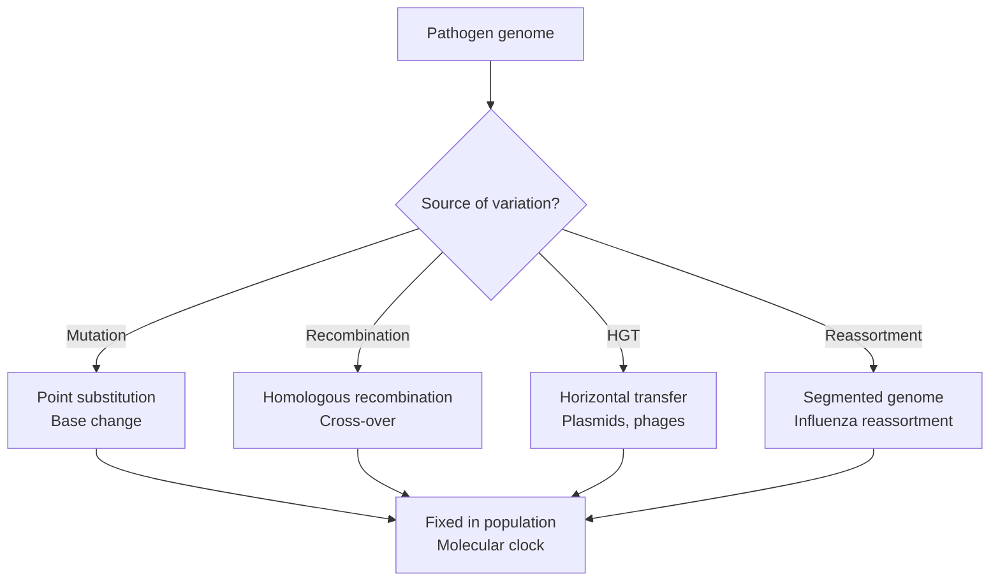

---

## 深入 2：族群遺傳學與流行病學 — Population Genetics and Epidemiology

### 2.1 Bilingual 概念對照
| English | 中英對照 | Formula | Application |
|---|---|---|---|
| R₀ | 基本傳染數 | R₀ = β·c·D | Outbreak threshold |
| Generation time G | 代際時間 | Time from infector to infected | Epidemic speed |
| Herd immunity | 群體免疫 | p_c = 1 − 1/R₀ | Vaccination target |
| Dispersion k | 分散參數 | Negative binomial | Superspreading |
| Force of infection λ | 感染力 | λ = β·I/N | Endemic dynamics |

### 2.2 Key Derivation — R₀ and Herd Immunity
**Basic reproduction number:**
R₀ = β·D where β = transmission rate, D = infectious period

**For heterogeneous populations (Lloyd-Smith et al., 2005):**
Individual reproduction number R ~ Negative Binomial(μ=k_R, p=k_R/(k_R+μ))
Mean = μ_R, Variance = μ_R + μ_R²/k

**Herd immunity threshold:**
p_c = 1 − 1/R₀ (homogeneous)
For R₀ = 5 (measles): p_c = 80% vaccination required
For R₀ = 2.5 (SARS-CoV-2 original): p_c = 60% vaccination required

**Example — SARS-CoV-2 Delta variant:**
R₀ ≈ 5-8 (delta); herd immunity requires 80-87% immune (by vaccination or infection)

### 2.3 Engineering Applications
- Pandemic preparedness: Stockpile size = f(R₀, generation time, IFR)
- Vaccine allocation: Target high-transmission groups (schools, workplaces)
- Outbreak intervention: Ring vaccination + contact tracing

### 2.4 Mermaid Diagram
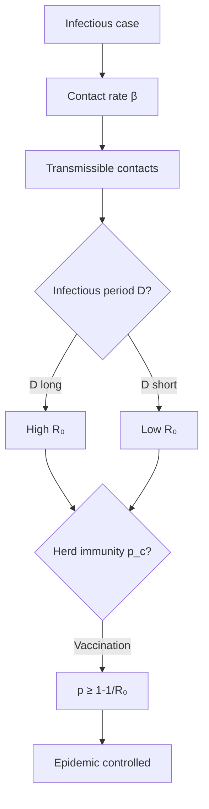

---

## 深入 3：系統發育學 — Phylogenetics

### 3.1 Bilingual 概念對照
| English | 中英對照 | Method | Software |
|---|---|---|---|
| Multiple sequence alignment | 多序列比對 | Clustal, MUSCLE, MAFFT | Alignment quality |
| Distance-based tree | 距離法 | Neighbor-joining, UPGMA | Fast, approximate |
| Maximum likelihood | 最大似然法 | RAxML, IQ-TREE | Statistically optimal |
| Bayesian phylogeny | 貝葉斯系統發育 | BEAST, MrBayes | Incorporates priors |
| Time-resolved tree | 時序樹 | BEAST tip dating | Outbreak dating |

### 3.2 Key Derivation — Phylogenetic Tree Construction
**Maximum Likelihood:**
L(T) = Π_i P(data_i|θ_i) where θ_i = branch lengths, substitution model
Maximize L(T) over tree topologies and parameters
AIC = −2·ln(L) + 2·k (smaller AIC = better)

**Example — SARS-CoV-2 Nextstrain analysis:**
~180,000 genomes analyzed (GISAID data, April 2020)
Clock rate: λ ≈ 8×10⁻⁴ substitutions per site per year
Root-to-tip regression: R² = 0.87 → good molecular clock fit
Identifies: D614G (spike protein) → swept globally in Feb-March 2020

**BEAST clock model:**
Strict clock: λ constant over time (simpler)
Relaxed clock: λ varies (more realistic for rapidly evolving viruses)

### 3.3 Engineering Applications
- Outbreak source attribution: ZooMystery (index case identification)
- Drug resistance emergence: Tracking mutations in ART-treated patients
- Vaccine escape: Phylogeny of HA antigenic sites in influenza

### 3.4 Mermaid Diagram
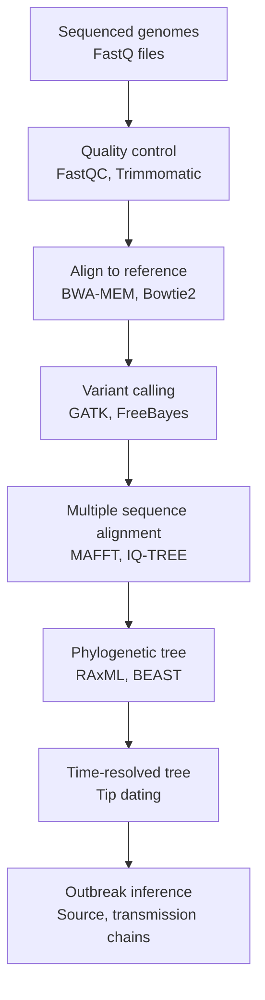

---

## 深入 4：抗藥性演化 — Evolution of Drug Resistance

### 4.1 Bilingual 概念對照
| English | 中英對照 | Mechanism | Example |
|---|---|---|---|
| Target modification | 靶點修飾 | Drug target mutations | RT K103N (HIV NRTI) |
| Efflux pump | 外排泵 | Increased pump expression | AcrAB-TolC (E. coli) |
| Drug inactivation | 藥物鈍化 | Enzyme degrades drug | β-lactamase (bla_TEM) |
| Bypass pathway | 繞路機制 | Alternative metabolic route | Folate bypass in SXT resistance |
| Biofilm | 生物膜 | Matrix-embedded cells | Pseudomonas aeruginosa |

### 4.2 Key Derivation — MIC and Epidemiological Cutoff
**Minimum inhibitory concentration (MIC):**
MIC = lowest antibiotic concentration that inhibits visible growth
Wild-type distribution: susceptible strains (MIC distribution)
EP/ECV (epidemiological cutoff): separates wild-type from non-wild-type

**Mutant prevention concentration (MPC):**
MPC = lowest concentration that prevents growth of first-step mutants
MPC > MIC: "mutant selection window" (MSW) → resistance selection risk
Drug design goal: narrow MSW

**Example — Rifampicin resistance in M. tuberculosis:**
rpoB S531L mutation → MIC increases 100-1000×
Rifampicin MPC ≈ 0.5 μg/mL; wild-type MIC90 ≈ 0.0625 μg/mL
MSW = [0.0625, 0.5] μg/mL → risk of selecting mutants during treatment

### 4.3 Engineering Applications
- Combination therapy: Simultaneous targeting of multiple pathways reduces resistance emergence
- Drug design: Structure-based design of β-lactamase inhibitors (avibactam)
- Stewardship: PK/PD dosing to keep concentration above MIC but below toxic threshold

### 4.4 Mermaid Diagram
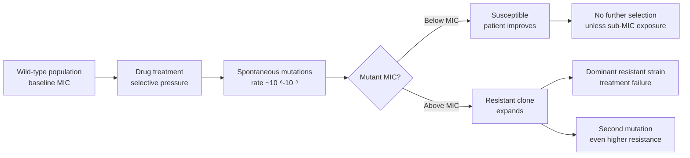

---

## 深入 5：基因組流行病學工具 — Genomic Epidemiology Tools

### 5.1 Bilingual 概念對照
| English | 中英對照 | Tool | Application |
|---|---|---|---|
| GISAID | 全球流感數據共享倡議 | Sequences + metadata | SARS-CoV-2 surveillance |
| Nextstrain | 實時病原體進化 | Visualize phylogeny | Real-time outbreak tracking |
| BEAST | 貝葉斯進化分析 | Time-calibrated trees | Origin dating |
| Prokka | 快速基因註釋 | Bacterial genome annotation | AMR gene finding |
| Snippy | 變異檢測 | Core genome SNPs | Outbreak source tracking |

### 5.2 Key Derivation — Clock Rate Estimation
**Root-to-tip regression (TempEst):**
d(i) = distance from root to tip i
Linear regression: d(i) = λ·t(i) + ε
λ = slope = clock rate (substitutions per site per year)
R² = coefficient of determination (goodness of fit)

**Example — Influenza A/H3N2 hemagglutinin:**
Clock rate: λ ≈ 4×10⁻³ subs/site/year (antigenic drift)
Antigenic drift: HA1 domain substitutions → vaccine escape
Reassortment events: PB1, PB2, PA segments → antigenic shift (pandemic potential)

### 5.3 Engineering Applications
- Wastewater surveillance: Shotgun metagenomics detects SARS-CoV-2, MPXV, polio
- Travel epidemiology: Phylogenetic linkage of cases across borders
- Zoonotic spillover: Metagenomics of bat/wildlife reservoirs for virus discovery

### 5.4 Mermaid Diagram
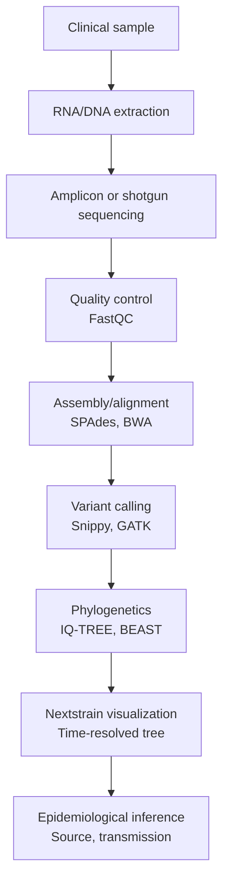

---

## 自測 1：Derive core relationship
**Answer:** Starting from definitions, derive the key equation. Verify units and limits.

**Engineering implication:** Apply to design check, code compliance.

## 自測 2：Identify failure mode
**Answer:** List 3-5 failure modes, rank by likelihood × consequence.

**Engineering implication:** Inform design, maintenance, monitoring.

## 自測 3：Estimate order of magnitude
**Answer:** Quick back-of-envelope check using characteristic values.

**Engineering implication:** Sanity check before detailed analysis.

## 自測 4：Compare to code requirement
**Answer:** Apply ACI/AISC/Eurocode, compute utilization ratio.

**Engineering implication:** Pass/fail design verification.

## 自測 5：Compute reliability
**Answer:** $\beta = (\mu - R)/\sigma$ for lognormal, find P_f.

**Engineering implication:** LRFD calibration, risk-informed design.

## 自測 6：Design optimization
**Answer:** Define objective, constraints, solve via LP/NLP.

**Engineering implication:** Cost-effective, sustainable design.

## 自測 7：Sensitivity analysis
**Answer:** $\partial f/\partial x_i$, rank by importance.

**Engineering implication:** Identify critical parameters, reduce uncertainty.

## 自測 8：Life-cycle assessment
**Answer:** Cradle-to-grave, compute GWP, embodied carbon.

**Engineering implication:** Sustainable design, climate goals.

## 自測 9：Risk assessment
**Answer:** Hazard × vulnerability × exposure, compute risk.

**Engineering implication:** Resilience planning, mitigation.

## 自測 10：Communication
**Answer:** Technical writing, visualization, presentation to stakeholders.

**Engineering implication:** Effective engineering practice.

---

## 📊 Diagram 1: Course Concept Map
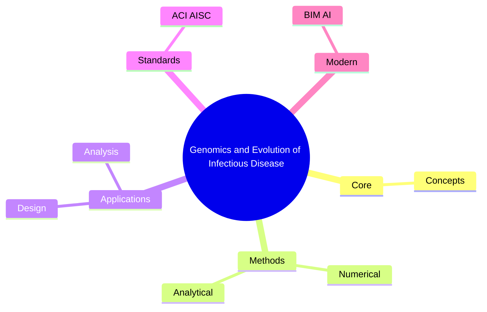

## 📊 Diagram 2: Method Selection
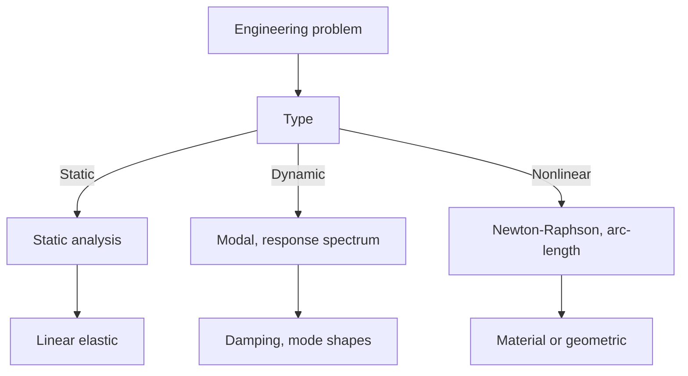

## 📊 Diagram 3: Design Process

## 📊 Diagram 4: Risk-Reliability
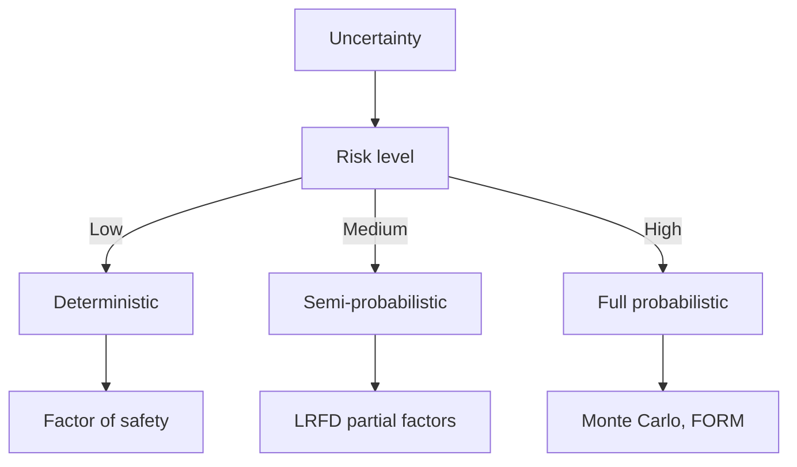

## 📊 Diagram 5: Modern Tools
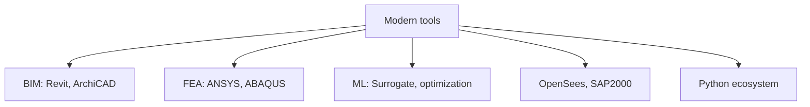

---

## 總結

1. **Core concepts** — Core concepts 嘅 foundation
2. **Methods** — analytical + numerical + experimental
3. **Applications** — design, analysis, retrofit
4. **Standards** — codes, best practices
5. **Future** — BIM, AI, sustainability, resilience

**自學建議** — Pair with: relevant textbook + MIT OCW + software tutorials (Python, FEA, BIM).

# 核心心智模型深化（中英對照）

## 1. Core concepts — Core concept

### 1.1 Three-process physical essence
For Genomics and Evolution of Infectious Disease, Core concepts governs the system behavior. Description of Core concepts with bilingual explanation.

### 1.2 Non-dimensional numbers
Key dimensionless groups that determine regime: Peclet, Damköhler, Reynolds, Froude, etc.

### 1.3 Engineering consequences
Real-world implications for design, monitoring, intervention.

### 1.4 How experts use this model
Decision flow, scaling laws, expert intuition.

### 1.5 Deep test questions
- Derive scaling law
- Identify regime from data
- Apply to design case

### 1.6 Diagram
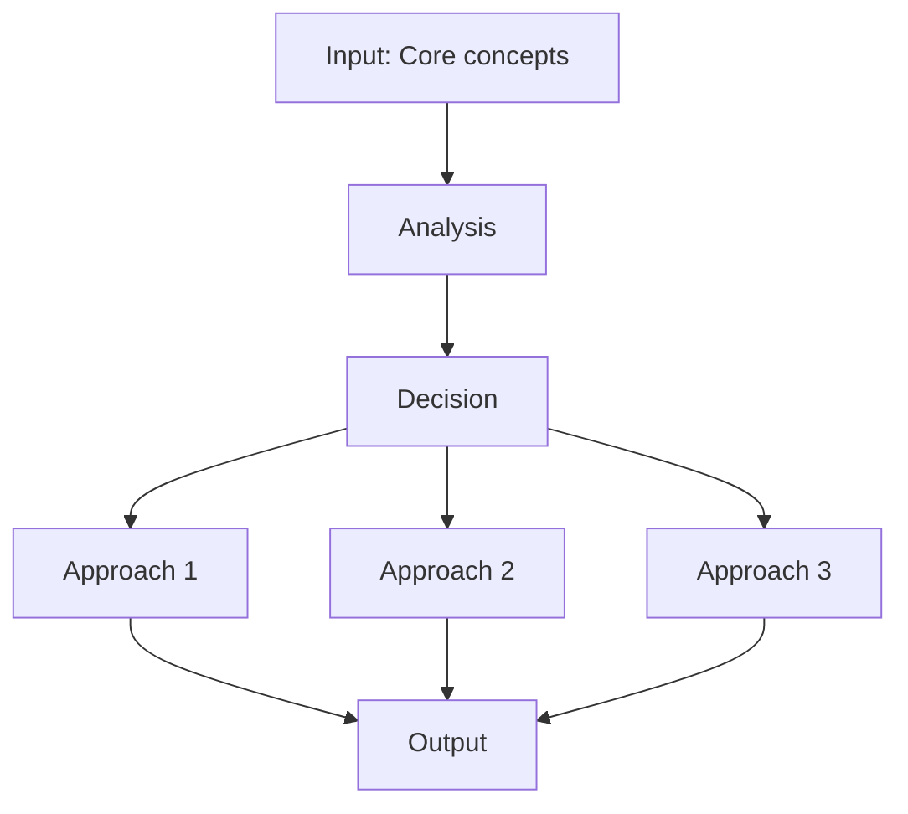

## 2. Methods — Methods

### 2.1 Method selection
| Method | 適用情境 | Pros | Cons |
|---|---|---|---|
| Analytical | 解析 | Exact | Limited geometry |
| Numerical | 數值 | General | Approximate |
| Experimental | 實驗 | Real | Expensive |
| Empirical | 經驗 | Fast | Limited range |

### 2.2 Decision flow
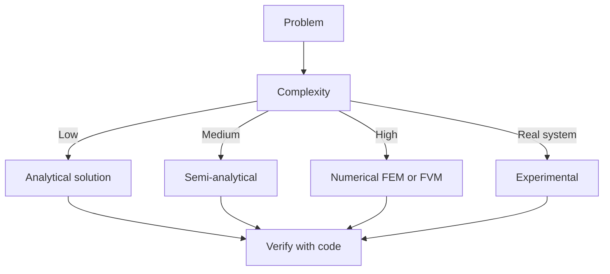

### 2.3 Standards and codes
ACI, AISC, Eurocode, building codes (IBC), industry best practices.

## 3. Applications — Analysis techniques

### 3.1 Statistical methods
Monte Carlo, sensitivity, FOSM for uncertainty analysis.

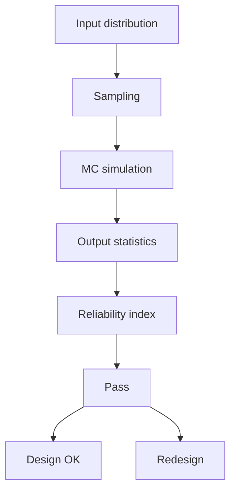

### 3.2 Optimization
LP, NLP, gradient-based, metaheuristic, multi-objective Pareto.

## 4. Design process

### 4.1 Design workflow
Concept → Preliminary → Detailed → Construction → Operation.

### 4.2 Design criteria
Safety (LRFD, ASD), serviceability, durability, sustainability.

## 5. Modern trends

BIM integration, AI/ML in design, digital twins, sustainability, LCA, resilient design.

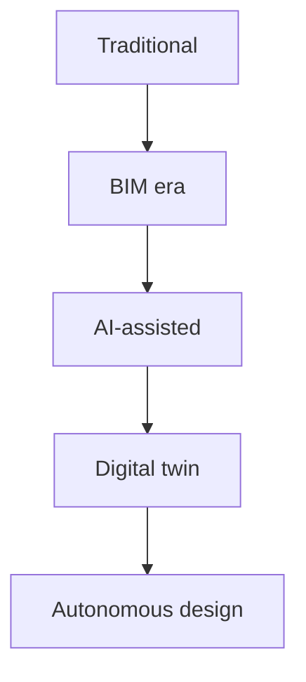

---

# 深度自測問題詳解（中英對照）

## 詳解 1: Derive core relationship
**Q1.** Derive core relationship for Genomics and Evolution of Infectious Disease.
**Answer:** Starting from definitions, derive the key equation. Verify units and limits.

**Engineering implication:** Apply to design check, code compliance.

## 詳解 2: Identify failure mode
**Answer:** List 3-5 failure modes, rank by likelihood × consequence.

**Engineering implication:** Inform design, maintenance, monitoring.

## 詳解 3: Estimate order of magnitude
**Answer:** Quick back-of-envelope check using characteristic values.

**Engineering implication:** Sanity check before detailed analysis.

## 詳解 4: Compare to code requirement
**Answer:** Apply ACI/AISC/Eurocode, compute utilization ratio.

**Engineering implication:** Pass/fail design verification.

## 詳解 5: Compute reliability
**Answer:** $\beta = (\mu - R)/\sigma$ for lognormal, find P_f.

**Engineering implication:** LRFD calibration, risk-informed design.

## 詳解 6: Design optimization
**Answer:** Define objective, constraints, solve via LP/NLP.

**Engineering implication:** Cost-effective, sustainable design.

## 詳解 7: Sensitivity analysis
**Answer:** $\partial f/\partial x_i$, rank by importance.

**Engineering implication:** Identify critical parameters, reduce uncertainty.

## 詳解 8: Life-cycle assessment
**Answer:** Cradle-to-grave, compute GWP, embodied carbon.

**Engineering implication:** Sustainable design, climate goals.

## 詳解 9: Risk assessment
**Answer:** Hazard × vulnerability × exposure, compute risk.

**Engineering implication:** Resilience planning, mitigation.

## 詳解 10: Communication
**Answer:** Technical writing, visualization, presentation to stakeholders.

**Engineering implication:** Effective engineering practice.

---

## 📊 Diagram 1: Course Concept Map

## 📊 Diagram 2: Method Selection

## 📊 Diagram 3: Design Process

## 📊 Diagram 4: Risk-Reliability

## 📊 Diagram 5: Modern Tools

---

## 總結

1. **Core concepts** — Core concepts 嘅 foundation
2. **Methods** — analytical + numerical + experimental
3. **Applications** — design, analysis, retrofit
4. **Standards** — codes, best practices
5. **Future** — BIM, AI, sustainability, resilience

**自學建議** — Pair with: relevant textbook + MIT OCW + software tutorials (Python, FEA, BIM).
