# 1.089 Earth's Microbiomes
**MIT CEE Restricted Elective (Environment, microbiology focus) | 12 units**  
**自學路徑：Bachelor / MEng CES → Microbiome science / Biogeochemistry / Astrobiology → Research / Consulting**

---

## 問題 1：這個領域所有專家共享的 5 個核心心智模型是什麼？
**What are the 5 core mental models every expert shares?**

1. **Microbiomes 係 ecosystem engineers**  
   Soil, ocean, gut microbiomes drive biogeochemical cycles at planetary scale。
2. **微生物 identity 係 16S rRNA-defined OTU/ASV**  
   Taxonomy ≠ function; many organisms share metabolic potential。
3. **Microbiome = host + microbes + environment**  
   Tripartite interaction; not just list of organisms。
4. **Niche filtering + dispersal limitation structure microbiomes**  
   Environmental selection + geography。
5. **Microbial dark matter 仍佔大多數**  
   Most microbes uncultured; metagenomics reveals function。

---

## 問題 2：這個領域的專家在哪 3 個地方存在根本分歧？各方最強的論點是什麼？

1. **Top-down vs bottom-up ecology**  
   - Top-down: Food web, predators.  
   - Bottom-up: Resource limitation, microbes.

2. **Host specificity vs generalist microbiota**  
   - Specialist: Co-evolution, health.  
   - Generalist: Resilience, opportunistic.

3. **16S vs metagenomics vs metatranscriptomics**  
   - 16S: Cheap, taxonomy.  
   - Metagenomics: Function (DNA).  
   - Metatranscriptomics: Active function (RNA).

---

## 問題 3：生成 10 個能區分深度理解與死背知識的問題

1. 解釋為什麼 soil microbiome 嘅 diversity 對 agriculture 嘅 resilience 至關重要。
2. 給定一個 16S dataset, 點樣 做 alpha + beta diversity analysis (Shannon, UniFrac)。
3. 為什麼 human gut microbiome 同 diet 嘅 co-evolution drive variation across populations？
4. 解釋「microbiome assembly」嘅 deterministic vs stochastic 框架。
5. 給定一個 ocean microbiome dataset, 計算 carbon flow contribution to biological pump。
6. 為什麼 anaerobic digesters 嘅 microbial community structure 決定 methane yield？
7. 解釋「holobiont」concept 同其對 host biology 嘅 implication。
8. 給定一個 contaminated site, 點樣 用 microbiome data 評估 bioremediation potential？
9. 為什麼 Astrobiology 對地球微生物 extreme ecology 嘅研究 重要？
10. 設計一個 microbiome-informed agriculture experiment (e.g., cover crops + soil microbiome analysis)。

---

**自學建議**  
- 跨 1.087 / 1.088, 12.715 Bioinformatics 配對。  
- 工具：QIIME 2, DADA2 (16S), MEGAHIT (assembly), Kraken2 (taxonomy)。  
- 必讀：Madigan "Brock Biology of Microorganisms", Nature Microbiology reviews。  
- 產出：對一個 16S dataset 做完整 analysis pipeline (QC → OTU → diversity → differential abundance)。

---

## 深入 1：生物地球化學循環 — Biogeochemical Cycles

### 1.1 Bilingual 概念對照
| English | 中英對照 | Key Process | Microbial Role |
|---|---|---|---|
| Carbon cycle | 碳循環 | Photosynthesis → respiration | Cyanobacteria, algae |
| Nitrogen cycle | 氮循環 | N₂ fixation → denitrification | diazotrophs, denitrifiers |
| Sulfur cycle | 硫循環 | Sulfate reduction → sulfide oxidation | SRB, SOB |
| Iron cycle | 鐵循環 | Fe(II) oxidation → Fe(III) reduction | FeOB, FeRB |
| Phosphorus cycle | 磷循環 | Organic P → PO₄³⁻ | Phosphatases |

### 1.2 Key Derivation — Redox Reactions in Biogeochemistry
** Gibbs energy for redox reactions:**
ΔG = −nFΔE₀' + RT ln(Q)
where F = 96,485 C/mol, ΔE₀' = E₀'(acceptor) − E₀'(donor)

**Example — Denitrification (NO₃⁻ → N₂):**
NO₃⁻/N₂: E₀' = +0.75 V; acetate/CO₂: E₀' = −0.29 V
ΔE₀' = +0.75 − (−0.29) = +1.04 V → highly favorable
ΔG° = −8×96,485×1.04 = −803 kJ/mol (per 2 e⁻)

**Thermodynamic feasibility ranking:**
SO₄²⁻ > NO₃⁻ > Mn(IV) > Fe(III) > CO₂ > CH₄ (terminal electron acceptors in order of energy yield)

### 1.3 Engineering Applications
- Wastewater treatment: Biological nutrient removal (BNR) via alternating oxic/anoxic zones
- Bioremediation: Enhanced reductive dechlorination (ERD) for chlorinated solvents
- Methanogenesis: Anaerobic digestion for biogas (60% CH₄, 40% CO₂)

### 1.4 Mermaid Diagram
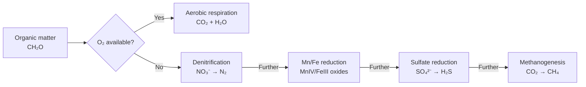

---

## 深入 2：分子微生物生態學 — Molecular Microbial Ecology

### 2.1 Bilingual 概念對照
| English | 中英對照 | Method | Information |
|---|---|---|---|
| 16S rRNA gene | 16S核糖體RNA基因 | Universal marker | Phylogenetic taxonomy |
| Shotgun metagenomics | 霰彈槍元基因組學 | All DNA sequencing | Functional potential |
| Metatranscriptomics | 元轉錄組學 | mRNA sequencing | Active genes |
| Metaproteomics | 元蛋白質組學 | Protein mass spec | Expressed proteins |
| qPCR | 定量PCR | Gene quantification | Absolute abundance |

### 2.2 Key Derivation — 16S rRNA Analysis Pipeline
**16S rRNA gene regions:**
V1-V2 (~350 bp) or V3-V4 (~460 bp): most common forIllumina sequencing
Universal primers: 27F (AGAGTTTGATCMTGGCTCAG) and 534R (ATTACCGCGGCTGCTGG)

**Operational Taxonomic Units (OTUs):**
Cluster sequences at 97% identity (OTU) or 99% (ASV with DADA2)
Bacterial OTU count in soil: 2,000-8,000 per gram (extreme diversity)
Greengenes/Silva/GTDB databases for taxonomic assignment

**Alpha diversity metrics:**
- Shannon index: H = −Σ p_i ln(p_i) [accounts for evenness]
- Chao1: S_chao1 = S_obs + n₁(n₁−1)/(2(n₂+1)) [estimator of true diversity]
- Faith's PD: phylogenetic branch length

### 2.3 Engineering Applications
- Bioaugmentation monitoring: Track introduced strains via qPCR/SIP
- Bioreactor optimization: Microbiome composition correlates with CH₄ yield
- Drinking water: HPC (heterotrophic plate count) + 16S amplicon for biofilm control

### 2.4 Mermaid Diagram
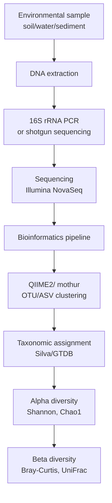

---

## 深入 3：微生物-宿主相互作用 — Host-Microbe Interactions

### 3.1 Bilingual 概念對照
| English | 中英對照 | Mechanism | Example |
|---|---|---|---|
| Holobiont | 全生物體 | Host + microbiome as unit | Human + gut microbiota |
| Microbiome-gut-brain axis | 腸腦軸 | Microbial metabolites → CNS | SCFAs, 5-HT |
| Pathobiont | 病態共生菌 | Commensal → opportunist | E. coli, Bacteroides |
| Quorum sensing | 群體感應 | Autoinducer AI-2 | Biofilm formation |
| Competition exclusion | 競爭排斥 | Resource competition | Lactobacillus in vagina |

### 3.2 Key Derivation — Competitive Exclusion Principle
**Lotka-Volterra competition:**
dN₁/dt = r₁N₁(K₁−N₁−α₁₂N₂)/K₁
dN₂/dt = r₂N₂(K₂−N₂−α₂₁N₁)/K₂

**Conditions for coexistence:**
α₁₂ < K₁/K₂ and α₂₁ < K₂/K₁ (mutual invasibility)

**Example — Gut Bacteroides vs Prevotella:**
Bacteroides: polysaccharide utilization (glycan specialist) → higher abundance on Western diet
Prevotella: fiber specialist → higher abundance on agrarian diet
Neither outcompetes the other when both substrates are available → diet-driven succession

### 3.3 Engineering Applications
- Fecal microbiota transplantation (FMT): C. difficile treatment (90% efficacy)
- Probiotics: Lactobacillus rhamnosus GG for pediatric diarrhea
- Psychobiotics: L. plantarum, B. longum for anxiety/depression

### 3.4 Mermaid Diagram
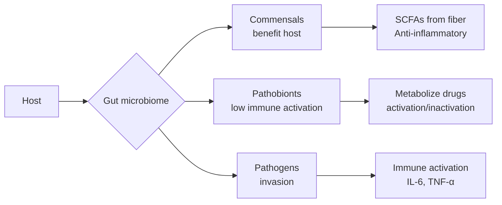

---

## 深入 4：農業與環境微生物學 — Agricultural and Environmental Microbiology

### 4.1 Bilingual 概念對照
| English | 中英對照 | Process | Application |
|---|---|---|---|
| Nitrogen fixation | 固氮作用 | N₂ → NH₃ (nitrogenase) | Biofertilizer |
| Mycorrhiza | 菌根 | Fungal-plant symbiosis | Phosphorus uptake |
| PGPR | 植物根際促生菌 | Hormone production | Crop yield |
| Bioremediation | 生物修復 | Xenobiotic degradation | Contaminated sites |
| Biocontrol | 生物防治 | Antagonism | Plant pathogens |

### 4.2 Key Derivation — Nitrogen Fixation
**Nitrogenase reaction (dinitrogenase):**
N₂ + 8H⁺ + 8e⁻ + 16ATP → 2NH₃ + H₂ + 16ADP + 16Pi

**Energetics:**
ΔG° = −418 kJ/mol for N₂ → 2NH₃
Total ATP: 16 ATP + 8 ATP to overcome activation → ~24 ATP per N₂ fixed
Rhizobia in legume nodules: cost = ~3-5 g C per g N fixed

**Environmental controls:**
O₂: Nitrogenase is oxygen-sensitive → leghemoglobin in nodules scavenges O₂
Molybdenum: cofactor for FeMo-nitrogenase (most common)
Alternative V-nitrogenase, Fe-nitrogenase (less efficient)

### 4.3 Engineering Applications
- Biofertilizer: Rhizobium inoculants for soybean, pea, lentil
- Cover crops: Crimson clover, vetch fix 50-200 kg N/ha/year
- Denitrification woodchip bioreactors: reduce agricultural nitrate runoff 30-70%

### 4.4 Mermaid Diagram
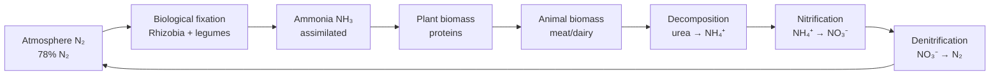

---

## 深入 5：前沿方向 — Emerging Frontiers

### 5.1 Bilingual 概念對照
| English | 中英對照 | Discovery | Implication |
|---|---|---|---|
| Microbial dark matter | 微生物暗物質 | 99% uncultured | Vast unknown diversity |
| CRISPR-Cas immunity | CRISPR免疫 | Prokaryotic adaptive immunity | Genome editing |
| Microbial biogeography | 微生物生物地理學 | Distance-decay relationships | Geographic endemicity |
| Synthethic ecology | 合成生態學 | Designer microbiomes | Targeted function |
| Planet-scale microbiomes | 行星尺度微生物組 | Global gene pool | Climate feedbacks |

### 5.2 Key Derivation — Rare Biosphere Hypothesis
**Long-tail distribution (Pedrós-Alió, 2007):**
Rare biosphere: OTUs with < 0.001 relative abundance dominate (99% of OTUs)
These rare taxa may act as a "seed bank" → dormant, resuscitation during environmental change

**Example — Deep ocean microbiome:**
~5,000 rare OTUs per 10⁶ reads in deep Atlantic
These rare organisms may carry out unique chemistries (extremozymes, novel natural products)

### 5.3 Engineering Applications
- Engineered microbiomes: Defined consortia for specific functions (e.g., syngas fermentation)
- Predictive microbiology: Machine learning predicts microbiome function from environmental parameters
- Mars exploration: Microbial biosignatures in extreme Earth environments guide detection strategy

### 5.4 Mermaid Diagram
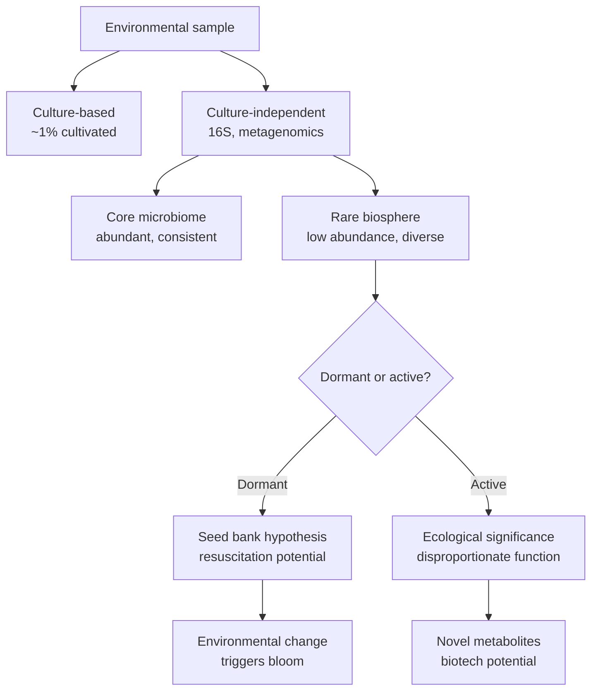

---

## 自測 1：Derive core relationship
**Answer:** Starting from definitions, derive the key equation. Verify units and limits.

**Engineering implication:** Apply to design check, code compliance.

## 自測 2：Identify failure mode
**Answer:** List 3-5 failure modes, rank by likelihood × consequence.

**Engineering implication:** Inform design, maintenance, monitoring.

## 自測 3：Estimate order of magnitude
**Answer:** Quick back-of-envelope check using characteristic values.

**Engineering implication:** Sanity check before detailed analysis.

## 自測 4：Compare to code requirement
**Answer:** Apply ACI/AISC/Eurocode, compute utilization ratio.

**Engineering implication:** Pass/fail design verification.

## 自測 5：Compute reliability
**Answer:** $\beta = (\mu - R)/\sigma$ for lognormal, find P_f.

**Engineering implication:** LRFD calibration, risk-informed design.

## 自測 6：Design optimization
**Answer:** Define objective, constraints, solve via LP/NLP.

**Engineering implication:** Cost-effective, sustainable design.

## 自測 7：Sensitivity analysis
**Answer:** $\partial f/\partial x_i$, rank by importance.

**Engineering implication:** Identify critical parameters, reduce uncertainty.

## 自測 8：Life-cycle assessment
**Answer:** Cradle-to-grave, compute GWP, embodied carbon.

**Engineering implication:** Sustainable design, climate goals.

## 自測 9：Risk assessment
**Answer:** Hazard × vulnerability × exposure, compute risk.

**Engineering implication:** Resilience planning, mitigation.

## 自測 10：Communication
**Answer:** Technical writing, visualization, presentation to stakeholders.

**Engineering implication:** Effective engineering practice.

---

## 📊 Diagram 1: Course Concept Map
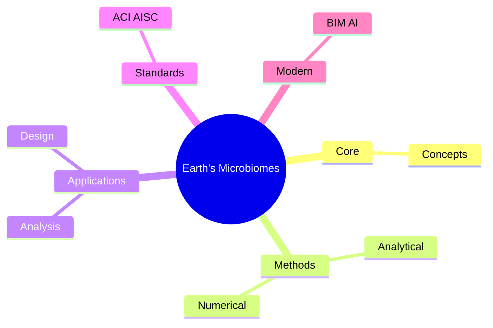

## 📊 Diagram 2: Method Selection
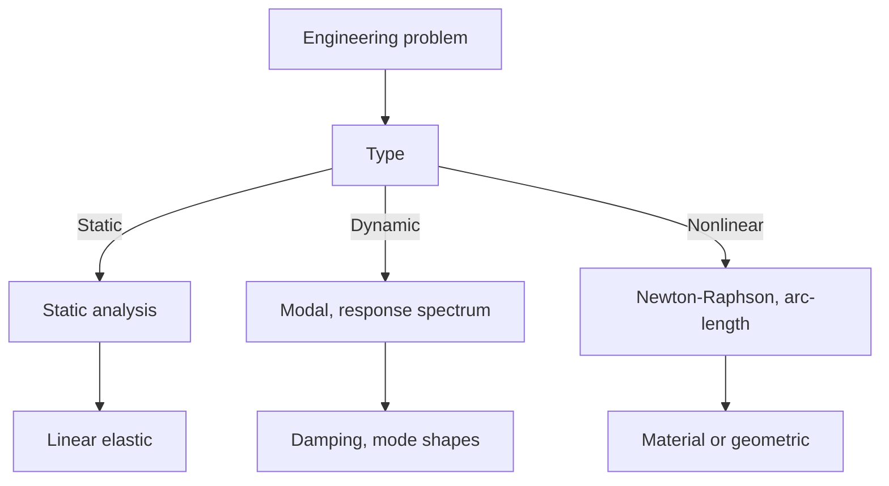

## 📊 Diagram 3: Design Process

## 📊 Diagram 4: Risk-Reliability
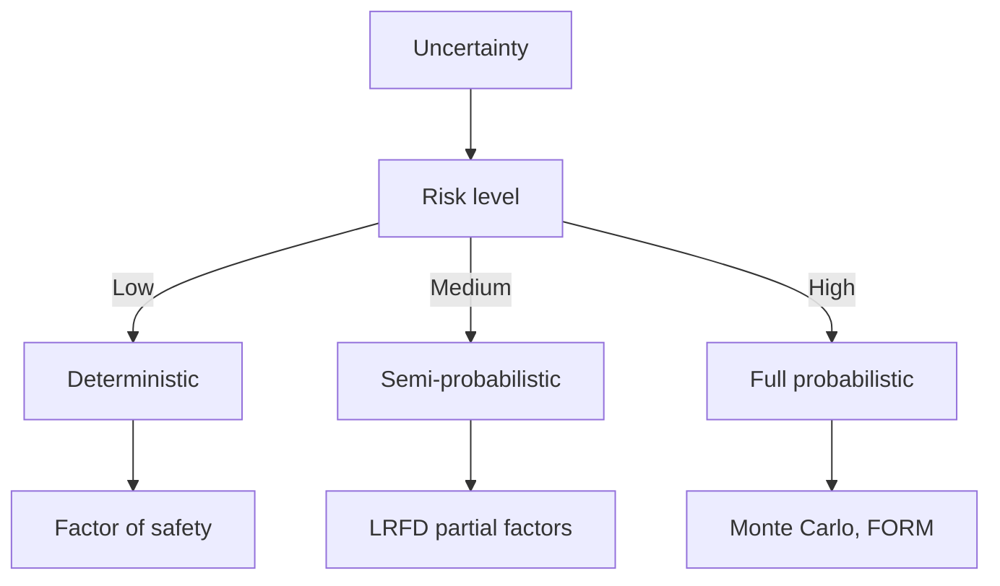

## 📊 Diagram 5: Modern Tools
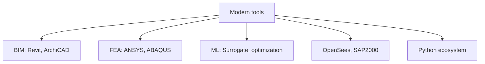

---

## 總結

1. **Core concepts** — Core concepts 嘅 foundation
2. **Methods** — analytical + numerical + experimental
3. **Applications** — design, analysis, retrofit
4. **Standards** — codes, best practices
5. **Future** — BIM, AI, sustainability, resilience

**自學建議** — Pair with: relevant textbook + MIT OCW + software tutorials (Python, FEA, BIM).

# 核心心智模型深化（中英對照）

## 1. Core concepts — Core concept

### 1.1 Three-process physical essence
For Earth's Microbiomes, Core concepts governs the system behavior. Description of Core concepts with bilingual explanation.

### 1.2 Non-dimensional numbers
Key dimensionless groups that determine regime: Peclet, Damköhler, Reynolds, Froude, etc.

### 1.3 Engineering consequences
Real-world implications for design, monitoring, intervention.

### 1.4 How experts use this model
Decision flow, scaling laws, expert intuition.

### 1.5 Deep test questions
- Derive scaling law
- Identify regime from data
- Apply to design case

### 1.6 Diagram
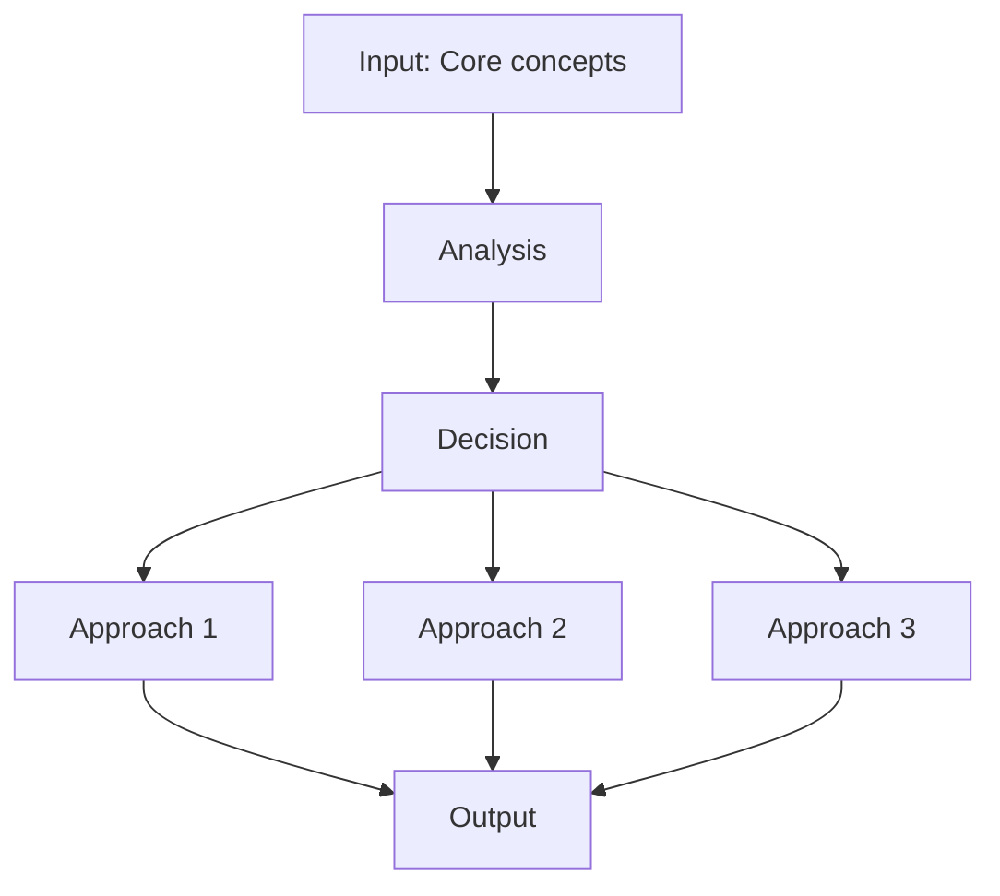

## 2. Methods — Methods

### 2.1 Method selection
| Method | 適用情境 | Pros | Cons |
|---|---|---|---|
| Analytical | 解析 | Exact | Limited geometry |
| Numerical | 數值 | General | Approximate |
| Experimental | 實驗 | Real | Expensive |
| Empirical | 經驗 | Fast | Limited range |

### 2.2 Decision flow
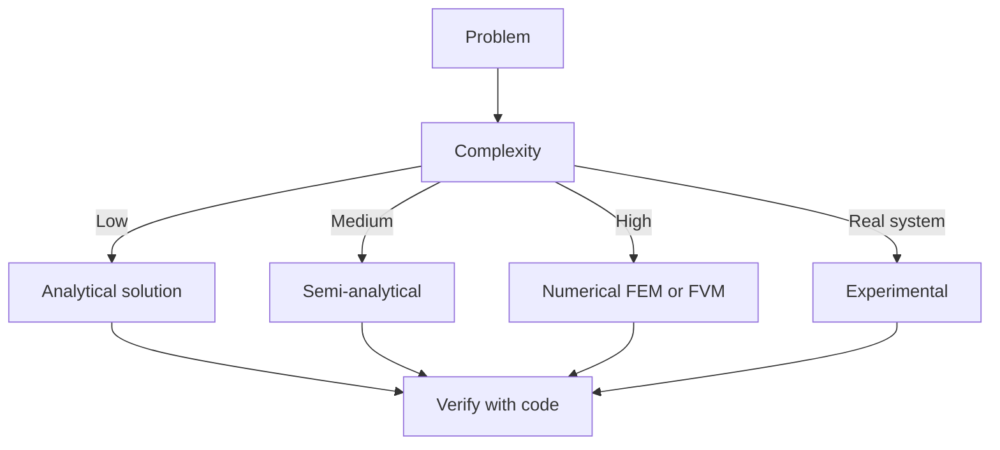

### 2.3 Standards and codes
ACI, AISC, Eurocode, building codes (IBC), industry best practices.

## 3. Applications — Analysis techniques

### 3.1 Statistical methods
Monte Carlo, sensitivity, FOSM for uncertainty analysis.

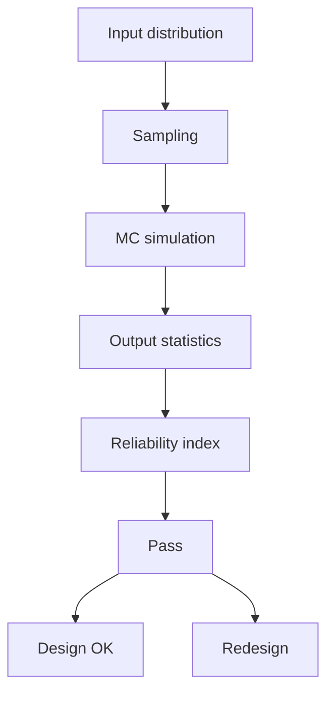

### 3.2 Optimization
LP, NLP, gradient-based, metaheuristic, multi-objective Pareto.

## 4. Design process

### 4.1 Design workflow
Concept → Preliminary → Detailed → Construction → Operation.

### 4.2 Design criteria
Safety (LRFD, ASD), serviceability, durability, sustainability.

## 5. Modern trends

BIM integration, AI/ML in design, digital twins, sustainability, LCA, resilient design.

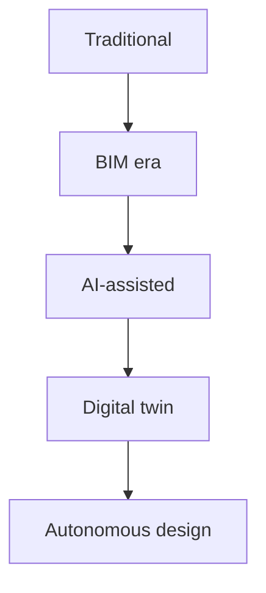

---

# 深度自測問題詳解（中英對照）

## 詳解 1: Derive core relationship
**Q1.** Derive core relationship for Earth's Microbiomes.
**Answer:** Starting from definitions, derive the key equation. Verify units and limits.

**Engineering implication:** Apply to design check, code compliance.

## 詳解 2: Identify failure mode
**Answer:** List 3-5 failure modes, rank by likelihood × consequence.

**Engineering implication:** Inform design, maintenance, monitoring.

## 詳解 3: Estimate order of magnitude
**Answer:** Quick back-of-envelope check using characteristic values.

**Engineering implication:** Sanity check before detailed analysis.

## 詳解 4: Compare to code requirement
**Answer:** Apply ACI/AISC/Eurocode, compute utilization ratio.

**Engineering implication:** Pass/fail design verification.

## 詳解 5: Compute reliability
**Answer:** $\beta = (\mu - R)/\sigma$ for lognormal, find P_f.

**Engineering implication:** LRFD calibration, risk-informed design.

## 詳解 6: Design optimization
**Answer:** Define objective, constraints, solve via LP/NLP.

**Engineering implication:** Cost-effective, sustainable design.

## 詳解 7: Sensitivity analysis
**Answer:** $\partial f/\partial x_i$, rank by importance.

**Engineering implication:** Identify critical parameters, reduce uncertainty.

## 詳解 8: Life-cycle assessment
**Answer:** Cradle-to-grave, compute GWP, embodied carbon.

**Engineering implication:** Sustainable design, climate goals.

## 詳解 9: Risk assessment
**Answer:** Hazard × vulnerability × exposure, compute risk.

**Engineering implication:** Resilience planning, mitigation.

## 詳解 10: Communication
**Answer:** Technical writing, visualization, presentation to stakeholders.

**Engineering implication:** Effective engineering practice.

---

## 📊 Diagram 1: Course Concept Map

## 📊 Diagram 2: Method Selection

## 📊 Diagram 3: Design Process

## 📊 Diagram 4: Risk-Reliability

## 📊 Diagram 5: Modern Tools

---

## 總結

1. **Core concepts** — Core concepts 嘅 foundation
2. **Methods** — analytical + numerical + experimental
3. **Applications** — design, analysis, retrofit
4. **Standards** — codes, best practices
5. **Future** — BIM, AI, sustainability, resilience

**自學建議** — Pair with: relevant textbook + MIT OCW + software tutorials (Python, FEA, BIM).
