# 20.507 Introduction to Biological Chemistry
**MIT Biology (cross-listed) | CEE Unrestricted Elective (Environment micro focus) | 12 units**  
**自學路徑：Bachelor / MEng → Biochemistry for environmental / public health → Research / Pharma / Consulting**

---

## 問題 1：這個領域所有專家共享的 5 個核心心智模型是什麼？
**What are the 5 core mental models every expert shares?**

1. **生物化學 = chemistry of life**  
   C, H, O, N, P, S — 4 macronutrients 構成 biomolecules。
2. **Four biomolecule classes 各自獨特**  
   - Proteins: Catalysis, structure.  
   - Nucleic acids: Information.  
   - Lipids: Membranes, energy.  
   - Carbohydrates: Energy, structure.
3. **酶 catalysis 加速 by 10⁶–10¹²**  
   Specificity + transition state stabilization。
4. **代謝 pathway 係 interconnected network**  
   Glycolysis, TCA, β-oxidation, gluconeogenesis — all connected。
5. **Energy currency = ATP**  
   Coupled reactions, ΔG < 0 drives ΔG > 0。

---

## 問題 2：這個領域的專家在哪 3 個地方存在根本分歧？各方最強的論點是什麼？

1. **Reductionist vs systems biology**  
   - Reductionist: One gene, one protein, one function.  
   - Systems: Network, emergent.

2. **In vitro vs in vivo**  
   - In vitro: Controlled, simplified.  
   - In vivo: Realistic, complex.

3. **Static structure vs dynamics**  
   - Structure: X-ray crystallography, snapshots.  
   - Dynamics: NMR, MD simulations, time-resolved.

---

## 問題 3：生成 10 個能區分深度理解與死背知識的問題

1. 給定一個 enzyme, 計算 k_cat / K_M 嘅 catalytic efficiency。
2. 解釋為什麼 ATP hydrolysis 嘅 ΔG = -30.5 kJ/mol 適合當 energy currency。
3. 給定一個 glycolysis intermediate, 解釋它嘅下一步 fate 同 regulation。
4. 為什麼「membrane potential」對 cellular bioenergetics 重要？
5. 解釋「oxidative phosphorylation」同「substrate-level phosphorylation」嘅 difference。
6. 給定一個 metabolic flux, 計算 steady-state flux balance (FBA)。
7. 為什麼「protein folding」(Anfinsen dogma) 對 misfolding diseases (Alzheimer) 重要？
8. 解釋「central dogma」(DNA → RNA → protein) 嘅 exceptions (e.g., retroviruses, prions)。
9. 給定一個 enzyme inhibitor (competitive vs non-competitive), 計算 Lineweaver-Burk plot 嘅 changes。
10. 設計一個 end-to-end biochemistry project: 純化 + 活性測定 + kinetics。

---

**自學建議**  
- 跨 1.063, 1.081, 1.088, 1.089 配對。  
- 工具：PyMOL (visualization), BLAST (sequence), Benchling (cloning design), R (DESeq2)。  
- 必讀：Stryer "Biochemistry", Alberts "Molecular Biology of the Cell"。  
- 產出：對一個 enzyme 做 kinetics analysis (Michaelis-Menten) + visualization。


---

## 深入 1：生化能與 ATP — Bioenergetics and ATP

### 1.1 Bilingual 概念對照
| English | 中英對照 | Formula | 物理意義 |
|---|---|---|---|
| Gibbs free energy | 吉布斯自由能 | ΔG = ΔH − TΔS | Spontaneity |
| ATP hydrolysis | ATP 水解 | ATP + H₂O → ADP + Pi; ΔG° = −30.5 kJ/mol | Energy currency |
| Redox potential | 氧化還原電位 | E°' (NAD⁺/NADH = −0.32V) | Electron transfer |
| Michaelis-Menten | 米氏門滕 | v = Vmax[S]/(Km+[S]) | Enzyme kinetics |
| Chemiosmotic theory | 化學滲透假說 | Δp = Δψ − 59·ΔpH | ATP synthesis |

### 1.2 Key Derivation
**Michaelis-Menten kinetics (1913):**
E + S ⇌ ES → E + P
v = (k_cat·[E]_T·[S])/(K_m + [S])
K_m = (k_{-1} + k_cat)/k_1 [Michaelis constant]

**Lineweaver-Burk linearization:**
1/v = (K_m/V_max)·(1/[S]) + 1/V_max
Plot 1/v vs 1/[S] → intercept = 1/V_max, slope = K_m/V_max

**Example — Carbonic anhydrase:**
k_cat = 10⁶ s⁻¹ (one of the fastest enzymes)
K_m = 26 mM (for CO₂ hydration)
k_cat/K_m = 10⁶/26×10⁻³ = **3.8×10⁷ M⁻¹s⁻¹** → diffusion-limited!

### 1.3 Engineering Applications
- Drug design: competitive inhibition K_i = IC₅₀ for enzyme inhibitors
- Metabolic engineering: optimize flux through pathway control
- Biosensors: enzyme kinetics for glucose sensors (glucose oxidase, GOx)

### 1.4 Mermaid Diagram
```mermaid
graph LR
    A[E + S] --> B[ES complex<br/>k₁ forward]
    B --> C[E + P<br/>k_cat]
    A -->|k_{-1}| B
    B -->|k_2| C
    C --> D[v = k_cat[E][S]/(K_m+[S])]
    D --> E{Substrate level?}
    E -->|Low [S]| F[v ≈ (k_cat/K_m)[E][S]<br/>First order]
    E -->|High [S]| G[v ≈ k_cat[E]<br/>Zero order, Vmax]
```

---

## 深入 2：代謝途徑 — Metabolic Pathways

### 2.1 Bilingual 概念對照
| English | 中英對照 | Pathway | Yield |
|---|---|---|---|
| Glycolysis | 糖酵解 | Glucose → 2 pyruvate | 2 ATP (net) + 2 NADH |
| TCA cycle | 三羧酸循環 | Acetyl-CoA → 2 CO₂ | 3 NADH + 1 FADH₂ + 1 GTP |
| Oxidative phosphorylation | 氧化磷酸化 | NADH → 3 ATP; FADH₂ → 2 ATP | ~32 ATP/glucose |
| Pentose phosphate pathway | 磷酸戊糖途徑 | Glucose-6P → ribose-5P + NADPH | Biosynthetic reducing power |
| Gluconeogenesis | 糖異生 | Pyruvate → glucose | Bypasses irreversible steps |

### 2.2 Key Derivation — ATP Yield from Glucose
**Complete oxidation stoichiometry:**
C₆H₁₂O₆ + 6O₂ → 6CO₂ + 6H₂O; ΔG° = −2,870 kJ/mol

**ATP accounting:**
- Glycolysis: 2 ATP + 2 NADH (cytosolic)
- Pyruvate oxidation: 2 NADH (mitochondrial)
- TCA cycle: 6 NADH + 2 FADH₂ + 2 GTP
- Oxidative phosphorylation: 2.5 ATP/NADH, 1.5 ATP/FADH₂
Total: 2 + 2×2.5 + 2×2.5 + 6×2.5 + 2×1.5 + 2 = **~30-32 ATP/glucose**

### 2.3 Engineering Applications
- Biofuels: Metabolic engineering of yeast for ethanol production (glycolysis → alcoholic fermentation)
- Bioremediation: Pseudomonas for hydrocarbon degradation (β-oxidation → TCA)
- Pharmaceutical: Artemesinin precursor (AMO) synthesis in yeast engineered from glycolysis

### 2.4 Mermaid Diagram
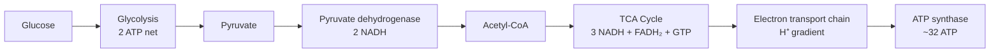

---

## 深入 3：蛋白質結構與催化 — Protein Structure and Catalysis

### 3.1 Bilingual 概念對照
| English | 中英對照 | Structure level | Forces |
|---|---|---|---|
| Primary | 一級結構 | Amino acid sequence | Peptide bonds |
| Secondary | 二級結構 | α-helix, β-sheet | H-bonds |
| Tertiary | 三級結構 | 3D fold | Hydrophobic core |
| Quaternary | 四級結構 | Multi-subunit | Interface contacts |
| Active site | 活性位點 | Substrate binding | Catalytic residues |

### 3.2 Key Derivation — Enzyme Catalysis
**Transition state stabilization:**
ΔG‡ = G‡ − G_ES (barrier)
Catalysis reduces ΔG‡ by stabilizing the transition state

**Specific acid/base catalysis:**
General acid: His-57 donates H⁺ to carbonyl O
General base: Asp-57 abstracts H⁺ from nucleophile
Result: chymotrypsin accelerates peptide hydrolysis by **10¹⁰ fold** over uncatalyzed reaction

**Example — HIV-1 protease inhibitor design:**
Target: Transition state mimic (hydroxyethylene or statine moiety)
Design: Flap closure around P1/P1' groups → 1000× selectivity for viral over host protease

### 3.3 Engineering Applications
- Enzyme engineering: Directed evolution (Arnold, 2018 Nobel) for thermostable lipases
- Biosensors: Glucose oxidase FAD → FADH₂ electrochemistry for amperometric sensors
- Synthetic biology: Engineered metabolic pathways using protein fusion

### 3.4 Mermaid Diagram
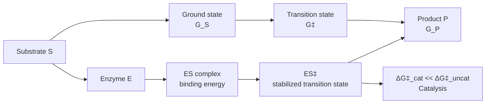

---

## 深入 4：中心法則與分子生物學 — Central Dogma

### 4.1 Bilingual 概念對照
| English | 中英對照 | Process | Key enzymes |
|---|---|---|---|
| Replication | DNA複製 | Semi-conservative | DNA pol III, helicase |
| Transcription | 轉錄 | DNA → mRNA | RNAP II, TFs |
| Translation | 轉譯 | mRNA → protein | Ribosome, tRNAs |
| RNA processing | RNA加工 | Splicing, capping, polyA | Spliceosome |
| CRISPR-Cas | 基因編輯 | Site-specific cleavage | Cas9, guide RNA |

### 4.2 Key Derivation — Central Dogma
DNA → RNA → Protein (Crick, 1958)
Exceptions: retroviruses (RNA → DNA), prions (protein → protein)

**Transcription rate:**
RNA polymerase II speed: ~20-50 nucleotides/second
Promoter clearance: TATA box (TATAAA), Inr, BRE
Elongation: TFIIS, Spt5 for backtracking rescue

**Translation:**
Ribosome speed: ~3-6 amino acids/second in E. coli
Initiation: Shine-Dalgarno sequence (AGGAGGU) aligns ribosome with start codon
Elongation: EF-Tu·GTP delivers aminoacyl-tRNA

### 4.3 Engineering Applications
- Synthetic biology: Gene circuit design (repressilator, toggle switch)
- Biosensors: RNA aptamers for small molecule detection
- Therapeutics: mRNA vaccines (COVID-19, 95% efficacy from spike protein mRNA)

### 4.4 Mermaid Diagram
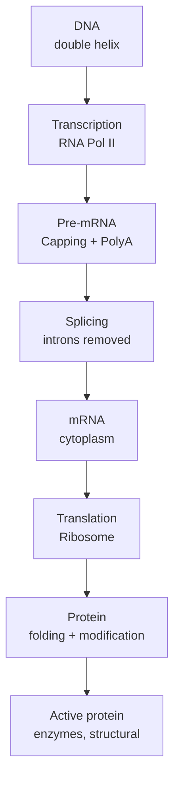

---

## 深入 5：生物膜與信號傳遞 — Membranes and Signal Transduction

### 5.1 Bilingual 概念對照
| English | 中英對照 | Structure | Function |
|---|---|---|---|
| Phospholipid bilayer | 磷脂雙分子層 | Fluid mosaic model | Cell boundary |
| Membrane proteins | 膜蛋白 | α-helical or β-barrel | Transport, signaling |
| GPCR | G蛋白偶聯受體 | 7-TM domain | Hormone signaling |
| Ion channels | 離子通道 | Selectivity filter | Action potential |
| ATPase | ATP合酶 | F-type rotary motor | Energy conversion |

### 5.2 Key Derivation — Membrane Potential
**Goldman-Hodgkin-Katz equation:**
$$E = \frac{RT}{F} \ln\frac{P_K[K^+]_o + P_{Na}[Na^+]_o + P_{Cl}[Cl^-]_i}{P_K[K^+]_i + P_{Na}[Na^+]_i + P_{Cl}[Cl^-]_o}$$

**Resting membrane potential (neuron):**
P_K : P_Na : P_Cl ≈ 1 : 0.04 : 0.45
E ≈ −70 mV (mainly K⁺ equilibrium potential)

**Action potential:**
Depolarization: Na⁺ channels open → E → +30 mV
Repolarization: Na⁺ channels inactivate, K⁺ channels open → E → −70 mV
All-or-nothing: threshold ≈ −55 mV

### 5.3 Engineering Applications
- Drug design: GPCR-targeted drugs (30% of FDA-approved drugs target GPCRs)
- Neural engineering: Electroencephalography (EEG) measures summed post-synaptic potentials
- Biosensors: Ion-selective electrodes (pH, K⁺, Na⁺, Cl⁻) for environmental monitoring

### 5.4 Mermaid Diagram
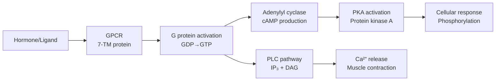

---

## 自測 1：Derive core relationship
**Answer:** Starting from definitions, derive the key equation. Verify units and limits.

**Engineering implication:** Apply to design check, code compliance.

## 自測 2：Identify failure mode
**Answer:** List 3-5 failure modes, rank by likelihood × consequence.

**Engineering implication:** Inform design, maintenance, monitoring.

## 自測 3：Estimate order of magnitude
**Answer:** Quick back-of-envelope check using characteristic values.

**Engineering implication:** Sanity check before detailed analysis.

## 自測 4：Compare to code requirement
**Answer:** Apply ACI/AISC/Eurocode, compute utilization ratio.

**Engineering implication:** Pass/fail design verification.

## 自測 5：Compute reliability
**Answer:** $\beta = (\mu - R)/\sigma$ for lognormal, find P_f.

**Engineering implication:** LRFD calibration, risk-informed design.

## 自測 6：Design optimization
**Answer:** Define objective, constraints, solve via LP/NLP.

**Engineering implication:** Cost-effective, sustainable design.

## 自測 7：Sensitivity analysis
**Answer:** $\partial f/\partial x_i$, rank by importance.

**Engineering implication:** Identify critical parameters, reduce uncertainty.

## 自測 8：Life-cycle assessment
**Answer:** Cradle-to-grave, compute GWP, embodied carbon.

**Engineering implication:** Sustainable design, climate goals.

## 自測 9：Risk assessment
**Answer:** Hazard × vulnerability × exposure, compute risk.

**Engineering implication:** Resilience planning, mitigation.

## 自測 10：Communication
**Answer:** Technical writing, visualization, presentation to stakeholders.

**Engineering implication:** Effective engineering practice.

---

## 📊 Diagram 1: Course Concept Map
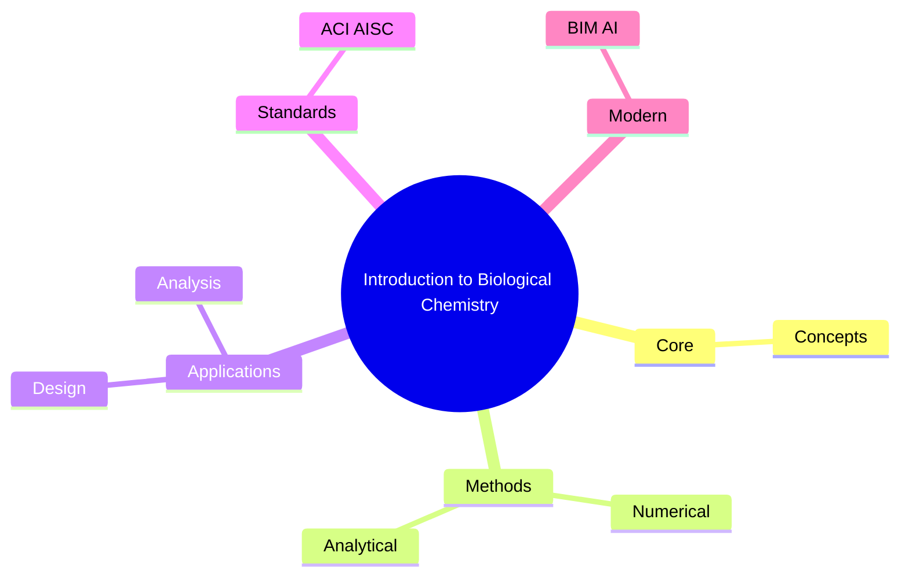

## 📊 Diagram 2: Method Selection
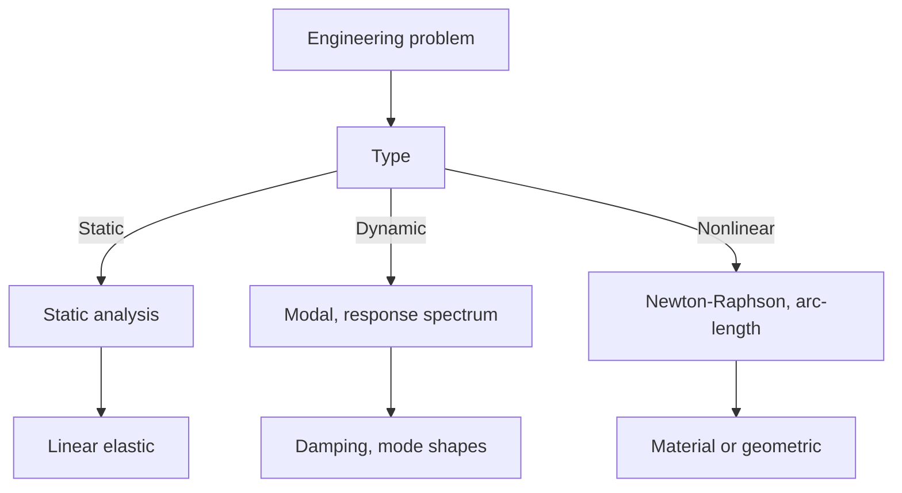

## 📊 Diagram 3: Design Process


## 📊 Diagram 4: Risk-Reliability
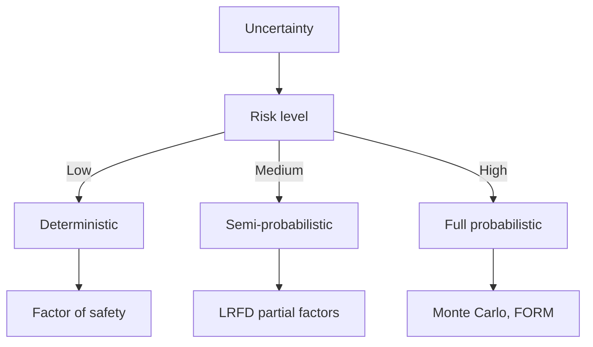

## 📊 Diagram 5: Modern Tools
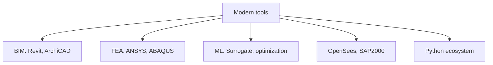

---

## 總結

1. **Core concepts** — Core concepts 嘅 foundation
2. **Methods** — analytical + numerical + experimental
3. **Applications** — design, analysis, retrofit
4. **Standards** — codes, best practices
5. **Future** — BIM, AI, sustainability, resilience

**自學建議** — Pair with: relevant textbook + MIT OCW + software tutorials (Python, FEA, BIM).


# 核心心智模型深化（中英對照）

## 1. Core concepts — Core concept

### 1.1 Three-process physical essence
For Introduction to Biological Chemistry, Core concepts governs the system behavior. Description of Core concepts with bilingual explanation.

### 1.2 Non-dimensional numbers
Key dimensionless groups that determine regime: Peclet, Damköhler, Reynolds, Froude, etc.

### 1.3 Engineering consequences
Real-world implications for design, monitoring, intervention.

### 1.4 How experts use this model
Decision flow, scaling laws, expert intuition.

### 1.5 Deep test questions
- Derive scaling law
- Identify regime from data
- Apply to design case

### 1.6 Diagram
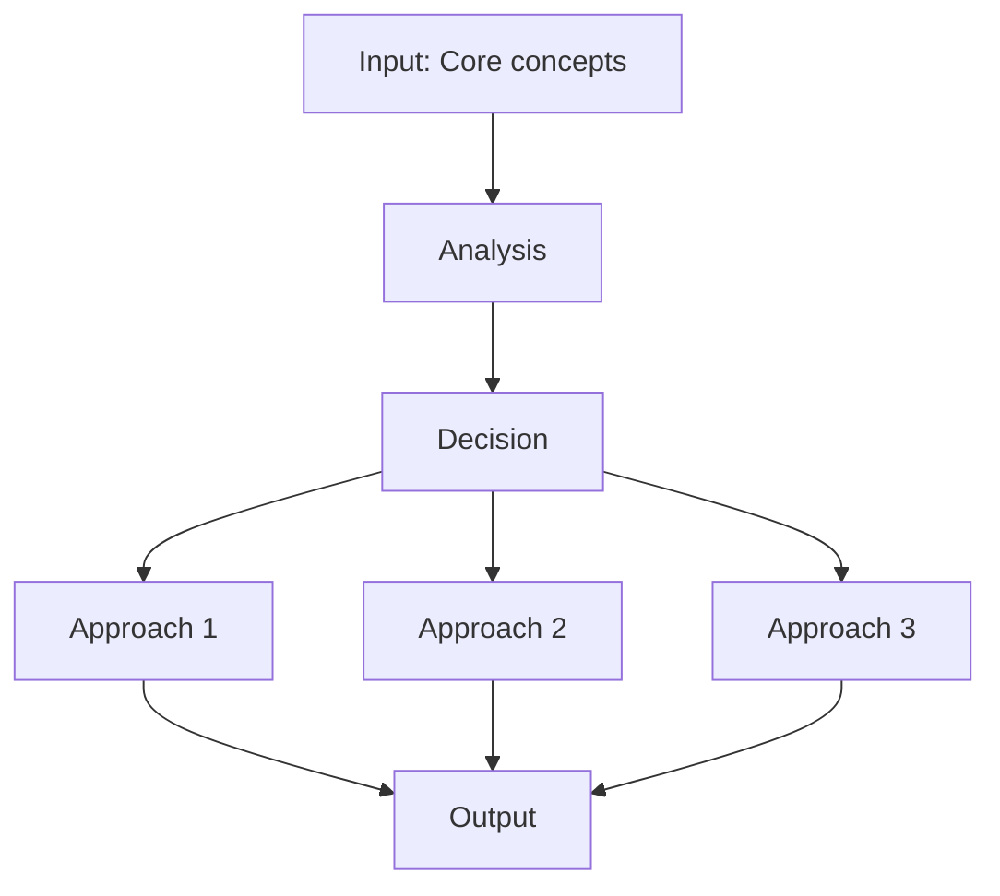

## 2. Methods — Methods

### 2.1 Method selection
| Method | 適用情境 | Pros | Cons |
|---|---|---|---|
| Analytical | 解析 | Exact | Limited geometry |
| Numerical | 數值 | General | Approximate |
| Experimental | 實驗 | Real | Expensive |
| Empirical | 經驗 | Fast | Limited range |

### 2.2 Decision flow
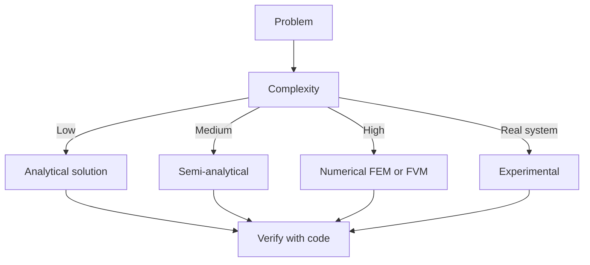

### 2.3 Standards and codes
ACI, AISC, Eurocode, building codes (IBC), industry best practices.

## 3. Applications — Analysis techniques

### 3.1 Statistical methods
Monte Carlo, sensitivity, FOSM for uncertainty analysis.

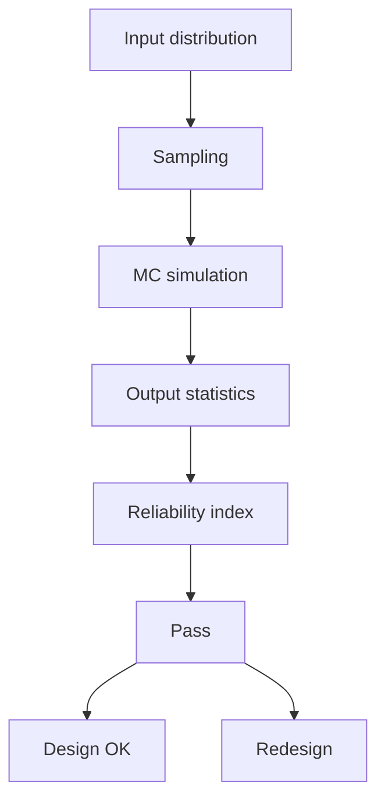

### 3.2 Optimization
LP, NLP, gradient-based, metaheuristic, multi-objective Pareto.

## 4. Design process

### 4.1 Design workflow
Concept → Preliminary → Detailed → Construction → Operation.

### 4.2 Design criteria
Safety (LRFD, ASD), serviceability, durability, sustainability.


## 5. Modern trends

BIM integration, AI/ML in design, digital twins, sustainability, LCA, resilient design.

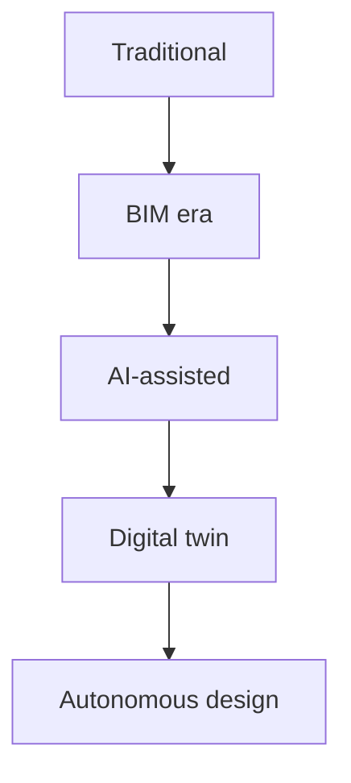

---

# 深度自測問題詳解（中英對照）

## 詳解 1: Derive core relationship
**Q1.** Derive core relationship for Introduction to Biological Chemistry.
**Answer:** Starting from definitions, derive the key equation. Verify units and limits.

**Engineering implication:** Apply to design check, code compliance.

## 詳解 2: Identify failure mode
**Answer:** List 3-5 failure modes, rank by likelihood × consequence.

**Engineering implication:** Inform design, maintenance, monitoring.

## 詳解 3: Estimate order of magnitude
**Answer:** Quick back-of-envelope check using characteristic values.

**Engineering implication:** Sanity check before detailed analysis.

## 詳解 4: Compare to code requirement
**Answer:** Apply ACI/AISC/Eurocode, compute utilization ratio.

**Engineering implication:** Pass/fail design verification.

## 詳解 5: Compute reliability
**Answer:** $\beta = (\mu - R)/\sigma$ for lognormal, find P_f.

**Engineering implication:** LRFD calibration, risk-informed design.

## 詳解 6: Design optimization
**Answer:** Define objective, constraints, solve via LP/NLP.

**Engineering implication:** Cost-effective, sustainable design.

## 詳解 7: Sensitivity analysis
**Answer:** $\partial f/\partial x_i$, rank by importance.

**Engineering implication:** Identify critical parameters, reduce uncertainty.

## 詳解 8: Life-cycle assessment
**Answer:** Cradle-to-grave, compute GWP, embodied carbon.

**Engineering implication:** Sustainable design, climate goals.

## 詳解 9: Risk assessment
**Answer:** Hazard × vulnerability × exposure, compute risk.

**Engineering implication:** Resilience planning, mitigation.

## 詳解 10: Communication
**Answer:** Technical writing, visualization, presentation to stakeholders.

**Engineering implication:** Effective engineering practice.

---

## 📊 Diagram 1: Course Concept Map


## 📊 Diagram 2: Method Selection


## 📊 Diagram 3: Design Process


## 📊 Diagram 4: Risk-Reliability


## 📊 Diagram 5: Modern Tools


---

## 總結

1. **Core concepts** — Core concepts 嘅 foundation
2. **Methods** — analytical + numerical + experimental
3. **Applications** — design, analysis, retrofit
4. **Standards** — codes, best practices
5. **Future** — BIM, AI, sustainability, resilience

**自學建議** — Pair with: relevant textbook + MIT OCW + software tutorials (Python, FEA, BIM).
