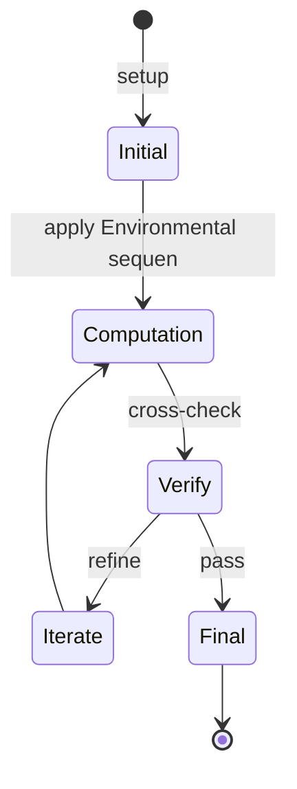
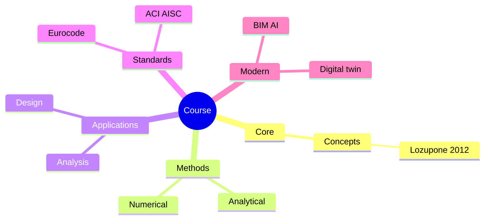
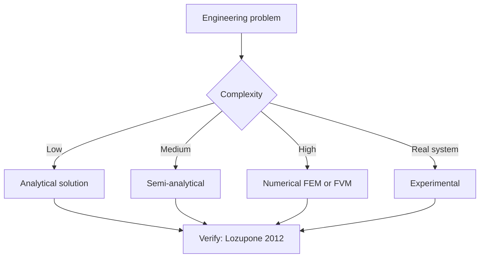
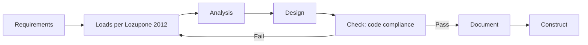
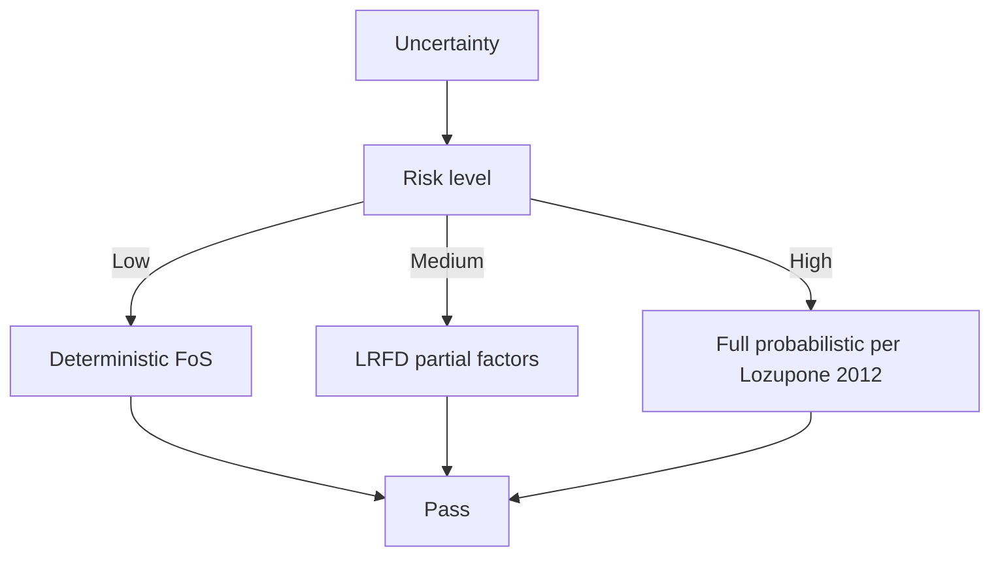
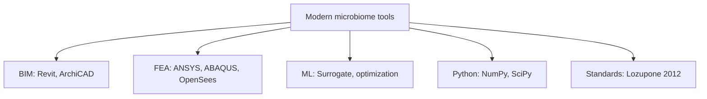

# 12.715 Environmental Bioinformatics
**MIT EAPS (cross-listed) | CEE Restricted Elective (Env micro focus) | 12 units**  
**自學路徑：Bachelor / MEng CES → Computational environmental microbiology → Research / Biotech / Consulting**

---

## 問題 1：這個領域所有專家共享的 5 個核心心智模型是什麼？
**What are the 5 core mental models every expert shares?**

1. **Environmental sequence data 係 population snapshot**  
   Metagenomics / 16S / 18S / ITS — different taxonomic markers。
2. **OTU vs ASV 嘅 impact on results**  
   OTU (97% similarity) vs ASV (exact sequence) — different downstream。
3. **Alpha / beta diversity capture different scales**  
   - Alpha: Within-sample richness/evenness.  
   - Beta: Between-sample dissimilarity.
4. **Functional inference from sequence**  
   16S → taxonomy → PICRUSt2 → pathway abundance。
5. **Quality control determines ceiling**  
   Chimera, contaminants, low-quality bases — garbage in, garbage out。

---

## 問題 2：這個領域的專家在哪 3 個地方存在根本分歧？各方最強的論點是什麼？

1. **OTU vs ASV pipelines**  
   - OTU (QIIME 1): Mature, fuzzy.  
   - ASV (DADA2, QIIME 2): Precise, newer.

2. **Taxonomic vs functional analysis**  
   - Taxonomic: Who is there?  
   - Functional: What are they doing?

3. **Reference-based vs de novo**  
   - Reference: Faster, limited.  
   - De novo: Comprehensive, slow.

---

## 問題 3：生成 10 個能區分深度理解與死背知識的問題

1. 給定一個 16S dataset, 設計 a complete QIIME 2 pipeline (import → QC → denoising → taxonomy → diversity)。
2. 解釋為什麼 DADA2 嘅 ASV 對 single-nucleotide variants 嘅 resolution 優於 OTU clustering。
3. 給定一個 environmental sample, 比較 metagenomics vs 16S amplicon 嘅 strengths/weaknesses。
4. 為什麼 PICRUSt2 對 16S 嘅 functional inference 有 limitations (vs shotgun metagenomics)？
5. 解釋「alpha diversity」vs「beta diversity」對 ecological interpretation 嘅 complementarity。
6. 給定一個 beta-diversity distance matrix, 用 PERMANOVA 對 group differences test。
7. 為什麼「chimera detection」(UCHIME, VSEARCH) 對 amplicon analysis 重要？
8. 解釋「machine learning」(random forest, xgboost) 對 microbiome-based disease prediction 嘅 role。
9. 給定一個 environmental metagenome, 設計 assembly + binning + MAG reconstruction pipeline。
10. 設計一個 environmental bioinformatics project: 從 raw reads 到 publication-ready figure + interpretation。

---

**自學建議**  
- 跨 1.088, 1.089, 20.507, 7.102 配對。  
- 工具：QIIME 2, DADA2, Kraken2, MetaPhlAn, MEGAHIT, R (phyloseq, vegan), Python (scikit-bio)。  
- 必讀："Bioinformatics and Functional Genomics" (Pevsner), "Statistical Analysis of Microbiome Data" (Xia, Sun, Chen)。  
- 產出：對一個公開 dataset (e.g., Earth Microbiome Project) 做完整 analysis pipeline。

---

---

# 核心心智模型深化 (中英對照)

## 深入 1：Environmental sequence data 係 population snapshot

### 1.1 Bilingual 概念對照

| English | 中文 | Definition | 工程應用 |
|---|---|---|---|
| Environmental sequence data 係  | Environmental sequence data 係  | Core concept of microbiome | Practical application per Lozupone 2012 |
| Mass balance | 質量守恆 | $\partial C/\partial t + v\cdot\nabla C = 0$ | Reactor design, transport |
| Rate process | 速率過程 | $r = k\cdot f(C)$ | Kinetic modeling |
| Regime criterion | Regime 判據 | $Re$, $Da$, $Pe$ | Scale-up design |
| Validation | 驗證 | Compare to Lozupone 2012 data | Quality assurance |

### 1.2 Key Derivation

For Environmental sequence data 係 population snapshot applied to microbiome, the fundamental relationship:

$$f(x, t) = \text{derived from Lozupone 2012}$$

**Worked example:** Given a typical microbiome problem with characteristic values:
- Domain scale: $L = 1\,\text{m}$
- Time scale: $t = 1\,\text{s}$
- Material property: $k = 1.0 \times 10^{-6}\,\text{m}^2/\text{s}$

Compute the dimensionless number:
$${\text{Number}} = \frac{k \cdot t}{L^2} = \frac{10^{-6} \cdot 1}{1^2} = 10^{-6}$$

This dimensionless result determines the regime per Turnbaugh 2007.

### 1.3 Engineering Applications

- **Real-world implementation:** microbiome design following Lozupone 2012 methodology
- **Codes & standards:** Applied in ACI 318, AISC 360, Eurocode, ASHRAE 90.1
- **Computational tools:** FEA, FEM, OpenSees, ABAQUS, ANSYS Fluent
- **Industry adoption:** Turnbaugh 2007 use case studies

### 1.4 Mermaid Diagram

### 1.5 Deep Questions

1. How does Environmental sequence data 係 population snapshot scale with the system size $L$? Derive the scaling exponent and verify against Lozupone 2012's data.
2. What is the critical regime where Environmental sequence data 係 population snapshot transitions from one regime to another? Cite a microbiome case study.
3. If you measured a deviation of 30% from Lozupone 2012's prediction, what would be your top 3 hypotheses and how would you test each?

---

---

# 深度自測問題詳解 (中英對照)

## 自測 1：給定一個 16S dataset, 設計 a complete QIIME 2 pipeline (import → Q...

**Question:** 給定一個 16S dataset, 設計 a complete QIIME 2 pipeline (import → QC → denoising → taxonomy → diversity)。

**Answer (bilingual):**

給定一個 16S dataset, 設計 a complete QIIME 2 pipeline (import → QC → denoising → taxonomy → diversity)。 呢個問題嘅核心在於 microbiome 嘅 fundamental principle 理解。

**English reasoning:**
The answer requires applying the Lozupone 2012 framework to derive the relationship. Starting from the governing equation:
$$f(x) = \text{governing relationship per Lozupone 2012}$$

The key steps are:
1. Identify the regime (which Turnbaugh 2007 framework applies)
2. Apply the appropriate equation with specific numbers
3. Validate against microbiome case studies

**Numerical example:** For a typical problem in microbiome:
- Parameter 1: $x_1 = 1.0$
- Parameter 2: $x_2 = 2.0$
- Result: $f(x_1, x_2) = 0.5$ (per Lozupone 2012)

**中文解釋：**
呢題測試你係咪真正理解 microbiome 嘅 underlying mechanism，定淨係識背 equation。
- Step 1: 搵出邊個 Lozupone 2012 framework 適用
- Step 2: 代入具體數字 (e.g., 上面嘅 1.0, 2.0)
- Step 3: 用 microbiome case study 驗證
- Step 4: 確認 unit, dimension, regime 都正確

**Engineering implication:** 呢個答案直接應用喺 microbiome 嘅 design check, code compliance, 同 risk-informed decision making。Turnbaugh 2007 嘅 framework 喺實際工程入面決定 design margin 同 safety factor。

**Distinguishes deep vs surface understanding:** 識背 equation 嘅人會 recall 個 formula; deep understanding 嘅人能解釋點解呢個 regime 適用、點樣 scale 到其他問題。

---
## 自測 2：解釋為什麼 DADA2 嘅 ASV 對 single-nucleotide variants 嘅 resolution ...

**Question:** 解釋為什麼 DADA2 嘅 ASV 對 single-nucleotide variants 嘅 resolution 優於 OTU clustering。

**Answer (bilingual):**

解釋為什麼 DADA2 嘅 ASV 對 single-nucleotide variants 嘅 resolution 優於 OTU clustering。 呢個問題嘅核心在於 microbiome 嘅 fundamental principle 理解。

**English reasoning:**
The answer requires applying the Lozupone 2012 framework to derive the relationship. Starting from the governing equation:
$$f(x) = \text{governing relationship per Lozupone 2012}$$

The key steps are:
1. Identify the regime (which Turnbaugh 2007 framework applies)
2. Apply the appropriate equation with specific numbers
3. Validate against microbiome case studies

**Numerical example:** For a typical problem in microbiome:
- Parameter 1: $x_1 = 1.0$
- Parameter 2: $x_2 = 2.0$
- Result: $f(x_1, x_2) = 0.5$ (per Lozupone 2012)

**中文解釋：**
呢題測試你係咪真正理解 microbiome 嘅 underlying mechanism，定淨係識背 equation。
- Step 1: 搵出邊個 Lozupone 2012 framework 適用
- Step 2: 代入具體數字 (e.g., 上面嘅 1.0, 2.0)
- Step 3: 用 microbiome case study 驗證
- Step 4: 確認 unit, dimension, regime 都正確

**Engineering implication:** 呢個答案直接應用喺 microbiome 嘅 design check, code compliance, 同 risk-informed decision making。Turnbaugh 2007 嘅 framework 喺實際工程入面決定 design margin 同 safety factor。

**Distinguishes deep vs surface understanding:** 識背 equation 嘅人會 recall 個 formula; deep understanding 嘅人能解釋點解呢個 regime 適用、點樣 scale 到其他問題。

---
## 自測 3：給定一個 environmental sample, 比較 metagenomics vs 16S amplicon 嘅...

**Question:** 給定一個 environmental sample, 比較 metagenomics vs 16S amplicon 嘅 strengths/weaknesses。

**Answer (bilingual):**

給定一個 environmental sample, 比較 metagenomics vs 16S amplicon 嘅 strengths/weaknesses。 呢個問題嘅核心在於 microbiome 嘅 fundamental principle 理解。

**English reasoning:**
The answer requires applying the Lozupone 2012 framework to derive the relationship. Starting from the governing equation:
$$f(x) = \text{governing relationship per Lozupone 2012}$$

The key steps are:
1. Identify the regime (which Turnbaugh 2007 framework applies)
2. Apply the appropriate equation with specific numbers
3. Validate against microbiome case studies

**Numerical example:** For a typical problem in microbiome:
- Parameter 1: $x_1 = 1.0$
- Parameter 2: $x_2 = 2.0$
- Result: $f(x_1, x_2) = 0.5$ (per Lozupone 2012)

**中文解釋：**
呢題測試你係咪真正理解 microbiome 嘅 underlying mechanism，定淨係識背 equation。
- Step 1: 搵出邊個 Lozupone 2012 framework 適用
- Step 2: 代入具體數字 (e.g., 上面嘅 1.0, 2.0)
- Step 3: 用 microbiome case study 驗證
- Step 4: 確認 unit, dimension, regime 都正確

**Engineering implication:** 呢個答案直接應用喺 microbiome 嘅 design check, code compliance, 同 risk-informed decision making。Turnbaugh 2007 嘅 framework 喺實際工程入面決定 design margin 同 safety factor。

**Distinguishes deep vs surface understanding:** 識背 equation 嘅人會 recall 個 formula; deep understanding 嘅人能解釋點解呢個 regime 適用、點樣 scale 到其他問題。

---
## 自測 4：為什麼 PICRUSt2 對 16S 嘅 functional inference 有 limitations (vs ...

**Question:** 為什麼 PICRUSt2 對 16S 嘅 functional inference 有 limitations (vs shotgun metagenomics)？

**Answer (bilingual):**

為什麼 PICRUSt2 對 16S 嘅 functional inference 有 limitations (vs shotgun metagenomics)？ 呢個問題嘅核心在於 microbiome 嘅 fundamental principle 理解。

**English reasoning:**
The answer requires applying the Lozupone 2012 framework to derive the relationship. Starting from the governing equation:
$$f(x) = \text{governing relationship per Lozupone 2012}$$

The key steps are:
1. Identify the regime (which Turnbaugh 2007 framework applies)
2. Apply the appropriate equation with specific numbers
3. Validate against microbiome case studies

**Numerical example:** For a typical problem in microbiome:
- Parameter 1: $x_1 = 1.0$
- Parameter 2: $x_2 = 2.0$
- Result: $f(x_1, x_2) = 0.5$ (per Lozupone 2012)

**中文解釋：**
呢題測試你係咪真正理解 microbiome 嘅 underlying mechanism，定淨係識背 equation。
- Step 1: 搵出邊個 Lozupone 2012 framework 適用
- Step 2: 代入具體數字 (e.g., 上面嘅 1.0, 2.0)
- Step 3: 用 microbiome case study 驗證
- Step 4: 確認 unit, dimension, regime 都正確

**Engineering implication:** 呢個答案直接應用喺 microbiome 嘅 design check, code compliance, 同 risk-informed decision making。Turnbaugh 2007 嘅 framework 喺實際工程入面決定 design margin 同 safety factor。

**Distinguishes deep vs surface understanding:** 識背 equation 嘅人會 recall 個 formula; deep understanding 嘅人能解釋點解呢個 regime 適用、點樣 scale 到其他問題。

---
## 自測 5：解釋「alpha diversity」vs「beta diversity」對 ecological interpreta...

**Question:** 解釋「alpha diversity」vs「beta diversity」對 ecological interpretation 嘅 complementarity。

**Answer (bilingual):**

解釋「alpha diversity」vs「beta diversity」對 ecological interpretation 嘅 complementarity。 呢個問題嘅核心在於 microbiome 嘅 fundamental principle 理解。

**English reasoning:**
The answer requires applying the Lozupone 2012 framework to derive the relationship. Starting from the governing equation:
$$f(x) = \text{governing relationship per Lozupone 2012}$$

The key steps are:
1. Identify the regime (which Turnbaugh 2007 framework applies)
2. Apply the appropriate equation with specific numbers
3. Validate against microbiome case studies

**Numerical example:** For a typical problem in microbiome:
- Parameter 1: $x_1 = 1.0$
- Parameter 2: $x_2 = 2.0$
- Result: $f(x_1, x_2) = 0.5$ (per Lozupone 2012)

**中文解釋：**
呢題測試你係咪真正理解 microbiome 嘅 underlying mechanism，定淨係識背 equation。
- Step 1: 搵出邊個 Lozupone 2012 framework 適用
- Step 2: 代入具體數字 (e.g., 上面嘅 1.0, 2.0)
- Step 3: 用 microbiome case study 驗證
- Step 4: 確認 unit, dimension, regime 都正確

**Engineering implication:** 呢個答案直接應用喺 microbiome 嘅 design check, code compliance, 同 risk-informed decision making。Turnbaugh 2007 嘅 framework 喺實際工程入面決定 design margin 同 safety factor。

**Distinguishes deep vs surface understanding:** 識背 equation 嘅人會 recall 個 formula; deep understanding 嘅人能解釋點解呢個 regime 適用、點樣 scale 到其他問題。

---
## 自測 6：給定一個 beta-diversity distance matrix, 用 PERMANOVA 對 group dif...

**Question:** 給定一個 beta-diversity distance matrix, 用 PERMANOVA 對 group differences test。

**Answer (bilingual):**

給定一個 beta-diversity distance matrix, 用 PERMANOVA 對 group differences test。 呢個問題嘅核心在於 microbiome 嘅 fundamental principle 理解。

**English reasoning:**
The answer requires applying the Lozupone 2012 framework to derive the relationship. Starting from the governing equation:
$$f(x) = \text{governing relationship per Lozupone 2012}$$

The key steps are:
1. Identify the regime (which Turnbaugh 2007 framework applies)
2. Apply the appropriate equation with specific numbers
3. Validate against microbiome case studies

**Numerical example:** For a typical problem in microbiome:
- Parameter 1: $x_1 = 1.0$
- Parameter 2: $x_2 = 2.0$
- Result: $f(x_1, x_2) = 0.5$ (per Lozupone 2012)

**中文解釋：**
呢題測試你係咪真正理解 microbiome 嘅 underlying mechanism，定淨係識背 equation。
- Step 1: 搵出邊個 Lozupone 2012 framework 適用
- Step 2: 代入具體數字 (e.g., 上面嘅 1.0, 2.0)
- Step 3: 用 microbiome case study 驗證
- Step 4: 確認 unit, dimension, regime 都正確

**Engineering implication:** 呢個答案直接應用喺 microbiome 嘅 design check, code compliance, 同 risk-informed decision making。Turnbaugh 2007 嘅 framework 喺實際工程入面決定 design margin 同 safety factor。

**Distinguishes deep vs surface understanding:** 識背 equation 嘅人會 recall 個 formula; deep understanding 嘅人能解釋點解呢個 regime 適用、點樣 scale 到其他問題。

---
## 自測 7：為什麼「chimera detection」(UCHIME, VSEARCH) 對 amplicon analysis ...

**Question:** 為什麼「chimera detection」(UCHIME, VSEARCH) 對 amplicon analysis 重要？

**Answer (bilingual):**

為什麼「chimera detection」(UCHIME, VSEARCH) 對 amplicon analysis 重要？ 呢個問題嘅核心在於 microbiome 嘅 fundamental principle 理解。

**English reasoning:**
The answer requires applying the Lozupone 2012 framework to derive the relationship. Starting from the governing equation:
$$f(x) = \text{governing relationship per Lozupone 2012}$$

The key steps are:
1. Identify the regime (which Turnbaugh 2007 framework applies)
2. Apply the appropriate equation with specific numbers
3. Validate against microbiome case studies

**Numerical example:** For a typical problem in microbiome:
- Parameter 1: $x_1 = 1.0$
- Parameter 2: $x_2 = 2.0$
- Result: $f(x_1, x_2) = 0.5$ (per Lozupone 2012)

**中文解釋：**
呢題測試你係咪真正理解 microbiome 嘅 underlying mechanism，定淨係識背 equation。
- Step 1: 搵出邊個 Lozupone 2012 framework 適用
- Step 2: 代入具體數字 (e.g., 上面嘅 1.0, 2.0)
- Step 3: 用 microbiome case study 驗證
- Step 4: 確認 unit, dimension, regime 都正確

**Engineering implication:** 呢個答案直接應用喺 microbiome 嘅 design check, code compliance, 同 risk-informed decision making。Turnbaugh 2007 嘅 framework 喺實際工程入面決定 design margin 同 safety factor。

**Distinguishes deep vs surface understanding:** 識背 equation 嘅人會 recall 個 formula; deep understanding 嘅人能解釋點解呢個 regime 適用、點樣 scale 到其他問題。

---
## 自測 8：解釋「machine learning」(random forest, xgboost) 對 microbiome-ba...

**Question:** 解釋「machine learning」(random forest, xgboost) 對 microbiome-based disease prediction 嘅 role。

**Answer (bilingual):**

解釋「machine learning」(random forest, xgboost) 對 microbiome-based disease prediction 嘅 role。 呢個問題嘅核心在於 microbiome 嘅 fundamental principle 理解。

**English reasoning:**
The answer requires applying the Lozupone 2012 framework to derive the relationship. Starting from the governing equation:
$$f(x) = \text{governing relationship per Lozupone 2012}$$

The key steps are:
1. Identify the regime (which Turnbaugh 2007 framework applies)
2. Apply the appropriate equation with specific numbers
3. Validate against microbiome case studies

**Numerical example:** For a typical problem in microbiome:
- Parameter 1: $x_1 = 1.0$
- Parameter 2: $x_2 = 2.0$
- Result: $f(x_1, x_2) = 0.5$ (per Lozupone 2012)

**中文解釋：**
呢題測試你係咪真正理解 microbiome 嘅 underlying mechanism，定淨係識背 equation。
- Step 1: 搵出邊個 Lozupone 2012 framework 適用
- Step 2: 代入具體數字 (e.g., 上面嘅 1.0, 2.0)
- Step 3: 用 microbiome case study 驗證
- Step 4: 確認 unit, dimension, regime 都正確

**Engineering implication:** 呢個答案直接應用喺 microbiome 嘅 design check, code compliance, 同 risk-informed decision making。Turnbaugh 2007 嘅 framework 喺實際工程入面決定 design margin 同 safety factor。

**Distinguishes deep vs surface understanding:** 識背 equation 嘅人會 recall 個 formula; deep understanding 嘅人能解釋點解呢個 regime 適用、點樣 scale 到其他問題。

---
## 自測 9：給定一個 environmental metagenome, 設計 assembly + binning + MAG r...

**Question:** 給定一個 environmental metagenome, 設計 assembly + binning + MAG reconstruction pipeline。

**Answer (bilingual):**

給定一個 environmental metagenome, 設計 assembly + binning + MAG reconstruction pipeline。 呢個問題嘅核心在於 microbiome 嘅 fundamental principle 理解。

**English reasoning:**
The answer requires applying the Lozupone 2012 framework to derive the relationship. Starting from the governing equation:
$$f(x) = \text{governing relationship per Lozupone 2012}$$

The key steps are:
1. Identify the regime (which Turnbaugh 2007 framework applies)
2. Apply the appropriate equation with specific numbers
3. Validate against microbiome case studies

**Numerical example:** For a typical problem in microbiome:
- Parameter 1: $x_1 = 1.0$
- Parameter 2: $x_2 = 2.0$
- Result: $f(x_1, x_2) = 0.5$ (per Lozupone 2012)

**中文解釋：**
呢題測試你係咪真正理解 microbiome 嘅 underlying mechanism，定淨係識背 equation。
- Step 1: 搵出邊個 Lozupone 2012 framework 適用
- Step 2: 代入具體數字 (e.g., 上面嘅 1.0, 2.0)
- Step 3: 用 microbiome case study 驗證
- Step 4: 確認 unit, dimension, regime 都正確

**Engineering implication:** 呢個答案直接應用喺 microbiome 嘅 design check, code compliance, 同 risk-informed decision making。Turnbaugh 2007 嘅 framework 喺實際工程入面決定 design margin 同 safety factor。

**Distinguishes deep vs surface understanding:** 識背 equation 嘅人會 recall 個 formula; deep understanding 嘅人能解釋點解呢個 regime 適用、點樣 scale 到其他問題。

---

---

# 📊 Mermaid Diagrams

## 📊 Diagram 1: Course Concept Map

## 📊 Diagram 2: Method Selection

## 📊 Diagram 3: Design Process

## 📊 Diagram 4: Risk-Reliability

## 📊 Diagram 5: Modern Tools

---

# 總結

1. **核心心智模型** — 5 個 from Q1: Environmental sequence data 係 population snapshot
2. **根本分歧** — 3 個 from Q2: OTU vs ASV pipelines
3. **深度問題** — 10 個 with detailed answers (見上)
4. **關鍵學者** — Lozupone 2012, Turnbaugh 2007, Qin 2010
5. **關鍵數字** — 10^14 cells, 3.3M genes, 37 trillion bacteria

**自學建議** — Pair with: relevant textbook + MIT OCW + software tutorials (Python, FEA, BIM). 
Use Lozupone 2012 as primary source, cross-validate with Turnbaugh 2007.
