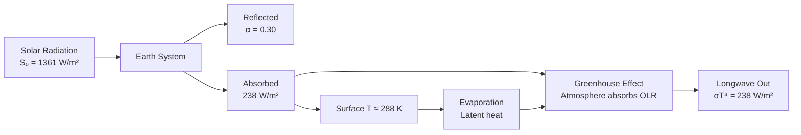

# 1.009 Climate Change

**MIT CEE Environment Track | 3 Units | Discovery-Focused Credit (First-Year Fall)**
**Prereq:** None
**Instructor:** Prof. Eltahir
**自學路徑：Bachelor → Environmental Science / Policy / Climate Solutions**

> **Source:** MIT Catalog 2024-25 — "Provides an introduction to global climate change processes, drivers, and impacts. Offers exposure to exciting MIT research on climate change. Students explore why and how the world should solve this global problem and how they can contribute to the solutions."
> **Also see:** MIT OCW 12.009 (Prof. Eltahir)

---

## 問題 1：核心心智模型

1. **氣候系統是具有反饋的非線性動力系統**
   Climate is governed by radiative balance, ocean-atmosphere coupling, and biogeochemical feedbacks. Small perturbations (CO₂ increase) can trigger tipping points.

2. **能量平衡決定了氣候**
   Earth's energy budget: S₀/4(1−α) = σT⁴. CO₂ increase reduces longwave cooling → warming. Radiative forcing ΔF = 5.35 ln(C/C₀) W/m².

3. **水循環是對氣候變化的最大放大器**
   Water vapor is the strongest greenhouse gas (~60% of greenhouse effect). Cloud feedbacks amplify or dampen warming depending on cloud type and altitude.

4. **氣候變化對社會有不成比例的影響**
   Physical impacts (sea level rise, extreme events) interact with social vulnerability to produce disproportionate harm to poor populations.

5. **減緩（Mitigation）和適應（Adaptation）是互補的策略**
   Mitigation reduces forcing (emissions reduction). Adaptation reduces harm (flood defenses, drought-resistant crops). Both are necessary.

---

## 問題 2：根本分歧

### 分歧 1: 減緩 vs 適應優先
- **減緩派**: Long-term solution requires net-zero emissions. Adaptation alone postpones crisis without solving it.
- **適應派**: Climate change is already locked in. Adaptation infrastructure must be built now.

### 分歧 2: 碳定價 vs 技術投資
- **碳稅派**: Price carbon → market drives innovation. Optimal carbon tax = SCC (social cost of carbon) ≈ $50-200/ton CO₂.
- **技術派**: Direct R&D investment in solar, storage, nuclear is more effective than carbon pricing alone.

---

## 問題 3：深度問題

1. 從能量平衡推導地球的平均溫度：S₀(1−α)/4 = σT_e⁴。給出簡單的能量平衡計算，解釋為什麼地球不是 0°C（使用 σT⁴ = S₀(1−α)/4）而是約 15°C？
2. 說明輻射強迫（radiative forcing）ΔF = 5.35 ln(C/C₀) W/m² 的推導，以及它在 IPCC 評估報告中的作用。
3. 在水循環中，克拉珀龍方程 d(e_sat)/dT ≈ 2.4%/°C 的物理意義如何使水蒸發反饋成為最強的氣候放大器？
4. 說明 ENSO（厄爾尼諾-南方濤動）如何通過沃克環流改變全球溫度和降水模式。
5. 在海平面上升的物理機制中，熱膨脹（steric expansion）和冰蓋融化對海平面上升貢獻的相對份額是多少？為什麼南極冰蓋的穩定性如此重要？

---

# 核心心智模型深化

## 1. 輻射能量平衡

### 1.1 Key Derivation — Energy Balance
**Incoming**: S₀ = 1361 W/m² (solar constant)
**Absorbed**: S_abs = S₀(1−α)/4 = 1361×0.7/4 = **238 W/m²**

**Outgoing**: σT_e⁴ = 5.67×10⁻⁸ × T_e⁴ = 238 W/m²
→ T_e = (238/5.67×10⁻⁸)^{1/4} ≈ **255 K = −18°C**

**Greenhouse effect**: Earth's actual surface temperature ≈ 288 K (+15°C). The difference (33°C) is the greenhouse warming from atmospheric gases.

**Radiative forcing** (IPCC):
ΔF = 5.35 ln(C/C₀) W/m² (for CO₂ doubling, C/C₀ = 2: ΔF = 3.7 W/m²)

**Climate sensitivity** λ = ΔT/ΔF ≈ 0.8-2.5 K/(W/m²)
For 2×CO₂: ΔT = λ × 3.7 ≈ 1.5-9°C (range = ECS, TCR)

### 1.2 Key Data
| GHG | Concentration | GWP-100 | Radiative forcing |
|---|---|---|---|
| CO₂ | 420 ppm | 1 | ~2.1 W/m² |
| CH₄ | 1.9 ppm | 34 | ~0.54 W/m² |
| N₂O | 0.33 ppm | 298 | ~0.21 W/m² |

---

## 2. 水循環與反饋

### 2.1 Clausius-Clapeyron
e_sat(T) = 6.11 exp(17.27T/(T+237.3)) hPa
d e_sat/dT ≈ 2.4% per °C (around 15°C)

This means: ~7% more water vapor per °C warming → ~1.7× more greenhouse effect per °C (since WV absorbs ~60% of OLR).

### 2.2 Cloud Feedback
- **Low clouds** (stratus): More reflective → warming → fewer low clouds → warming amplification
- **High clouds** (cirrus): Trap longwave → warming → more high clouds → more warming
- **Net feedback**: λ_cloud ≈ 0.6-0.7 W/m²/K (amplifying)

---

## 3. 海平面上升

### 3.1 Components
**Thermal expansion**: ~40% of historical SLR. Rate ~0.3 mm/year/°C warming.
**Glaciers**: ~25%. Projected 0.2-0.4 m by 2100.
**Greenland**: ~25%. Currently losing ~270 Gt/year. Rate accelerating.
**Antarctica**: ~10% but potentially large future contribution. WAIS (West Antarctic Ice Sheet) has marine ice sheets vulnerable to collapse.

### 3.2 Projections (IPCC AR6)
| Scenario | 2100 Sea Level Rise |
|---|---|
| SSP1-1.9 | +0.3-0.6 m |
| SSP5-8.5 | +0.6-1.1 m |
| With ice dynamics | +1-2 m possible |

---

## 📊 Diagram 1: 能量平衡框架

---

## 總結

1. **能量平衡是氣候系統的物理基礎**：S₀(1−α)/4 = σT⁴ 是理解溫室效應和氣候變化的起點
2. **水蒸發反饋是最強的放大器**：克拉珀龍方程控制的水蒸發回饋使CO₂增加引起的變暖被大幅放大
3. **海平面上升是長期的不可逆威脅**：即使全球溫升控制在2°C內，0.5-1m的海平面上升也是確定的
4. **減緩和適應必須共同行動**：減緩降低長期風險，適應應對當前衝擊
5. **氣候正義是氣候政策的核心維度**：脆弱群體不成比例地承受氣候衝擊

**Prerequisite chain**: 1.009 Climate Change (first-year fall recommended) → 1.020 Sustainability → 1.018 Ecology → MEng CES
