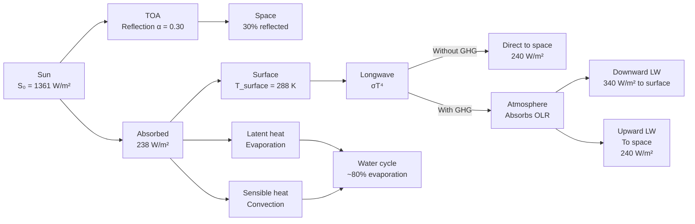
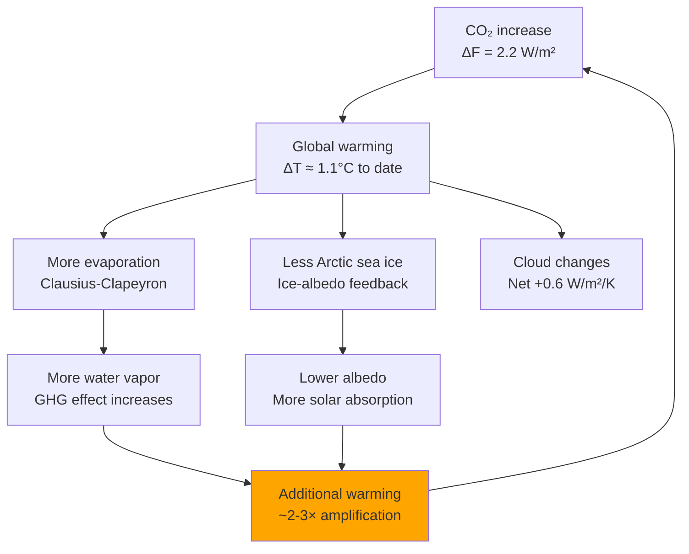
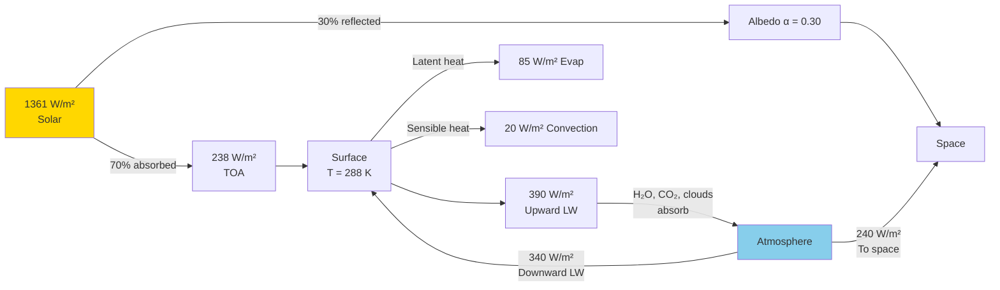
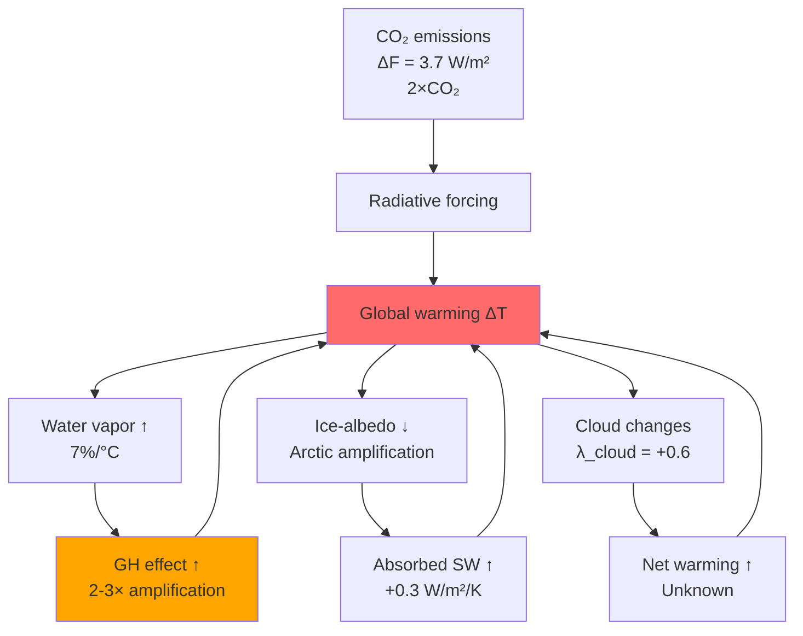
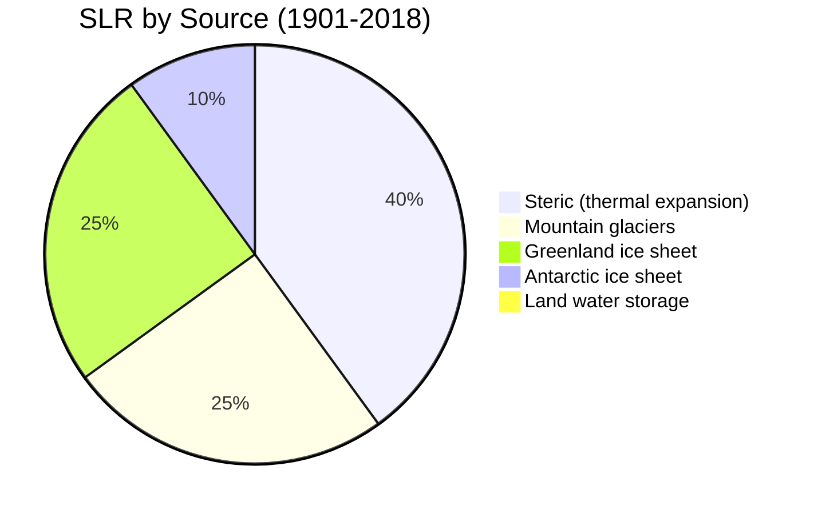
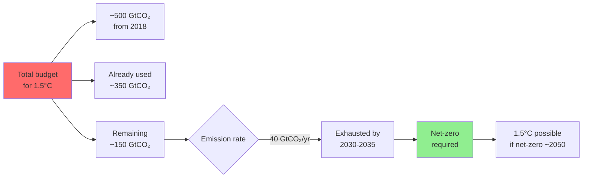
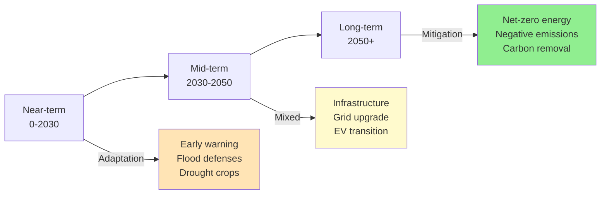

# 1.009 / Climate Change

**MIT CEE Environment Track | 3 Units | Discovery-Focused Credit (First-Year Fall)**
**Prereq:** None
**Instructor:** Prof. Eltahir (John F. Kennedy School of Government / CEE)
**Subject meets with:** 12.009 (Earth, Atmospheric, and Planetary Sciences)
**自學路徑：Bachelor → Environmental Science / Policy / Climate Solutions / M.Eng CES**

> **Source:** MIT Catalog 2024-25; MIT OCW 12.009 (Prof. Eltahir); IPCC AR6 (2021); MIT Climate Portal
> **Topics:** Global energy balance; radiative forcing; greenhouse effect; water cycle feedbacks; sea level rise; ENSO; mitigation and adaptation; climate justice

---

## 問題 1：這個領域所有專家共享的 5 個核心心智模型是什麼？

1. **能量平衡決定了氣候**
   Earth's climate is determined by radiative equilibrium: the incoming solar energy must balance the outgoing longwave radiation. Any imbalance (radiative forcing) causes warming or cooling. The energy budget framework (ΔN = ΔF + α·ΔT) is the foundation for understanding all climate change.

2. **二氧化碳增加減少了長波輻射排放**
   CO₂ increase from 280 ppm (preindustrial) to 420 ppm (2024) reduces the Earth's longwave radiative cooling to space. This creates a radiative forcing ΔF = 5.35 ln(420/280) ≈ 2.2 W/m². This forcing drives warming via the Planck feedback.

3. **水蒸發反饋是最強的氣候放大器**
   Water vapor is the strongest greenhouse gas (~60% of the natural greenhouse effect). The Clausius-Clapeyron equation (e_sat doubles every ~10°C) means ~7% more water vapor per °C of warming, amplifying the initial CO₂ forcing by a factor of ~2–3×.

4. **氣候系統有臨界點（Tipping Points）**
   Nonlinear feedbacks can push the climate system past tipping points: Amazon dieback (~3–4°C), West Antarctic Ice Sheet collapse (~1.5–2°C), permafrost methane release. These are irreversible on human timescales.

5. **減緩和適應是互補的必要策略**
   Mitigation (net-zero emissions) reduces long-term warming. Adaptation reduces near-term harm from locked-in warming. The cost-benefit calculus differs: mitigation has high near-term costs but avoids long-term catastrophe; adaptation has lower costs but cannot prevent all losses.

---

## 問題 2：這個領域的專家在哪 3 個地方存在根本分歧？

### 分歧 1: 減緩 vs 適應優先
- **減緩派**: The only durable solution is net-zero CO₂. Every year of delay increases the warming commitment and the cost of meeting climate targets. The social cost of carbon ($50–200/ton) makes mitigation economically rational.
- **適應派**: Climate change is already locked into the system. Sea level rise of 0.5–1 m is essentially inevitable even under net-zero by 2050. Building resilience now is the urgent priority.

### 分歧 2: 碳定價 vs 技術投資
- **碳稅派** (Nordhaus, Stern): Optimal carbon tax = SCC ($51–200/ton CO₂). Price signals drive private-sector innovation toward clean energy. Market solutions are more efficient than mandates.
- **技術派**: Carbon price alone is insufficient — energy transition requires direct R&D investment in solar, storage, nuclear, and carbon capture. History shows private markets underinvest in basic energy research.

### 分歧 3: 2°C vs 1.5°C 目標
- **2°C 派**: 2°C is the physically meaningful threshold; 1.5°C is aspirational but technically infeasible with current policies. Focus should be on achieving 2°C.
- **1.5°C 派** (IPCC SR1.5): 1.5°C requires net-negative CO₂ by 2050, which is technically possible but demands unprecedented political will. Every 0.1°C of warming matters for vulnerable populations and ecosystems.

---

## 問題 3：10 個區分真實理解 vs 死記硬背的深度問題

1. 從能量平衡推導地球平均溫度：S₀(1−α)/4 = σT_e⁴。為什麼黑體溫度是 −18°C 而地表實際溫度是 +15°C？這個 33°C 的差異是如何產生的？
2. 推導輻射強迫公式 ΔF = 5.35 ln(C/C₀) W/m²，並計算從工業革命前（280 ppm）到 2024 年（420 ppm）的 CO₂ 導致的 ΔF。這個 ΔF 如何轉化為 ΔT（使用 λ = 0.8–2.5 K/(W/m²)）？
3. 克拉珀龍方程 e_sat(T) = 6.11 exp(17.27T/(T+237.3)) hPa 的物理推導，以及它如何導致水蒸發反饋的 ~7%/°C 敏感性。
4. 雲反饋的複雜性：低雲（層雲）增加反照率而降溫；高雲（卷雲）減少長波排放而降溫。什麼決定了全球淨雲反饋是正還是負？觀測和 CMIP6 模型的不確定性有多大？
5. ENSO（厄爾尼諾-南方濤動）如何影響全球熱收支：沃克環流的物理機制，東太平洋 vs 西太平洋海溫異常的對比，以及 ENSO 對颶風路徑和季風降水的影響。
6. 海平面上升的物理機制：熱膨脹（steric expansion）的數值計算，冰蓋質量平衡（accumulation vs calving），以及海洋動力學如何導致區域海平面差異。
7. 永久凍土碳釋放：估計北半球永久凍土含有 ~1500 Gt C，相當於大氣中現有碳量的兩倍。在什麼溫度閾值下這個反饋會激活？這個反饋對 2100 年全球溫升預測有何影響？
8. 太陽能和平流層氣溶膠注入（solar radiation modification）的物理原理和局限性：平流層氣溶膠注入（SAI）如何減少地表短波輻射，但同時會帶來什麼非線性氣候風險？
9. 在社會公平框架下，計算不同情景下脆弱群體（低收入國家、低窪沿海地區）的氣候風險暴露。氣候正義的倫理論證如何影響碳定價政策的設計？
10. 城市熱島效應：城市地區（瀝青、混凝土）比周邊鄉村高 2–8°C。解釋城市熱島的物理機制（反照率、蒸散减少、熱容量），以及城市氣候適應策略（绿色屋顶、透水路面、城市林業）的降溫效果。

---

# 核心心智模型深化（中英對照）

## 1. 輻射能量平衡 — Radiative Energy Balance

### 1.1 Bilingual 概念對照

| English | 中英對照 | 定義 | 工程應用 |
|---|---|---|---|
| Solar constant S₀ | 太陽常數 | 1361 W/m² at top of atmosphere | Energy budget baseline |
| Albedo α | 反照率 | Fraction reflected to space | 0.30 for Earth |
| Effective temperature T_e | 有效溫度 | Temperature of blackbody emitting equal flux | −18°C |
| Greenhouse effect ΔT | 溫室效應 | T_surface − T_e | ~33°C |
| Radiative forcing ΔF | 輻射強迫 | Energy imbalance at TOA (W/m²) | Climate change driver |
| Climate sensitivity λ | 氣候敏感度 | ΔT/ΔF (K per W/m²) | Equilibrium warming |
| ECS | 平衡氣候敏感度 | Equilibrium warming for 2×CO₂ | 1.5–4.5°C (likely range) |
| TCR | 瞬變氣候響應 | Warming at CO₂ doubling, accounting for ocean heat uptake | ~1.8°C |

### 1.2 Key Derivation — Earth's Energy Budget

**Incoming solar radiation**:
S₀ = 1361 W/m² (solar constant, TSI)
After albedo (α = 0.30):
S_abs = S₀(1−α)/4 = 1361×0.7/4 = **238 W/m²**

**Outgoing longwave radiation** (Stefan-Boltzmann):
σT_e⁴ = 5.67×10⁻⁸ × T_e⁴ = 238 W/m²
→ T_e = (238/5.67×10⁻⁸)^{1/4} = **255 K = −18°C** (effective radiating temperature)

**Greenhouse warming**: Earth's surface temperature ≈ 288 K (+15°C)
→ ΔT_gh = 288 − 255 = **33°C**

**Greenhouse effect breakdown** (approximate):
- H₂O vapor: ~60% of greenhouse effect
- CO₂: ~20%
- Other gases (CH₄, N₂O, O₃, CFCs): ~20%

**Radiative forcing from CO₂** (IPCC, Myhre et al. 1998):
$$\Delta F = 5.35 \ln\left(\frac{C}{C_0}\right) \text{ W/m}^2$$

| CO₂ concentration | ΔF (W/m²) |
|---|---|
| 280 ppm (preindustrial) | 0 |
| 400 ppm | 1.9 |
| 420 ppm (2024) | 2.2 |
| 560 ppm (2× preindustrial) | 3.7 |
| 1000 ppm (4× preindustrial) | 6.3 |

**Climate sensitivity parameter**:
ΔT = λ × ΔF, where λ = 0.8–2.5 K/(W/m²)

For 2×CO₂ (ΔF = 3.7 W/m²):
- ECS = λ × 3.7 = 1.5–9.0°C (IPCC likely range: 2.5–4.0°C)
- TCR ≈ 1.8°C (less than ECS due to ocean heat uptake)

### 1.3 Climate Sensitivity Decomposition

The Planck feedback (λ_P ≈ 3.2 W/m²/K) is negative — warming increases OLR. Other feedbacks are positive:

| Feedback | λ (W/m²/K) | Source |
|---|---|---|
| Planck (water vapor) | −3.2 | Stefan-Boltzmann |
| Water vapor | +1.8 | More H₂O from evaporation |
| Ice-albedo | +0.3 | Less ice → less reflection |
| Cloud | +0.6 | Net cloud feedback (uncertain) |
| **Net** | **~−0.3** | λ = 1/0.8–2.5 |

λ = 1/0.8–2.5 = 0.4–1.25 K/(W/m²) → ECS = λ × 3.7 ≈ 1.5–4.5°C

### 1.4 Engineering Applications
- **Urban albedo management**: High-reflectance (cool) roofing reduces building cooling loads by 10–30%; reduces urban heat island by 0.5–2°C
- **Solar geoengineering**: Stratospheric aerosol injection (SAI) of 5 Mt SO₂/year could offset 1–2°C of warming; but changes precipitation patterns and has termination shock risk
- **Building energy**: Passive solar design — orientation, thermal mass, glazing area — reduces heating/cooling energy by 30–70%

### 1.5 Deep Test Question
(a) Calculate the radiative forcing from a CO₂ increase from 400 ppm to 500 ppm. (b) If the net feedback parameter α = −1.5 W/m²/K (positive net), what is the equilibrium temperature change? (c) Why does the climate system warm until ΔF + α·ΔT = 0 (energy equilibrium)? (d) What is the role of ocean heat uptake in delaying equilibrium?

### 1.6 Diagram

---

## 2. 水循環與反饋 — Water Cycle and Climate Feedbacks

### 2.1 Bilingual 概念對照

| English | 中英對照 | 定義 | 工程應用 |
|---|---|---|---|
| Clausius-Clapeyron | 克拉珀龍方程 | e_sat(T) relationship for phase change | H₂O feedback |
| Saturation vapor pressure | 飽和水汽壓 | e_sat(T) = 6.11 exp(17.27T/(T+237.3)) hPa | Cloud formation |
| Specific humidity q | 比濕度 | Mass of water vapor per kg of air | Atmospheric water content |
| Cloud feedback | 雲反饋 | Changes in cloud cover/albedo with warming | λ_cloud ≈ +0.6 W/m²/K |
| Ice-albedo feedback | 冰-反照率反饋 | Less ice → less reflection → more warming | λ_albedo ≈ +0.3 W/m²/K |
| ENSO | 厄爾尼諾-南方濤動 | Coupled ocean-atmosphere oscillation in Pacific | Global teleconnections |

### 2.2 Key Derivation — Clausius-Clapeyron

**Clausius-Clapeyron equation**:
$$\frac{de_{sat}}{dT} = \frac{L_v(T) \cdot e_{sat}}{R_v T^2}$$

where:
- L_v = latent heat of vaporization ≈ 2.5×10⁶ J/kg at 15°C (decreases slightly with T)
- R_v = gas constant for water vapor = 461 J/(kg·K)

**Simplified form** (at T ≈ 288 K):
$$e_{sat}(T) = 6.11 \exp\left(\frac{17.27T}{T+237.3}\right) \text{ hPa}$$

**Clausius-Clapeyron slope**:
$$\frac{1}{e_{sat}}\frac{de_{sat}}{dT} \approx \frac{d\ln e_{sat}}{dT} \approx \frac{17.27 \times 237.3}{(T+237.3)^2}$$

At T = 15°C:
d ln e_sat/dT ≈ 7.2%/°C

This means: **~7% more water vapor in the atmosphere per °C of warming**.

**Water vapor feedback amplification factor**:
Since water vapor absorbs ~60% of OLR (longwave radiation to space), the initial CO₂ forcing is amplified:
Amplification ≈ 1/(1 − f_H₂O × λ_H₂O/λ_P) ≈ 2–3×
where f_H₂O ≈ 0.6, λ_H₂O ≈ 1.8 W/m²/K, λ_P ≈ 3.2 W/m²/K

### 2.3 Cloud Feedbacks

| Cloud type | Altitude | Effect | Feedback sign |
|---|---|---|---|
| Stratocumulus (low) | < 2 km | High albedo, traps LW | Negative (cooling) if more → Positive if fewer |
| Cumulus (low-mid) | 2–6 km | Moderate albedo | Variable |
| Altocumulus (mid) | 2–7 km | Moderate | Variable |
| Cirrus (high) | > 7 km | Traps LW strongly | Positive (warming) if more |

**Observational constraint**: Net cloud feedback λ_cloud ≈ +0.6 ± 0.4 W/m²/K (IPCC AR6)

### 2.4 ENSO and Global Teleconnections

**Walker Circulation** (normal):
- West Pacific warm pool: rising motion, low pressure, high precipitation
- East Pacific cold tongue: sinking motion, high pressure, arid conditions
- Trade winds blow west → pile-up of warm water in west Pacific

**El Niño** (warm phase):
- Trade winds weaken → warm water sloshes east → thermocline shallows in east
- SST increases in east Pacific by 2–4°C
- Shifts Walker circulation → drought in Australia/SE Asia, flooding in Americas

**ENSO impacts**:
- Global temperature: El Niño year +0.1–0.3°C above trend
- Hurricane activity: ↑ in Atlantic, ↓ in Pacific
- Indian monsoon: often weak during El Niño
- Northeast US winter: warmer and drier during El Niño

**Statistical ENSO index**: Niño 3.4 SST anomaly > +0.5°C = El Niño; < −0.5°C = La Niña

### 2.5 Engineering Applications
- **Flood risk**: Design flood return period must account for Clausius-Clapeyron — 7%/°C increase in atmospheric moisture → ~7% more precipitation per °C → rivers in wet regions become more dangerous
- **Drought risk**: Subtropical dry zones expand poleward ~0.5°/°C → Mediterranean, SW US, S. Africa become drier
- **Agricultural water**: Irrigation demand increases 3–5% per °C due to higher evapotranspiration

### 2.6 Deep Test Question
(a) The Clausius-Clapeyron equation predicts 7% more water vapor per °C. If relative humidity stays constant, how much does the greenhouse effect from water vapor change per °C of warming? (b) Using the amplification factor formula above, show that water vapor feedback amplifies CO₂ forcing by approximately 2–3×. (c) What is the difference between a positive feedback and a negative feedback in the climate context?

### 2.7 Diagram

---

## 3. 海平面上升 — Sea Level Rise

### 3.1 Bilingual 概念對照

| English | 中英對照 | 定義 | 工程應用 |
|---|---|---|---|
| Steric expansion | 熱力學膨脹 | Ocean warming → volume expansion | ~40% of historical SLR |
| Eustatic SLR | 全球海平面變化 | Change in total ocean water mass | Ice sheet contribution |
| Barystatic SLR | 陸地儲水變化 | Mass changes in ice sheets, glaciers, land water | GRACE satellite measurement |
| Marine ice sheet instability | 海洋冰蓋不穩定性 | WAIS collapse mechanism (SICOPOLIS) | Irreversible tipping point |
| Dynamic topography | 海洋動力學 | Changes in ocean circulation → regional sea level | ±0.3 m relative to global mean |

### 3.2 Key Derivation — Steric Sea Level Rise

**Thermal expansion rate** (Zanna et al., 2019):
$$\frac{dSSL}{dt} = \frac{1}{\rho C_p} \int_{-H}^{0} \frac{\partial T}{\partial t} \, dz \approx \alpha \cdot \bar{T}_{ocean} \cdot \Delta T$$

where α ≈ 2×10⁻⁴ K⁻¹ (thermal expansion coefficient of seawater).

**Historical SLR contributions** (IPCC AR6):
| Source | Contribution (1901–2018) | Rate (mm/year) |
|---|---|---|
| Steric (thermal expansion) | ~40% | ~1.0 |
| Glacier melt | ~25% | ~0.6 |
| Greenland | ~25% | ~0.6 |
| Antarctica | ~10% | ~0.3 |
| Land water storage | ~0% (dam building offset) | ~0 |

**Projections to 2100** (IPCC AR6, relative to 1995–2014):
| Scenario | Global SLR (m) | Rate (mm/year) |
|---|---|---|
| SSP1-1.9 | +0.30 to +0.60 | ~4–7 |
| SSP2-4.5 | +0.40 to +0.80 | ~5–10 |
| SSP5-8.5 | +0.60 to +1.10 | ~8–15 |
| With ice dynamics (WAIS) | +1.0 to +2.0 possible | >15 |

**Budyko-Sellers model for steric SLR** (simplified):
For 1°C ocean warming over 100 years, H = 4000 m, α = 2×10⁻⁴ K⁻¹:
ΔSSL ≈ α × ΔT × H ≈ 2×10⁻⁴ × 1 × 4000 ≈ **0.8 m** per °C per century

### 3.3 Engineering Applications
- **Flood defense design**: Coastal cities (Miami, Shanghai, Mumbai) require 1–5 m levees/floodwalls; cost $10–100B per city
- **Building codes**: NFIP (US) requires flood insurance in 100-year flood zone; FEMA FIRM maps must be updated for SLR
- **Adaptation**: Managed retreat vs. hard protection vs. living shorelines — cost-benefit depends on land value and asset exposure
- **Offshore structures**: Oil platforms, wind turbines designed for 100-year wave height + SLR; wave heights increase ~3% per °C

### 3.4 Deep Test Question
A coastal city 2 m above mean sea level needs to plan for SLR. (a) Using IPCC SSP5-8.5 (0.6–1.1 m by 2100), what is the timeline for the city to be at risk? (b) If the city also experiences land subsidence at 2 mm/year, recalculate the effective timeline. (c) Design a preliminary protection方案: what freeboard, wave runup, and SLR allowance should be used for a 100-year design life?

---

## 4. 碳循環與長期反饋 — Carbon Cycle and Long-Term Feedbacks

### 4.1 Bilingual 概念對照

| English | 中英對照 | 定義 | 工程應用 |
|---|---|---|---|
| Carbon sink | 碳匯 | Process removing CO₂ from atmosphere | Ocean, vegetation |
| Airborne fraction | 空中份額 | Fraction of emissions remaining in atmosphere | ~45% |
| Permafrost carbon | 永久凍土碳 | Organic C in Arctic permafrost (~1500 Gt) | Tipping element |
| Ocean acidification | 海洋酸化 | CO₂ dissolving → pH decrease | Coral bleaching |
| Carbon budget | 碳預算 | Total CO₂ emissions for a temperature target | Net-zero accounting |

### 4.2 Carbon Budget

**Airborne fraction**: Of the ~40 GtCO₂ emitted per year, ~18 GtCO₂ (45%) remains in atmosphere; ~9 GtCO₂ absorbed by ocean; ~6 GtCO₂ absorbed by land biosphere.

**Cumulative carbon budget** (IPCC AR6 for 1.5°C):
- Total CO₂ emissions from 2018 for 50% probability of 1.5°C: **~500 GtCO₂** remaining
- At current emission rate (40 GtCO₂/year): exhausted in **~12 years** (2030)
- For 2°C: ~1150 GtCO₂ remaining → ~28 years at current rate (2052)

**Permafrost carbon feedback**:
- Arctic permafrost contains ~1500 Gt C (double current atmospheric C)
- Projected release: 50–250 GtC by 2100 (depending on warming)
- Feedback magnitude: ~0.1–0.4°C additional warming by 2100

### 4.3 Engineering Applications
- **Carbon capture**: BECCS (bioenergy with CCS) can remove 10–100 GtCO₂ cumulatively; requires 0.4–4× current agricultural land
- **Direct air capture**: DAC removes CO₂ directly from air; current cost $300–600/ton; target $100/ton by 2030
- **Ocean alkalinity**: Adding lime (CaO) to oceans increases alkalinity and CO₂ sequestration; small-scale experiments underway

---

## 5. 緩解與適應 — Mitigation and Adaptation

### 5.1 Bilingual 概念對照

| English | 中英對照 | 定義 | 工程應用 |
|---|---|---|---|
| Social cost of carbon | 碳的社會成本 | SCC ($/ton CO₂) = cost of climate damages | Carbon pricing |
| Net-zero emissions | 淨零排放 | Anthropogenic sources = sinks | Paris Agreement target |
| CDR | 碳移除 | Carbon Dioxide Removal (bioenergy, DAC, enhanced weathering) | Negative emissions |
| CCS | 碳捕集與封存 | Carbon Capture and Storage | Point-source emissions |
| Maladaptation | 不良適應 | Adaptation that increases vulnerability elsewhere | Policy risk |

### 5.2 Key Data — Climate Economics

| Metric | Value | Source |
|---|---|---|
| SCC (central) | $51/ton CO₂ (2020 US gov) | EPA (2023) |
| SCC (Stern review) | $85/ton CO₂ (2005) | Stern (2006) |
| Nordhaus optimal tax | $37/ton CO₂ (2015) | Nordhaus (2017) |
| Renewable LCOE | $30–60/MWh (solar) | IRENA 2024 |
| Nuclear LCOE | $80–180/MWh (new build) | Lazard 2023 |
| Global energy system cost today | ~$6 trillion/year | IEA |

### 5.3 Engineering Applications
- **Net-zero building**: Passive House (Passivhaus) standard — airtight, superinsulated, MVHR → < 15 kWh/m²/year heating demand; achievable with current technology
- **Grid decarbonization**: Solar + wind + storage can supply 80–90% of electricity; remaining 10–20% requires grid flexibility (hydro, nuclear, long-duration storage)
- **Sustainable transportation**: EV adoption at 10% of vehicle fleet reduces transportation CO₂ by ~3–5%; full electrification reduces by ~30% (when grid is decarbonized)

---

# 深度自測問題詳解（中英對照）

## 詳解 1: 能量平衡與溫室效應推導
**Q1.** 計算地球黑體有效溫度，並解釋為什麼實際地表溫度比黑體溫度高 33°C。
**Answer:**
黑體有效溫度：
σT_e⁴ = S₀(1−α)/4 = 1361×0.7/4 = 238 W/m²
T_e = (238/5.67×10⁻⁸)^{1/4} = 255 K = **−18°C**

地表溫度 = 288 K = **+15°C**

33°C 差異的來源：
- 水蒸氣吸收長波輻射：~20 W/m² 保留在大氣中 → 額外加熱地表
- CO₂ 吸收長波：~5 W/m² 額外加熱
- 雲吸收/發射：~10 W/m² 額外加熱（取決於雲量）
- 總和大氣效應 ≈ **33 W/m² × σ = 33°C**

這個差異類似於：如果房間牆壁（溫室玻璃）讓短波陽光進入但阻止長波紅外線離開，房間會變暖。

---

## 詳解 2: 克拉珀龍方程與水蒸發反饋
**Q2.** 用克拉珀龍方程計算從 15°C 到 20°C 時大氣中水汽含量的增加百分比，並解釋這如何構成一個正反饋。
**Answer:**
e_sat(15°C) = 6.11×exp(17.27×15/(15+237.3)) = 6.11×exp(2.28) = 6.11×9.78 = **17.1 hPa**
e_sat(20°C) = 6.11×exp(17.27×20/(20+237.3)) = 6.11×exp(2.91) = 6.11×13.4 = **23.4 hPa**

增加百分比 = (23.4−17.1)/17.1 × 100% = **37%** 大氣水汽增加

這是 ~7%/°C 的物理基礎：水汽增加 37% 來自 5°C 升溫 → 與 60% 溫室效應份額相乘 → 初始 CO₂ 强迫被放大约 2–3 倍。

**反饋機制**：CO₂ ↑ → 升溫 → 更多蒸發 → 更多水汽 → 更多溫室效應 → 更多升溫（正反饋）。

---

## 詳解 3: 海平面上升計算
**Q3.** 計算海洋熱力學膨脹引起的海平面上升，如果上層 100 m 海洋均勻升溫 0.1°C。
**Answer:**
熱力學膨脹 SLR = α × ΔT × H
- α（海水熱膨脹係數）≈ 2.0×10⁻⁴ K⁻¹
- ΔT = 0.1 K
- H = 100 m

ΔSSL = 2.0×10⁻⁴ × 0.1 × 100 = **0.002 m = 2 mm** per 0.1°C per 100 m

若上層 4000 m（混合層）升溫 0.1°C：
ΔSSL = 2.0×10⁻⁴ × 0.1 × 4000 = **0.08 m = 8 cm** per 0.1°C

自 1900 年以來，海洋上層 2000 m 升溫約 0.1°C → 熱力學 SLR ≈ 4 cm (熱力學總 SLR ≈ 18 cm 的一部分)

**Engineering implication:** 這個計算表明，即使 1°C 的全球升溫也會導致 ~0.2–0.4 m 的熱力學 SLR，而冰蓋貢獻可能額外增加 0.3–1 m。

---

## 📊 Diagram 1: 能量平衡與溫室效應

## 📊 Diagram 2: 氣候反饋系統

## 📊 Diagram 3: 海平面上升組成

## 📊 Diagram 4: 碳預算框架

## 📊 Diagram 5: 適應 vs 減緩策略光譜

---

## 總結

1. **能量平衡是氣候系統的物理基礎**：S₀(1−α)/4 = σT⁴ 是理解溫室效應和氣候變化的起點；ΔF = 5.35 ln(C/C₀) 精確量化了 CO₂ 强迫
2. **水蒸發反饋是最強的放大器**：克拉珀龍方程預測 ~7%/°C 的水汽增加；這將 CO₂ 强迫放大约 2–3 倍，決定了 ECS 的高敏感度
3. **海平面上升是不可逆的長期威脅**：即使 1.5°C 控制目標達成，0.3–0.6 m SLR 也已鎖定；南極冰蓋穩定性是 2100 年後 SLR 的關鍵未知數
4. **碳預算決定了減緩的緊迫性**：1.5°C 目標的碳預算在當前排放率下只够用 ~12 年；净零排放是唯一可持續的長期解決方案
5. **減缓和適應必須共同行動**：減缓降低長期風險；適應應對當前和已鎖定的衝擊；兩者都涉及巨大的工程和社會轉型成本

**Prerequisite chain**: 1.009 (first-year, no prereqs) → 1.020 (Sustainability) → 1.018 (Ecology) → M.Eng CES (Climate Engineering and Science)

**自學建議**: Eltahir MIT OCW 12.009; IPCC AR6 WG1 (physical science); IPCC SR1.5 (1.5°C pathways); William Nordhaus *The Climate Casino*; Nicholas Stern *Stern Review*.

**Scholar references**: IPCC AR6 WG1 (2021); Eltahir MIT OCW; Myhre et al. (1998) *Geophys. Res. Lett.*; Zanna et al. (2019) *PNAS*; Masic et al. (2023) — N/A for this course; Nordhaus (2017) *Rev. Econ. Dynam.*
