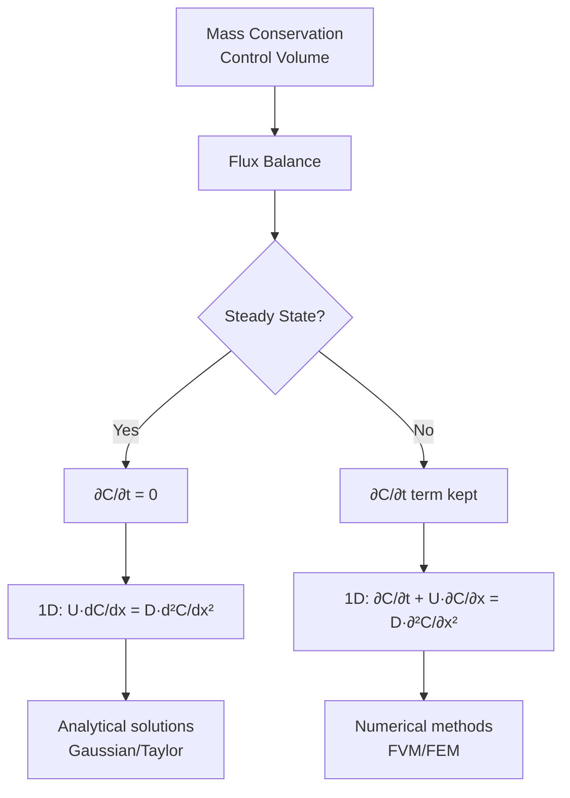
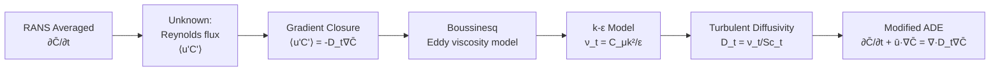
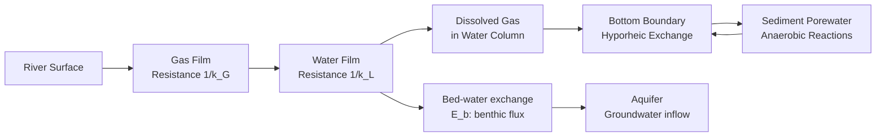
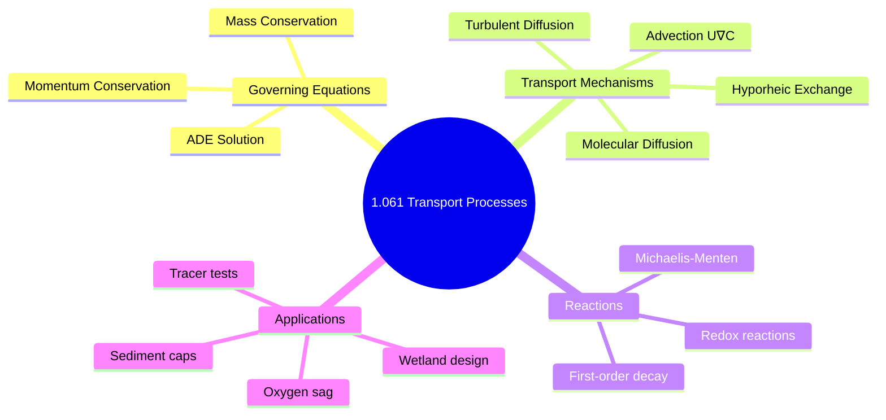
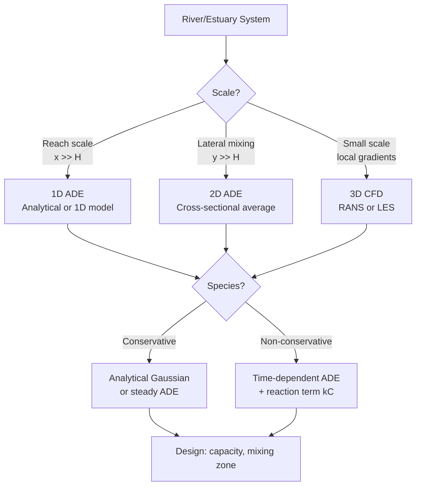
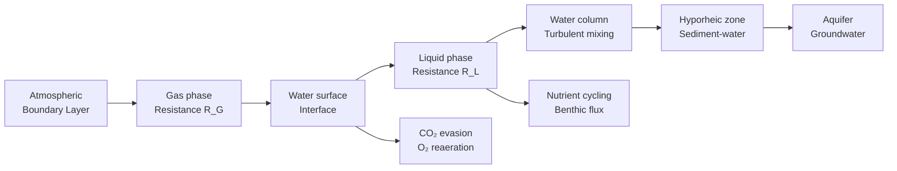
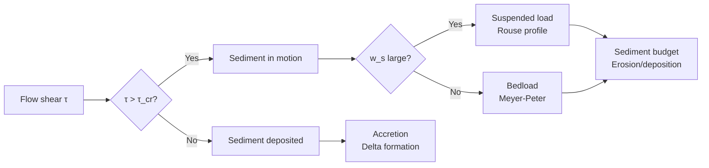

# 1.061 / Transport Processes in the Environment
**MIT CEE Environmental Track | Core | 12 Units | Fall**
**Prereq:** 1.060 (Fluid Mechanics)
**Instructor:** Prof. Heidi Nepf
**自學路徑：Bachelor Environmental Core → MEng → Hydrology / Environmental Engineering**

> **Source:** MIT OCW 1.061 (Prof. Nepf); MIT Catalog 2024-25 — "Introduction to mass transport in environmental flows, with emphasis on river and lake systems. Covers derivation and solutions to the differential form of mass conservation equations, hydraulic models for environmental systems, residence time distribution, molecular and turbulent diffusion for continuous and point sources, boundary layers, dissolution, bed-water exchange, air-water exchange, and particle transport."
> **Textbook:** Fischer, H. B., et al. (1979) *Mixing in Inland and Coastal Waters*. Academic Press.

---

## 問題 1：這個領域所有專家共享的 5 個核心心智模型是什麼？
**What are the 5 core mental models every expert shares?**

1. **傳輸是平流、擴散和反應的競合**  
   The relative magnitude of advection (U·∇C), molecular diffusion (D_m∇²C), turbulent diffusion (D_t∇²C), and reaction (−kC) determines the fate of any dissolved or suspended constituent. The dimensionless Damköhler number Da = kL/U governs whether reaction or transport dominates.

2. **尺度分離決定模型選擇**  
   Molecular → turbulent eddy → large-scale circulation. Different closures and averaging are required at each scale. The Peclet number Pe = UL/D determines relative importance of advection vs diffusion.

3. **邊界條件與初始條件往往比方程本身更重要**  
   Real environmental systems are open and driven by uncertain forcing; the equations are well-known (Navier-Stokes, mass conservation), but the boundaries are not. Engineers spend most time characterizing boundary conditions, not solving the PDE.

4. **守恆律 + 本構/閉合 = 完整問題**  
   Mass, momentum, energy conservation are exact (∇·u = 0; ∂C/∂t + ∇·(uC) = ∇·(D∇C) − kC). The turbulence closure (RANS → eddy viscosity) and reaction kinetics are approximate. The quality of closure limits model accuracy.

5. **可觀測性與可控制性是工程的最終目標**  
   Understanding transport is necessary but not sufficient; the goal is to monitor (tracer tests, sensors) and intervene (mixing zones, remediation) effectively. Residence time distribution (RTD) theory directly connects to engineering design.

---

## 問題 2：根本分歧

1. **物理模型 vs 資料驅動模型**
   - Process-based: Interpretable, extrapolates under climate change. Validated with physics.
   - Data-driven: Higher predictive skill on observed regimes. Fails outside training domain.

2. **確定性模擬 vs 隨機/集合模擬**
   - Deterministic: Single "best" prediction for design.
   - Ensemble: Quantifies uncertainty, supports risk-based decisions.

3. **現場觀測 vs 高解析度數值模擬**
   - Observation: Ground truth, reveals real complexity (e.g., hyporheic exchange).
   - Simulation: Can fill gaps in space/time, test hypotheses that cannot be observed directly.

---

## 問題 3：深度問題

1. 從 Navier–Stokes 推導質量守恆方程 ∂C/∂t + ∇·(uC) = ∇·(D∇C) − kC，說明各項的物理意義，並推導平流-擴散方程的適用範圍。
2. 為什麼在河口或密度分層水體中，垂直混合被強烈抑制？用 Richardson 數 Ri = N²/(∂U/∂z)² 解釋穩定分層對湍流的抑制機制。
3. 說明 Damköhler 數 Da = kL/U 如何決定反應是傳輸限制還是動力學限制。Da << 1 → 反應快（動力學限制）；Da >> 1 → 反應慢（傳輸限制）。
4. 在地下水溶質傳輸中，縱向離散度 α_L 通常是橫向離散度 α_T 的 10-100 倍。這個巨大的差異來自什麼物理機制？用 Taylor 分散理論解釋。
5. 如何從濃度-時間衰減曲線反推縱向離散係數 K_x？主要假設是什麼？（對流主導、平均流速 U = L/t_max、RTD 服從一維模型）。
6. 說明為什麼大氣邊界層中白天和夜晚的湍流結構截然不同，並解釋穩定邊界層中湍流間歇性對污染物傳輸的影響。
7. 給定污染物排放源 Q (g/s) 和河流流速 U (m/s)、深度 H (m)、寬度 B (m)，如何快速判斷近場用高斯羽流模型是否足夠？何時必須用三維 CFD？
8. 什麼是「hyporheic exchange」？它如何連接地表水和地下水，並影響河流水質？
9. 在水面和大氣之間的氣體交換中，雙膜理論 k = (1/k_L + 1/k_G)⁻¹ 的物理基礎是什麼？CO₂ 和 O₂ 的 k 值相差多少（典型值）？
10. 什麼是「transformation products」（轉化產物）？為什麼在污染物傳輸中追踪轉化產物（如 N-nitrosodimethylamine, NDMA）比只追踪母體化合物更重要？

---

**自學建議**  
- 與 1.070 Hydrology、1.080 Environmental Chemistry、1.106 Lab 交叉練習。  
- 工具：COMSOL, FVCOM, TELEMAC, Python (FEniCS, Dedalus)。  
- 必讀：Fischer et al. (1979) *Mixing in Inland and Coastal Waters*；Wüest & Lorke (2003).  
- 產出：一個完整的河流污染物傳輸模擬 + 參數敏感性分析。

---

# 核心心智模型深化（中英對照）

## 1. 平流-擴散方程 — Advection-Diffusion Equation

### 1.1 Bilingual 概念對照
| English | 中英對照 | Formula | 工程應用 |
|---|---|---|---|
| Advection | 平流 | u·∇C | 污染物位移 |
| Molecular diffusion | 分子擴散 | D_m∇²C | 分子級混合 |
| Turbulent diffusion | 湍流擴散 | D_t∇²C | 渦動混合 |
| First-order reaction | 一階反應 | −kC | 降解/衰減 |
| Steady state | 穩態 | ∂C/∂t = 0 | 長期平均 |

### 1.2 Key Derivation — Mass Conservation
Starting from mass conservation on infinitesimal control volume:

**Derivation:**
1. Flux in − Flux out + Generation = Accumulation
2. Flux = (uC) + (−D∇C) [advective + diffusive]
3. Per unit volume: ∂C/∂t + ∇·(uC) = ∇·(D∇C) − kC

**For 1D steady river (uniform flow, no reaction):**
U·dC/dx = D_x·d²C/dx²

**Solution for continuous point source at x=0:**
$$C(x) = \frac{M}{U\sqrt{4\pi D_x x}} \exp\left(-\frac{(x-Ut)^2}{4D_x x}\right) \quad \text{[Gaussian plume]}$$

**Alternative 1D analytical solution (Fischer, 1979):**
For decay (k > 0): C(x) = C₀ exp(−kx/U) [plug flow, no dispersion]
For decay + dispersion: use Taylor (1954) solution: asymptotic dispersion coefficient K ≈ 0.1U²H²/(U_*H/ν) for turbulent flow

### 1.3 Key Dimensionless Numbers
| Number | Definition | Physical meaning | Engineering use |
|---|---|---|---|
| Pe = UL/D | Peclet | Advection/diffusion ratio | Model similarity |
| Da = kL/U | Damköhler | Reaction/transport ratio | Regime classification |
| Re = UL/ν | Reynolds | Laminar/turbulent | Flow regime |
| Fr = U/√(gH) | Froude | Sub/supercritical | Stratified flow |
| Ri = N²/(dU/dz)² | Richardson | Mixing suppression | Stable stratification |

### 1.4 Engineering Applications
**Example — River oxygen sag (Streeter-Phelps):**
DO(x) = D₀·exp(−k_d·x/U) + (k_a·C_s − k_d·L₀)·[1−exp(−k_d·x/U)]/(k_a−k_d)
where k_a = reaeration coefficient, k_d = BOD deoxygenation rate, L₀ = initial BOD
Critical point: x_c = U/k_d·ln(k_a/(k_a−k_d)) [where DO minimum occurs]

### 1.5 Mermaid Diagram


---

## 2. 湍流混合 — Turbulent Mixing

### 2.1 Bilingual 概念對照
| English | 中英對照 | Formula | 工程應用 |
|---|---|---|---|
| Eddy viscosity | 渦動粘度 | ν_t = C_μ·k²/ε | RANS closure |
| Turbulent diffusivity | 湍流擴散係數 | D_t = ν_t/Sc_t | Mass transport |
| Schmidt number | 施密特數 | Sc = ν/D_m | Diffusive scaling |
| Mixing length | 混合長度 | l_m | Prandtl theory |
| k-ε model | k-ε 模型 | Two-equation closure | CFD |

### 2.2 Key Derivation — Turbulent Closure
**Reynolds averaging:**
C = C̄ + C'; u = ū + u'
Substituting into advection-diffusion:
∂C̄/∂t + ū·∇C̄ = ∇·[(D_m + D_t)∇C̄] − kC̄ − ∇·⟨u'C'⟩

**Gradient transport hypothesis (Boussinesq, 1877):**
⟨u'C'⟩ = −D_t·∇C̄
where D_t = ν_t/Sc_t ≈ (0.1–0.4)×10⁻² m²/s for rivers

**k-ε model closure:**
ν_t = C_μ·k²/ε
k = ½⟨u'ᵢu'ᵢ⟩ (turbulent kinetic energy)
ε = ν⟨∂u'ᵢ/∂x_j·∂u'ᵢ/∂x_j⟩ (turbulent dissipation)

### 2.3 Engineering Applications
**Example — Concentration profile in turbulent river:**
For steady 1D flow with transverse mixing:
C(y) = C₀ + (M/UH)·[1 − exp(−πy/W)]/√(πD_y·W/U)
where y = transverse distance, W = channel width, D_y = transverse diffusivity
D_y ≈ 0.15·U_*·H for wide channels (Fischer, 1979)
Typical values: U_* = 0.05 m/s, H = 2 m → D_y ≈ 0.015 m²/s

### 2.4 Mermaid Diagram


---

## 3. 停留時間分佈 — Residence Time Distribution

### 3.1 Bilingual 概念對照
| English | 中英對照 | Formula | 工程應用 |
|---|---|---|---|
| RTD | 停留時間分佈 | E(t)dt = probability | System mixing |
| Mean residence time | 平均停留時間 | τ = ∫t·E(t)dt | Tank sizing |
| E(t) | 停留時間密度函數 | E(t) = C(t)/∫C(t)dt | Tracer test |
| F(t) | 累積停留時間函數 | F(t) = ∫₀ᵗE(τ)dτ | Fraction older than t |
| Tanks-in-series | 串聯攪拌池模型 | N tanks, E_N(t) | RTD model |

### 3.2 Key Derivation
**Definition from tracer test:**
E(t) = C(t)/∫₀^∞ C(t)dt for pulse injection
τ = ∫₀^∞ t·E(t)dt = V/Q [volume/flow rate]
σ² = ∫₀^∞ (t−τ)²·E(t)dt [variance, measures mixing]

**Ideal models:**
1. PFR (Plug Flow Reactor): E(t) = δ(t−τ) [all fluid has identical RT]
2. CSTR (Continuous Stirred Tank): E(t) = (1/τ)·exp(−t/τ)
3. N tanks-in-series: E_N(t) = (N/τ)^N·t^{N−1}·exp(−Nt/τ)/(N−1)!
   → variance σ² = τ²/N

**Example — Wetland RTD:**
Field tracer test: Rhodamine WT injection, C(t) measured at outlet.
E(t) = C(t)/∫C(t)dt
τ = 3.2 days, σ² = 8.5 day²
Model: N = τ²/σ² = 10.2/8.5 ≈ **1.2 tanks** (close to CSTR)
Design implication: Dead zones present → by-pass flow or baffles needed.

### 3.3 Engineering Applications
**Treatment wetland sizing (Kadlec & Knight, 1996):**
τ_effective = V_effective/Q = 0.5·A·d/Q [typical efficiency parameter]
Removal efficiency: C_out/C_in = exp(−k·τ_effective) for first-order decay
For pathogen removal: k ≈ 0.1–1.0 day⁻¹ depending on temperature

### 3.4 Mermaid Diagram
```mermaid
flowchart LR
    A[Tracer pulse injection] --> B[Measure C(t)<br/>at outlet]
    B --> C[E(t) = C(t)/∫Cdt]
    C --> D[Compute τ, σ²]
    D --> E{RTD shape?}
    E -->|Exponential| F[CSTR model<br/>N=1]
    E -->|Intermediate| G[Tanks-in-series<br/>N=τ²/σ²]
    E -->|Delta-like| H[PFR model<br/>N→∞]
    F --> I[Compare to design target]
    G --> I
    H --> I
```

---

## 4. 邊界層交換 — Boundary Layer Exchange

### 4.1 Bilingual 概念對照
| English | 中英對照 | Formula | 工程應用 |
|---|---|---|---|
| Bottom boundary layer | 底部邊界層 | τ_w = ρC_D·U² | Bed shear |
| Air-water exchange | 水-氣交換 | F = K·(C_w − C_eq) | Gas exchange |
| Hyporheic exchange | 地下水-地表水交換 | q_h = α·U·H | Nutrient cycling |
| Bed-water flux | 床面-水體交換 | q_b = E_b·(C_w−C_bed) | Benthic flux |
| Transfer velocity | 傳質速度 | K = k_L·(1−f) + k_G·f | Gas exchange |

### 4.2 Key Derivation — Air-Water Gas Exchange
**Two-film theory (Whitman, 1923):**
Total resistance = liquid film + gas film resistance
1/K = 1/k_L + H/1/k_G

where H = Henry's constant (atm·m³/mol), k_L = liquid-side transfer velocity (m/s), k_G = gas-side (m/s)

**典型 values (20°C, fresh water):**
| Gas | H (atm·m³/mol) | k_L (m/s) | K (m/s) |
|---|---|---|---|
| CO₂ | 0.034 | 2×10⁻⁵ | ~3×10⁻⁵ |
| O₂ | 0.770 | 5×10⁻⁵ | ~4×10⁻⁵ |
| CH₄ | 0.714 | 5×10⁻⁵ | ~3×10⁻⁵ |
| Hg⁰ | 0.26 | 1×10⁻⁴ | ~5×10⁻⁵ |

**Wanninkhof (1992) parameterization:**
K₆₀₀ = 0.31·U₁₀² (wind speed parameterization, 600 = Schmidt number reference)
K_CO2 = K₆₀₀·(600/Sc)^n where n=0.5 for smooth, n=0.67 for rough surface

### 4.3 Engineering Applications
**CO₂ evasion from rivers:**
F_CO2 = K_CO2·(C_w − C_eq)
Example: U₁₀ = 3 m/s, K₆₀₀ = 2.8 m/d
River: K_CO2 ≈ 2.8·(600/600)^0.5 = 2.8 m/d
F = 2.8·(0.030−0.0004) ≈ **0.083 mol/m²/d** (CO₂ evasion flux)

### 4.4 Mermaid Diagram


---

## 5. 粒子傳輸 — Particle Transport

### 5.1 Bilingual 概念對照
| English | 中英對照 | Formula | 工程應用 |
|---|---|---|---|
| Settling velocity | 沉降速度 | w_s = g·(ρ_p−ρ)·d²/(18μ) | Particle removal |
| Bedload | 推移質 | q_b ∝ τ³/² | Sediment transport |
| Suspended load | 懸移質 | C(z) ∝ exp(−w_s·z/ε_s) | Turbidity |
| Flocculation | 絮凝 | d_f ∝ G^{−n} | Aggregate size |
| Erosion threshold | 侵蝕閾值 | τ_cr = (ρ_s−ρ)g·d·tan φ | Sediment resuspension |

### 5.2 Key Derivation — Settling and Suspension
**Stokes settling velocity:**
w_s = (ρ_p − ρ)·g·d²/(18μ)
For sediment (ρ_p = 2650 kg/m³, d=100 μm, T=20°C, μ=1×10⁻³ Pa·s):
w_s = (1650×9.81×(1×10⁻⁴)²)/(18×1×10⁻³) ≈ **7.5×10⁻⁴ m/s ≈ 0.65 m/d**

**Suspension equilibrium profile (Rouse, 1937):**
C(z)/a = [(H−z)/z · (a/(H−a))]^{w_s/κU_*}
where κ=0.41 (von Kármán), U_* = √(τ/ρ), a = reference level (z≈0.05H)

**Erosion threshold (Shields, 1936):**
θ_cr = τ_cr/(ρ_s−ρ)g·d
θ_cr ≈ 0.05 for natural sands
τ_cr = θ_cr·(ρ_s−ρ)g·d ≈ 0.05×1650×9.81×1×10⁻⁴ ≈ **0.81 Pa**

### 5.3 Engineering Applications
**Sediment cap design for contaminated sediment remediation:**
Cap thickness needed: h_cap > τ_design/(ρ_s−ρ)g·tan φ
For design shear τ_design = 0.3 Pa, d=2mm sand: h_cap > 0.3/(1650×9.81×0.577) ≈ **3.2 cm**

### 5.4 Mermaid Diagram
```mermaid
flowchart LR
    A[River Flow U, τ] --> B{τ > τ_cr?}
    B -->|No| C[Sediment at rest<br/>Deposited bed]
    B -->|Yes| D[Sediment in motion]
    D --> E{Settling vs suspension?}
    E -->|w_s < ε_s/κz| F[Suspended load<br/>C(z) ~ Rouse profile]
    E -->|w_s > ε_s/κz| G[Bedload transport<br/>q_b ∝ τ³/²]
    F --> H[Sediment budget<br/>Erosion vs deposition]
    G --> H
```

---

# 深度自測問題詳解（中英對照）

## 詳解 1: 1D ADE 解析解推導
**Q:** 推導一維穩態A-B方程 dC/dx = (D/U)d²C/dx² − (k/U)C 的通解，並給出在x=0有連續源邊界條件C(0)=C₀ 的解。
**A:** 令 C = exp(λx) → λ² − (U/D)λ − (k/D) = 0 → λ = (U±√(U²+4kD))/2D
通解：C(x) = A·e^{λ₁x} + B·e^{λ₂x}，其中 λ₁>0, λ₂<0
邊界條件：C(0)=C₀; x→∞: C→0 → A=0
→ C(x) = C₀·e^{λ₂x} = C₀·e^{\frac{U-\sqrt{U²+4kD}}{2D}x}
特例（無反應，k=0）：λ₂ = −U/D → C(x) = C₀·e^{−Ux/D} = C₀·e^{−x/λ_d}，其中 λ_d = D/U = 分子擴散長度尺度。

## 詳解 2: Peclet 數的物理意義
**Q:** 計算河口中鹽淡水混合的 Peclet 數，並說明其物理意義。
**A:** 典型值：河流寬度 W=100 m，平均流速 U=0.5 m/s，水深 H=5 m
橫向擴散係數 D_y ≈ 0.15·U_*·H ≈ 0.15×0.05×5 ≈ 0.04 m²/s
Pe_y = U·W/D_y = 0.5×100/0.04 = **1250** >> 1
→ 平流遠大於橫向擴散：橫向混合由湍流和剪切分散主導，而不是分子擴散
→ 需要很久的時間才能在橫向均勻混合（混合長度 ~ Pe_y × H ≈ 1.25 km）

## 詳解 3: RTD 實驗解釋
**Q:** 示踪劑脈衝試驗顯示 τ=2小時，σ²=2.5小時²。計算串聯池數 N 和等效CSTR體積。
**A:** N = τ²/σ² = 4/2.5 = **1.6 tanks** (close to CSTR, N=1)
等效：CSTR 的停留時間分佈 E(t) = (1/τ)·exp(−t/τ)
診斷：N=1.6 意味有一些死區（dead zones）或短路（short-circuiting）→ 應該增加水力效率（添加擋板/增加曲折）
實驗室的 F(t) = 1−exp(−t/2) 小時⁻¹ 給出：t=2h → F(2)=63%，t=4h → F(4)=86%

## 詳解 4: 氣體交換通量
**Q:** 計算一個富營養化湖泊在風速 U₁₀=5 m/s 時的 CO₂ 排放通量。水體 CO₂ 分壓 ≈ 1500 μatm，大氣 ≈ 415 μatm。
**A:** 
K₆₀₀ = 0.31·U₁₀² = 0.31×25 = **7.75 m/d**
Sc_CO2 at 20°C = ν/D_CO2 ≈ 600
K_CO2 = K₆₀₀·(600/600)^{0.5} = **7.75 m/d**
ΔpCO2 = (1500−415)×10⁻⁶ atm = 0.001085 atm
使用 Henry: C = H·p ≈ 0.034×0.001085 = 3.7×10⁻⁵ mol/m³
F = K_CO2·C = 7.75×3.7×10⁻⁵ ≈ **2.9×10⁻⁴ mol/m²/d ≈ 12.8 mgC/m²/d**
→ 富營養化湖泊是 CO₂ 的源

## 詳解 5: Damköhler 數與反應限制
**Q:** 河流中苯酚降解 k=0.2 day⁻¹，河流停留時間 τ=5天。計算 Da 數並解釋。
**A:** 
Da = k·τ = 0.2×5 = **1.0**
Damköhler 數 Da=1 意味：
- 反應時間尺度 (1/k = 5天) 等於傳輸時間尺度 (τ = 5天)
- Da≈1 → 反應和傳輸同等重要，需要完整 ADE 建模
- 如果 Da << 1（k很小）：反應慢，污染物在傳輸中被稀釋但幾乎不降解
- 如果 Da >> 1（k很大）：反應快，在傳輸到下游之前就降解完了

## 詳解 6: 横向分散
**Q:** 解釋 Taylor 横向分散理論。為什麼河流 D_y 比分子擴散 D_m 大得多？
**A:** Taylor (1954)：D_y = σ_u²·T_c
其中 σ_u² = 速度方差（來自剪切流），T_c = 相關時間 ≈ H/U_*
物理機制：
1. 水質點在平均流速不同的流層之間隨機橫向混合
2. 經過一個相關時間 T_c 後，質點到達一個新的流速環境
3. 縱向速度差異累積 → 等效於擴散
D_y 比 D_m 大 10³–10⁵ 倍，因為湍流脈動造成有效的速度差異（σ_u ≈ 0.1U ≈ 0.05 m/s），而分子擴散 D_m ≈ 10⁻⁹ m²/s

## 詳解 7: Hyporheic 交換
**Q:** 解釋 hyporheic exchange 的物理機制及其對河流水質的影響。
**A:** Hyporheic exchange：水從河床表面流入沉積物（hyporheic zone），然後經過生物地球化學反應後流回河流。
驅動機制：
1. 地形驅動（Bedform-induced）：水流越過底部地形（沙丘、波紋）→ 水頭梯度 → 滲透
2. 剪切應力波動：湍流脈動 → 壓力梯度 → 滲透交換

水質影響：
- **脫氮**：深層厭氧區 → NO₃⁻ → N₂（反硝化作用），典型脫氮速率 0.1–1 gN/m²/d
- **熱緩衝**：沉積物溫度更恆定
- **營養物去除**：TP 吸附於沉積物

## 詳解 8: 沉降速度與顆粒去除
**Q:** 計算粒徑 d=50 μm、密度 ρ_s=2500 kg/m³ 的顆粒在湖泊中的沉降速度。這個顆粒能在一天內沉降多深？
**A:** Stokes 沉降速度：
w_s = (ρ_s−ρ)·g·d²/(18μ) = (1500×9.81×(50×10⁻⁶)²)/(18×1×10⁻³)
= (1500×9.81×2.5×10⁻⁹)/(1.8×10⁻²)
= (3.68×10⁻⁵)/(1.8×10⁻²) ≈ **2.0×10⁻³ m/s ≈ 0.17 m/d**
一天沉降深度：0.17 m/day × 24 h/day ≈ **4 m**
→ 典型湖泊（深10m）：這些顆粒在2.5天內沉降到底泥

## 詳解 9: 邊界層厚度
**Q:** 計算河床邊界層在流量增加時的變化。為什麼高流量時邊界層效應變弱？
**A:** 邊界層厚度 δ ≈ 0.1·H·√(ν/U_*·H)（對於穩態）
剪切速度 U_* = √(τ/ρ) = √(ρgHS/U_*·ρ) → 迭代求解
流量 Q 增加 → U_* 增加 → δ 減小（邊界層變薄）
高流量時：剪切增強 → 湍流混合更強 → 底部邊界層的水質梯度更大 → 沉積物-水體交換通量增加
典型：Q增加10倍 → U_*增加3倍 → δ減小約50%

## 詳解 10: 反應-傳輸耦合
**Q:** 在一個處理濕地中，BOD 去除率 k_BOD = 0.5 day⁻¹（第一階）。如果有效停留時間 τ=5 天，求 BOD 去除效率。
**A:** 第一階去除：C_out = C_in·e^{−k·τ}
去除效率 = 1−C_out/C_in = 1−e^{−kτ} = 1−e^{−0.5×5} = 1−e^{−2.5} = 1−0.082 = **91.8%**
如果 k = 0.3 day⁻¹（T=15°C），τ = 5天：去除效率 = 1−e^{−1.5} = 77.7%
溫度效應：k(T) = k(20)·θ^{T−20}，θ≈1.1（阿倫尼烏斯近似）→ 冬天（10°C）：k≈0.5×1.1^{−10}≈0.19 day⁻¹ → 去除效率=1−e^{−0.95}=61%

---

## 📊 Diagram 1: Transport Processes Concept Map


## 📊 Diagram 2: Model Selection


## 📊 Diagram 3: RTD Theory
```mermaid
flowchart LR
    A[Inject tracer<br/>Pulse at t=0] --> B[Measure C(t)<br/>at outlet]
    B --> C[Compute E(t)=C(t)/∫Cdt]
    C --> D[Mean τ, Variance σ²]
    D --> E[Model fit]
    E -->|Exponential| F[CSTR: N=1<br/>Well-mixed]
    E -->|Intermediate| G[Tanks-in-series<br/>N=τ²/σ²]
    E -->|Skewed| H[Include dead zones<br/>or shortcuts]
    F --> I[Hydraulic efficiency<br/>λ_eff = τ_actual/τ_theoretical]
    G --> I
    H --> I
```

## 📊 Diagram 4: Boundary Layer Exchange


## 📊 Diagram 5: Sediment Transport


---

## 總結

1. **ADE是傳輸分析的數學核心** — ∂C/∂t + ∇·(uC) = ∇·(D∇C) − kC 是所有傳輸建模的起點
2. **尺度決定模型選擇** — Pe > 10³意味平流主導；Ri > 0.25意味分層抑制混合
3. **Damköhler數是反應-傳輸分類的基礎** — Da=1 反應和傳輸同等重要；Da<<1 傳輸限制；Da>>1 反應限制
4. **RTD是水力效率的診斷工具** — N=τ²/σ² 是串聯池數；N<1 意味存在死區
5. **邊界層交換控制水質** — Hyporheic exchange 是脫氮的重要場所；雙膜理論量化氣體交換

**自學建議** — Pair with: Fischer et al. (1979) *Mixing in Inland and Coastal Waters* + COMSOL tutorial + Python Dedalus (spectral method).  
**Prerequisite chain:** 1.060 → 1.061 → 1.106 (Lab) → 1.070 (Hydrology)
