# 1.061A / 1.060 Transport Processes & Fluid Mechanics in the Environment
**MIT CEE Environmental Track | Core**  
**自學路徑：Bachelor Environment Core → MEng → ICE Professional**

---

## 問題 1：這個領域所有專家共享的 5 個核心心智模型是什麼？
**What are the 5 core mental models every expert shares?**

1. **傳輸是平流、擴散、反應的競爭**  
   The relative magnitude of advection, diffusion (molecular + turbulent), and reaction rates (Damköhler number) determines the fate of any constituent.

2. **尺度分離決定模型選擇**  
   Molecular → turbulent eddy → large-scale circulation. Different closures and averaging are required at each scale.

3. **邊界條件與初始條件往往比方程本身更重要**  
   Real environmental systems are open and driven by uncertain forcing; the equations are known, the boundaries are not.

4. **守恆律 + 本構/閉合 = 完整問題**  
   Mass, momentum, energy, and species conservation are exact; the turbulence and reaction closures are approximate.

5. **可觀測性與可控制性是工程的最終目標**  
   Understanding transport is necessary but not sufficient; the goal is to monitor and intervene effectively.

---

## 問題 2：這個領域的專家在哪 3 個地方存在根本分歧？各方最強的論點是什麼？

1. **過程-based 物理模型 vs 資料驅動 / 機器學習模型**  
   - Process-based: Interpretable, extrapolates under climate change.  
   - Data-driven: Higher predictive skill on observed regimes, captures complex patterns.

2. **確定性模擬 vs 隨機 / 集合模擬**  
   - Deterministic: Single "best" prediction for design.  
   - Ensemble: Quantifies uncertainty and supports risk-based decisions.

3. **現場觀測為主 vs 高解析度數值模擬為主**  
   - Observation: Ground truth, reveals real complexity.  
   - Simulation: Can fill gaps in space and time, test hypotheses that cannot be observed.

---

## 問題 3：生成 10 個能區分深度理解與死背知識的問題

1. 從 Navier–Stokes 與物種守恆方程出發，說明湍流擴散係數如何出現，以及它與分子擴散的本質差異。
2. 為什麼在河口或密度分層水體中，垂直混合會被強烈抑制？用 Richardson 數解釋。
3. 說明 Damköhler 數如何決定反應是傳輸限制還是動力學限制。
4. 在地下水溶質傳輸中，為什麼縱向離散度通常遠大於橫向？物理機制是什麼？
5. 如何從濃度時間序列反推縱向離散係數？主要假設與限制是什麼？
6. 說明為什麼在大氣邊界層中，白天與夜間的湍流結構截然不同。
7. 給定一個污染物排放，如何快速判斷近場用高斯羽流模型是否足夠？何時必須用三維 CFD？
8. 在氣候變遷下，水文極端事件頻率改變如何影響污染物傳輸路徑？
9. 為什麼生物地球化學過程必須與物理傳輸耦合？解耦近似何時合理？
10. 如何設計監測網絡，使其對傳輸模型的校準最有效？

---

## 自學建議

- 與 1.070 Hydrology、1.080 Environmental Chemistry 交叉練習。
- 產出：一個完整的傳輸模擬 + 不確定性分析案例，作為 ICE Attribute 1 證據。

---

# 核心心智模型深化（中英對照）
# Core Mental Models — Deep Dives (Bilingual)

> 以下為五個心智模型中前三個的深度展開，含物理推導、決策流程與自測題。
> The following expands the first three of the five mental models with derivations, decision flow, and self-tests.

---

## 1. 傳輸是平流、擴散、反應的競爭
## Transport is the Competition Among Advection, Diffusion, and Reaction

**The relative magnitude of advection, diffusion (molecular + turbulent), and reaction rates (Damköhler number) determines the fate of any constituent.**

這是環境傳輸問題中最根本的思維框架。任何溶質、污染物、營養鹽或病原體的歸宿，最終都由這三個過程的相對強度決定，而不是由單一機制決定。
This is the most fundamental framework for environmental transport. The fate of any solute, pollutant, nutrient, or pathogen is determined by the relative strength of these three processes — not by any one alone.

### 1.1 三個過程的物理本質
### Physical Nature of the Three Processes

| 過程 Process | 物理本質 Physical Nature | 控制參數 Controlling Parameter | 特徵時間 Characteristic Time |
|---|---|---|---|
| 平流 Advection | 流體整體運動攜帶物質<br>Bulk fluid motion carries the substance | 速度 $\mathbf{u}$<br>Velocity $\mathbf{u}$ | $L/U$ |
| 擴散 Diffusion | 分子隨機運動 + 湍流渦旋混合<br>Molecular random motion + turbulent eddy mixing | 分子擴散係數 $D_m$ 或湍流擴散係數 $D_t$<br>Molecular $D_m$ or turbulent $D_t$ | $L^2/D$ |
| 反應 Reaction | 化學轉化、生物降解、衰變<br>Chemical transformation, biodegradation, decay | 反應速率常數 $k$<br>Reaction rate constant $k$ | $1/k$ |

**守恆方程簡化形式 / Simplified conservation equation:**

$$
\frac{\partial C}{\partial t} + \underbrace{\mathbf{u} \cdot \nabla C}_{\text{平流 Advection}} = \underbrace{\nabla \cdot (D \nabla C)}_{\text{擴散 Diffusion}} + \underbrace{R(C)}_{\text{反應 Reaction}}
$$

### 1.2 無因次數組：誰主導？
### Dimensionless Numbers: Who Dominates?

**Péclet 數 / Péclet number:** $\mathrm{Pe} = \dfrac{UL}{D}$

- $\mathrm{Pe} \gg 1$：平流主導（羽流細長、下游濃度高）  
  Advection-dominated (elongated plume, high downstream concentration)
- $\mathrm{Pe} \ll 1$：擴散主導（快速混合、濃度均勻化）  
  Diffusion-dominated (rapid mixing, concentration homogenization)

**Damköhler 數 / Damköhler number:** $\mathrm{Da} = \dfrac{kL}{U}$ 或 $\mathrm{Da} = \dfrac{kL^2}{D}$

- $\mathrm{Da} \gg 1$：反應快於傳輸 → 傳輸限制  
  Reaction faster than transport → transport-limited
- $\mathrm{Da} \ll 1$：傳輸快於反應 → 反應限制  
  Transport faster than reaction → reaction-limited

### 1.3 實際工程後果
### Practical Engineering Consequences

| 情境 Situation | 主導機制 Dominant Mechanism | 工程含義 Engineering Implication |
|---|---|---|
| 河流中快速降解的有機物<br>Rapidly degrading organics in rivers | 高 Da + 中等 Pe<br>High Da + moderate Pe | 需在排放口附近監測；下游濃度迅速下降<br>Monitor near outfall; concentration drops rapidly downstream |
| 地下水中保守溶質（如 Cl⁻）<br>Conservative solute (e.g. Cl⁻) in groundwater | 低 Da + 低～中 Pe<br>Low Da + low–moderate Pe | 羽流可長期存在，受縱向離散控制<br>Plume persists long-term, controlled by longitudinal dispersion |
| 河口密度分層<br>Density stratification in estuaries | 垂直湍流擴散被抑制<br>Vertical turbulent diffusion suppressed | 即使水平平流很強，垂直混合極慢 → 缺氧風險<br>Even with strong horizontal advection, vertical mixing is slow → hypoxia risk |
| 大氣邊界層白天 vs 夜間<br>Atmospheric boundary layer day vs night | 湍流擴散強度劇變<br>Turbulent diffusion intensity changes dramatically | 同一排放源，夜間濃度可高一個數量級<br>Same source can produce concentrations an order of magnitude higher at night |

### 1.4 專家如何使用這個模型
### How Experts Use This Mental Model

- **先估算三個特徵時間，再決定要用什麼模型。**  
  First estimate the three characteristic times, then choose the appropriate model.
- **若 Da 與 Pe 跨越多個數量級，必須分區處理（近場高解析、遠場簡化）。**  
  When Da and Pe span several orders of magnitude, the domain must be partitioned (high-resolution near-field, simplified far-field).
- **氣候變遷或流量改變時，最先檢查的是 Pe 與 Da 是否跨越臨界值——這往往比改變源強更關鍵。**  
  Under climate change or altered discharge, the first check is whether Pe or Da crosses a critical threshold — this is often more important than changes in source strength.

### 1.5 深度自測問題
### Deep Self-Test Questions

1. 為什麼在高 Pe 數時，數值方法容易產生振盪？如何用迎風格式或 TVD 處理？  
   Why do numerical methods tend to oscillate at high Pe? How can upwind schemes or TVD methods address this?
2. 給定一個一級衰變污染物，如何從觀測濃度剖面同時反推 $U$ 與 $k$？什麼條件下這兩個參數無法解耦？  
   Given a first-order decaying contaminant, how can one simultaneously invert for $U$ and $k$ from an observed concentration profile? Under what conditions are the two parameters non-identifiable?
3. 在密度分層水體中，垂直渦黏度可降低 2～3 個數量級。這對 Da 的定義與解釋有何影響？  
   In density-stratified water bodies, vertical eddy viscosity can drop by 2–3 orders of magnitude. How does this affect the definition and interpretation of Da?

### 1.6 圖解 / Diagram

#### 1.6.1 Pe / Da 決策流程

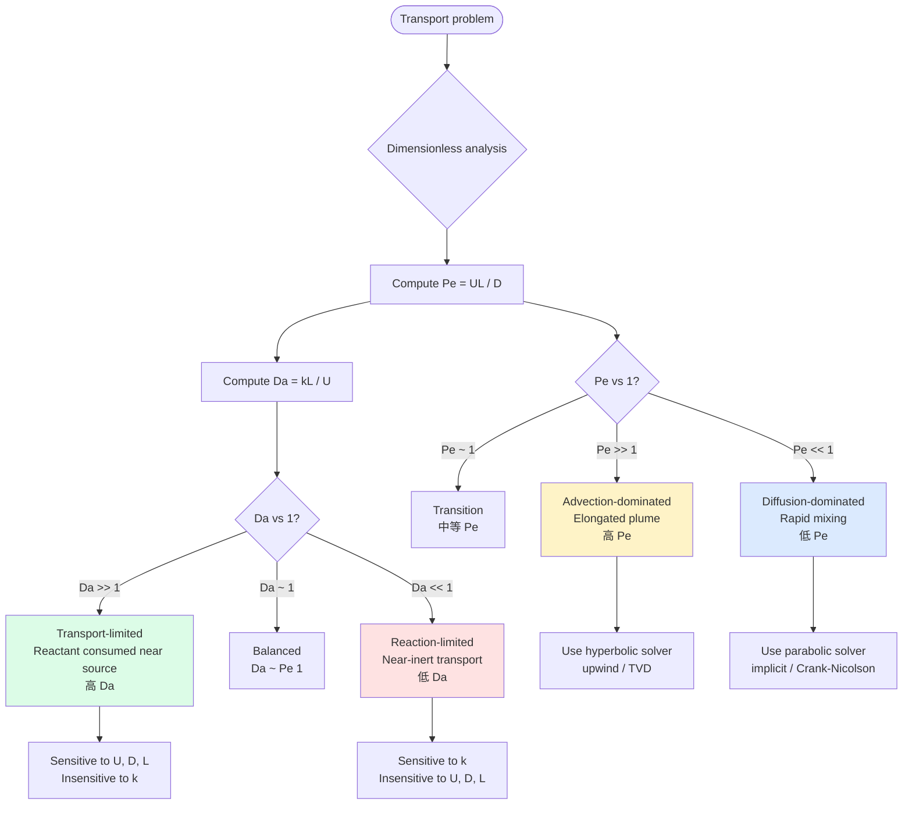

**Decision-tree summary / 決策樹總結:**

| Pe \ Da | Da ≪ 1 (slow reaction) | Da ≈ 1 | Da ≫ 1 (fast reaction) |
|---|---|---|---|
| **Pe ≫ 1** (advection) | Near-inert advection | Mixed control | Reactant exhausted near source |
| **Pe ≈ 1** | Diffusive + slow rxn | Fully coupled | Fast reaction in transition |
| **Pe ≪ 1** (diffusion) | Well-mixed, slow rxn | Well-mixed, balanced | Well-mixed, fast rxn |

#### 1.6.2 實際工程後果速查

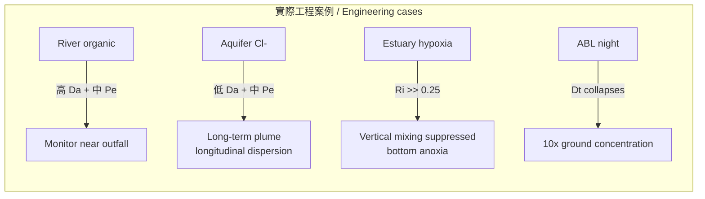

### 核心結論 / Core Takeaway

> **先判斷競爭結果，再選擇方程與數值方法。**  
> **First determine the outcome of the competition, then select the governing equations and numerical method.**
>
> 死記公式而不先做尺度分析，是環境流體力學最常見的失敗模式。  
> Memorizing formulas without first performing scale analysis is the most common failure mode in environmental fluid mechanics.

---

## 2. 尺度分離決定模型選擇
## Scale Separation Determines Model Selection

**Molecular → turbulent eddy → large-scale circulation. Different closures and averaging are required at each scale.**

### 2.1 為什麼尺度分離是必要的？
### Why is Scale Separation Necessary?

環境流體中的運動跨越極大尺度範圍：  
Motion in environmental fluids spans an enormous range of scales:

| 尺度 Scale | 典型長度 Typical Length | 典型時間 Typical Time | 主要物理 Dominant Physics |
|---|---|---|---|
| 分子尺度 Molecular | $10^{-9}$ – $10^{-6}$ m | $10^{-12}$ – $10^{-6}$ s | 分子碰撞、黏性耗散<br>Molecular collisions, viscous dissipation |
| 湍流渦旋 Turbulent eddy | $10^{-3}$ – $10^{1}$ m | $10^{-1}$ – $10^{2}$ s | 能量串級、渦黏性<br>Energy cascade, eddy viscosity |
| 大尺度環流 Large-scale circulation | $10^{2}$ – $10^{6}$ m | $10^{3}$ – $10^{7}$ s | 地轉平衡、浮力驅動<br>Geostrophic balance, buoyancy-driven flow |

若試圖用同一組方程同時解析所有尺度，計算成本會呈指數爆炸。  
Attempting to resolve all scales with a single set of equations causes computational cost to explode exponentially.

因此，必須在選定的尺度上進行平均（averaging），並對未解析尺度引入閉合（closure）。  
Therefore, one must average at a chosen scale and introduce closures for the unresolved scales.

### 2.2 不同尺度對應的模型與閉合
### Models and Closures at Different Scales

| 目標尺度 Target Scale | 常用模型 Common Model | 未解析部分 Unresolved | 閉合方法 Closure Method |
|---|---|---|---|
| 分子 / 微觀<br>Molecular / Micro | 分子動力學 MD、Boltzmann 方程 | — | 直接模擬<br>Direct simulation |
| 連續介質（層流）<br>Continuum (laminar) | Navier–Stokes 方程 | 分子運動 | 牛頓黏性本構<br>Newtonian viscous constitutive law |
| 湍流工程尺度<br>Engineering turbulence | RANS（Reynolds-Averaged NS） | 湍流脈動 | 渦黏性、$k$-$\varepsilon$、$k$-$\omega$ 等<br>Eddy viscosity, $k$-$\varepsilon$, $k$-$\omega$ |
| 大渦模擬<br>Large-Eddy Simulation | LES | 亞格子尺度 | 亞格子應力模型（Smagorinsky 等）<br>Subgrid-scale stress models |
| 地球物理尺度<br>Geophysical scale | 淺水方程、準地轉方程、氣候模式 | 中小尺度湍流與對流 | 參數化（對流、邊界層、雲）<br>Parameterizations (convection, boundary layer, clouds) |

### 2.3 尺度分離失敗時會發生什麼？
### What Happens When Scale Separation Fails?

- **無明顯尺度間隙（例如高 Reynolds 數完全發展湍流中的慣性子區）**：必須使用 LES 或 DNS，RANS 閉合會失效。  
  When there is no clear spectral gap (e.g., inertial subrange of fully developed turbulence), LES or DNS becomes necessary; RANS closures break down.
- **邊界層、剪切層、密度介面**：局部梯度極陡，傳統渦黏性假設（各向同性、局部平衡）不成立。  
  In boundary layers, shear layers, and density interfaces, local gradients are extremely steep and classical eddy-viscosity assumptions (isotropy, local equilibrium) fail.
- **多物理耦合（如化學反應、相變、生物過程）**：反應尺度可能與湍流尺度重疊，導致「混合限制反應」或「反應限制混合」。  
  When reaction, phase-change, or biological scales overlap with turbulent scales, one obtains mixing-limited or reaction-limited regimes.

### 2.4 專家的實際決策流程
### Expert Decision Process in Practice

1. **先畫能量譜或特徵尺度圖，確認是否存在尺度間隙。**  
   First plot the energy spectrum or characteristic scales to confirm whether a spectral gap exists.
2. **選擇「解析到哪一層」**：  
   Decide "how far down the cascade I will resolve":
   - 只要平均濃度與通量 → RANS
   - 需要非穩態大渦結構 → LES
   - 需要精確耗散與小尺度混合 → DNS（僅限小區域）
3. **閉合必須與所選尺度一致**：把分子擴散係數直接用在大尺度模式中是錯誤的；反之亦然。  
   The closure must be consistent with the chosen scale. Using molecular diffusivity in a large-scale model (or vice versa) is incorrect.
4. **驗證閉合假設**：用更高解析度模擬或現場觀測檢查未解析通量是否被正確再現。  
   Validate the closure by checking whether unresolved fluxes are correctly reproduced against higher-resolution simulations or field data.

### 2.5 深度自測問題
### Deep Self-Test Questions

1. 為什麼在 RANS 中需要引入湍流擴散係數 $D_t$，而不能直接使用分子擴散係數 $D_m$？兩者量級差多少？  
   Why must a turbulent diffusivity $D_t$ be introduced in RANS instead of using the molecular diffusivity $D_m$? By how many orders of magnitude do they typically differ?
2. 說明 Kolmogorov 微尺度 $\eta = (\nu^3/\varepsilon)^{1/4}$ 的物理意義，以及它如何決定 DNS 的網格需求。  
   Explain the physical meaning of the Kolmogorov microscale $\eta = (\nu^3/\varepsilon)^{1/4}$ and how it determines the grid requirements of DNS.
3. 在密度分層流中，垂直湍流混合被強烈抑制。這對「尺度分離」假設與閉合模型的選擇有何影響？  
   In density-stratified flows, vertical turbulent mixing is strongly suppressed. How does this affect the scale-separation assumption and the choice of closure models?
4. 為什麼氣候模式可以解析大尺度環流，卻必須參數化積雲對流？若強行解析會出現什麼問題？  
   Why can climate models resolve large-scale circulation yet must parameterize cumulus convection? What problems arise if one attempts to resolve it explicitly?

### 2.6 圖解 / Diagram

#### 2.6.1 尺度分離的層級金字塔

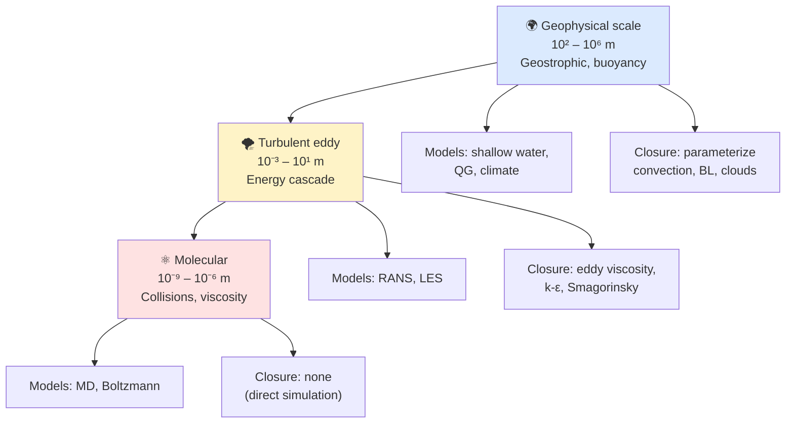

#### 2.6.2 模型選擇決策流程

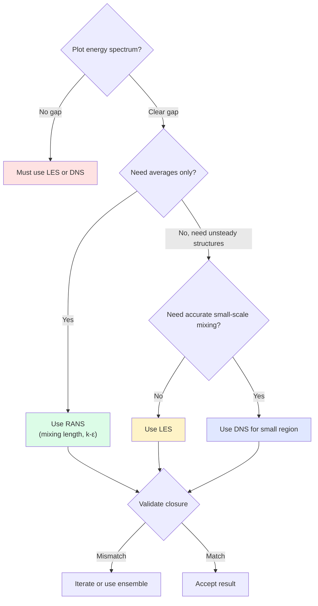

### 核心結論 / Core Takeaway

> **尺度分離不是數學技巧，而是物理現實的反映。**  
> **Scale separation is not a mathematical trick; it is a reflection of physical reality.**
>
> 選擇模型的本質，就是決定「我要解析到哪一個尺度，以及如何閉合剩下的尺度」。  
> The essence of model selection is deciding which scale I will resolve and how I will close the remaining scales.

---

## 3. 邊界條件與初始條件往往比方程本身更重要
## Boundary and Initial Conditions Are Often More Important Than the Equations Themselves

**Real environmental systems are open and driven by uncertain forcing; the equations are known, the boundaries are not.**

### 3.1 為什麼邊界與初始條件更關鍵？
### Why Are Boundary and Initial Conditions More Critical?

Navier–Stokes 方程、物種守恆方程、能量方程在數學上是「已知」的。  
The Navier–Stokes equations, species conservation equations, and energy equations are mathematically "known."

然而，環境系統是開放系統：  
However, environmental systems are open systems:

- 不斷有質量、動量、能量從邊界流入或流出。  
  Mass, momentum, and energy continuously enter or leave through the boundaries.
- 外部強迫（風、潮汐、降雨、太陽輻射、上游排放）具有高度不確定性。  
  External forcings (wind, tides, rainfall, solar radiation, upstream discharges) are highly uncertain.
- 初始狀態幾乎永遠無法完整觀測。  
  The initial state can almost never be fully observed.

因此，**方程正確但邊界錯誤 → 結果仍然錯誤**。  
Therefore, **correct equations + wrong boundaries = still wrong results**.

### 3.2 環境問題中常見的「邊界問題」
### Common "Boundary Problems" in Environmental Systems

| 問題類型 Type of Problem | 方程本身 Equations | 真正的挑戰 The Real Challenge |
|---|---|---|
| 河流污染物傳輸<br>River pollutant transport | 一維或二維平流–擴散方程<br>1-D or 2-D advection–diffusion | 上游邊界濃度如何隨時間變化？支流匯入如何處理？<br>How does upstream concentration vary with time? How are tributary inflows treated? |
| 河口鹽度入侵<br>Estuarine salt intrusion | 三維正壓/斜壓方程<br>3-D barotropic/baroclinic | 開邊界潮汐水位與流速如何給定？輻射條件是否穩定？<br>How are tidal elevation and velocity prescribed at open boundaries? Are radiation conditions stable? |
| 大氣污染物擴散<br>Atmospheric pollutant dispersion | 大氣邊界層方程<br>Atmospheric boundary-layer | 地面通量（排放、沈降）與頂部邊界條件不確定<br>Uncertain surface fluxes (emission, deposition) and top boundary conditions |
| 地下水溶質傳輸<br>Groundwater solute transport | 達西定律 + 平流–離散方程<br>Darcy's law + advection–dispersion | 含水層邊界（隔水層、補給區）位置與性質不清楚<br>Locations and properties of aquifer boundaries (aquitards, recharge zones) are poorly known |
| 湖泊水質<br>Lake water quality | 三維水動力 + 生態模型<br>3-D hydrodynamics + ecological | 入流、出流、大氣交換、底泥釋放的時間序列不完整<br>Incomplete time series of inflows, outflows, atmospheric exchange, and sediment release |

### 3.3 初始條件的特殊困難
### Special Difficulties with Initial Conditions

- **自旋上升（spin-up）問題**：模型需要很長時間才能「忘記」不真實的初始條件，進入統計穩態。  
  Models often require a long spin-up period to "forget" unrealistic initial conditions and reach statistical steady state.
- **資料同化的必要性**：單靠一次觀測無法給出完整三維初始場，必須結合模式與觀測進行同化。  
  A single set of observations cannot provide a complete three-dimensional initial field; data assimilation combining model and observations is required.
- **混沌敏感性**：在湍流或天氣尺度系統中，初始條件的微小誤差會指數放大（蝴蝶效應）。  
  In turbulent or weather-scale systems, tiny errors in initial conditions grow exponentially (butterfly effect).

### 3.4 專家的實務應對策略
### Practical Strategies Used by Experts

- **敏感性分析優先**：先測試邊界與初始條件的不確定性對結果的影響，再決定是否值得提高方程複雜度。  
  First test the sensitivity of results to uncertainties in boundary and initial conditions, then decide whether increasing equation complexity is worthwhile.
- **開邊界條件的選擇**：
  - 輻射條件（Sommerfeld / Orlanski）
  - 夾帶條件（clamped）
  - 巢狀模式（nested models）提供邊界  
  Choice of open-boundary conditions: radiation (Sommerfeld/Orlanski), clamped, or nested models.
- **集合模擬（Ensemble）**：用多組不同的邊界/初始條件進行模擬，量化不確定性範圍。  
  Run ensembles with different boundary/initial conditions to quantify uncertainty ranges.
- **觀測系統設計**：把有限的監測資源優先放在對結果最敏感的邊界位置。  
  Allocate limited monitoring resources preferentially to the boundary locations that most strongly control the results.

### 3.5 深度自測問題
### Deep Self-Test Questions

1. 為什麼在河口模式中，開邊界若直接夾住水位與流速，容易產生人工反射波？如何改進？  
   Why does directly clamping both elevation and velocity at an estuarine open boundary often generate artificial reflected waves? How can this be improved?
2. 說明「自旋上升時間」如何估算，以及它與系統調整時間尺度（adjustment timescale）的關係。  
   Explain how spin-up time can be estimated and its relationship to the system's adjustment timescale.
3. 在資料同化中，為什麼「觀測算子」（observation operator）的準確性有時比模式方程本身更重要？  
   In data assimilation, why is the accuracy of the observation operator sometimes more important than the model equations themselves?
4. 給定一個污染物泄漏事故，初始濃度場完全未知。你會如何設計模擬策略來提供有用的預測？  
   Given a pollutant spill where the initial concentration field is completely unknown, how would you design a modelling strategy that still yields useful predictions?

### 3.6 圖解 / Diagram

#### 3.6.1 開放邊界條件的物理圖像

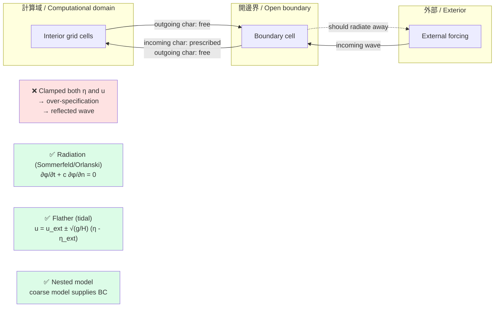

#### 3.6.2 自旋上升 (Spin-up) 流程

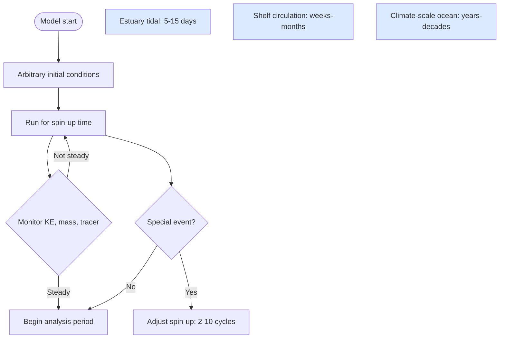

#### 3.6.3 初始場未知時的策略

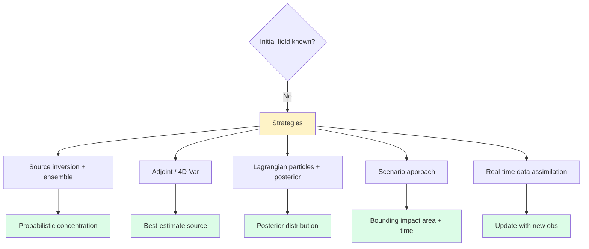

### 核心結論 / Core Takeaway

> **方程告訴我們「系統如何演化」，邊界與初始條件告訴我們「系統從哪裡開始、受到什麼強迫」。**  
> **The equations tell us how the system evolves; the boundary and initial conditions tell us where it starts and what forces it.**
>
> 在開放的環境系統中，後者往往決定了預測的成敗。  
> In open environmental systems, the latter often determines the success or failure of the prediction.

---

## 4. 守恆律 + 本構/閉合 = 完整問題
## Conservation Laws + Constitutive/Closure = Complete Problem

**Mass, momentum, energy, and species conservation are exact; the turbulence and reaction closures are approximate.**

這是環境流體力學中區分「物理直覺」與「數值魔術」的核心心智模型。任何傳輸問題都可以拆成兩部分：永遠成立的守恆律，以及必須做出選擇的本構/閉合。後者才是工程取捨、計算成本與預測不確定性的真正源頭。  
This is the mental model that separates physical intuition from numerical magic. Every transport problem splits into two parts: conservation laws (always valid) and constitutive/closure relations (must be chosen). The latter is the true source of engineering trade-offs, computational cost, and predictive uncertainty.

### 4.1 兩類方程的本質差異
### Two Classes of Equations

| 類型 Type | 守恆律 Conservation Laws | 本構/閉合 Constitutive/Closure |
|---|---|---|
| 物理來源 Physical origin | 對稱性 + 牛頓力學<br>Symmetry + Newtonian mechanics | 經驗 / 統計 / 近似<br>Empirical / statistical / approximate |
| 嚴格程度 Strictness | 嚴格成立（不可違背）<br>Strictly valid (cannot be violated) | 近似（依條件）<br>Approximate (condition-dependent) |
| 可推導性 Derivable | 由時空對稱性推導<br>Derivable from spacetime symmetries | 需額外假設<br>Requires additional assumptions |
| 典型例子 Examples | 質量、動量、能量、組分守恆<br>Mass, momentum, energy, species | 牛頓黏性、Fick 定律、狀態方程、k-ε<br>Newtonian viscosity, Fick's law, EOS, k-ε |

**核心方程 / Core equations:**

連續方程 / Continuity:
$$\frac{\partial \rho}{\partial t} + \nabla \cdot (\rho \mathbf{u}) = 0$$

動量守恆 / Momentum:
$$\rho \left(\frac{\partial \mathbf{u}}{\partial t} + \mathbf{u} \cdot \nabla \mathbf{u}\right) = -\nabla p + \nabla \cdot \boldsymbol{\tau} + \rho \mathbf{g}$$

物種守恆 / Species:
$$\frac{\partial C_i}{\partial t} + \mathbf{u} \cdot \nabla C_i = \nabla \cdot (D_i \nabla C_i) + R_i(C, T, \ldots)$$

這三條方程**不依賴任何本構假設**——它們是時空對稱性的直接結果。  
These three equations **depend on no constitutive assumption** — they are direct consequences of spacetime symmetry.

### 4.2 為什麼需要閉合？
### Why Closure is Necessary

一旦對 Navier–Stokes 做 Reynolds 平均（或其他平均），立刻出現未知的 Reynolds 應力項 $-\rho \overline{u_i' u_j'}$。這個項含有平均流無法直接表達的相關性——這就是**閉合問題**。  
Once you Reynolds-average the Navier–Stokes equations (or apply any other averaging), the unknown Reynolds-stress term $-\rho \overline{u_i' u_j'}$ immediately appears. It contains correlations that the mean equations cannot express directly — this is the **closure problem**.

**RANS 動量方程 / RANS momentum:**
$$\rho \frac{D \bar{u}_i}{Dt} = -\frac{\partial \bar{p}}{\partial x_i} + \frac{\partial}{\partial x_j}\left[\mu \frac{\partial \bar{u}_i}{\partial x_j} - \rho \overline{u_i' u_j'}\right] + \rho g_i$$

未閉合項有 6 個獨立分量；必須引入額外方程或代數假設才能解。  
The unclosed term has 6 independent components; extra equations or algebraic assumptions are required to solve.

### 4.3 閉合的層次
### Levels of Closure

| 層次 Level | 例子 Examples | 假設 Assumptions | 計算成本 Cost |
|---|---|---|---|
| 零方程 Zero-equation | 混合長度 Prandtl<br>Mixing-length Prandtl | 局部平衡、簡單剪切<br>Local equilibrium, simple shear | 極低 Very low |
| 一方程 One-equation | k 模型（k 方程 + 代數長度）<br>k-model | 局部平衡 + 對流長度尺度<br>Local eq. + convective length scale | 低 Low |
| 二方程 Two-equation | k-ε, k-ω, k-τ | 局部平衡 + 兩個尺度<br>Local eq. + two scales | 中 Medium |
| 全 Reynolds 應力 Full RS | RSM（7 方程）<br>Reynolds Stress Model | 二階矩輸運方程<br>2nd-moment transport | 高 High |
| 代數應力 Algebraic stress | ASM | 對流–擴散簡化為代數<br>Convection–diffusion → algebraic | 中 Medium |
| 大渦模擬 LES | 濾波 + 亞格子模型<br>Filter + SGS model | 局部亞格子平衡<br>Local SGS equilibrium | 高 High |
| 直接模擬 DNS | 解析所有尺度<br>Resolve all scales | 無 None | 極高 Extreme |

### 4.4 閉合失敗的常見情況
### When Closures Fail

- **強密度分層**：浮力產生/消耗顯著影響湍流動能；Boussinesq 假設失效。  
  Strong stratification: buoyancy production/destruction matters; Boussinesq assumption fails.
- **旋轉流體**：Coriolis 影響使湍流各向異性（旋轉破壞三維同性）。  
  Rotating fluids: Coriolis makes turbulence anisotropic (rotation breaks 3-D isotropy).
- **多相流**：介面追蹤、氣泡/顆粒需要額外方程。  
  Multiphase: interface tracking, bubbles/particles need extra equations.
- **快速化學**：反應時間接近湍流時間尺度，da/dt 顯著。  
  Fast chemistry: reaction time approaches turbulent time, da/dt matters.
- **壁面附近的非平衡**：k-ε 等模型假設局部平衡，但在近壁/逆壓梯度下失效。  
  Near-wall non-equilibrium: k-ε assumes local equilibrium, fails near walls / under adverse pressure gradients.
- **非 Fick 擴散**：多孔介質中 pre-asymptotic 階段、裂隙介質。  
  Non-Fickian diffusion: pre-asymptotic stage in porous media, fractured media.

### 4.5 專家如何使用這個模型
### How Experts Use This Mental Model

- **先寫守恆律**（永遠成立的），再選擇本構/閉合（依問題選擇）。  
  Always write the conservation laws first; choose constitutive/closure based on the problem.
- **閉合選擇 = 解析能力的取捨**。高保真 → 高成本；簡單 → 低保真。  
  Closure choice = resolution-capability trade-off. High fidelity → high cost; simple → low fidelity.
- **驗證與不確定性量化（V&V / UQ）**是閉合模型的必要伴侶。永遠不要只相信一種閉合。  
  Verification and uncertainty quantification (V&V / UQ) are essential companions. Never trust one closure alone.
- **多模型集合**（RANS + LES + 實驗）→ 量化閉合帶來的偏差。  
  Multi-model ensembles (RANS + LES + experiment) → quantify closure-induced bias.

### 4.6 深度自測問題
### Deep Self-Test Questions

1. 為什麼 RANS 中 Reynolds 應力 $-\rho \overline{u_i' u_j'}$ 必須以額外方程或代數關係「閉合」，而不能直接從平均方程推導？  
   Why must the Reynolds stress $-\rho \overline{u_i' u_j'}$ in RANS be "closed" with extra equations or algebraic relations, rather than derived directly from the averaged equations?
2. Boussinesq 假設的具體內容是什麼？它在什麼情況下會失效？舉三個工程實例。  
   What does the Boussinesq hypothesis state exactly? When does it fail? Give three engineering examples.
3. 在反應流的 DNS 中，「湍流–化學相互作用」（Turbulence–Chemistry Interaction, TCI）為何難以用 RANS 正確預測？  
   In reactive-flow DNS, why is Turbulence–Chemistry Interaction (TCI) hard to predict correctly with RANS?
4. 為什麼同一個簡單幾何，不同 k-ε 變體（Standard, RNG, Realizable）會給出明顯不同的結果？  
   Why do different k-ε variants (Standard, RNG, Realizable) give noticeably different results for the same simple geometry?
5. 為什麼在壁面附近 LES 通常比 RANS 準確？這與閉合假設的失效有何關聯？  
   Why is LES usually more accurate than RANS near walls? How is this related to the failure of closure assumptions?

### 4.7 圖解 / Diagram

#### 4.7.1 守恆律 vs 閉合 的本質區分

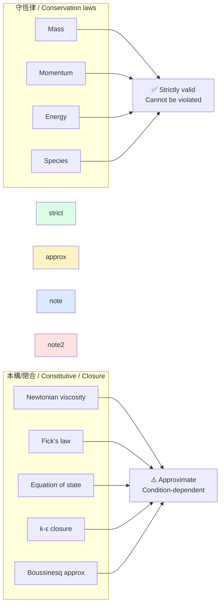

#### 4.7.2 閉合的層級 (從簡單到完整)

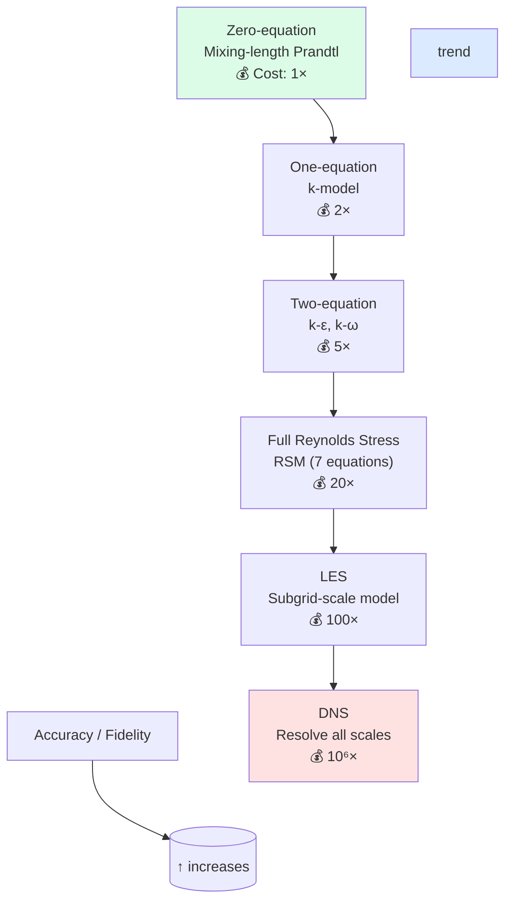

#### 4.7.3 閉合失敗的常見情境

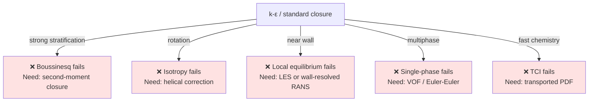

### 核心結論 / Core Takeaway

> **守恆律告訴你「什麼不能違背」，閉合告訴你「什麼必須假設」。**  
> **Conservation laws tell you what cannot be violated; closures tell you what must be assumed.**
>
> 後者才是工程取捨、計算成本與不確定性的真正源頭。  
> The latter is the true source of engineering trade-offs, computational cost, and predictive uncertainty.

---

## 5. 可觀測性與可控制性是工程的最終目標
## Observability and Controllability Are the Ultimate Engineering Goals

**Understanding transport is necessary but not sufficient; the goal is to monitor and intervene effectively.**

純科學追求「理解」；工程追求「**能看見、能介入**」。環境工程的真正交付物不是漂亮的濃度場，而是能預警污染、保障供水安全、修復受損生態的真實系統。  
Pure science aims at understanding; engineering aims at "**being able to see, being able to intervene**." The real deliverable of environmental engineering is not a pretty concentration field, but a working system that warns of contamination, secures water supply, and restores damaged ecosystems.

### 5.1 為什麼工程目標不是「理解」而是「觀測 + 控制」？
### Why the Engineering Goal is "Observe + Control" not "Understand"

- **純科學**：理解機制就足夠。  
  Pure science: understanding the mechanism is enough.
- **工程**：必須能  
  Engineering: must be able to
  1. 知道系統現在在哪個狀態（observability）。  
     Know the current state of the system (observability).
  2. 把系統推到想要的狀態（controllability）。  
     Push the system to a desired state (controllability).
- **環境工程的最終目標**：污染預警、飲用水安全、生態修復、氣候韌性。  
  Environmental engineering ultimate goals: pollution warning, drinking-water safety, ecological restoration, climate resilience.

### 5.2 可觀測性的數學定義
### Mathematical Definition of Observability

線性系統 / Linear system: $\dot{\mathbf{x}} = A\mathbf{x} + B\mathbf{u}$, $\mathbf{y} = C\mathbf{x}$

可觀測性矩陣 / Observability matrix:
$$\mathcal{O} = \begin{bmatrix} C \\ CA \\ CA^2 \\ \vdots \\ CA^{n-1} \end{bmatrix}$$

若 $\text{rank}(\mathcal{O}) = n$，則系統可觀測。  
If $\text{rank}(\mathcal{O}) = n$, the system is observable.

**PDE 系統**：通常無限維。實務上定義「在有限傳感器下能否估計特定模態」。  
For PDE systems: usually infinite-dimensional. Practically, define "can we estimate certain modes with a finite sensor set?"

### 5.3 環境系統的可觀測性
### Observability in Environmental Systems

| 系統 System | 觀測目標 Observation Goal | 主要挑戰 Main Challenge |
|---|---|---|
| 飲用水管網 Drinking water network | 即時污染偵測 + 來源反推<br>Real-time contamination detection + source inversion | 大規模、稀疏傳感器<br>Large scale, sparse sensors |
| 河流 / 河口 River / estuary | 濃度場重建 + 排放源識別<br>Concentration field reconstruction + source ID | 不完整的時空觀測<br>Incomplete spatiotemporal observations |
| 大氣空氣品質 Urban air quality | 污染源 + 暴露評估<br>Sources + exposure assessment | 高度瞬變 + 移動源<br>Highly transient + mobile sources |
| 地下水含水層 Aquifer | 羽流邊界 + 反應前沿<br>Plume boundary + reaction front | 不可見 + 稀疏井<br>Invisible + sparse wells |
| 湖泊 / 水庫 Lake / reservoir | 垂直分層 + 內部動力<br>Vertical stratification + internal dynamics | 觀測成本高 + 季節變化<br>High cost + seasonal variation |

### 5.4 傳感器布置優化
### Sensor Placement Optimization

**核心問題**：在 $N$ 個候選位置中選 $M \ll N$ 個，最大化某個資訊準則。  
Core: choose $M \ll N$ sites from $N$ candidates to maximize an information criterion.

**常用準則 / Common criteria:**

- **A-optimality**：最小化參數協方差矩陣的跡。  
  A-optimality: minimize trace of parameter covariance.
- **D-optimality**：最大化協方差行列式。  
  D-optimality: maximize determinant of covariance.
- **E-optimality**：最大化最小特徵值。  
  E-optimality: maximize minimum eigenvalue.
- **觀測 Gramian 跡**：$\text{tr}(\mathcal{O}^T W^{-1} \mathcal{O})$，$W$ 為傳感器權重。  
  Observability-Gramian trace: $\text{tr}(\mathcal{O}^T W^{-1} \mathcal{O})$ with $W$ as sensor weights.

**數值方法 / Numerical methods:**

- 貪婪 Greedy（submodular，近最優）
- 伴隨方法 Adjoint-based gradient
- 啟發式 Heuristic（GA, SA）
- 貝氏實驗設計 Bayesian experimental design

### 5.5 可控制性與介入設計
### Controllability and Intervention Design

| 系統 System | 控制變量 Control Variable | 控制目標 Control Goal |
|---|---|---|
| 飲用水網 Water network | 閥門、泵、消毒劑投加<br>Valves, pumps, disinfectant dosing | 維持餘氯、隔離污染<br>Maintain residual chlorine, isolate contamination |
| 雨水 / 合流系統 Storm / CSO | 滯留池、閘門、即時控制<br>Retention, gates, real-time control | 削減溢流污染、保護受體<br>Reduce CSO, protect receiving water |
| 河岸過濾 Riverbank filtration | 抽取井位置 + 速率<br>Extraction well placement + rate | 控制污染羽流、最大化處理<br>Control plume, maximize treatment |
| 地下水修復 Aquifer remediation | 注水 / 抽水井、PRB、反應牆<br>Injection / extraction wells, PRB | 攔截羽流、加速修復<br>Intercept plume, accelerate remediation |
| 都市排水 Urban drainage | 滲透池、綠屋頂、滯洪池<br>Infiltration, green roofs, detention | 削減洪峰 + 污染<br>Reduce flood + pollution peaks |

### 5.6 可觀測性 → 可控制性的橋接
### Bridging Observability → Controllability

**Kalman 對偶定理**：$(A, B)$ 可控 ⟺ $(A^T, B^T)$ 可觀（線性系統）。  
**Kalman duality:** $(A, B)$ controllable ⟺ $(A^T, B^T)$ observable (linear systems).

**對環境工程的含意 / Implications for environmental engineering:**

- 傳感器布置問題 ↔ 對偶於執行器布置問題。  
  Sensor placement problem ↔ dual of actuator placement problem.
- 如果某個模態不可觀測，通常也無法控制。  
  If a mode is unobservable, it is usually also uncontrollable.
- 觀測設計與控制設計可以統一優化。  
  Observation design and control design can be jointly optimized.

### 5.7 專家如何使用這個模型
### How Experts Use This Mental Model

- **永遠從「要控制什麼」反推「要觀測什麼」**。不要先建感測網再想應用。  
  Always start from "what to control" and back-solve "what to observe." Don't build a sensor network then figure out the use case.
- **不完美觀測 + 資料同化 = 最佳實務**。用模型填補觀測空缺。  
  Imperfect observation + data assimilation = best practice. Use models to fill observation gaps.
- **經濟約束下**：觀測和控制都是有限資源；必須量化**資訊價值（Value of Information, VoI）**。  
  Under economic constraints: both observation and control are limited resources; must quantify the **Value of Information (VoI)**.
- **在 ICE Professional Review 中**：「Demonstrate monitoring & control evidence」是核心屬性之一。  
  For ICE Professional Review: "Demonstrate monitoring & control evidence" is a core attribute.

### 5.8 深度自測問題
### Deep Self-Test Questions

1. 解釋 Kalman 對偶定理在環境工程中的意義。如何用它降低傳感器 / 執行器聯合設計的複雜度？  
   Explain the significance of Kalman duality in environmental engineering. How can it reduce the complexity of joint sensor / actuator design?
2. 為什麼「即時控制」（real-time control, RTC）在合流制（CSO）系統中比在分流制（separated sewer）中更關鍵？  
   Why is real-time control (RTC) more critical in combined sewer systems (CSO) than in separated systems?
3. 給定一個湖泊，你想即時估計全湖溫度分層。請說明你會用哪些觀測（衛星、浮標、剖面儀），以及它們的時空覆蓋盲區。  
   Given a lake, you want to estimate the full thermal stratification in real time. Describe which observations (satellite, buoys, profilers) you would use, and their spatiotemporal coverage gaps.
4. 為什麼地下水修復的「抽出–處理」（pump-and-treat）常失敗？哪些情況下它仍然合理？  
   Why does pump-and-treat for groundwater remediation often fail? Under what conditions is it still reasonable?
5. 在大氣環境中，「衛星觀測 + 地基雷射雷達 + 地面站」三層觀測如何互補？哪個提供最佳可控制性輸入？  
   In atmospheric environment, how do the three observation layers (satellite + lidar + surface stations) complement each other? Which provides the best input for controllability?

### 5.9 圖解 / Diagram

#### 5.9.1 可觀測性 → 可控制性 的對偶橋接

```mermaid
flowchart LR
    subgraph "Observability domain"
        Sys["System x(t)"] -->|"outputs y(t)"| Meas[Measurements y]
        Meas -->|"observability matrix O"| Obs[Observability]
    end

    subgraph "Duality"
        Obs -.->|"Kalman duality:<br/>(A,B) controllable<br/>⟺ (Aᵀ, Bᵀ) observable"| Ctrl
    end

    subgraph "Controllability domain"
        Act[Actuator u(t)] -->|"inputs"| Sys
        Act -->|"controllability matrix C"| Ctrl[Controllability]
    end

    Obs -->|design sensors at| EnvEng[Environmental engineering]
    Ctrl -->|design actuators at| EnvEng

    style Obs fill:#dbeafe
    style Ctrl fill:#dcfce7
    style EnvEng fill:#fef3c7
```

#### 5.9.2 環境系統的觀測-控制循環

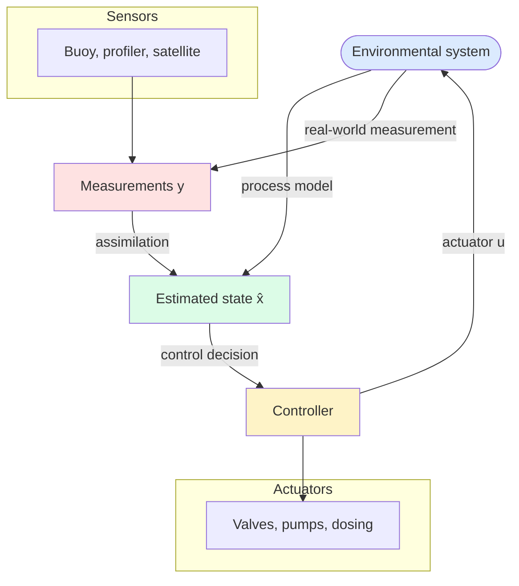

#### 5.9.3 觀測網絡設計的優化準則

```mermaid
flowchart TB
    N[Sites: choose M of N] --> Criterion{Information criterion}
    Criterion -->|A-opt| A[Min tr(Σ_θ)]
    Criterion -->|D-opt| D[Max det(Σ_θ⁻¹)]
    Criterion -->|E-opt| E[Max λ_min(Σ_θ⁻¹)]
    Criterion -->|Gramian| G[tr(Oᵀ W⁻¹ O)]

    A --> Result1[Best for parameter uncertainty]
    D --> Result2[Best for overall precision]
    E --> Result3[Best for worst-case direction]
    G --> Result4[Best for sensor weighting]

    Result1 --> Apply[Apply greedy / adjoint / GA]
    Result2 --> Apply
    Result3 --> Apply
    Result4 --> Apply

    Apply -->|account for| Practical[Accessibility<br/>Land rights<br/>Long-term commitment]
    Practical --> Final[Sensor network]

    style A fill:#dbeafe
    style D fill:#dbeafe
    style E fill:#dbeafe
    style G fill:#dbeafe
    style Practical fill:#fef3c7
    style Final fill:#dcfce7
```

### 核心結論 / Core Takeaway

> **理解是手段，觀測 + 控制是目標。**  
> **Understanding is the means; observation + control are the goals.**
>
> 在資源有限的環境中，能「看見」並「介入」系統，比能「解釋」系統更有工程價值。  
> In resource-constrained environments, being able to *see* and *intervene* in a system is more valuable than being able to *explain* it.

---

# 深度自測問題詳解
# Deep Self-Test Questions — Detailed Solutions

> 對應五個心智模型中**第 3、4、5 個**的自測題。  
> 詳解 1–4：心智模型 #3（邊界與初始條件）。  
> 詳解 5–10：心智模型 #1、#2 中涉及的核心問題（湍流擴散、Richardson、Damköhler、離散各向異性、ABL 結構、Gaussian vs CFD）。  
>  
> Corresponding to the self-test questions tied to Mental Models **#3, #1, #2**.  
> Solutions 1–4: Mental Model #3 (boundary & initial conditions).  
> Solutions 5–10: core questions from Mental Models #1, #2 (turbulent diffusivity, Richardson, Damköhler, dispersivity anisotropy, ABL structure, Gaussian vs CFD).

## 詳解 1：河口模式中開邊界反射波
## Solution 1: Open-Boundary Reflected Waves in Estuarine Models

**問題 / Question:**  
為什麼在河口模式中，開邊界若直接夾住水位與流速，容易產生人工反射波？如何改進？  
Why does directly clamping both elevation and velocity at an estuarine open boundary often generate artificial reflected waves? How can this be improved?

**詳解 / Detailed Explanation**

在淺水方程或三維水動力模式中，開邊界必須讓內生波（內部產生的潮波、長波、慣性重力波）自由傳出計算域，而不能被「反射」回來。  
In shallow-water or 3-D hydrodynamic models, open boundaries must let internally generated waves (tidal, long, inertia–gravity) leave the domain freely without reflection.

若同時強制指定水位 $\eta$ 與法向流速 $u_n$（clamped boundary），等於施加了**過約束（over-specification）**。根據特徵線理論（method of characteristics），一維淺水方程在邊界上只有一個入流特徵與一個出流特徵。同時固定兩個變數，會使出流特徵無法自由離開，導致能量在邊界反射，產生人工駐波或高頻振盪。  
Clamping both $\eta$ and $u_n$ is over-specification. By the method of characteristics, the 1-D shallow-water equations have only one incoming and one outgoing characteristic at the boundary; fixing both blocks the outgoing characteristic and forces energy to reflect, producing artificial standing waves or high-frequency oscillations.

**改進方法 / Improvements:**

1. **輻射邊界條件（Radiation / Sommerfeld / Orlanski 條件）**  
   只指定一個變數（通常是水位），並讓法向流速滿足：  
   Prescribe only one variable (usually elevation), with normal velocity satisfying:
   $$\frac{\partial \phi}{\partial t} + c \frac{\partial \phi}{\partial n} = 0$$
   其中 $c$ 為相速度（可用局部波速或 Orlanski 動態估算）。  
   Here $c$ is the phase speed (local wave celerity, or dynamically estimated via Orlanski).

2. **Flather 條件（常用於潮汐模式）**  
   Flather condition (common in tidal models):
   $$u_n = u_n^{\text{ext}} \pm \sqrt{\frac{g}{H}} \left( \eta - \eta^{\text{ext}} \right)$$
   允許外來潮波進入，同時讓內部擾動輻射出去。  
   Allows external tidal forcing to enter while letting internal disturbances radiate out.

3. **巢狀模式（Nested-grid）**  
   用更大範圍的粗解析模式提供邊界條件，減少人工邊界的影響。  
   Use a larger-domain coarse model to supply boundary values, reducing the influence of artificial boundaries.

4. **海綿層（Sponge / Absorbing layer）**  
   在邊界附近逐漸增加摩擦或黏性，吸收出流水波。  
   Gradually increase friction or viscosity near the boundary to absorb outgoing waves.

---

## 詳解 2：自旋上升時間的估算
## Solution 2: Estimating Spin-Up Time

**問題 / Question:**  
說明「自旋上升時間」如何估算，以及它與系統調整時間尺度（adjustment timescale）的關係。  
Explain how spin-up time can be estimated and its relationship to the system's adjustment timescale.

**詳解 / Detailed Explanation**

自旋上升時間（spin-up time） 是指模式從任意或不真實的初始條件出發，演化到「統計穩態」或「與強迫力平衡」所需的時間。  
Spin-up time is the time required for a model to evolve from arbitrary or unrealistic initial conditions to a "statistically steady state" or a state balanced against the forcing.

**估算方法 / Estimation methods:**

- **物理時間尺度法 / Physical-timescale approach:**
  - 慣性調整時間：$T_i \sim L/c$ 或 $1/f$（地轉調整）  
    Inertial adjustment: $T_i \sim L/c$ or $1/f$ (geostrophic adjustment)
  - 摩擦調整時間：$T_f \sim H/(C_d U)$ 或 $H^2/K_v$  
    Frictional adjustment: $T_f \sim H/(C_d U)$ or $H^2/K_v$
  - 平流時間：$T_a = L/U$  
    Advective timescale: $T_a = L/U$
  - 潮汐系統通常取數個潮週期（2–10 個潮週期）作為最低 spin-up。  
    Tidal systems typically need 2–10 tidal cycles as a minimum spin-up.

- **能量或體積平均監測法 / Energy- or volume-average monitoring:**  
  監測動能、位能、或某示蹤劑總量的時間序列，當其變化率趨於平穩（或呈現穩定週期振盪）時，即視為已完成 spin-up。  
  Monitor time series of kinetic energy, potential energy, or total tracer mass; spin-up is complete when the rate of change flattens (or shows stable periodic oscillation).

- **實務經驗 / Practical experience:**
  - 河口潮汐模式：通常 5–15 天  
    Estuarine tidal model: typically 5–15 days
  - 陸架環流：數週至數月  
    Shelf circulation: weeks to months
  - 氣候尺度海洋模式：數年至數十年  
    Climate-scale ocean: years to decades

**與調整時間尺度的關係 / Relationship to adjustment timescale:**  
調整時間尺度是系統對強迫力變化的響應時間（物理本質）。自旋上升時間是數值模擬中「忘記錯誤初始條件」所需的時間，它必須至少等於或大於最長的調整時間尺度，否則結果仍受初始條件污染。  
The adjustment timescale is the physical response time to forcing changes. Spin-up time is the numerical time required to "forget" wrong initial conditions; it must be ≥ the longest relevant adjustment timescale, or the result remains contaminated by initial conditions.

> **簡言之 / In short:**  
> $\text{Spin-up time} \geq \text{longest relevant adjustment timescale of the system.}$

---

## 詳解 3：觀測算子的關鍵性
## Solution 3: Criticality of the Observation Operator

**問題 / Question:**  
在資料同化中，為什麼「觀測算子」（observation operator）的準確性有時比模式方程本身更重要？  
In data assimilation, why is the accuracy of the observation operator sometimes more important than the model equations themselves?

**詳解 / Detailed Explanation**

資料同化的基本目標是結合模式狀態 $\mathbf{x}$ 與觀測 $\mathbf{y}$：
$$\mathbf{y} = H(\mathbf{x}) + \boldsymbol{\varepsilon}$$

其中 $H$ 就是觀測算子（observation operator），它把模式變數轉換到觀測空間。  
Here $H$ is the observation operator, mapping model state to observation space.

**為什麼 $H$ 的準確性極為關鍵 / Why $H$'s accuracy is critical:**

- **觀測與模式變數往往不是同一物理量。**  
  衛星遙測的是亮度溫度或海面高度異常，不是直接的三維流速或濃度。  
  Satellite retrievals are brightness temperatures or sea-level anomalies, not direct 3-D velocities or concentrations.
- 若 $H$ 有系統偏差（例如錯誤的大氣校正、錯誤的光學模型），同化會把錯誤的資訊強行注入模式，造成比「不同化」更差的結果。  
  Systematic bias in $H$ injects wrong information into the model, often producing a worse analysis than no assimilation.
- **同化的本質是「拉近模式與觀測」**。若 $H$ 不正確，模式被拉向「錯誤的觀測等價物」，導致分析場偏離真實狀態。  
  Assimilation pulls the model toward the observed equivalent; if $H$ is wrong, the analysis is pulled toward the wrong target.
- **在弱約束或集合卡爾曼濾波中**：觀測誤差協方差 $\mathbf{R}$ 與 $H$ 的線性化（切線算子）直接影響增益矩陣。$H$ 的誤差會被放大到整個分析場。  
  In weak-constraint or EnKF, $\mathbf{R}$ and the linearization of $H$ (tangent operator) directly shape the Kalman gain; $H$ errors propagate to the full analysis.
- **實務經驗**：許多海洋/大氣同化系統的改進，優先來自更好的觀測算子（正向模型），而非更高階的動力方程。  
  Many ocean/atmosphere assimilation improvements come from better forward operators, not higher-order dynamics.

> **結論 / Conclusion:**  
> 模式方程描述「如何演化」；觀測算子決定「觀測到底在告訴我們什麼」。後者錯誤時，再好的方程也會被誤導。  
> The model equations describe "how the system evolves"; the observation operator determines "what the observation is actually telling us." If the latter is wrong, even perfect dynamics is misled.

---

## 詳解 4：初始場未知時的模擬策略
## Solution 4: Modelling Strategy with Unknown Initial Conditions

**問題 / Question:**  
給定一個污染物泄漏事故，初始濃度場完全未知。你會如何設計模擬策略來提供有用的預測？  
Given a pollutant spill where the initial concentration field is completely unknown, how would you design a modelling strategy that still yields useful predictions?

**詳解 / Detailed Explanation**

當初始濃度場完全未知時，傳統「給定初始條件 → 向前積分」的方法失效。可行策略如下：  
When the initial field is fully unknown, the classical "prescribe → integrate" approach fails. Viable strategies:

1. **源項反演 + 集合模擬（Source inversion + Ensemble）**  
   - 把泄漏位置、時間、強度、持續時間當作未知參數。  
     Treat spill location, time, intensity, duration as unknown parameters.
   - 用現有稀疏觀測（水質站、遙測）進行反問題求解或貝氏推斷。  
     Use sparse observations (water-quality stations, remote sensing) for inverse solving or Bayesian inference.
   - 產生多組可能的源項，進行集合預報，給出濃度機率分布而非單一確定場。  
     Generate multiple source scenarios → ensemble forecast → probabilistic concentration fields.

2. **伴隨方法（Adjoint method）或 4D-Var**  
   - 利用伴隨模式，從下游觀測反推上游可能的源強與位置。  
     Use the adjoint to back out upstream source strength and location from downstream observations.
   - 特別適合泄漏時間不長、觀測相對密集的情況。  
     Particularly suited to short-duration spills with relatively dense observations.

3. **拉格朗日粒子追蹤 + 不確定性量化**  
   - 釋放大量粒子，涵蓋可能的泄漏位置與時間範圍。  
     Release many particles covering the plausible spill location/time range.
   - 用觀測到的濃度或油膜位置來加權或篩選粒子，獲得後驗分布。  
     Reweight/filter particles by observed concentration or slick location to obtain the posterior.

4. **情景分析（Scenario approach）**  
   - 定義「最壞情況」「最可能情況」「最佳情況」等典型情景。  
     Define typical scenarios: worst case, most likely, best case.
   - 重點提供「影響範圍」與「到達時間」的上下界，而非精確濃度值。  
     Focus on bounding the impact area and arrival time, not exact concentrations.

5. **即時資料同化循環**  
   - 一旦有新觀測進來，立即更新源項估計與濃度場。  
     As new observations arrive, update source estimates and concentration fields.
   - 採用 Ensemble Kalman Filter 或 Particle Filter，讓預測隨觀測進化。  
     Use EnKF or particle filters so the prediction evolves with observations.

> **核心原則 / Core principle:**  
> 把「初始場未知」轉化為「源項與邊界的不確定性問題」，並用集合或機率方法輸出風險範圍，而非假裝知道精確初始條件。  
> Convert "unknown initial field" into "source/boundary uncertainty," and use ensemble or probabilistic methods to deliver risk bounds — never pretend to know the exact initial field.

---

## 詳解 5：湍流擴散係數的出現與本質差異
## Solution 5: Emergence of Turbulent Diffusivity and Its Essential Difference from Molecular Diffusivity

**問題 / Question:**  
從 Navier–Stokes 與物種守恆方程出發，說明湍流擴散係數如何出現，以及它與分子擴散的本質差異。  
Starting from the Navier–Stokes and species conservation equations, show how the turbulent diffusivity emerges, and what its essential differences from molecular diffusivity are.

**詳解 / Detailed Explanation**

**1. 推導 / Derivation**

物種守恆方程 / Species conservation:
$$\frac{\partial C}{\partial t} + \mathbf{u} \cdot \nabla C = D_m \nabla^2 C + R$$

Reynolds 分解 / Reynolds decomposition: $C = \bar{C} + C'$, $\mathbf{u} = \bar{\mathbf{u}} + \mathbf{u}'$

代入並做系綜平均（假設 $\overline{\mathbf{u}'} = 0$, $\overline{C'} = 0$）：
Substitute and ensemble-average (assuming $\overline{\mathbf{u}'} = 0$, $\overline{C'} = 0$):
$$\frac{\partial \bar{C}}{\partial t} + \bar{\mathbf{u}} \cdot \nabla \bar{C} = D_m \nabla^2 \bar{C} - \nabla \cdot \overline{\mathbf{u}' C'} + \bar{R}$$

未閉合項 / Unclosed term: $-\nabla \cdot \overline{\mathbf{u}' C'}$（湍流通量 / turbulent flux）

**梯度擴散假設 / Gradient-diffusion (K-theory) closure:**
$$-\overline{\mathbf{u}' C'} = D_t \nabla \bar{C}$$

代入得 / Substituting:
$$\frac{\partial \bar{C}}{\partial t} + \bar{\mathbf{u}} \cdot \nabla \bar{C} = (D_m + D_t) \nabla^2 \bar{C} + \bar{R}$$

**2. 本質差異 / Essential Differences**

| 維度 Dimension | 分子擴散 $D_m$ | 湍流擴散 $D_t$ |
|---|---|---|
| 物理來源 Origin | 分子熱運動 / 碰撞<br>Molecular thermal motion / collisions | 宏觀渦旋運動 / 慣性傳輸<br>Macroscopic eddy motion / inertial transport |
| 量級 Magnitude | 水中 $\sim 10^{-9}$ m²/s<br>$\sim 10^{-9}$ m²/s in water | 典型 $10^{-5}$–$10^{-2}$ m²/s<br>Typically $10^{-5}$–$10^{-2}$ m²/s |
| 量級差 Ratio | — | 較 $D_m$ 大 $10^4$–$10^7$ 倍<br>$10^4$–$10^7$ larger than $D_m$ |
| 各向同性 Isotropy | 對各向同性流體為各向同性<br>Isotropic in isotropic fluid | 強各向異性（垂直 < 水平）<br>Strongly anisotropic (vertical < horizontal) |
| 尺度依賴 Scale dependence | 純物質性質<br>Pure material property | 依賴平均尺度（過濾尺度）<br>Depends on averaging (filter) scale |
| 可逆性 Reversibility | 原理上時間反演對稱<br>Time-reversal symmetric in principle | 不可逆（混沌放大）<br>Irreversible (chaotic amplification) |
| 普適性 Universality | 對所有溶質幾乎相同<br>Almost identical for all solutes | 對動量、質量、熱皆不同<br>Differs for momentum, mass, heat (Schmidt no. effect) |

**3. 工程含意 / Engineering Implications**

- 在高 Pe（Pe ≫ 1）環境問題中，**$D_t$ 完全主導**；$D_m$ 可忽略。  
  In high-Pe environmental problems, $D_t$ completely dominates; $D_m$ is negligible.
- $D_t$ 的**空間變化**決定哪些區域快速混合、哪些區域被困。  
  Spatial variation of $D_t$ determines where mixing is rapid and where stagnation occurs.
- 在**分層流**中，垂直 $D_t$ 可被浮力壓制 2–3 個量級——垂直混合是瓶頸。  
  In stratified flow, vertical $D_t$ can be suppressed 2–3 orders of magnitude — vertical mixing is the bottleneck.

---

## 詳解 6：Richardson 數與垂直混合抑制
## Solution 6: Richardson Number and Suppressed Vertical Mixing

**問題 / Question:**  
為什麼在河口或密度分層水體中，垂直混合會被強烈抑制？用 Richardson 數解釋。  
Why is vertical mixing strongly suppressed in estuaries or density-stratified water bodies? Explain using the Richardson number.

**詳解 / Detailed Explanation**

**1. Richardson 數的定義 / Definition**

$$\mathrm{Ri} = \frac{N^2}{S^2} = \frac{(g/\rho_0)(\partial \rho / \partial z)}{(\partial U / \partial z)^2}$$

- $N^2 = (g/\rho_0)(\partial \rho / \partial z)$：浮力頻率平方（穩定度）  
  Buoyancy frequency squared (stability)
- $S = \partial U / \partial z$：垂直剪切  
  Vertical shear

**2. 臨界 Richardson 數（Miles–Howard 定理）/ Critical Ri (Miles–Howard theorem)**

$\mathrm{Ri}_c \approx 0.25$：當 $\mathrm{Ri} > \mathrm{Ri}_c$ 時，線性化後的擾動方程不再有不穩定解 → 湍流無法自我維持 → 衰減。  
When $\mathrm{Ri} > \mathrm{Ri}_c$, the linearized perturbation equations have no unstable solutions → turbulence cannot self-sustain → decays.

**3. TKE 收支的物理解釋 / TKE Budget Interpretation**

$$\frac{\partial k}{\partial t} = \underbrace{K_m \left(\frac{\partial U}{\partial z}\right)^2}_{\text{剪切生產 } P} + \underbrace{-K_h \frac{g}{\rho_0} \frac{\partial \rho}{\partial z}}_{\text{浮力消耗 } B} - \varepsilon$$

- $P > 0$：剪切產生湍流動能。  
  Shear produces TKE.
- $B < 0$（穩定分層）：浮力消耗 TKE。  
  Buoyancy destroys TKE (stable stratification).
- 當 $|B| > P$ → TKE 衰減 → 湍流熄滅。  
  When $|B| > P$ → TKE decays → turbulence collapses.

可重寫為 / Rewritten: $\mathrm{Ri} = -B/P$  
當 $\mathrm{Ri} > 1$ 時，浮力消耗速率超過剪切生產速率，湍流淨消耗。  
When $\mathrm{Ri} > 1$, buoyancy destruction exceeds shear production; net TKE loss.

**4. 河口缺氧的因果鏈 / Causal Chain of Estuarine Hypoxia**

1. 河流輸入大量淡水 + 海洋高鹽水 → **強密度梯度**（高 $N^2$）  
   River freshwater + ocean saltwater → strong density gradient
2. 潮汐剪切不足以克服浮力 → **高 Ri**  
   Tidal shear insufficient to overcome buoyancy → high Ri
3. 垂直湍流 $K_z$ 暴跌（比 $K_h$ 小 1–3 個量級）  
   Vertical turbulent $K_z$ collapses (1–3 orders smaller than $K_h$)
4. 底層水與上層隔離 + 有機物沉降 → 微生物耗氧 → **缺氧**（DO < 2 mg/L）  
   Bottom water isolated + organic settling + microbial respiration → **hypoxia** (DO < 2 mg/L)
5. 生態崩塌、魚群死亡  
   Ecological collapse, fish kills

**5. 經驗關係 / Empirical Relations**

- Munk–Anderson: $K_z / K_z^0 = (1 + a \mathrm{Ri})^n$（$K_z^0$ 為中性值）  
  $K_z / K_z^0 = (1 + a \mathrm{Ri})^n$, $K_z^0$ is neutral value
- 典型河口：$K_h \sim 10^{-2}$ m²/s，$K_z \sim 10^{-4}$–$10^{-5}$ m²/s  
  Typical estuary: $K_h \sim 10^{-2}$ m²/s, $K_z \sim 10^{-4}$–$10^{-5}$ m²/s

---

## 詳解 7：Damköhler 數決定反應限制類型
## Solution 7: Damköhler Number Determines Reaction-Limitation Type

**問題 / Question:**  
說明 Damköhler 數如何決定反應是傳輸限制還是動力學限制。  
Explain how the Damköhler number determines whether a reaction is transport-limited or kinetically limited.

**詳解 / Detailed Explanation**

**1. 定義 / Definitions**

兩個常見形式 / Two common forms:
- 平流 Damköhler: $\mathrm{Da}_I = \dfrac{k L}{U} = k \tau_{\text{adv}}$
- 擴散 Damköhler: $\mathrm{Da}_{II} = \dfrac{k L^2}{D_m} = k \tau_{\text{diff}}$

其中 $k$ 為一階反應速率常數。  
Where $k$ is the first-order reaction rate constant.

亦可寫為反應器形式 / Reactor form: $\mathrm{Da}_{III} = k V/Q = k \tau_{\text{res}}$

**2. 兩個極限 / Two Limits**

| 極限 Limit | 條件 Condition | 工程後果 Engineering Consequence |
|---|---|---|
| 傳輸限制 Transport-limited | $\mathrm{Da} \gg 1$：反應 >> 傳輸<br>Reaction >> transport | 反應物在入口附近完全消耗<br>Reactant fully consumed near inlet; conversion $X \to 1$ |
| 反應限制 Reaction-limited | $\mathrm{Da} \ll 1$：傳輸 >> 反應<br>Transport >> reaction | 反應物幾乎以惰性方式穿過<br>Reactant passes through nearly inert; conversion $X \to 0$ |

**3. 參數敏感性 / Parameter Sensitivity**

- **傳輸限制（Da ≫ 1）**：對 $k$ 不敏感；對 $U$、$D$、$L$ 高度敏感。  
  Transport-limited: insensitive to $k$; highly sensitive to $U$, $D$, $L$.
  → 想加速轉化？改善混合或縮短路徑，不是加反應劑。  
  → To accelerate conversion: improve mixing or shorten path, not add reactant.
- **反應限制（Da ≪ 1）**：對 $k$ 高度敏感；對流場不敏感。  
  Reaction-limited: highly sensitive to $k$; insensitive to flow field.
  → 想加速轉化？提高溫度、催化劑或微生物活性。  
  → To accelerate conversion: raise temperature, add catalysts, boost microbial activity.

**4. 工程案例 / Engineering Cases**

- **快速降解河流污染物**（如酚類）：高 Da → 監測站應設在排放口附近。  
  Fast-degrading river pollutant: high Da → monitor near outfall.
- **緩慢生物降解地下水**（如 TCE）：低 Da → 羽流可延伸數公里；修復需 PRB 或注入營養。  
  Slow groundwater biodegradation: low Da → plume can extend kilometers; remediation needs PRB or nutrient injection.
- **大氣 OH + VOC 反應**：Da 隨日照改變——白天 Da 高（光化學主導），夜間 Da 低。  
  Atmospheric OH + VOC: Da changes with sunlight — daytime Da high (photochemistry dominates), nighttime Da low.
- **污水處理廠曝氣池**：設計 $\tau_{\text{res}}$ 時，使目標污染物 Da ≈ 1。  
  WWTP aeration tank: design $\tau_{\text{res}}$ so that target pollutant Da ≈ 1.

**5. 多反應系統 / Multiple Reactions**

當有多個串聯/並聯反應時，每個反應有各自的 $\mathrm{Da}_i$。瓶頸由 $\mathrm{Da}$ 最小的步驟決定（即**速率限制步驟**）。  
With multiple series/parallel reactions, each has its own $\mathrm{Da}_i$. The bottleneck is the step with smallest Da (rate-limiting step).

---

## 詳解 8：地下水縱向離散度遠大於橫向的機制
## Solution 8: Mechanism for Longitudinal ≫ Transverse Dispersivity in Groundwater

**問題 / Question:**  
在地下水溶質傳輸中，為什麼縱向離散度通常遠大於橫向？物理機制是什麼？  
In groundwater solute transport, why is longitudinal dispersivity usually much larger than transverse? What is the physical mechanism?

**詳解 / Detailed Explanation**

**1. 經驗事實 / Empirical Facts**

- 實驗室尺度：$\alpha_L \sim 10^{-2}$–$10^{0}$ m；$\alpha_T \sim 10^{-3}$–$10^{-2}$ m；比值 $\alpha_L/\alpha_T \sim 5$–$20$。  
  Lab scale: $\alpha_L \sim 10^{-2}$–$10^{0}$ m; $\alpha_T \sim 10^{-3}$–$10^{-2}$ m; ratio $\alpha_L/\alpha_T \sim 5$–$20$.
- 場尺度：$\alpha_L \sim 1$–$100$+ m；$\alpha_T \sim 0.01$–$1$ m；比值 $\alpha_L/\alpha_T \sim 10$–$1000$。  
  Field scale: $\alpha_L \sim 1$–$100$+ m; $\alpha_T \sim 0.01$–$1$ m; ratio $\alpha_L/\alpha_T \sim 10$–$1000$.
- 重要發現：$\alpha_L$ 隨觀測尺度增大（**尺度效應 / scale effect**），$\alpha_T$ 增長較慢。  
  Key finding: $\alpha_L$ increases with observation scale (scale effect), $\alpha_T$ grows more slowly.

**2. 物理機制 / Physical Mechanisms**

**(a) Lagrangian 時間相關性差異 / Difference in Lagrangian correlation**

Taylor (1921) 經典結果 / Taylor's classical result:
$$D_L = \langle u'^2 \rangle \int_0^\infty R_L(\tau) d\tau$$

$D_L$ 與 Lagrangian 速度自相關的**積分時間尺度**成正比。  
$D_L$ is proportional to the integral time scale of Lagrangian velocity autocorrelation.

對橫向擴散：$D_T = \langle v'^2 \rangle \int_0^\infty R_T(\tau) d\tau$，但 $\int R_T \ll \int R_L$。  
For transverse: $D_T = \langle v'^2 \rangle \int_0^\infty R_T(\tau) d\tau$, but $\int R_T \ll \int R_L$.

理由：流體粒子在主流方向上「記得」自己的速度；在橫向方向上，由於主流路徑的彎曲統計上更快抵消。  
Reason: a fluid particle "remembers" its velocity in the main flow direction; in the transverse direction, meandering streamlines cancel the correlation faster.

**(b) 多尺度異質性 / Multi-scale heterogeneity**

水力傳導係數 $K$ 場在地層中跨越 6+ 個數量級變化。  
Hydraulic conductivity $K$ varies over 6+ orders of magnitude.

- 大尺度 $K$ 結構形成**優先流路**（高 $K$ 通道），這些通道**主要沿流向**。  
  Large-scale $K$ structures form preferential pathways (high-$K$ channels), primarily along flow.
- 不同通道中的流體到達下游的時間差異極大 → 大幅拉長縱向擴散。  
  Time-of-arrival differences between channels greatly elongate longitudinal spreading.
- 橫向方向必須跨過這些結構（被阻擋），擴散慢得多。  
  Transverse direction must cross these structures (blocked), much slower spreading.

**(c) 統計各向異性 / Statistical anisotropy**

沉積岩/含水層的層理結構使 $K$ 在垂直方向上相關長度遠小於水平方向。  
Sedimentary layering makes the correlation length of $K$ in vertical much smaller than horizontal.

$$\alpha_L \propto \sigma_{\ln K}^2 \cdot \lambda_h \quad ; \quad \alpha_T \propto \sigma_{\ln K}^2 \cdot \lambda_v$$

其中 $\lambda_h \gg \lambda_v$。  
Where $\lambda_h \gg \lambda_v$.

**(d) 路徑長度差異 / Path-length differences**

主流方向上，不同流線經歷的**路徑長度差**產生顯著的時間展寬。  
In the main-flow direction, differences in path length produce significant temporal spreading.

橫向方向上，流線只是側向偏移，總位移小。  
Transversely, streamlines simply meander; total displacement is small.

**3. 工程含意 / Engineering Implications**

- 抽水井沿主流方向布設 → 比垂直主流方向更能有效捕捉羽流。  
  Pumping wells along main flow direction → more effective plume capture than perpendicular.
- 監測井在橫向上需更密（$\alpha_T$ 小，羽流窄）才能定位邊界。  
  Monitoring wells need to be denser in transverse direction (small $\alpha_T$ → narrow plume) to locate boundaries.
- **尺度效應警告**：實驗室 $\alpha_L$ 不能直接用於場尺度。需用**場址示蹤試驗**校準。  
  Scale-effect warning: lab $\alpha_L$ cannot be directly applied to field scale. Site tracer test calibration is required.

---

## 詳解 9：白天 vs 夜間大氣邊界層結構差異
## Solution 9: Day vs Night Atmospheric Boundary Layer Structure

**問題 / Question:**  
說明為什麼在大氣邊界層中，白天與夜間的湍流結構截然不同。  
Explain why the day and night turbulent structures in the atmospheric boundary layer (ABL) are so different.

**詳解 / Detailed Explanation**

**1. 驅動機制的根本差異 / Fundamental Difference in Driving**

| 特徵 Feature | 白天 Day (CBL) | 夜間 Night (SBL) |
|---|---|---|
| 地表能量收支 Surface energy budget | 淨吸收太陽輻射<br>Net absorption of solar radiation | 淨長波輻射冷卻<br>Net longwave cooling |
| 浮力生產/消耗 Buoyancy | 生產 (P_B > 0)：地表加熱空氣<br>Production: surface heats air | 消耗 (P_B < 0)：地表冷卻空氣<br>Destruction: surface cools air |
| 熱力結構 Thermal structure | 不穩定（上升熱泡）<br>Unstable (rising thermals) | 穩定（冷空氣堆積）<br>Stable (cold-air pool) |
| 邊界層高度 BL height $h$ | 1–2 km（白天增長）<br>1–2 km (grows during day) | 100–500 m（殘餘層過渡）<br>100–500 m (residual layer) |
| 湍流強度 Turbulence intensity | 強、連續<br>Strong, continuous | 弱、間歇、斑塊狀<br>Weak, intermittent, patchy |
| 主導速度尺度 Dominant velocity | $w_* = \left(\dfrac{g H_0 h}{\rho c_p T}\right)^{1/3}$ | $u_*$（摩擦速度）摩擦主導<br>$u_*$ (friction velocity) shear-dominated |

**2. 白天：對流邊界層 (CBL) / Day: Convective Boundary Layer**

- 太陽加熱地表 → 熱泡上升 → 大尺度對流環。  
  Solar heating of surface → thermals rise → large convective circulation.
- 上層有**夾捲層**（entrainment zone），熱泡貫穿進入殘餘層。  
  Upper entrainment zone where thermals penetrate into the residual layer.
- 垂直混合極強：典型 $K_z \sim 10$–$100$ m²/s。  
  Strong vertical mixing: typical $K_z \sim 10$–$100$ m²/s.
- 污染物在垂直方向**快速稀釋**。  
  Pollutants are rapidly diluted vertically.

**3. 夜間：穩定邊界層 (SBL) / Night: Stable Boundary Layer**

- 地表冷卻 → 冷空氣堆積 → **逆溫層**（temperature inversion）。  
  Surface cooling → cold-air pool → temperature inversion.
- Richardson 數高（Ri > 0.25）→ 湍流熄滅 → 弱、間歇、斑塊狀。  
  High Ri (> 0.25) → turbulence collapses → weak, intermittent, patchy.
- 出現**低空噴流 (low-level jet)**、重力波、downslope 流動。  
  Low-level jet, gravity waves, downslope flows appear.
- 殘餘層（residual layer）保留白天 CBL 痕跡：湍流已死，但記憶仍在。  
  Residual layer preserves daytime CBL signature: turbulence is dead, but memory remains.

**4. 對污染物傳輸的工程後果 / Engineering Consequences for Pollutant Transport**

| 現象 Phenomenon | 白天 Day | 夜間 Night |
|---|---|---|
| 垂直擴散 Vertical spread | 快（大 $K_z$）<br>Fast (large $K_z$) | 慢（小 $K_z$）<br>Slow (small $K_z$) |
| 近地面濃度 Ground-level conc. | 較低（稀釋至高空）<br>Lower (diluted aloft) | 較高（困在地面）<br>Higher (trapped near surface) |
| 水平傳輸距離 Horizontal travel | 受對流限制<br>Limited by convection | 可達數百公里<br>Can reach hundreds of km |
| 監測策略 Monitoring strategy | 高架源影響範圍大<br>Elevated sources → wide impact | 地面源影響範圍窄但濃度高<br>Ground sources → narrow but high |

**5. 煙囪設計含意 / Stack Design Implications**

- 煙囪高度 $H$ 需在白天**穿透混合層**以利用稀釋。  
  Stack height $H$ must penetrate the mixed layer by day to use dilution.
- 夜間**穿入殘餘層**可讓污染物在高空稀釋而不困在地面。  
  By night, injecting into the residual layer dilutes aloft rather than trapping at ground.
- 「有效煙囪高度」$H_e = H_s + \Delta h$（$\Delta h$ 為 plume rise）。  
  Effective stack height $H_e = H_s + \Delta h$, where $\Delta h$ is plume rise.
- **簡化設計指南**：$H_s \geq 2.5 \times$ 周圍建築物高度（避免 downwash）。  
  Simplified guideline: $H_s \geq 2.5 \times$ surrounding building height (avoid downwash).

**6. 應急規劃含意 / Emergency Planning Implications**

有毒氣體釋放事故：  
For toxic gas release accidents:

- **白天**：對流快速稀釋，但下風距離大。  
  Day: rapid convective dilution, but large downwind extent.
- **夜間**：地表濃度可能高 1 個數量級，必須以**地面層模型**評估。  
  Night: ground concentration can be an order of magnitude higher; must be assessed with surface-layer models.

---

## 詳解 10：高斯羽流 vs 三維 CFD 的判斷
## Solution 10: When Gaussian Plume Suffices vs When 3D CFD is Required

**問題 / Question:**  
給定一個污染物排放，如何快速判斷近場用高斯羽流模型是否足夠？何時必須用三維 CFD？  
Given a pollutant release, how do you quickly judge whether a near-field Gaussian plume model is sufficient? When must 3D CFD be used?

**詳解 / Detailed Explanation**

**1. 高斯羽流的隱含假設 / Hidden Assumptions of Gaussian Plume**

| 假設 Assumption | 數學形式 Math Form | 失效條件 Failure Condition |
|---|---|---|
| 穩態 Steady state | $\partial/\partial t = 0$ | 釋放時間 < 傳輸時間；puff 釋放<br>Release time < transport time; puff release |
| 均勻、定常氣象 Homogeneous, stationary meteorology | $U, K_z$ 為常數<br>$U$, $K_z$ constant | 距離 > 10 km、複雜地形、海陸風<br>Distance > 10 km, complex terrain, sea breeze |
| 無反應（或一階衰減）No reaction (or 1st-order decay) | $R = -kC$ | 複雜化學（NOx + O3, SOA 形成）<br>Complex chemistry (NOx + O3, SOA formation) |
| 平坦地形 Flat terrain | $\eta(x,y) = 0$ | 丘陵、山谷、城市峽谷<br>Hills, valleys, urban canyons |
| 無建築物影響 No building effects | 無障礙物<br>No obstacles | 城市、工業區、煙囪下洗<br>Urban, industrial, stack downwash |
| plume rise 明確且穩定 Well-defined, stationary plume rise | $\Delta h$ 為常數<br>$\Delta h$ constant | 浮力/動量波動、晝夜變化<br>Buoyancy/momentum fluctuation, diurnal variation |
| 無沉降（或簡單參數化）No deposition (or simple parameterization) | $v_d$ 為常數<br>$v_d$ constant | 大粒子、重氣體、濕沉降<br>Large particles, dense gas, wet deposition |
| 典型距離 Typical distance | 100 m – 10 km | 近場（< 100 m）或遠場（> 50 km）<br>Near-field (< 100 m) or far-field (> 50 km) |

**2. 快速判斷流程圖 / Quick Decision Flow**

```
開始 Start
  │
  ├─ 距離 < 100 m？  ─── Yes ──→ 需要建築下洗模型 (PRIME / CFD)
  │   Distance < 100 m?
  │
  ├─ 距離 100 m – 10 km，平坦地形，無建築物，穩態？
  │   100 m – 10 km, flat, no buildings, steady?
  │   ─── Yes ──→ 高斯羽流足夠 (AERMOD, CALPUFF)
  │   ─── No  ──┐
  │              ↓
  ├─ 複雜地形（丘陵、山谷、海陸風）？
  │   Complex terrain?
  │   ─── Yes ──→ 拉格朗日 (CALPUFF) 或 CFD
  │
  ├─ 城市峽谷或工業區？
  │   Urban canyon or industrial site?
  │   ─── Yes ──→ 街道模型 (STREET, OSPM) 或 CFD
  │
  ├─ 釋放時間 < 傳輸時間（puff）？
  │   Release time < transport time (puff)?
  │   ─── Yes ──→ 拉格朗日 puff 模型 (CALPUFF) 或 CFD
  │
  ├─ 反應性化學（NOx, O3, SOA, 酸沉降）？
  │   Reactive chemistry?
  │   ─── Yes ──→ AERMOD + 反應模組、CMAQ 或 CFD + 反應
  │
  ├─ 重氣體 / 冷排放 / 爆炸？
  │   Dense gas / cold release / explosion?
  │   ─── Yes ──→ DEGADIS, SLAB, 或 CFD
  │
  └─ 一般法規應用？  ─── Yes ──→ 高斯羽流足夠
      Regulatory application?
```

**3. 必須用 CFD 的場景 / Scenarios Requiring CFD**

- **幾何過於複雜**：城市街道、工業園區、建築物群、室內通風。  
  Geometry too complex: urban streets, industrial parks, building clusters, indoor ventilation.
- **浮力驅動流**：煙囪上升、火羽流、冷空氣下沉（drainage flow）。  
  Buoyancy-driven flow: stack rise, fire plume, cold-air drainage.
- **瞬態行為重要**：puff 釋放、事故洩漏、爆炸初期。  
  Transient behavior matters: puff release, accidental leak, initial explosion.
- **多物理耦合**：化學、顆粒、冷凝/蒸發。  
  Multi-physics: chemistry, particles, condensation/evaporation.
- **需要驗證**：與實測比對的研究、複雜規範的合規性證明。  
  Validation required: research vs. measurement, complex compliance proof.

**4. 模型選擇決策矩陣 / Model Selection Matrix**

| 應用 Application | 推薦模型 Recommended Model |
|---|---|
| 法規常規評估 Regulatory routine assessment | AERMOD, CALPUFF |
| 工業煙囪設計 Industrial stack design | AERMOD + PRIME |
| 城市空氣品質 Urban air quality | AERMOD + STREET (近場) + CMAQ (區域) |
| 複雜地形 Complex terrain | CALPUFF, CFD |
| 緊急疏散規劃 Emergency evacuation | CFD (RANS) + 拉格朗日 puff |
| 室內 / 通風 Indoor / ventilation | CONTAM, CFD |
| 重氣體 / 易燃釋放 Dense gas / flammable | DEGADIS, FLACS (CFD) |
| 環境影響評估 EIA | AERMOD + 必要時 CFD |

**5. 實務建議 / Practical Advice**

- **永遠從最簡模型開始**：先 AERMOD，確認是否滿足要求。  
  Always start with the simplest model: AERMOD first, check if requirements are met.
- **永遠與觀測比對**：模型結果需用監測數據驗證，否則不確定性過大。  
  Always compare with observations: model results must be validated against monitoring data, or uncertainty is too large.
- **CFD 的陷阱**：網格獨立性、湍流模型選擇、邊界層剖面給定——這些都是常見錯誤源。  
  CFD pitfalls: grid independence, turbulence model selection, boundary-layer profile prescription — these are common error sources.
- **不確定性永遠大於模型看起來給出的**：使用安全係數或 Monte Carlo 集合。  
  Uncertainty is always larger than models appear to give: use safety factors or Monte Carlo ensembles.

---

## 總結 / Summary

這十題共同指向三個深層洞見：  
These ten solutions point to three deep insights:

> **1. 在開放環境系統中，我們對「系統如何被驅動與約束」的認識，往往比「系統內部方程有多精確」更能決定預測的成敗。**  
> **1. In open environmental systems, our understanding of how the system is driven and constrained often determines predictive success more than the precision of the internal equations.**
>
> **2. 守恆律 + 本構/閉合 = 完整問題。守恆律不可違背，閉合才是工程取捨的核心。**  
> **2. Conservation laws + constitutive/closure = the complete problem. Conservation laws cannot be violated; closures are where the engineering trade-off lives.**
>
> **3. 理解是手段，觀測 + 控制才是工程的最終目標。**  
> **3. Understanding is the means; observation + control are the ultimate engineering goals.**
