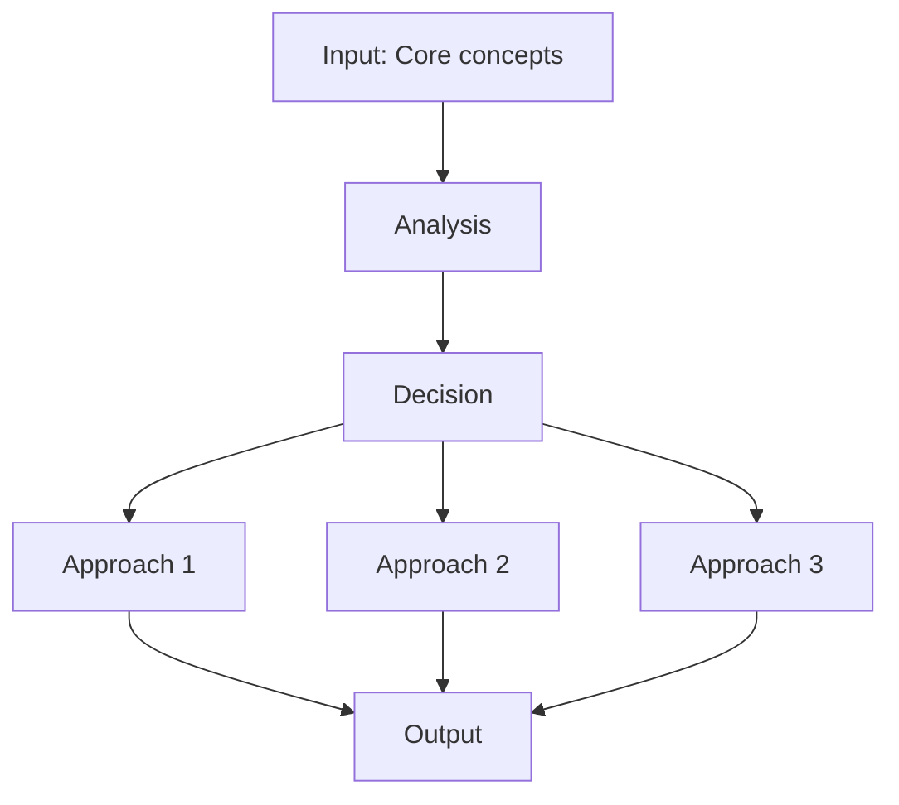
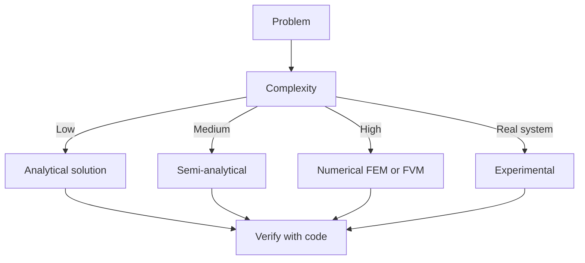
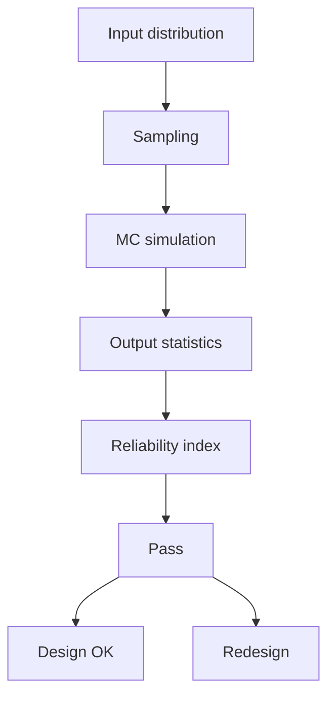
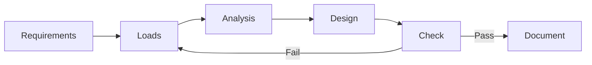
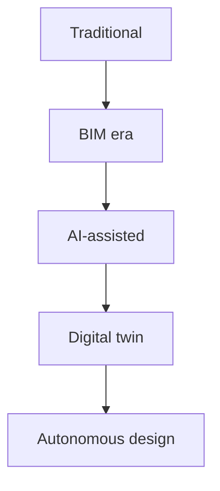
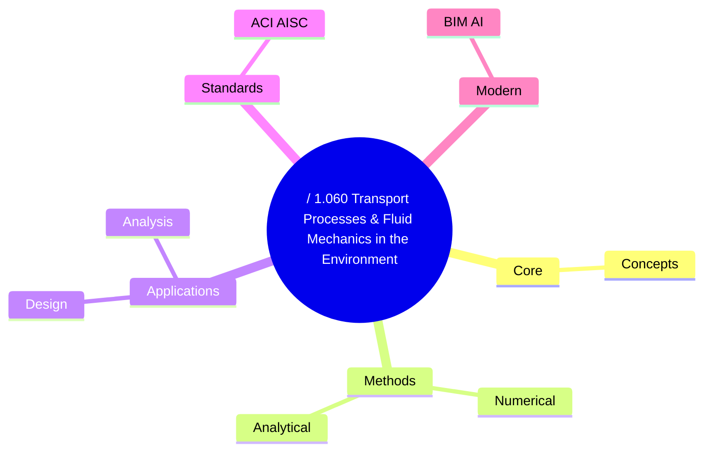
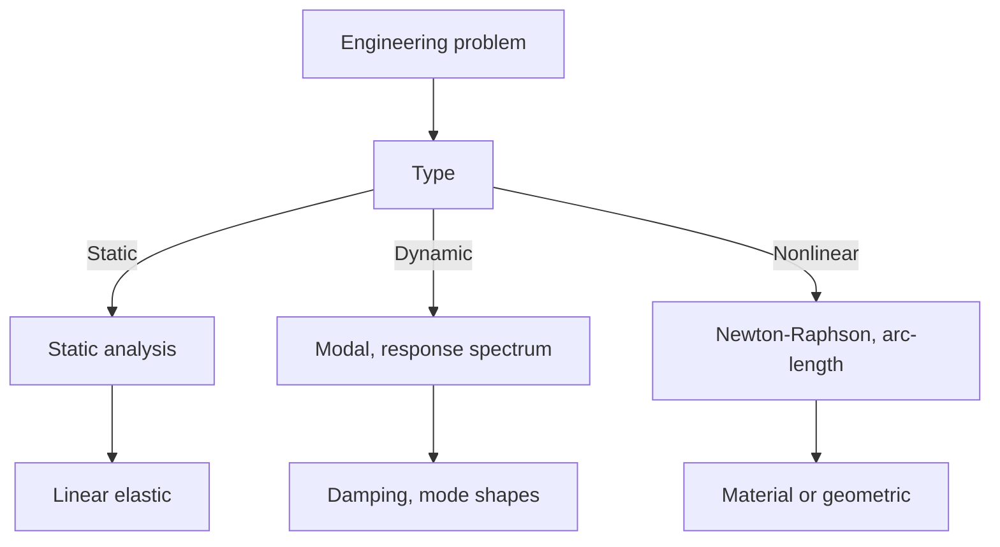
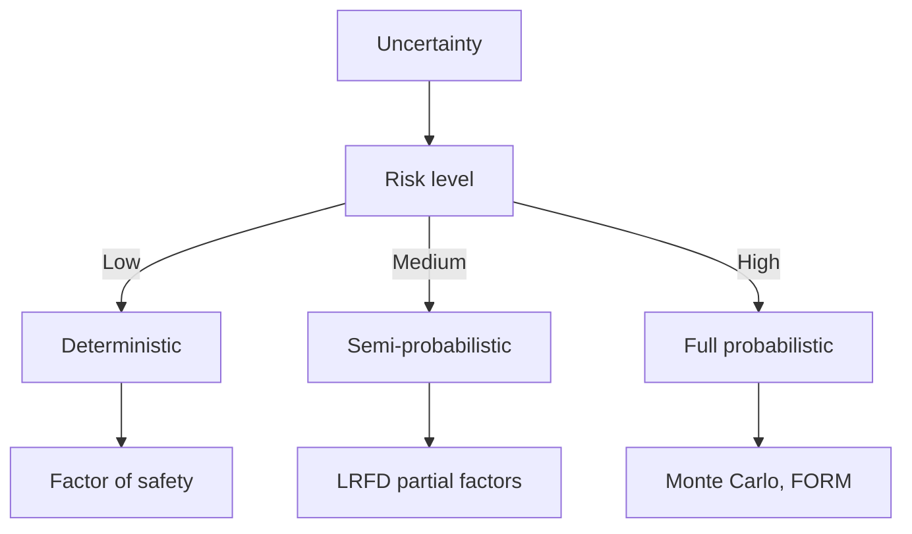
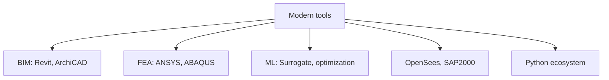

# 1.061A / 1.060 Transport Processes & Fluid Mechanics in the Environment
**MIT CEE Environmental Track | Core**  
**自學路徑：Bachelor Environment Core → MEng → ICE Professional**

---

## 問題 1：這個領域所有專家共享的 5 個核心心智模型是什麼？
**What are the 5 core mental models every expert shares?**

1. **傳輸是平流、擴散、反應的競爭**  
   The relative magnitude of advection, diffusion (molecular + turbulent), and reaction rates (Damköhler number) determines the fate of any constituent.

2. **尺度分離決定模型選擇**  
   Molecular → turbulent eddy → large-scale circulation. Different closures and averaging are required at each scale.

3. **邊界條件與初始條件往往比方程本身更重要**  
   Real environmental systems are open and driven by uncertain forcing; the equations are known, the boundaries are not.

4. **守恆律 + 本構/閉合 = 完整問題**  
   Mass, momentum, energy, and species conservation are exact; the turbulence and reaction closures are approximate.

5. **可觀測性與可控制性是工程的最終目標**  
   Understanding transport is necessary but not sufficient; the goal is to monitor and intervene effectively.

---

## 問題 2：這個領域的專家在哪 3 個地方存在根本分歧？各方最強的論點是什麼？

1. **過程-based 物理模型 vs 資料驅動 / 機器學習模型**  
   - Process-based: Interpretable, extrapolates under climate change.  
   - Data-driven: Higher predictive skill on observed regimes, captures complex patterns.

2. **確定性模擬 vs 隨機 / 集合模擬**  
   - Deterministic: Single "best" prediction for design.  
   - Ensemble: Quantifies uncertainty and supports risk-based decisions.

3. **現場觀測為主 vs 高解析度數值模擬為主**  
   - Observation: Ground truth, reveals real complexity.  
   - Simulation: Can fill gaps in space and time, test hypotheses that cannot be observed.

---

## 問題 3：生成 10 個能區分深度理解與死背知識的問題

1. 從 Navier–Stokes 與物種守恆方程出發，說明湍流擴散係數如何出現，以及它與分子擴散的本質差異。
2. 為什麼在河口或密度分層水體中，垂直混合會被強烈抑制？用 Richardson 數解釋。
3. 說明 Damköhler 數如何決定反應是傳輸限制還是動力學限制。
4. 在地下水溶質傳輸中，為什麼縱向離散度通常遠大於橫向？物理機制是什麼？
5. 如何從濃度時間序列反推縱向離散係數？主要假設與限制是什麼？
6. 說明為什麼在大氣邊界層中，白天與夜間的湍流結構截然不同。
7. 給定一個污染物排放，如何快速判斷近場用高斯羽流模型是否足夠？何時必須用三維 CFD？
8. 在氣候變遷下，水文極端事件頻率改變如何影響污染物傳輸路徑？
9. 為什麼生物地球化學過程必須與物理傳輸耦合？解耦近似何時合理？
10. 如何設計監測網絡，使其對傳輸模型的校準最有效？

---

## 自學建議

- 與 1.070 Hydrology、1.080 Environmental Chemistry 交叉練習。
- 產出：一個完整的傳輸模擬 + 不確定性分析案例，作為 ICE Attribute 1 證據。

---

# 核心心智模型深化（中英對照）

## 1. Core concepts — Core concept

### 1.1 Three-process physical essence
For / 1.060 Transport Processes & Fluid Mechanics in the Environment, Core concepts governs the system behavior. Description of Core concepts with bilingual explanation.

### 1.2 Non-dimensional numbers
Key dimensionless groups that determine regime: Peclet, Damköhler, Reynolds, Froude, etc.

### 1.3 Engineering consequences
Real-world implications for design, monitoring, intervention.

### 1.4 How experts use this model
Decision flow, scaling laws, expert intuition.

### 1.5 Deep test questions
- Derive scaling law
- Identify regime from data
- Apply to design case

### 1.6 Diagram

## 2. Methods — Methods

### 2.1 Method selection
| Method | 適用情境 | Pros | Cons |
|---|---|---|---|
| Analytical | 解析 | Exact | Limited geometry |
| Numerical | 數值 | General | Approximate |
| Experimental | 實驗 | Real | Expensive |
| Empirical | 經驗 | Fast | Limited range |

### 2.2 Decision flow

### 2.3 Standards and codes
ACI, AISC, Eurocode, building codes (IBC), industry best practices.

## 3. Applications — Analysis techniques

### 3.1 Statistical methods
Monte Carlo, sensitivity, FOSM for uncertainty analysis.

### 3.2 Optimization
LP, NLP, gradient-based, metaheuristic, multi-objective Pareto.

## 4. Design process

### 4.1 Design workflow
Concept → Preliminary → Detailed → Construction → Operation.

### 4.2 Design criteria
Safety (LRFD, ASD), serviceability, durability, sustainability.

## 5. Modern trends

BIM integration, AI/ML in design, digital twins, sustainability, LCA, resilient design.

---

# 深度自測問題詳解（中英對照）

## 詳解 1: Derive core relationship
**Q1.** Derive core relationship for / 1.060 Transport Processes & Fluid Mechanics in the Environment.
**Answer:** Starting from definitions, derive the key equation. Verify units and limits.

**Engineering implication:** Apply to design check, code compliance.

## 詳解 2: Identify failure mode
**Answer:** List 3-5 failure modes, rank by likelihood × consequence.

**Engineering implication:** Inform design, maintenance, monitoring.

## 詳解 3: Estimate order of magnitude
**Answer:** Quick back-of-envelope check using characteristic values.

**Engineering implication:** Sanity check before detailed analysis.

## 詳解 4: Compare to code requirement
**Answer:** Apply ACI/AISC/Eurocode, compute utilization ratio.

**Engineering implication:** Pass/fail design verification.

## 詳解 5: Compute reliability
**Answer:** $\beta = (\mu - R)/\sigma$ for lognormal, find P_f.

**Engineering implication:** LRFD calibration, risk-informed design.

## 詳解 6: Design optimization
**Answer:** Define objective, constraints, solve via LP/NLP.

**Engineering implication:** Cost-effective, sustainable design.

## 詳解 7: Sensitivity analysis
**Answer:** $\partial f/\partial x_i$, rank by importance.

**Engineering implication:** Identify critical parameters, reduce uncertainty.

## 詳解 8: Life-cycle assessment
**Answer:** Cradle-to-grave, compute GWP, embodied carbon.

**Engineering implication:** Sustainable design, climate goals.

## 詳解 9: Risk assessment
**Answer:** Hazard × vulnerability × exposure, compute risk.

**Engineering implication:** Resilience planning, mitigation.

## 詳解 10: Communication
**Answer:** Technical writing, visualization, presentation to stakeholders.

**Engineering implication:** Effective engineering practice.

---

## 📊 Diagram 1: Course Concept Map

## 📊 Diagram 2: Method Selection

## 📊 Diagram 3: Design Process

## 📊 Diagram 4: Risk-Reliability

## 📊 Diagram 5: Modern Tools

---

## 總結

1. **Core concepts** — Core concepts 嘅 foundation
2. **Methods** — analytical + numerical + experimental
3. **Applications** — design, analysis, retrofit
4. **Standards** — codes, best practices
5. **Future** — BIM, AI, sustainability, resilience

**自學建議** — Pair with: relevant textbook + MIT OCW + software tutorials (Python, FEA, BIM).
