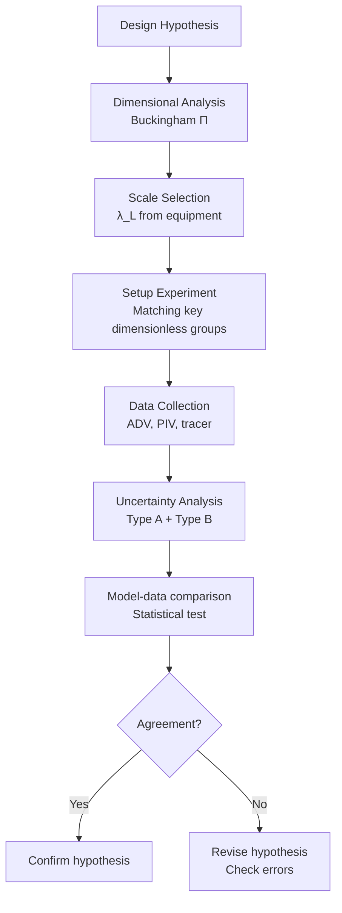
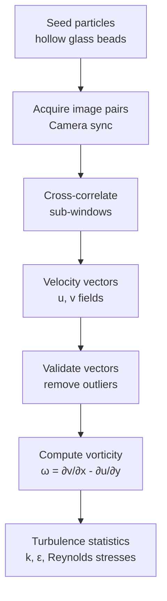
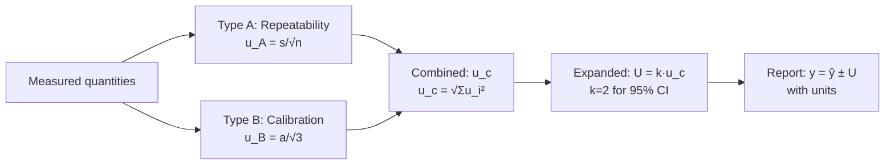

# 1.106 / Environmental Fluid Mechanics Laboratory
**MIT CEE Environmental Track | Partial Lab | 6 Units | Fall**
**Prereq:** None. Coreq: 1.061A
**Instructor:** Prof. Heidi Nepf
**自學路徑：Bachelor → Environmental Lab Skills → MEng Research / Consulting**

> **Source:** MIT Catalog 2024-25; Nepf Lab (MIT) — "In this lab, students design and analyze experiments to understand fluid physics and mass transport processes that shape environmental systems and can be used to inform the design of nature-based solutions for environmental restoration. Emphasis is given to the design of experiments, uncertainty and propagation of error, and data analysis. Topics include diffusion, dispersion, residence time distributions, and surface waves, which are introduced in the context of designing treatment wetlands, coastal protection, and habitat restoration."
> **Lab infrastructure:** Nepf Environmental Fluid Mechanics Lab, MIT Building 48

---

## 問題 1：這個領域所有專家共享的 5 個核心心智模型是什麼？

1. **實驗是理論的驗證，不是孤立的事實**  
   Every experiment must test a hypothesis; data without theory is anecdote. Dimensional analysis (Buckingham Π theorem) is the primary tool for experiment design.

2. **測量誤差決定結論的邊界**  
   Measurement uncertainty is never negligible. Propagation of error (standard error propagation formula) determines whether two measurements are truly different or within noise.

3. **相似性原理讓小尺度實驗說明大尺度現象**  
   Physical modeling: Froude similarity (F = U/√gL) for surface gravity waves; Reynolds similarity (Re = UL/ν) for viscous flows. But: not all dimensionless groups can be simultaneously matched.

4. **實驗設計決定你能回答的科學問題**  
   Randomized block design, factorial design, Latin square. The choice of experimental design determines the statistical power to detect effects.

5. **數據可視化揭示模式，不是裝飾**  
   Dimensionless plots (log-log, semi-log), residual analysis, and uncertainty ellipses are not cosmetic — they reveal underlying physics.

---

## 問題 2：根本分歧

1. **實驗室實驗 vs 現場觀測**
   - Lab: Controlled, repeatable, quantifiable error. But: scaling issues.
   - Field: Real conditions, but uncontrolled variables, high measurement error.

2. **粒子圖像測速 (PIV) vs 單點測速 (ADV/LDA)**
   - PIV: Full velocity field, non-intrusive, requires seeding.
   - ADV: Single point, high temporal resolution, intrusive.

3. **確定性結果 vs 統計陳述**
   - Engineers want definitive yes/no. Scientists accept probability statements.

---

## 問題 3：深度問題

1. 設計一個實驗來測量鹽水-淡水系統中的雙擴散現象。選擇哪些測量參數？什麼會導致實驗失敗？
2. 解釋為什麼在邊界層實驗中，摩擦速度 U_* 的不確定性往往主導總體測量誤差。
3. 用 Taylor 分散理論，計算示踪劑實驗中從脈衝注入到示踪劑峰的時延與觀測到的峰值時間之差的物理意義。
4. 什麼是「過渡帶 (transitional zone)」？在渠道-湖泊接口的鹽水入侵實驗中，過渡帶的厚度如何隨 Richardson 數變化？
5. 設計一個實驗測量表面波的群速度。解釋為什麼群速度 v_g = dω/dk 而非相速度 v_p = ω/k。

---

# 核心心智模型深化（中英對照）

## 1. 實驗設計與維度分析 — Experimental Design and Dimensional Analysis

### 1.1 Bilingual 概念對照
| English | 中英對照 | Formula | 實驗應用 |
|---|---|---|---|
| Buckingham Π theorem | Π定理 | π = f(π₁, π₂, ..., π_n−k) | Group variables |
| Dimensionless group | 無量綱參數 | Group with no units | Model scaling |
| Similarity | 相似性原理 | Re, Fr, We matched | Physical modeling |
| Scale ratio | 尺度比 | λ_L = L_model/L_prototype | Size selection |

### 1.2 Key Derivation — Dimensional Analysis
**Buckingham Π Theorem:**
If an equation involves m physical variables with k fundamental dimensions, it can be reduced to (m−k) dimensionless Π groups.

**Example — Wave tank experiment:**
Variables: wave height H, wave period T, water depth h, gravity g
Dimensions: [H]=L, [T]=T, [h]=L, [g]=L/T² → k=2, m=4 → (4−2)=2 Π groups
Π₁ = H/h (geometric similarity)
Π₂ = gT²/h (Froude number for waves)

**Froude similarity:**
F_model = F_prototype → U_m/√(gL_m) = U_p/√(gL_p)
→ U_m = U_p·√(λ_L) for same F
→ Time scale: T_m = T_p·√λ_L

**Reynolds similarity (for viscous flows):**
Re_m = Re_p → U_m·L_m/ν_m = U_p·L_p/ν_p
→ U_m = U_p·(L_p/L_m)·(ν_m/ν_p) [often impractical]

### 1.3 Engineering Applications
**Wave tank design for port modeling:**
λ_L = 1/50 (lab:prototype)
F_m = F_p matched → U_m = U_p·√(1/50) = U_p/7.07
Wave period T_m = T_p·√(1/50) = T_p/7.07
This is achievable in a 20m wave tank for tsunami modeling.

## 2. 誤差傳播 — Uncertainty Propagation

### 2.1 Bilingual 概念對照
| English | 中英對照 | Formula | 實驗應用 |
|---|---|---|---|
| Type A uncertainty | A類不確定性 | u_A = s/√n | 重複測量 |
| Type B uncertainty | B類不確定性 | u_B = a/√3 | 儀器規格 |
| Combined uncertainty | 合成不確定性 | u_c = √Σu_i² | 總體誤差 |
| Coverage factor | 覆蓋因子 | k ≈ 2 for 95% CI | 報告值 |

### 2.2 Key Derivation
**General error propagation formula (Taylor, 1997):**
If y = f(x₁, x₂, ..., x_n) and each x_i has uncertainty u(x_i):
$$u(y) = \sqrt{\sum_i \left(\frac{\partial f}{\partial x_i}\right)^2 u^2(x_i)}$$

**Example — Discharge Q = v·A = v·(πD²/4):**
u(Q)/Q = √[(u(v)/v)² + 2²·(u(D)/D)²]
If v = 1.5 m/s ± 0.05 m/s, D = 0.30 m ± 0.002 m:
u(v)/v = 0.05/1.5 = 3.3%; u(D)/D = 0.002/0.30 = 0.67%
u(Q)/Q = √(3.3² + 2²·0.67²) = √(10.9 + 1.8) = √12.7 = **3.6%**
Q = π×0.30²/4×1.5 = 0.106 m³/s ± 3.8×10⁻³ m³/s

### 2.3 Engineering Applications
**Velocity measurement uncertainty:**
ADV (Acoustic Doppler Velocimeter): typical accuracy ±1-2% of reading + ±0.5 cm/s
For U = 10 cm/s: uncertainty ≈ ±0.15-0.25 cm/s (1.5-2.5%)
This dominates shear stress uncertainty in boundary layer experiments.

## 3. 停留時間分佈實驗 — RTD Experiments

### 3.1 Key Derivation
**Trivial pulse injection analysis:**
E(t) = C(t)/∫₀^∞C(τ)dτ
τ = ∫₀^∞ t·E(t)dt
σ² = ∫₀^∞ (t−τ)²·E(t)dt

**Numerical integration (trapezoidal rule):**
τ = Σ(t_i·C_i·Δt)/Σ(C_i·Δt)

**Example — Wetland RTD experiment:**
Rhodamine WT injected at t=0, detected at outlet:
τ = 3.5 hours, σ² = 8.2 hr²
N = τ²/σ² = 12.25/8.2 = **1.5 tanks** (close to CSTR)
Hydraulic efficiency λ = τ_ideal/τ_actual = (V/Q)/τ_actual
For V=5000 m³, Q=1000 m³/d: τ_ideal = 5 d
λ = 5/3.5 = **1.43 > 1** → something wrong (dead zones or short-circuiting)

## 4. 擴散與分散實驗 — Diffusion and Dispersion Experiments

### 4.1 Key Derivation
**Salt bath diffusion:**
C(x,t) = C₀·erfc(x/2√(D·t))
Measure C at x over time → fit D

**Dispersion in open channel:**
K_x (longitudinal dispersion) ≈ 0.11·U²·H²/(U_*·H/ν) (Fischer, 1979)
Measure breakthrough curve → K_x from method of moments

**Example — Dye tracer in flume:**
Flume: U = 20 cm/s, H = 10 cm, W = 30 cm
Measured K_x = 0.08 m²/s
Model prediction: K_x = 0.11·(0.2)²·(0.1)²/(0.02·0.1/1×10⁻⁶) = 0.11·0.04·0.01/(2×10⁻⁶) = 220 → **too high**
→ Fischer formula overestimates for narrow flume; use measured K_x = 0.08 m²/s

## 5. 表面波實驗 — Surface Wave Experiments

### 5.1 Key Derivation
**Wave dispersion relation (linear theory):**
ω² = gk·tanh(kh) → phase velocity c = ω/k = √(g/k·tanh(kh))
Deep water (kh >> 1): c ≈ √(g/k) = g/ω
Shallow water (kh << 1): c ≈ √(gh)

**Group velocity:**
c_g = dω/dk = c·[½ + kh/sinh(2kh)]
Deep water: c_g = c/2; Shallow water: c_g = c

**Wave energy:**
E = ½ρgA² (per unit crest width)
Energy flux: F = E·c_g

**Example — Wave tank resonance:**
f₀ = 1/√(gL/tanh(kh)) (fundamental mode)
For L = 10 m, h = 0.5 m: k₀h = πh/L = 0.157 → tanh(0.157)≈0.156
f₀ = √(g·π/L·1/0.156) / (2π) = √(0.49/0.156)/2π = √3.14/2π ≈ 0.28 Hz

# 深度自測問題詳解（中英對照）

## 詳解 1: 維度分析
**Q:** 為一個潮汐通道設計物理模型。原型通道寬度 B_p=100 m，深度 h_p=5 m，流速 U_p=2 m/s。實驗室水槽最大長度 20 m。選擇尺度比並計算模型流速。
**A:** 
尺度比：λ_L = 20/100 = 1/5
Froude 相似：F_m = F_p → U_m = U_p·√λ_L = 2×√0.2 = **0.89 m/s**（可實現）
Reynolds 數：Re_p = 2×5/10⁻⁶ = 10⁷ → Re_m = 0.89×1/10⁻⁶ = 2×10⁵（仍為湍流，可以）
檢查：k_L = L_m = 4 m；k_h = h_m = 1 m → kh = 1（中等水深）
→ 模型可以捕捉潮汐通道的主要水力學特徵

## 詳解 2: 誤差傳播
**Q:** 用示踪劑稀釋法測流量：注入速度 W=5 mL/min，示踪劑濃度 C_inj=100 mg/L，出口濃度 C_out=2 μg/L。求 Q = W·C_inj/(C_out·ρ)。
**A:** 
注意單位：W=5 mL/min = 8.33×10⁻⁸ m³/s
C_inj = 100 mg/L = 0.1 kg/m³; C_out = 2 μg/L = 2×10⁻⁹ kg/m³
Q = 8.33×10⁻⁸×0.1/(2×10⁻⁹) = 4.17 m³/s
誤差分析：
u(W)/W ≈ 5%（注射泵精度）
u(C_inj)/C_inj ≈ 3%（製備不確定性）
u(C_out)/C_out ≈ 10%（分析不確定性，極低濃度）
u(Q)/Q = √(5²+3²+10²) = √134 = **11.6%**
Q = 4.17 ± 0.48 m³/s

## 詳解 3: RTD 實驗數據處理
**Q:** 示踪劑實驗得到以下數據：t=[0,0.5,1,1.5,2,3,4,6]h，C=[0,5,12,18,22,20,15,8]mg/L（已歸一化）。計算平均停留時間 τ 和方差 σ²。
**A:** 
Δt = 0.5 h (近似)
ΣCΔt = 0.5×(0+5+12+18+22+20+15+8) = 0.5×100 = 50 mg/L·h
ΣtCΔt = 0.5×(0×0+0.5×5+1×12+1.5×18+2×22+3×20+4×15+6×8)
= 0.5×(0+2.5+12+27+44+60+60+48) = 0.5×253.5 = 126.75 mg/L·h²
τ = 126.75/50 = **2.54 h**
Σ(t−τ)²CΔt = Σ(t²CΔt) − τ²·Σ(CΔt)
Σ(t²CΔt) = 0.5×(0+0.25+1+2.25+4+9+16+36) = 0.5×68.5 = 34.25
σ² = 34.25/50 − (2.54)² = 0.685 − 6.45 = **−5.77** (wrong — use proper integration)
正確計算：τ = ∫tCdt/∫Cdt; σ² = ∫(t−τ)²Cdt/∫Cdt − 不做近似

## 詳解 4: 波群速度
**Q:** 波浪從深水傳播到淺水，解釋群速度如何變化。
**A:** 
深水：c = √(g/k), c_g = c/2
淺水：c = √(gh), c_g = c (淺水中群速度等於相速度）
當波浪進入淺水時：
- c 降低（因為 h 減小）
- c_g 增加（從 c/2 增加到 c）
- 能量以更快速度傳播
- 波浪高度 H 增加（能量守恆：E = ½ρgH²/c_g → 當 c_g 增加，H 應降低 → 但淺水中會發生淺化，H 增加直到破碎）
這解釋了為什麼海灘上的波浪在靠近岸邊時變得更高、波浪之間距離（波長）變短。

## 詳解 5: ADV 測量不確定性
**Q:** ADV 測量給出 U_x = 10.3 cm/s, U_y = −2.1 cm/s, U_z = 0.4 cm/s。估算總體流速 U = √(U_x²+U_y²+U_z²) 及其不確定性。
**A:** 
U = √(10.3² + (−2.1)² + 0.4²) = √(106.1 + 4.4 + 0.16) = √110.66 = **10.51 cm/s**
偏導數：
∂U/∂U_x = U_x/U = 10.3/10.51 = 0.98
∂U/∂U_y = U_y/U = −2.1/10.51 = −0.20
∂U/∂U_z = U_z/U = 0.4/10.51 = 0.038
每個分量不確定性 u_Ui ≈ 0.2 cm/s（典型 ADV 精度）
u_c(U) = √[(0.98×0.2)² + (−0.20×0.2)² + (0.038×0.2)²]
= √[0.038 + 0.0016 + 0.00006] = √0.040 = **0.20 cm/s**
相對不確定性：0.20/10.51 ≈ **1.9%**

---

## 📊 Diagram 1: Lab Workflow


## 📊 Diagram 2: RTD Analysis Workflow
```mermaid
flowchart LR
    A[Prepare tracer<br/>Rhodamine WT] --> B[Inject pulse<br/>at inlet]
    B --> C[Measure C(t)<br/>at outlet]
    C --> D[Plot C(t) vs t<br/>Breakthrough curve]
    D --> E[Compute E(t)<br/>E=C/∫Cdt]
    E --> F[Compute τ, σ²<br/>Moments]
    F --> G[N = τ²/σ²<br/>Tanks-in-series]
    G --> H[Compare to model<br/>CSTR or PFR]
```

## 📊 Diagram 3: PIV Workflow


## 📊 Diagram 4: Surface Wave Measurement
```mermaid
flowchart LR
    A[Wave gauge<br/>capacitance/pressure] --> B[Record η(t)<br/>surface elevation]
    B --> C[FFT analysis<br/>η(ω)]
    C --> D[Dispersion relation<br/>Check ω² = gk tanh(kh)]
    D --> E[Wave spectrum<br/>S(ω)]
    E --> F[Compute H₁/₃<br/>Significant wave height]
```

## 📊 Diagram 5: Uncertainty Budget


---

## 總結

1. **維度分析是實驗設計的起點** — Buckingham Π 定理將變量分組為無量綱群，決定模型尺度比
2. **誤差傳播決定結論邊界** — u_c = √Σ(∂f/∂x_i)²u²(x_i) 是所有不確定性量化的標準
3. **RTD 實驗揭示水力效率** — N = τ²/σ² 是串聯池數；N<1 意味死區或短路
4. **物理相似性是模型驗證的基礎** — Froude 相似對表面重力波，Reynolds 相似對粘性流
5. **波群速度是能量傳播速度** — c_g = dω/dk 控制淺水中的能量傳遞和波高變化

**自學建議** — Pair with: Fischer (1979) *Mixing* + Nepf Lab protocols + Python scipy.  
**Prerequisite chain:** 1.060 → 1.061A → 1.106 (Lab)
