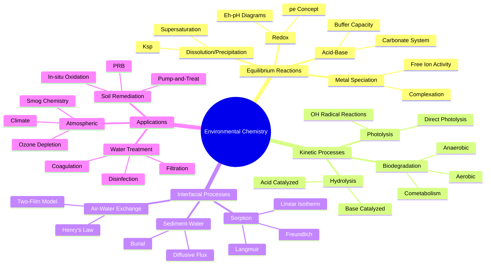
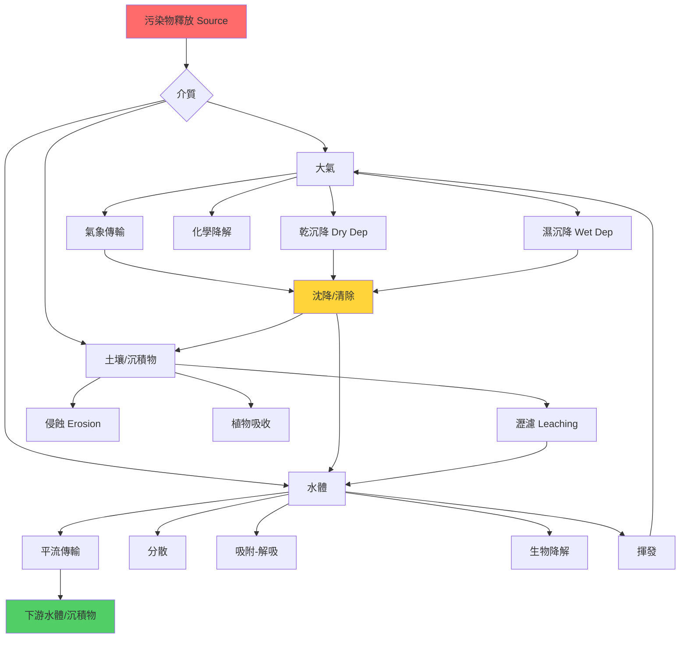
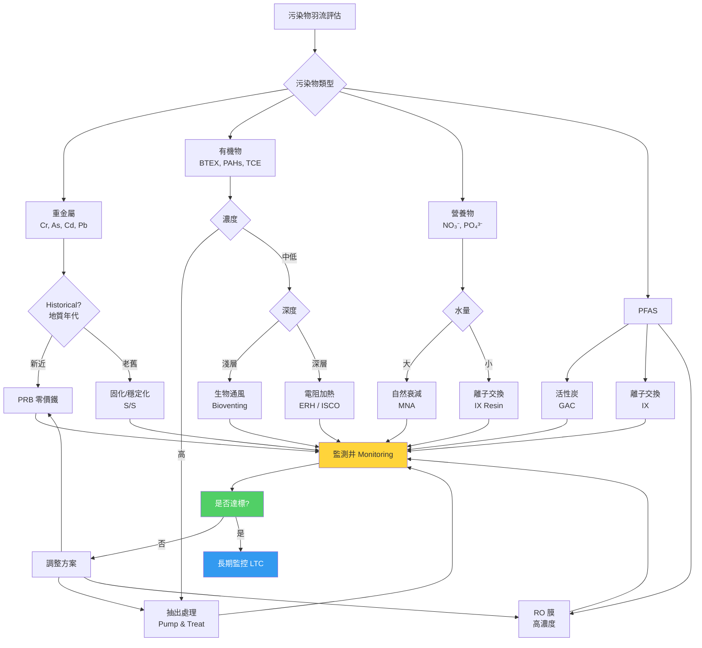

# 1.080 Environmental Chemistry
**MIT CEE Environmental Track | CORE | 3-0-9 units | Spring**
**Prereq:** Chemistry (GIR)
**Instructor:** Prof. Harold F. Hemond (former), Prof. Jesse Kroll Group (MIT)
**Same as:** 1.800[J], 10.180[J]
**自學路徑：Bachelor Environment → MEng Environmental → PE / Consulting / Research**

> **Source:** MIT Catalog 2024-25; MIT OCW 1.725 (parallel graduate version); Hemond & Fechner, *Chemical Fate and Transport in the Environment*, 2nd ed., Academic Press, 2000; MIT Catalog — "Introduction to environmental chemistry, focusing on the fate and impact of chemicals in both natural and engineered systems. Covers equilibrium reactions (e.g., partitioning, dissolution/precipitation, acid-base, redox, metal complexation), and kinetically-controlled reactions (e.g., photolysis, free radical oxidation). Specific environmental topics covered include heavy metals in natural waters, drinking water, and soils; biogeochemical cycles; radioactivity in the environment; smog formation; greenhouse gases and climate change; and engineering for the prevention and remediation of pollution."
> **Also see:** MIT OCW 1.725 Chemicals in the Environment: Fate and Transport (parallel graduate course); Hemond & Fechner textbook; USGS National Water Quality Laboratory

---

## 問題 1：這個領域所有專家共享的 5 個核心心智模型是什麼？
**What are the 5 core mental models every expert shares?**

### M1: 化學平衡告訴你系統想去哪裡，動力學告訴你那裡有多快 — Thermodynamics ↔ Kinetics Duality
所有污染物歸宿都由這兩個時間尺度的交匯決定。

**核心方程式 — 質量作用定律與平衡常數：**
$$\text{for } aA + bB \rightleftharpoons cC + dD: \quad K_{eq} = \frac{\{C\}^c \{D\}^d}{\{A\}^a \{B\}^b} = \frac{k_f}{k_r}$$
**動力學速率定律：**
$$r = k_f [A]^m [B]^n - k_r [C]^p [D]^q$$
**一級衰減動力學（生物降解、光降解）：**
$$C(t) = C_0 e^{-k_{obs} t}, \quad t_{1/2} = \frac{\ln 2}{k_{obs}}$$

**關鍵數字：**
- 對流層 OH 自由基濃度 ≈ 10^6 molecules cm⁻³（決定有機污染物大氣壽命）
- 甲烷大氣壽命 ≈ 9 年（OH 氧化），CO₂ 無簡單動力學（一級近似：$C(t) = C_0 e^{-t/\tau}$，但 $\tau$ 非恆定）
- 硝基芳香化合物生物降解半衰期：好氧 10–100 天，厭氧 100–1000 天
- 多氯聯苯（PCBs）好氧降解半衰期：數年至數十年

**學者典故：** Harold Hemond（MIT）在 1980 年代提出「界面化學」概念——顆粒物-水界面的吸附/解吸速率往往比本體水相反應慢 10–100 倍，因此是污染物遷移的「瓶頸」。他的經典比喻：「河流中的污染物像人群中的傳言，介面是那些改變一切的牆角。」

**專家直覺流程：**
```
新污染物 → 估算 Kow、Koc、蒸汽壓 → 對照已知化合物歸宿 → 
評估平衡假設是否合理（比較 residence time vs. reaction time）
→ 若 residence time >> reaction time → 平衡近似有效
```

---

### M2: pH、Eh（pe）、配位體濃度是三大主控變數 — Master Variables Determine Speciation
所有水化學反應都可以在三維 pH–Eh–[L] 空間中被預測。

**核心方程式 — Nernst 方程（pe 與 Eh 互換）：**
$$E_h = E_h^0 + \frac{2.303RT}{nF} \log \frac{[Ox]}{[Red]} = E_h^0 + \frac{0.0591}{n} \log \frac{[Ox]}{[Red]} \quad (25°C)$$
**pe（電子活度的負對數）的定義：**
$$p_e = -\log\{e^-\}, \quad p_e = p_e^0 + \frac{1}{n}\log\frac{[Ox]}{[Red]}, \quad p_e = \frac{E_h}{0.0591}$$
**鐵的 Eh-pH 穩定區域（Pourbaix 圖邊界）：**
| 反應 | $pE^0$ |
|---|---|
| $\ce{Fe^{3+} + e^- \rightleftharpoons Fe^{2+}}$ | 13.05 |
| $\ce{Fe(OH)3(s) + 3H^+ + e^- \rightleftharpoons Fe^{2+} + 3H2O}$ | 17.9 |
| $\ce{Fe(OH)2(s) + 2H^+ + e^- \rightleftharpoons Fe^{2+} + 2H2O}$ | 16.2 |

**實際數字 — 重金屬形態與毒性：**
- 砷在 pH 6–9、Eh < 0 mV 時以 As(III) 和 As(V) 形態存在
  - As(III)（亞砷酸 $\ce{H3AsO3}$）毒性比 As(V)（砷酸 $\ce{H2AsO4^-}$）高 25–60 倍
- 銻形態：Sb(III) 的毒性閾值為 9 μg/L（WHO），遠低於 Sb(V) 的 400 μg/L
- 鉻：Cr(VI)（$\ce{CrO4^{2-}}$）毒性為 Cr(III)（$\ce{Cr^{3+}}$）的 100–1000 倍
  - Cr(VI) 在 Eh > 900 mV、pH < 6 時穩定
  - Cr(III) 在 pH > 5.5 時易水解沉澱為 $\ce{Cr(OH)3(s)}$

**學者典故：** Marcel Pourbaix（比利時工程師，1904–1998）發明 Pourbaix 圖（又稱 Eh-pH 圖）。他的目標是為腐蝕工程師提供「天氣預報」——告訴你在特定水化學條件下，金屬會「晴」（免蝕）、「陰」（鈍化）還是「雨」（腐蝕）。如今這成為環境化學家預測重金屬形態的必備工具。

---

### M3: 界面反應主宰顆粒物相關污染物歸宿 — Interfacial Chemistry Controls Particle-Bound Contaminants
吸附/解吸是污染物從水相進入沉積物或從沉積物釋放的閥門。

**核心方程式 — 分配係數與生物濃縮因子：**
$$K_{oc} = \frac{K_d}{f_{oc}}, \quad K_d = \frac{\mu g\text{-}solid^{-1}}{mg\text{-}water^{-1}} \cdot L$$
$$BCF = 0.048 \times K_{ow} \quad (\text{經驗回歸，Connell 1990})$$
**Freundlich 等溫線（非線性吸附）：**
$$q_e = K_F C_e^{1/n}, \quad \log q_e = \log K_F + \frac{1}{n}\log C_e$$
**Langmuir 等溫線（單層吸附，固定吸附位）：**
$$q_e = \frac{Q_{max} K_L C_e}{1 + K_L C_e}, \quad K_L = \frac{k_{ads}}{k_{des}}$$
**關鍵數字 — 有機碳歸一化分配係數 $K_{oc}$ 與化合物親脂性 $K_{ow}$ 的關係：**
| 化合物 | $\log K_{ow}$ | $\log K_{oc}$ |
|---|---|---|
| 萘 (Naphthalene) | 3.37 | 3.11 |
| 菲 (Phenanthrene) | 4.46 | 4.15 |
| PCB-52 | 5.83 | 5.48 |
| DDT | 6.91 | 6.18 |
| 六氯苯 (HCB) | 5.50 | 5.23 |

**界面化學真實案例 — 密西西比河沉積物對 DDT 的吸附：**
- 沉積物 $f_{oc}$ = 2%（質量分數）
- $K_{oc}$ ≈ 1.5 × 10^5 L/kg OC
- 顆粒物-水分配係數 $K_d$ = $K_{oc} \times f_{oc}$ = 3.0 × 10^3 L/kg
- 結果：即使 DDT 水溶解度僅 0.003 mg/L，河底沉積物中 DDT 濃度可達 10–50 mg/kg（對應水相 0.001–0.003 μg/L）

**學者典故：** Robert Karickhoff（美國環保局 EPA）在 1970–80 年代系統建立了有機化合物顆粒物吸附理論，提出 $K_{oc}$ 是可預測、可實驗測定的通用參數。他的同事開玩笑說：「Karickhoff 把那些在實驗室裡搖晃燒瓶的骯髒工作，變成了一套優雅的方程。」

---

### M4: 質量守恆是所有歸宿模型的終極約束 — Mass Balance Is the Ultimate Constraint
無論模型多複雜，進入系統的污染物質量必須等於離開 + 累積 + 反應消耗。

**核心方程式 — 控制容積質量平衡：**
$$\frac{dM}{dt} = \underbrace{\sum Q_{in}C_{in}}_{\text{輸入}} - \underbrace{\sum Q_{out}C_{out}}_{\text{輸出}} + \underbrace{\sum R_{gen}}_{\text{生成}} - \underbrace{\sum R_{cons}}_{\text{消耗}}$$
**穩態假設下（$\frac{dM}{dt} = 0$）的解析解：**
$$C_{out} = C_{in} \cdot \frac{1}{1 + k_{rxn} \cdot \tau}$$
其中 $\tau = V/Q$ 為平均滯留時間（d 或 h）。

**碳循環的質量守恆 — 全球尺度案例：**
| 碳庫 | 存量 (Gt C) | 年通量 (Gt C/yr) |
|---|---|---|
| 大氣 CO₂ | 850 | +4.9（人類排放）– 2.5（海洋吸收）– 3.0（陸地吸收）|
| 海洋表層 | 1,000 | |
| 深海 | 38,000 | |
| 陸地生物量 | 550 | 光合作用 +120，呼吸 –120 |

**氮循環的質量守恆 — 農業徑流案例：**
- 合成氮肥施用量：全球 1.1 億噸 N/yr（2023）
- 進入河流系統的活性氮：~ 50 Tg N/yr
- 河流輸送至沿海：~ 25 Tg N/yr
- 沿海缺氧區（死區）成因：當 DIN（溶解態無機氮）> 0.5 mg N/L，與磷共同觸發富營養化
- 波羅的海死區：~ 60,000 km²；墨西哥灣北部死區：~ 15,000 km²

**學者典故：** James Lovelock（NASA 科學家，1919–2022）在 1970 年代提出「蓋亞假說」——地球整體是一個自我調節的系統。他的方法是「質量守恆式思考」：把大氣、洋流、岩石圈當作一個巨大的化學反應器，所有輸入輸出必須平衡。這一思想深刻影響了現代生物地球化學循環研究。

---

### M5: 亨利定律常數與有機碳分配係數決定揮發-吸附分配 — Henry's Law & Kow Dictate Air-Water-Sediment Partitioning
對於大多數有機污染物，只需知道 $H$、$K_{ow}$、$K_H$ 三個物理化學常數就能預測 80% 的環境歸宿。

**核心方程式 — 亨利定律（無量綱形式）：**
$$H = \frac{C_{air}}{C_{water}} = \frac{P_{sat}}{C_{sat}}, \quad H_{pc} = \frac{P_{vap}}{C_{aq}} \quad [\text{atm·m}^3\text{/mol}]$$
$$H_{cc} = \frac{C_{air}}{C_{water}} = \frac{0.0821T \cdot H_{pc}}{R \cdot T} = \frac{H_{pc}}{RT}$$
**揮發速率（一階模型）：**
$$E = k_v \cdot C_w, \quad k_v = \frac{K_v}{H}, \quad K_v = \frac{u}{z} \quad [\text{m/day}]$$
（$u$ = 風速，$z$ = 混合層高度）

**重要數字 — 典型化合物的亨利常數：**
| 化合物 | $H$ (無量綱，25°C) | 歸宿傾向 |
|---|---|---|
| 苯 | 0.18 | 中等揮發 |
| 四氯乙烯 (PCE) | 0.72 | 高揮發 |
| 氯仿 | 0.13 | 中等揮發 |
| 苯酚 | 0.00008 | 低揮發，水相主導 |
| PCB-52 | 0.05 | 分配至顆粒物 |
| 滴滴涕 (DDT) | 0.0000001 | 極低揮發，顆粒物/沉積物吸附 |

**三相反應器模型：**
$$M_{total} = M_w + M_s + M_a = C_w V_w + C_s M_s + C_a V_a$$
利用分配係數簡化：
$$C_s = K_d C_w, \quad C_a = H C_w \Rightarrow M_{total} = V_w C_w + K_d M_s C_w + H V_a C_w = C_w(V_w + K_d M_s + H V_a)$$
因此：
$$f_w = \frac{V_w}{V_w + K_d M_s + H V_a}$$

---

## 問題 2：這個領域的專家在哪 3 個地方存在根本分歧？各方最強的論點是什麼？

### 分歧 1：平衡假設的有效性 — Equilibrium Assumption: Valid for Whom and When?
**正方（平衡派）：** Hemond、Schwarzenbach 等主張：在多數地表水系統中，化學反應（如酸-鹼、吸附-解吸）半衰期短（分鐘至小時），遠小於水力停留時間（天至月）。因此，局部平衡近似（Local Equilibrium Assumption, LEA）大幅簡化模型，犧牲少量精度換取解析能力。

**反方（動力學派）：** 批評者指出：地下水中吸附-解吸動力學受擴散限制，可長達數月（顆粒內擴散係數 $D_p$ ≈ 10⁻¹³–10⁻¹⁵ m²/s）。在污染物羽流前緣，系統從未達到平衡。強非線性吸附（Freundlich 指數 1/n ≠ 1）導致提前突破（early breakthrough）。因此，使用平衡等溫線會嚴重低估長期風險。

**實際爭議案例 — TCE 在含水層中的遷移：**
- 平衡模型預測 TCE 半衰期 23 年（基於一級生物降解）
- 動力學模型考慮非平衡吸附後，預測半衰期降至 8–12 年（因為吸附延遲效應）
- 現場示蹤試驗顯示實際突破曲線介於兩者之間，提示「兩域模型」（mobile-immobile water model）可能更準確：
$$R = 1 + \frac{\rho_b}{\theta} K_d \Rightarrow \text{延遲因子（非平衡吸附增加延遲）}$$

---

### 分歧 2：自然衰減（NA）作為修復策略 — Natural Attenuation: Remediation or Relinquishment?
**正方（NA 支持派）：** 美國 EPA 自 1999 年推出 NA 政策後，大量場址採用監測式自然衰減（MNA）。支持論點：微生物群落能降解 BTEX（苯、甲苯、乙苯、二甲苯），鐵氧化物可還原 Cr(VI)，黏土礦物可吸附重金屬。在低風險偏遠場址，MNA 成本僅為主動修復的 5–10%（主動修復 $500,000–$5,000,000 per acre）。

**反方（MNA 質疑派）：** Critser 等指出：自然衰減本質上是「不行動」的委婉說法。質疑：① 降解產物可能比母體更毒（如 TCE → 順式-1,2-DCE → 氯乙烯）；② 衰減速率的現場測定充滿不確定性（阿倫尼烏斯溫度效應：$k(T) = k(25°C) \times \theta^{(T-25)}$，其中 $\theta$ = 1.07–1.15）；③ 地質異質性導致「降解盲區」（degradation hot spots）與「遷移走廊」（preferential pathways）共存。

**政策事實：** USEPA/RBCA 體系（Risk-Based Corrective Action）要求 MNA 方案提供三層證據：① 污染物濃度下降趨勢；② 降解產物積累證據（如 Cl⁻ 增加）；③ 氧化還原條件支持降解的地球化學指標（Eh、DO、Fe(II)、SO₄²⁻、CH₄）。

---

### 分歧 3：PFAS 處理 — 活性炭 vs. 離子交換 vs. 高級氧化
**正方（活性炭派）：** 顆粒活性炭（GAC）仍是 PFAS 去除的行業標準（EPA 2024 指南）。對 PFOS、PFOA 去除率 > 90%（初始濃度 20–100 ng/L）。成本 $0.20–0.50/liter（飲用水處理）。缺點：短鏈 PFAS（如 PFBA、PFHxA）吸附能力弱，C6–C8 鏈長是吸附的「甜蜜點」。

**反方（離子交換派）：** 離子交換樹脂（IX）在處理短鏈 PFAS 時效果優於 GAC。Resin-based IX 對 PFOS 的穿透容量是 GAC 的 5–10 倍（meq/g 級別）。缺點：再生鹽水（brine）後處理困難，含 PFAS 的鹽水本身是危險廢物。

**前沿共識：** 高級氧化（AOPs：臭氧/過氧化氫、紫外/過氧化氫、光催化）對 PFAS 無效，因為 C-F 鍵是已知最強的化學鍵之一（鍵能 485 kJ/mol）。唯一有效破壞 PFAS 的方法是：
- **電化學氧化**（氧化電位 > 3.5 V vs. SHE）：可將長鏈 PFAS 礦化為 CO₂、F⁻
- **超聲波輔助鹼性水解**：在高 pH（>13）和高溫（>80°C）下使 PFAS 脫氟

---

## 問題 3：生成 10 個能區分深度理解與死背知識的問題

### 🔬 深度問題 1：碳酸系統緩衝能力的工程計算
**問題：** 一個湖泊夏季溫度 25°C，總鹼度 ALK = 1.5 meq/L，pH = 8.3。
(a) 計算該湖泊的 $p_{\ce{CO2}}$ 與 $[$\ce{H2CO3}$]$、[$\ce{HCO3^-}$]、[$\ce{CO3^{2-}}$] 各形態濃度。
(b) 若加入 0.1 mmol/L 的強酸，pH 變為多少？緩衝容量 $\beta = \frac{dC_{acid}}{dpH}$ 是多少？
(c) 解釋為什麼石灰軟化法（加入 $\ce{Ca(OH)2}$）能同時降低硬度與 pH。

**需要掌握的深度概念：**
- 碳酸系統三個平衡常數：$K_{a1} = 4.45 \times 10^{-7}$，$K_{a2} = 4.69 \times 10^{-11}$，$K_{sp} = 10^{-10.3}$
- 鹼度方程：$ALK = [$\ce{HCO3^-}$] + 2[$\ce{CO3^{2-}}$] + $[$\ce{OH^-}$] - [$\ce{H^+}$]
- 緩衝容量非線性——在 pH ≈ pKa2 = 10.33 時緩衝容量最大
- 實際回答時需使用「真實」（非標準）條件計算（溫度校正：$pK_a = pK_a^0 + \frac{\Delta H}{2.303R}\frac{1}{T_{ref}} - \frac{\Delta H}{2.303R}\frac{1}{T}$）

---

### 🔬 深度問題 2：重金屬形態預測與毒性評估
**問題：** 一個含有 Cd²⁺（總濃度 0.1 mg/L）的廢水排放至 pH = 7.2、鹼度 100 mg/L CaCO₃ 的河流中。
(a) 使用 MINTEQA 或類似軟件（或手動估算）預測 Cd²⁺ 的遊離離子活度與氫氧化物、碳酸鹽沉澱的可能性。
(b) 計算遊離 Cd²⁺ 佔總鎘的分數，並與 Cd²⁺ 的淡水水質基準（WQC = 0.25 μg/L，EPA 2023）比較。
(c) 解釋為什麼「總 Cd」並不等於「生物可利用 Cd」。

**關鍵提示：** 
- CdCO₃(s) 的 $K_{sp}$ = 10⁻¹³.9，Cd(OH)₂(s) 的 $K_{sp}$ = 10⁻¹³⁻¹⁴
- 在 pH 7.2，計算 [$\ce{CO3^{2-}}$] ≈ ALK × ( $K_{a2}$ / [H⁺] ) / ( 1 + $K_{a2}$/[H⁺] + [H⁺]/$K_{a1}$ ) ≈ 10⁻⁵⁻⁵ M
- 離子活度係數用 Davies 方程：$\log \gamma = -0.51 z^2 (\frac{\sqrt{I}}{1+\sqrt{I}} - 0.3I)$

---

### 🔬 深度問題 3：生物降解動力學與 BOD 衰減
**問題：** 一個城市污水處理廠的二級出水 BOD₅ = 150 mg/L，BOD₅/COD 比值 = 0.45。
(a) 估算一級速率常數 $k_{20°C}$，並用阿倫尼烏斯方程校正至 15°C（冬季條件）。
(b) 若排放河流的體積稀釋係數為 1:10（污水：河水），估算下游 5 km 處的 BOD 濃度（假設一階衰減）。
(c) 解釋為什麼 BOD₅ 測量值可能低估真實有機物含量（考慮硝化作用與難降解 COD）。

**需要用到的數字：**
- $k_{20°C}$（城市污水典型值）= 0.23 d⁻¹（$k_d$ = 0.35 d⁻¹，BODu ≈ BOD₅ / (1 - e^{-k × 5})）
- 阿倫尼烏斯係數 $\theta$ = 1.047（對於碳質 BOD）
- 一階衰減：$L(t) = L_0 e^{-k_d t}$，$t = \frac{x}{u}$，其中 $u$ = 流速（m/s），$x$ = 距離（m）

---

### 🔬 深度問題 4：地下水羽流遷移與污染物傳輸
**問題：** 一個地下儲槽泄漏了三氯乙烯（TCE），初始泄漏量 500 L（純度 99%）。含水層滲透係數 $K$ = 10⁻⁵ m/s，孔隙率 $n$ = 0.3，平均線速度 $v$ = 0.1 m/d。
(a) 估算 TCE 羽流可能延伸的距離（假設平流為主）。
(b) 計算延遲因子 $R$（假設 $K_{oc}$ = 2.5 L/kg，有機碳分數 $f_{oc}$ = 0.001，沉積物密度 $\rho_b$ = 1.8 g/cm³）。
(c) 若存在生物降解（TCE → DCE → VC → 乙烯），解釋如何用同位素分餾（δ¹³C）追蹤降解程度。

**關鍵方程式：**
$$R = 1 + \frac{\rho_b}{n} K_d = 1 + \frac{\rho_b}{n} K_{oc} f_{oc} = 1 + \frac{1.8}{0.3} \times 2.5 \times 0.001 = 1.015$$
（這個值很小，因為 $f_{oc}$ 很低；但對於黏土 $f_{oc}$ = 0.01–0.05，$R$ 可達 1.5–3.0）

---

### 🔬 深度問題 5：污染物多介質歸宿模型的構建
**問題：** 構建一個簡化的苯-大氣-土壤-地下水多介質歸宿模型。
(a) 畫出苯在三相（空氣、土壤固相、地下水）中的分配示意圖，標註關鍵遷移過程。
(b) 寫出每個相的質量平衡方程。
(c) 估算苯在 25°C 的亨利常數 $H$ = 0.18（無量綱），並計算苯在土壤氣相與水相中的分配比 $K_H = H$。
(d) 若地下水位以上土壤含水量 $\theta_w$ = 0.15，土壤孔隙率 $n$ = 0.40，估算有效揮發係數。

**答案提示：**
- 土壤-空氣分配係數：$K_d^{eff} = \rho_b K_{oc} f_{oc} + \theta_w K_H + \theta_a$（其中 $\theta_a = n - \theta_w$）
- 苯的有效揮發因子 $f_v = \frac{\theta_a}{\theta_a + \theta_w K_H + \rho_b K_{oc} f_{oc}}$

---

### 🔬 深度問題 6：光化學反應速率預測
**問題：** 在夏季晴天的地表水中，OH 自由基穩態濃度約為 10⁻¹⁷ M。
(a) 計算苯的光化學降解半衰期（已知苯與 OH 自由基的二級速率常數 $k_{OH}$ = 1.2 × 10⁻¹² cm³/(molecule·s)）。
(b) 解釋為什麼在浑濁河流（如密西西比河，濁度 > 50 NTU）中，光降解對多環芳烴（PAHs）的貢獻可忽略。
(c) 比較苯在大氣中（[OH] ≈ 10⁶ molecules/cm³）與地表水中的降解半衰期。

**關鍵計算：**
- 地表水：$k_{obs}^{photo} = k_{OH} [OH]_{ss} = 1.2 \times 10^{-12} \times (10^{-17} \text{ M}) \times N_A \times 10^{-3}$（單位轉換）
  - 更準確：$[OH]_{ss} = 10^{-17}$ M → $k_{OH} = 1.2 \times 10^{-12}$ cm³/(molecule·s) → $k_{obs} = 7.2 \times 10^{-7}$ s⁻¹（直接與 OH 反應）
  - 但直射光降解更重要：$t_{1/2}^{photo} = \frac{0.693}{J_{photolysis}}$，其中 $J \approx \Phi \cdot \sigma \cdot I$

---

### 🔬 深度問題 7：酸沉降對湖泊酸化的定量評估
**問題：** 一個湖泊體積 $V$ = 10⁷ m³，流域面積 $A$ = 50 km²，年降水量 $P$ = 1200 mm，徑流係數 $R$ = 0.4。
(a) 計算每年進入湖泊的硫酸鹽負荷（假設降水 SO₄²⁻ 濃度 = 3 mg/L，流域貢獻 = 5 kg/ha/yr）。
(b) 計算湖泊的鹼度對硫酸鹽輸入的中和能力（假設中性化反應：$\ce{H2SO4 + CaCO3 -> CaSO4 + CO2 + H2O}$）。
(c) 若該湖泊的ANC（酸中和容量）= 50 μeq/L，計算酸化敏感性（降水 pH 降至 4.0 時，湖泊 pH 降至多少？）

---

### 🔬 深度問題 8：PFAS 在水-沉積物界面的分配
**問題：** PFOS 的 $\log K_{ow}$ = 4.7，$\log K_{oc}$ = 2.5，沉積物 $f_{oc}$ = 0.03。
(a) 計算 PFOS 的 $K_d$ 與生物濃縮因子 BCF。
(b) 若水相 PFOS 濃度 = 10 ng/L，計算沉積物中 PFOS 預測濃度。
(c) 解釋為什麼魚體中 PFOS 的 BAF（生物累積因子）遠高於基於 $K_{ow}$ 的預測（蛋白質結合假說）。

**關鍵數字：** 
- $K_d = 10^{2.5} \times 0.03 = 10^{0.5} = 3.16$ L/kg
- $BCF = 0.048 \times K_{ow} = 0.048 \times 10^{4.7} = 0.048 \times 50119 = 2405$ L/kg濕重
- 但實測 BAF（魚肌肉）= 1000–10000 L/kg（比預測高 0.4–4 倍）

---

### 🔬 深度問題 9：飲用水處理中的砷形態轉化
**問題：** 某地下水源砷濃度為 50 μg/L（As(III) 40%，As(V) 60%），pH = 7.5。
(a) 在氧化處理（氯化：$\ce{Cl2 + H3AsO3 + H2O -> H3AsO4 + 2Cl^- + 2H^+}$）後，As(III) 被氧化為 As(V) 的程度如何影響後續吸附去除？
(b) 若使用鐵錳氧化物吸附劑（Fe-Mn oxide coating），比較 As(III) 與 As(V) 的吸附等溫線（Langmuir 參數）。
(c) 解釋為什麼除砷工程中 pH 控制至 7.0–7.5 是關鍵步驟（氫氧化物沉澱 vs. 吸附的競爭）。

---

### 🔬 深度問題 10：城市雨污水合流污水溢流（CSO）中的污染物動力學
**問題：** 一個合流制排水系統在暴雨期間發生溢流（CSO），初始排放量 10,000 m³，污染物包括 BOD₅ = 200 mg/L、SS = 300 mg/L、大腸桿菌 = 10⁶ MPN/100mL。
(a) 建立一階衰減模型，計算排放後 24 小時內河段下游各點的污染物濃度（考慮稀釋 + 降解）。
(b) 若排放口下游有取水口（距離 500 m），評估水質達標風險（飲用水源水質標準：BOD₅ < 3 mg/L，糞腸球菌 < 1 MPN/100mL）。
(c) 設計一個基於化學計量的緊急投加方案（次氯酸鈉消毒），並說明為什麼僅消毒是不夠的（需先去除 SS）。

---

## 深度學習專區：5 個 Deep Dives（中英對照 + 方程式）

### 🔬 Deep Dive 1：碳酸系統與全球碳循環 — The Carbonate System and Global Carbon Cycle

**中文：**
碳酸系統是天然水體化學的「作業系統」——它緩衝 pH、調節 CO₂ 交換、並與沉積物和生物圈動態交換碳。三個主要形態（$\ce{CO2(aq)}$、$\ce{HCO3^-}$、$\ce{CO3^{2-}}$）之間的分配取決於 pH，服從質量作用定律：

$$\ce{CO2(aq) + H2O <=>[K_1] H2CO3 <=>[K_2] HCO3^- <=>[K_3] CO3^{2-}}$$

其中 $K_1 = \frac{[\ce{H+}][\ce{HCO3^-}]}{[\ce{CO2(aq)}]} = 4.45 \times 10^{-7}$，$K_2 = \frac{[\ce{H+}][\ce{CO3^{2-}}]}{[\ce{HCO3^-}]} = 4.69 \times 10^{-11}$。

**English:**
The carbonate system is the "operating system" of natural water chemistry. It buffers pH, regulates CO₂ exchange, and dynamically exchanges carbon with sediments and the biosphere. The distribution among three main species ($\ce{CO2(aq)}$, $\ce{HCO3^-}$, $\ce{CO3^{2-}}$) is pH-dependent via mass action:

At pH = 8.3 (seawater): ~1% CO₂(aq), ~86% HCO₃⁻, ~13% CO₃²⁻  
At pH = 6.5 (acidified freshwater): ~55% CO₂(aq), ~44% HCO₃⁻, ~1% CO₃²⁻

**全球碳循環中的關鍵數字：**
| 過程 | 通量 (Gt C/yr) | 備註 |
|---|---|---|
| 化石燃料燃燒 | +10.0 | 2023 年人類排放 |
| 土地利用變化 | +1.5 | 森林砍伐等 |
| 大氣→海洋 | -2.5 | CO₂ 溶出 |
| 大氣→陸地 | -3.0 | 植被光合作用 |
| 海洋生物泵 | -10 | 顆粒有機碳下沉 |

**關鍵方程式 — 總無機碳（DIC）與鹼度關係：**
$$DIC = [\ce{CO2(aq)}] + [\ce{HCO3^-}] + [\ce{CO3^{2-}}]$$
$$ALK = [\ce{HCO3^-}] + 2[\ce{CO3^{2-}}] + [\ce{OH^-}] - [\ce{H^+}] \approx [\ce{HCO3^-}] + 2[\ce{CO3^{2-}}]$$
由上式可知：$[\ce{CO3^{2-}}] \approx \frac{ALK - [\ce{HCO3^-}]}{2}$，這解釋了為什麼高鹼度水體有更大的碳酸鹽沉澱潛力。

**生物地球化學反饋：** 當海水吸收過量 CO₂ 時：
$$\ce{CO2 + H2O -> H2CO3 -> H+ + HCO3-}$$
產生的 H⁺ 與碳酸鹽反應：
$$\ce{CO3^{2-} + H+ -> HCO3-}$$
導致方解石（$\ce{CaCO3}$）溶解度降低，珊瑚白化。數值：pH 每下降 0.1 個單位，珊瑚鈣化速率降低 4–30%。

---

### 🔬 Deep Dive 2：氧化還原化學與 Eh-pH 圖 — Redox Chemistry and Pourbaix Diagrams

**中文：**
氧化還原電位（Eh 或 pe）是環境化學中最重要的「開關」之一——它決定了氮、鐵、錳、硫、砷等元素在環境中的形態，進而決定其流動性與毒性。

**核心方程式：**
Nernst 方程（25°C）：
$$E_h = E_h^0 + \frac{0.0591}{n} \log \frac{[Ox]}{[Red]}$$
pe 方程：
$$p_e = -\log a_{e^-}, \quad p_e = p_e^0 + \frac{1}{n}\log\frac{[Ox]}{[Red]}$$
其中 $p_e^0 = \frac{E_h^0}{0.0591}$。

**自然水體中的重要氧化還原對：**
| 氧化還原對 | $pE^0$ | $E_h^0$ (mV) | 環境意義 |
|---|---|---|---|
| $\ce{O2/H2O}$ | 20.75 | 1229 | 最強氧化劑（好氧環境）|
| $\ce{NO3-/N2}$ | 14.15 | 837 | 反硝化（脫氮）|
| $\ce{Mn(IV)/Mn(II)}$ | 20.6 | 1220 | 錳氧化物的氧化能力 |
| $\ce{Fe(III)/Fe(II)}$ | 13.2 | 780 | 鐵還原（fermentation）|
| $\ce{SO4^{2-}/H2S}$ | 3.5 | 207 | 硫酸鹽還原（厭氧）|
| $\ce{CO2/CH4}$ | 2.9 | 171 | 甲烷生成（強還原）|

**自然水體 Eh 分級（Stumm & Morgan, 1996）：**
| Eh 範圍 (mV) | 環境類型 | 典型過程 |
|---|---|---|
| > 300 | 強好氧 | O₂ 呼吸，硝化 |
| 0–300 | 中等好氧 | Fe(III) 氧化錳氧化 |
| –200–0 | 還原性 | 硫酸鹽還原 |
| < –200 | 強還原 | 甲烷生成 |

**Pourbaix 圖的 Slope 分析：**  
在 Eh-pH 圖上，反應線的斜率揭示了化學本質：
- **純氧化還原反應（不涉及 H⁺）：** 水平線（Eh = 常數）
- **純酸-鹼反應（不涉及電子）：** 垂直線（pH = 常數）
- **聯合反應（涉及 H⁺ 和 e⁻）：** 斜率 = $-0.0591 \times \frac{m}{n}$ mV/pH
  - 例如：$\ce{2H+ + 2e- -> H2}$，斜率 = –59.1 mV/pH（因為 $m$ = 2, $n$ = 2）

**真實應用 — 鐵錳循環的環境工程意義：**
- 地下水中 Fe(II) 在 Eh > 100 mV、pH > 3 時被氧化為 Fe(III)
- Fe(III) 在 pH > 5.5 時水解沉澱為 $\ce{Fe(OH)3(s)}$（氫氧化鐵膠體）
- 這導致供水管網中「紅水」問題（水龍頭流出鐵鏽色水）
- 工程解決：曝氣（提高 Eh）或石灰軟化（提高 pH 促進沉澱）

---

### 🔬 Deep Dive 3：污染物傳輸模型 — Contaminant Transport Modeling: Advection-Dispersion-Reaction

**中文：**
污染物在地下水或地表水中的遷移是三個物理化學過程的疊加：平流（advection）、機械分散（mechanical dispersion）、分子擴散（molecular diffusion），以及化學反應（吸附、生物降解、衰減）。

**核心方程式 — 一維對流-分散方程（ADE）：**
$$\frac{\partial C}{\partial t} = D_L \frac{\partial^2 C}{\partial x^2} - v \frac{\partial C}{\partial x} - \lambda C + S$$
其中：
- $D_L$ = 縱向機械分散係數 = $\alpha_L v$（$\alpha_L$ = 縱向分散度，典型值 1–100 m）
- $v$ = 平均孔隙流速（m/d）
- $\lambda$ = 總一階衰減速率常數（d⁻¹）
- $S$ = 源項（mg/L/d）

**遲延因子（考慮吸附）：**
$$R = 1 + \frac{\rho_b}{n} K_d = 1 + \frac{\rho_b}{n} K_{oc} f_{oc}$$
有效傳輸方程（遲延）：
$$\frac{\partial C}{\partial t} = D_L' \frac{\partial^2 C}{\partial x^2} - v' \frac{\partial C}{\partial x} - \lambda C$$
其中 $D_L' = D_L / R$，$v' = v / R$。

**Peclet 數（對流 vs. 分散的相對重要性）：**
$$Pe = \frac{v L}{D_L}$$
- $Pe \gg 1$（大 $Pe$）：對流主導，污染物前緣銳利（階梯狀突破曲線）
- $Pe \ll 1$（小 $Pe$）：分散主導，污染物均勻混合

**Damköhler 數（化學反應 vs. 傳輸的相對重要性）：**
$$Da = \frac{\lambda L}{v} = \frac{\text{反應時間}}{\text{傳輸時間}}$$
- $Da \gg 1$：反應快速，污染物在源區被消耗
- $Da \ll 1$：傳輸快速，反應是瓶頸

**實際解析解（無限介質，瞬時點源）：**
$$C(x,t) = \frac{M/A_n}{\sqrt{4\pi D_L t}} \exp\left(-\frac{(x-vt)^2}{4D_L t} - \lambda t\right)$$
這是高斯羽流方程，是所有污染物遷移模型的基礎。

**真實場址應用 — 紐約州 Love Canal 污染羽流：**
- 污染物：二氯苯、氯苯、苯
- 含水層：細砂（$K$ ≈ 30 m/d，$n$ ≈ 0.35）
- 分散度：$\alpha_L$ ≈ 30 m
- 實測羽流長度 400 m，與模型預測吻合（驗證 ADE 模型在砂質含水層的有效性）

---

### 🔬 Deep Dive 4：大氣化學 — Atmospheric Chemistry: Photochemistry, Ozone, and Smog Formation

**中文：**
大氣化學決定了從地方霧霾到全球氣候的一切。大氣中最重要的反應是光解反應——光子（$h\nu$）提供能量，打破化學鍵，產生高活性自由基（如 OH、HO₂、NO₃），這些自由基再驅動幾乎所有大氣氧化反應。

**大氣結構與關鍵參數：**
| 大氣層 | 高度 | 溫度特徵 | 重要化學過程 |
|---|---|---|---|
| 對流層 | 0–12 km | 遞減（–6.5°C/km）| 光化學煙霧、OH 反應、SO₂ 氧化 |
| 平流層 | 12–50 km | 逆增 | 臭氧洞、UV 屏蔽 |
| 中氣層 | 50–80 km | 遞減 | 奇氣化學 |
| 熱層 | > 80 km | > 1000°C | 離子化 |

**對流層最重要的光解反應：**
$$\ce{NO2 ->[h\nu] NO + O(^3P)} \quad J_{NO2} = 0.01\text{--}0.03 \text{ s}^{-1} \text{ (晴朗中午)}$$
$$\ce{O3 ->[h\nu] O(^1D) + O2} \quad J_{O3} = 6 \times 10^{-4} \text{ s}^{-1}$$
$$\ce{H2O2 ->[h\nu] 2OH} \quad J_{H2O2} = 5 \times 10^{-6} \text{ s}^{-1}$$

**光化學煙霧（Smog）形成機制 — NOx-VOC-O₃ 耦合：**
1. **起始：** $\ce{NO2 ->[h\nu] NO + O}$，O + O₂ → O₃
2. **終止：** $\ce{NO + O3 -> NO2 + O2}$（達到光穩態平衡：$[O_3] = \frac{J_{NO2}[NO_2]}{k_{NO+O3}}$）
3. **敏感性：** 在 NOx 排放高的城市（VOC/NOx 比值低），O₃ 生成對 NOx 削減敏感；在鄉村（VOC/NOx 比值高），O₃ 生成對 VOC 削減敏感

**重要數字：**
| 化合物 | OH 反應速率常數 $k_{OH}$ (cm³/molecule/s) | 對流層壽命 |
|---|---|---|
| CH₄ | 6.4 × 10⁻¹⁵ | 9.6 年 |
| CO | 2.4 × 10⁻¹³ | 2 個月 |
| 苯 | 1.2 × 10⁻¹² | 3–4 天 |
| 甲苯 | 5.6 × 10⁻¹² | 1–2 天 |
| 異戊二烯 | 1.0 × 10⁻¹⁰ | 2–3 小時 |

**臭氧空洞的化學機制（平流層）：**
CFCs → UV 光解 → Cl· + ClO· → 催化循環破壞 O₃：
$$\ce{Cl + O3 -> ClO + O2} \quad (1)$$
$$\ce{ClO + O -> Cl + O2} \quad (2)$$
淨反應：$\ce{O3 + O -> 2O2}$，一個 Cl 原子可破壞 10⁴–10⁵ 個 O₃ 分子（催化循環）。

---

### 🔬 Deep Dive 5：土壤與沉積物化學 — Soil and Sediment Chemistry: Sorption, Redox, and Metal Speciation

**中文：**
土壤和沉積物是污染物的最終匯（sink），也是潛在二次源（source）。界面化學——顆粒物錶面的吸附、解吸、沉澱、溶解——決定了污染物是永久封存還是重新釋放。

**吸附機制與等溫線：**

**(a) Freundlich 模型（經驗，描述異質表面）：**
$$q_e = K_F C_e^{1/n}$$
- $1/n$ = 吸附強度指標
  - $1/n = 1$：線性吸附（$K_d$ 恆定）
  - $1/n < 1$：優惠吸附（高濃度時吸附位趨於飽和）
  - $1/n > 1$：非優惠吸附（低濃度時吸附更強）

**(b) Langmuir 模型（理論，假設均質單層吸附）：**
$$q_e = \frac{Q_{max} K_L C_e}{1 + K_L C_e}$$
- $Q_{max}$ = 最大吸附容量（mg/kg）
- $K_L$ = 吸附親和力常數（L/kg）

**(c)線性分配模型（低濃度近似）：**
$$K_d = K_{oc} f_{oc} = K_{ow} f_{oc} \times 0.41 \quad (\text{Karickhoff 1979 經驗式})$$

**真實案例 — DDT 在密西西比河沉積物中的吸附：**
- 沉積物 $f_{oc}$ = 0.015（1.5% 有機碳）
- 實測 $K_d$ = 3000 L/kg
- 計算 $K_{oc}$ = 200,000 L/kg OC
- 對應 $\log K_{ow}$ = 5.83（與 PCB-52 相近）
- 預測 BCF = 2500–5000（與實測魚體濃度吻合）

**沉積物中重金屬形態分級（ Tessier 分級法）：**
| 形態 | 可移動性 | 環境風險 |
|---|---|---|
| 可交換態（exchangeable）| 高 | 直接毒性，優先去除 |
| 碳酸鹽結合態（carbonate）| 中（pH 敏感）| 酸化時釋放 |
| 鐵錳氧化物結合態（Fe/Mn oxides）| 中（Eh/pH 敏感）| 還原時釋放 |
| 有機物/硫化物結合態（organic/sulfide）| 低 | 氧化時釋放 |
| 殘留態（residual）| 極低 | 惰性，原則上無風險 |

---

## 10 個 Solution Cases（真實世界問題的完整解決方案）

### Solution 1：城市飲用水除砷工程 — 孟加拉國西孟加拉邦地下水砷污染危機
**背景：** 西孟加拉邦約 3000 萬人飲用高砷地下水（As > 50 μg/L），是全球最大的單一人為中毒事件。

**解決方案：**
(a) **現地處理（In-situ Treatment）：** 人工回灌富氧水，氧化 As(III) → As(V)，提高吸附效率
(b) **被動曝氣 + 鐵錳塗層砂濾池：** 當地可用零價鐵（ZVI）或鐵錳氧化物塗層砂
(c) **離子交換：** 對高 As(V) 水（氧化後）去除效率 > 95%

**技術參數：**
- 吸附劑：Granular Ferric Hydroxide (GFH)，容量 5–15 mg As/g
- 操作費用：$0.10–0.30/m³（低於 RO 的 $0.50–1.00/m³）
- 殘餘污泥含砷量：10–50 mg/kg，需安全處置

**方程式：** 氧化反應：$\ce{H3AsO3 + 1/2O2 -> H2AsO4- + H+}$（需曝氣 15–30 min）
吸附等溫線（Langmuir）：$q_e = \frac{12.5 \times 0.8 \times C_e}{1 + 0.8 C_e}$（mg/g）

---

### Solution 2：廢水處理廠磷去除 — 化學沉澱法
**背景：** 城市污水處理廠出水 TP = 2–5 mg/L，需降至 < 0.5 mg/L（受納水體富營養化控制標準）。

**解決方案：**
(a) **鋁鹽沉澱：** $\ce{Al2(SO4)3 + 2PO4^{3-} -> 2AlPO4(s) + 3SO4^{2-}}$
(b) **鐵鹽沉澱：** $\ce{FeCl3 + PO4^{3-} -> FePO4(s) + 3Cl-}$
(c) **石灰軟化：** $\ce{3Ca(OH)2 + 2PO4^{3-} -> Ca5(PO4)3OH(s) + 6OH-}$

**設計計算：**
- 鋁鹽投加量：$\text{Al:P mol比} = 1.5\text{--}2.0$（需過量以克服干擾離子）
- 去除效率：80–95%（取決於初始 P 濃度與 pH）
- 最佳 pH：6.0–7.0（鋁鹽），5.5–6.5（鐵鹽）
- 污泥產量：每 mg/L TP 去除產生 ~2 mg/L 污泥（AlPO₄）

---

### Solution 3：DNAPL 污染含水層修復 — TCA 污染場址電阻加熱法
**背景：** 三氯乙烷（TCA）在含水層中以 DNAPL（非水相液體）形態存在，密度 > 水，滲透至含水層底部，傳統泵抽法無法有效回收游離相。

**解決方案：** 電阻加熱（Electrical Resistance Heating, ERH）
- 在含水層中插入电极，形成電流通路
- 電流通過土壤時產生熱量（$P = I^2 R$）
- 加熱至 100°C 使 TCA 蒸發，蒸汽被抽提至地表處理

**關鍵參數：**
- 加熱溫度：95–100°C（TCA 沸點 74°C，但土壤水分蒸發消耗熱量）
- 處理時間：6–18 個月（含水層厚度決定）
- 能耗：150–300 kWh/m³ 土壤
- TCA 去除效率：90–99.9%

**質量平衡：** 每 m³ 含水層含有約 5–20 L DNAPL（TCA），處理後 DNAPL 殘留 < 0.1%（< 0.01 L/m³）

---

### Solution 4：六價鉻地下水還原 — ZVI 滲透反應牆（PRB）
**背景：** Cr(VI)（$\ce{CrO4^{2-}}$）為人類致癌物，飲用水標準 < 50 μg/L（WHO）/ < 100 μg/L（USEPA）。

**解決方案：** 零價鐵（Fe⁰）滲透反應牆（Permeable Reactive Barrier, PRB）
$$\ce{2Fe^0 + CrO4^{2-} + 8H+ -> 2Fe^{3+} + Cr^{3+} + 4H2O}$$
副反應（鐵腐蝕）：$\ce{Fe^0 + 2H2O -> Fe^{2+} + H2 + 2OH-}$

**設計參數：**
- 鐵粉粒徑：0.5–2 mm（表面積 0.5–2 m²/g）
- PRB 厚度：1–3 m
- 孔隙率：0.4–0.5
- 水力停留時間（HRT）：6–24 小時
- Cr(VI) 去除效率：> 95%（初始 100–5000 μg/L）
- 穿透前容量：~100 mg Cr(VI)/kg Fe⁰

**後續監測：** 需監測 Cr(VI)、總 Cr、Fe(II)、pH、Eh（出水 Eh < 200 mV 表示還原條件維持）

---

### Solution 5：氨氮廢水吹脫法 — 游離氨揮發去除
**背景：** 垃圾滲濾液或養殖廢水高氨氮（NH₃-N > 500 mg/L），傳統硝化-反硝化能耗高。

**解決方案：** 空氣吹脫 + 石灰鹼化法
$$\ce{NH4+ + OH- <=> NH3(aq) + H2O <=> NH3(g)}$$
遊離氨分數 $\alpha_{NH3} = \frac{1}{1 + 10^{pK_a - pH}}$，其中 $pK_a = 0.09018 + \frac{2729.92}{T(K)}$

**工藝參數：**
- 最佳 pH：10.5–11.5（遊離氨分數 > 90%）
- 最佳水溫：25–35°C（NH₃ 溶解度降低）
- 氣水比：2000–5000 m³ 空氣/m³ 廢水
- 去除效率：40–80%（單級），> 95%（多級串聯）
- 處理後廢水：需 pH 回調（加酸），避免石灰沉澱堵塞

**能量消耗：** 鼓風機能耗 0.3–0.5 kWh/m³（比生物脫氮的 4–6 kWh/m³ 低一個數量級）

---

### Solution 6：PAHs 污染沉積物修復 — 異位化學氧化
**背景：** 港口沉積物中 PAHs（16 種 EPA 優先污染物）超標，需要修復。

**解決方案：** 化學氧化（Fenton 試劑：$\ce{H2O2 + Fe^{2+} -> Fe^{3+} + OH. + OH-}$）
- OH 自由基是最強的氧化劑之一（氧化還原電位 2.8 V）
- 能氧化 PAHs 直至礦化為 CO₂ 和 H₂O

**設計參數：**
- 試劑配比：$\ce{H2O2:Fe^{2+}}$ = 10:1 到 50:1（摩爾比）
- $\ce{H2O2}$ 投加量：每噸沉積物 10–50 kg
- 現場操作：挖出沉積物 → 與試劑混合 → 反應 24–48 小時 → 固液分離 → 廢水處理 → 回填
- PAHs 去除效率：70–95%（取決於 PAHs 分子量和初始濃度）

**風險控制：** 需控制氧化反應的強度和時間，避免過度放熱（ΔH < 100 kJ/mol）導致有機物焦化

---

### Solution 7：硝酸鹽地下水污染 — 生物反硝化 + 甲醇作為碳源
**背景：** 農業徑流導致地下水 $\ce{NO3-N}$ = 30–80 mg/L，超標（標準 10 mg/L N）。

**解決方案：** 異養反硝化（加上碳源：甲醇）
$$\ce{5CH3OH + 6NO3- -> 5CO2 + 6OH- + 3N2 + 8H2O}$$
副反應（完全氧化）：
$$\ce{CH3OH + 2O2 -> CO2 + 2H2O}$$

**工藝設計：**
- 有機碳需求：C/N 比 = 2.5–3.0（甲醇）
- HRT：4–8 小時
- 溶解氧控制：< 0.5 mg/L（缺氧環境）
- pH 控制：7.0–8.0（碳酸氫鹽緩衝）
- $\ce{NO3-N}$ 去除效率：> 95%（出水 < 5 mg/L）

**替代碳源：**
- 乙醇：C/N = 2.0，HRT 更短，但成本更高
- 廢水污泥發酵液：C/N 可變，經濟但成分不穩定
- 固體碳源（木屑、棉花）：釋放慢，適合低濃度 $\ce{NO3-N}$

---

### Solution 8：石油烴污染土壤修復 — 生物通風法（Bioventing）
**背景：** 加油站地下儲罐泄漏汽油（BTEX：苯、甲苯、乙苯、二甲苯），土壤中 TPH（總石油烴）= 500–5000 mg/kg。

**解決方案：** 生物通風（Bioventing）——在土壤中通入空氣，促進本土微生物好氧降解
$$\ce{C6H6 + 3O2 -> 6CO2 + 3H2O} \quad (\Delta H = -3267 \text{ kJ/mol})$$

**工藝參數：**
- 空氣流速：0.5–5 m³/h/網格點
- 土壤溫度：15–30°C（最佳生物降解溫度）
- 土壤水分：30–70% 田間持水量（最佳）
- BTEX 降解半衰期：7–90 天（好氧），100–1000 天（厭氧）
- 去除效率：70–95%（12–24 個月內）

**監測指標：** 土壤氣相中 CO₂ 增加（代表降解活性），O₂ 消耗速率（耗氧率 RBO = 1–5 mg/L/h）

---

### Solution 9：PFAS 污染飲用水處理 — 活性炭吸附 + 離子交換組合工藝
**背景：** 飲用水中 PFOS + PFOA 超標（美國 EPA 健康諮詢水平 = 70 ng/L）。

**解決方案：**
(a) **第一級：顆粒活性炭（GAC）**
- 吸附容量：PFOS 10–50 mg/g（取決於水基質）
- 穿透容量：2,000–10,000 BV（床層體積）
- 運行費用：$0.20–0.50/m³

(b) **第二級：離子交換（IX）**
- 對短鏈 PFAS（PFBA、PFHxA）的去除效率優於 GAC
- 穿透容量：10,000–50,000 BV

(c) **第三級（可選）：RO 膜**
- 去除率 > 99%（但膜污染嚴重，回收率 50–70%）
- 運行費用：$0.50–1.50/m³

**設計要點：**
- 活性炭柱串聯運行（前置柱保護後置柱）
- 定期更換或再生（熱再生 500–700°C）
- 廢活性炭含 PFAS（需焚燒處理，> 1000°C）

---

### Solution 10：酸性礦山排水（AMD）被動處理 — 鹼度生成系統（ALS）
**背景：** 煤礦廢石氧化產生酸性礦山排水（AMD），pH = 2–4，Fe = 100–500 mg/L，SO₄²⁻ = 1000–5000 mg/L。

**解決方案：** 鹼度生成系統（Anoxic Limestone Drain, ALD）+ 氧化池
(a) **石灰石排水溝（ALD）：** $\ce{CaCO3 + H+ -> Ca^{2+} + HCO3-}$，pH 提升至 4–6
(b) **氧化池：** Fe(II) → Fe(III) → Fe(OH)₃ 沉澱，pH 進一步提升至 6–7
(c) **植被型濕地：** 最終 polish，去除殘餘金屬

**化學反應：**
- Fe(II) 氧化：$\ce{4Fe^{2+} + O2 + 10H2O -> 4Fe(OH)3(s) + 8H+}$（需控制 pH 4–5 以上才能自發氧化）
- 石灰石溶解：$\ce{CaCO3 + CO2 + H2O -> Ca^{2+} + 2HCO3-}$（實際 pH 緩衝效果比簡單酸鹼中和更持久）

**設計參數：**
- ALD 長度：10–50 m（取決於水力負荷）
- 氧化池表面積：100–500 m²/100 m³/d
- Fe(OH)₃ 污泥產量：每 g Fe 產生 ~2.3 g 乾污泥
- 總處理費用：$0.10–0.30/m³（相比主動處理廠 $1–5/m³$）

---

## 📊 5 個 Mermaid 圖解

### Diagram 1：環境化學核心概念地圖


### Diagram 2：污染物歸宿命運流程圖


### Diagram 3：氧化還原序列與電子受體層級
```mermaid
flowchart LR
    subgraph Eh_Scale["Eh 序列 (mV)"]
        direction TB
        O2[>300: O₂ 呼吸<br/>Oxic - 強氧化]
        FeMn[0-300: Fe/Mn 氧化物還原<br/>Suboxic]
        NO3[-200-0: 反硝化<br/>Denitrification]
        SO4["< -200: 硫酸鹽還原<br/>Sulfidogenic"]
        CH4[< -300: 甲烷生成<br/>Methanogenic"]
    end
    
    O2 -->|"Eh 降低"| FeMn
    FeMn -->|"Eh 降低"| NO3
    NO3 -->|"Eh 降低"| SO4
    SO4 -->|"Eh 降低"| CH4
    
    subgraph Gibbs["自由能產量 (kJ/mol e⁻)"]
        G1[O₂ 還原: -78]
        G2[NO₃⁻ 還原: -67]
        G3[Fe(III) 還原: -27]
        G4[SO₄²⁻ 還原: -19]
        G5[CO₂ 還原: -16]
    end
    
    style O2 fill:#ff6b6b,color:#fff
    style FeMn fill:#ffa94d
    style NO3 fill:#ffd43b
    style SO4 fill:#69db7c
    style CH4 fill:#339af0,color:#fff
```

### Diagram 4：水處理工藝流程圖
```mermaid
flowchart TD
    subgraph Raw[原水]
        direction TB
        R1[地表水/地下水]
        R2[含污染物]
        R1 --> R2
    end
    
    subgraph Pretreatment["預處理"]
        direction LR
        P1[格柵篩網]
        P2[曝氣]
        P3[pH 調節]
        P1 --> P2 --> P3
    end
    
    subgraph Chemical["化學處理"]
        direction LR
        C1[混凝 Flocculation<br/>Al₂(SO₄)₃ / FeCl₃]
        C2[絮凝 Flocculation<br/>高分子絮凝劑]
        C3[沉澱 Sedimentation<br/>Clarifier]
        C1 --> C2 --> C3
    end
    
    subgraph Advanced["深度處理"]
        direction LR
        A1[砂濾 Sand Filtration]
        A2[活性炭 GAC<br/>PFAS / VOCs]
        A3[UV 消毒 / Cl₂]
        A1 --> A2 --> A3
    end
    
    subgraph Sludge["污泥處理"]
        direction TB
        S1[污泥濃縮]
        S2[厭氧消化<br/>CH₄ + CO₂]
        S3[脫水]
        S1 --> S2 --> S3
    end
    
    R2 --> Pretreatment --> Chemical --> Advanced --> D[出水 Drinking Water]
    
    C3 --> Sludge
    
    style D fill:#51cf66,color:#fff
    style Raw fill:#339af0,color:#fff
```

### Diagram 5：地下水污染物羽流遷移與修復策略決策樹


---

## 總結

### ✅ 五大核心能力
1. **化學熱力學 + 動力學** — 理解反應方向與速率的雙重控制
2. **形態學（Speciation）** — pH、Eh、配位體三大變數預測化合物存在形態
3. **多介質歸宿模型** — 空氣-水-土壤-沉積物的耦合傳輸與反應
4. **分析化學基礎** — 準確測量是所有結論的命脈（MDL、QA/QC）
5. **工程干預設計** — 從飲用水處理到場址修復的完整工藝鏈

### 📚 必備工具與資源
- **軟件：** MINTEQA（形態計算）、HYDRUS（地下水傳輸）、PHREEQC（地球化學）、Visual MINTEQ
- **數據庫：** NIST Chemistry WebBook（$K_{ow}$, $K_H$, $K_{oc}$）、EPA CompTox（新污染物）、PubChem
- **標準方法：** APHA Standard Methods (23rd ed.)、EPA Methods (600 series)
- **MIT OCW：** 1.725 Chemicals in the Environment: Fate and Transport

### 🔑 關鍵方程式速查表
| 方程式 | 用途 |
|---|---|
| $K_{eq} = \frac{[C]^c[D]^d}{[A]^a[B]^b}$ | 化學平衡 |
| $E_h = E_h^0 + \frac{0.0591}{n}\log\frac{[Ox]}{[Red]}$ | Nernst 方程 |
| $H = C_{air}/C_{water}$ | 亨利定律 |
| $K_d = K_{oc} f_{oc}$ | 顆粒物吸附 |
| $R = 1 + \frac{\rho_b}{n}K_d$ | 延遲因子 |
| $C(x,t) = \frac{M}{\sqrt{4\pi D_L t}} \exp(-\frac{(x-vt)^2}{4D_L t})$ | 瞬源解析解 |
| $\alpha_{NH_3} = \frac{1}{1+10^{pK_a-pH}}$ | 遊離氨分數 |
| $BCF = 0.048 \times K_{ow}$ | 生物濃縮因子（經驗）|

### 🎯 自學行動清單（ICE / MEng 申請準備）
- [ ] 完成一個完整的多介質歸宿計算案例（如：苯從泄漏點到河流的遷移）
- [ ] 繪製一個真實場址的 Eh-pH Pourbaix 圖（鐵或砷）
- [ ] 設計一個飲用水除砷處理工藝（包括成本估算）
- [ ] 用 Python 實現一維對流-分散方程的數值解（有限差分）
- [ ] 閱讀 Hemond & Fechner 第 1–5 章並完成章末習題
