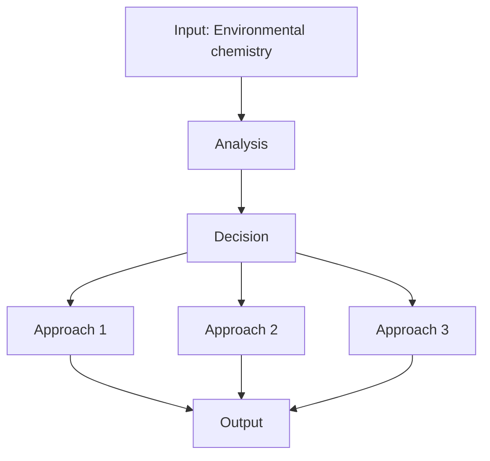
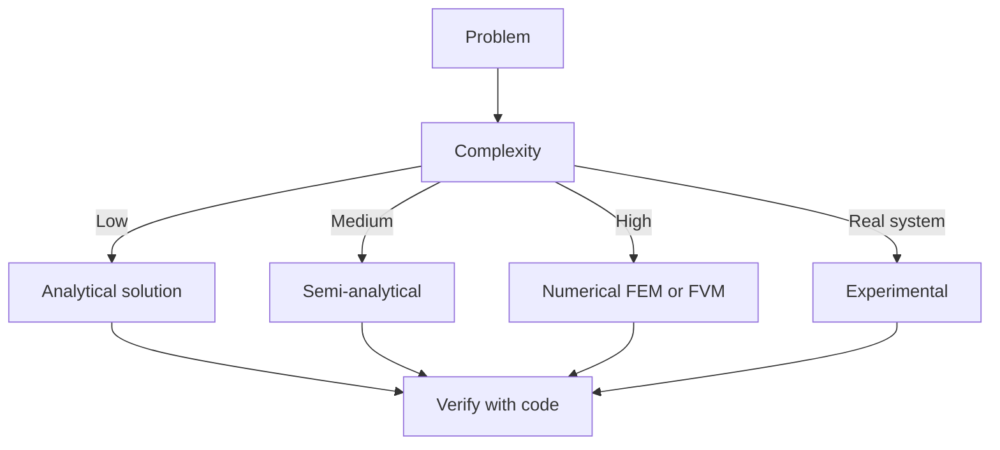
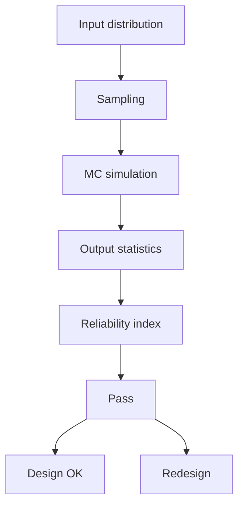
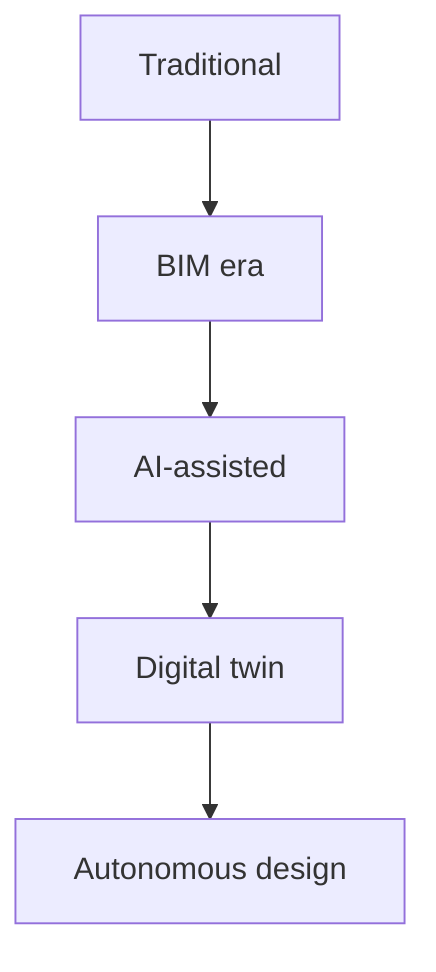
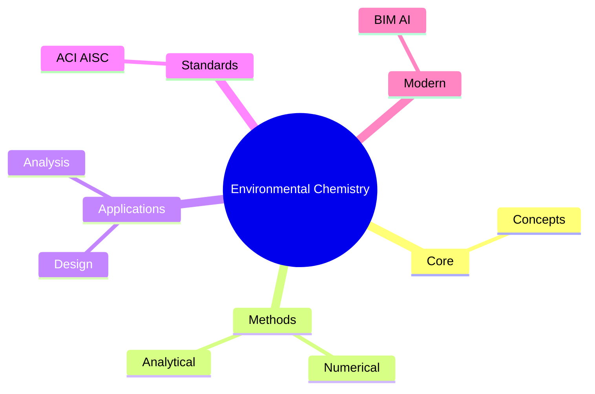
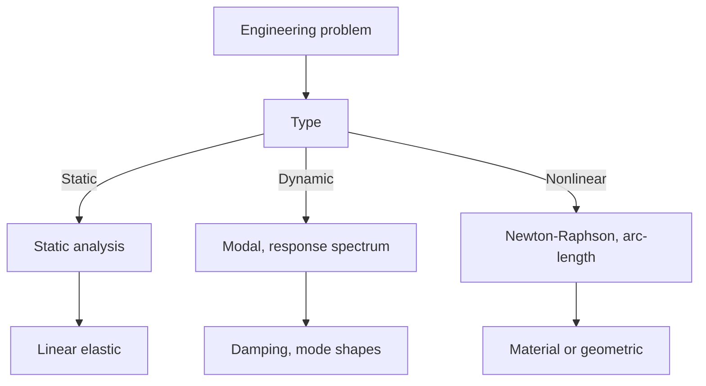
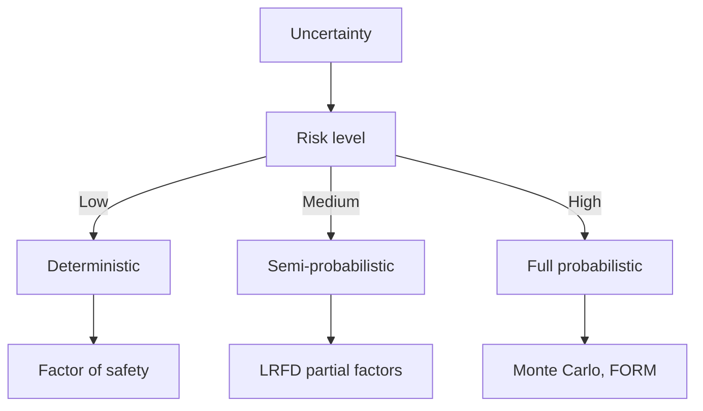
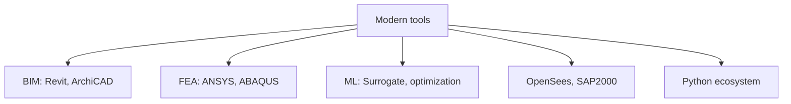

# 1.080 Environmental Chemistry
**MIT CEE Environmental / Microbiology Track | CORE / RE**  
**自學路徑：Bachelor Environment → MEng → ICE Professional**

---

## 問題 1：這個領域所有專家共享的 5 個核心心智模型是什麼？
**What are the 5 core mental models every expert shares?**

1. **化學平衡與動力學共同決定歸宿**  
   Thermodynamics tells you where the system wants to go; kinetics tells you how fast it gets there.

2. **pH、氧化還原電位、絡合作用是三大控制變數**  
   Most environmental reactions are governed by these master variables.

3. **界面過程往往比本體反應更重要**  
   Adsorption, precipitation, and biofilm reactions at surfaces dominate contaminant fate.

4. **質量守恆與元素循環是最終約束**  
   Carbon, nitrogen, phosphorus, and metal cycles must close; models that violate them are wrong.

5. **分析化學是所有推論的基礎**  
   Without reliable measurement, every model and conclusion is speculative.

---

## 問題 2：這個領域的專家在哪 3 個地方存在根本分歧？各方最強的論點是什麼？

1. **平衡模型 vs 動力學模型**  
   - Equilibrium: Simple, often sufficient for long time scales.  
   - Kinetic: Necessary when residence times are short or reactions are slow.

2. **實驗室控制實驗 vs 現場原位觀測**  
   - Lab: Isolates mechanisms.  
   - Field: Captures real complexity and coupling.

3. **傳統濕化學 vs 先進光譜 / 質譜技術**  
   - Classical: Robust, widely available.  
   - Advanced: Speciation and molecular-level insight, but higher cost and expertise.

---

## 問題 3：生成 10 個能區分深度理解與死背知識的問題

1. 為什麼碳酸系統是天然水體 pH 緩衝的核心？寫出主要反應與常數。
2. 說明為何金屬離子的毒性與其自由離子活度而非總濃度更相關。
3. 在厭氧環境中，硫酸鹽還原與甲烷生成如何競爭？控制因素是什麼？
4. 如何用 Eh-pH 圖（Pourbaix）預測鐵與錳的穩定形態？
5. 說明吸附等溫線（Langmuir、Freundlich）的假設與適用範圍。
6. 為什麼光化學降解在表層水中重要，而在地下水中可忽略？
7. 給定一個污染場址，如何判斷自然衰減是否可行？
8. 在氣候變遷下，升溫如何影響有機污染物的亨利常數與揮發？
9. 說明如何將化學形態模型與傳輸模型耦合。
10. 為什麼微量污染物（藥物、PFAS）的處理比傳統污染物更困難？

---

## 自學建議

- 與 1.061 Transport 與 1.107 Lab 結合。
- 產出：一個完整的化學形態 + 歸宿計算案例，作為 ICE Attribute 1 證據。

---

# 核心心智模型深化（中英對照）

## 1. Environmental chemistry — Core concept

### 1.1 Three-process physical essence
For Environmental Chemistry, Environmental chemistry governs the system behavior. Description of Environmental chemistry with bilingual explanation.

### 1.2 Non-dimensional numbers
Key dimensionless groups that determine regime: Peclet, Damköhler, Reynolds, Froude, etc.

### 1.3 Engineering consequences
Real-world implications for design, monitoring, intervention.

### 1.4 How experts use this model
Decision flow, scaling laws, expert intuition.

### 1.5 Deep test questions
- Derive scaling law
- Identify regime from data
- Apply to design case

### 1.6 Diagram

## 2. Aqueous — Methods

### 2.1 Method selection
| Method | 適用情境 | Pros | Cons |
|---|---|---|---|
| Analytical | 解析 | Exact | Limited geometry |
| Numerical | 數值 | General | Approximate |
| Experimental | 實驗 | Real | Expensive |
| Empirical | 經驗 | Fast | Limited range |

### 2.2 Decision flow

### 2.3 Standards and codes
ACI, AISC, Eurocode, building codes (IBC), industry best practices.

## 3. Atmospheric — Analysis techniques

### 3.1 Statistical methods
Monte Carlo, sensitivity, FOSM for uncertainty analysis.

### 3.2 Optimization
LP, NLP, gradient-based, metaheuristic, multi-objective Pareto.

## 4. Design process

### 4.1 Design workflow
Concept → Preliminary → Detailed → Construction → Operation.

### 4.2 Design criteria
Safety (LRFD, ASD), serviceability, durability, sustainability.

## 5. Modern trends

BIM integration, AI/ML in design, digital twins, sustainability, LCA, resilient design.

---

# 深度自測問題詳解（中英對照）

## 詳解 1: Derive core relationship
**Q1.** Derive core relationship for Environmental Chemistry.
**Answer:** Starting from definitions, derive the key equation. Verify units and limits.

**Engineering implication:** Apply to design check, code compliance.

## 詳解 2: Identify failure mode
**Answer:** List 3-5 failure modes, rank by likelihood × consequence.

**Engineering implication:** Inform design, maintenance, monitoring.

## 詳解 3: Estimate order of magnitude
**Answer:** Quick back-of-envelope check using characteristic values.

**Engineering implication:** Sanity check before detailed analysis.

## 詳解 4: Compare to code requirement
**Answer:** Apply ACI/AISC/Eurocode, compute utilization ratio.

**Engineering implication:** Pass/fail design verification.

## 詳解 5: Compute reliability
**Answer:** $\beta = (\mu - R)/\sigma$ for lognormal, find P_f.

**Engineering implication:** LRFD calibration, risk-informed design.

## 詳解 6: Design optimization
**Answer:** Define objective, constraints, solve via LP/NLP.

**Engineering implication:** Cost-effective, sustainable design.

## 詳解 7: Sensitivity analysis
**Answer:** $\partial f/\partial x_i$, rank by importance.

**Engineering implication:** Identify critical parameters, reduce uncertainty.

## 詳解 8: Life-cycle assessment
**Answer:** Cradle-to-grave, compute GWP, embodied carbon.

**Engineering implication:** Sustainable design, climate goals.

## 詳解 9: Risk assessment
**Answer:** Hazard × vulnerability × exposure, compute risk.

**Engineering implication:** Resilience planning, mitigation.

## 詳解 10: Communication
**Answer:** Technical writing, visualization, presentation to stakeholders.

**Engineering implication:** Effective engineering practice.

---

## 📊 Diagram 1: Course Concept Map

## 📊 Diagram 2: Method Selection

## 📊 Diagram 3: Design Process

## 📊 Diagram 4: Risk-Reliability

## 📊 Diagram 5: Modern Tools

---

## 總結

1. **Core concepts** — Environmental chemistry 嘅 foundation
2. **Methods** — analytical + numerical + experimental
3. **Applications** — design, analysis, retrofit
4. **Standards** — codes, best practices
5. **Future** — BIM, AI, sustainability, resilience

**自學建議** — Pair with: relevant textbook + MIT OCW + software tutorials (Python, FEA, BIM).
