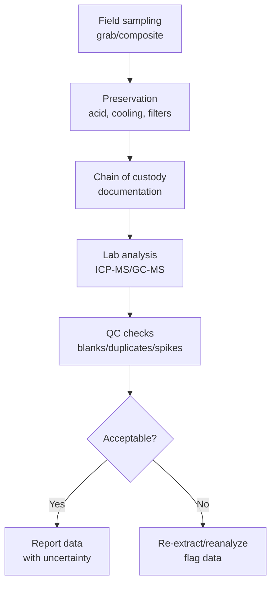
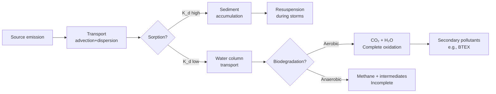
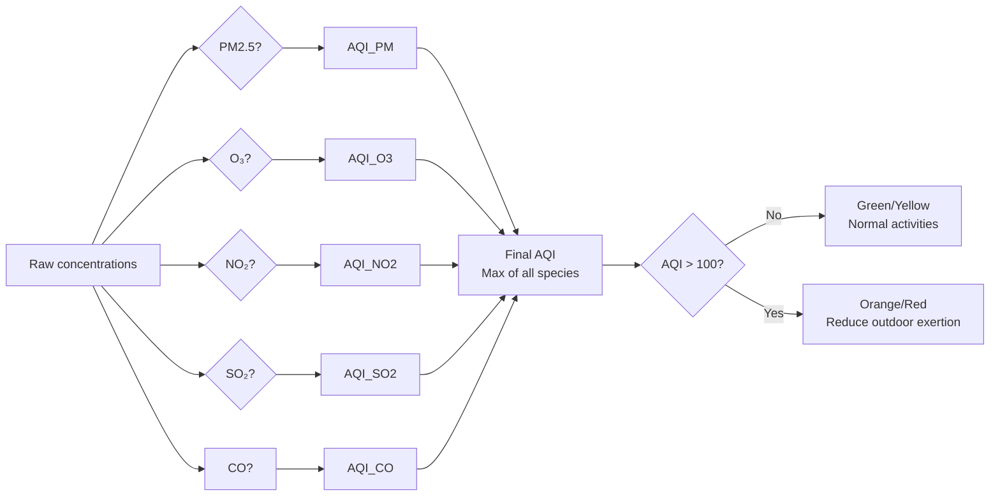
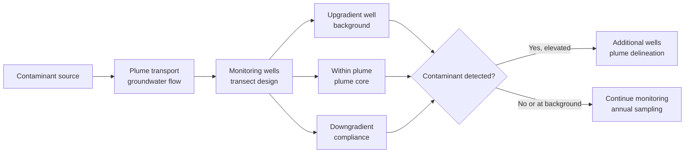
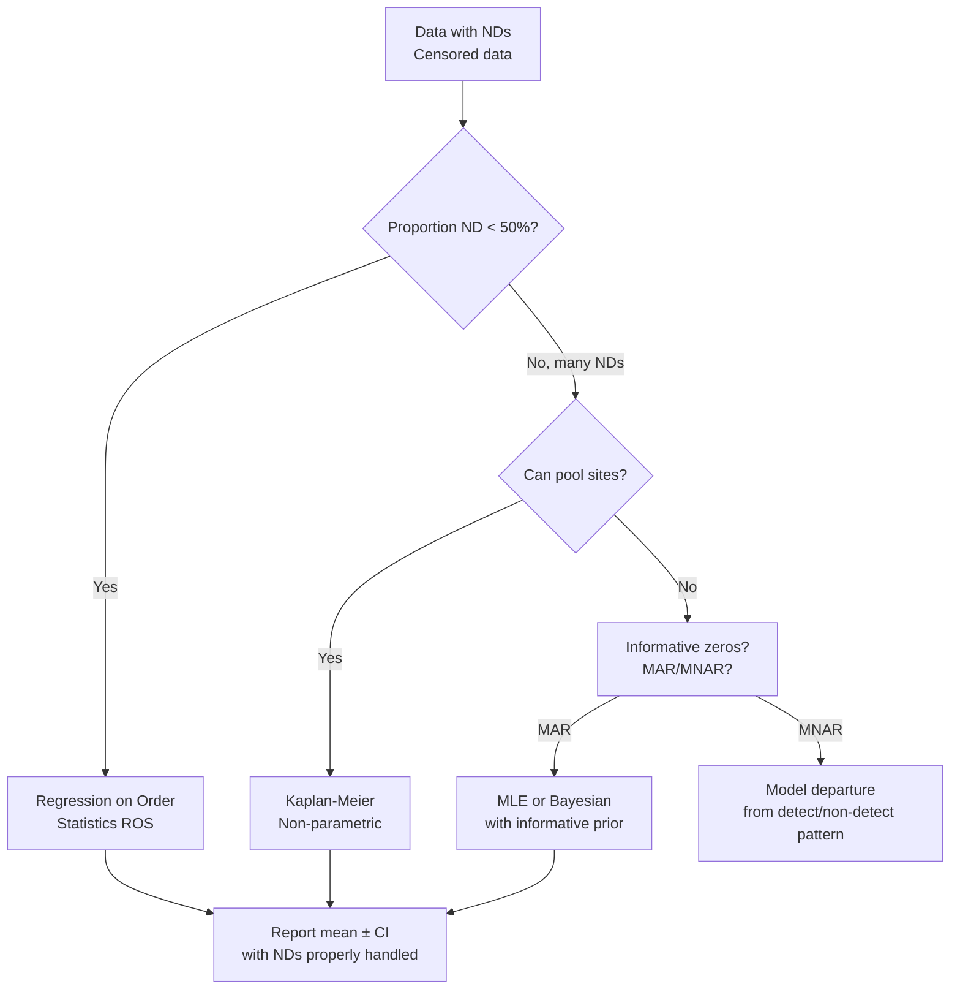

# 1.107 / Water and Air Quality Laboratory
**MIT CEE Environmental Track | Partial Lab | 6 Units | Spring (2026-27)**
**Prereq:** None
**Instructor:** Prof. H. Hemond (former), Prof. Kroll Group (MIT)
**自學路徑：Bachelor → Environmental Monitoring → MEng Research / Consulting / PE**

> **Source:** MIT Catalog 2024-25; Kroll Group MIT — "Laboratory and field techniques in environmental engineering and its application to the understanding of natural and engineered ecosystems. Exercises involve data collection and analysis covering a range of topics, spanning all major domains of the environment (air, water, soils, and sediments), and using a number of modern environmental analytical techniques. Instruction and practice in written and oral communication provided. Concludes with a student-designed final project, written up in the form of a scientific manuscript."
> **Also see:** MIT OCW 1.107 archives; Standard Methods for Examination of Water and Wastewater (APHA, 23rd ed.)

---

## 問題 1：這個領域所有專家共享的 5 個核心心智模型是什麼？

1. **環境測量從採樣到分析的每一步都有誤差**  
   Sampling bias, preservation artifacts, instrument drift, and interferences all add uncertainty. The total measurement uncertainty is the chain of custody from field to report.

2. **檢測限（MDL）和定量限（MDL）決定你能測量什麼**  
   IUPAC MDL = 3s/m where s = standard deviation of blank, m = slope of calibration curve. Below MDL, data is "non-detect" (censored) and requires special statistical treatment.

3. **現場測量 vs 實驗室分析的權衡**  
   In-situ sensors (DO, pH, conductivity): continuous, real-time, less precise. Lab analysis (ICP-MS, GC-MS): precise, specific, delayed.

4. **數據質量決定你能下什麼結論**  
   QA/QC: field blanks, duplicates, spikes, standard reference materials. Acceptable accuracy: ±10-15%; precision: CV < 10%.

5. **污染物命運由物理、化學和生物過程共同決定**  
   Advection, dispersion, sorption (K_d), transformation (biodegradation, hydrolysis, photolysis), bioaccumulation (BCF) — all interact.

---

## 問題 2：根本分歧

1. **優先污染物 vs 廣譜篩查**
   - Targeted: Analyze specific known compounds (EPA 524.2 for VOCs). Precise, validated.
   - Nontarget: Suspect screening, HRMS. Discover novel compounds.

2. **連續原位監測 vs 離散採樣**
   - Continuous: Captures diurnal variation, storm events.
   - Discrete: Lower cost, easier QC, but misses pulses.

3. **被動採樣 vs 主動採樣**
   - Passive:Integrative over time, low cost, no power needed (SPMD, POCIS).
   - Active:Grab samples, time-resolved, logistically demanding.

---

## 問題 3：深度問題

1. 設計一個地下水監測井網絡，以檢測含水層中的污染物羽（plume）。哪些因素決定井的深度和間距？
2. 什麼是「雙蒸餾空白 (method blank)」？它與「現場合併空白 (field blank)」和「設備空白 (equipment blank)」有何不同？為什麼每種都需要？
3. 計算 GC-MS 離子色譜峰的 MDL：空白測量 7 次，標準偏差 s = 2.3 counts，校正曲線斜率 m = 150 counts/(μg/L)。
4. 解釋為什麼 DO 測量中溫度和鹽度的校正如此重要。溫度對氧溶解度的影響是多少 (Clarke-Bleck 方程)？
5. 在土壤樣品中重金屬（如 Pb, As）的EPA 方法 SW-846 3050B 消解程序中，什麼是「王水消解Aqua Regia」的化學基礎？

---

# 核心心智模型深化（中英對照）

## 1. 水質參數測量 — Water Quality Measurement

### 1.1 Bilingual 概念對照
| English | 中英對照 | Method | 精度/範圍 |
|---|---|---|---|
| Dissolved oxygen DO | 溶解氧 | Electrode (Clark) / Winkler | ±0.1 mg/L |
| pH | pH值 | Glass electrode | ±0.02 units |
| Conductivity | 電導率 | 4-electrode cell | ±0.5% |
| Turbidity | 濁度 | Nephelometry (NTU) | ±2% |
| TDS | 總溶解固體 | Gravimetric/TDS meter | ±2% |

### 1.2 Key Derivation — DO Measurement and Temperature Correction
**Clark electrode principle:**
DO diffuses through membrane → electrons generated at cathode → current proportional to O₂ pressure

**DO saturation (Clarke-Bleck equation, 1980):**
ln C*_O2 = −139.34411 + (1.575701×10⁵/T) − (6.642308×10⁷/T²) + (1.243800×10¹⁰/T³) − (8.621949×10¹¹/T⁴)
+ S·{−0.017673 + (10.754/T) − (2140.7/T²)}

For freshwater at T=20°C, C*_O2 ≈ 9.09 mg/L
At T=30°C: C*_O2 ≈ 7.56 mg/L → 17% lower than at 20°C
**Temperature correction is essential** for accurate biological oxygen demand interpretation.

### 1.3 Engineering Applications
**Example — BOD interpretation:**
BOD₅ (5-day BOD) at T=20°C = 8.2 mg/L
DO depletion in river = 9.09 − 7.56 = 1.53 mg/L (after seeding correction)
This is moderate organic pollution; compare to EPA criteria: BOD₅ < 3 mg/L for warm water aquatic life.

## 2. 微量污染物分析 — Trace Contaminant Analysis

### 2.1 Bilingual 概念對照
| English | 中英對照 | Instrument | MDL |
|---|---|---|---|
| ICP-MS | 感應耦合等離子體質譜 | 10 ppt - ppm | 0.01-0.1 μg/L |
| GC-MS | 氣相色譜質譜 | Organic compounds | 0.1-1 μg/L |
| LC-MS/MS | 液相色譜串聯質譜 | Polar organics | 0.01-0.1 μg/L |
| IC | 離子色譜 | Anions/cations | 1-10 μg/L |
| UV-Vis | 紫外可見分光光度法 | NO₃⁻, PO₄³⁻ | 10-100 μg/L |

### 2.2 Key Derivation — Method Detection Limit (MDL)
**IUPAC definition (Currie, 1968, updated 1995):**
MDL = t_{n-1, 0.99} × s
where t = Student's t for n−1 DOF at 99% confidence

**Example — ICP-MS Pb analysis:**
Method blank replicates (n=7): concentrations = [0.12, 0.08, 0.15, 0.11, 0.09, 0.13, 0.10] μg/L
s = 0.024 μg/L
t_{6, 0.99} = 3.707
**MDL = 3.707 × 0.024 = 0.089 μg/L ≈ 0.09 μg/L**
Any sample with Pb < 0.09 μg/L is reported as "<MDL" (nondetect)
For drinking water EPA action level: Pb < 15 μg/L → MDL is well below the action level ✓

### 2.3 QA/QC Requirements (EPA):
| QC Check | Frequency | Acceptance Criteria |
|---|---|---|
| Calibration blank | Start/end of run | < MDL |
| Continuing calibration | Every 10 samples | ±20% of true |
| Laboratory duplicate | 1 per 20 samples | RPD < 20% |
| Matrix spike | 1 per 20 samples | 75-125% recovery |
| Laboratory control sample | 1 per 20 samples | 80-120% recovery |

## 3. 空氣質量測量 — Air Quality Measurement

### 3.1 Bilingual 概念對照
| English | 中英對照 | Method | Range |
|---|---|---|---|
| PM2.5 | 粒徑<2.5μm顆粒物 | Gravimetric/beta attenuation | 0-1000 μg/m³ |
| O₃ | 臭氧 | UV absorption (254 nm) | 0-500 ppb |
| NO₂ | 二氧化氮 | Chemiluminescence | 0-500 ppb |
| SO₂ | 二氧化硫 | UV fluorescence | 0-500 ppb |
| VOCs | 揮發性有機物 | GC-PID/FID | 0.5-100 ppb |

### 3.2 Key Derivation — Air Quality Index (AQI)
**EPA AQI calculation:**
AQI = [((I_Hi − I_Lo)/(BP_Hi − BP_Lo))] × (C_p − BP_Lo) + I_Lo
Where: C_p = pollutant concentration; BP_Hi, BP_Lo = breakpoints bracketing C_p; I_Hi, I_Lo = AQI values for breakpoints

**PM2.5 breakpoints (24-hr):**
| C_p (μg/m³) | AQI |
|---|---|
| 0-12.0 | 0-50 (Good) |
| 12.1-35.4 | 51-100 (Moderate) |
| 35.5-55.4 | 101-150 (Unhealthy for sensitive) |
| 55.5-150.4 | 151-200 (Unhealthy) |
| 150.5-250.4 | 201-300 (Very unhealthy) |

**Example:** PM2.5 = 78 μg/m³ → between 55.5 and 150.4 → AQI = [(150−101)/(150.4−55.5)]×(78−55.5) + 101 = (49/94.9)×22.5 + 101 = **112** (Unhealthy for Sensitive Groups)

## 4. 土壤和沉積物分析 — Soil and Sediment Analysis

### 4.1 Key Derivation — Sequential Extraction (Tessier et al.)
**Five-step procedure for metal partitioning:**
1. Exchangeable: MgCl₂ (pH 7) → bioavailable fraction
2. Bound to carbonates: NaOAc-HOAc (pH 5) → pH-sensitive
3. Bound to Fe-Mn oxides: NH₂OH·HCl → reducible fraction
4. Bound to organic matter: HNO₃ + H₂O₂ → oxidizable fraction
5. Residual: HF + HClO₄ → lithogenic fraction

**Risk assessment:**
Non-residual fractions (1-4) = "environmentally available" metals
Residual (5) = geogenic, low risk
For Pb in urban soil: fractions 2-4 may dominate, requiring remediation.

## 5. 數據質量評估 — Data Quality Assessment

### 5.1 Key Derivation — Censored Data Treatment
**Maximum likelihood estimation for nondetects:**
For left-censored data with detection limit DL:
Likelihood for each observation:
- Detected: L = f(C_i | μ, σ)
- Non-detect: L = F(DL | μ, σ) [cumulative distribution at DL]

**Helsel & Cohn (1988) — Cohen's method (simple substitution):**
Replace nondetects with DL/√2 (approximately unbiased for normal data)
More accurate: ROS (Regression on Order Statistics) using detected values to model distribution

**Example — TCE in groundwater:**
n=20 samples: 7 detected (mean=12.3 μg/L), 13 nondetects (DL=5 μg/L)
Cohen's corrected estimate: x̄* = (7×12.3 + 13×5/√2)/20 = (86.1 + 46.0)/20 = **6.6 μg/L**
ROS MLE estimate: ~7.1 μg/L (more accurate, uses detected distribution shape)

# 深度自測問題詳解（中英對照）

## 詳解 1: MDL 計算
**Q:** 計算 UV-Vis 硝酸鹽測定法的 MDL。7 個空白測量值（mg/L）：[0.02, 0.01, 0.03, 0.02, 0.01, 0.02, 0.01]，校正斜率 m=0.015 Abs/(mg/L)。
**A:** 
s = std([0.02, 0.01, 0.03, 0.02, 0.01, 0.02, 0.01]) = √[Σ(x_i−x̄)²/(n−1)]
x̄ = (0.02+0.01+0.03+0.02+0.01+0.02+0.01)/7 = 0.12/7 = 0.017 mg/L
Σ(x_i−x̄)² = (0.003)²+(−0.007)²+(0.013)²+(0.003)²+(−0.007)²+(0.003)²+(−0.007)² = 0.000009+0.000049+0.000169+0.000009+0.000049+0.000009+0.000049 = 0.000343
s = √(0.000343/6) = √0.0000572 = **0.0076 mg/L**
MDL = t_{6, 0.99} × s = 3.707 × 0.0076 = **0.028 mg/L ≈ 28 μg/L**
結論：該方法不能可靠檢測低於 28 μg/L 的硝酸鹽。對於飲用水標準（10 mg/L），需要更靈敏的方法（如離子色譜，MDL≈1 μg/L）。

## 詳解 2: DO 溫度校正
**Q:** 水樣在 25°C 時測量 DO = 7.0 mg/L。在 20°C 標準條件下，這相當於多少 DO%？是否低於 EPA 5 mg/L 標準？
**A:** 
C*_O2(25°C, freshwater) ≈ 8.3 mg/L (from tables)
C*_O2(20°C, freshwater) ≈ 9.09 mg/L
DO% = 7.0/8.3 × 100% = **84%** (低於飽和，正常水質)
相對於 20°C 標準：7.0/9.09 × 100% = **77%** 等效於 20°C
7.0 > 5.0 mg/L → **滿足 EPA 5 mg/L 標準** ✓
但接近魚類stress閾值（4-5 mg/L，對冷水魚），需要考慮溫度和魚類種類。

## 詳解 3: GC-MS 峰識別
**Q:** 一個廢水樣品的 GC-MS 色譜中，保留時間 RT=8.23 分鐘的峰，質譜顯示主要離子 m/z=62, 91, 127。如何識別這個化合物？
**A:** 
1. **NIST/Wiley 質譜庫搜索**：與已知化合物質譜比對
2. **特徵離子分析**：
   - m/z 62 → CH₃CH₂Cl（氯乙烷的特征離子，Cl 同位素模式 A+2=33%）
   - m/z 91 → C₇H₇⁺（甲苯的特征離子，可能側鏿Cl-CH₂-CH₂-）
   - m/z 127 → Cl₃⁺（三氯甲烷的特征離子）
3. **保留指數 (Kovats RI)**：計算與同系列正構烷烴的 RI 比對
4. **結論**：可能是 **1,1,1-三氯乙烷 (TCA, CCl₃CH₃)**，廢水常見溶劑污染物
5. **驗證**：使用標準品運行相同條件，確認 RT 和質譜完全匹配

## 詳解 4: AQI 計算
**Q:** 計算 O₃ = 85 ppb（8-hr 平均）的 AQI。
**A:** 
使用 EPA AQI 計算器：
O₃ (8-hr) 轉換為 AQI：
BP_Hi = 100 ppb → AQI_Hi = 100
BP_Lo = 70 ppb → AQI_Lo = 51
AQI = [(100−51)/(100−70)] × (85−70) + 51 = (49/30)×15 + 51 = 1.633×15 + 51 = 24.5 + 51 = **75.5 ≈ 76** (Moderate)
**公眾健康建議：**Air quality is acceptable; there may be a risk for unusually sensitive people.

## 詳解 5: 離散採樣 vs 連續監測
**Q:** 在一條受污染河流中，連續 DO 監測顯示 DO 在夜間 2:00-4:00 AM 降至 2 mg/L，但白天 10:00 AM 採樣顯示 DO = 7 mg/L。為什麼離散採樣會完全錯過這個低氧事件？設計一個更好的監測方案。
**A:** 
問題：
- 夜間無光合作用，而呼吸持續 → DO 最低點在黎明前
- 白天光合作用產生 O₂ → DO 恢復
- 離散白天採樣完全錯過了危機

更好的監測方案：
1. **原位 DO 記錄儀**：部署在河底，連續記錄（如 HOBO U26-001）
2. **自動採樣器**：在低 DO 時段（如 3:00 AM）自動觸發採樣
3. **預程序控制器**：在特定 DO 閾值以下（如 3 mg/L）觸發採樣
4. **Storm event 觸發**：降雨後 2 小時內採樣
5. **頻率**：連續記錄 + 每月手動驗證採樣（QA/QC）

---

## 📊 Diagram 1: QA/QC Framework

## 📊 Diagram 2: Contaminant Fate

## 📊 Diagram 3: AQI Dashboard

## 📊 Diagram 4: Sampling Network Design

## 📊 Diagram 5: Censored Data Treatment

---

## 總結

1. **MDL 是測量能力的邊界** — MDL = t·s/√n，必須低於法規限值才能聲明合規
2. **QA/QC 是數據可靠性的保障** — 空白、重複、基質加標、標準品回收共同確保數據質量
3. **離散採樣會錯過重要事件** — DO 最低點在黎明前；污染物峰值在暴雨期間
4. **AQI 連接測量與公眾健康** — AQI 是空氣質量最直接的公眾溝通工具
5. **非檢出數據需要特殊統計處理** — ROS 方法比簡單替換（DL/√2）更準確

**自學建議** — Pair with: Standard Methods (APHA 23rd ed.) + EPA QA/G-4 guidance + R NADA package.  
**Prerequisite chain:** 1.061A → 1.106 → 1.107
