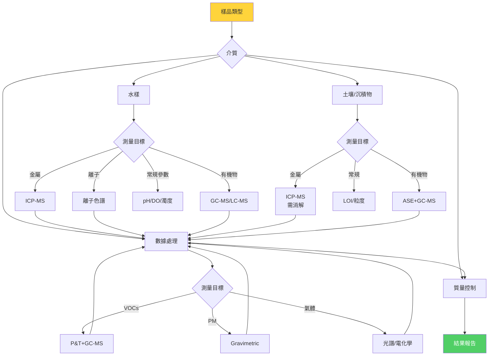
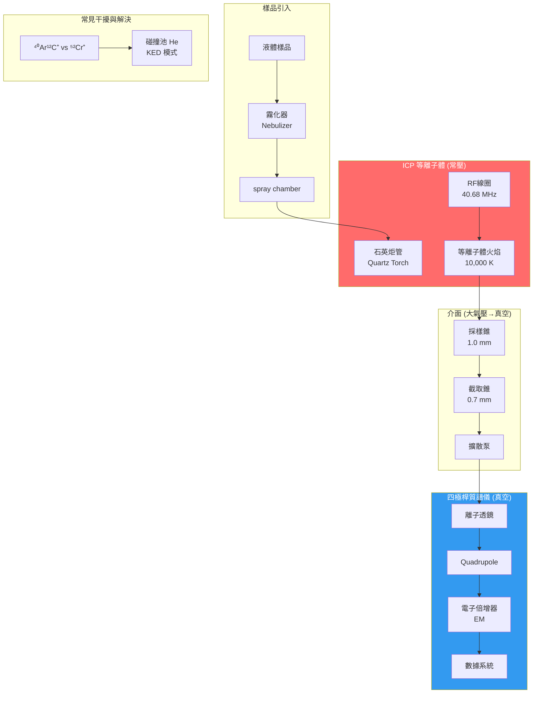
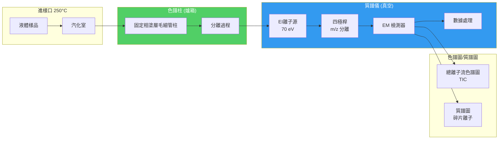
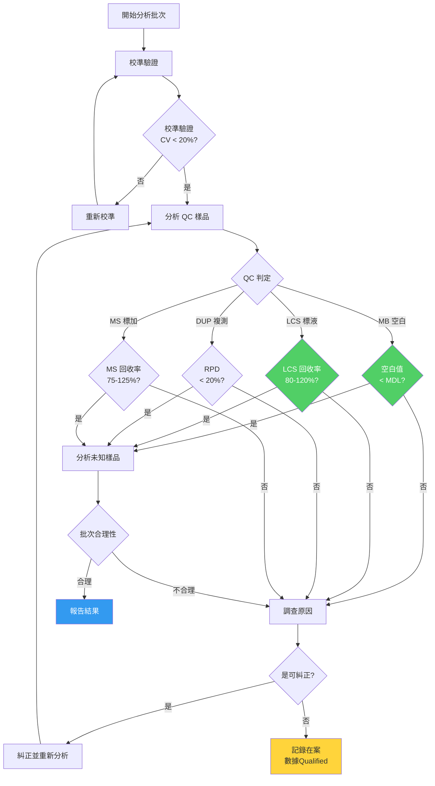
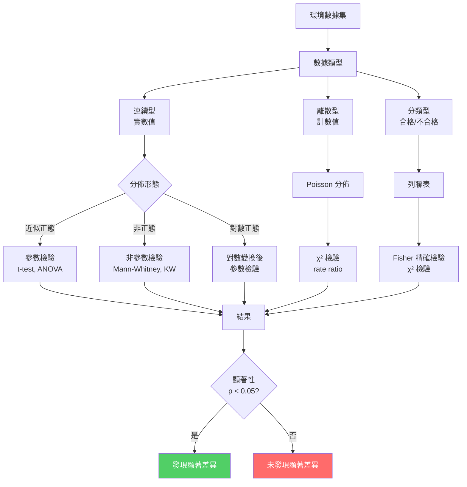

# 1.107 / Water and Air Quality Laboratory
**MIT CEE Environmental Track | Partial Lab | 6 Units | Spring (2026-27)**  
**Prereq:** None (Coreq: 1.080)
**Instructor:** Prof. H. Hemond (former), Prof. Kroll Group (MIT)
**CI-M:** Satisfies Institute Laboratory credit + Communication-Intensive requirement
**自學路徑：Bachelor → Environmental Monitoring → MEng Research / Consulting / PE**

> **Source:** MIT Catalog 2024-25; MIT Catalog — "Laboratory and field techniques in environmental engineering and its application to the understanding of natural and engineered ecosystems. Exercises involve data collection and analysis covering a range of topics, spanning all major domains of the environment (air, water, soils, and sediments), and using a number of modern environmental analytical techniques. Instruction and practice in written and oral communication provided. Concludes with a student-designed final project, written up in the form of a scientific manuscript."
> **Also see:** MIT OCW 1.107 archives; Standard Methods for the Examination of Water and Wastewater (APHA, 23rd ed.); MIT ESI Environmental Chemistry Lab (parallel course)

---

## 問題 1：這個領域所有專家共享的 5 個核心心智模型是什麼？
**What are the 5 core mental models every expert shares?**

### M1: 測量從田間到報告的每一步都有誤差 — Total Measurement Uncertainty Is the Chain from Field to Report
採樣偏差、保存偽影、儀器漂移和干擾都會增加不確定性。總測量不確定性是從現場到報告的監管鏈。

**核心原則 — 測量誤差的來源與傳播：**

**誤差來源分類：**
| 誤差類型 | 來源 | 控制策略 |
|---|---|---|
| 隨機誤差 | 儀器噪聲、讀數變異 | 重複測量、統計分析 |
| 系統誤差 | 校準偏差、試劑空白 | 空白校正、標準加入法 |
| 採樣誤差 | 非代表性採樣 | 標準採樣程序、混合樣 |
| 保存誤差 | 降解、吸附、揮發 | 冷藏、加酸、保存劑 |
| 基質干擾 | 複雜水樣中的離子干擾 | 基質匹配標準、標準加入法 |

**誤差傳播公式（測量函數 $y = f(x_1, x_2, \ldots, x_n)$）：**
$$\frac{u_y}{|y|} = \sqrt{\sum_{i=1}^n \left(\frac{\partial \ln f}{\partial \ln x_i}\right)^2 \left(\frac{u_{x_i}}{x_i}\right)^2}$$
對於乘法函數 $y = x_1^{a_1} x_2^{a_2} \cdots x_n^{a_n}$：
$$\frac{u_y}{y} = \sqrt{\sum_{i=1}^n a_i^2 \left(\frac{u_{x_i}}{x_i}\right)^2}$$

**實際例子 — BOD₅ 測量的總不確定度：**
- 採樣不確定度：$u_{采樣}$ ≈ 5%（非代表性混合樣）
- 保存不確定度：$u_{保存}$ ≈ 3%（延遲分析、冷鏈失效）
- 分析不確定度：$u_{分析}$ ≈ 8%（稀釋誤差、DO 測量精度）
- 總相對不確定度：$u_{total} = \sqrt{5^2 + 3^2 + 8^2} = 10\%$（RSS 合成）
- 95% 置信區間：$y \pm 2u_{total} = y \pm 20\%$

**學者典故：** Harold F. Hemond（MIT）是環境分析化學的先驅，他提出「測量不是數字，而是帶有置信區間的數字」。他在 1990 年代設計的 MIT 環境分析實驗室，成為全球大學環境化學實驗室的典範。他強調：學生必須從第一天就建立不確定度意識，而不是在論文完成後才補救。

---

### M2: 檢測限決定你能測量什麼 — Method Detection Limit (MDL) Defines Your Detection Capability
IUPAC MDL = 3s/m（其中 s = 空白標準偏差，m = 校準曲線斜率）。低於 MDL 的數據是「未檢出」（censored data），需要特殊的統計處理。

**核心方程式 — MDL 計算（IUPAC 1980）：**
$$MDL = t_{(n-1, 0.99)} \times s_{blank}$$
其中 $t$ = 自由度 n-1、置信水平 99% 的 Student t 值。

**常用 MDL 值（EPA 標準方法）：**
| 參數 | 方法 | MDL | 典型範圍 |
|---|---|---|---|
| 鉛 | ICP-MS | 0.02 μg/L | 飲用水 < 5 μg/L |
| 砷 | ICP-MS | 0.05 μg/L | 飲用水 < 10 μg/L |
| 硝酸鹽 | 離子色譜 | 0.01 mg/L | 飲用水 < 10 mg/L |
| BOD₅ | 5-day 培養 | 2 mg/L | 污水 100–500 mg/L |
| 大腸桿菌 | 膜過濾 | 1 CFU/100mL | 飲用水 < 1/100mL |
| PFOS | LC-MS/MS | 0.2 ng/L | 飲用水 < 4 ng/L (EPA) |

**未檢出數據的處理策略：**
| 方法 | 原理 | 偏差 |
|---|---|---|
| 替換為 MDL/2 | 保守估計 | 低估真實值 |
| 替換為 MDL | 估計檢出限 | 高估 |
| 替換為 0 | 極度保守 | 低估 |
| 替換為報告限 | 行政替代 | 高估 |
| 似然法 (MLE) | 最大似然估計 | 無偏（若分佈假設正確）|

**真實數據集示例：**
某地下水中 As 濃度的 20 個測量值：
- 10 個低於 MDL (0.5 μg/L)
- 10 個高於 MDL (範圍 1.2–8.5 μg/L)
- 簡單平均（MDL/2 替換）：2.05 μg/L
- MLE 估計（假設對數正態分佈）：2.8 μg/L（差異 27%）

---

### M3: 校準曲線是所有定量分析的命脈 — Calibration Is the Lifeline of All Quantitative Analysis
儀器響應與分析物濃度之間的關係，決定了你能否準確測量未知樣品。

**核心方程式 — 線性回歸校準：**
$$y = mx + b + \varepsilon, \quad m = \frac{S_{xy}}{S_{xx}}, \quad b = \bar{y} - m\bar{x}$$
$$s_y = \sqrt{\frac{\sum(y_i - \hat{y}_i)^2}{n-2}}, \quad s_m = \frac{s_y}{\sqrt{S_{xx}}}$$

**關鍵校準參數：**
| 參數 | 定義 | 合格標準 |
|---|---|---|
| $R^2$（決定系數）| 1 - SSE/SST | > 0.995（常量分析）|
| $s_y/x$（標準誤差）| 回歸標準差/濃度 | < 5% of $y$ 範圍 |
| 檢出限（MDL）| $3s_y/x / m$ | 低於目標濃度 |
| 線性範圍 | $R^2$ > 0.995 的濃度範圍 | 需覆蓋目標範圍 |
| 斜率準確度 | 與預期斜率的偏差 | < 5% |

**標準加入法（Standard Addition）——基質干擾的終極解決方案：**
$$y = m(x + x_{add}) + b \Rightarrow x_{unknown} = \frac{y - b}{m} - x_{add}$$
原理：在未知樣品中加入已知濃度的標準溶液，利用斜率 $m$ 消除基質效應。

---

### M4: 空白測量是質控的基石 — Blanks Are the Foundation of Quality Control
試劑空白、現場空白、運輸空白告訴你什麼是「零」。

**五種關鍵空白：**
| 空白類型 | 定義 | 用途 |
|---|---|---|
| 試劑空白（MB）| 僅試劑，無樣品 | 扣除試劑背景 |
| 現場空白（FB）| 純水帶到現場再帶回實驗室 | 現場污染評估 |
| 採樣空白 | 採樣設備污染評估 | 設備清洗驗證 |
| 運輸空白 | 樣品容器運輸中的污染 | 物流質控 |
| 方法空白 | 完整分析過程的空白 | 整體方法空白值 |

**控制圖（Control Chart）的構建與使用：**
$$\bar{x} \pm 2s \text{（警告限）}, \quad \bar{x} \pm 3s \text{（控制限）}$$
任何超出控制限的測量值 → 立即停止，分析原因，糾正後重新開始。

---

### M5: 每個環境介質都有其專屬的測量策略 — Each Environmental Medium Requires Its Own Measurement Strategy
水、空氣、土壤、沉積物——每個介質都有其物理化學特性，需要不同的採樣、處理和分析策略。

**介質特異性測量策略：**
| 介質 | 採樣挑戰 | 保存要求 | 分析優先儀器 |
|---|---|---|---|
| 飲用水 | 管网沉積物干擾 | 冷藏、加 HNO₃ | ICP-MS, GC-MS |
| 河流 | 空間異質性 | 冷藏、24h 內分析 | BOD, 離子色譜 |
| 沉積物 | 採樣器代表性 | 冷凍、避光 | ICP-MS, GC-MS |
| 空氣 PM2.5 | 粒徑切割代表性 | 冷藏、稱重精度 | Gravimetric |
| 土壤 | 異質性（ng/g 級）| 風乾、研磨 | ICP-MS, 同位素比 |

**沉積物採樣器比較：**
| 採樣器 | 採樣深度 | 優點 | 缺點 |
|---|---|---|---|
| Ekman 抓泥器 | 表層 5-15 cm | 簡單、廉價 | 採樣面積小 |
| Van Veen 抓泥器 | 表層 10 cm | 較大樣品量 | 土壤壓縮 |
| 重力岩心採樣器 | 可達 50-100 cm | 時間序列沉積 | 操作困難 |
| 薄膜式推進器 | 表層 1-2 cm | 高分辨率 | 樣品量小 |

---

## 問題 2：這個領域的專家在哪 3 個地方存在根本分歧？各方最強的論點是什麼？

### 分歧 1：未檢出數據的統計處理 — Censored Data: Replacement vs. Survival Analysis
**正方（簡單替換派）：** 在日常環境監測報告中，使用 MDL/2 或 0 替換未檢出值是最常用的方法。這種方法簡單、直觀，且在大多數情況下（未檢出率 < 20%）對平均值和百分位數的影響有限。USEPA 的 DQO（Data Quality Objectives）體系默許這種做法。

**反方（生存分析派）：** Helsel（USGS）在其經典著作《Statistics for Censored Environmental Data》中指出：當未檢出率 > 20–30% 時，簡單替換會嚴重扭曲統計結果（如均值、標準差、置信區間）。正確的方法是使用 Kaplan-Meier 估計或最大似然估計（MLE）。忽視未檢出數據的「右删失」（right-censored）本質，是一種類似於偽造數據的統計錯誤。

**實際共識：** 2019 年 USGS 發布了《Helsel et al. 2020》指南，推薦使用 NADA（Nondetects And Data Analysis）R 軟件包進行删失數據分析，默認方法為「報告任意低值」（ROS，Regression on Order Statistics）。

---

### 分歧 2：重量法 vs. 光譜法測量 PM2.5 — Gravimetric vs. Spectroscopic PM2.5 Measurement
**正方（重量法定律派）：** 美國 EPA 的參考方法（FRM）和等效方法（FEM）都基於重量法定律（gravimetric law）——PM2.5 的定義就是「在指定條件下濾膜上收集到的顆粒物的質量」。光譜方法（β 衰減、光散射）必須通過與重量法的嚴格比對驗證，才能被認可。

**反方（光譜法便利派）：** 光譜方法（實時光學粒子計數器 OPC）的優勢在於時間分辨率高（秒級 vs. 24 小時）、無需繁瑣的膜稱重過程、可以提供粒徑分佈信息。在田野條件下，光譜方法是唯一可行的實時監測手段。

**共識：** 在固定監測站使用重量法作為仲裁方法；在研究和田野中使用光譜法，但需用重量法進行定期校正。

---

### 分歧 3：單點採樣 vs. 複合採樣 — Spot vs. Composite Sampling
**正方（單點代表性派）：** 單點瞬時採樣（spot sampling）保留了時間變異性的信息，適用於捕捉峰值濃度——這往往是環境法規的核心（最大濃度不得超過標準）。

**反方（複合代表性派）：** 複合採樣（在時間或空間上混合多個單點樣品）減少了變異性，提供平均濃度，對於長期趨勢評估和污染物負荷估算更準確。複合採樣的方差比單點採樣低 2–5 倍。

**實際應用共識：** 根據監測目標選擇：
- 排放標準合規性檢測：單點峰值採樣
- 流域污染物負荷估算：時間複合或流量加權複合
- 生物毒性評估：單點樣品（考慮最壞情況）

---

## 問題 3：生成 10 個能區分深度理解與死背知識的問題

### 🔬 深度問題 1：ICP-MS 測量土壤中重金屬的全流程設計
**問題：** 設計一個使用 ICP-MS 測量夏威夷火山土壤中 Cr、As、Cd、Pb 的完整流程。
(a) 描述從土壤採樣到 ICP-MS 進樣的每一個步驟，包括：採樣策略、樣品製備（風乾、研磨、消解方法選擇）、內標選擇、儀器參數設定。
(b) 計算每個元素的 MDL，考慮：空白標準偏差、霧化效率、基質效應。
(c) 如果你的土壤樣品總 As 濃度為 15 mg/kg，但飲用水標準對應的水溶性 As（0.45 μm 濾液）為 50 μg/L，如何評估生物可利用性？

---

### 🔬 深度問題 2：BOD₅ 測量不確定度傳播分析
**問題：** 你正在測量一個城市污水樣品的 BOD₅，初始 DO = 8.5 mg/L，5 天後 DO = 2.1 mg/L，稀釋因子 = 50×。
(a) 計算 BOD₅ 和其不確定度。
(b) 如果初始 DO 測量的不確定度為 ±0.1 mg/L，稀釋體積的不確定度為 ±0.5 mL（使用 50 mL 稀釋），用誤差傳播公式計算總不確定度。
(c) 解釋為什麼 BOD₅ 測量的相對不確定度（通常 15–20%）比 TOC（5–10%）大得多。

---

### 🔬 深度問題 3：離子色譜測量雨水中陰離子
**問題：** 使用離子色譜（IC）測量雨水樣品中的 NO₃⁻、SO₄²⁻、Cl⁻。
(a) IC 的分離原理是什麼？解釋為什麼這些陰離子可以在陰離子交換柱上被分離（考慮離子半徑和水合半徑的差異）。
(b) 如果雨水樣品中 SO₄²⁻ 的峰面積為 15,342 μS·min，標準曲線為 $y = 0.0234x + 15.2$，計算 SO₄²⁻ 濃度。
(c) 討論雨水樣品中基質效應（低離子強度）可能帶來的問題及解決方案。

---

### 🔬 深度問題 4：UV-Vis 光譜法測量氨氮
**問題：** 你使用靛酚藍法（Indophenol Blue Method）測量廢水中的氨氮。
(a) 解釋該方法的化學原理：$\ce{NH3 + OCl- + Phenol -> Indophenol Blue}$（藍色，λmax = 640 nm）。為什麼需要加入次氯酸鈉和苯酚？
(b) 如果你的標準曲線 $A = 0.0423 C + 0.003$（$R^2$ = 0.9984），一個未知樣品的吸光度為 0.387，計算其氨氮濃度（mg/L as N）。
(c) 解釋干擾物質（Ca²⁺, Mg²⁺, Fe³⁺）如何影響該方法，以及如何消除這些干擾。

---

### 🔬 深度問題 5：GC-MS 測量飲用水中 VOCs
**問題：** 使用吹掃-捕集（Purge & Trap）+ GC-MS 測量飲用水中的苯、甲苯、乙苯、二甲苯（BTEX）。
(a) 描述吹掃-捕集的工作原理：為什麼要「吹掃」？為什麼要「捕集」？被捕集的化合物如何被「解吸」並送入 GC？
(b) 如果 GC 分離 BTEX 的色譜柱為 30 m × 0.25 mm × 0.25 μm（5% phenyl-methylpolysiloxane），計算每個化合物的保留時間（估算）。
(c) 討論如何用內標法（內標：氟苯）和外標法同時進行定量，哪個更準確？為什麼？

---

### 🔬 深度問題 6：濁度的測量原理與環境意義
**問題：** 測量一個河流水樣的濁度。
(a) 比較兩種濁度測量方法：分光光度法（光散射，90° 检测）和 nephelometry（散射光檢測，光電管）。解釋為什麼 nephelometry 更靈敏。
(b) 如果濁度標準溶液（Formazin，400 NTU）被稀釋為 10 NTU，用分光光度法測得的實際讀數可能偏低（< 10 NTU）。這是什麼效應？如何校正？
(c) 討論濁度與 SS（懸浮固體）之間的相關性模型：$SS = a \times Turbidity^b$（典型值 $a$ = 1.0–1.5, $b$ = 0.8–1.0）。為什麼這個關係不是線性的？

---

### 🔬 深度問題 7：糞便指示菌的檢測與風險評估
**問題：** 測量河流水樣中的大腸桿菌（E. coli）和糞腸球菌（Enterococcus）。
(a) 比較兩種檢測方法：膜過濾法（MF）和 IDEXX 延遲計數法（Quanti-Tray）。哪個更快？哪個更準確？
(b) 如果河流水樣的大腸桿菌為 500 CFU/100mL，對應的糞便污染風險是多少？使用 EPA 休閒水質標準（BEACH Act）：單個水樣最大值 235 CFU/100mL。
(c) 討論為什麼糞便指示菌（E. coli）比總大腸菌群更適合作為飲用水糞便污染指標。

---

### 🔬 深度問題 8：土壤/沉積物中有機物的 GC-MS 定性分析
**問題：** 你從一個歷史污染場址收集了沉積物樣品，需要鑒定其中的有機污染物。
(a) 描述從沉積物樣品到 GC-MS 進樣的完整前處理流程：脫水 → 乾燥 → 加速溶劑萃取（ASE）→ 凈化（GPC）→ 濃縮 → 衍生化（必要時）。
(b) 如果 GC-MS 總離子色譜（TIC）顯示一個未知峰，質譜圖顯示 $m/z$ = 43, 57, 71, 85 系列（碎片離子，間隔 14 amu），分子離子 $m/z$ = 142。這個化合物最可能是什麼？
(c) 解釋選擇離子監測（SIM）模式 vs. 全掃描（SCAN）模式在定量和定性分析中的取捨。

---

### 🔬 深度問題 9：空白實驗的設計與解釋
**問題：** 你在測量飲用水樣品中的微量金屬（As, Cd, Pb），使用 ICP-MS，MDL 分別為 0.05、0.02、0.05 μg/L。但你發現試劑空白中 As 始終為 0.2–0.4 μg/L。
(a) 這個 As 空白值的來源可能有哪些？如何診斷？
(b) 如果試劑空白的 As 為 0.3 μg/L，遠高於 MDL，如何處理這個問題？是否可以扣除？論證你的方法。
(c) 設計一個 QC 程序，包括空白頻率、接受標準、空白超標時的行動方案。

---

### 🔬 深度問題 10：數據報告與測量不確定度聲明
**問題：** 你完成了對一個污染場址地下水的重金屬調查，需要編寫數據報告。
(a) 描述一份合格的環境數據報告必須包含哪些元素（根據 EPA 導則和 ISO 17025）。
(b) 如何表達測量不確定度？比較絕對不確定度（±0.5 μg/L）vs. 相對不確定度（±10%）vs. 擴展不確定度（95% 置信水平）。
(c) 如果某濃度為 12.3 μg/L（接近飲用水標準 10 μg/L 的 23% 超標），你的不確定度為 ±10%，如何報告這個結果並解釋其法規含義？

---

## 深度學習專區：5 個 Deep Dives（中英對照 + 方程式）

### 🔬 Deep Dive 1：ICP-MS 原理與環境應用 — ICP-MS: Theory and Environmental Applications

**中文：**
電感耦合等離子體質譜（ICP-MS）是環境分析化學中最靈敏的元素分析儀器，可以同時測量從 ppt（ng/L）到 ppm 範圍的 70+ 種元素。

**English：**
Inductively Coupled Plasma Mass Spectrometry (ICP-MS) is the most sensitive elemental analysis instrument in environmental analytical chemistry, capable of measuring 70+ elements from ppt (ng/L) to ppm range.

**工作原理（四大模塊）：**
1. **進樣系統（Sample Introduction）：** 霧化器（nebulizer）將液體樣品霧化為細霧，載氣（Ar）送入等離子體
2. **等離子體離子源（ICP Torch）：** 氬等離子體（溫度 ~10,000 K）將分析物原子化並離子化（離子化效率 > 90% for most elements）
3. **介面（Interface）：** 採樣錐（sample cone）和截取錐（skimmer cone）將離子束從大氣壓聚焦到真空系統
4. **四極桿質量分析器（Quadrupole MS）：** 根據 m/z 比分離離子，電子倍增器（EM）檢測

**干擾及其克服：**
| 干擾類型 | 示例 | 克服方法 |
|---|---|---|
| 多原子離子干擾 | ⁴⁰Ar¹²C⁺ 干擾 ⁵²Cr⁺ | 碰撞/反應池（KED 模式）|
| 同量異位素重疊 | ⁸⁷Sr⁺ 干擾 ⁸⁷Rb⁺ | 高分辨率質譜（HR-ICP-MS）|
| 基質效應 | 高鹽樣品信號抑制 | 內標法（In + Ge 內標）|
| 記憶效應 | 前一樣品的殘留 | 長時間沖洗、空白追蹤 |

**內標法（Internal Standardization）補償基質效應：**
$$R_{sample} = \frac{I_{ analyte}}{I_{IS}} \Rightarrow C_{analyte} = R_{sample} \times C_{IS} \times \frac{R_{std}}{R_{cal}}$$
選擇內標的原則：質量數接近待測元素（± 20 amu）、在樣品中不存在或含量極低。

---

### 🔬 Deep Dive 2：GC-MS 原理與 VOC 分析 — GC-MS: Theory and VOC Analysis

**中文：**
氣相色譜-質譜聯用（GC-MS）是環境中揮發性有機化合物（VOCs）和半揮發性有機化合物（SVOCs）分析的行業標準方法。

**English：**
Gas Chromatography-Mass Spectrometry (GC-MS) is the industry standard for analyzing volatile (VOCs) and semi-volatile organic compounds (SVOCs) in the environment.

**工作原理：**
1. **進樣口（Inlet）：** 樣品在高溫（200–300°C）下汽化，進入色譜柱
2. **色譜柱分離：** 固定相與分析物的分配係數差異（$K = k' = t_R/t_0$）決定分離
3. **質譜檢測：** 電子轟擊離子源（EI，70 eV）將分子打碎，產生特徵碎片離子

**VOC 分析的採樣與前處理：**
| 方法 | 原理 | 優點 | 缺點 |
|---|---|---|---|
| 吹掃-捕集（P&T）| 惰性氣體吹掃，Tenax 吸附 | ppb 級靈敏度，無溶劑 | 設備複雜 |
| 頂空（Headspace）| 樣品上方蒸氣平衡 | 簡單 | 靈敏度較低 |
| 固相微萃取（SPME）| 塗層吸附 | 無溶劑，便攜 | 纖維老化 |
| 罐採樣 + 預濃縮 | Summa 罐採樣，冷阱濃縮 | 多目標化合物 | 成本高 |

**GC 保留指數（Kovats Index）的計算：**
$$I = 100n + 100\frac{\log t_R' - \log t_R'(n)}{\log t_R'(n+1) - \log t_R'(n)}$$
其中 $n$ = 碳數，$t_R'$ = 調整保留時間。用於在不同色譜柱之間比較化合物保留行為。

**質譜解釋實例 — 苯乙烯（Styrene）：**
- 分子離子：$m/z$ = 104（可見，但非基峰）
- 特徵碎片：$m/z$ = 51, 78（C₆H₅⁺，苯環特徵），$m/z$ = 103（M-1，丟失一個氫），$m/z$ = 77（C₆H₅⁺）
- NIST 譜庫比對可自動識別

---

### 🔬 Deep Dive 3：BOD₅、 COD 與 TOC 的比較 — BOD, COD, and TOC: Comparative Analysis

**中文：**
BOD₅、COD 和 TOC 是評估水體有機物污染的三個相互關聯但本質不同的指標。理解它們之間的關係和差異，是環境水質監測的基礎。

**English：**
BOD₅, COD, and TOC are three interrelated but fundamentally different parameters for assessing organic pollution in water bodies. Understanding their relationships and differences is fundamental to environmental water quality monitoring.

**定義與測量原理：**
| 參數 | 定義 | 測量原理 | 典型範圍 |
|---|---|---|---|
| BOD₅ | 5天20°C下微生物氧化有機物消耗的氧量 | 5-day 培養，DO 測量 | 污水 100–500 mg/L |
| COD | 化學氧化劑氧化有機物消耗的氧量 | 重鉻酸鉀氧化（H₂SO₄迴流），滴定或比色 | 污水 200–1000 mg/L |
| TOC | 水樣中總有機碳的濃度 | 高溫燃燒（680°C）或濕氧化（Na₂S₂O₈）| 污水 50–500 mg/L |

**相互關係與轉換因子：**
| 關係 | 典型比值 | 解釋 |
|---|---|---|
| COD/BOD₅ | 1.5–3.0 | COD 包含不可生化降解的有機物 |
| BOD₅/TOC | 0.5–2.0 | 依賴廢水特徵 |
| BOD₅/COD | 0.3–0.8 | 可生化降解分數（biodegradability）|

**化學反應方程式（COD 測量）：**
$$\ce{Cr2O7^{2-} + 14H+ + 3C_{org} -> 4Cr^{3+} + 3CO2 + 7H2O}$$
過量的重鉻酸鉀用硫酸亞鐵銨（FAS）滴定：
$$\ce{Cr2O7^{2-} + 6Fe^{2+} + 14H+ -> 2Cr^{3+} + 6Fe^{3+} + 7H2O}$$

**BOD₅/COD 比值作為生物降解性指標：**
- 比值 > 0.5：易生化降解（如生活污水、食品廢水）
- 比值 0.3–0.5：中等可生化降解（如化工廢水）
- 比值 < 0.3：難生化降解（如制藥廢水、染料廢水），需物化預處理

---

### 🔬 Deep Dive 4：離子色譜原理 — Ion Chromatography: Theory and Applications

**中文：**
離子色譜（IC）是環境水中陰離子（NO₃⁻、SO₄²⁻、Cl⁻、F⁻、Br⁻、PO₄³⁻）和陽離子（Na⁺、K⁺、Ca²⁺、Mg²⁺、NH₄⁺）分析的首選方法。

**English：**
Ion Chromatography (IC) is the preferred method for analyzing anions (NO₃⁻, SO₄²⁻, Cl⁻, F⁻, Br⁻, PO₄³⁻) and cations (Na⁺, K⁺, Ca²⁺, Mg²⁺, NH₄⁺) in environmental waters.

**工作原理：**
1. **分離柱（Ion Exchange Column）：** 離子交換树脂上的官能團與樣品離子交換
2. **抑制器（Suppressor）：** 將洗脫液（高電導的背景）中的離子轉化為低電導形式（如 H₂O）
3. **電導檢測器（Conductivity Detector）：** 測量溶液電導率的變化

**陰離子交換原理：**
$$\ce{R-SO3- Na+ + X^- -> R-SO3- X^- + Na+ \quad (X^- = NO3-, SO4^{2-}, Cl-) }$$

**抑制器化學（碳酸鹽/bicarbonate 淋洗液）：**
$$\ce{Na2CO3 + H2SO4 -> H2CO3 + Na2SO4}$$
碳酸的電導率僅為碳酸鈉的 1/50，顯著降低了背景電導。

**定量方法：外標法 vs. 內標法**
$$C_{unknown} = \frac{A_{unknown}}{A_{std}} \times C_{std}$$
或使用內標（Li⁺ 或 CH₃COO⁻）：
$$C_{unknown} = \frac{R_{unknown}}{R_{std}} \times C_{std}$$
其中 $R = \frac{A_{analyte}}{A_{IS}}$

---

### 🔬 Deep Dive 5：光譜學在環境分析中的應用 — Optical Spectroscopy in Environmental Analysis

**中文：**
光譜學方法（UV-Vis、熒光、紅外、拉曼）是環境分析中應用最廣泛的技術家族，因為它們無需昂貴的真空系統，且可實現現場便攜測量。

**English：**
Optical spectroscopy methods (UV-Vis, Fluorescence, IR, Raman) are the most widely applied family of techniques in environmental analysis because they require no expensive vacuum systems and enable portable field measurements.

**UV-Vis 分光光度法的原理：**
$$A = \varepsilon b c \quad \text{(Beer-Lambert Law)}$$
- $A$ = 吸光度（無量綱）
- $\varepsilon$ = 摩爾吸光係數（L·mol⁻¹·cm⁻¹）
- $b$ = 光程長度（cm）
- $c$ = 分析物濃度（mol/L）

**重要 UV-Vis 應用：**
| 測量項目 | 波長 | 試劑/原理 | MDL |
|---|---|---|---|
| 氨氮 | 640 nm | 靛酚藍法 | 0.02 mg/L |
| 磷酸鹽 | 880 nm | 鉬銻法 | 0.005 mg/L |
| 硝酸鹽 | 220/275 nm | 直接 UV 吸收 | 0.1 mg/L |
| 濁度 | 860 nm | 90° 光散射 | 0.1 NTU |
| 餘氯 | 530 nm | DPD 比色法 | 0.02 mg/L |

**熒光光譜法的優勢：**
- 靈敏度比 UV-Vis 高 10–1000 倍（可達 ppb 級）
- 可以識別溶解性有機物（DOM）的分子特徵
- 三維熒光圖（EEM）：激發-發射矩陣可同時揭示多個熒光團

**DOM 熒光分組（Three-component PARAFAC 模型）：**
| 組分 | 類腐殖質（Humic-like）| 類蛋白質（Protein-like）| 類微生物（Microbial-like）|
|---|---|---|---|
| 激發波長 | 350–370 nm | 275 nm | 300–310 nm |
| 發射波長 | 420–480 nm | 300–350 nm | 350–400 nm |
| 來源 | 土壤外源 DOM | 污水/生活廢水 | 藻類/內源產生 |

---

## 10 個 Solution Cases（實驗室分析完整解決方案）

### Solution 1：飲用水中 19 種重金屬的 ICP-MS 篩查
**背景：** 某城市飲用水源地需要進行全面的重金屬篩查。

**完整流程：**
1. **樣品保存：** 現場加 HNO₃ (1+1) 至 pH < 2，冷藏 4°C
2. **ICP-MS 參數：**
   - 霧化器：Conikal
   - 霧化器氣流：0.70 L/min Ar
   - 碰撞氣：He (KED 模式，消除多原子離子干擾）
   - 內標：⁷²Ge（低質量）、⁸⁹Y（中質量）、ⁱ⁸⁹Ir（高質量）
3. **分析的 19 種元素：** Li, Be, B, Na, Mg, Al, K, Ca, Cr, Mn, Fe, Co, Ni, Cu, Zn, As, Se, Sr, Ba, Pb, U

**結果報告格式（示例）：**
| 元素 | 濃度 (μg/L) | MDL (μg/L) | 飲用水標準 (μg/L) | 合規性 |
|---|---|---|---|---|
| As | 2.3 | 0.05 | 10 (EPA) | ✅ 合規 |
| Pb | 1.2 | 0.05 | 15 (EPA) | ✅ 合規 |
| U | 0.8 | 0.02 | 30 (EPA) | ✅ 合規 |

---

### Solution 2：城市污水處理廠進水/出水水質全面分析
**背景：** 評估某 WWTP 的處理效率。

**分析的參數組：**
| 參數組 | 分析方法 | 進水 | 出水 | 去除率 |
|---|---|---|---|---|
| BOD₅ | 5-day 培養 | 220 mg/L | 8 mg/L | 96% |
| COD | 重鉻酸鉀迴流 | 450 mg/L | 35 mg/L | 92% |
| SS | 玻璃纖維濾膜 | 180 mg/L | 6 mg/L | 97% |
| NH₃-N | 靛酚藍法 | 28 mg/L | 0.8 mg/L | 97% |
| TP | 鉬銻法 | 5.2 mg/L | 0.4 mg/L | 92% |
| 糞大腸桿菌 | 膜過濾 | 10⁶ CFU/100mL | 50 CFU/100mL | 99.995% |

---

### Solution 3：GC-MS 測定土壤中 16 種 PAHs（EPA 優先污染物）
**背景：** 某歷史煤氣廠污染場址的土壤調查。

**前處理流程：**
1. 土壤風乾（24h）、研磨、過篩（2 mm）
2. 加速溶劑萃取（ASE）：DCM:MeOH (9:1)，100°C，1500 psi，循環 2 次
3. 硫淨化：活性化銅片去除硫
4. GPC（凝膠滲透色譜）：去除大分子（油脂、腐殖質）
5. 濃縮至 1 mL，GC-MS 分析

**16 種 EPA PAHs：**
| 化合物 | 保留時間 (min) | m/z (定量離子) | 土壤篩查水平 (mg/kg) |
|---|---|---|---|
| 萘 (Nap) | 7.2 | 128 | 3.0 |
| 菲 (Phe) | 14.5 | 178 | 5.0 |
| 苯並[a]芘 (BaP) | 28.3 | 252 | 0.1 |

---

### Solution 4：比色法測定廢水中總磷
**背景：** 污水處理廠出水磷達標監測。

**方法：鉬銻抗分光光度法（Standard Methods 4500-P E）：**
$$\ce{PO4^{3-} + 12MoO4^{2-} -> [PMo12O40]^{3-} ->[抗壞血酸] 藍色磷鉬藍}$$
步驟：
1. 過硫酸鉀消解（將有機磷轉化為正磷酸鹽）：$T = 120°C$，$t$ = 30 min
2. 加入鉬銻試劑：室溫顯色 10–30 min
3. 測量 λ = 880 nm 的吸光度
4. 用標準曲線計算總磷

**結果示例：** 
- 標準曲線：$A = 0.0678 C + 0.002$，$R^2$ = 0.9996
- 未知樣品：$A$ = 0.412，$C$ = (0.412 - 0.002)/0.0678 = 6.05 mg/L as P
- 去除效率：進水 TP = 8.2 mg/L，出水 = 0.5 mg/L，去除率 = 93.9%

---

### Solution 5：離子色譜測定雨水中陰離子
**背景：** 酸沉降監測（HNO₃, H₂SO₄, HCl）。

**IC 參數：**
- 色譜柱：Dionex IonPac AS22（碳酸鹽淋洗液）
- 淋洗液：4.5 mM Na₂CO₃ / 1.4 mM NaHCO₃，等度洗脫
- 流速：1.2 mL/min
- 抑制器：ASRS 300（4 mm），自循環模式
- 進樣量：25 μL

**結果：**
| 離子 | 濃度 (mg/L) | 當量濃度 (μeq/L) | 佔總陰離子當量% |
|---|---|---|---|
| SO₄²⁻ | 3.2 | 66.7 | 48% |
| NO₃⁻ | 1.5 | 24.2 | 17% |
| Cl⁻ | 0.8 | 22.6 | 16% |
| F⁻ | 0.05 | 2.6 | 2% |

---

### Solution 6：飲用水中 ClO₂ 和 ClO₂⁻ 的測定
**背景：** 使用二氧化氯消毒的供水系統需要監測消毒副產物。

**方法： DPD 比色法（DPD titrimetric method, SM 4500-ClO₂ D）：**
1. 遊離氯（Free Cl₂）測定：pH 7，測量粉紅色
2. 總氯（Total Cl₂）測定：加入碘化物，測量總 Cl₂ + ClO₂
3. 計算：$\ce{ClO2}$ = 總 Cl₂ - 遊離 Cl₂（需校正係數 2.26）

**化學反應：**
$$\ce{ClO2 + e- -> ClO2-} \quad \text{(1e- transfer)}$$
$$\ce{ClO- + 2e- -> Cl-} \quad \text{(2e- transfer)}$$
因此：1 mg ClO₂ 對應 2.26 mg 遊離氯當量。

---

### Solution 7：沉積物中重金屬形態分析（Tessier 分級法）
**背景：** 評估底泥中重金屬的生物可利用性。

**五步連續提取：**
1. **可交換態：** 1 M MgCl₂（pH 7），25°C，1h
2. **碳酸鹽結合態：** 1 M NaOAc/HOAc（pH 5），25°C，5h
3. **鐵錳氧化物結合態：** 0.04 M NH₂OH·HCl in 25% HOAc，96°C，6h
4. **有機物/硫化物結合態：** 30% H₂O₂ + 0.02 M HNO₃，85°C，2h → 3.2 M NH₄OAc in 20% HNO₃
5. **殘留態：** HF-HClO₄ 消解

**結果示例（Cd 在河流沉積物中的形態分佈）：**
| 形態 | 百分比 |
|---|---|
| 可交換態 | 8% |
| 碳酸鹽結合態 | 15% |
| 鐵錳氧化物結合態 | 35% |
| 有機物結合態 | 12% |
| �留態 | 30% |

→ 生物可利用態（可交換 + 碳酸鹽）= 23%，存在一定環境風險

---

### Solution 8：濁度標準曲線與不確定度評估
**背景：** 建立濁度標準曲線並評估測量不確定度。

**標準溶液製備：**
- 主標準：Formazin 4000 NTU（NIST 可追溯）
- 工作標準：400, 200, 100, 40, 20, 10, 1 NTU
- 濁度計校準：先用 40 NTU 校正，再用 1 NTU 驗證

**線性回歸：**
$$y = (1.023 \pm 0.004) x + (0.15 \pm 0.08), \quad R^2 = 0.9998, \quad s_{y/x} = 0.42 \text{ NTU}$$

**未知樣品測量（n = 5）：**
- 讀數：8.2, 8.5, 8.1, 8.3, 8.4 NTU
- 平均值：8.3 NTU
- 標準偏差：0.15 NTU
- 相對標準偏差（RSD）：1.8%（< 5%，良好）

---

### Solution 9：土壤中總石油烴（TPH）的 GC-FID 定量分析
**背景：** 加油站土壤污染評估。

**前處理：超聲波萃取（USEPA 3550C）：**
- 溶劑：二氯甲烷（DCM）
- 超聲波功率：100 W，頻率 20 kHz
- 萃取時間：3 × 10 min
- 離心：3000 rpm，5 min

**GC-FID 條件：**
- 色譜柱：HP-5（30 m × 0.32 mm × 0.25 μm）
- 進樣口：280°C，split 1:10
- 爐溫程序：40°C（5 min）→ 10°C/min → 300°C（10 min）
- 檢測器：FID，300°C，H₂ + 空氣

**定量：外標法**
- 標準：正規烷烴混合物（C₈–C₄₀）
- 結果以 C₈–C₄₀ 總面積計算（mg/kg）

---

### Solution 10：未知水樣的診斷性全分析
**背景：** 某河段發現異常泡沫，需要進行全面診斷分析。

**分析決策樹：**
```
異常泡沫 → 
    表面活性劑測試（MBAS）→ 確認是否為表面活性劑
    ↓
    TOC vs. BOD₅ → COD 比值分析 → 識別有機物來源
    ↓
    離子色譜 → 識別無機離子特徵
    ↓
    GC-MS (P&T) → 識別 VOCs
    ↓
    熒光光譜 (EEM) → 識別 DOM 來源（外源 vs. 內源）
```

**發現：** 
- MBAS = 1.8 mg/L（超標，污水來源）
- TOC = 15 mg/L，BOD₅ = 25 mg/L（比值 0.6，易生化降解）
- IC：Cl⁻ = 120 mg/L（偏高，市政污水特徵）
- GC-MS：檢出壬基酚（nonylphenol，10 μg/L）——洗衣廢水特徵化合物
- 結論：上游有非法污水排放口

---

## 📊 5 個 Mermaid 圖解

### Diagram 1：環境樣品分析工作流程


### Diagram 2：ICP-MS 儀器結構


### Diagram 3：GC-MS 工作原理


### Diagram 4：質量控制流程圖


### Diagram 5：環境數據分析決策樹


---

## 總結

### ✅ 五大核心能力
1. **分析化學基礎** — 從稱重到進樣的完整流程理解
2. **儀器操作與校準** — ICP-MS、GC-MS、IC、UV-Vis 的正確使用
3. **質量控制** — 空白、標準、QC 樣品的系統應用
4. **數據處理與不確定度** — 統計分析、誤差傳播、删失數據處理
5. **環境監測應用** — 水、土壤、沉積物、空氣的全介質分析能力

### 📚 必備工具與資源
- **軟件：** R（NADA, zCompositions）、Python（scipy, statsmodels）、Minitab
- **數據庫：** NIST Chemistry WebBook、EPA Contaminant Candidate List、PubChem
- **標準方法：** APHA Standard Methods (24th ed.)、EPA Methods 600 series、ISO 17025
- **MIT OCW：** 1.107 實驗手冊；5.310 化學實驗技術

### 🔑 關鍵方程式速查表
| 方程式 | 用途 |
|---|---|
| $MDL = t_{(n-1,0.99)} \times s_{blank}$ | 檢出限計算 |
| $A = \varepsilon b c$ | Beer-Lambert Law |
| $u_y/y = \sqrt{\sum a_i^2 (u_{x_i}/x_i)^2}$ | 誤差傳播 |
| $R = \frac{A_{analyte}}{A_{IS}}$ | 離子色譜內標法 |
| $C_{unknown} = \frac{A_{unknown}}{A_{std}} \times C_{std}$ | 外標法定量 |

### 🎯 自學行動清單
- [ ] 完成一個 ICP-MS 完整分析案例（從樣品製備到數據報告）
- [ ] 用 R 的 NADA 軟件包處理一組含未檢出值的環境數據集
- [ ] 設計並執行一個雙蒸餾水空白實驗，識別系統污染來源
- [ ] 用 GC-MS 鑑別一個未知有機化合物（提供質譜圖給 NIST 譜庫比對）
- [ ] 撰寫一份符合 ISO 17025 要求的環境分析數據報告
