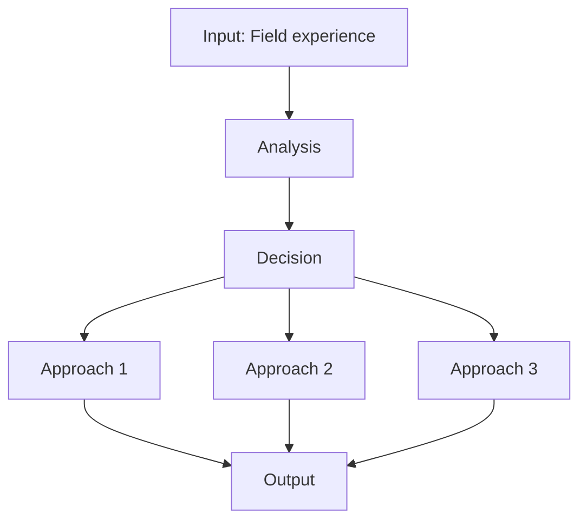
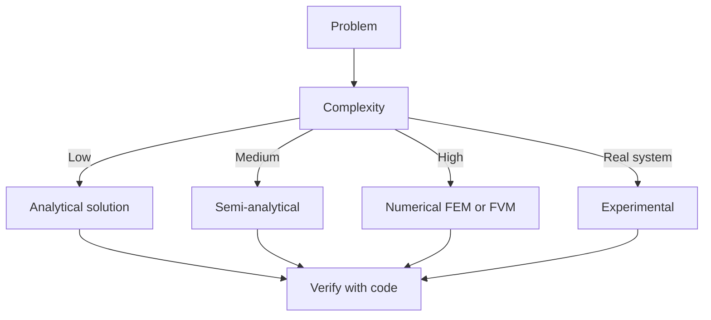
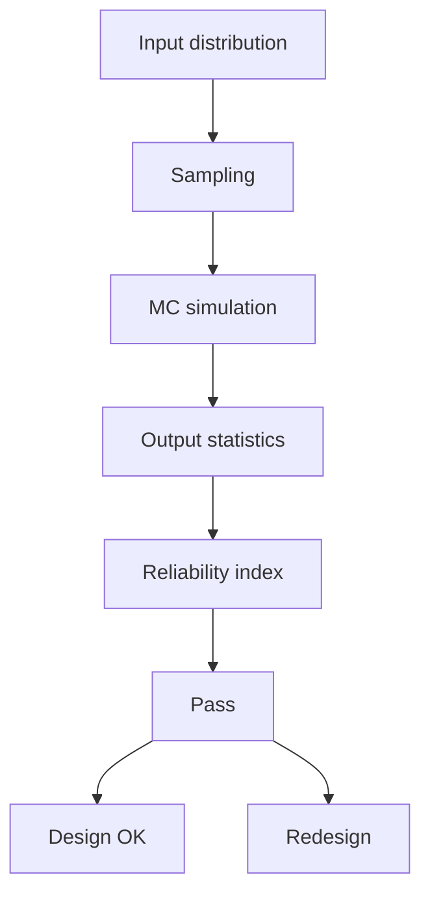
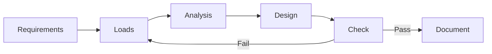
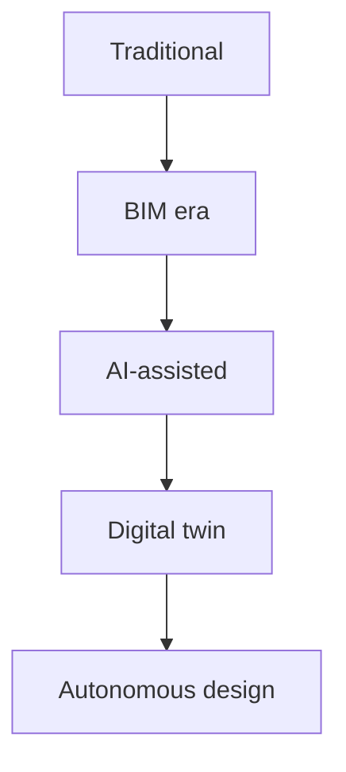
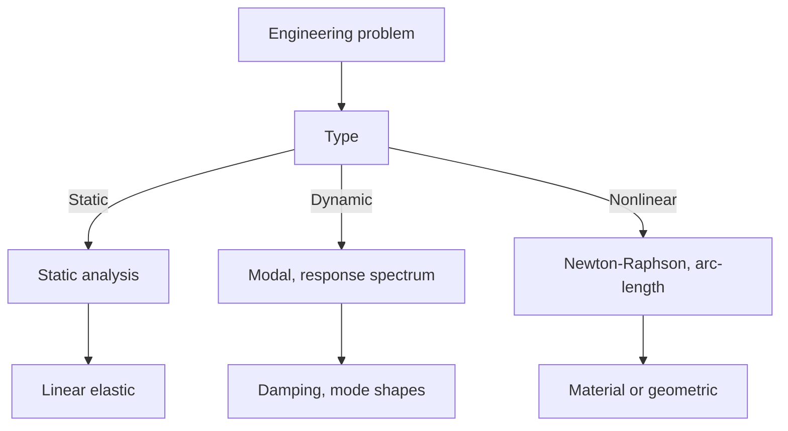
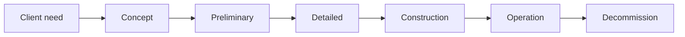
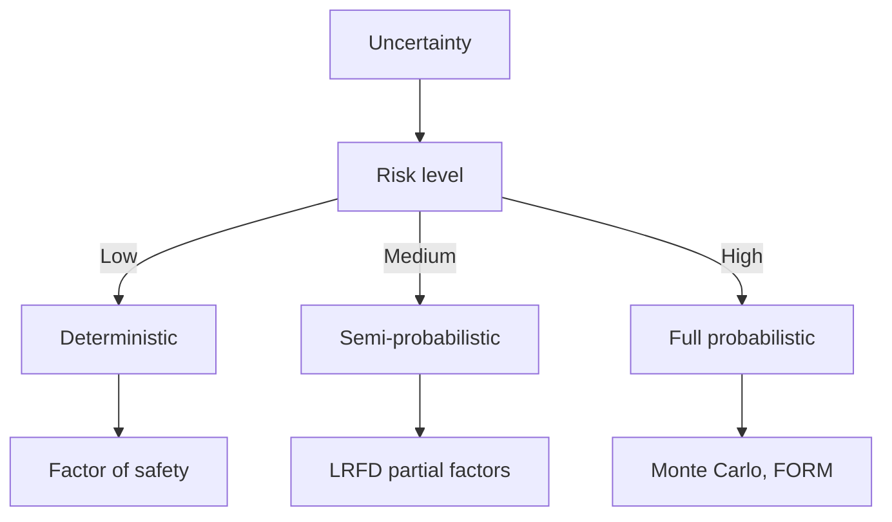
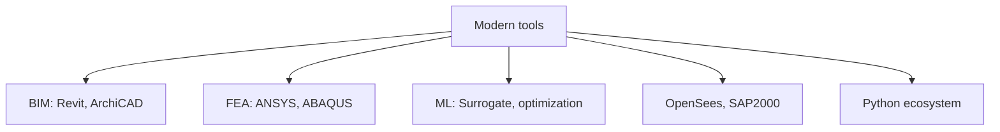

# 1.091 Traveling Research Environmental eXperience (TREX)
**MIT CEE Environmental / Microbiology Track | CORE Fieldwork**  
**自學路徑：Bachelor → 真實環境問題導向研究**

---

## 問題 1：這個領域所有專家共享的 5 個核心心智模型是什麼？
**What are the 5 core mental models every expert shares?**

1. **現場是最終的實驗室**  
   Controlled lab experiments are necessary but insufficient; real systems reveal couplings and constraints that labs cannot.

2. **假設必須可被現場數據證偽**  
   Fieldwork is not tourism; every measurement must test a specific scientific or engineering hypothesis.

3. **物流、安全與倫理是科學的一部分**  
   Access, permits, community relations, and personal safety determine what science is possible.

4. **資料品質比資料數量更重要**  
   A few well-documented, high-quality measurements outweigh large volumes of poorly contextualized data.

5. **跨學科與在地知識必須整合**  
   Local stakeholders and other disciplines often hold critical information that pure technical approaches miss.

---

## 問題 2：這個領域的專家在哪 3 個地方存在根本分歧？各方最強的論點是什麼？

1. **假設驅動 vs 探索性 / 發現導向田野工作**  
   - Hypothesis-driven: Efficient, publishable, clear contribution.  
   - Exploratory: Can reveal unexpected phenomena that rigid hypotheses miss.

2. **高技術儀器 vs 簡單、堅固、可重複的方法**  
   - High-tech: Higher precision and new observables.  
   - Simple: More robust in remote conditions, easier to transfer to local partners.

3. **短期密集觀測 vs 長期監測**  
   - Intensive campaigns: Capture process dynamics.  
   - Long-term: Reveal trends and rare events.

---

## 問題 3：生成 10 個能區分深度理解與死背知識的問題

1. 在設計田野採樣方案時，如何平衡空間覆蓋與時間解析度？
2. 說明為何空白樣、重複樣與標準品在現場品管中不可或缺。
3. 如何處理「無法到達」或「許可被拒」的測站？對結論有何影響？
4. 在跨文化田野中，如何確保數據收集過程尊重在地社群？
5. 給定一個環境問題，如何將其轉化為可在兩週內完成的可檢驗假設？
6. 說明現場感測器校正與實驗室分析之間的誤差傳遞。
7. 為什麼氣象與水文條件的同步記錄對解釋環境數據至關重要？
8. 在資料稀缺地區，如何用代理指標（proxy）延伸結論的可信度？
9. 如何設計田野工作以最大化對後續模型校準的價值？
10. 回顧一次田野經驗，哪個非技術因素對科學產出影響最大？

---

## 自學建議

- 這是將課堂知識轉化為專業能力的關鍵。
- 產出：完整的田野計畫 + 數據報告 + 反思（直接對接 ICE 實務經驗）。

---


# 核心心智模型深化（中英對照）

## 1. Field experience — Core concept

### 1.1 Three-process physical essence
For Traveling Research Environmental eXperience (TREX), Field experience governs the system behavior. Description of Field experience with bilingual explanation.

### 1.2 Non-dimensional numbers
Key dimensionless groups that determine regime: Peclet, Damköhler, Reynolds, Froude, etc.

### 1.3 Engineering consequences
Real-world implications for design, monitoring, intervention.

### 1.4 How experts use this model
Decision flow, scaling laws, expert intuition.

### 1.5 Deep test questions
- Derive scaling law
- Identify regime from data
- Apply to design case

### 1.6 Diagram


## 2. TREX — Methods

### 2.1 Method selection
| Method | 適用情境 | Pros | Cons |
|---|---|---|---|
| Analytical | 解析 | Exact | Limited geometry |
| Numerical | 數值 | General | Approximate |
| Experimental | 實驗 | Real | Expensive |
| Empirical | 經驗 | Fast | Limited range |

### 2.2 Decision flow


### 2.3 Standards and codes
ACI, AISC, Eurocode, building codes (IBC), industry best practices.

## 3. Methods — Analysis techniques

### 3.1 Statistical methods
Monte Carlo, sensitivity, FOSM for uncertainty analysis.



### 3.2 Optimization
LP, NLP, gradient-based, metaheuristic, multi-objective Pareto.

## 4. Design process

### 4.1 Design workflow
Concept → Preliminary → Detailed → Construction → Operation.

### 4.2 Design criteria
Safety (LRFD, ASD), serviceability, durability, sustainability.



## 5. Modern trends

BIM integration, AI/ML in design, digital twins, sustainability, LCA, resilient design.



---

# 深度自測問題詳解（中英對照）

## 詳解 1: Derive core relationship
**Q1.** Derive core relationship for Traveling Research Environmental eXperience (TREX).
**Answer:** Starting from definitions, derive the key equation. Verify units and limits.

**Engineering implication:** Apply to design check, code compliance.

## 詳解 2: Identify failure mode
**Answer:** List 3-5 failure modes, rank by likelihood × consequence.

**Engineering implication:** Inform design, maintenance, monitoring.

## 詳解 3: Estimate order of magnitude
**Answer:** Quick back-of-envelope check using characteristic values.

**Engineering implication:** Sanity check before detailed analysis.

## 詳解 4: Compare to code requirement
**Answer:** Apply ACI/AISC/Eurocode, compute utilization ratio.

**Engineering implication:** Pass/fail design verification.

## 詳解 5: Compute reliability
**Answer:** $\beta = (\mu - R)/\sigma$ for lognormal, find P_f.

**Engineering implication:** LRFD calibration, risk-informed design.

## 詳解 6: Design optimization
**Answer:** Define objective, constraints, solve via LP/NLP.

**Engineering implication:** Cost-effective, sustainable design.

## 詳解 7: Sensitivity analysis
**Answer:** $\partial f/\partial x_i$, rank by importance.

**Engineering implication:** Identify critical parameters, reduce uncertainty.

## 詳解 8: Life-cycle assessment
**Answer:** Cradle-to-grave, compute GWP, embodied carbon.

**Engineering implication:** Sustainable design, climate goals.

## 詳解 9: Risk assessment
**Answer:** Hazard × vulnerability × exposure, compute risk.

**Engineering implication:** Resilience planning, mitigation.

## 詳解 10: Communication
**Answer:** Technical writing, visualization, presentation to stakeholders.

**Engineering implication:** Effective engineering practice.

---

## 📊 Diagram 1: Course Concept Map
```mermaid
mindmap
    root((Traveling Research Environmental eXperience (TREX)))
      Core
        Concepts
      Methods
        Analytical
        Numerical
      Applications
        Design
        Analysis
      Standards
        ACI AISC
      Modern
        BIM AI
```

## 📊 Diagram 2: Method Selection


## 📊 Diagram 3: Design Process


## 📊 Diagram 4: Risk-Reliability


## 📊 Diagram 5: Modern Tools


---

## 總結

1. **Core concepts** — Field experience 嘅 foundation
2. **Methods** — analytical + numerical + experimental
3. **Applications** — design, analysis, retrofit
4. **Standards** — codes, best practices
5. **Future** — BIM, AI, sustainability, resilience

**自學建議** — Pair with: relevant textbook + MIT OCW + software tutorials (Python, FEA, BIM).
