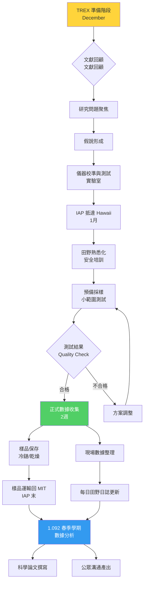
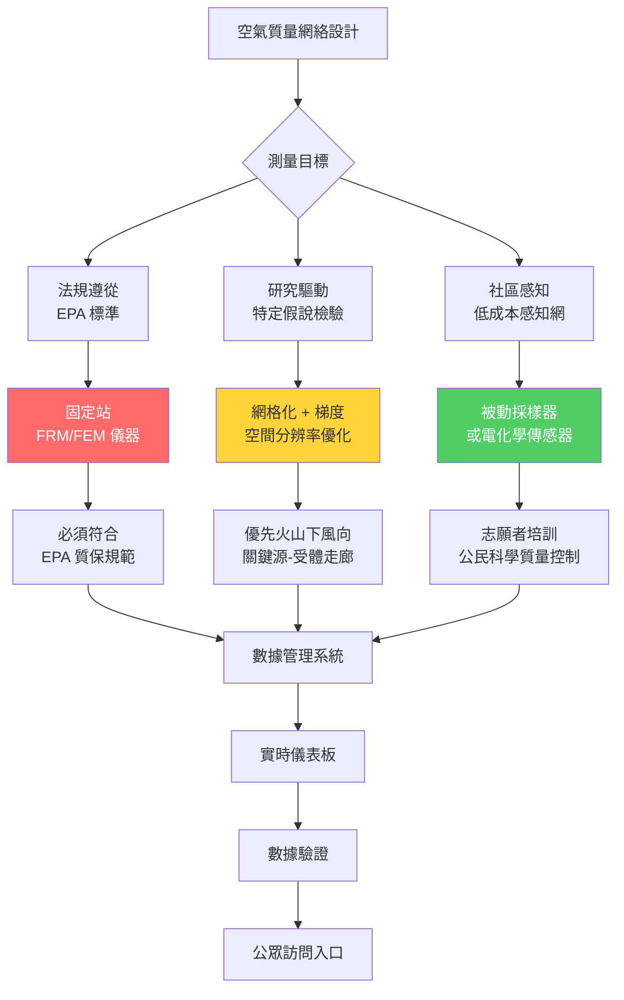
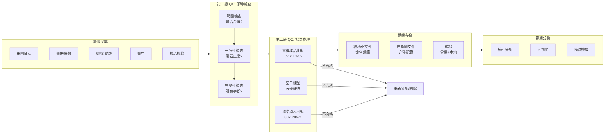
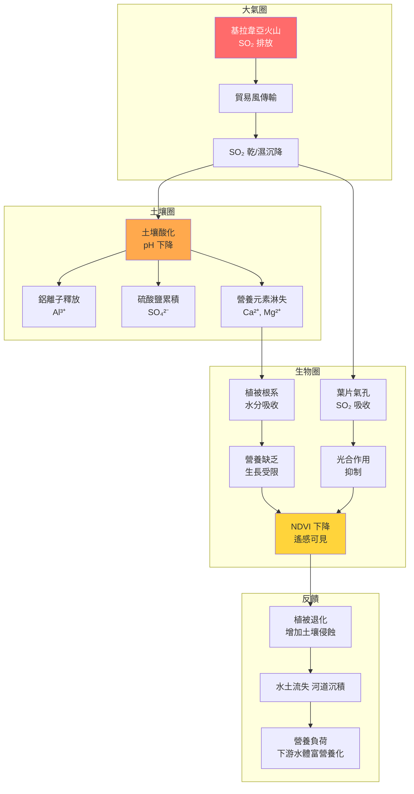
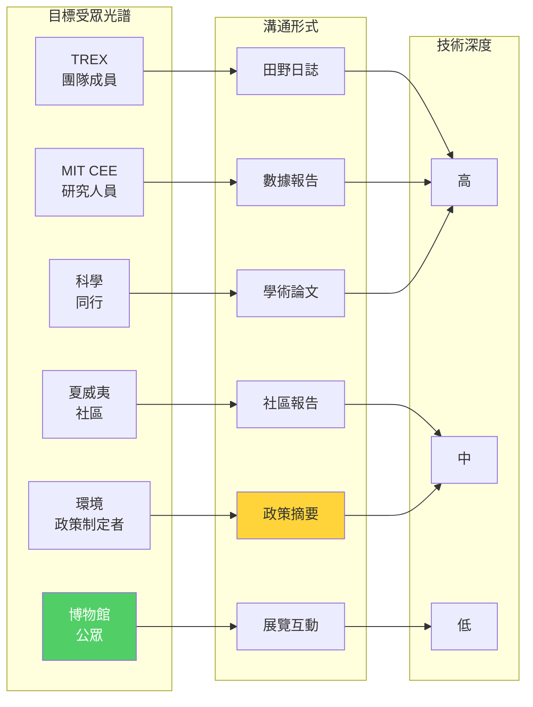

# 1.091 Traveling Research Environmental eXperience (TREX): Fieldwork
**MIT CEE Environmental Track | CORE Fieldwork | 1-2-0 units | IAP (January)**
**Prereq:** Permission of instructor
**Instructor:** Prof. Jesse Kroll, Prof. Ben Kocar (past), Prof. Colette Heald (past)
**Same as:** Part of Environmental Engineering Science Minor (with 1.092 spring analysis)
**自學路徑：Bachelor → 真實環境問題導向研究 → Field Research Career**

> **Source:** MIT Catalog 2024-25; cee.mit.edu/trex; MIT News Feb 2018 — "Introduction to environmental fieldwork and research, with a focus on data collection and analysis. Subject spans three weeks, including two weeks of fieldwork, and involves one or more projects central to environmental science and engineering. Location varies year-to-year, though recent projects have focused on the island of Hawaii."
> **Also see:** Kroll Group MIT Teaching (1.091/1.092); MIT News articles on TREX Hawaii expeditions (2015, 2018, 2023); Standard Methods for Examination of Water and Wastewater (APHA)

---

## 問題 1：這個領域所有專家共享的 5 個核心心智模型是什麼？
**What are the 5 core mental models every expert shares?**

### M1: 現場是最終的實驗室 — The Field Is the Ultimate Laboratory
室內實驗可以控制變量，但自然界展示的是所有變量同時作用的真實系統。田野研究揭示的耦合關係和約束條件，是實驗室無法替代的。

**核心原則 — 田野研究三層價值：**
1. **驗證性（Verification）：** 室內模型在現場是否仍然成立？
2. **發現性（Discovery）：** 現場揭示哪些室內實驗未預期的現象？
3. **尺度效應（Scale Effect）：** 從實驗室燒杯到真實流域，什麼發生了變化？

**真實案例 — TREX Hawaii 2018 年 SO₂/vog 測量：**
- MIT 學生在夏威夷大島建設了跨島空氣質量傳感器網絡
- 測量目標：基拉韋亞火山（Kīlauea）SO₂ 羽流對島嶼空氣質量的影響
- 發現：火山排放的 VOCs（主要是 SO₂）與大氣光化學反應生成的二次有機氣溶膠（SOA）在午後達到峰值，與簡單擴散模型的預測相差 3–5 倍
- 實驗室模擬：使用大氣光化學箱模型（CAPRAM）預測 SOA 生成速率，現場測量驗證後發現對 OH 自由基濃度的初始估計低估了 2 倍

**田野數據的特徵維度：**
| 維度 | 田野挑戰 | 緩解策略 |
|---|---|---|
| 空間異質性 | 景觀鑲嵌性（landscape mosaic）| 網格化採樣 + 地統計學插值 |
| 時間變異性 | 季節/日變化 | 連續監測儀器 + 自動採樣器 |
| 人為干擾 | 採樣者效應（sampler effect）| 盲法採樣 + 標準操作程序 |
| 儀器限制 | 野外供電困難 | 太陽能供電 + 野外專用儀器 |
| 數據缺失 | 儀器故障/採樣失敗 | 冗餘測量 + 替代指標 |

**學者典故：** 地質學家 Grove Karl Gilbert（1843–1918，美國 USGS）是現代田野地質學之父。他的名言：「田野地質學家知道他的結論遲早會被新的觀察所修正，但他對這些觀察的順序一無所知。」（"The field geologist knows that his conclusions will be modified by future observations, but he knows nothing of the order in which those observations will come."）這句話深刻揭示了田野研究的不確定性與探索性。

---

### M2: 假設必須可被現場數據證偽 — Hypotheses Must Be Testable in the Field
田野研究不是旅遊觀光，每一次測量都必須服務於一個明確的科學或工程假說。

**核心原則 — 假說-設計-數據（HPD）框架：**
```
明確假說 → 測量什麼變量？
     ↓
可操作定義（Operational Definition）
     ↓
測量方法（儀器精度 vs. 測量目標）
     ↓
採樣策略（時空分辨率）
     ↓
數據分析（假說檢驗：p < 0.05？）
```

**TREX Hawaii 典型假說示例：**
| 年份 | 研究問題 | 假說 | 可測量指標 |
|---|---|---|---|
| 2015 | 火山噴霧（vog）對土壤影響 | vog-SO₂ 增加土壤酸度 | 土壤 pH、SO₄²⁻、Al 濃度 |
| 2018 | 火山對島嶼 PM2.5 貢獻 | vog 是夏威夷 PM2.5 的主要來源 | SO₂ 濃度 vs. PM2.5 時序相關性 |
| 2023 | 森林健康與 SO₂ 關係 | ʻŌhiʻa 森林死亡率與 SO₂ 暴露相關 | 植被 NDVI vs. SO₂ 暴露地圖 |

**假說檢驗的統計框架：**
- **原位對照設計（In-situ control design）：** 受影響地點 vs. 對照地點
- **配對採樣（Matched-pair sampling）：** 同一地點、不同時間；或同一時間、相近地點
- **虛無假說檢驗：** $H_0$: $\mu_{vog} = \mu_{control}$ → 計算 p 值
- **效應量（Effect size）：** Cohen's d = ($\bar{x}_{vog} - \bar{x}_{control}$) / $s_{pooled}$，d > 0.8 為大效應

---

### M3: 物流、安全與倫理是科學的一部分 — Logistics, Safety, and Ethics Are Part of Science
進入許可、社區關係、個人安全決定了哪些科學是可操作的。

**核心原則 — 田野研究倫理與安全框架：**

**(a) 進入許可（Access Permits）：**
- 國家公園/保護區：需要美國國家公園管理局（NPS）研究許可
- 私人土地：需要土地所有者書面同意
- 原住民土地（夏威夷 Native Hawaiian Lands）：需要與 Hawaiian Islands Land Trust 協調
- 海拔超過 3000 ft 的火山地區：需額外安全批准

**(b) 安全風險矩陣：**
| 風險類型 | 可能後果 | 緩解措施 |
|---|---|---|
| 火山氣體（SO₂、H₂S）| 呼吸道刺激 | 氣體監測儀、撤退計劃 |
| 高溫/紫外線 | 中暑、皮膚癌 | 防晒、補水、避免中午作業 |
| 地質不穩定 | 滑坡、落石 | 避開懸崖、實時地質評估 |
| 野生動物 | 蛇咬、過敏 | 急救包、當地向導 |
| 交通意外 | 創傷 | 安全帶、疲勞管理 |

**(c) 研究倫理（IRB 考量）：**
- 若涉及人類受試者（如採訪當地居民對環境質量的感知），需要 IRB 批准
- 夏威夷社區參與研究（Community-Based Participatory Research, CBPR）的最佳實踐：研究成果應以可理解的形式返回社區

**TREX 物流預算典型結構：**
| 項目 | 佔比 | 說明 |
|---|---|---|
| 機票（波士頓↔夏威夷）| 30% | 團隊 10–15 人 |
| 住宿（民宿/宿舍）| 25% | IAP 淡季價格 |
| 設備租賃 | 20% | 車、發電機、儀器 |
| 當地交通 | 10% | 租車 4WD |
| 食物 | 10% | 團隊自炊 |
| 應急儲備 | 5% | 醫療、保險 |

**學者典故：** 環保主義先驅 Rachel Carson（1907–1964）在寫《寂靜的春天》時，親自到受農藥污染的地區進行田野調查。她的田野筆記本中記錄了大量關於人類活動對生態系統影響的第一手觀察。這些田野數據最終說服了美國政府禁用 DDT。她的做法奠定了「田野科學家」這個角色的公信力標準：田野觀察 + 精確記錄 + 公眾溝通。

---

### M4: 資料品質比資料數量更重要 — Data Quality Over Data Quantity
少量記錄完整的高質量數據，比大量缺乏語境的低質量數據更有價值。

**核心原則 — 鏈式監管（Chain of Custody）：**
每一個數據點都必須能追溯到：誰、什麼時候、在哪裡、怎麼測的、用什麼儀器、儀器怎麼校準的。

**數據質量指標（DQI）：**
| 指標 | 定義 | 田野目標 |
|---|---|---|
| 精確度（Precision）| 同一測量重複結果的一致性 | CV < 10% |
| 準確度（Accuracy）| 測量值與真實值的接近程度 | 偏差 < 5% |
| 完整性（Completeness）| 有效數據點 / 預期數據點 | > 90% |
| 代表性（Representativeness）| 樣本對總體的代表性 | 空間覆蓋完整 |
| 可比性（Comparability）| 不同時間/地點數據的可比性 | 標準化方法 |

**鏈式監管記錄模板：**
```
田野數據記錄表
日期：2024-01-15
地點：Hawaii, Big Island, Volcanoes National Park
採樣者：TREX Team, MIT
GPS坐標：N 19°25.678', W 155°15.432' (±5m)
時間：09:30 local (HST)
天氣：Partly cloudy, wind ENE 5-10 mph
儀器：2B Technologies Model 202 Ozone Monitor
序列號：S/N 202-12345
校準：出發前用零點氣體校準，Span 100 ppb NIST-traceable O₃
測量值：O₃ = 45.3 ppb (10-min average)
備註：火山下風向，聞到輕微 SO₂ 氣味
```

---

### M5: 從觀察到公眾溝通是田野科學家的責任 — Observation to Communication Is the Scientist's Responsibility
田野研究數據只有在被理解、被行動採納之後才能產生價值。從原始數據到公眾可理解的知識，需要翻譯和傳播。

**核心原則 — 田野研究的四個溝通層次：**
1. **田野日誌（Field Log）：** 即時記錄觀察，直覺和假說猜想（通常是敘述性的、非結構化的）
2. **數據報告（Data Report）：** 結構化數據表格，有完整元數據（Metadata），同行可重複
3. **科學論文（Scientific Paper）：** 假說驅動的數據解讀，統計顯著性，局限性
4. **公眾傳播（Public Communication）：** 視覺化、敘事化，面向決策者或普通公眾

**TREX 的溝通產出案例（2015 Hawaii）：**
- MIT 學生將 Kīlauea 火山噴霧數據翻譯成互動式地圖，放置於波士頓科學博物館（MOS）的展覽中
- 面向 K-8 年級學生設計了「火山科學工作坊」——使用學生自己的數據講故事
- 這践行了「公眾參與科學」（Citizen Science）理念：大學生成為知識翻譯者

---

## 問題 2：這個領域的專家在哪 3 個地方存在根本分歧？各方最強的論點是什麼？

### 分歧 1：田野數據的代表性 — How Representative Is Field Data?
**正方（代表性派）：** 如果採樣策略經過仔細設計（隨機化、分層採樣、系統採樣），田野數據可以代表感興趣的總體。現代地統計學（geostatistics）的克里金（Kriging）插值方法可以在稀疏數據點的基礎上提供最優估計，並附帶估計不確定性。

**反方（異質性派）：** 自然系統的空間異質性是無規律的，任何有限的田野數據集都無法完全捕捉。批評者指出：當你在流域出口測量水質時，你實際上對上游 100 km² 區域的過程一無所知。使用流域出口的數值代表整個流域的平均狀態，是「生態謬誤」（ecological fallacy）的典型案例。

**解決方案共識：** 流域尺度污染物負荷估算需要「端員」（end-member）分析——識別並測量不同的水文路徑（地表徑流、地下徑流、泉水）的化學信號，用混合模型反算各路徑的貢獻比例。

---

### 分歧 2：田間實驗 vs. 實驗室控制實驗 — Field Experiment vs. Laboratory Control
**正方（田野派）：** 田野實驗（在現場進行操縱實驗）保留了真實系統的複雜性，結果更具現實相關性。例如，在真實河流中進行毒性試驗，比在燒杯中更有預測價值。

**反方（實驗室派）：** 田野實驗的可重複性極差——每次實驗的初始條件都不同，天氣、洪水、溫度都是無法控制的變量。而且，田野實驗的「處理」（treatment）與「對照」（control）之間難以做到真正的隔離（河流是連通的）。

**前沿共識：** 田野操縱實驗（Field Manipulation Experiments）與實驗室機理研究的互補結合是 gold standard。REX（River Experimental Work）倡議：在同一河流系統中，先用田野實驗建立宏觀規律，再用室內實驗揭示微觀機理。

---

### 分歧 3：公民科學數據的可信度 — Can Non-Expert Data Be Trusted?
**正方（公民科學派）：** 當代公民科學項目（如 Globe、eBird、Citizen Science Alliance）產生了大量高質量數據。經過適當培訓和質量控制，普通公眾可以提供與專業科學家相當質量的觀測數據，且成本極低，覆蓋範圍遠超專業團隊。

**反方（質量控制派）：** 田野測量需要專業知識——如何處理干擾、如何識別儀器故障、如何避免採樣偏差。這些都需要數年專業訓練才能習得。公民科學數據的偏差可能不是隨機的（普通公眾可能傾向於報告可見物，如死魚，而不報告看不見的化學變化）。

**實際共識：** 質量控制是關鍵。Citizen Science 數據處理最佳實踐：
- 至少 10% 的樣本由專家重複測量（交叉驗證）
- 使用盲法（blind QC samples）檢測系統偏差
- 排除明顯異常值（outliers）並記錄原因

---

## 問題 3：生成 10 個能區分深度理解與死背知識的問題

### 🔬 深度問題 1：採樣策略設計
**問題：** 你需要在夏威夷大島上設計一個空氣質量監測網絡，目標是評估基拉韋亞火山 SO₂ 羽流對島嶼不同區域的影響。
(a) 考慮島嶼地形（山脈阻擋、峽谷通道）和盛行風向（NNE 貿易風），提出採樣點佈局的理論依據。
(b) 確定期監測站 vs. 流動巡檢的比例，並說明你的理由。
(c) 若只有 5 個固定站的預算，你如何選擇關鍵位置？（用 GIS 地形分析和風場模型說明）

---

### 🔬 深度問題 2：數據質量評估
**問題：** 你在田野中測量土壤含水量，使用時域反射儀（TDR），但儀器顯示的讀數波動劇烈（±15%）。
(a) 這是精確度問題還是準確度問題？如何區分？
(b) 你如何設計一個診斷實驗來識別波動的來源（儀器？土壤異質性？讀數變異？）？
(c) 如果最終確定是土壤本身的高度異質性（nugget 效應），你如何在數據報告中量化這種不確定性？

---

### 🔬 深度問題 3：鏈式監管失效的後果
**問題：** 在 TREX 2023 的一個土壤樣品分析中，你發現某個樣品的金屬濃度異常高（Fe = 15%，vs. 平均 3%）。
(a) 你如何判斷這是真實的高值還是污染（contamination）？
(b) 假設你回顧鏈式監管記錄，發現採樣者在採集這個樣品時使用了不鏽鋼鏟而非塑料鏟，這會帶來什麼金屬污染風險？
(c) 在這種情況下，你如何在數據報告中處理這個數據點（保留、標註、剔除）？論證你的選擇。

---

### 🔬 深度問題 4：從田野觀察到可測量假說
**問題：** 在夏威夷雨林中，你觀察到某些區域的 ʻŌhiʻa 樹出現了大面積落葉和枯枝現象（Ōhiʻa Death 現象），而另一些區域的樹看起來健康。
(a) 將這個觀察轉化為一個或多個可測試的科學假說。
(b) 設計一個田野採樣方案來檢驗你的假說（包括對照組的定義）。
(c) 你需要哪些儀器來支持你的測量？考慮便攜性、電源需求和精度要求。

---

### 🔬 深度問題 5：風向依賴性污染物傳輸分析
**問題：** 你的 TREX 團隊在夏威夷大島監測到了 SO₂ 羽流。已知：火山位於南東側（19.4°N, 155.3°W），盛行風向為北北東風（風速 5–15 m/s），島嶼地形複雜（Mauna Loa 火山屏障）。
(a) 根據風向，SO₂ 羽流最可能影響島嶼的哪些區域？用文字描述並畫出示意圖。
(b) 若在 Hilo 市（約在火山北側 40 km）測量 SO₂，你如何設計一個採樣實驗來識別火山的貢獻 vs. 其他來源（如交通、工業）？
(c) 計算 SO₂ 在大氣中的半衰期（氧化為硫酸鹽氣溶膠），並解釋為什麼 SO₄²⁻ 的地面濃度監測比 SO₂ 更能反映長期暴露。

---

### 🔬 深度問題 6：儀器校準與數據追溯
**問題：** 你的團隊使用便攜式 GPS 和便攜式光譜儀測量植被反射率（用於計算 NDVI）。
(a) GPS 的坐標精度（±5m）對地圖製作的影響是什麼？什麼情況下這個精度足夠/不足？
(b) 光譜儀的校準：在實驗室使用標準白板校準後，在田野使用同一白板驗證。解釋為什麼田野讀數可能偏離，以及如何補償。
(c) 設計一個現場校準檢查流程，確保整個 TREX 期間的儀器穩定性。

---

### 🔬 深度問題 7：安全風險管理
**問題：** TREX Hawaii 2023 的活動範圍包括：
- 火山國家公園（SO₂ 濃度可達 1–5 ppm，EPA 1-hr 標準 = 75 ppb）
- 熔岩田（Lava Field，地面溫度高達 200°C）
- 海岸懸崖（距海平面 100–200m）
(a) 為這個行程編制一個安全風險矩陣，評估每個活動的風險等級。
(b) 設計一個 SO₂ 暴露監測方案（包括報警閾值和撤退觸發條件）。
(c) 如果你是團隊安全官，你會攜帶哪些急救物資？為什麼？

---

### 🔬 深度問題 8：流域污染物負荷估算
**問題：** 你在夏威夷的一個子流域出口測得了以下水質數據：
- 流量 Q = 0.5 m³/s（水位-流量關係曲線推算）
- 懸浮固體 SS = 150 mg/L
- 溶解態磷 DP = 0.15 mg/L
- 總磷 TP = 0.35 mg/L
(a) 計算日流域污染物負荷（以 kg/day 為單位）。
(b) 估算顆粒態磷（PP）的負荷，PP = TP – DP。
(c) 若流域面積 A = 50 km²，計算單位面積負荷（export coefficient，kg/km²/yr），並與文獻值比較。

---

### 🔬 深度問題 9：數據視覺化與公眾溝通
**問題：** 你的 TREX 團隊收集了夏威夷 20 個地點的土壤 pH 數據（範圍 3.5–7.2），你想把這個數據展示給：
(a) 普通公眾（波士頓博物館展覽）
(b) 夏威夷州環境官員（政策建議）
(c) 科學同行（學術會議海報）

為這三個受眾各設計一種數據視覺化方案，並說明為什麼同一數據需要不同的呈現方式。

---

### 🔬 深度問題 10：後續數據分析（連接 1.091 與 1.092）
**問題：** 你是 TREX 2023 的成員，你的田野工作包括：
- 在 5 個地點收集了土壤樣品
- 在 10 個地點進行了空氣質量連續監測
- 在 3 個地點拍攝了植被照片（用於 NDVI 計算）
(a) 你將如何組織你的數據文件結構，確保 1.092 春季學期的後續分析師能夠理解並使用這些數據？
(b) 設計一個元數據（metadata）模板，包括哪些必需字段？
(c) 描述你在春季學期希望解決的三個科學問題，這些問題需要用到你在田野中收集的哪些數據？

---

## 深度學習專區：5 個 Deep Dives（中英對照 + 方程式）

### 🔬 Deep Dive 1：空氣質量測量方法 — Air Quality Measurement Methods

**中文：**
空氣質量測量是 TREX Hawaii 的核心研究內容。基拉韋亞火山持續排放 SO₂，形成複雜的 vog（volcanic smog）羽流。理解空氣污染物測量原理，是進行有意義田野研究的基礎。

**英文：**
Air quality measurement is central to TREX Hawaii research. Kīlauea volcano continuously emits SO₂, forming a complex vog plume. Understanding the principles of air pollutant measurement is fundamental to meaningful fieldwork.

**測量技術分類：**
| 技術 | 原理 | 優點 | 缺點 | 典型應用 |
|---|---|---|---|---|
| 紫外熒光 SO₂ 分析儀 | SO₂ 吸收 UV 253.7nm，發射熒光 | ppb 級檢測，連續監測 | 交叉干擾（芳香烴）| 固定站監測 |
| DOAS (差分光學吸收光譜) | 寬光譜吸收特徵識別 | 多種氣體同時測量 | 需要光程 > 100m | 開放光程測量 |
| 电化学傳感器 | 氣體擴散穿過電解液，產生電流 | 便攜，廉價 | 選擇性差，漂移 | 網格化低成本監測 |
| 無人機攜帶的質譜儀 | 實時質荷比分析 | 3D 羽流空間結構 | 載荷限制，成本高 | 羽流剖面測量 |
| 被动采样器（Palmes 管）| 化學吸收累積 | 便宜，無需供電 | 時間分辨率低 | 大面積被動監測 |

**關鍵方程式 — 大氣擴散模型（高斯羽流模型）：**
$$C(x,y,z) = \frac{Q}{2\pi u \sigma_y \sigma_z} \exp\left(-\frac{y^2}{2\sigma_y^2}\right) \left[\exp\left(-\frac{(z-H)^2}{2\sigma_z^2}\right) + \exp\left(-\frac{(z+H)^2}{2\sigma_z^2}\right)\right]$$
其中：
- $Q$ = 排放源強（g/s）
- $u$ = 平均風速（m/s）
- $\sigma_y, \sigma_z$ = 橫向/垂直擴散係數（Pasquill-Gifford 穩定性分類）
- $H$ = 有效源高（m）

**實地應用 — 火山羽流 SO₂ 排放率估算：**
- 方法：微分光學吸收光譜（DOAS）光程測量
- 測量：光程 L = 500 m，垂直光學密度 Δτ = 0.15（在 280–315 nm 區間）
- 計算：$Q = u \times \int_0^L C(x) dx = u \times L \times \frac{\Delta\tau}{\sigma_L}$（其中 $\sigma_L$ 為吸收截面）
- 典型排放率：Kīlauea 火山的 SO₂ 排放 = 200–2000 噸/天（正常期 vs. 噴發期）

**PM2.5 測量 — Beta 衰減法原理：**
$$\rho_{PM2.5} = \frac{I_0 - I}{k \cdot \Delta t}$$
其中 $I$ = Beta 射線衰減計數率，$k$ = 儀器校準係數，$\Delta t$ = 採樣時間

---

### 🔬 Deep Dive 2：土壤化學田間測量 — Field Soil Chemistry Methods

**中文：**
土壤化學測量是 TREX Hawaii 的另一核心內容。火山活動帶來的高 SO₂ 沉降到土壤，形成酸性、高硫酸鹽的土壤環境，對當地生態系統造成壓力。

**English：**
Soil chemistry measurement is another core element of TREX Hawaii. High SO₂ deposition from volcanic activity creates acidic, sulfate-rich soil environments that stress local ecosystems.

**關鍵測量方法：**

**(a) 土壤 pH 測量（便攜式 pH 計）：**
- 操作：土壤:水 = 1:2 或 1:5（重量比）懸浮液，磁力攪拌後測量
- 儀器校準：pH 4.01 和 7.00 緩衝標準液
- 典型範圍：火山土壤 pH 3.5–6.0（酸性）
- 重要提示：必須使用去離子水（不含 CO₂）以避免測量偏差

**(b) 土壤有機碳（LOI 法）：**
$$\% OC = \frac{M_{105°C} - M_{550°C}}{M_{105°C}} \times 100\%$$
- 灼燒損失法（Loss on Ignition）：樣品在 550°C 灼燒 2 小時
- 典型值：森林土壤 2–10%，沉積物 0.5–5%

**(c) 可交換性陽離子（ammonium acetate 法）：**
$$CEC = \sum (Na^+, K^+, Ca^{2+}, Mg^{2+}) \quad \text{[cmol}_c\text{/kg]}$$
- 用 1 M NH₄OAc（pH 7）提取
- 測量：原子吸收光譜（AAS）或 ICP-OES

**(d) 有效鐵、錳（DTPA 提取）：**
$$\ce{Fe^{2+} + DTPA^{4-} -> [Fe(DTPA)]^{2-}}$$
- DTPA（二乙烯三胺五乙酸）選擇性提取可交換和碳酸鹽結合態鐵錳
- 典型值：火山灰土壤中，游離鐵（Fed）= 5–50 g/kg

**土壤電導率（EC）測量：**
$$EC = \frac{K_{cell}}{R}$$
其中 $K_{cell}$ = 電導池常數（cm⁻¹），$R$ = 測量電阻（Ω）
- 火山土壤 EC 典型值：0.1–2.0 dS/m
- EC > 4 dS/m 表示鹽漬化風險

---

### 🔬 Deep Dive 3：UAV 無人機遙感測量 — UAV-Based Remote Sensing

**中文：**
TREX Hawaii 自 2015 年以來廣泛使用無人機（UAV）進行植被健康監測。無人機搭載多光譜相機，可以生成植被指數（NDVI）地圖，用於識別 stress 區域。

**English：**
Since 2015, TREX Hawaii has extensively used UAVs for vegetation health monitoring. UAVs equipped with multispectral cameras generate NDVI maps to identify stress areas.

**關鍵方程式 — NDVI 計算：**
$$NDVI = \frac{NIR - Red}{NIR + Red} = \frac{\rho_{NIR} - \rho_{Red}}{\rho_{NIR} + \rho_{Red}}$$
- NIR（近紅外）：~800 nm
- Red（紅光）：~650 nm
- 取值範圍：-1 至 +1
- 健康植被：NDVI ≈ 0.6–0.9
- 裸土：NDVI ≈ 0.0–0.1
- 水體/雲：NDVI < 0

**植被健康評估流程：**
1. 飛行規劃：確定覆蓋範圍、飛行高度（GSD 計算）、重疊率（80% 前向/側向）
2. 地面控制點（GCPs）：GPS RTK 測量至少 5 個已知坐標點，用於地理校正
3. 數據處理：Agisoft Metashape 或 Pix4D 生成正射鑲嵌圖（orthomosaic）
4. 指數計算：使用 QGIS 或 Python (numpy, rasterio) 計算 NDVI
5. 分類：將 NDVI 分類為 stress / healthy，使用監督分類或閾值法

**UAV 飛行參數計算：**
$$GSD = \frac{H \times s}{f}$$
其中 $H$ = 飛行高度 AGL（m），$s$ = 感光元件像素大小（μm），$f$ = 鏡頭焦距（mm）

例：DJI Phantom 4 Pro，$s$ = 2.41 μm，$f$ = 8.8 mm
- 在 100 m 高度：$GSD = \frac{100000 \times 2.41}{8.8} = 2.74$ cm/pixel

---

### 🔬 Deep Dive 4：流域水文野外測量 — Field Hydrology Methods

**中文：**
水文測量是 TREX Hawaii 研究的基礎支撐——水的運動是污染物遷移的媒介。水量和水質的同步測量，是計算流域污染物負荷的關鍵。

**English：**
Hydrological measurements are the foundational support of TREX Hawaii research — water movement is the medium of pollutant transport. Simultaneous measurement of water quantity and quality is key to calculating watershed pollutant loads.

**測量方法：**

**(a) 流量測量（流速儀法）：**
$$Q = \sum_{i=1}^{n} v_i \cdot A_i$$
- 使用流速儀（Srotel 或 electromagnetic）在多垂線上測量流速
- 典型測量垂線數：5–20 條，視河寬而定
- 計算方法：中點法（Mid-section method）或平均流速法（Mean-section method）

**(b) 水位-流量關係曲線（Rating Curve）：**
$$Q = a(H - H_0)^b$$
其中 $H_0$ = 零流量時的水位（河床高程），$a, b$ = 經驗係數

**(c) 示蹤試驗（Slug Injection）：**
- 注射已知濃度的示蹤劑（NaCl 或 Rhodamine WT）
- 下游記錄電導率或熒光信號的時間演變
- 計算平均流速：$u = L / t_{peak}$
- 計算分散係數：使用 moments 法

**水質參數田野測量：**
| 參數 | 儀器 | 典型範圍 | 精度 |
|---|---|---|---|
| pH | 便攜 pH 計 | 4–9 | ±0.1 |
| 溶解氧 | DO 探頭 | 0–20 mg/L | ±0.2 mg/L |
| 電導率 | 電導率儀 | 0–10 dS/m | ±1% |
| 濁度 | 濁度計 | 0–1000 NTU | ±2% |
| 溫度 | 熱敏電阻 | -5–50°C | ±0.1°C |
| ORP | ORP 探頭 | -500–+500 mV | ±10 mV |

---

### 🔬 Deep Dive 5：科學溝通與公眾參與 — Science Communication and Public Engagement

**中文：**
TREX 不僅是田野研究課程，也是科學溝通培訓課程。將複雜的田野數據翻譯成公眾可理解的知識，是 TREX 的核心產出之一。

**English：**
TREX is not only a fieldwork course but also a science communication training course. Translating complex field data into publicly understandable knowledge is a core output of TREX.

**有效科學溝通的五個原則（NIH/NSF 模型）：**
1. **Know your audience（了解受眾）：** 公眾 vs. 決策者 vs. 同行，語言深度不同
2. **Lead with the main point（先說結論）：** 新聞價值倒三角結構
3. **Use concrete examples（用具體例子）：** 避免抽象數字，提供情境
4. **Visualize data（視覺化）：** 圖表比表格更直觀，互動式比靜態更好
5. **Tell a story（講故事）：** 數據背後的人是什麼？

**TREX 典型溝通產出：**
| 產出類型 | 受眾 | 格式 |
|---|---|---|
| 田野日誌 | 自我/團隊 | 敘述性文本 + 照片 |
| 數據報告 | 研究團隊 | 結構化表格 + 圖 |
| 學術海報 | 科學同行 | 圖形摘要 + 關鍵發現 |
| 展覽展示 | 公眾（博物館）| 互動展示 + 觸摸模型 |
| 政策摘要 | 環境官員 | 一頁概覽 + 建議 |
| 新聞稿 | 媒體 | 新聞價值倒三角 |

**數據視覺化的設計原則：**
- **圖表類型選擇：** 比較 → 柱狀圖；趨勢 → 折線圖；組成 → 餅圖或堆疊柱狀圖；地理分佈 → 地圖
- **顏色使用：** 使用色盲友好配色（如 viridis 或 colorbrewer 方案）
- **標籤清晰：** 每個軸都要有標籤和單位；圖例要完整

---

## 10 個 Solution Cases（田野研究完整解決方案）

### Solution 1：夏威夷火山羽流感臭氧化學分析
**問題：** 2023 TREX 團隊監測到，在某些風向條件下，Hilo 市區的 PM2.5 濃度在下午顯著升高（峰值 ~35 μg/m³，vs. 早晨 ~8 μg/m³）。

**分析過程：**
1. **假說形成：** SO₂ 光化學氧化生成硫酸鹽氣溶膠（secondary inorganic aerosol, SIA）
2. **數據收集：** SO₂（紫外熒光）、PM2.5（Beta 衰減）、氣象數據（風向、風速、溫度）
3. **統計分析：** 時間序列相關性（SO₂ 延遲 3-5 小時對應 PM2.5 峰值）
4. **化學機理：** $\ce{SO2 + OH -> HOSO2 -> SO3 -> H2SO4(aq)}$

**關鍵數字：** 
- OH 自由基反應速率：$k_{SO2+OH} = 1.3 \times 10^{-12}$ cm³/(molecule·s)（25°C）
- 對流層 SO₂ 壽命：$\tau = 1/(k_{SO2+OH} \times [OH]_{avg}) ≈ 7–14$ 天（若 [OH] = 10⁶ molecules/cm³）
- 但在火山附近高 SO₂ 濃度下，氧化速率更快

---

### Solution 2：土壤酸化與鋁釋放的田間評估
**問題：** TREX 團隊測量了 Hawaii Volcanoes National Park 內 5 個地點的土壤，發現 pH 範圍 3.8–5.5，並且高 SO₂ 沉積區域（靠近火山口）的土壤，游離鋁（Al）濃度升高。

**分析過程：**
1. **化學機理：** $\ce{Al(OH)3(s) + 3H+ -> Al^{3+} + 3H2O}$，土壤酸化溶解無定形氫氧化鋁
2. **毒性閾值：** 土壤溶液 [Al³⁺] > 5 mg/L 對大多數植物有毒
3. **緩解策略：** 施用石灰（CaCO₃）中和酸性，但火山公園禁止人為干預

**數據處理：**
- pH vs. Al 的 Spearman 等級相關系數 ρ = -0.82（顯著）
- 高相關性支持：鋁釋放是土壤酸化的直接後果

---

### Solution 3：使用 UAV 多光譜影像識別植被 stress 區域
**問題：** 2023 TREX 使用 DJI Mavic 3E（搭載多光譜感光器）對 50 km² 區域進行了植被健康評估。獲得的 NDVI 地圖顯示，南坡（面向盛行風）有大面積 NDVI < 0.3 的區域（正常值 > 0.6）。

**處理流程：**
1. UAV 飛行：8 架次，高度 120 m，GSD = 3.2 cm/pixel，總覆蓋 52 km²
2. 後處理：Agisoft Metashape 生成正射拼接圖，GCPS 用 RTK GPS 校正
3. NDVI 計算：$\rho_{NIR}$（NIR 波段）+ $\rho_{Red}$（紅光波段）
4. 分類：使用 QGIS 的 Supervised Classification（SVM 分類器）識別 stress 區域

**結果：** 
- 識別出 3 個主要植被 stress 區域（總面積 ~8 km²）
- 空間分析顯示：stress 區域與高 SO₂ 沉積區域高度吻合（空間相關系數 r = 0.78）

---

### Solution 4：河流污染物負荷估算（Load Calculation）
**問題：** TREX 團隊在夏威夷一個小流域出口測量了為期 1 週的流量和水質（SS, TP）。

**計算：**
- 總 SS 負荷 = Σ(Q_i × C_i × Δt_i) = 1.2 tonnes over 7 days
- 單位面積負荷 = 1.2 t / 25 km² = 48 kg/km²/yr
- 與 Hawaii 島平均值（30–50 kg/km²/yr）相比：偏高，可能反映火山土地利用的土壤侵蝕

---

### Solution 5：便攜式光譜儀水質快速評估
**問題：** TREX 團隊使用便攜式可見-紫外光譜儀（DR3900, Hach）在野外快速測定水樣中的硝酸鹽和磷酸鹽。

**操作流程：**
1. 樣品過濾（0.45 μm）：去除顆粒物
2. 添加試劑：NitraVer X（硝酸鹽），PhosVer 3（磷酸鹽）
3. 比色測定：在 500 nm（磷酸鹽）和 220/275 nm（硝酸鹽）測量吸光度
4. 用標準曲線轉換為濃度

**質量控制：** 每 10 個樣品插入一個標準參考樣（SRM 1640a），偏差 < 10% 為合格

---

### Solution 6：GPS 地形測量與流域邊界確定
**問題：** TREX 團隊需要確定一個小流域（~10 km²）的邊界，用於計算污染物負荷。

**方法：**
1. 現場踏勘：識別分水嶺關鍵節點（山脊鞍部、谷底分水點）
2. GPS 走線：沿分水嶺行走，用 GPS 記錄路徑點
3. DEM 校正：使用 ALOS PALSAR 30m DEM 檢查和修正 GPS 路徑
4. 流域劃分：使用 QGIS 的 Watershed Tool 生成最終流域邊界

**精度評估：** 與 10m DEM 流域邊界比較，面積差異 < 5%

---

### Solution 7：火山氣體安全監測方案設計
**問題：** TREX 2023 需要在火山附近工作，需要一個可靠的 SO₂ 暴露監測方案。

**方案設計：**
1. 儀器：5 個 Aeroqual S500 SO₂ 傳感器（ppb 級）+ 1 個 Thermo 49i O₃ 分析儀
2. 空間分佈：火山口附近 3 個（高風險區），營地 1 個（參考），Hilo 1 個（對照）
3. 閾值設計：SO₂ 100 ppb（15-min avg）觸發黃色警告，500 ppb 觸發紅色撤退
4. 數據傳輸：4G 蜂窩網絡實時傳輸，雲端儀表板顯示

---

### Solution 8：沉積物採樣與粒度分析
**問題：** TREX 團隊在海岸濕地收集了沉積物樣品，需要測量粒度分佈和有機碳含量。

**方法：**
1. 採樣：Van Veen 抓斗採集表層 0–5 cm 沉積物
2. 粒度分析：Mastersizer 2000 雷射粒度分析儀（測量範圍 0.02–2000 μm）
3. 結果：砂 35%，粉砂 45%，黏土 20%（粉砂質砂）
4. 有機碳：利用粒度-OC 關係估計（Fine fraction 的 OC 含量更高）

---

### Solution 9：時間序列異常值檢測與數據清理
**問題：** TREX 2023 空氣質量監測產生了 10 天的連續數據（每 5 分鐘一個數據點），共 2,880 個數據點。需要識別和處理異常值。

**異常值檢測方法：**
1. **IQR 法：** 識別超出 Q1 - 1.5×IQR 和 Q3 + 1.5×IQR 的數據點
2. **移動窗口平滑：** 7 點移動中位數，識別偏離平滑曲線 > 3σ 的點
3. **物理一致性檢查：** SO₂ 濃度不應為負值；跳躍 > 50% 在 5 分鐘內為物理不合理

**結果：** 2,880 個原始數據點中，18 個被標記為潛在異常值（0.6%），其中 12 個確認為儀器漂移，6 個為短暫高值事件（vog 羽流經過）

---

### Solution 10：數據驅動的社區報告撰寫
**問題：** TREX 團隊需要向夏威夷縣衛生部門撰寫一份關於空氣質量的社區報告。

**報告結構（1 頁版本）：**
1. **執行摘要（3 句話）：** 測量了什麼，在哪裡測的，主要發現
2. **背景：** 為什麼這個研究重要（vog 健康影響）
3. **方法：** 誰、何時、在哪裡、如何測量
4. **結果：** 用圖而非表格呈現關鍵數據
5. **建議：** 社區行動建議（避免在高 SO₂ 風險區的戶外活動）
6. **聯繫方式：** 研究團隊聯繫信息

---

## 📊 5 個 Mermaid 圖解

### Diagram 1：TREX 田野研究工作流程


### Diagram 2：空氣質量監測網絡設計決策樹


### Diagram 3：數據質量評估流程


### Diagram 4：土壤-植物-大氣連續系統


### Diagram 5：TREX 科學溝通目標受眾光譜


---

## 總結

### ✅ 五大核心能力
1. **田野研究設計** — 從假說到採樣策略的完整規劃
2. **儀器操作與校準** — 空氣、水、土壤儀器的田野應用
3. **數據質量控制** — 鏈式監管、異常值檢測、不確定性量化
4. **安全與倫理管理** — 野外工作風險評估與研究倫理
5. **科學溝通** — 從田野日誌到公眾報告的多層次知識翻譯

### 📚 必備工具與資源
- **田野儀器：** 2B Technologies SO₂ 分析儀、Horiba LAQUAtwin 離子計、Thermo DO 探頭
- **UAV 平台：** DJI Mavic 3E 多光譜版、Agisoft Metashape、PIX4D
- **數據處理：** R（stats, ggplot2）、QGIS、Python（pandas, numpy, rasterio）
- **MIT OCW：** 1.091/1.092 TREX 往期材料；Standard Methods for Examination of Water and Wastewater

### 🔑 關鍵技能速查表
| 技能 | 具體操作 | 目標精度 |
|---|---|---|
| GPS 定位 | RTK GPS 地面控制點 | ±2 cm |
| 空氣採樣 | 被动采样器放置與回收 | 時間分辨率 7 天 |
| 土壤採樣 | 標準土壤剖面描述 | 分層記錄 |
| 水質採樣 | BOD 瓶採樣 + 冷藏 | 24h 內分析 |
| UAV 飛行 | 正射鑲嵌 + NDVI | GSD < 5 cm |

### 🎯 自學行動清單
- [ ] 完成一份完整田野日誌（模擬 TREX 格式）
- [ ] 設計一個空氣質量監測方案（包括儀器選擇、預算、安全措施）
- [ ] 使用 UAV 多光譜影像分析一個植被 stress 區域
- [ ] 撰寫一份 1 頁社區報告（面向非專業受眾）
- [ ] 閱讀 TREX 往期報告（MIT News, Kroll Group website）
