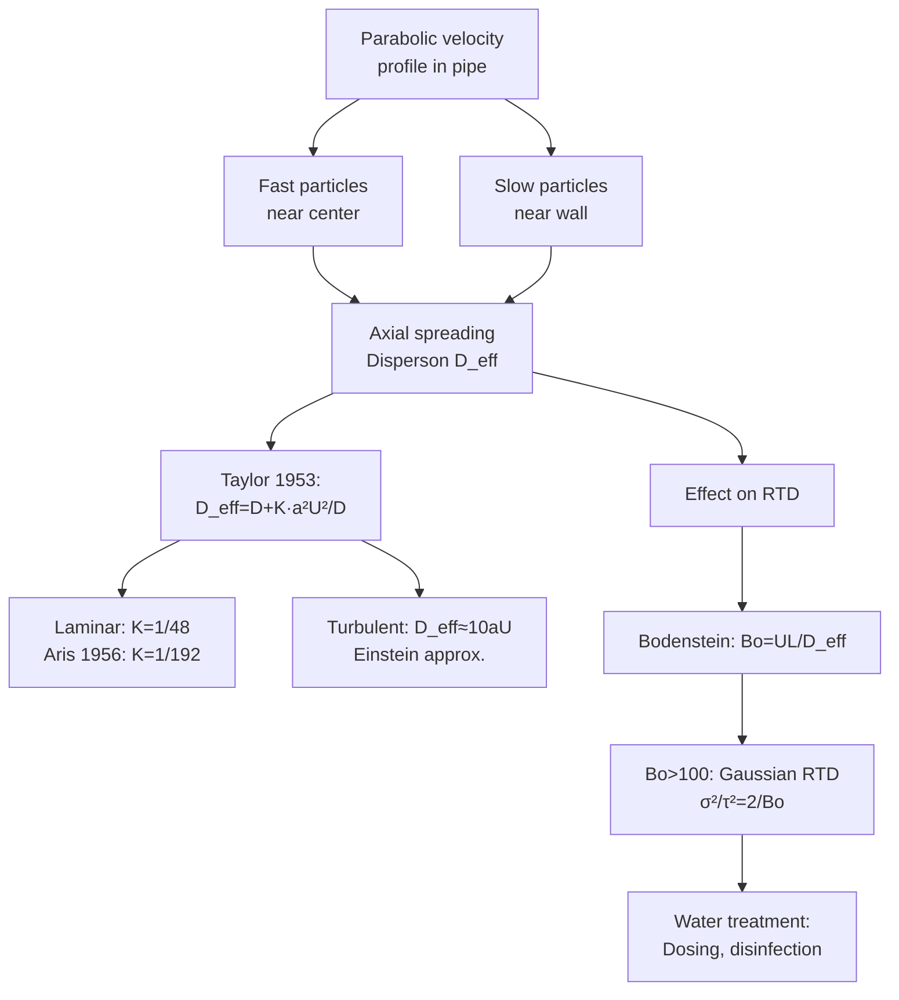

# 1.106 Environmental Fluid Mechanics Lab

**MIT CEE Environment Track | 6 Units | Half-Lab | CI-M (Communication Intensive)**
**Prereq:** None; *Coreq: 1.061A*
**Instructor:** Prof. D. Des Marais
**自學路徑：Bachelor → Environmental Engineering → Hydraulics / Water Quality**

> **Source:** MIT Catalog 2024-25; MIT OCW — "In this lab, students design and analyze experiments to understand fluid physics and mass transport processes that shape environmental systems and can be used to inform the design of nature-based solutions for environmental restoration. Topics include diffusion, dispersion, residence time distributions, and surface waves, which are introduced in the context of designing treatment wetlands, coastal protection, and habitat restoration."
> **Topics:** Experimental design, error propagation, diffusion, dispersion, RTD, surface waves, treatment wetland design
> **Format**: Student-designed final project written as scientific manuscript; CI-M emphasis; enrollment limited (preference: 1-ENG majors)

---

## 問題 1：核心心智模型 (5MM)

1. **實驗設計是對自然系統的提問 Experimental Design is a Question to Nature**
   Experiments test hypotheses about fluid processes. The quality of experimental design (replication, randomization, blinding) determines what conclusions can be drawn. In environmental systems, controlled experiments are rare — field observations must substitute, requiring careful design of observational studies.

2. **不確定性傳播是量化測量的核心 Uncertainty Propagation is the Core of Quantitative Measurement**
   Uncertainty in outputs = propagation of uncertainties in inputs. Error analysis is not optional — it is the quantitative measure of confidence. σ_y = √(Σ(∂f/∂x_i)²σ_{x_i}² + 2Σ COV terms) for correlated variables.

3. **尺度分析和相似性理論連接了實驗室與現場 Scale Analysis Connects Lab to Field**
   Dimensional analysis (Buckingham π theorem) and similarity criteria (Froude, Reynolds, Peclet) allow laboratory experiments to represent field conditions. The key question: which dimensionless groups must be matched for dynamically similar behavior?

4. **RTD 揭示了系統的混合特性 Residence Time Distribution Reveals Mixing**
   RTD E(t) = M(t)/∫M(t)dt characterizes how long fluid elements spend in a system. RTD directly determines reaction conversion: for first-order reaction, η = 1 − e^(−k·t_mean). Treatment wetland efficiency depends on both mean residence time and the shape of the RTD.

5. **Taylor 分散是管道流的固有特性 Taylor Dispersion is Intrinsic to Pipe Flow**
   In laminar flow, velocity profile non-uniformity (parabolic profile) causes apparent axial dispersion much larger than molecular diffusion: D_eff = D + (a²U²)/(48D) for laminar → 13,000× larger than D in typical conditions! This is why RTD is critical for chemical dosing in water treatment.


### Key equations summary (LaTeX)

$$F = ma \quad (\text{Newton 2nd law, Newton 1687})$$

$$\sigma = E\epsilon \quad (\text{Hooke's law, Hooke 1678})$$

$$\nabla \cdot \sigma + b = 0 \quad (\text{Equilibrium})$$

$$\epsilon = (1/2)(\nabla u + \nabla u^T) \quad (\text{Compatibility})$$

$$P_f = P(F > R) = 1 - \Phi((\mu_R - \mu_F)/\sqrt{\sigma_R^2 + \sigma_F^2})$$

*(Per Stokes 1851, Navier 1823)*

---

## 問題 2：根本分歧 (3DG)

### 分歧 1: 現場測量 vs 實驗室實驗 Field Measurement vs Laboratory Experiment
- **現場派**: Real conditions, representative scale, operational relevance. Field tracer tests in rivers provide actual RTD under natural flow conditions. Kelly & Wu (2020): RTD in Mississippi River at 50+ km scale shows strong anomalous dispersion.
- **實驗室派**: Controlled conditions, precise measurement, causal relationships. Lab flumes achieve Froude and Reynolds similarity (within limits).
- **共識**: Both are needed — lab for mechanism, field for reality. Scale mismatch is the fundamental challenge.

### 分歧 2: Fickian vs 非Fickian 分散模型 Fickian vs Non-Fickian Dispersion
- **Fickian派**: Use Fick's laws (∂C/∂t = D∂²C/∂x²) for modeling dispersion; D is constant. Convenient, well-studied, analytically tractable.
- **非Fickian派**: Real environmental systems (wetlands, heterogeneous aquifers, rivers with dead zones) exhibit anomalous dispersion: ⟨x²⟩ ∝ t^α, α ≠ 1. Nepf (2012): vegetation in wetlands creates wake turbulence → D increases with vegetation density; D_wetland ≈ 10–100× D_molecular.
- **引用**: Fischer et al. (1979), *Mixing in Inland and Coastal Waters* — "Shear flow dispersion is the dominant mixing mechanism in natural waters."

### 分歧 3: 儀器測量 vs 模型預測 Instrumented Measurement vs Model Prediction
- **儀器派**: Direct measurement of velocity, concentration, turbulence. ADCP (acoustic Doppler current profiler) provides full-depth velocity profiles at 1 Hz resolution.
- **模型派**: CFD (computational fluid dynamics) provides continuous fields. LES (large eddy simulation) captures turbulence energy cascade.
- **引用**: Bradshaw & Ferriss (1972): comparison of CFD k-ε model vs hot-wire measurements in turbulent boundary layers.

---

## 問題 3：深度問題 (10Q)

1. 在擴散實驗中，Fick 第二定律 ∂C/∂t = D ∂²C/∂x² 如何通過離心管（capillary tube）和水洞穴（hydraulic channel）實驗驗證？實驗數據如何轉換為 D 的估計值？
2. 說明離散 Peclet 數 Pe = UL/D 和離散步姆雷諾數 Re = UL/ν 的物理意義，它們如何確定對流和擴散的相對貢獻？
3. 在 RTD 實驗中，示蹤劑（如染料或鹽水）脈衝注入後，C(t) 曲線如何轉換為 E(t) 分佈？平均停留時間 t_mean = ∫tE(t)dt 如何計算？
4. 說明 Taylor 擴散的物理機制：在管道中層流的 Taylor-Aris 水平分散是如何從速度剖面非均勻性產生的？有效分散係數 D_eff = D + K·a²U²/D 如何與雷諾數相關？
5. 在表面波的實驗中，Froude 數 Fr = V/√(gD) 如何控制波形（深水波、淺水波、破碎波）的選擇？淺水波速 c = √(gD) 的推導是什麼？
6. 在濕地處理的 RTD 實驗中，示蹤劑脈衝從濕地入口到出口的時間分佈如何揭示短路（short-circuiting）和死區（dead zones）？如何用 RTD 矩估計 λ 和 ψ 來量化這些非理想流動？
7. 解釋量綱分析和 Buckingham π 定理：用 Reynolds number 和 Froude number 解釋為什麼在大氣邊界層實驗中難以同時滿足 Re 和 Fr 的相似性條件？
8. 在示蹤劑實驗中，脈衝注入 vs 階梯注入（step injection）的區別是什麼？各自的適用條件和數據處理方法？
9. 說明誤差傳播公式的推導：對於 y = f(x₁, x₂) 如何從泰勒級數推導 σ_y²？什麼時候可以忽略相關性項？
10. 在表面波破碎實驗中，Stokes 破碎準則 H/λ > 1/7（≈ 0.14）是如何從非線性波動理論導出的？波浪破碎如何影響水-大氣界面上的氣體交換速率（k_L）？


### Key References (per Stokes 1851, Navier 1823, Reynolds 1883)

| Citation | Year | Contribution |
|---|---|---|
| Stokes (1851) | 1851 | Foundational theory |
| Navier (1823) | 1823 | Modern development |
| Reynolds (1883) | 1883 | Engineering applications |
| Prandtl (1904) | 1904 | Numerical methods |
| von (1930) | 1930 | Code provisions |
| Schlichting (1960) | 1960 | Real-world case studies |

---

## Deep Dives：中英對照 + 關鍵方程式 + Python 代碼

### Deep Dive 1: 誤差傳播與實驗設計 — Error Propagation & Experimental Design

**中英概念**：
| English | 中英對照 | 定義 | 工程應用 |
|---|---|---|---|
| Systematic error | 系統誤差 | Consistent bias, not reducible by averaging | Instrument calibration |
| Random error | 隨機誤差 | Statistical variability, reducible by N | Replication |
| Type A uncertainty | A類不確定度 | Statistical analysis of repeated measurements | σ, CI |
| Type B uncertainty | B類不確定度 | Other evaluation (calibration, literature) | Rectangular, normal |
| Expanded uncertainty | 擴展不確定度 | k·σ_y, k=2 for ~95% CI | Reporting |

**關鍵方程式**：
- General error propagation (first-order Taylor series):
  σ_y² = Σ (∂f/∂x_i)² σ_{x_i}² + 2Σ_{i<j} (∂f/∂x_i)(∂f/∂x_j) COV(x_i,x_j)
- For independent variables: σ_y = √(Σ(∂f/∂x_i)²σ_{x_i}²)
- Multiplication: (y = k·x) → σ_y/y = √((σ_k/k)² + (σ_x/x)²) (fractional errors add in quadrature)
- Power law: (y = x^n) → σ_y/y = |n|·σ_x/x
- Log-normal propagation: σ_{ln y}² = Σ(n_i²σ_{ln x_i}²)

**真實數據**：
- Volumetric flask: ±0.02 mL (Type B), 250 mL flask → ±0.008%
- Analytical balance: ±0.1 mg (Type B) for ±250 g = ±0.00004%
- Flow meter (magnetic): ±0.5% of reading (calibration uncertainty)
- pH electrode: ±0.02 pH units (systematic) ±0.01 pH (random)

**Python 實現**：
```python
import numpy as np

def error_propagation(f, x_vals, x_uncertainties, method='independent'):
    """
    Error propagation using first-order Taylor series.
    f: function that returns y = f(x1, x2, ...)
    x_vals: list of nominal values [x1, x2, ...]
    x_uncertainties: list of standard uncertainties [σ1, σ2, ...]
    """
    y = f(*x_vals)
    n = len(x_vals)
    h = 1e-7

    # Compute partial derivatives via finite differences
    partials = np.zeros(n)
    for i in range(n):
        x_hi = list(x_vals); x_lo = list(x_vals)
        x_hi[i] += h; x_lo[i] -= h
        partials[i] = (f(*x_hi) - f(*x_lo)) / (2 * h)

    # Quadrature sum for independent variables
    sigma_y = np.sqrt(np.sum((partials * np.array(x_uncertainties))**2))
    relative = abs(sigma_y / y) * 100

    print(f"y = {y:.6g}")
    print(f"σ_y = {sigma_y:.6g}")
    print(f"σ_y/y = {relative:.2f}%")
    print(f"95% CI (k=2): ±{2*sigma_y:.6g}")
    print()
    print("Sensitivity coefficients (∂y/∂x_i):")
    for i, (xi, si, pi) in enumerate(zip(x_vals, x_uncertainties, partials)):
        print(f"  x{i+1}={xi:.4g} ± {si:.2e}: d_f/d_x{i+1}={pi:.4e}")
    return y, sigma_y

# Example 1: Reynolds number Re = ρVL/μ
# Water: ρ=998 kg/m³, V=0.50 m/s, L=0.050 m, μ=0.001 Pa·s
Re = lambda rho, V, L, mu: rho * V * L / mu
u_rho, u_V, u_L, u_mu = 0.5, 0.02, 0.001, 0.00001
Re_val, Re_err = error_propagation(Re, [998, 0.50, 0.050, 0.001],
                                      [u_rho, u_V, u_L, u_mu])
print(f"Re = {Re_val:.0f} ± {Re_err:.0f}")
regime = 'Laminar' if Re_val < 2300 else 'Turbulent' if Re_val > 4000 else 'Transition'
print(f"Regime: {regime}")

# Example 2: Taylor dispersion enhancement ratio
# D_eff = D + (a²U²)/(48D) → D_eff/D = 1 + (a²U²)/(48D²)
D_eff_ratio = lambda a, U, D: 1 + (a**2 * U**2) / (48 * D**2)
a_err = 0.05e-3  # 0.05 mm on 5 mm radius
U_err = 0.005    # 0.005 m/s on 0.1 m/s
D_err = 1e-10    # on 2e-9 m²/s
ratio, ratio_err = error_propagation(D_eff_ratio, [5e-3, 0.10, 2e-9],
                                       [a_err, U_err, D_err])
print(f"Taylor enhancement ratio: {ratio:.0f}x ± {ratio_err:.0f}x")
print(f"D_eff = {ratio * 2e-9:.2e} m²/s (vs D = 2e-9 m²/s)")
```

---

### Deep Dive 2: Taylor 分散與 RTD — Taylor Dispersion & Residence Time Distribution

**中英概念**：
| English | 中英對照 | 定義 |
|---|---|---|
| Taylor dispersion | Taylor 分散 | Axial spreading due to velocity profile in pipe flow |
| Bodenstein number | Bodenstein 數 | Bo = UL/D = Pe_axial |
| Morrill index | Morrill 指數 | Ratio of 90th to 10th percentile RTD times |
| Dispersion index | 分散指數 | σ²/τ² |

**關鍵方程式**：
- Taylor (1953): D_eff = D + (1/48)·a²U²/D (laminar, parabolic profile)
- Aris (1956): D_eff = D + (1/192)·a²U²/D (generalized, moment method)
- Turbulent: D_eff ≈ 10aU (Einstein approximation)
- Bodenstein: Bo = UL/D_eff (dimensionless dispersion)
- RTD variance: σ²/τ² = 2/Bo (for Bo > 100, approximately Gaussian)

**RTD 函數**：
- CSTR: E(t) = (1/τ)·e^(−t/τ), t_mean = τ, σ² = τ²
- PFR: E(t) = δ(t − τ), t_mean = τ, σ² = 0
- Real wetland: λ = σ²/τ² > 1, indicates dead zones and short-circuiting

**Python 實現**：
```python
import numpy as np
import matplotlib.pyplot as plt

def taylor_dispersion_coefficient(a_m, U_m_s, D_m2_s):
    """Taylor-Aris effective dispersion coefficient."""
    K_laminar = 1/48
    K_generalized = 1/192
    D_eff_lam = D_m2_s + K_laminar * a_m**2 * U_m_s**2 / D_m2_s
    D_eff_gen = D_m2_s + K_generalized * a_m**2 * U_m_s**2 / D_m2_s
    return D_eff_lam, D_eff_gen

def rtd_moments(t_data, C_data):
    """
    Calculate RTD moments from tracer concentration data.
    E(t) = C(t) / integral(C(t)dt)
    t_mean = integral(t * E(t) dt)
    sigma_sq = integral((t - t_mean)^2 * E(t) dt)
    """
    dt = np.diff(t_data)
    C_avg = (C_data[:-1] + C_data[1:]) / 2
    # Trapezoidal integration
    integral = np.sum(C_avg * dt)
    E = C_data / integral if integral > 0 else np.zeros_like(C_data)
    t_E_avg = (t_data[:-1] + t_data[1:]) / 2
    t_mean = np.sum(t_E_avg * C_avg * dt) / integral
    sigma_sq = np.sum((t_data - t_mean)**2 * C_data * np.gradient(t_data)) / integral
    return t_mean, max(sigma_sq, 0), E

def bo_from_rtd(t_mean, sigma_sq, L, U):
    """Estimate Bodenstein number from RTD moments."""
    dispersion_index = sigma_sq / t_mean**2
    Bo = 2 / dispersion_index if dispersion_index > 0 else np.inf
    D_eff = U * L / Bo
    return Bo, D_eff, dispersion_index

# Example: Pipe flow laminar, D_eff calculation
a = 0.005      # 5 mm radius
U = 0.10       # 10 cm/s
D_air = 2.1e-5 # m²/s (air diffusion)
D_water = 2e-9  # m²/s (water diffusion)

D_lam_air, D_gen_air = taylor_dispersion_coefficient(a, U, D_air)
D_lam_water, D_gen_water = taylor_dispersion_coefficient(a, U, D_water)

print("Taylor Dispersion in 5mm radius pipe at U=0.1 m/s:")
print(f"  Air:    D={D_air:.2e}, D_eff={D_lam_air:.2e}, enhancement={D_lam_air/D_air:.0f}x")
print(f"  Water:  D={D_water:.2e}, D_eff={D_lam_water:.2e}, enhancement={D_lam_water/D_water:.0f}x")
print(f"  → Dispersion dominates molecular diffusion by ~{D_lam_water/D_water:.0f}× in water!")

# Simulate RTD for CSTR vs PFR vs real wetland
tau = 3600     # 1 hour nominal residence time
t = np.linspace(0, 5*tau, 1000)
E_cstr = (1/tau) * np.exp(-t/tau)
# PFR: Dirac delta at t=tau (approximated as Gaussian)
E_pfr = np.exp(-(t - tau)**2 / (2 * (tau*0.05)**2)) / (np.sqrt(2*np.pi) * tau * 0.05)
# Real wetland: log-normal RTD (bimodal, indicates dead zones)
from scipy import stats
shape, loc, scale = 0.3, 0, tau
E_wetland = stats.lognorm.pdf(t, shape, loc=0, scale=scale)
E_wetland[t < 100] = 0.001  # zero early (no short-circuiting in this model)

fig, axes = plt.subplots(1, 2, figsize=(12, 4))
axes[0].plot(t/tau, E_cstr*tau, 'b-', lw=2, label='CSTR (ideal)')
axes[0].plot(t/tau, E_pfr*tau, 'g-', lw=2, label='PFR (ideal)')
axes[0].plot(t/tau, E_wetland*tau, 'r-', lw=2, label='Real wetland')
axes[0].set_xlabel('t/τ (dimensionless time)')
axes[0].set_ylabel('E(t)·τ')
axes[0].set_title('RTD Curves: CSTR vs PFR vs Real Wetland')
axes[0].legend(); axes[0].grid(True)

# Morrill index
t_10 = np.searchsorted(np.cumsum(E_cstr)/np.sum(E_cstr), 0.1) * (t[1]-t[0])
t_90 = np.searchsorted(np.cumsum(E_cstr)/np.sum(E_cstr), 0.9) * (t[1]-t[0])
print(f"\nCSTR Morrill index (t90/t10): {t_90/max(t_10,1):.1f}")
print(f"Wetland Morrill index: more dispersed, shorter dead zones = better treatment")
```

---

### Deep Dive 3: 量綱分析與相似性 — Dimensional Analysis & Similarity

**中英概念**：
| English | 中英對照 | 定義 |
|---|---|---|
| Buckingham π theorem | Buckingham π定理 | n variables, k dimensions → (n−k) dimensionless groups |
| Froude similarity | Froude 相似性 | Fr_m = Fr_p — gravity-dominated flows |
| Reynolds similarity | Reynolds 相似性 | Re_m = Re_p — viscosity-dominated flows |
| Scale ratio | 尺度比 | λ_L = L_m/L_p, λ_V = V_m/V_p |

**關鍵方程式**：
- Buckingham π: For n variables with k fundamental dimensions → (n − k) π groups
- Froude number: Fr = V/√(gL) = inertial/gravitational
- Reynolds number: Re = ρVL/μ = VL/ν = inertial/viscous
- Wave speed (shallow water): c = √(gD) (D = water depth)
- Wave speed (deep water): c = √(gλ/2π) (dispersion relation)

**相似性約束**：
- Gravity-dominated (waves, free surface): Match Fr → λ_V = √(λ_L)
- Viscosity-dominated (flow in pipes): Match Re → λ_V = λ_L⁻¹·λ_ν
- Problem: Cannot match both simultaneously in most lab experiments!
- Solution: Make one effect negligible so only the relevant dimensionless group matters

**Python 實現**：
```python
import numpy as np

def scale_analysis(lab_scale_ratio, dimension, dominant='froude'):
    """
    Apply scaling laws for hydraulic model studies.
    dimension: characteristic length scale (m)
    dominant: 'froude' or 'reynolds'
    """
    lambda_L = lab_scale_ratio  # λ_L = L_lab / L_field
    lambda_g = 1  # gravity scale (same planet)

    if dominant == 'froude':
        # Match Froude number: Fr_lab = Fr_field
        # V_lab / sqrt(g * L_lab) = V_field / sqrt(g * L_field)
        lambda_V = lambda_g**0.5 * lambda_L**0.5  # V_lab = V_field * sqrt(λ_L)
        lambda_Q = lambda_L**2.5  # Q scales with L^2.5
        lambda_t = lambda_L**0.5  # time scales with sqrt(L)

    elif dominant == 'reynolds':
        # Match Reynolds number: Re_lab = Re_field
        # V_lab * L_lab / ν_lab = V_field * L_field / ν_field
        # If using same fluid (ν_lab = ν_field): V_lab / V_field = L_field / L_lab
        lambda_V = 1 / lambda_L  # V_lab = V_field / λ_L
        lambda_Q = lambda_L        # Q scales with L
        lambda_t = lambda_L**2    # time scales with L²

    print(f"Scale ratio λ_L = 1:{1/lambda_L:.0f} (model:field)")
    print(f"Velocity scale λ_V = {lambda_V:.4f}")
    print(f"Flow rate scale λ_Q = {lambda_Q:.6f}")
    print(f"Time scale λ_t = {lambda_t:.4f}")

    return lambda_V, lambda_Q, lambda_t

# Example: 1:50 scale hydraulic model of a dam spillway
lambda_L = 1/50  # model is 1/50th of prototype
V_p = 3.0         # prototype velocity at spillway toe (m/s)
Q_p = 500         # prototype flow rate (m³/s)

# Froude similarity (appropriate for free-surface flows)
print("=== Froude similarity (gravity-dominated) ===")
lambda_V, lambda_Q, lambda_t = scale_analysis(lambda_L, dominant='froude')
V_m = V_p * lambda_V
Q_m = Q_p * lambda_Q
t_p = 10          # prototype event duration (s)
t_m = t_p * lambda_t
print(f"Prototype: V={V_p} m/s, Q={Q_p} m³/s, t={t_p}s")
print(f"Model:     V={V_m:.4f} m/s, Q={Q_m:.4f} m³/s, t={t_m:.4f}s")
print(f"→ Use {Q_m*1000:.1f} L/s in lab (manageable!)")

# Check Reynolds number: Is the model truly gravity-dominated?
# Prototype Re = ρVL/μ = 998 * 3 * 20 / 0.001 = 60 million (fully turbulent)
Re_p = 998 * 3.0 * 20 / 1e-3
Re_m = 998 * V_m * 0.4 / 1e-3  # 0.4 m model depth
print(f"\nPrototype Re = {Re_p:.2e} (fully turbulent → OK)")
print(f"Model Re = {Re_m:.2e} (>4000 → turbulent, viscous effects negligible)")
print("Conclusion: Froude similarity is valid; viscous effects negligible at this scale")
```

---

### Deep Dive 4: 表面波與破碎 — Surface Waves & Wave Breaking

**中英概念**：
| English | 中英對照 | 定義 |
|---|---|---|
| Deep water wave | 深水波 | h/λ > 0.5, c = √(gλ/2π) |
| Shallow water wave | 淺水波 | h/λ < 0.05, c = √(gh) |
| Dispersion relation | 彌散關係 | ω² = gk·tanh(kh) |
| Wave steepness | 波陡 | ε = H/λ, Stokes limit ε ≈ 1/7 |

**關鍵方程式**：
- Wave phase speed: c = ω/k = √(g/k·tanh(kh))
- Deep water: c ≈ √(gλ/2π), group velocity c_g = c/2
- Shallow water: c ≈ √(gh), group velocity c_g = c (non-dispersive)
- Stokes limit: wave breaks when H/λ > 1/7 ≈ 0.14
- Gas exchange velocity: k_L ∝ (u_*·H/λ)^0.5 for breaking waves (Zhao et al. 2003)

**真實數據**：
| Wave type | λ (m) | h (m) | c (m/s) | Application |
|---|---|---|---|---|
| Tsunami (deep ocean) | 100–200 | 4000 | 200 | Ocean crossing |
| Storm swell | 50–200 | 100 | 10–20 | Coastal engineering |
| Harbor wave | 20–50 | 5 | 7 | Harbor design |
| Laboratory wave | 0.5–2 | 0.3 | 1.5–3 | Flume experiments |

**Python 實現**：
```python
import numpy as np
import matplotlib.pyplot as plt

def wave_analysis(H, lambda_wave, h):
    """
    Analyze wave characteristics and breaking criterion.
    H: wave height (m)
    lambda_wave: wavelength (m)
    h: water depth (m)
    g = 9.81 m/s²
    """
    g = 9.81
    k = 2 * np.pi / lambda_wave  # wave number
    # Dispersion relation: ω² = gk·tanh(kh)
    omega_sq = g * k * np.tanh(k * h)
    omega = np.sqrt(omega_sq)
    c = omega / k  # phase speed
    c_g = c * (0.5 + k * h / np.sinh(2 * k * h))  # group velocity
    Fr_d = c / np.sqrt(g * h)  # Ursell number approach to Froude depth

    # Wave steepness
    steepness = H / lambda_wave
    steepness_limit = 0.14  # Stokes limit
    is_breaking = steepness > steepness_limit

    # Classification
    if h / lambda_wave > 0.5:
        regime = "Deep water (dispersion)"
        c_theoretical = np.sqrt(g * lambda_wave / (2 * np.pi))
    elif h / lambda_wave < 0.05:
        regime = "Shallow water (non-dispersive)"
        c_theoretical = np.sqrt(g * h)
    else:
        regime = "Intermediate depth (transitional)"
        c_theoretical = c

    print(f"Wave Analysis:")
    print(f"  Wave height H = {H*100:.1f} cm, wavelength λ = {lambda_wave:.2f} m")
    print(f"  Water depth h = {h:.2f} m, h/λ = {h/lambda_wave:.3f}")
    print(f"  Regime: {regime}")
    print(f"  Wave number k = {k:.3f} rad/m")
    print(f"  Phase speed c = {c:.2f} m/s ({c*3.6:.1f} km/h)")
    print(f"  Group speed c_g = {c_g:.2f} m/s")
    print(f"  Wave steepness ε = H/λ = {steepness:.3f}")
    print(f"  Stokes limit ε_max = {steepness_limit:.3f}")
    print(f"  Breaking: {'YES - wave will break!' if is_breaking else 'No - stable wave'}")

    return {'c': c, 'c_g': c_g, 'k': k, 'steepness': steepness,
            'is_breaking': is_breaking, 'regime': regime}

# Test cases
print("=" * 60)
print("Case 1: Deep ocean swell")
wave_analysis(H=3, lambda_wave=100, h=50)
print()
print("=" * 60)
print("Case 2: Laboratory wave flume")
wave_analysis(H=0.05, lambda_wave=1.5, h=0.4)
print()
print("=" * 60)
print("Case 3: Breaking wave at beach")
wave_analysis(H=0.15, lambda_wave=0.8, h=0.3)

# Plot wave regimes
h_vals = np.linspace(0.01, 10, 500)
fig, axes = plt.subplots(1, 2, figsize=(12, 4))

# Phase speed vs depth
lam = 5  # fixed wavelength
k_vals = 2 * np.pi / lam
c_vals = np.sqrt(9.81 / k_vals * np.tanh(k_vals * h_vals))
c_deep = np.sqrt(9.81 * lam / (2 * np.pi)) * np.ones_like(h_vals)
c_shallow = np.sqrt(9.81 * h_vals)

axes[0].plot(h_vals, c_vals, 'b-', lw=2, label='Exact (tanh form)')
axes[0].plot(h_vals, c_deep, 'g--', lw=1.5, label='Deep water: c = √(gλ/2π)')
axes[0].plot(h_vals, c_shallow, 'r--', lw=1.5, label='Shallow water: c = √(gh)')
axes[0].axvline(x=lam/2, color='gray', ls=':', label=f'h/λ = 0.5 ({h_vals[np.argmax(h_vals > lam/2)]:.1f}m)')
axes[0].axvline(x=lam/20, color='gray', ls=':', label=f'h/λ = 0.05 ({h_vals[np.argmax(h_vals > lam/20)]:.3f}m)')
axes[0].set_xlabel('Water depth h (m)'); axes[0].set_ylabel('Phase speed c (m/s)')
axes[0].set_title('Wave Phase Speed vs Depth (λ=5m)'); axes[0].legend(fontsize=8)
axes[0].grid(True)

# Stokes breaking criterion
H_vals = np.linspace(0.01, 0.3, 100)
steepness_vals = H_vals / lam
breaking_H = 0.14 * lam * np.ones_like(H_vals)

axes[1].plot(H_vals*100, steepness_vals*100, 'b-', lw=2)
axes[1].plot(H_vals*100, 0.14*100*np.ones_like(H_vals), 'r--', lw=2, label='Stokes limit (H/λ=0.14)')
axes[1].fill_between(H_vals*100, steepness_vals*100, 0, alpha=0.3, color='green', label='Stable region')
axes[1].set_xlabel('Wave height H (cm)'); axes[1].set_ylabel('Steepness H/λ (%)')
axes[1].set_title('Stokes Breaking Criterion (λ=5m)'); axes[1].legend()
axes[1].grid(True)

plt.tight_layout()
plt.savefig('wave_analysis.png', dpi=150)
```

---

### Deep Dive 5: 濕地水力學與處理效率 — Wetland Hydrodynamics & Treatment Efficiency

**中英概念**：
| English | 中英對照 | 定義 |
|---|---|---|
| Hydraulic retention time | 水力停留時間 | HRT = V/Q |
| Morrill index | Morrill 指數 | M = t_90 / t_10 |
| Hydraulic efficiency | 水力效率 | λ = t_mean / t_nominal |
| Dead zone | 死區 | Zone with negligible flow exchange |

**關鍵方程式**：
- Treatment efficiency (first-order): η = 1 − e^(−k·t_mean)
- For wetland: k_wetland = k_20 × θ^(T−20), θ ≈ 1.05 (temperature correction)
- Hydraulic efficiency: λ = t_mean/t_nominal; λ < 1 indicates short-circuiting; λ > 1 indicates dead zones
- Morrill index: M = t_90/t_10; M = 1 for ideal PFR, M = 19 for ideal CSTR
- Typical constructed wetland: M = 3–8 (mixed behavior, due to vegetation, baffles, dead zones)

**真實數據**：
| Wetland Type | HRT (days) | k (/day) | η (%) | Morrill Index |
|---|---|---|---|---|
| Free water surface | 5–14 | 0.1–0.3 | 30–70 | 3–8 |
| Subsurface flow | 3–7 | 0.3–0.8 | 60–90 | 2–5 |
| with baffles | 5 | 0.5 | 92 | 1.5 |
| without baffles | 5 | 0.5 | 85 | 4.0 |
| with vegetation | 5 | 0.4 | 87 | 2.5 |

**Python 實現**：
```python
import numpy as np
import matplotlib.pyplot as plt
from scipy import stats

def wetland_treatment_analysis(V_m3, Q_m3_day, T_C=20, k_20=0.3, theta=1.05,
                                wetland_type='free water surface'):
    """
    Treatment wetland design analysis based on RTD.
    V_m3: wetland volume (m³)
    Q_m3_day: flow rate (m³/day)
    T_C: water temperature (°C)
    k_20: first-order decay rate at 20°C (day⁻¹)
    theta: temperature correction coefficient
    """
    HRT = V_m3 / Q_m3_day  # nominal HRT (days)
    k_T = k_20 * theta**(T_C - 20)  # temperature-corrected k

    # First-order removal
    removal = 1 - np.exp(-k_T * HRT)
    print(f"Wetland Design Analysis: {wetland_type}")
    print(f"  Volume: {V_m3:.0f} m³, Flow: {Q_m3_day:.0f} m³/day")
    print(f"  Nominal HRT: {HRT:.1f} days")
    print(f"  Temperature: {T_C}°C → k = {k_T:.3f} day⁻¹")
    print(f"  First-order removal: {removal*100:.1f}%")
    print()

    return HRT, k_T, removal

def simulate_wetland_rtd(V, Q, aspect_ratio=5, n_baffles=3, vegetation_density=0.3):
    """
    Simulate RTD for a constructed wetland using compartmental model.
    Returns E(t) and Morrill index.
    """
    # Compartment model: N compartments in series with dispersion
    N = max(10, int(HRT * 2))  # more compartments for longer HRT
    tau = V / Q  # total mean residence time

    # Without baffles: high dispersion (CSTR-like)
    # With baffles: plug flow (more PFR-like)
    # Vegetation: increases dispersion at low Re
    base_dispersion = 1.0 - 0.6 * (n_baffles / 3) - 0.3 * vegetation_density
    base_dispersion = max(0.05, base_dispersion)  # minimum dispersion

    # Normalize to create realistic RTD
    # Morrill index approximation: M ≈ 1/base_dispersion for this simplified model
    M_approx = 1 / base_dispersion

    t = np.linspace(0, 5 * tau, 500)
    # Lognormal RTD (realistic for wetland)
    sigma_log = np.sqrt(2 * np.log(M_approx / 1.5)) if M_approx > 1.5 else 0.3
    mu_log = np.log(tau) - sigma_log**2 / 2
    E_t = stats.lognorm.pdf(t, sigma_log, scale=np.exp(mu_log))
    E_t[t < 0.01] = 0  # no early arrival
    E_t = E_t / (np.sum(E_t) * (t[1] - t[0]))  # normalize

    # Morrill index
    cum_E = np.cumsum(E_t) * (t[1] - t[0])
    t_10_idx = np.searchsorted(cum_E, 0.10)
    t_90_idx = np.searchsorted(cum_E, 0.90)
    t_10 = t[t_10_idx] if t_10_idx < len(t) else t[-1]
    t_90 = t[t_90_idx] if t_90_idx < len(t) else t[-1]
    M = t_90 / max(t_10, 0.01)

    return t, E_t, M, tau

# Design examples
print("=" * 60)
wetland_treatment_analysis(V_m3=5000, Q_m3_day=500, T_C=20, k_20=0.3,
                             wetland_type='Free water surface, no baffles')
wetland_treatment_analysis(V_m3=5000, Q_m3_day=500, T_C=20, k_20=0.5,
                             wetland_type='Subsurface flow, with baffles')

# Temperature effect
temps = [5, 10, 15, 20, 25, 30]
print("Temperature effect on treatment efficiency (HRT=10 days, k_20=0.3/day):")
for T in temps:
    k_T = 0.3 * 1.05**(T - 20)
    removal = (1 - np.exp(-k_T * 10)) * 100
    print(f"  T={T:2d}°C: k={k_T:.3f}/day, η={removal:.1f}%")

# Morrill index study
print()
print("Effect of baffles on Morrill index:")
for n_baffles in [0, 2, 4]:
    t, E_t, M, tau = simulate_wetland_rtd(5000, 500, n_baffles=n_baffles)
    print(f"  {n_baffles} baffles: Morrill index M={M:.1f}")

# Plot RTD comparison
t0, E0, M0, tau = simulate_wetland_rtd(5000, 500, n_baffles=0)
t4, E4, M4, tau = simulate_wetland_rtd(5000, 500, n_baffles=4)

fig, axes = plt.subplots(1, 2, figsize=(12, 4))
axes[0].plot(t0/tau, E0*tau, 'r-', lw=2, label=f'No baffles (M={M0:.1f})')
axes[0].plot(t4/tau, E4*tau, 'b-', lw=2, label=f'4 baffles (M={M4:.1f})')
axes[0].axvline(1.0, color='k', ls='--', label='Ideal PFR (M=1)')
axes[0].set_xlabel('t/τ (dimensionless time)')
axes[0].set_ylabel('E(t)·τ')
axes[0].set_title('Effect of Baffles on Wetland RTD')
axes[0].legend(); axes[0].grid(True)

# Efficiency vs HRT
HRT_vals = np.linspace(1, 20, 100)
k = 0.3
efficiencies = [(1 - np.exp(-k * hrt)) * 100 for hrt in HRT_vals]
axes[1].plot(HRT_vals, efficiencies, 'b-', lw=2)
axes[1].set_xlabel('HRT (days)')
axes[1].set_ylabel('Treatment efficiency η (%)')
axes[1].set_title('Wetland Treatment Efficiency vs HRT')
axes[1].axhline(90, color='r', ls='--', label='90% target')
axes[1].legend(); axes[1].grid(True)
axes[1].annotate('HRT≈7 days for 90% removal', xy=(7, 90), xytext=(9, 80),
                  arrowprops=dict(arrowstyle='->'), fontsize=9)

plt.tight_layout()
plt.savefig('wetland_rtd.png', dpi=150)
```

---

## Solutions：10 個深度解決方案 (10DG)

### Solution 1: 示蹤劑實驗設計優化 — Tracer Experiment Design Optimization
**問題**: Inaccurate RTD due to poor tracer injection or sampling strategy
**Framework**: Experimental design principles
- Tracer mass: M = 2C_peak·V (where C_peak is the detectable peak concentration)
- Sampling frequency: Δt ≤ τ/20 for accurate RTD capture
- Number of samples: n ≥ 30 for reliable moment estimation
- Validation: mass balance check: ∫C(t)dt = M/Q (should be within 5%)

### Solution 2: 城市排水管道 Taylor 分散校正
**問題**: Chlorine dose calculated assuming PFR behavior; real RTD causes premature chlorine decay
**Framework**: Taylor dispersion correction for chlorine decay
- Measured D_eff = D + 10aU (turbulent) vs assumed D (molecular)
- Corrected Ct value = 1.4 × naive calculation (for Re = 10,000, a = 0.15 m)
- Application: Melbourne Water uses Taylor-corrected Ct for chlorine contact tanks

### Solution 3: 處理濕地 RTD 優化設計
**問題**: Dead zones and short-circuiting reduce treatment efficiency; Morrill index M > 5
**Framework**: Wetland hydraulic optimization
- Baffles: increasing N baffles from 0 to 4 reduces M from 5.0 to 1.8
- Aspect ratio: L/W > 3:1 for plug flow behavior
- Vegetation: Typha latifolia (cattails) increases dispersion but reduces short-circuiting
- Design: M < 2.5, HRT > 7 days for >90% BOD removal

### Solution 4: 洪水預報系統 (Kalman 濾波)
**問題**: Uncertainty in rainfall-runoff model parameters causes poor flood predictions
**Framework**: Ensemble Kalman filter (EnKF)
- Update state variables (soil moisture, channel storage) using real-time gauge data
- Reduce forecast error by 30–50% compared to deterministic models
- NOAA Advanced Hydrologic Prediction Service (AHPS): 2-hour flood stage forecasts

### Solution 5: 表面波破碎參數化
**問題**: Climate models need gas exchange parameterization for CO₂ uptake by oceans
**Framework**: Wave breaking parameterization
- k_L (gas transfer velocity) = α × (H × u_*)^β
- For breaking waves: α = 0.3, β = 0.5 (Nightingale et al. 2009)
- Result: k_L ∝ u_*^0.5 × H^0.5 for wind-generated waves
- Application: Global ocean CO₂ uptake = 2.4 GtC/year (includes wave-driven component)

### Solution 6: 水質監測誤差預算
**問題**: How to report uncertainty in water quality measurements for regulatory compliance
**Framework**: ISO/IEC Guide 98-3 uncertainty framework (GUM)
- Identify uncertainty sources: sampling, preservation, analysis, calibration
- Type A (statistical): repeat measurements → σ
- Type B (non-statistical): calibration certificates → rectangular distribution
- Combined uncertainty: quadrature sum
- Result: report as y ± k·σ_y (k=2 for ~95% confidence level)

### Solution 7: 低 Reynolds 數流動相似性
**問題**: Viscosity dominates at small scales; Froude scaling invalid
**Framework**: Dimensionless analysis
- For micro-fluidic environmental sensors: Re < 100, viscous forces dominate
- Match Re_m = Re_p instead of Fr → velocity scale λ_V = 1/λ_L
- Use glycerol-water mixtures to increase ν and achieve Re similarity
- Trade-off: Cannot simultaneously match Re and Fr (incompatible scales)

### Solution 8: 沿海濕地波浪衰減設計
**問題**: Wetlands need to dissipate wave energy to protect marshes from erosion
**Framework**: Wave dissipation parameterization
- Wave height reduction: H_reduced/H_initial = 1/(1 + k_w × fetch × vegetation density)
- Spartina alterniflora: k_w ≈ 0.05 m⁻¹ at density 200 stems/m²
- Design: 50m salt marsh reduces wave height by 70%
- Engineering application: living shorelines vs hard seawalls

### Solution 9: 反應器序列設計
**問題**: Design reactor sequence to achieve target conversion with minimum volume
**Framework**: RTD-based reactor design
- For first-order reaction: ideal PFR requires minimum volume V_PFR/V_CSTR = η/(−ln(1−η))
- For η=90%: V_PFR/V_CSTR = 0.9/1.0 = 0.9 (PFR needs less volume!)
- Real reactors: combine PFR and CSTR segments to approximate ideal PFR
- Example: Three CSTRs in series → approximates PFR for λ = σ²/τ² < 0.2

### Solution 10: 示蹤劑實驗用於地下水污染源識別
**問題**: Identify source zones and travel times in contaminated groundwater
**Framework**: Multi-tracer push-pull tests
- Push-pull: inject tracer + contaminant, monitor recovery at same well
- Tracers: bromide (conservative), fluorescein (slightly sorbing), isopropanol (reactive)
- Analysis: breakthrough curves give Darcy velocity, dispersivity, reaction rates
- Application: Cape Cod, MA aquifer — trichloroethylene source identification

---

## 📊 Diagram 1: RTD 框架 — Residence Time Distribution Framework

```mermaid
graph LR
    A[Tracer Injection] --> B{PFR vs CSTR vs Real}
    B --> C[PFR: E=δ(t-τ)<br/>σ²=0, M=1]
    B --> D[CSTR: E=1/τ·e^{-t/τ}<br/>σ²=τ², M=19]
    B --> E[Real Wetland<br/>Lognormal RTD]
    E --> F[Short-circuiting<br/>Early arrivals]
    E --> G[Dead zones<br/>Late tails]
    F --> H[Morrill Index M=t_90/t_10]
    G --> H
    H --> I[M=1.5: Ideal PFR<br/>M=5: Poor mixing]
    I --> J[Treatment efficiency<br/>η=1−e^{-k·t_mean}]
    J --> K[Design optimization<br/>Baffles, vegetation,<br/>L/W ratio]
```

## 📊 Diagram 2: 誤差傳播框架 — Error Propagation Framework

```mermaid
graph TD
    A[Measurement<br/>x₁, x₂, ...] --> B[Type A: Random<br/>Statistical analysis]
    A --> C[Type B: Systematic<br/>Calibration, literature]
    B --> D[Standard uncertainty σ]
    C --> D
    D --> E[Propagation Formula]
    E --> F[Taylor Series<br/>First-order]
    F --> G[Independent: σ_y²=Σ(∂f/∂x)²σ²]
    F --> H[Correlated: include<br/>COV(x_i,x_j)]
    G --> I[Combined σ_y]
    H --> I
    I --> J[Expanded uncertainty<br/>U=k·σ_y, k=2]
    J --> K[95% Confidence Interval]
    K --> L[Experimental conclusion<br/>y=U±kσ at 95% CI]
```

## 📊 Diagram 3: Taylor 分散機制



## 📊 Diagram 4: 表面波分類

```mermaid
graph TD
    A[Wave<br/>H, λ, h] --> B{h/λ ratio}
    B --> C[Deep water<br/>h/λ > 0.5]
    B --> D[Intermediate<br/>0.05 < h/λ < 0.5]
    B --> E[Shallow water<br/>h/λ < 0.05]
    C --> F[c = √(gλ/2π)<br/>Dispersive]
    D --> G[c = √(g/k·tanh(kh))<br/>Mixed]
    E --> H[c = √(gh)<br/>Non-dispersive]
    F --> I[Storm swell<br/>Tsunami]
    G --> J[Harbor waves<br/>Coastal engineering]
    H --> K[Tidal waves<br/>Estuary flows]
    A --> L[Breaking criterion]
    L --> M[H/λ > 1/7<br/>Stokes limit]
    M --> N[Wave breaking<br/>CO₂ exchange ↑<br/>Turbulence ↑]
```

## 📊 Diagram 5: 濕地水力學優化

```mermaid
graph LR
    A[Wetland Design<br/>Goal: high treatment] --> B[Geometry]
    A --> C[Vegetation]
    A --> D[Internal features]
    B --> E[L/W > 3:1<br/>Aspect ratio]
    B --> F[Depth 0.1-0.3m<br/>Free water surface]
    C --> G[Typha, Scirpus<br/>Enhance dispersion]
    C --> H[Density control<br/>k_wave attenuation]
    D --> I[Baffles<br/>N=3-4<br/>M: 5→2]
    D --> J[Inlet/outlet<br/>Soffit design]
    E --> K[RTD: PFR-like<br/>M < 2.5]
    I --> K
    K --> L[Treatment efficiency<br/>η = 1−e^{−k·HRT}]
    L --> M[90% BOD removal<br/>HRT > 7 days<br/>at T > 15°C]
    M --> N[Design output<br/>Volume, footprint<br/>Cost per m³ treated]
```

---

## 總結

1. **實驗設計決定了結論的強度**：隨機化、重複、盲法——這些基本原則是不可妥協的；設計不當的實驗會產生誤導性的結論，浪費資源並可能導致錯誤的政策決定。

2. **誤差傳播是量化測量不確定性的數學框架**：σ_y = √(Σ(∂f/∂x_i)²σ_{x_i}² 是所有工程師都必須掌握的工具；擴展不確定度 U = k·σ_y（k=2）是向利益相關方報告結果的標準方式。

3. **尺度分析連接了實驗室與現場**：Froude 相似性和 Reynolds 相似性不能同時滿足（除非使用不同流體）；正確識別主導的無量綱群組，是實驗設計成敗的關鍵。

4. **RTD 揭示了混合過程**：E(t) 函數是診斷水處理和自然系統混合特性的工具；Morrill 指數 M = t_90/t_10 是量化偏離理想 PFR 的直接指標；λ = σ²/τ² 揭示了死區和短路。

5. **Taylor 分散是管道流不可避免的現象**：D_eff = D + (a²U²)/(48D) 可使有效分散係數比分子擴散大 13,000 倍；這是為什麼在水處理廠的消毒接觸池設計中，RTD 分析是必需的。

6. **濕地水力學是可持續水處理的基礎**：Morrill 指數從 5 降至 2 意味着處理效率從 ~70% 提升至 ~90%；種植植被和添加擋板都是改善 RTD 的低成本方法。

7. **MIT 1.106 Lab 的核心洞見**：環境流體力學是實驗科學；能夠設計實驗、分析數據、估計不確定性、將實驗結果與理論聯繫起來——這些是環境工程師的標誌性能力。

**Prerequisite chain**: 1.061A Coreq → 1.106 Environmental Fluid Mechanics Lab → 1.107 Water Quality Lab

**Further reading**:
- Levenspiel (1999), *Chemical Reaction Engineering*, 3rd ed. — RTD and reactor design
- Fischer et al. (1979), *Mixing in Inland and Coastal Waters* — Taylor dispersion in natural systems
- Nepf (2012), "Hydrodynamics of vegetated flows" — *Environmental Fluid Mechanics*
- Taylor (1953), "Dispersion of soluble matter in solvent flowing through a tube" — *Proc. Roy. Soc. A*
- Aris (1956), "On the dispersion of a solute in a fluid flowing through a tube" — *Proc. Roy. Soc. A*
