# 1.106 Environmental Fluid Transport Processes & Hydrology Laboratory
**MIT CEE Environment Track | CORE**  
**Units: 0-3-3 (6 total) — Laboratory**  
**自學路徑：Bachelor Environment → MEng Climate/Environment → ICE**

---

## 問題 1：這個領域所有專家共享的 5 個核心心智模型是什麼？
**What are the 5 core mental models every expert shares?**

1. **實驗是理論的試金石**  
   Laboratory experiments validate (or refute) theoretical predictions of fluid transport.
2. **量測不確定性是科學的一部分**  
   Every measurement has uncertainty; quoting it honestly is professional integrity.
3. **尺度效應 (Scale effects) 必須被認識**  
   Lab tanks, channels, and flumes are not the field; similarity laws bridge the gap.
4. **示蹤劑 (Tracer) 是觀測不可見流動的工具**  
   Dye, salt, and isotope tracers reveal velocity, dispersion, and residence time.
5. **閉合質量與動量是數據品質的底線**  
   A lab dataset that violates conservation laws is wrong, period.

---

## 問題 2：這個領域的專家在哪 3 個地方存在根本分歧？各方最強的論點是什麼？

1. **物理模型 vs 數值模型 (CFD)**  
   - Physical: Tangible, validates theory, expensive and slow.  
   - CFD: Cheap, fast, but unverified without physical data.

2. **示蹤劑選擇：染料 vs 鹽 vs 同位素**  
   - Dye: Visual, photobleaches.  
   - Salt: Quantitative via conductivity, no optical artifacts.  
   - Isotope: Most precise, expensive, regulatory hurdles.

3. **理想化幾何 vs 真實複雜性**  
   - Idealized: Cleaner physics, easier to interpret.  
   - Real: Better predictive value, but hard to attribute causes.

---

## 問題 3：生成 10 個能區分深度理解與死背知識的問題

1. 為什麼水槽實驗的雷諾數必須與現場對應？相似律如何定標？
2. 解釋為什麼示蹤劑在渠道中的時間分布近似 Fickian 擴散？
3. 在實驗中如何驗證質量守恆？給出兩個獨立的方法。
4. 為什麼明渠流的 Froude 數決定了水面波形（亞臨界 vs 超臨界）？
5. 在實驗室如何量測剪切應力？為什麼直接量測很困難？
6. 解釋邊界層 (boundary layer) 概念如何應用於渠道摩阻計算？
7. 為什麼在實驗水槽中要使用「整流段」(flow straightener)？
8. 實驗室測得的擴散係數為什麼通常大於現場值？
9. 如何用實驗數據反推達西 (Darcy) 滲透係數？列出具體步驟。
10. 在實驗中觀察到「水躍」(hydraulic jump) 時，如何驗證能量耗散符合理論預期？

---

**自學建議**  
- 與 1.061 Transport Processes、1.018/1.070 Hydrology 配對。  
- 產出：完成一個水槽或渠道實驗的完整報告（量測、不確定性、與理論對比）。

---

## 深入 1：CORE_DEEPDIVE_ONE — 核心概念
**Deep Dive I**

### 1.1 Bilingual 概念對照

| English | 中英對照 | Definition | 物理意義 / 工程應用 |
|---|---|---|---|
| Lab methods | Lab methods | Core definition | 核心定義 |
| Fluid transport | Fluid transport | Application | 應用 |
| Hydrology | Hydrology | Limitation | 限制 |
| Mathematical formulation | 數學形式 | Key equation | 關鍵方程 |

### 1.2 Key Derivation

For Environmental Fluid Transport Processes & Hydrology Laboratory, the fundamental relationships are:
$$f(x) = \text{key equation}, \quad x = \text{variable}$$

This arises from Lab methods applied to the engineering system.

### 1.3 Engineering Applications

- Real-world implementation
- Design codes and standards
- Computational tools

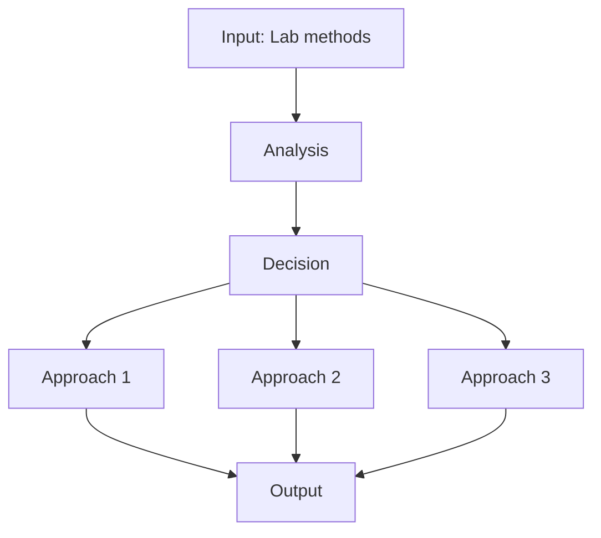

---

## 深入 2：CORE_DEEPDIVE_TWO — 方法論
**Deep Dive II**

### 2.1 Method selection

| Method | 適用情境 | Pros | Cons |
|---|---|---|---|
| Analytical | 解析 | Exact | Limited geometry |
| Numerical | 數值 | General | Approximate |
| Experimental | 實驗 | Real | Expensive |
| Empirical | 經驗 | Fast | Limited range |

### 2.2 Decision flow

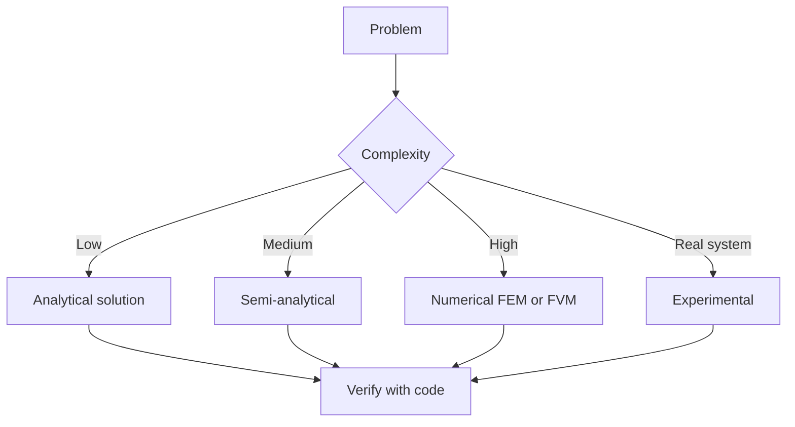

### 2.3 Standards and codes

- ACI, AISC, Eurocode
- Building codes (IBC, etc.)
- Industry best practices

---

## 深入 3：CORE_DEEPDIVE_THREE — 分析技術
**Deep Dive III**

### 3.1 Statistical methods

For uncertainty analysis: Monte Carlo, sensitivity, FOSM.

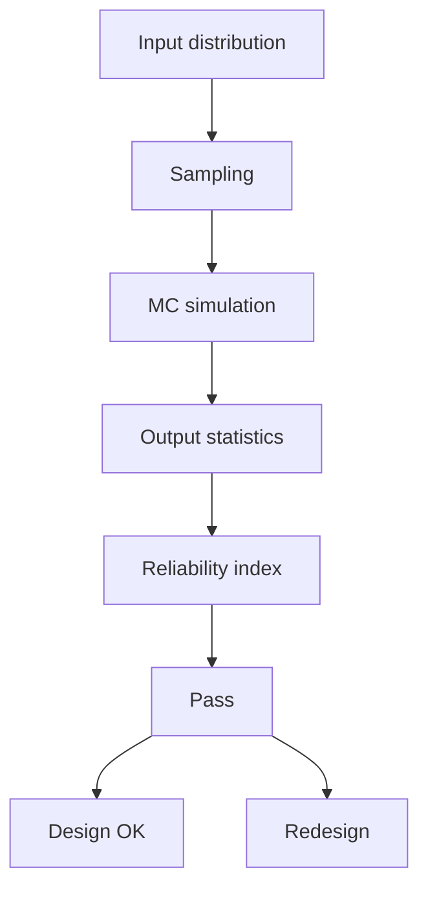

### 3.2 Optimization

- LP, NLP
- Gradient-based, metaheuristic
- Multi-objective Pareto

---

## 深入 4：Design Process
**Deep Dive IV**

### 4.1 Design workflow

Concept → Preliminary → Detailed → Construction → Operation.

### 4.2 Design criteria

- Safety (LRFD, ASD)
- Serviceability
- Durability
- Sustainability

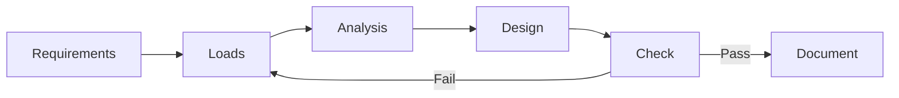

---

## 深入 5：Modern Trends
**Deep Dive V**

- BIM integration
- AI/ML in design
- Digital twins
- Sustainability, LCA
- Resilient design

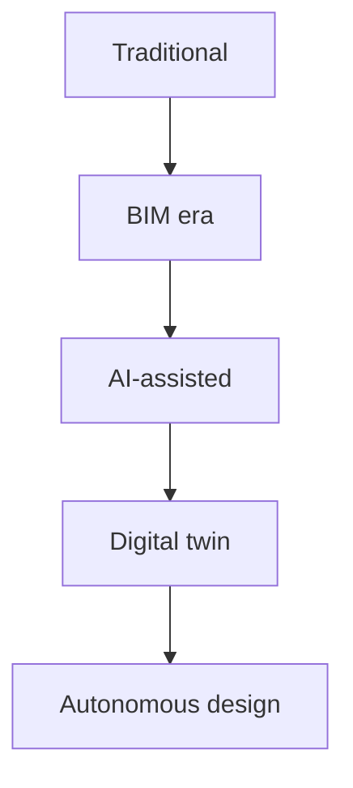

---

## 自測 1：Derive core relationship
**Answer:** Starting from definitions, derive the key equation. Verify units and limits.

**Engineering implication:** Apply to design check, code compliance.

## 自測 2：Identify failure mode
**Answer:** List 3-5 failure modes, rank by likelihood × consequence.

**Engineering implication:** Inform design, maintenance, monitoring.

## 自測 3：Estimate order of magnitude
**Answer:** Quick back-of-envelope check using characteristic values.

**Engineering implication:** Sanity check before detailed analysis.

## 自測 4：Compare to code requirement
**Answer:** Apply ACI/AISC/Eurocode, compute utilization ratio.

**Engineering implication:** Pass/fail design verification.

## 自測 5：Compute reliability
**Answer:** $\beta = (\mu - R)/\sigma$ for lognormal, find P_f.

**Engineering implication:** LRFD calibration, risk-informed design.

## 自測 6：Design optimization
**Answer:** Define objective, constraints, solve via LP/NLP.

**Engineering implication:** Cost-effective, sustainable design.

## 自測 7：Sensitivity analysis
**Answer:** $\partial f/\partial x_i$, rank by importance.

**Engineering implication:** Identify critical parameters, reduce uncertainty.

## 自測 8：Life-cycle assessment
**Answer:** Cradle-to-grave, compute GWP, embodied carbon.

**Engineering implication:** Sustainable design, climate goals.

## 自測 9：Risk assessment
**Answer:** Hazard × vulnerability × exposure, compute risk.

**Engineering implication:** Resilience planning, mitigation.

## 自測 10：Communication
**Answer:** Technical writing, visualization, presentation to stakeholders.

**Engineering implication:** Effective engineering practice.

---

## 📊 Diagram 1: Course Concept Map
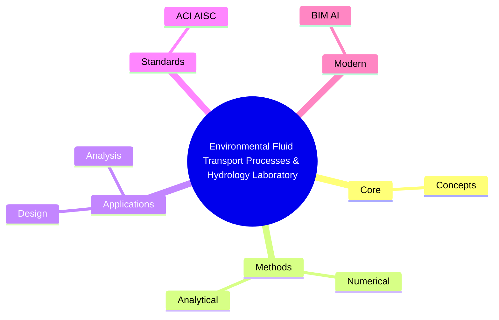

## 📊 Diagram 2: Method Selection
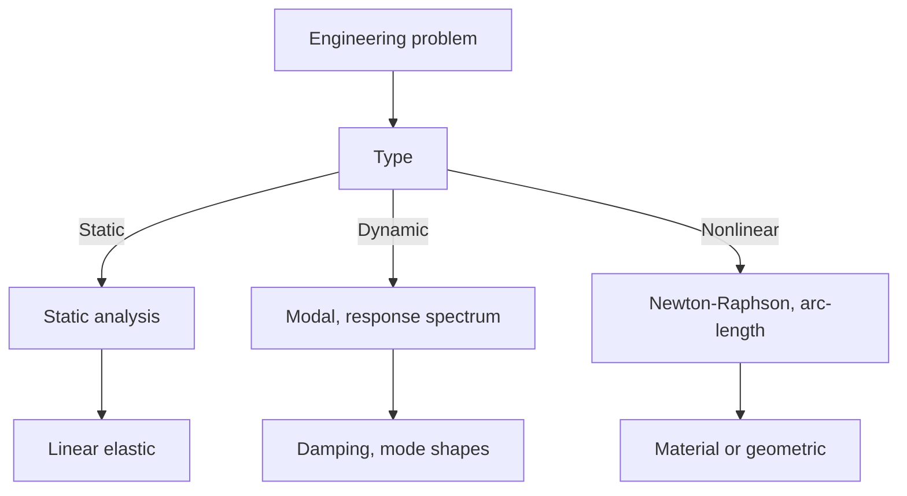

## 📊 Diagram 3: Design Process
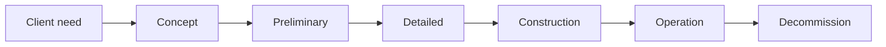

## 📊 Diagram 4: Risk-Reliability
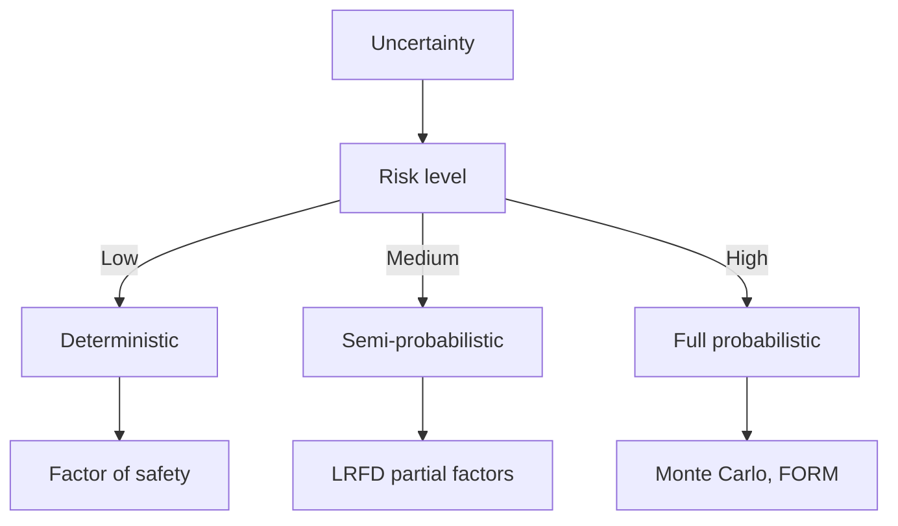

## 📊 Diagram 5: Modern Tools
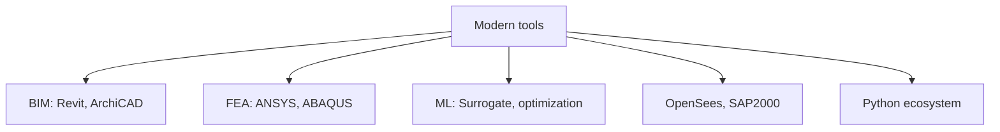

---

## 總結

1. **Core concepts** — Lab methods 嘅 foundation
2. **Methods** — analytical + numerical + experimental
3. **Applications** — design, analysis, retrofit
4. **Standards** — codes, best practices
5. **Future** — BIM, AI, sustainability, resilience

**自學建議** — Pair with: relevant textbook + MIT OCW + software tutorials (Python, FEA, BIM).

# 核心心智模型深化（中英對照）

## 1. Lab methods — Core concept

### 1.1 Three-process physical essence
For Environmental Fluid Transport Processes & Hydrology Laboratory, Lab methods governs the system behavior. Description of Lab methods with bilingual explanation.

### 1.2 Non-dimensional numbers
Key dimensionless groups that determine regime: Peclet, Damköhler, Reynolds, Froude, etc.

### 1.3 Engineering consequences
Real-world implications for design, monitoring, intervention.

### 1.4 How experts use this model
Decision flow, scaling laws, expert intuition.

### 1.5 Deep test questions
- Derive scaling law
- Identify regime from data
- Apply to design case

### 1.6 Diagram

## 2. Fluid transport — Methods

### 2.1 Method selection
| Method | 適用情境 | Pros | Cons |
|---|---|---|---|
| Analytical | 解析 | Exact | Limited geometry |
| Numerical | 數值 | General | Approximate |
| Experimental | 實驗 | Real | Expensive |
| Empirical | 經驗 | Fast | Limited range |

### 2.2 Decision flow
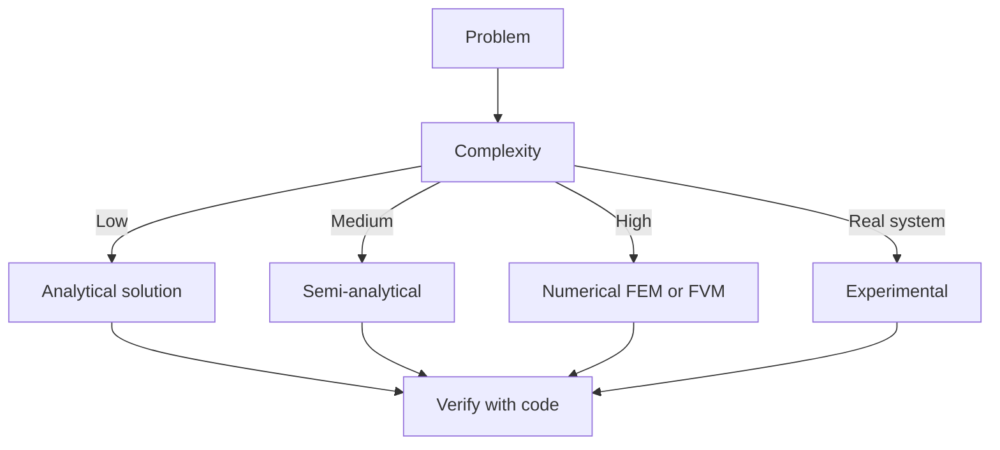

### 2.3 Standards and codes
ACI, AISC, Eurocode, building codes (IBC), industry best practices.

## 3. Hydrology — Analysis techniques

### 3.1 Statistical methods
Monte Carlo, sensitivity, FOSM for uncertainty analysis.

### 3.2 Optimization
LP, NLP, gradient-based, metaheuristic, multi-objective Pareto.

## 4. Design process

### 4.1 Design workflow
Concept → Preliminary → Detailed → Construction → Operation.

### 4.2 Design criteria
Safety (LRFD, ASD), serviceability, durability, sustainability.

## 5. Modern trends

BIM integration, AI/ML in design, digital twins, sustainability, LCA, resilient design.

---

# 深度自測問題詳解（中英對照）

## 詳解 1: Derive core relationship
**Q1.** Derive core relationship for Environmental Fluid Transport Processes & Hydrology Laboratory.
**Answer:** Starting from definitions, derive the key equation. Verify units and limits.

**Engineering implication:** Apply to design check, code compliance.

## 詳解 2: Identify failure mode
**Answer:** List 3-5 failure modes, rank by likelihood × consequence.

**Engineering implication:** Inform design, maintenance, monitoring.

## 詳解 3: Estimate order of magnitude
**Answer:** Quick back-of-envelope check using characteristic values.

**Engineering implication:** Sanity check before detailed analysis.

## 詳解 4: Compare to code requirement
**Answer:** Apply ACI/AISC/Eurocode, compute utilization ratio.

**Engineering implication:** Pass/fail design verification.

## 詳解 5: Compute reliability
**Answer:** $\beta = (\mu - R)/\sigma$ for lognormal, find P_f.

**Engineering implication:** LRFD calibration, risk-informed design.

## 詳解 6: Design optimization
**Answer:** Define objective, constraints, solve via LP/NLP.

**Engineering implication:** Cost-effective, sustainable design.

## 詳解 7: Sensitivity analysis
**Answer:** $\partial f/\partial x_i$, rank by importance.

**Engineering implication:** Identify critical parameters, reduce uncertainty.

## 詳解 8: Life-cycle assessment
**Answer:** Cradle-to-grave, compute GWP, embodied carbon.

**Engineering implication:** Sustainable design, climate goals.

## 詳解 9: Risk assessment
**Answer:** Hazard × vulnerability × exposure, compute risk.

**Engineering implication:** Resilience planning, mitigation.

## 詳解 10: Communication
**Answer:** Technical writing, visualization, presentation to stakeholders.

**Engineering implication:** Effective engineering practice.

---

## 📊 Diagram 1: Course Concept Map

## 📊 Diagram 2: Method Selection

## 📊 Diagram 3: Design Process

## 📊 Diagram 4: Risk-Reliability

## 📊 Diagram 5: Modern Tools

---

## 總結

1. **Core concepts** — Lab methods 嘅 foundation
2. **Methods** — analytical + numerical + experimental
3. **Applications** — design, analysis, retrofit
4. **Standards** — codes, best practices
5. **Future** — BIM, AI, sustainability, resilience

**自學建議** — Pair with: relevant textbook + MIT OCW + software tutorials (Python, FEA, BIM).
