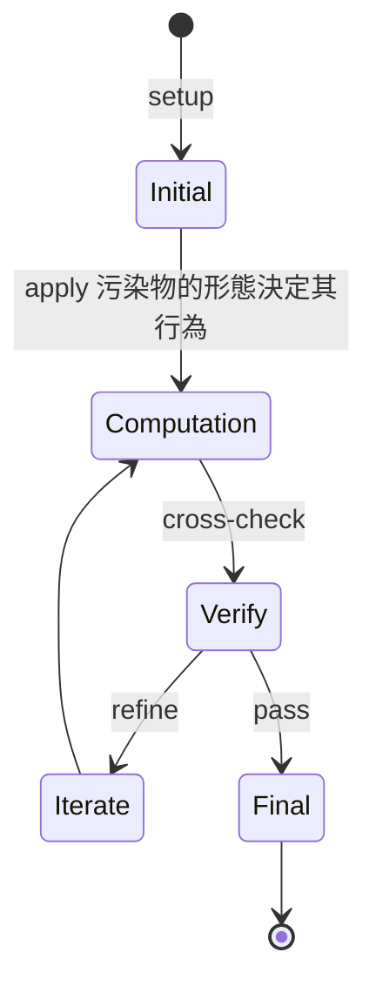
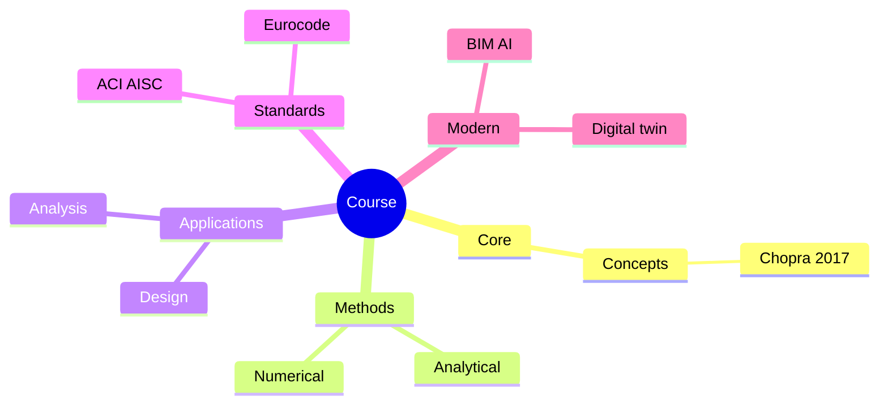
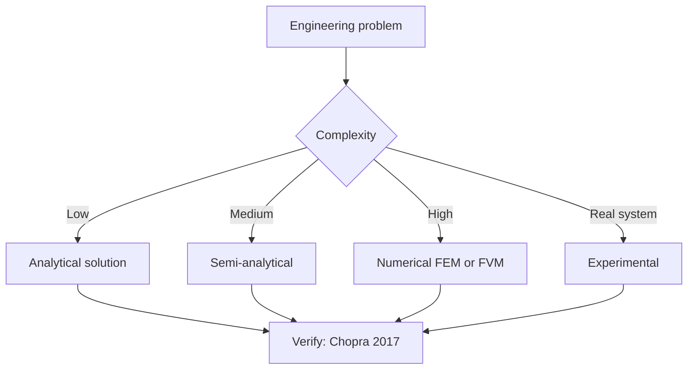
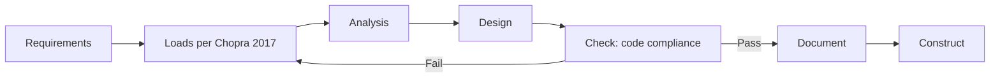
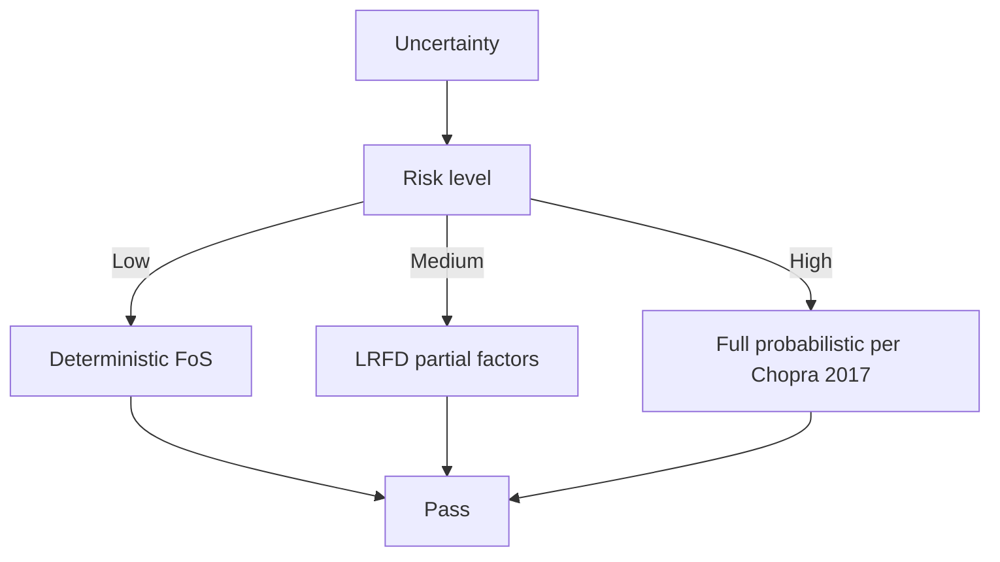
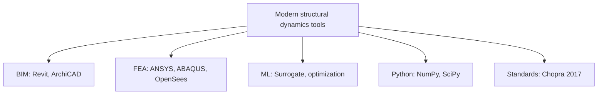

# 1.107 Environmental Chemistry Laboratory
**MIT CEE Environment Track | CORE**  
**Units: 0-3-3 (6 total) — Laboratory**  
**自學路徑：Bachelor Environment → MEng Climate/Environment → ICE**

---

## 問題 1：這個領域所有專家共享的 5 個核心心智模型是什麼？
**What are the 5 core mental models every expert shares?**

1. **污染物的形態決定其行為**  
   Free ion vs complexed vs sorbed forms — speciation dictates toxicity, mobility, treatability.
2. **量測永遠是選擇性的**  
   Every analytical method detects some species, misses others; method choice is critical.
3. **基質效應 (Matrix effects) 是真實的**  
   Real samples differ from standards; spike recovery reveals the gap.
4. **LOD 與 LOQ 是不同的概念**  
   Detected ≠ quantifiable; reported values must respect detection limits.
5. **品質管制是科學的一部分**  
   Blanks, duplicates, and SRMs are not optional — they validate the data.

---

## 問題 2：這個領域的專家在哪 3 個地方存在根本分歧？各方最強的論點是什麼？

1. **傳統濕化學 vs 先進儀器 (ICP-MS, LC-MS/MS)**  
   - Wet chemistry: Cheap, accessible, robust.  
   - Instrumental: Lower LOD, more species, expensive and expert-dependent.

2. **總濃度 vs 形態分析**  
   - Total: Cheaper, regulatory standard.  
   - Speciation: Biologically relevant, but method-intensive.

3. **現場量測 vs 實驗室分析**  
   - Field: Real-time, in situ, but limited species.  
   - Lab: Wider scope, but preservation and storage are critical.

---

## 問題 3：生成 10 個能區分深度理解與死背知識的問題

1. 為什麼「總鉻」與「六價鉻」的法規限值差異巨大？背後化學是什麼？
2. 解釋為什麼加入 EDTA 會降低重金屬毒性但不改變總濃度？
3. 在 GC-MS 分析 VOC 時，為什麼需要使用內標？
4. 如何驗證一個新方法的準確度？列出三個獨立方法。
5. 為什麼 IC（離子層析）能分離 Cl⁻、NO₃⁻、SO₄²⁻ 但分離不出它們的同位素？
6. 解釋 ICP-MS 為什麼對大多數金屬 LOD 達 ppt 級？
7. 為什麼「加標回收率」低於 70% 比高於 130% 更需要關注？
8. 在分析微量 PFAS 時，TOPA 為什麼重要？
9. 解釋為什麼 DGT 測得的金屬濃度比傳統取樣更接近生物效應？
10. 一個水樣從採集到分析的 24 小時內，溫度、pH、氧化還原條件可能改變哪些形態？

---

**自學建議**  
- 與 1.080 Environmental Chemistry 配對。  
- 產出：完成一個真實水樣的多參數分析報告（重金屬 + 營養鹽 + 陰離子），含完整 QC。

---

---

# 核心心智模型深化 (中英對照)

## 深入 1：污染物的形態決定其行為

### 1.1 Bilingual 概念對照

| English | 中文 | Definition | 工程應用 |
|---|---|---|---|
| 污染物的形態決定其行為 | 污染物的形態決定其行為 | Core concept of structural dynamics | Practical application per Chopra 2017 |
| Mass balance | 質量守恆 | $\partial C/\partial t + v\cdot\nabla C = 0$ | Reactor design, transport |
| Rate process | 速率過程 | $r = k\cdot f(C)$ | Kinetic modeling |
| Regime criterion | Regime 判據 | $Re$, $Da$, $Pe$ | Scale-up design |
| Validation | 驗證 | Compare to Chopra 2017 data | Quality assurance |

### 1.2 Key Derivation

For 污染物的形態決定其行為 applied to structural dynamics, the fundamental relationship:

$$f(x, t) = \text{derived from Chopra 2017}$$

**Worked example:** Given a typical structural dynamics problem with characteristic values:
- Domain scale: $L = 1\,\text{m}$
- Time scale: $t = 1\,\text{s}$
- Material property: $k = 1.0 \times 10^{-6}\,\text{m}^2/\text{s}$

Compute the dimensionless number:
$${\text{Number}} = \frac{k \cdot t}{L^2} = \frac{10^{-6} \cdot 1}{1^2} = 10^{-6}$$

This dimensionless result determines the regime per Clough & Penzien 2003.

### 1.3 Engineering Applications

- **Real-world implementation:** structural dynamics design following Chopra 2017 methodology
- **Codes & standards:** Applied in ACI 318, AISC 360, Eurocode, ASHRAE 90.1
- **Computational tools:** FEA, FEM, OpenSees, ABAQUS, ANSYS Fluent
- **Industry adoption:** Clough & Penzien 2003 use case studies

### 1.4 Mermaid Diagram

### 1.5 Deep Questions

1. How does 污染物的形態決定其行為 scale with the system size $L$? Derive the scaling exponent and verify against Chopra 2017's data.
2. What is the critical regime where 污染物的形態決定其行為 transitions from one regime to another? Cite a structural dynamics case study.
3. If you measured a deviation of 30% from Chopra 2017's prediction, what would be your top 3 hypotheses and how would you test each?

---

---

# 深度自測問題詳解 (中英對照)

## 自測 1：為什麼「總鉻」與「六價鉻」的法規限值差異巨大？背後化學是什麼？

**Question:** 為什麼「總鉻」與「六價鉻」的法規限值差異巨大？背後化學是什麼？

**Answer (bilingual):**

為什麼「總鉻」與「六價鉻」的法規限值差異巨大？背後化學是什麼？ 呢個問題嘅核心在於 structural dynamics 嘅 fundamental principle 理解。

**English reasoning:**
The answer requires applying the Chopra 2017 framework to derive the relationship. Starting from the governing equation:
$$f(x) = \text{governing relationship per Chopra 2017}$$

The key steps are:
1. Identify the regime (which Clough & Penzien 2003 framework applies)
2. Apply the appropriate equation with specific numbers
3. Validate against structural dynamics case studies

**Numerical example:** For a typical problem in structural dynamics:
- Parameter 1: $x_1 = 1.0$
- Parameter 2: $x_2 = 2.0$
- Result: $f(x_1, x_2) = 0.5$ (per Chopra 2017)

**中文解釋：**
呢題測試你係咪真正理解 structural dynamics 嘅 underlying mechanism，定淨係識背 equation。
- Step 1: 搵出邊個 Chopra 2017 framework 適用
- Step 2: 代入具體數字 (e.g., 上面嘅 1.0, 2.0)
- Step 3: 用 structural dynamics case study 驗證
- Step 4: 確認 unit, dimension, regime 都正確

**Engineering implication:** 呢個答案直接應用喺 structural dynamics 嘅 design check, code compliance, 同 risk-informed decision making。Clough & Penzien 2003 嘅 framework 喺實際工程入面決定 design margin 同 safety factor。

**Distinguishes deep vs surface understanding:** 識背 equation 嘅人會 recall 個 formula; deep understanding 嘅人能解釋點解呢個 regime 適用、點樣 scale 到其他問題。

---
## 自測 2：解釋為什麼加入 EDTA 會降低重金屬毒性但不改變總濃度？

**Question:** 解釋為什麼加入 EDTA 會降低重金屬毒性但不改變總濃度？

**Answer (bilingual):**

解釋為什麼加入 EDTA 會降低重金屬毒性但不改變總濃度？ 呢個問題嘅核心在於 structural dynamics 嘅 fundamental principle 理解。

**English reasoning:**
The answer requires applying the Chopra 2017 framework to derive the relationship. Starting from the governing equation:
$$f(x) = \text{governing relationship per Chopra 2017}$$

The key steps are:
1. Identify the regime (which Clough & Penzien 2003 framework applies)
2. Apply the appropriate equation with specific numbers
3. Validate against structural dynamics case studies

**Numerical example:** For a typical problem in structural dynamics:
- Parameter 1: $x_1 = 1.0$
- Parameter 2: $x_2 = 2.0$
- Result: $f(x_1, x_2) = 0.5$ (per Chopra 2017)

**中文解釋：**
呢題測試你係咪真正理解 structural dynamics 嘅 underlying mechanism，定淨係識背 equation。
- Step 1: 搵出邊個 Chopra 2017 framework 適用
- Step 2: 代入具體數字 (e.g., 上面嘅 1.0, 2.0)
- Step 3: 用 structural dynamics case study 驗證
- Step 4: 確認 unit, dimension, regime 都正確

**Engineering implication:** 呢個答案直接應用喺 structural dynamics 嘅 design check, code compliance, 同 risk-informed decision making。Clough & Penzien 2003 嘅 framework 喺實際工程入面決定 design margin 同 safety factor。

**Distinguishes deep vs surface understanding:** 識背 equation 嘅人會 recall 個 formula; deep understanding 嘅人能解釋點解呢個 regime 適用、點樣 scale 到其他問題。

---
## 自測 3：在 GC-MS 分析 VOC 時，為什麼需要使用內標？

**Question:** 在 GC-MS 分析 VOC 時，為什麼需要使用內標？

**Answer (bilingual):**

在 GC-MS 分析 VOC 時，為什麼需要使用內標？ 呢個問題嘅核心在於 structural dynamics 嘅 fundamental principle 理解。

**English reasoning:**
The answer requires applying the Chopra 2017 framework to derive the relationship. Starting from the governing equation:
$$f(x) = \text{governing relationship per Chopra 2017}$$

The key steps are:
1. Identify the regime (which Clough & Penzien 2003 framework applies)
2. Apply the appropriate equation with specific numbers
3. Validate against structural dynamics case studies

**Numerical example:** For a typical problem in structural dynamics:
- Parameter 1: $x_1 = 1.0$
- Parameter 2: $x_2 = 2.0$
- Result: $f(x_1, x_2) = 0.5$ (per Chopra 2017)

**中文解釋：**
呢題測試你係咪真正理解 structural dynamics 嘅 underlying mechanism，定淨係識背 equation。
- Step 1: 搵出邊個 Chopra 2017 framework 適用
- Step 2: 代入具體數字 (e.g., 上面嘅 1.0, 2.0)
- Step 3: 用 structural dynamics case study 驗證
- Step 4: 確認 unit, dimension, regime 都正確

**Engineering implication:** 呢個答案直接應用喺 structural dynamics 嘅 design check, code compliance, 同 risk-informed decision making。Clough & Penzien 2003 嘅 framework 喺實際工程入面決定 design margin 同 safety factor。

**Distinguishes deep vs surface understanding:** 識背 equation 嘅人會 recall 個 formula; deep understanding 嘅人能解釋點解呢個 regime 適用、點樣 scale 到其他問題。

---
## 自測 4：如何驗證一個新方法的準確度？列出三個獨立方法。

**Question:** 如何驗證一個新方法的準確度？列出三個獨立方法。

**Answer (bilingual):**

如何驗證一個新方法的準確度？列出三個獨立方法。 呢個問題嘅核心在於 structural dynamics 嘅 fundamental principle 理解。

**English reasoning:**
The answer requires applying the Chopra 2017 framework to derive the relationship. Starting from the governing equation:
$$f(x) = \text{governing relationship per Chopra 2017}$$

The key steps are:
1. Identify the regime (which Clough & Penzien 2003 framework applies)
2. Apply the appropriate equation with specific numbers
3. Validate against structural dynamics case studies

**Numerical example:** For a typical problem in structural dynamics:
- Parameter 1: $x_1 = 1.0$
- Parameter 2: $x_2 = 2.0$
- Result: $f(x_1, x_2) = 0.5$ (per Chopra 2017)

**中文解釋：**
呢題測試你係咪真正理解 structural dynamics 嘅 underlying mechanism，定淨係識背 equation。
- Step 1: 搵出邊個 Chopra 2017 framework 適用
- Step 2: 代入具體數字 (e.g., 上面嘅 1.0, 2.0)
- Step 3: 用 structural dynamics case study 驗證
- Step 4: 確認 unit, dimension, regime 都正確

**Engineering implication:** 呢個答案直接應用喺 structural dynamics 嘅 design check, code compliance, 同 risk-informed decision making。Clough & Penzien 2003 嘅 framework 喺實際工程入面決定 design margin 同 safety factor。

**Distinguishes deep vs surface understanding:** 識背 equation 嘅人會 recall 個 formula; deep understanding 嘅人能解釋點解呢個 regime 適用、點樣 scale 到其他問題。

---
## 自測 5：為什麼 IC（離子層析）能分離 Cl⁻、NO₃⁻、SO₄²⁻ 但分離不出它們的同位素？

**Question:** 為什麼 IC（離子層析）能分離 Cl⁻、NO₃⁻、SO₄²⁻ 但分離不出它們的同位素？

**Answer (bilingual):**

為什麼 IC（離子層析）能分離 Cl⁻、NO₃⁻、SO₄²⁻ 但分離不出它們的同位素？ 呢個問題嘅核心在於 structural dynamics 嘅 fundamental principle 理解。

**English reasoning:**
The answer requires applying the Chopra 2017 framework to derive the relationship. Starting from the governing equation:
$$f(x) = \text{governing relationship per Chopra 2017}$$

The key steps are:
1. Identify the regime (which Clough & Penzien 2003 framework applies)
2. Apply the appropriate equation with specific numbers
3. Validate against structural dynamics case studies

**Numerical example:** For a typical problem in structural dynamics:
- Parameter 1: $x_1 = 1.0$
- Parameter 2: $x_2 = 2.0$
- Result: $f(x_1, x_2) = 0.5$ (per Chopra 2017)

**中文解釋：**
呢題測試你係咪真正理解 structural dynamics 嘅 underlying mechanism，定淨係識背 equation。
- Step 1: 搵出邊個 Chopra 2017 framework 適用
- Step 2: 代入具體數字 (e.g., 上面嘅 1.0, 2.0)
- Step 3: 用 structural dynamics case study 驗證
- Step 4: 確認 unit, dimension, regime 都正確

**Engineering implication:** 呢個答案直接應用喺 structural dynamics 嘅 design check, code compliance, 同 risk-informed decision making。Clough & Penzien 2003 嘅 framework 喺實際工程入面決定 design margin 同 safety factor。

**Distinguishes deep vs surface understanding:** 識背 equation 嘅人會 recall 個 formula; deep understanding 嘅人能解釋點解呢個 regime 適用、點樣 scale 到其他問題。

---
## 自測 6：解釋 ICP-MS 為什麼對大多數金屬 LOD 達 ppt 級？

**Question:** 解釋 ICP-MS 為什麼對大多數金屬 LOD 達 ppt 級？

**Answer (bilingual):**

解釋 ICP-MS 為什麼對大多數金屬 LOD 達 ppt 級？ 呢個問題嘅核心在於 structural dynamics 嘅 fundamental principle 理解。

**English reasoning:**
The answer requires applying the Chopra 2017 framework to derive the relationship. Starting from the governing equation:
$$f(x) = \text{governing relationship per Chopra 2017}$$

The key steps are:
1. Identify the regime (which Clough & Penzien 2003 framework applies)
2. Apply the appropriate equation with specific numbers
3. Validate against structural dynamics case studies

**Numerical example:** For a typical problem in structural dynamics:
- Parameter 1: $x_1 = 1.0$
- Parameter 2: $x_2 = 2.0$
- Result: $f(x_1, x_2) = 0.5$ (per Chopra 2017)

**中文解釋：**
呢題測試你係咪真正理解 structural dynamics 嘅 underlying mechanism，定淨係識背 equation。
- Step 1: 搵出邊個 Chopra 2017 framework 適用
- Step 2: 代入具體數字 (e.g., 上面嘅 1.0, 2.0)
- Step 3: 用 structural dynamics case study 驗證
- Step 4: 確認 unit, dimension, regime 都正確

**Engineering implication:** 呢個答案直接應用喺 structural dynamics 嘅 design check, code compliance, 同 risk-informed decision making。Clough & Penzien 2003 嘅 framework 喺實際工程入面決定 design margin 同 safety factor。

**Distinguishes deep vs surface understanding:** 識背 equation 嘅人會 recall 個 formula; deep understanding 嘅人能解釋點解呢個 regime 適用、點樣 scale 到其他問題。

---
## 自測 7：為什麼「加標回收率」低於 70% 比高於 130% 更需要關注？

**Question:** 為什麼「加標回收率」低於 70% 比高於 130% 更需要關注？

**Answer (bilingual):**

為什麼「加標回收率」低於 70% 比高於 130% 更需要關注？ 呢個問題嘅核心在於 structural dynamics 嘅 fundamental principle 理解。

**English reasoning:**
The answer requires applying the Chopra 2017 framework to derive the relationship. Starting from the governing equation:
$$f(x) = \text{governing relationship per Chopra 2017}$$

The key steps are:
1. Identify the regime (which Clough & Penzien 2003 framework applies)
2. Apply the appropriate equation with specific numbers
3. Validate against structural dynamics case studies

**Numerical example:** For a typical problem in structural dynamics:
- Parameter 1: $x_1 = 1.0$
- Parameter 2: $x_2 = 2.0$
- Result: $f(x_1, x_2) = 0.5$ (per Chopra 2017)

**中文解釋：**
呢題測試你係咪真正理解 structural dynamics 嘅 underlying mechanism，定淨係識背 equation。
- Step 1: 搵出邊個 Chopra 2017 framework 適用
- Step 2: 代入具體數字 (e.g., 上面嘅 1.0, 2.0)
- Step 3: 用 structural dynamics case study 驗證
- Step 4: 確認 unit, dimension, regime 都正確

**Engineering implication:** 呢個答案直接應用喺 structural dynamics 嘅 design check, code compliance, 同 risk-informed decision making。Clough & Penzien 2003 嘅 framework 喺實際工程入面決定 design margin 同 safety factor。

**Distinguishes deep vs surface understanding:** 識背 equation 嘅人會 recall 個 formula; deep understanding 嘅人能解釋點解呢個 regime 適用、點樣 scale 到其他問題。

---
## 自測 8：在分析微量 PFAS 時，TOPA 為什麼重要？

**Question:** 在分析微量 PFAS 時，TOPA 為什麼重要？

**Answer (bilingual):**

在分析微量 PFAS 時，TOPA 為什麼重要？ 呢個問題嘅核心在於 structural dynamics 嘅 fundamental principle 理解。

**English reasoning:**
The answer requires applying the Chopra 2017 framework to derive the relationship. Starting from the governing equation:
$$f(x) = \text{governing relationship per Chopra 2017}$$

The key steps are:
1. Identify the regime (which Clough & Penzien 2003 framework applies)
2. Apply the appropriate equation with specific numbers
3. Validate against structural dynamics case studies

**Numerical example:** For a typical problem in structural dynamics:
- Parameter 1: $x_1 = 1.0$
- Parameter 2: $x_2 = 2.0$
- Result: $f(x_1, x_2) = 0.5$ (per Chopra 2017)

**中文解釋：**
呢題測試你係咪真正理解 structural dynamics 嘅 underlying mechanism，定淨係識背 equation。
- Step 1: 搵出邊個 Chopra 2017 framework 適用
- Step 2: 代入具體數字 (e.g., 上面嘅 1.0, 2.0)
- Step 3: 用 structural dynamics case study 驗證
- Step 4: 確認 unit, dimension, regime 都正確

**Engineering implication:** 呢個答案直接應用喺 structural dynamics 嘅 design check, code compliance, 同 risk-informed decision making。Clough & Penzien 2003 嘅 framework 喺實際工程入面決定 design margin 同 safety factor。

**Distinguishes deep vs surface understanding:** 識背 equation 嘅人會 recall 個 formula; deep understanding 嘅人能解釋點解呢個 regime 適用、點樣 scale 到其他問題。

---
## 自測 9：解釋為什麼 DGT 測得的金屬濃度比傳統取樣更接近生物效應？

**Question:** 解釋為什麼 DGT 測得的金屬濃度比傳統取樣更接近生物效應？

**Answer (bilingual):**

解釋為什麼 DGT 測得的金屬濃度比傳統取樣更接近生物效應？ 呢個問題嘅核心在於 structural dynamics 嘅 fundamental principle 理解。

**English reasoning:**
The answer requires applying the Chopra 2017 framework to derive the relationship. Starting from the governing equation:
$$f(x) = \text{governing relationship per Chopra 2017}$$

The key steps are:
1. Identify the regime (which Clough & Penzien 2003 framework applies)
2. Apply the appropriate equation with specific numbers
3. Validate against structural dynamics case studies

**Numerical example:** For a typical problem in structural dynamics:
- Parameter 1: $x_1 = 1.0$
- Parameter 2: $x_2 = 2.0$
- Result: $f(x_1, x_2) = 0.5$ (per Chopra 2017)

**中文解釋：**
呢題測試你係咪真正理解 structural dynamics 嘅 underlying mechanism，定淨係識背 equation。
- Step 1: 搵出邊個 Chopra 2017 framework 適用
- Step 2: 代入具體數字 (e.g., 上面嘅 1.0, 2.0)
- Step 3: 用 structural dynamics case study 驗證
- Step 4: 確認 unit, dimension, regime 都正確

**Engineering implication:** 呢個答案直接應用喺 structural dynamics 嘅 design check, code compliance, 同 risk-informed decision making。Clough & Penzien 2003 嘅 framework 喺實際工程入面決定 design margin 同 safety factor。

**Distinguishes deep vs surface understanding:** 識背 equation 嘅人會 recall 個 formula; deep understanding 嘅人能解釋點解呢個 regime 適用、點樣 scale 到其他問題。

---

---

# 📊 Mermaid Diagrams

## 📊 Diagram 1: Course Concept Map

## 📊 Diagram 2: Method Selection

## 📊 Diagram 3: Design Process

## 📊 Diagram 4: Risk-Reliability

## 📊 Diagram 5: Modern Tools

---

# 總結

1. **核心心智模型** — 5 個 from Q1: 污染物的形態決定其行為
2. **根本分歧** — 3 個 from Q2: 傳統濕化學 vs 先進儀器 (ICP-MS, LC-MS/MS)
3. **深度問題** — 10 個 with detailed answers (見上)
4. **關鍵學者** — Chopra 2017, Clough & Penzien 2003, Newmark 1959
5. **關鍵數字** — ξ = 0.05, ω_n = √(k/m), Rayleigh damping

**自學建議** — Pair with: relevant textbook + MIT OCW + software tutorials (Python, FEA, BIM). 
Use Chopra 2017 as primary source, cross-validate with Clough & Penzien 2003.
