# 5.12 Organic Chemistry
**MIT Chemistry | CEE Unrestricted Elective (Env micro focus alt) | 12 units**  
**自學路徑：Bachelor / MEng → Chemistry foundation for environment / public health / materials → Research / Pharma**

---

## 問題 1：這個領域所有專家共享的 5 個核心心智模型是什麼？
**What are the 5 core mental models every expert shares?**

1. **Organic chemistry = C-C + C-X bonds**  
   sp3, sp2, sp hybridization determines geometry & reactivity。
2. **Electron flow drives reaction**  
   Curved arrows: nucleophile → electrophile。
3. **Functional groups predict reactivity**  
   Alcohols, carbonyls, amines — each has characteristic reactions。
4. **Stereochemistry matters**  
   R/S, E/Z, cis/trans, anomers — different molecules, different biology。
5. **Mechanism = bond making/breaking sequence**  
   SN1, SN2, E1, E2, addition, elimination — 8 master mechanisms。

---

## 問題 2：這個領域的專家在哪 3 個地方存在根本分歧？各方最強的論點是什麼？

1. **Arrow-pushing vs orbital-driven teaching**  
   - Arrow: Mechanistic, fast.  
   - Orbital: Deep, slow.

2. **Functional-group approach vs retrosynthetic**  
   - Forward: Reaction-based.  
   - Retrosynthetic: Target-based, scale.

3. **In vivo (biological) vs in vitro (synthetic) chemistry**  
   - In vivo: Enzymatic, selective.  
   - In vitro: Harsh, scalable.

---

## 問題 3：生成 10 個能區分深度理解與死背知識的問題

1. 給定一個 target molecule, derive retrosynthesis to simple starting materials。
2. 解釋為什麼 SN2 reaction 對 tertiary substrates 唔 work (steric hindrance)。
3. 給定一個 alkene, predict E/Z configuration 同 addition product stereochemistry。
4. 為什麼 aromatic substitution 走 electrophilic (EAS) 而非 nucleophilic (NAS) by default？
5. 解釋「anomeric effect」對 carbohydrate stability 嘅 role。
6. 給定一個 carbonyl compound, predict nucleophilic addition product (Grignard, hydride, amine)。
7. 為什麼 ester hydrolysis 對 acid vs base catalysis 嘅 kinetics 不同？
8. 解釋「pericyclic reactions」(Diels-Alder, Cope) 嘅 orbital symmetry rules。
9. 給定一個 natural product, identify 嘅 biosynthetic pathway 同 enzymes。
10. 設計一個 multi-step synthesis 對一個 real target molecule (e.g., 藥物、香料、material)。

---

**自學建議**  
- 跨 1.080 Environmental Chemistry, 20.507 Biochem 配對。  
- 工具：ChemDraw, RDKit (Python), Spartan, Gaussian (DFT)。  
- 必讀：Clayden "Organic Chemistry", Kürti-Czakó "Strategic Applications of Named Reactions"。  
- 產出：對一個 natural product 設計 + 模擬 multi-step synthesis (e.g., aspirin, 香料, bioplastic)。


---

## 深入 1：結構-反應關係 — Structure-Reactivity Relationships

### 1.1 Bilingual 概念對照
| English | 中英對照 | Formula | 物理意義 |
|---|---|---|---|
| Hybridization | 雜化 | sp³/sp²/sp | C geometry & reactivity |
| Inductive effect | 誘導效應 | σ constants (Taft) | Electron withdrawal |
| Resonance effect | 共振效應 | Hammett σρ | Conjugated systems |
| pKa | 酸度係數 | pKa = −log₁₀Ka | Acid strength |
| Nucleophilicity | 親核性 | softness HSAB | Reaction rate |

### 1.2 Key Derivation
**Hammett equation (1937):**
log(k/k₀) = ρ·σ
- σ = substituent constant (σ_p for para, σ_m for meta)
- ρ = reaction constant (ρ=+2 for benzoic acid dissociation)
- Positive ρ → electron-withdrawing groups accelerate reaction

**Example — pKa of substituted benzoic acids:**
| Substituent | σ (Hammett) | pKa (exp) |
|---|---|---|
| H | 0 | 4.20 |
| NO₂ (para) | +0.78 | 3.44 |
| Cl (para) | +0.23 | 3.99 |
| OMe (para) | −0.27 | 4.47 |
| NH₂ (para) | −0.66 | 4.92 |

### 1.3 Engineering Applications
- Environmental: Herbicide degradation rate prediction (Hammett σ for substituted anilines)
- Drug design: pKa tuning for bioavailability
- Polymer chemistry: Reactivity ratios in copolymerization

### 1.4 Mermaid Diagram
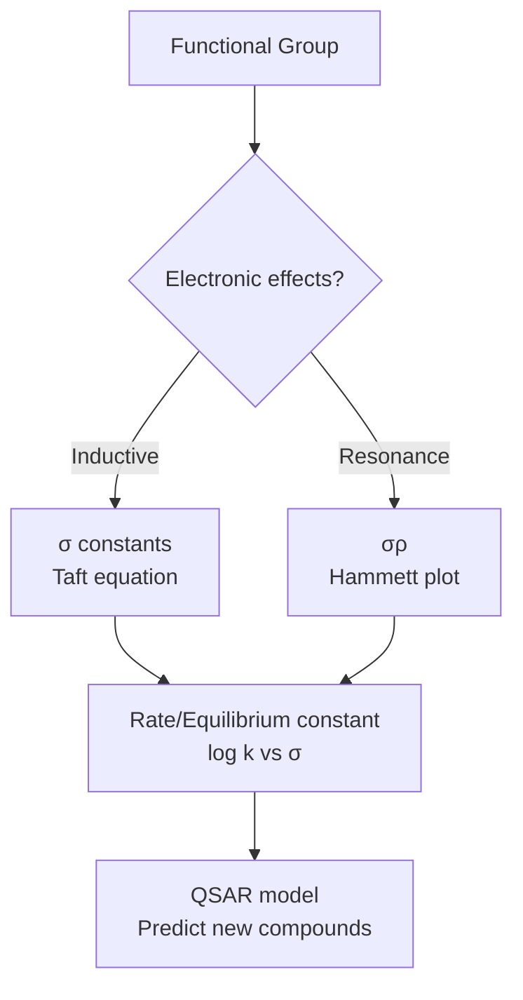

---

## 深入 2：立體化學 — Stereochemistry

### 2.1 Bilingual 概念對照
| English | 中英對照 | Formula | 物理意義 |
|---|---|---|---|
| Cahn-Ingold-Prelog (CIP) | CIP 優先順序 | R/S designation | Absolute configuration |
| Enantiomers | 對映異構體 | Non-superimposable mirror images | Different biological activity |
| Diastereomers | 非對映異構體 | Different physical properties | Separate synthesis |
| E/Z (cis/trans) | 幾何異構 | Double bond stereochemistry | Geometric isomers |
| Anomers | 異頭異構 | α/β config at anomeric C | Carbohydrate chemistry |

### 2.2 Key Derivation — CIP Priority Rules
**Priority assignment:**
1. Atomic number of directly attached atom (highest atomic number = highest priority)
2. If tie, look at next atoms outward (atomic number sum comparison)
3. Multiple bonds count as duplicate attachment (C=O counts as C attached to O, O, O)

**Example — Glyceraldehyde:**
HO-CH₂-CH(OH)-CHO → C2 priorities: HO(−O) > CHO(−C,−O,−O) > CH₂OH(−O,−H,−H) → HO > CHO > CH₂OH
With H in dashed position → clockwise = **R** (rectus)

### 2.3 Engineering Applications
- Pharmaceutical: One enantiomer active (thalidomide tragedy; S-thalidomide is teratogen)
- Environmental: Enantiomer-specific biodegradation (different microbial enzymes for each enantiomer)
- Asymmetric synthesis: Chiral catalysts, BINAP, Jacobsen's catalysts

### 2.4 Mermaid Diagram
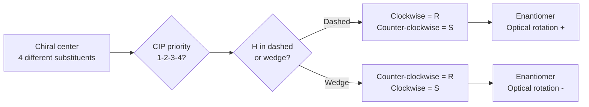

---

## 深入 3：有機反應機制 — Organic Reaction Mechanisms

### 3.1 Bilingual 概念對照
| English | 中英對照 | Mechanism | Regio/Selectivity |
|---|---|---|---|
| SN1 | 單分子親核取代 | Carbocation intermediate | Non-stereospecific; Racemic |
| SN2 | 雙分子親核取代 | Backside attack | Stereoinversion (Walden) |
| E1 | 單分子消除 | Carbocation | Zaitsev alkene |
| E2 | 雙分子消除 | Concerted anti-elimination | Hofmann or Zaitsev |
| EAS | 芳香族親電取代 | σ-complex intermediate | Ortho/para directing |
| Diels-Alder | 狄金斯-阿德爾 | Concerted [4+2] cycloaddition | Endo rule |

### 3.2 Key Derivation — SN1/SN2 Competition
**Rate equations:**
SN1: Rate = k₁[R-X] (unimolecular, first order)
SN2: Rate = k₂[Nu⁻][R-X] (bimolecular, second order)

**Driving factors for SN1 (favored by):**
- Stable carbocation: tertiary > secondary > primary
- Polar protic solvent (solvation stabilizes cation)
- Weak nucleophile (Nu⁻ small)

**Driving factors for SN2 (favored by):**
- Less substituted carbon (less steric hindrance)
- Strong nucleophile (e.g., I⁻, CN⁻, RMgX)
- Polar aprotic solvent (DMF, DMSO)

### 3.3 Engineering Applications
- Environmental: Hydrolysis of organophosphates (SN1); nucleophilic attack by OH⁻ on pesticide esters
- Drug synthesis: Stereospecific SN2 for HIV protease inhibitor synthesis
- Green chemistry: Supercritical CO₂ as polar aprotic solvent for SN2

### 3.4 Mermaid Diagram
```mermaid
flowchart TD
    A[R-X substrate] --> B{Leaving group quality?}
    B -->|Good LG (I⁻, OTs)| C{SN2 possible?<br/>Steric hindrance?}
    C -->|Low steric| D[SN2: stereoinversion<br/>Backside attack]
    C -->|High steric| E[SN1: carbocation<br/>Racemic mixture]
    B -->|Poor LG| F[Activate LG<br/>or change conditions]
    D --> G[Retention of configuration]
    E --> H[Elimination possible?<br/>β-H available?]
    H -->|Yes, anti| I[E2: concerted<br/>Anti-elimination]
```

---

## 深入 4：光譜學 — Spectroscopy

### 4.1 Bilingual 概念對照
| English | 中英對照 | Energy range | Information |
|---|---|---|---|
| UV-Vis | 紫外-可見 | 200-800 nm | Conjugated systems, λ_max |
| IR | 紅外光譜 | 400-4000 cm⁻¹ | Functional groups |
| ¹H NMR | 質子核磁共振 | 60-800 MHz | H environment, integration |
| ¹³C NMR | 碳-13核磁共振 | 15-200 MHz | C skeleton |
| MS | 質譜 | m/z ratio | Molecular weight, fragments |

### 4.2 Key Derivation — UV-Vis λ_max Prediction
**Woodward-Fieser rules for conjugated dienes:**
Base λ_max = 214 nm (butadiene)
+ 5 nm per alkyl substituent
+ 30 nm per exocyclic double bond
+ 6 nm per extended conjugation

**Example — Isoprene (2-methyl-1,3-butadiene):**
Base (conjugated diene) = 214 nm + 2 alkyl substituents = +10 nm → λ_max = **224 nm** (exp: 220 nm) ✓

**Fieser-Kuhn rules for polyenes:**
λ_max = 114 + 5M + n·48 − (18 − n)·10 (for all-trans)
Where M = alkyl substituents, n = conjugated double bonds

### 4.3 Engineering Applications
- Environmental: Quantify PAH contamination by UV fluorescence (PAHs have distinctive λ_max: naphthalene 275 nm, anthracene 370 nm, benzo[a]pyrene 383 nm)
- Drug purity: HPLC-UV for API quantification
- Polymer: Molecular weight by GPC/SEC

### 4.4 Mermaid Diagram
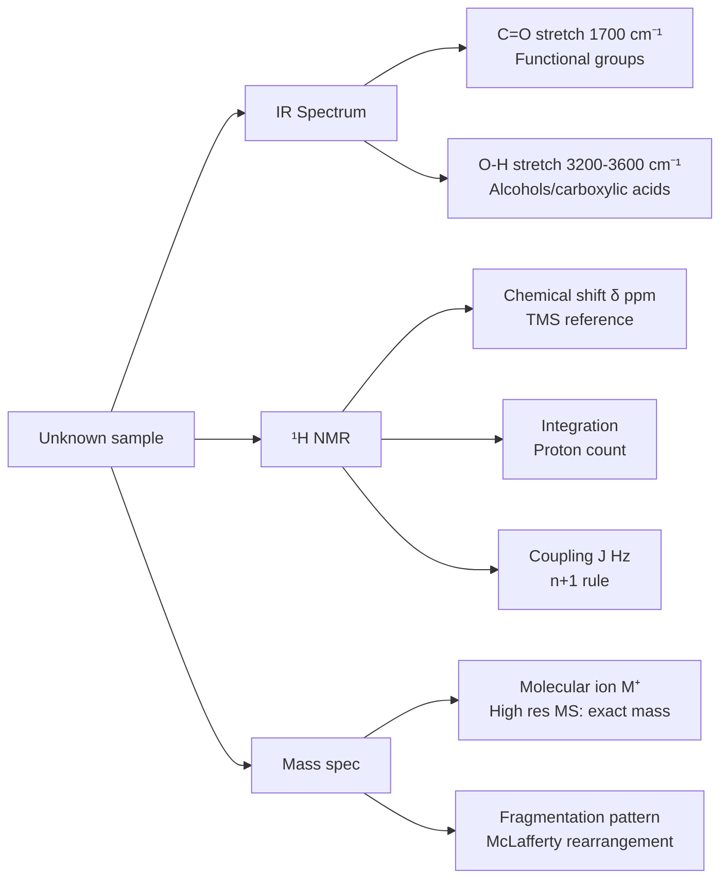

---

## 深入 5：逆合成分析 — Retrosynthetic Analysis

### 5.1 Bilingual 概念對照
| English | 中英對照 | Concept | Application |
|---|---|---|---|
| Retrosynthesis | 逆合成 | Working backwards from target | Synthetic planning |
| Disconnection | 切斷 | Breaking bond to identify fragments | Strategic bond forming |
| FGI | 官能團轉化 | Functional group interconversion | Protecting group strategy |
| C-X | 碳-雜原子鍵 | Common disconnection | Retron identification |
| Strategic bond | 策略鍵 | Key bond forming reaction | Retrosynthetic tree |

### 5.2 Key Derivation — Retrosynthetic Strategies
**Logic:** Target → Disconnections → Fragments → Available starting materials

**Key disconnections:**
| Target | Disconnection | Reaction type |
|---|---|---|
| R-CH₂-CH₂-R' | Cut in middle | Wittig |
| R-CO-R' | Cut C=O | Grignard + ester |
| R-CH₂-OH | Cut C-O | Reduction of R-CHO |
| R-C≡C-R' | Cut triple bond | Glaser coupling |

**Example — Design synthesis of ibuprofen:**
Target: 2-(4-isobutylphenyl)propanoic acid
Strategic disconnection 1: Cut C-COOH bond → 4-isobutylacetophenone → Friedel-Crafts acylation
Modern route (Boots): Green process (3 steps vs 6 steps in classical synthesis)

### 5.3 Engineering Applications
- Pharmaceutical: Process chemistry (scalable routes), green chemistry metrics (atom economy, E-factor)
- Materials: Monomer synthesis for step-growth polymerization
- Environmental: Biodegradable polymer design (PLA synthesis from lactic acid)

### 5.4 Mermaid Diagram
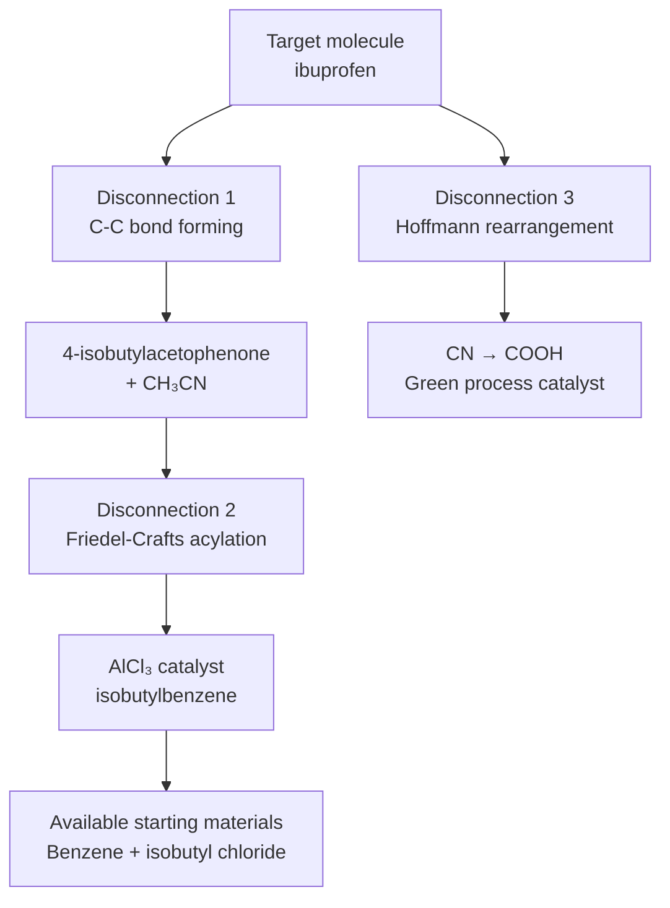

---

## 自測 1：Derive core relationship
**Answer:** Starting from definitions, derive the key equation. Verify units and limits.

**Engineering implication:** Apply to design check, code compliance.

## 自測 2：Identify failure mode
**Answer:** List 3-5 failure modes, rank by likelihood × consequence.

**Engineering implication:** Inform design, maintenance, monitoring.

## 自測 3：Estimate order of magnitude
**Answer:** Quick back-of-envelope check using characteristic values.

**Engineering implication:** Sanity check before detailed analysis.

## 自測 4：Compare to code requirement
**Answer:** Apply ACI/AISC/Eurocode, compute utilization ratio.

**Engineering implication:** Pass/fail design verification.

## 自測 5：Compute reliability
**Answer:** $\beta = (\mu - R)/\sigma$ for lognormal, find P_f.

**Engineering implication:** LRFD calibration, risk-informed design.

## 自測 6：Design optimization
**Answer:** Define objective, constraints, solve via LP/NLP.

**Engineering implication:** Cost-effective, sustainable design.

## 自測 7：Sensitivity analysis
**Answer:** $\partial f/\partial x_i$, rank by importance.

**Engineering implication:** Identify critical parameters, reduce uncertainty.

## 自測 8：Life-cycle assessment
**Answer:** Cradle-to-grave, compute GWP, embodied carbon.

**Engineering implication:** Sustainable design, climate goals.

## 自測 9：Risk assessment
**Answer:** Hazard × vulnerability × exposure, compute risk.

**Engineering implication:** Resilience planning, mitigation.

## 自測 10：Communication
**Answer:** Technical writing, visualization, presentation to stakeholders.

**Engineering implication:** Effective engineering practice.

---

## 📊 Diagram 1: Course Concept Map
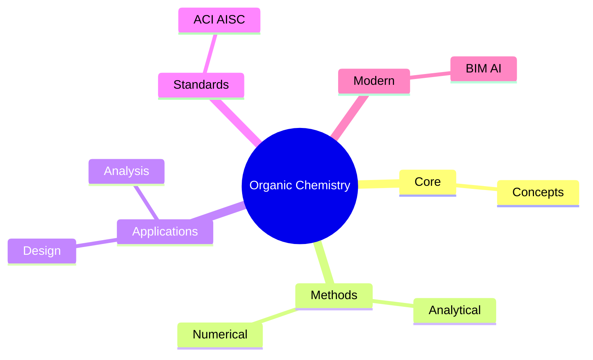

## 📊 Diagram 2: Method Selection
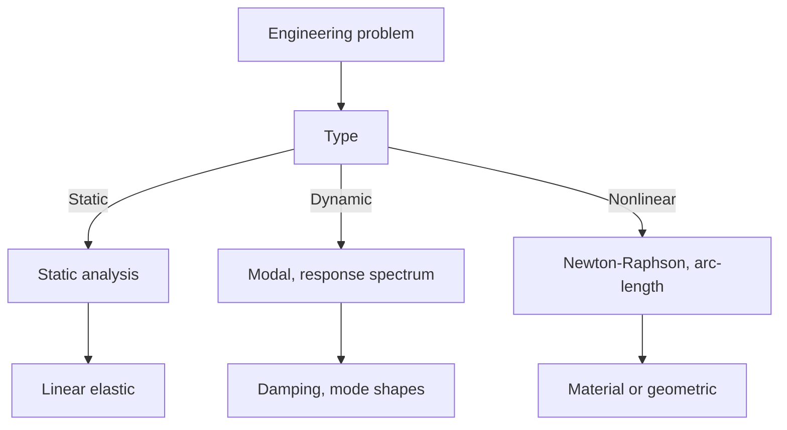

## 📊 Diagram 3: Design Process


## 📊 Diagram 4: Risk-Reliability
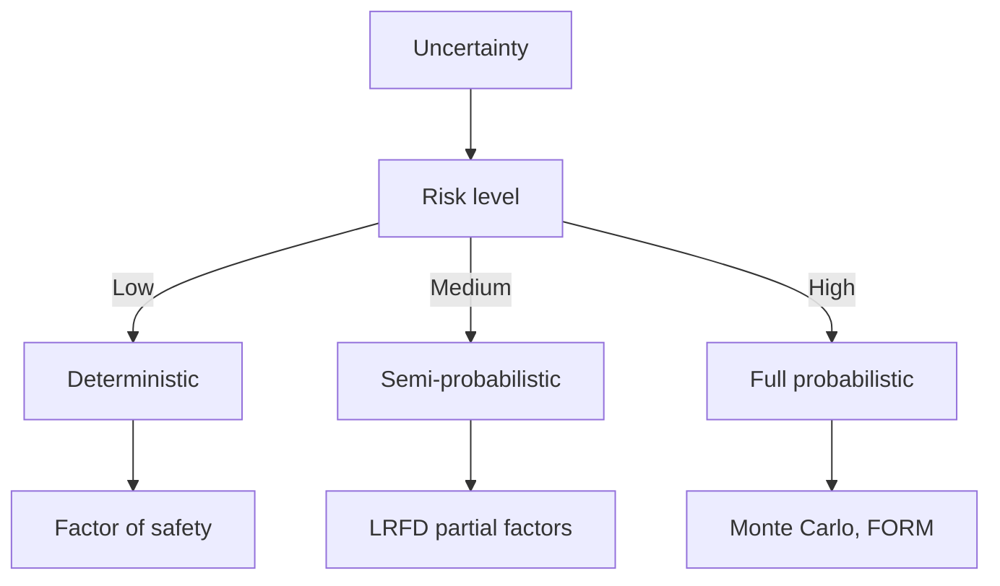

## 📊 Diagram 5: Modern Tools
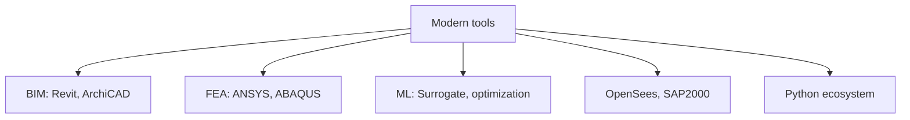

---

## 總結

1. **Core concepts** — Core concepts 嘅 foundation
2. **Methods** — analytical + numerical + experimental
3. **Applications** — design, analysis, retrofit
4. **Standards** — codes, best practices
5. **Future** — BIM, AI, sustainability, resilience

**自學建議** — Pair with: relevant textbook + MIT OCW + software tutorials (Python, FEA, BIM).


# 核心心智模型深化（中英對照）

## 1. Core concepts — Core concept

### 1.1 Three-process physical essence
For Organic Chemistry, Core concepts governs the system behavior. Description of Core concepts with bilingual explanation.

### 1.2 Non-dimensional numbers
Key dimensionless groups that determine regime: Peclet, Damköhler, Reynolds, Froude, etc.

### 1.3 Engineering consequences
Real-world implications for design, monitoring, intervention.

### 1.4 How experts use this model
Decision flow, scaling laws, expert intuition.

### 1.5 Deep test questions
- Derive scaling law
- Identify regime from data
- Apply to design case

### 1.6 Diagram
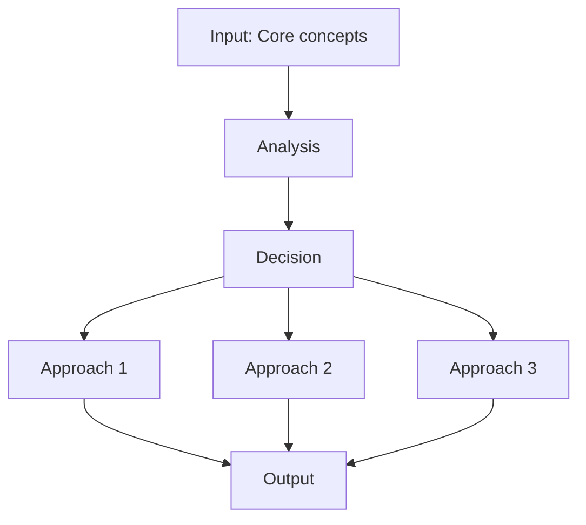

## 2. Methods — Methods

### 2.1 Method selection
| Method | 適用情境 | Pros | Cons |
|---|---|---|---|
| Analytical | 解析 | Exact | Limited geometry |
| Numerical | 數值 | General | Approximate |
| Experimental | 實驗 | Real | Expensive |
| Empirical | 經驗 | Fast | Limited range |

### 2.2 Decision flow
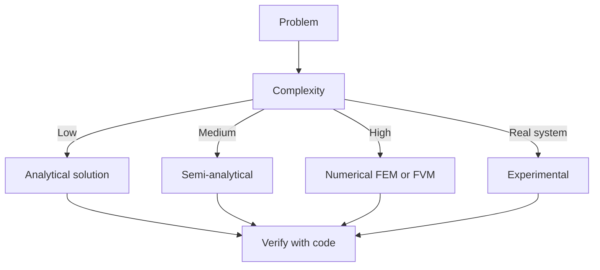

### 2.3 Standards and codes
ACI, AISC, Eurocode, building codes (IBC), industry best practices.

## 3. Applications — Analysis techniques

### 3.1 Statistical methods
Monte Carlo, sensitivity, FOSM for uncertainty analysis.

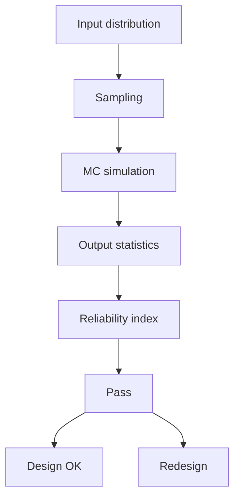

### 3.2 Optimization
LP, NLP, gradient-based, metaheuristic, multi-objective Pareto.

## 4. Design process

### 4.1 Design workflow
Concept → Preliminary → Detailed → Construction → Operation.

### 4.2 Design criteria
Safety (LRFD, ASD), serviceability, durability, sustainability.


## 5. Modern trends

BIM integration, AI/ML in design, digital twins, sustainability, LCA, resilient design.

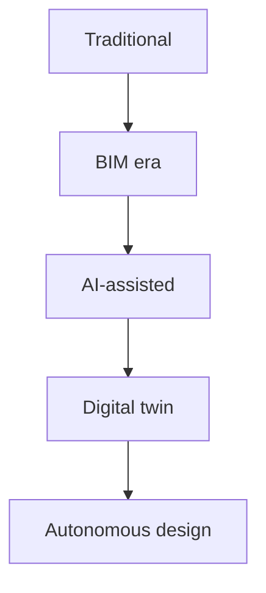

---

# 深度自測問題詳解（中英對照）

## 詳解 1: Derive core relationship
**Q1.** Derive core relationship for Organic Chemistry.
**Answer:** Starting from definitions, derive the key equation. Verify units and limits.

**Engineering implication:** Apply to design check, code compliance.

## 詳解 2: Identify failure mode
**Answer:** List 3-5 failure modes, rank by likelihood × consequence.

**Engineering implication:** Inform design, maintenance, monitoring.

## 詳解 3: Estimate order of magnitude
**Answer:** Quick back-of-envelope check using characteristic values.

**Engineering implication:** Sanity check before detailed analysis.

## 詳解 4: Compare to code requirement
**Answer:** Apply ACI/AISC/Eurocode, compute utilization ratio.

**Engineering implication:** Pass/fail design verification.

## 詳解 5: Compute reliability
**Answer:** $\beta = (\mu - R)/\sigma$ for lognormal, find P_f.

**Engineering implication:** LRFD calibration, risk-informed design.

## 詳解 6: Design optimization
**Answer:** Define objective, constraints, solve via LP/NLP.

**Engineering implication:** Cost-effective, sustainable design.

## 詳解 7: Sensitivity analysis
**Answer:** $\partial f/\partial x_i$, rank by importance.

**Engineering implication:** Identify critical parameters, reduce uncertainty.

## 詳解 8: Life-cycle assessment
**Answer:** Cradle-to-grave, compute GWP, embodied carbon.

**Engineering implication:** Sustainable design, climate goals.

## 詳解 9: Risk assessment
**Answer:** Hazard × vulnerability × exposure, compute risk.

**Engineering implication:** Resilience planning, mitigation.

## 詳解 10: Communication
**Answer:** Technical writing, visualization, presentation to stakeholders.

**Engineering implication:** Effective engineering practice.

---

## 📊 Diagram 1: Course Concept Map


## 📊 Diagram 2: Method Selection


## 📊 Diagram 3: Design Process


## 📊 Diagram 4: Risk-Reliability


## 📊 Diagram 5: Modern Tools


---

## 總結

1. **Core concepts** — Core concepts 嘅 foundation
2. **Methods** — analytical + numerical + experimental
3. **Applications** — design, analysis, retrofit
4. **Standards** — codes, best practices
5. **Future** — BIM, AI, sustainability, resilience

**自學建議** — Pair with: relevant textbook + MIT OCW + software tutorials (Python, FEA, BIM).
