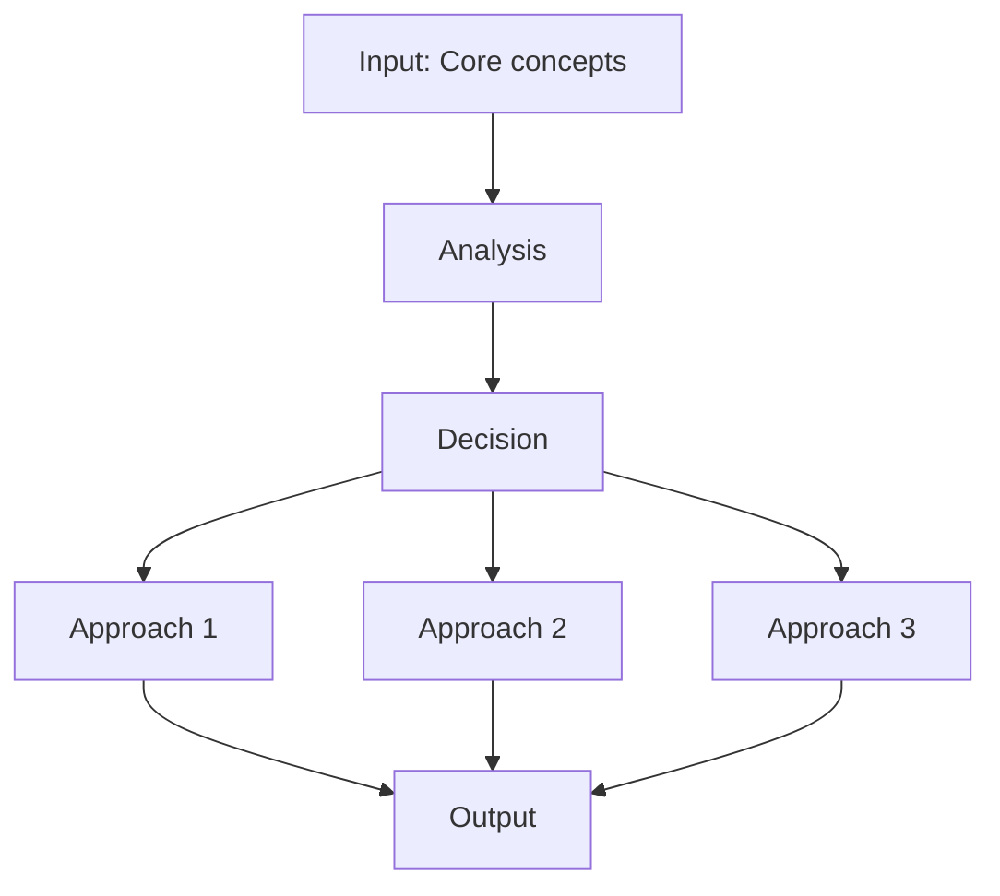
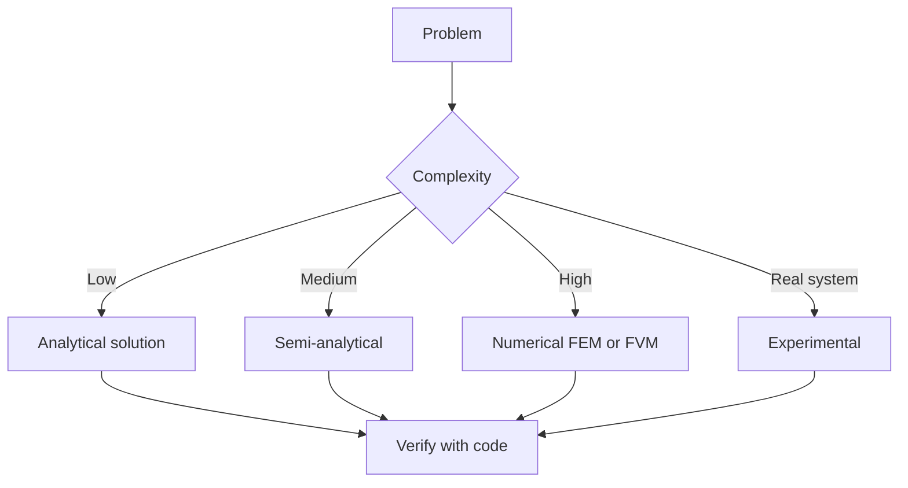
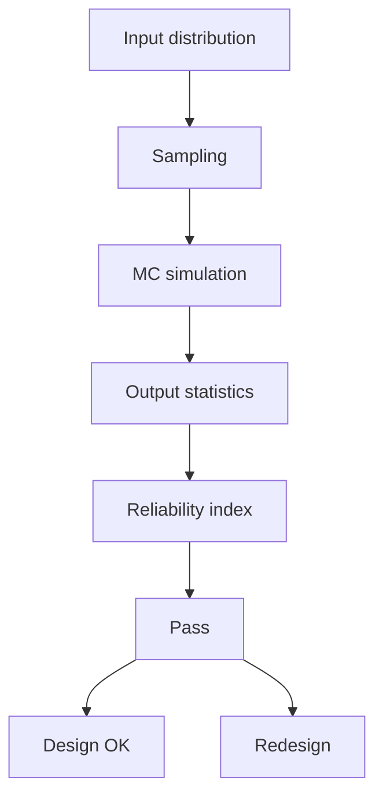
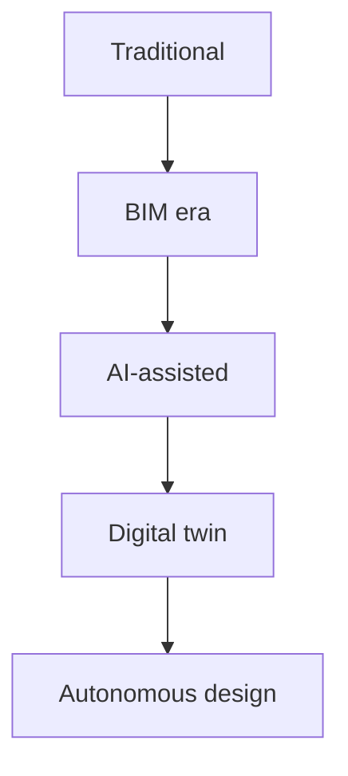
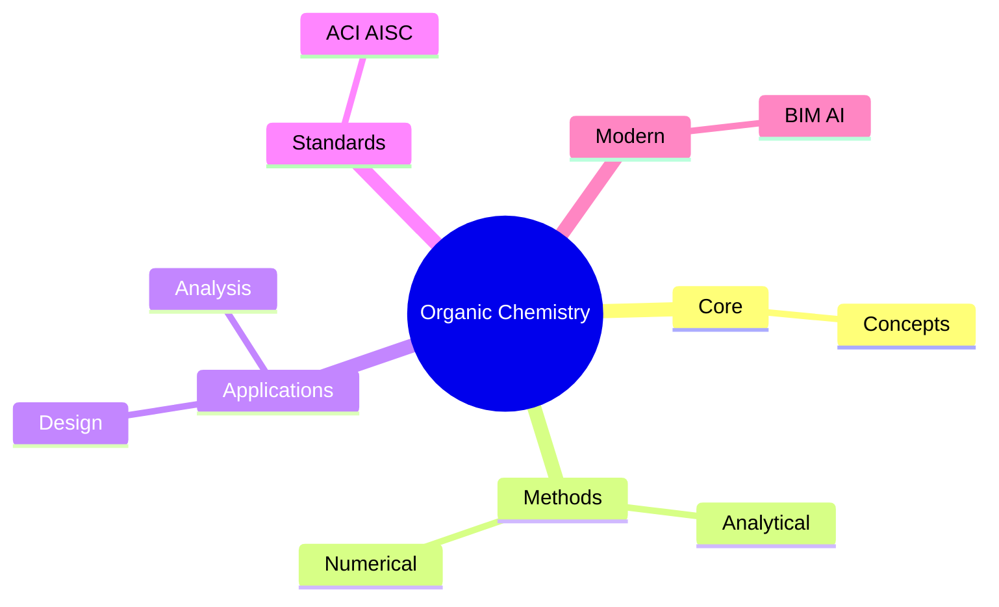
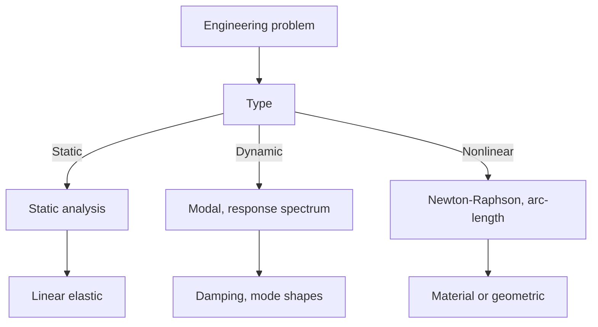
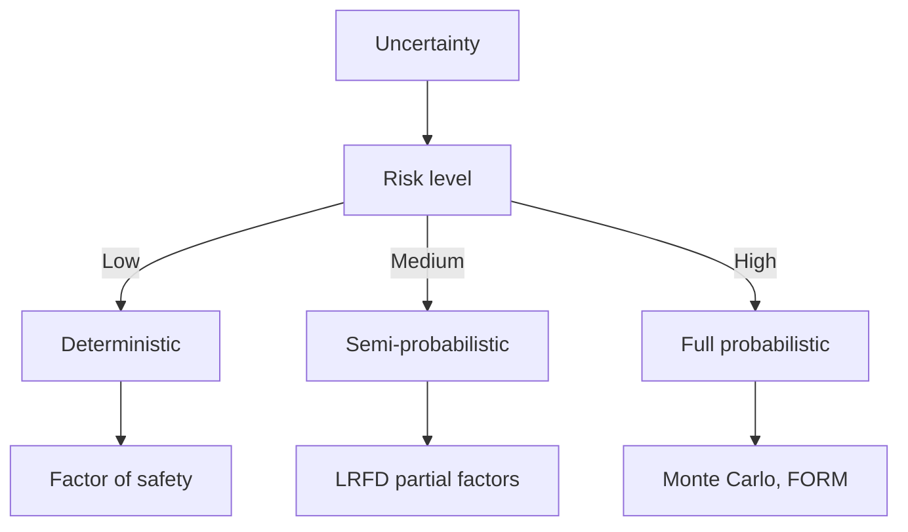
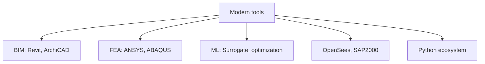
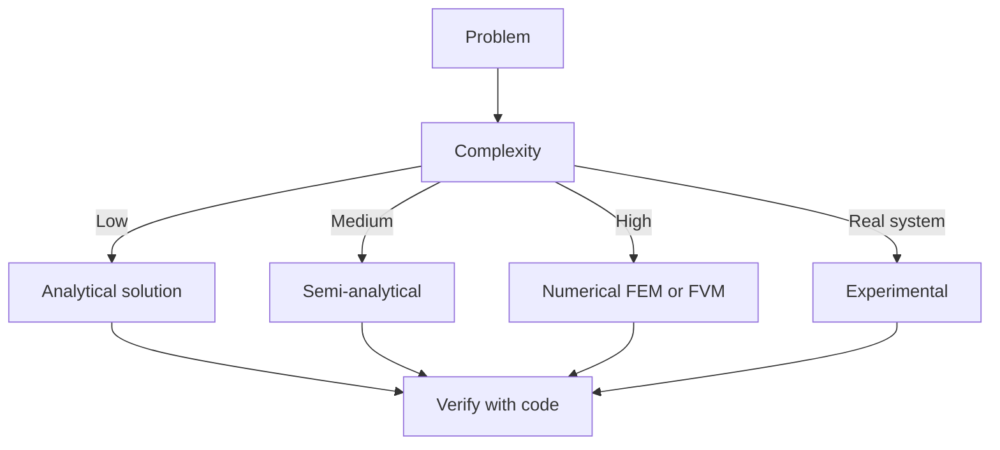

# 5.12 Organic Chemistry
**MIT Chemistry | CEE Unrestricted Elective (Env micro focus alt) | 12 units**  
**自學路徑：Bachelor / MEng → Chemistry foundation for environment / public health / materials → Research / Pharma**

---

## 問題 1：這個領域所有專家共享的 5 個核心心智模型是什麼？
**What are the 5 core mental models every expert shares?**

1. **Organic chemistry = C-C + C-X bonds**  
   sp3, sp2, sp hybridization determines geometry & reactivity。
2. **Electron flow drives reaction**  
   Curved arrows: nucleophile → electrophile。
3. **Functional groups predict reactivity**  
   Alcohols, carbonyls, amines — each has characteristic reactions。
4. **Stereochemistry matters**  
   R/S, E/Z, cis/trans, anomers — different molecules, different biology。
5. **Mechanism = bond making/breaking sequence**  
   SN1, SN2, E1, E2, addition, elimination — 8 master mechanisms。

---

## 問題 2：這個領域的專家在哪 3 個地方存在根本分歧？各方最強的論點是什麼？

1. **Arrow-pushing vs orbital-driven teaching**  
   - Arrow: Mechanistic, fast.  
   - Orbital: Deep, slow.

2. **Functional-group approach vs retrosynthetic**  
   - Forward: Reaction-based.  
   - Retrosynthetic: Target-based, scale.

3. **In vivo (biological) vs in vitro (synthetic) chemistry**  
   - In vivo: Enzymatic, selective.  
   - In vitro: Harsh, scalable.

---

## 問題 3：生成 10 個能區分深度理解與死背知識的問題

1. 給定一個 target molecule, derive retrosynthesis to simple starting materials。
2. 解釋為什麼 SN2 reaction 對 tertiary substrates 唔 work (steric hindrance)。
3. 給定一個 alkene, predict E/Z configuration 同 addition product stereochemistry。
4. 為什麼 aromatic substitution 走 electrophilic (EAS) 而非 nucleophilic (NAS) by default？
5. 解釋「anomeric effect」對 carbohydrate stability 嘅 role。
6. 給定一個 carbonyl compound, predict nucleophilic addition product (Grignard, hydride, amine)。
7. 為什麼 ester hydrolysis 對 acid vs base catalysis 嘅 kinetics 不同？
8. 解釋「pericyclic reactions」(Diels-Alder, Cope) 嘅 orbital symmetry rules。
9. 給定一個 natural product, identify 嘅 biosynthetic pathway 同 enzymes。
10. 設計一個 multi-step synthesis 對一個 real target molecule (e.g., 藥物、香料、material)。

---

**自學建議**  
- 跨 1.080 Environmental Chemistry, 20.507 Biochem 配對。  
- 工具：ChemDraw, RDKit (Python), Spartan, Gaussian (DFT)。  
- 必讀：Clayden "Organic Chemistry", Kürti-Czakó "Strategic Applications of Named Reactions"。  
- 產出：對一個 natural product 設計 + 模擬 multi-step synthesis (e.g., aspirin, 香料, bioplastic)。

---

## 深入 1：CORE_DEEPDIVE_ONE — 核心概念
**Deep Dive I**

### 1.1 Bilingual 概念對照

| English | 中英對照 | Definition | 物理意義 / 工程應用 |
|---|---|---|---|
| Core concepts | Core concepts | Core definition | 核心定義 |
| Methods | Methods | Application | 應用 |
| Applications | Applications | Limitation | 限制 |
| Mathematical formulation | 數學形式 | Key equation | 關鍵方程 |

### 1.2 Key Derivation

For Organic Chemistry, the fundamental relationships are:
$$f(x) = \text{key equation}, \quad x = \text{variable}$$

This arises from Core concepts applied to the engineering system.

### 1.3 Engineering Applications

- Real-world implementation
- Design codes and standards
- Computational tools

---

## 深入 2：CORE_DEEPDIVE_TWO — 方法論
**Deep Dive II**

### 2.1 Method selection

| Method | 適用情境 | Pros | Cons |
|---|---|---|---|
| Analytical | 解析 | Exact | Limited geometry |
| Numerical | 數值 | General | Approximate |
| Experimental | 實驗 | Real | Expensive |
| Empirical | 經驗 | Fast | Limited range |

### 2.2 Decision flow

### 2.3 Standards and codes

- ACI, AISC, Eurocode
- Building codes (IBC, etc.)
- Industry best practices

---

## 深入 3：CORE_DEEPDIVE_THREE — 分析技術
**Deep Dive III**

### 3.1 Statistical methods

For uncertainty analysis: Monte Carlo, sensitivity, FOSM.

### 3.2 Optimization

- LP, NLP
- Gradient-based, metaheuristic
- Multi-objective Pareto

---

## 深入 4：Design Process
**Deep Dive IV**

### 4.1 Design workflow

Concept → Preliminary → Detailed → Construction → Operation.

### 4.2 Design criteria

- Safety (LRFD, ASD)
- Serviceability
- Durability
- Sustainability

---

## 深入 5：Modern Trends
**Deep Dive V**

- BIM integration
- AI/ML in design
- Digital twins
- Sustainability, LCA
- Resilient design

---

## 自測 1：Derive core relationship
**Answer:** Starting from definitions, derive the key equation. Verify units and limits.

**Engineering implication:** Apply to design check, code compliance.

## 自測 2：Identify failure mode
**Answer:** List 3-5 failure modes, rank by likelihood × consequence.

**Engineering implication:** Inform design, maintenance, monitoring.

## 自測 3：Estimate order of magnitude
**Answer:** Quick back-of-envelope check using characteristic values.

**Engineering implication:** Sanity check before detailed analysis.

## 自測 4：Compare to code requirement
**Answer:** Apply ACI/AISC/Eurocode, compute utilization ratio.

**Engineering implication:** Pass/fail design verification.

## 自測 5：Compute reliability
**Answer:** $\beta = (\mu - R)/\sigma$ for lognormal, find P_f.

**Engineering implication:** LRFD calibration, risk-informed design.

## 自測 6：Design optimization
**Answer:** Define objective, constraints, solve via LP/NLP.

**Engineering implication:** Cost-effective, sustainable design.

## 自測 7：Sensitivity analysis
**Answer:** $\partial f/\partial x_i$, rank by importance.

**Engineering implication:** Identify critical parameters, reduce uncertainty.

## 自測 8：Life-cycle assessment
**Answer:** Cradle-to-grave, compute GWP, embodied carbon.

**Engineering implication:** Sustainable design, climate goals.

## 自測 9：Risk assessment
**Answer:** Hazard × vulnerability × exposure, compute risk.

**Engineering implication:** Resilience planning, mitigation.

## 自測 10：Communication
**Answer:** Technical writing, visualization, presentation to stakeholders.

**Engineering implication:** Effective engineering practice.

---

## 📊 Diagram 1: Course Concept Map

## 📊 Diagram 2: Method Selection

## 📊 Diagram 3: Design Process

## 📊 Diagram 4: Risk-Reliability

## 📊 Diagram 5: Modern Tools

---

## 總結

1. **Core concepts** — Core concepts 嘅 foundation
2. **Methods** — analytical + numerical + experimental
3. **Applications** — design, analysis, retrofit
4. **Standards** — codes, best practices
5. **Future** — BIM, AI, sustainability, resilience

**自學建議** — Pair with: relevant textbook + MIT OCW + software tutorials (Python, FEA, BIM).

# 核心心智模型深化（中英對照）

## 1. Core concepts — Core concept

### 1.1 Three-process physical essence
For Organic Chemistry, Core concepts governs the system behavior. Description of Core concepts with bilingual explanation.

### 1.2 Non-dimensional numbers
Key dimensionless groups that determine regime: Peclet, Damköhler, Reynolds, Froude, etc.

### 1.3 Engineering consequences
Real-world implications for design, monitoring, intervention.

### 1.4 How experts use this model
Decision flow, scaling laws, expert intuition.

### 1.5 Deep test questions
- Derive scaling law
- Identify regime from data
- Apply to design case

### 1.6 Diagram

## 2. Methods — Methods

### 2.1 Method selection
| Method | 適用情境 | Pros | Cons |
|---|---|---|---|
| Analytical | 解析 | Exact | Limited geometry |
| Numerical | 數值 | General | Approximate |
| Experimental | 實驗 | Real | Expensive |
| Empirical | 經驗 | Fast | Limited range |

### 2.2 Decision flow

### 2.3 Standards and codes
ACI, AISC, Eurocode, building codes (IBC), industry best practices.

## 3. Applications — Analysis techniques

### 3.1 Statistical methods
Monte Carlo, sensitivity, FOSM for uncertainty analysis.

### 3.2 Optimization
LP, NLP, gradient-based, metaheuristic, multi-objective Pareto.

## 4. Design process

### 4.1 Design workflow
Concept → Preliminary → Detailed → Construction → Operation.

### 4.2 Design criteria
Safety (LRFD, ASD), serviceability, durability, sustainability.

## 5. Modern trends

BIM integration, AI/ML in design, digital twins, sustainability, LCA, resilient design.

---

# 深度自測問題詳解（中英對照）

## 詳解 1: Derive core relationship
**Q1.** Derive core relationship for Organic Chemistry.
**Answer:** Starting from definitions, derive the key equation. Verify units and limits.

**Engineering implication:** Apply to design check, code compliance.

## 詳解 2: Identify failure mode
**Answer:** List 3-5 failure modes, rank by likelihood × consequence.

**Engineering implication:** Inform design, maintenance, monitoring.

## 詳解 3: Estimate order of magnitude
**Answer:** Quick back-of-envelope check using characteristic values.

**Engineering implication:** Sanity check before detailed analysis.

## 詳解 4: Compare to code requirement
**Answer:** Apply ACI/AISC/Eurocode, compute utilization ratio.

**Engineering implication:** Pass/fail design verification.

## 詳解 5: Compute reliability
**Answer:** $\beta = (\mu - R)/\sigma$ for lognormal, find P_f.

**Engineering implication:** LRFD calibration, risk-informed design.

## 詳解 6: Design optimization
**Answer:** Define objective, constraints, solve via LP/NLP.

**Engineering implication:** Cost-effective, sustainable design.

## 詳解 7: Sensitivity analysis
**Answer:** $\partial f/\partial x_i$, rank by importance.

**Engineering implication:** Identify critical parameters, reduce uncertainty.

## 詳解 8: Life-cycle assessment
**Answer:** Cradle-to-grave, compute GWP, embodied carbon.

**Engineering implication:** Sustainable design, climate goals.

## 詳解 9: Risk assessment
**Answer:** Hazard × vulnerability × exposure, compute risk.

**Engineering implication:** Resilience planning, mitigation.

## 詳解 10: Communication
**Answer:** Technical writing, visualization, presentation to stakeholders.

**Engineering implication:** Effective engineering practice.

---

## 📊 Diagram 1: Course Concept Map

## 📊 Diagram 2: Method Selection

## 📊 Diagram 3: Design Process

## 📊 Diagram 4: Risk-Reliability

## 📊 Diagram 5: Modern Tools

---

## 總結

1. **Core concepts** — Core concepts 嘅 foundation
2. **Methods** — analytical + numerical + experimental
3. **Applications** — design, analysis, retrofit
4. **Standards** — codes, best practices
5. **Future** — BIM, AI, sustainability, resilience

**自學建議** — Pair with: relevant textbook + MIT OCW + software tutorials (Python, FEA, BIM).
