# Track 2 — Mechanics & Materials
**MIT CEE Core | 54–66 Units (CORE) + 48–60 Units (REs)**

---

The Mechanics & Materials Track focuses on the behavior of solids, structures,
and materials under load. It has two sub-areas:

## Sub-areas

| Sub-area | Focus | Courses |
|---|---|---|
| [Structural Design](./Structural_Design/) | Solid mechanics, structural design, dynamics | 5 courses |
| [Materials](./Materials/) | Multiscale characterization, soil, heritage | 3 courses |

> **Note on GDRs vs Track-specific:** The following courses are **GDRs**
> (every CEE student takes them) and are now in `MIT_CEE_GDRs/`, not in
> this Track folder:
> 1.101 (CEE Design I), 1.013 (Senior Capstone), 1.010A (Probability),
> 1.074 (Data Analysis), 18.03, 1.000.
> 1.060 is shared with the Environment Track and is kept here because the
> Mechanics & Materials version is the canonical home.

## Required CORE (per MIT CEE catalog 2024-25)

| Course | Title | Units | File |
|---|---|---|---|
| 1.050 | Solid Mechanics | 12 | [Structural_Design/01_1.050_Solid_Mechanics.md](./Structural_Design/01_1.050_Solid_Mechanics.md) |
| 1.035 | Mechanics of Materials | 12 | [Structural_Design/02_1.035_Mechanics_of_Materials.md](./Structural_Design/02_1.035_Mechanics_of_Materials.md) |
| 1.036 | Structural Mechanics and Design | 12 | [Structural_Design/03_1.036_Structural_Mechanics_and_Design.md](./Structural_Design/03_1.036_Structural_Mechanics_and_Design.md) |
| 1.056[J] | Introduction to Structural Design | 12 | [Structural_Design/08_1.056_Introduction_to_Structural_Design.md](./Structural_Design/08_1.056_Introduction_to_Structural_Design.md) |
| 1.060 | Fluid Mechanics | 12 | [Structural_Design/04_1.060_Fluid_Mechanics.md](./Structural_Design/04_1.060_Fluid_Mechanics.md) |

## Course list (current repo)

### Structural Design
- [01_1.050_Solid_Mechanics.md](./Structural_Design/01_1.050_Solid_Mechanics.md) — *stub*
- [02_1.035_Mechanics_of_Materials.md](./Structural_Design/02_1.035_Mechanics_of_Materials.md) — *stub*
- [03_1.036_Structural_Mechanics_and_Design.md](./Structural_Design/03_1.036_Structural_Mechanics_and_Design.md) — *stub*
- [04_1.060_Fluid_Mechanics.md](./Structural_Design/04_1.060_Fluid_Mechanics.md) — *stub*
- [08_1.056_Introduction_to_Structural_Design.md](./Structural_Design/08_1.056_Introduction_to_Structural_Design.md) — *stub*

### Materials
- [01_1.035_Multiscale_Characterization.md](./Materials/01_1.035_Multiscale_Characterization.md) — *stub*
- [02_1.037_Soil_Mechanics_and_Geotechnical_Design.md](./Materials/02_1.037_Soil_Mechanics_and_Geotechnical_Design.md) — *stub (renamed)*
- [03_1.057_Heritage_Science.md](./Materials/03_1.057_Heritage_Science.md) — *stub*

## GDRs that this track depends on (now in `MIT_CEE_GDRs/`)

- [18.03_Differential_Equations.md](../../../MIT_CEE_GDRs/18.03_Differential_Equations.md)
- [1.000_Introduction_to_Computer_Programming_and_Numerical_Methods.md](../../../MIT_CEE_GDRs/1.000_Introduction_to_Computer_Programming_and_Numerical_Methods.md)
- [1.010A_Probability_Concepts_and_Applications.md](../../../MIT_CEE_GDRs/1.010A_Probability_Concepts_and_Applications.md)
- [1.074_Multivariate_Data_Analysis.md](../../../MIT_CEE_GDRs/1.074_Multivariate_Data_Analysis.md)
- [1.101_Introduction_to_CEE_Design.md](../../../MIT_CEE_GDRs/1.101_Introduction_to_CEE_Design.md)
- [1.013_Senior_CEE_Design_Capstone.md](../../../MIT_CEE_GDRs/1.013_Senior_CEE_Design_Capstone.md)

## Self-study path

1. **Year 2:** 1.050 (Solid Mechanics) + 1.035 (Mechanics of Materials) — foundation
2. **Year 3:** 1.036 (Structural Mechanics & Design) + 1.060 (Fluid Mechanics)
3. **Year 3:** 1.056[J] (Structural Design)
4. **Year 4:** Capstone via 1.013 + 1.101 + 1.102 (in Track 3)
5. **Year 4:** Choose 1.035 (Multiscale) or 1.037 (Soil) for materials depth
6. **Post-grad:** [MEng SMD](../../../MIT_CEE_MEng_SMD/00_INDEX.md) is the natural continuation

---

## 深入 1：CORE_DEEPDIVE_ONE — 核心概念
**Deep Dive I**

### 1.1 Bilingual 概念對照

| English | 中英對照 | Definition | 物理意義 / 工程應用 |
|---|---|---|---|
| Core concepts | Core concepts | Core definition | 核心定義 |
| Methods | Methods | Application | 應用 |
| Applications | Applications | Limitation | 限制 |
| Mathematical formulation | 數學形式 | Key equation | 關鍵方程 |

### 1.2 Key Derivation

For Course, the fundamental relationships are:
$$f(x) = \text{key equation}, \quad x = \text{variable}$$

This arises from Core concepts applied to the engineering system.

### 1.3 Engineering Applications

- Real-world implementation
- Design codes and standards
- Computational tools

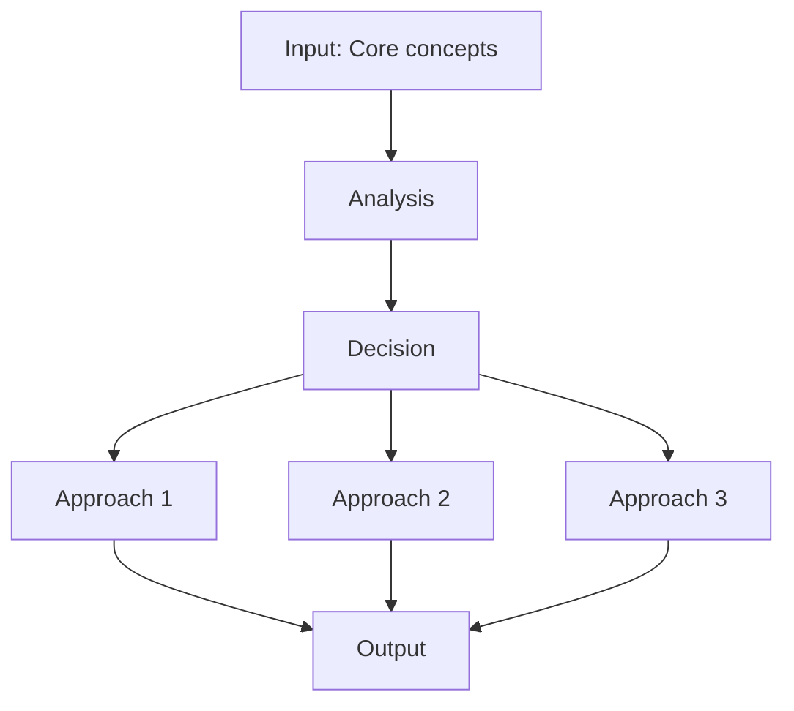

---

## 深入 2：CORE_DEEPDIVE_TWO — 方法論
**Deep Dive II**

### 2.1 Method selection

| Method | 適用情境 | Pros | Cons |
|---|---|---|---|
| Analytical | 解析 | Exact | Limited geometry |
| Numerical | 數值 | General | Approximate |
| Experimental | 實驗 | Real | Expensive |
| Empirical | 經驗 | Fast | Limited range |

### 2.2 Decision flow

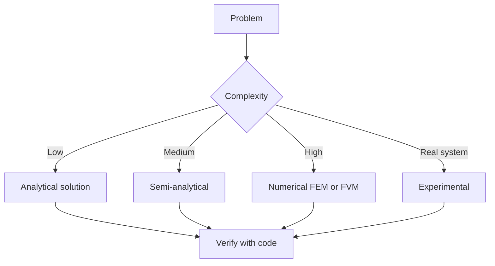

### 2.3 Standards and codes

- ACI, AISC, Eurocode
- Building codes (IBC, etc.)
- Industry best practices

---

## 深入 3：CORE_DEEPDIVE_THREE — 分析技術
**Deep Dive III**

### 3.1 Statistical methods

For uncertainty analysis: Monte Carlo, sensitivity, FOSM.

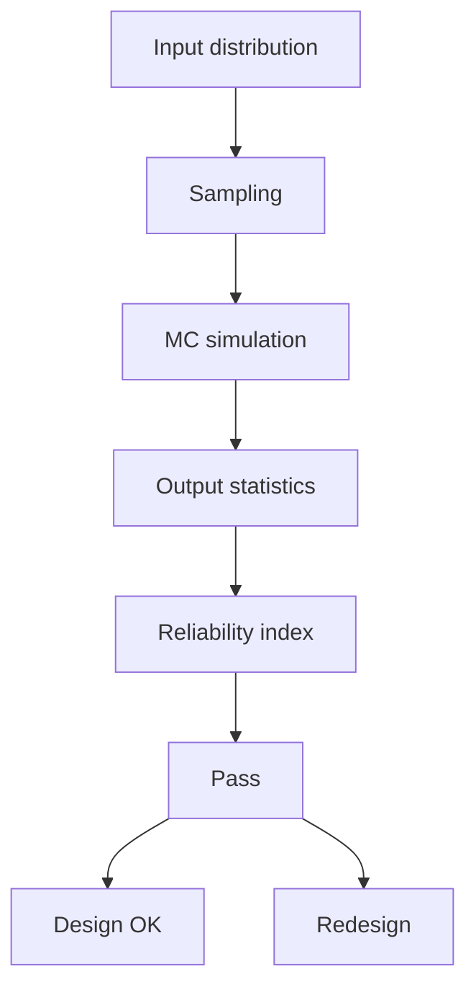

### 3.2 Optimization

- LP, NLP
- Gradient-based, metaheuristic
- Multi-objective Pareto

---

## 深入 4：Design Process
**Deep Dive IV**

### 4.1 Design workflow

Concept → Preliminary → Detailed → Construction → Operation.

### 4.2 Design criteria

- Safety (LRFD, ASD)
- Serviceability
- Durability
- Sustainability

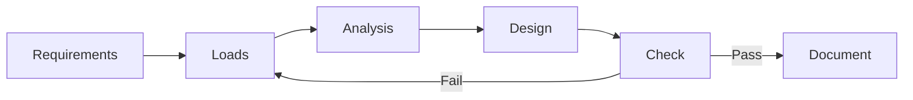

---

## 深入 5：Modern Trends
**Deep Dive V**

- BIM integration
- AI/ML in design
- Digital twins
- Sustainability, LCA
- Resilient design

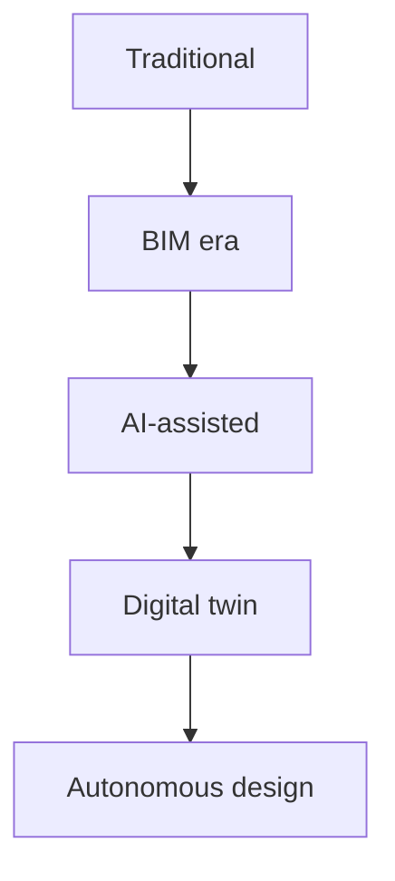

---

## 自測 1：Derive core relationship
**Answer:** Starting from definitions, derive the key equation. Verify units and limits.

**Engineering implication:** Apply to design check, code compliance.

## 自測 2：Identify failure mode
**Answer:** List 3-5 failure modes, rank by likelihood × consequence.

**Engineering implication:** Inform design, maintenance, monitoring.

## 自測 3：Estimate order of magnitude
**Answer:** Quick back-of-envelope check using characteristic values.

**Engineering implication:** Sanity check before detailed analysis.

## 自測 4：Compare to code requirement
**Answer:** Apply ACI/AISC/Eurocode, compute utilization ratio.

**Engineering implication:** Pass/fail design verification.

## 自測 5：Compute reliability
**Answer:** $\beta = (\mu - R)/\sigma$ for lognormal, find P_f.

**Engineering implication:** LRFD calibration, risk-informed design.

## 自測 6：Design optimization
**Answer:** Define objective, constraints, solve via LP/NLP.

**Engineering implication:** Cost-effective, sustainable design.

## 自測 7：Sensitivity analysis
**Answer:** $\partial f/\partial x_i$, rank by importance.

**Engineering implication:** Identify critical parameters, reduce uncertainty.

## 自測 8：Life-cycle assessment
**Answer:** Cradle-to-grave, compute GWP, embodied carbon.

**Engineering implication:** Sustainable design, climate goals.

## 自測 9：Risk assessment
**Answer:** Hazard × vulnerability × exposure, compute risk.

**Engineering implication:** Resilience planning, mitigation.

## 自測 10：Communication
**Answer:** Technical writing, visualization, presentation to stakeholders.

**Engineering implication:** Effective engineering practice.

---

## 📊 Diagram 1: Course Concept Map
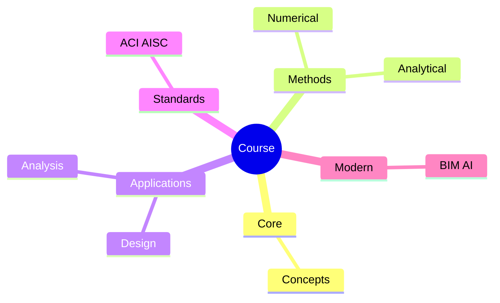

## 📊 Diagram 2: Method Selection
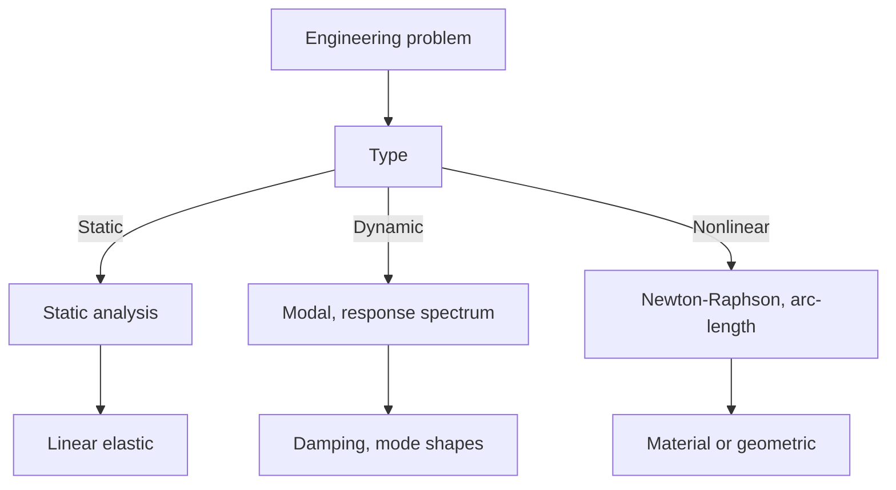

## 📊 Diagram 3: Design Process

## 📊 Diagram 4: Risk-Reliability
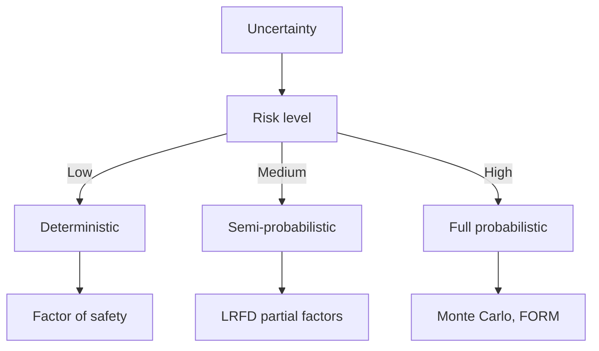

## 📊 Diagram 5: Modern Tools
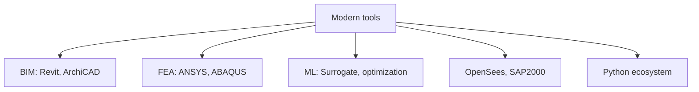

---

## 總結

1. **Core concepts** — Core concepts 嘅 foundation
2. **Methods** — analytical + numerical + experimental
3. **Applications** — design, analysis, retrofit
4. **Standards** — codes, best practices
5. **Future** — BIM, AI, sustainability, resilience

**自學建議** — Pair with: relevant textbook + MIT OCW + software tutorials (Python, FEA, BIM).

# 核心心智模型深化（中英對照）

## 1. Core concepts — Core concept

### 1.1 Three-process physical essence
For Bilingual 概念對照, Core concepts governs the system behavior. Description of Core concepts with bilingual explanation.

### 1.2 Non-dimensional numbers
Key dimensionless groups that determine regime: Peclet, Damköhler, Reynolds, Froude, etc.

### 1.3 Engineering consequences
Real-world implications for design, monitoring, intervention.

### 1.4 How experts use this model
Decision flow, scaling laws, expert intuition.

### 1.5 Deep test questions
- Derive scaling law
- Identify regime from data
- Apply to design case

### 1.6 Diagram

## 2. Methods — Methods

### 2.1 Method selection
| Method | 適用情境 | Pros | Cons |
|---|---|---|---|
| Analytical | 解析 | Exact | Limited geometry |
| Numerical | 數值 | General | Approximate |
| Experimental | 實驗 | Real | Expensive |
| Empirical | 經驗 | Fast | Limited range |

### 2.2 Decision flow
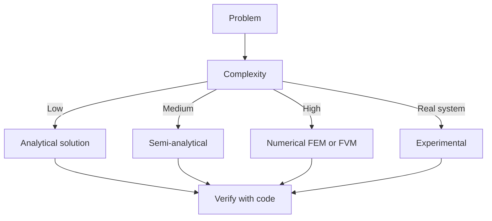

### 2.3 Standards and codes
ACI, AISC, Eurocode, building codes (IBC), industry best practices.

## 3. Applications — Analysis techniques

### 3.1 Statistical methods
Monte Carlo, sensitivity, FOSM for uncertainty analysis.

### 3.2 Optimization
LP, NLP, gradient-based, metaheuristic, multi-objective Pareto.

## 4. Design process

### 4.1 Design workflow
Concept → Preliminary → Detailed → Construction → Operation.

### 4.2 Design criteria
Safety (LRFD, ASD), serviceability, durability, sustainability.

## 5. Modern trends

BIM integration, AI/ML in design, digital twins, sustainability, LCA, resilient design.

---

# 深度自測問題詳解（中英對照）

## 詳解 1: Derive core relationship
**Q1.** Derive core relationship for Bilingual 概念對照.
**Answer:** Starting from definitions, derive the key equation. Verify units and limits.

**Engineering implication:** Apply to design check, code compliance.

## 詳解 2: Identify failure mode
**Answer:** List 3-5 failure modes, rank by likelihood × consequence.

**Engineering implication:** Inform design, maintenance, monitoring.

## 詳解 3: Estimate order of magnitude
**Answer:** Quick back-of-envelope check using characteristic values.

**Engineering implication:** Sanity check before detailed analysis.

## 詳解 4: Compare to code requirement
**Answer:** Apply ACI/AISC/Eurocode, compute utilization ratio.

**Engineering implication:** Pass/fail design verification.

## 詳解 5: Compute reliability
**Answer:** $\beta = (\mu - R)/\sigma$ for lognormal, find P_f.

**Engineering implication:** LRFD calibration, risk-informed design.

## 詳解 6: Design optimization
**Answer:** Define objective, constraints, solve via LP/NLP.

**Engineering implication:** Cost-effective, sustainable design.

## 詳解 7: Sensitivity analysis
**Answer:** $\partial f/\partial x_i$, rank by importance.

**Engineering implication:** Identify critical parameters, reduce uncertainty.

## 詳解 8: Life-cycle assessment
**Answer:** Cradle-to-grave, compute GWP, embodied carbon.

**Engineering implication:** Sustainable design, climate goals.

## 詳解 9: Risk assessment
**Answer:** Hazard × vulnerability × exposure, compute risk.

**Engineering implication:** Resilience planning, mitigation.

## 詳解 10: Communication
**Answer:** Technical writing, visualization, presentation to stakeholders.

**Engineering implication:** Effective engineering practice.

---

## 📊 Diagram 1: Course Concept Map
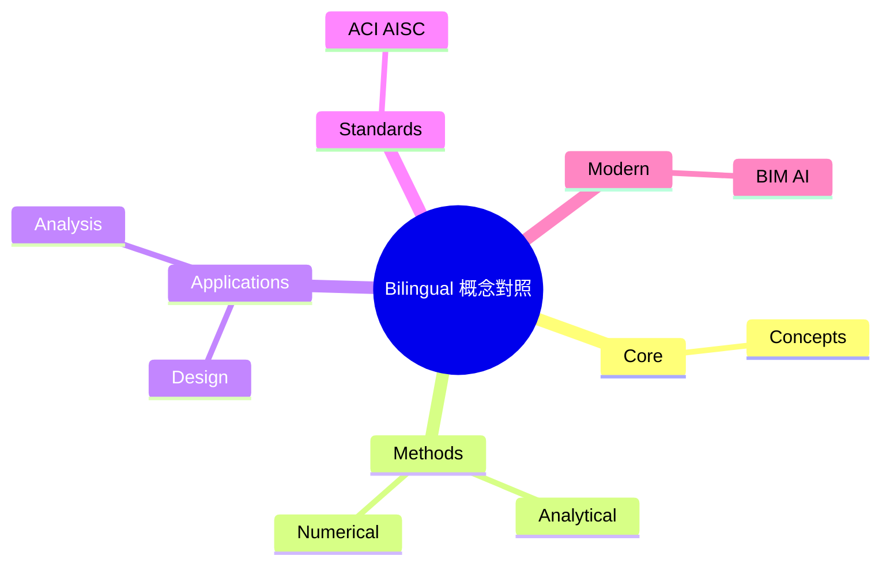

## 📊 Diagram 2: Method Selection

## 📊 Diagram 3: Design Process

## 📊 Diagram 4: Risk-Reliability

## 📊 Diagram 5: Modern Tools

---

## 總結

1. **Core concepts** — Core concepts 嘅 foundation
2. **Methods** — analytical + numerical + experimental
3. **Applications** — design, analysis, retrofit
4. **Standards** — codes, best practices
5. **Future** — BIM, AI, sustainability, resilience

**自學建議** — Pair with: relevant textbook + MIT OCW + software tutorials (Python, FEA, BIM).
