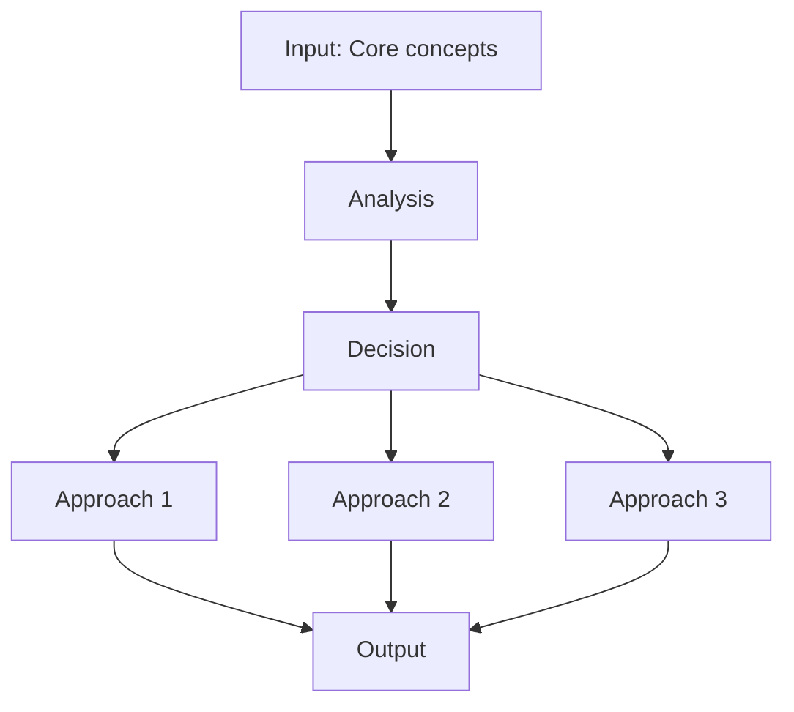
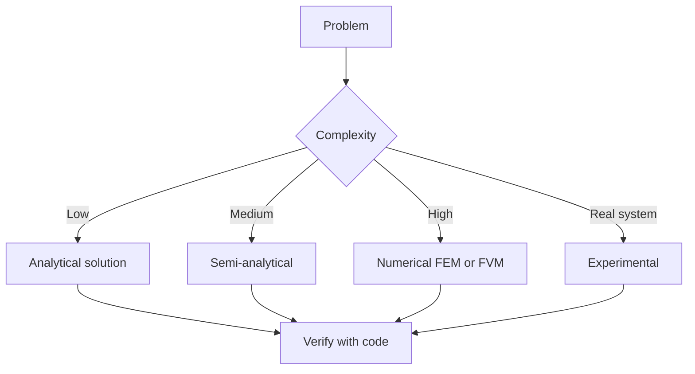
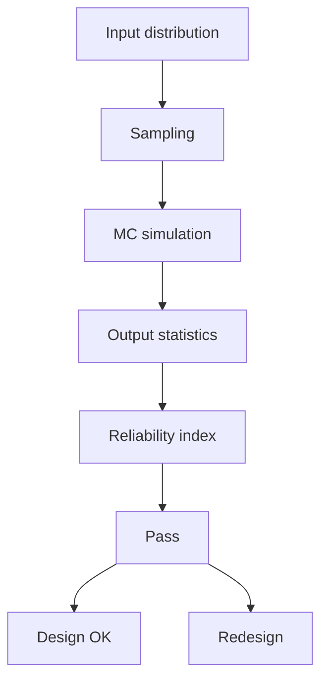
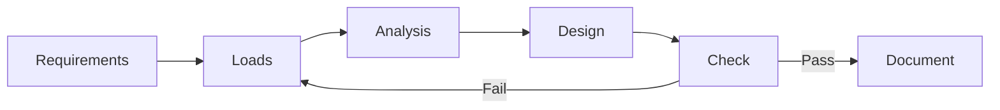
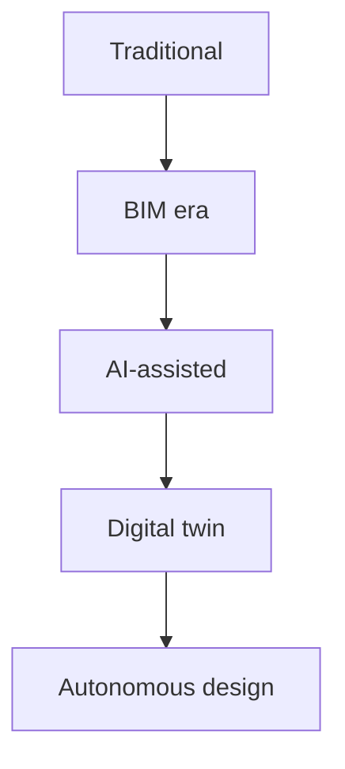
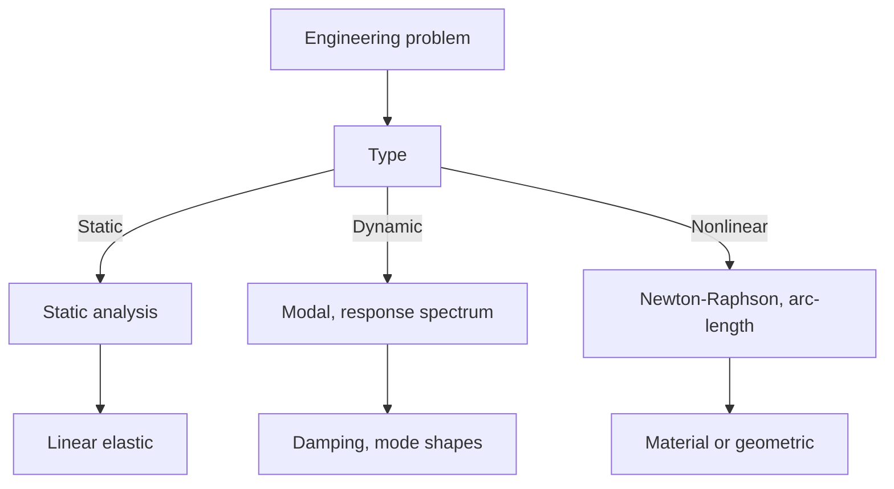
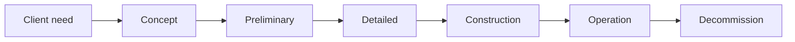
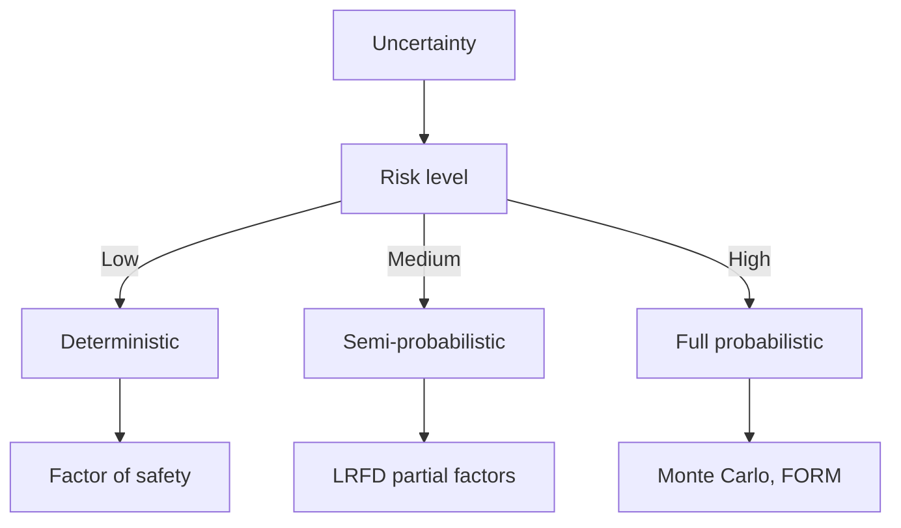
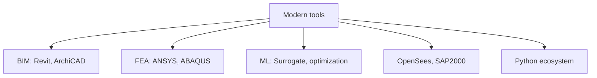
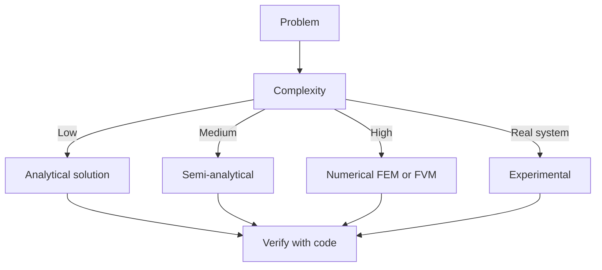

# 1.035 Multiscale Characterization of Materials (Materials Track focus)
**MIT CEE Materials Track | Core**  
**自學路徑：Bachelor Mechanics & Materials → MEng → ICE**

---

## 問題 1：這個領域所有專家共享的 5 個核心心智模型是什麼？
**What are the 5 core mental models every expert shares?**

1. **材料行為由微觀結構決定**  
   Composition + processing → microstructure → properties. Characterization is the bridge between processing and performance.

2. **多尺度是必然的**  
   Atomic → nano → micro → meso → macro. Properties at one scale emerge from mechanisms at lower scales.

3. **缺陷與界面往往主導性能**  
   Grain boundaries, interfaces, voids, and inclusions frequently control strength, toughness, and durability more than the bulk matrix.

4. **表徵必須與模擬閉環**  
   Experimental data without a model is description; models without experimental validation are speculation.

5. **時間與環境是「隱形」的微觀結構演化驅動**  
   Creep, corrosion, radiation, and fatigue continuously change the microstructure in service.

---

## 問題 2：這個領域的專家在哪 3 個地方存在根本分歧？各方最強的論點是什麼？

1. **實驗表徵為主 vs 計算材料科學為主**  
   - Experimental: Ground truth, captures real complexity.  
   - Computational: Can explore vast design space and isolate mechanisms that experiments cannot.

2. **唯象本構 vs 機制-based 多尺度模型**  
   - Phenomenological: Efficient for structural analysis.  
   - Mechanism-based: Better predictive power outside calibration range.

3. **傳統土木工程材料 vs 新型先進材料（超材料、生物啟發、自修復）**  
   - Traditional: Proven, code-supported, cost-effective.  
   - Advanced: Higher performance potential, but lack long-term data and design methods.

---

## 問題 3：生成 10 個能區分深度理解與死背知識的問題

1. 如何從 XRD 或 EBSD 數據定量描述織構，並連結到各向異性力學行為？
2. 說明為什麼奈米尺度的強度可以接近理論強度，而宏觀材料遠低於理論值。
3. 在混凝土中，如何用壓汞法、BET、SEM 綜合描述孔結構，並預測滲透性？
4. 給定一個金屬的應力-應變曲線，如何從中反推位錯密度演化？
5. 為什麼界面（如 FRP-混凝土、鋼-混凝土）的表徵特別困難？主要挑戰是什麼？
6. 說明原子探針斷層掃描（APT）與傳統 TEM 在成分分析上的互補性。
7. 如何設計一個實驗來區分「材料固有尺寸效應」與「統計尺寸效應」？
8. 在高溫或腐蝕環境下，微觀結構演化如何加速？用哪些原位技術觀察？
9. 為什麼機器學習在材料表徵數據分析中特別有用？主要陷阱是什麼？
10. 從微觀到宏觀的均質化過程中，代表性體積單元（RVE）的尺寸如何選擇？

---

**自學建議**  
- 與 1.050 / 1.035 交叉。  
- 產出：一個材料表徵案例報告（實驗 + 模擬），作為 ICE 材料相關屬性證據。


---

## 深入 1：CORE_DEEPDIVE_ONE — 核心概念
**Deep Dive I**

### 1.1 Bilingual 概念對照

| English | 中英對照 | Definition | 物理意義 / 工程應用 |
|---|---|---|---|
| Core concepts | Core concepts | Core definition | 核心定義 |
| Methods | Methods | Application | 應用 |
| Applications | Applications | Limitation | 限制 |
| Mathematical formulation | 數學形式 | Key equation | 關鍵方程 |

### 1.2 Key Derivation

For Multiscale Characterization of Materials (Materials Track focus), the fundamental relationships are:
$$f(x) = \text{key equation}, \quad x = \text{variable}$$

This arises from Core concepts applied to the engineering system.

### 1.3 Engineering Applications

- Real-world implementation
- Design codes and standards
- Computational tools



---

## 深入 2：CORE_DEEPDIVE_TWO — 方法論
**Deep Dive II**

### 2.1 Method selection

| Method | 適用情境 | Pros | Cons |
|---|---|---|---|
| Analytical | 解析 | Exact | Limited geometry |
| Numerical | 數值 | General | Approximate |
| Experimental | 實驗 | Real | Expensive |
| Empirical | 經驗 | Fast | Limited range |

### 2.2 Decision flow



### 2.3 Standards and codes

- ACI, AISC, Eurocode
- Building codes (IBC, etc.)
- Industry best practices

---

## 深入 3：CORE_DEEPDIVE_THREE — 分析技術
**Deep Dive III**

### 3.1 Statistical methods

For uncertainty analysis: Monte Carlo, sensitivity, FOSM.



### 3.2 Optimization

- LP, NLP
- Gradient-based, metaheuristic
- Multi-objective Pareto

---

## 深入 4：Design Process
**Deep Dive IV**

### 4.1 Design workflow

Concept → Preliminary → Detailed → Construction → Operation.

### 4.2 Design criteria

- Safety (LRFD, ASD)
- Serviceability
- Durability
- Sustainability



---

## 深入 5：Modern Trends
**Deep Dive V**

- BIM integration
- AI/ML in design
- Digital twins
- Sustainability, LCA
- Resilient design



---

## 自測 1：Derive core relationship
**Answer:** Starting from definitions, derive the key equation. Verify units and limits.

**Engineering implication:** Apply to design check, code compliance.

## 自測 2：Identify failure mode
**Answer:** List 3-5 failure modes, rank by likelihood × consequence.

**Engineering implication:** Inform design, maintenance, monitoring.

## 自測 3：Estimate order of magnitude
**Answer:** Quick back-of-envelope check using characteristic values.

**Engineering implication:** Sanity check before detailed analysis.

## 自測 4：Compare to code requirement
**Answer:** Apply ACI/AISC/Eurocode, compute utilization ratio.

**Engineering implication:** Pass/fail design verification.

## 自測 5：Compute reliability
**Answer:** $\beta = (\mu - R)/\sigma$ for lognormal, find P_f.

**Engineering implication:** LRFD calibration, risk-informed design.

## 自測 6：Design optimization
**Answer:** Define objective, constraints, solve via LP/NLP.

**Engineering implication:** Cost-effective, sustainable design.

## 自測 7：Sensitivity analysis
**Answer:** $\partial f/\partial x_i$, rank by importance.

**Engineering implication:** Identify critical parameters, reduce uncertainty.

## 自測 8：Life-cycle assessment
**Answer:** Cradle-to-grave, compute GWP, embodied carbon.

**Engineering implication:** Sustainable design, climate goals.

## 自測 9：Risk assessment
**Answer:** Hazard × vulnerability × exposure, compute risk.

**Engineering implication:** Resilience planning, mitigation.

## 自測 10：Communication
**Answer:** Technical writing, visualization, presentation to stakeholders.

**Engineering implication:** Effective engineering practice.

---

## 📊 Diagram 1: Course Concept Map
```mermaid
mindmap
    root((Multiscale Characterization of Materials (Materials Track focus)))
      Core
        Concepts
      Methods
        Analytical
        Numerical
      Applications
        Design
        Analysis
      Standards
        ACI AISC
      Modern
        BIM AI
```

## 📊 Diagram 2: Method Selection


## 📊 Diagram 3: Design Process


## 📊 Diagram 4: Risk-Reliability


## 📊 Diagram 5: Modern Tools


---

## 總結

1. **Core concepts** — Core concepts 嘅 foundation
2. **Methods** — analytical + numerical + experimental
3. **Applications** — design, analysis, retrofit
4. **Standards** — codes, best practices
5. **Future** — BIM, AI, sustainability, resilience

**自學建議** — Pair with: relevant textbook + MIT OCW + software tutorials (Python, FEA, BIM).


# 核心心智模型深化（中英對照）

## 1. Core concepts — Core concept

### 1.1 Three-process physical essence
For Multiscale Characterization of Materials (Materials Track focus), Core concepts governs the system behavior. Description of Core concepts with bilingual explanation.

### 1.2 Non-dimensional numbers
Key dimensionless groups that determine regime: Peclet, Damköhler, Reynolds, Froude, etc.

### 1.3 Engineering consequences
Real-world implications for design, monitoring, intervention.

### 1.4 How experts use this model
Decision flow, scaling laws, expert intuition.

### 1.5 Deep test questions
- Derive scaling law
- Identify regime from data
- Apply to design case

### 1.6 Diagram


## 2. Methods — Methods

### 2.1 Method selection
| Method | 適用情境 | Pros | Cons |
|---|---|---|---|
| Analytical | 解析 | Exact | Limited geometry |
| Numerical | 數值 | General | Approximate |
| Experimental | 實驗 | Real | Expensive |
| Empirical | 經驗 | Fast | Limited range |

### 2.2 Decision flow


### 2.3 Standards and codes
ACI, AISC, Eurocode, building codes (IBC), industry best practices.

## 3. Applications — Analysis techniques

### 3.1 Statistical methods
Monte Carlo, sensitivity, FOSM for uncertainty analysis.


### 3.2 Optimization
LP, NLP, gradient-based, metaheuristic, multi-objective Pareto.

## 4. Design process

### 4.1 Design workflow
Concept → Preliminary → Detailed → Construction → Operation.

### 4.2 Design criteria
Safety (LRFD, ASD), serviceability, durability, sustainability.


## 5. Modern trends

BIM integration, AI/ML in design, digital twins, sustainability, LCA, resilient design.


---

# 深度自測問題詳解（中英對照）

## 詳解 1: Derive core relationship
**Q1.** Derive core relationship for Multiscale Characterization of Materials (Materials Track focus).
**Answer:** Starting from definitions, derive the key equation. Verify units and limits.

**Engineering implication:** Apply to design check, code compliance.

## 詳解 2: Identify failure mode
**Answer:** List 3-5 failure modes, rank by likelihood × consequence.

**Engineering implication:** Inform design, maintenance, monitoring.

## 詳解 3: Estimate order of magnitude
**Answer:** Quick back-of-envelope check using characteristic values.

**Engineering implication:** Sanity check before detailed analysis.

## 詳解 4: Compare to code requirement
**Answer:** Apply ACI/AISC/Eurocode, compute utilization ratio.

**Engineering implication:** Pass/fail design verification.

## 詳解 5: Compute reliability
**Answer:** $\beta = (\mu - R)/\sigma$ for lognormal, find P_f.

**Engineering implication:** LRFD calibration, risk-informed design.

## 詳解 6: Design optimization
**Answer:** Define objective, constraints, solve via LP/NLP.

**Engineering implication:** Cost-effective, sustainable design.

## 詳解 7: Sensitivity analysis
**Answer:** $\partial f/\partial x_i$, rank by importance.

**Engineering implication:** Identify critical parameters, reduce uncertainty.

## 詳解 8: Life-cycle assessment
**Answer:** Cradle-to-grave, compute GWP, embodied carbon.

**Engineering implication:** Sustainable design, climate goals.

## 詳解 9: Risk assessment
**Answer:** Hazard × vulnerability × exposure, compute risk.

**Engineering implication:** Resilience planning, mitigation.

## 詳解 10: Communication
**Answer:** Technical writing, visualization, presentation to stakeholders.

**Engineering implication:** Effective engineering practice.

---

## 📊 Diagram 1: Course Concept Map
```mermaid
mindmap
    root((Multiscale Characterization of Materials (Materials Track focus)))
      Core
        Concepts
      Methods
        Analytical
        Numerical
      Applications
        Design
        Analysis
      Standards
        ACI AISC
      Modern
        BIM AI
```

## 📊 Diagram 2: Method Selection


## 📊 Diagram 3: Design Process


## 📊 Diagram 4: Risk-Reliability


## 📊 Diagram 5: Modern Tools


---

## 總結

1. **Core concepts** — Core concepts 嘅 foundation
2. **Methods** — analytical + numerical + experimental
3. **Applications** — design, analysis, retrofit
4. **Standards** — codes, best practices
5. **Future** — BIM, AI, sustainability, resilience

**自學建議** — Pair with: relevant textbook + MIT OCW + software tutorials (Python, FEA, BIM).
