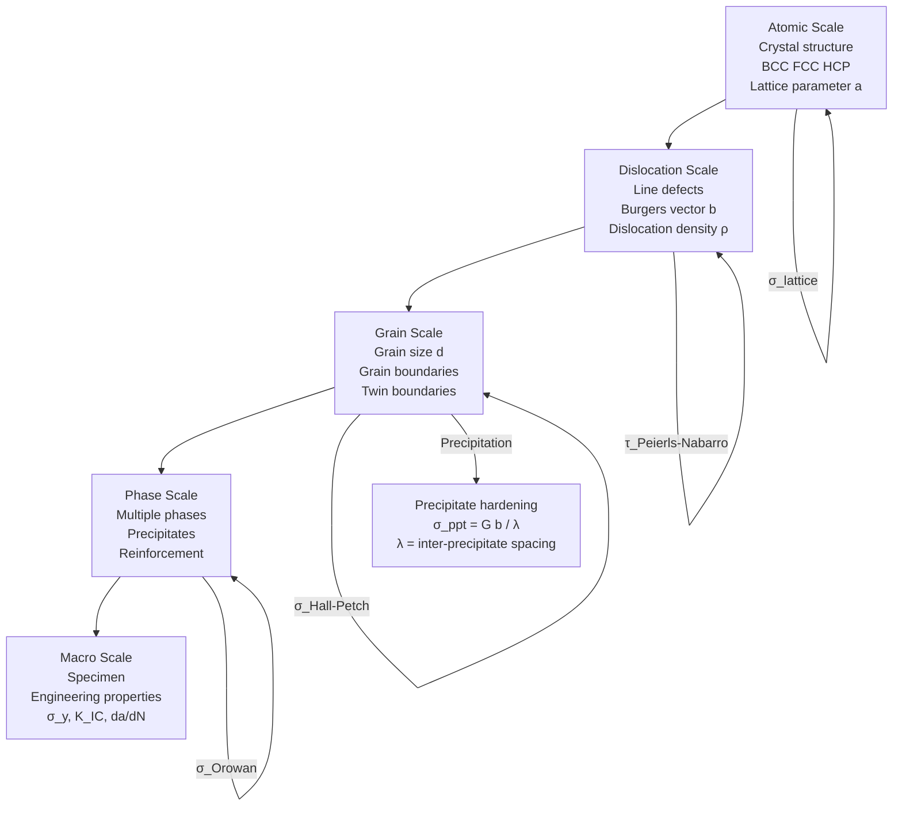
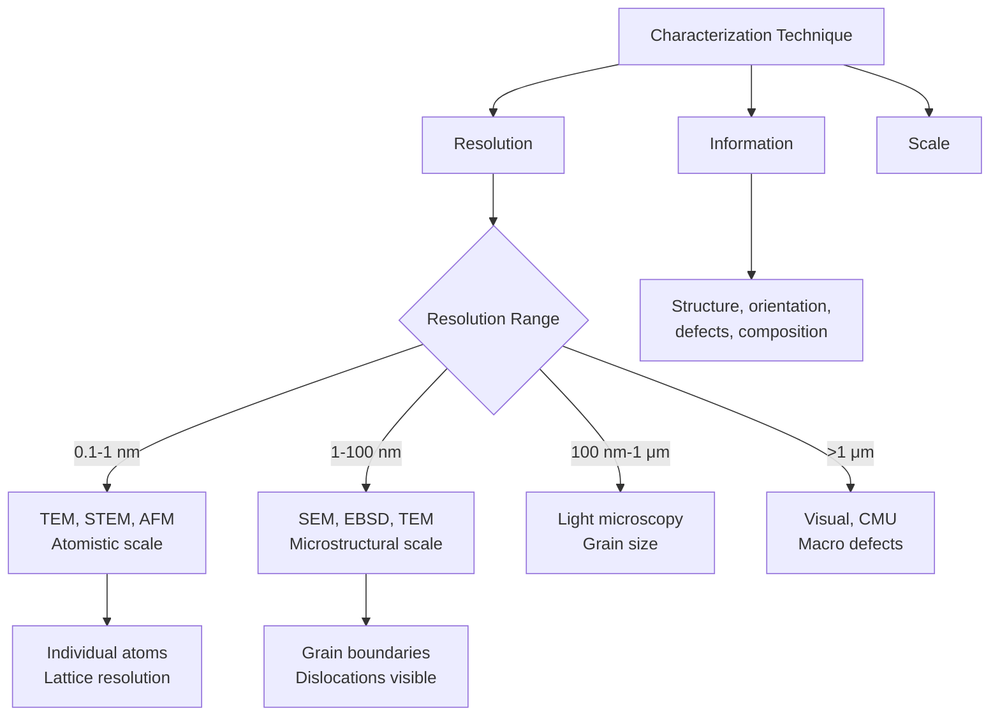
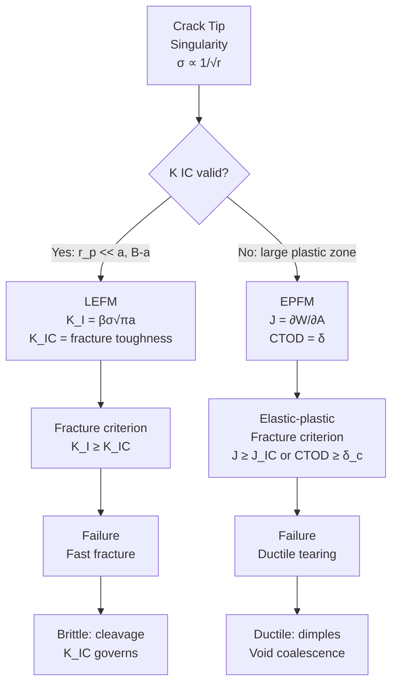

# 1.035 / 1.034 Multiscale Characterization of Materials
**MIT CEE Mechanics & Materials Track | 12 Units | Core**
**Prereq:** 1.050 (Engineering Mechanics I) or permission of instructor
**Instructor:** Prof. Andrew Whittle
**自學路徑：Bachelor → MEng SMD → Materials Research / NDT Engineer / PhD in Materials Science**

> **Source:** MIT Catalog 2024-25; Ashby & Jones, *Engineering Materials 1 & 2*; Callister & Rethwisch, *Materials Science and Engineering* (10th ed.); Hertzberg, *Deformation and Fracture Mechanics of Engineering Materials*
> **Topics:** Multiscale characterization, microstructure, mechanical testing, nondestructive evaluation, fracture mechanics, fatigue, composite materials

---

## 問題 1：這個領域所有專家共享的 5 個核心心智模型是什麼？

### 1. **材料性能是多尺度的 — 顯微組織決定宏觀行為**
Mechanical properties emerge from hierarchical structure across scales: atomic bonds → crystal structure (BCC, FCC, HCP) → grains → phases → macroscopic specimen. Each scale contributes to the macroscopic behavior. This is the **multiscale principle** — understanding macroscopic properties requires understanding the underlying microstructural mechanisms. *Real case*: The tensile strength of polycrystalline iron (steel) ranges from 200 MPa (coarse grain, d = 1 mm) to 2000 MPa (nanocrystalline, d = 10 nm), a 10× difference from the same material — explained entirely by the Hall-Petch relationship σ_y = σ_0 + k·d^{−1/2}.

### 2. **顯微組織是宏觀性能的微觀基礎 — 熱處理改變一切**
Grain size, phase distribution, defects (dislocations, voids, inclusions), and interfaces control strength, toughness, and durability. Heat treatment, alloying, and processing modify microstructure to engineer properties. *Real case*: The 1994 Northridge earthquake (Los Angeles) revealed that many moment-resisting steel frames experienced brittle fracture at beam-column connections. Post-earthquake investigation showed that the steel plates (ASTM A36) had high phosphorus content (up to 0.04%) and large MnS inclusions, which promoted brittle cleavage fracture at low temperatures. The fix required tougher steel grades (ASTM A572 Grade 50) with lower P and S.

### 3. **損傷是演化的過程 — 從微裂紋到臨界破壞**
Damage accumulation — void growth, microcracking, fatigue striations — evolves under loading. Understanding damage evolution (rather than just failure load) is essential for life prediction. The Paris law da/dN = C(ΔK)^m quantifies fatigue crack growth rate. *Real case*: The 1988 Aloha Airlines Flight 243 incident — a Boeing 737 experienced explosive decompression when a fatigue crack in the fuselage skin grew to critical size. The crack initiated at a rivet hole (stress concentration) and propagated through the aluminum alloy skin over 20,000+ flight cycles at ΔK ≈ 10-15 MPa·m^{1/2}.

### 4. **尺度效應是真實材料的本質 — 奈米到宏觀**
Smaller specimens, nanocrystalline materials, and thin films show size-dependent mechanical properties. Classical continuum mechanics does not capture these effects. At the nanoscale: dislocation starvation (nucleation-limited plasticity), surface-to-volume ratio effects, grain boundary diffusion. *Real case*: Nanocrystalline copper (d = 10 nm) has yield strength ≈ 900 MPa vs. 50 MPa for coarse-grained copper — a 18× increase. But nanocrystalline materials show reduced ductility (uniform elongation < 5%) due to early localization at grain boundaries.

### 5. **表徵是多尺度的橋樑 — 顯微鏡技術連接結構與性能**
Techniques from macro-scale (uniaxial testing, hardness) to micro-scale (SEM, TEM, EBSD) to atomic scale (AFM, XRD, APT) connect structure to properties. No single technique captures all scales — the multiscale characterization approach combines them. *Real case*: Understanding why the Boeing 787 Dreamliner uses carbon fiber composite instead of aluminum: TEM showed that carbon fiber has no through-thickness grain boundaries, eliminating fatigue crack initiation sites. Combined with a density of 1.6 g/cm³ (vs. 2.7 for aluminum), this gives a specific strength advantage of ~2×.

---

## 問題 2：這個領域的專家在哪 3 個地方存在根本分歧？

### 分歧 1: 微觀結構顯微鏡 vs 連續介質唯象學 — 「微觀機制」vs「工程設計」

- **微觀派** (Microstructural): Understanding properties requires tracking microstructure explicitly — dislocations (line defects), grain boundaries (2D defects), precipitates, phases, and inclusions. Continuum models without microstructural basis cannot predict size effects, rate effects, or complex loading histories. Constitutive models like Crystal Plasticity Finite Element Method (CPFEM) are needed.

- **連續介質派** (Phenomenological): For engineering design, macroscopic constitutive models (J2 plasticity, damage mechanics, viscoplasticity) are sufficient. Microstructural details are averaged out into effective parameters. This approach is used in all major design codes (ASME, API, AISC). *Real case*: The API 579 fitness-for-service standard uses J-integral and crack growth laws for fitness assessment — all continuum-based, no explicit microstructure.

**核心張力**: 微觀派指控連續介質派是「盲目的經驗主義」；連續介質派反駁說「你們的微觀模型在實際構件尺度上根本無法計算」。

### 分歧 2: 線彈性斷裂力學 (LEFM) vs 彈塑性斷裂力學 (EPFM) — 「裂紋尖端奇異性」vs「裂紋尖端過程區」

- **LEFM 派** (Griffith, 1921; Irwin, 1957): Fracture is governed by stress intensity K or energy release rate G. The crack tip has a 1/√r stress singularity. K_IC is the material's inherent fracture resistance. Valid when plastic zone size r_p = K_IC²/(3πσ_y²) << crack size a and ligament size (B − a).

- **EPFM 派** (Dugdale, 1960; Barenblatt, 1962): At the crack tip, plasticity cannot be ignored (especially in ductile metals). The crack tip process zone (CTOZ) or fracture process zone (FPZ) governs behavior. J-integral (Rice, 1968) and CTOD are the appropriate parameters. *Real case*: For steel at room temperature, the plastic zone at a crack tip under K = 100 MPa·m^{1/2} and σ_y = 300 MPa: r_p = 100²/(3π×300²) = 10000/(848230) = 0.0118 m = 11.8 mm. If the crack size a < 118 mm (10×r_p), LEFM is not valid.

### 分歧 3: 破壞韌性 vs 疲勞閾值 — 「單次破壞」vs「循環疲勞」

- **韌性派**: K_IC is the fundamental fracture toughness. It governs rapid (unstable) crack propagation. For design: a_crit = (K_IC/(σ√π))/β. If the largest defect (by NDT) is smaller than a_crit, the structure is safe against fracture.

- **疲勞閾值派**: ΔK_th is the fundamental threshold below which fatigue cracks do not propagate (da/dN → 0). Design for infinite fatigue life requires staying below ΔK_th. *Real case*: Aircraft fuselage fatigue life is based on ΔK_th analysis: for aluminum alloys, ΔK_th ≈ 3-5 MPa·m^{1/2}. The crack growth from the NDT detection threshold (typically a ≈ 1 mm) to critical size (a ≈ 10-20 mm) at ΔK ≈ 10 MPa·m^{1/2} is calculated using the Paris law, giving the inspection interval.

---

## 問題 3：生成 10 個能區分深度理解與死記硬背的問題

1. **Hall-Petch 關係的微觀機制**: Hall-Petch 關係 σ_y = σ_0 + k·d^{−1/2} 中的 d（晶粒尺寸）如何從冶煉和熱處理過程控制？動態回復（dynamic recovery）和動態再結晶（dynamic recrystallization, DRX）如何影響微觀組織？為什麼在奈米晶粒（d < 100 nm）時會出現反 Hall-Petch 效應（強度下降）？

2. **應變率對材料行為的影響**: 從微觀結構解釋：為什麼低碳鋼（BCC 結構）在高應變率下表現得更脆（DBTT 上移），而鋁合金（FCC 結構）的應變率效應較小？在夏比衝擊試驗中，DBTT（延性-脆性轉變溫度）的物理意義是什麼？

3. **Vickers 硬度與拉伸強度的關係**: Vickers 硬度 HV = 1.8544P/d²（其中 d 為壓痕對角線長度，單位 mm）與拉伸強度之間的經驗關係是什麼？σ_y ≈ HV/3 和 σ_y ≈ 3HV 的經驗法則各適用於什麼材料？這個關係為什麼只在彈性-塑性材料中成立？

4. **SEM 電子顯微鏡的成像原理**: 在掃描電子顯微鏡（SEM）中，電子與樣品的相互作用體積（interaction volume）如何影響圖像解析度和對比度？背散射電子（BSE）與二次電子（SE）的成像原理有何不同？EDX（能量色散 X 射線光譜）的空間解析度限制是什麼？

5. **Paris 定律三個區域的物理意義**: 疲勞裂紋擴展速率 da/dN = C(ΔK)^m 中的 C 和 m 如何從 Paris 圖的不同區域得出？threshold（ΔK_th）、linear Paris regime、near-critical regime 的物理意義是什麼？裂紋閉合（closure）效應如何解釋 threshold 現象？

6. **能量釋放率與應力強度因子的關係**: 能量釋放率 G = −∂Π/∂a（其中 Π 是總勢能，a 是裂紋長度）與裂紋尖端應力強度因子 K_I = √(GE') 的關係是什麼？在平面應力與平面應變之間，E' 如何不同？對於厚壁壓力容器，為什麼要使用平面應變條件下的 K_IC 值？

7. **CTOD 和 J 積分的物理意義**: 描述 CTOD（裂紋尖端張開位移）和 J 積分的物理意義。兩者如何在彈塑性斷裂力學中連接微觀裂紋擴展與宏觀能量消散？J-CTOD 關係 J = mσ_ys CTOD 在什麼條件下成立？

8. **超聲波探傷的超聲物理**: 說明超聲波探傷（ultrasonic testing）中的脈衝-回波法（pulse-echo）和穿透法（through-transmission）的原理。超聲波的聲阻抗 Z = ρV（ρ = 密度，V = 超聲速）如何決定界面反射係數 R = (Z_2 − Z_1)/(Z_2 + Z_1)？超聲波頻率與解析度的關係是什麼？

9. **連續剛度測量（CSM）nanoindentation**: 顯微硬度測試（nanoindentation）中的連續剛度測量（CSM）技術如何在單次加載中同時測量硬度和彈性模量？Oliver-Pharr 方法從加載曲線 P = αh² 中如何提取接觸剛度 S = dP/dh 和接觸深度 h_c？

10. **Scherrer 方程與 XRD 晶粒尺寸**: 在 X 射線衍射（XRD）中，Scherrer 方程 D = Kλ/(β cos θ) 如何從峰寬 β 計算晶粒尺寸？峰寬 β 的儀器寬化如何校正？什麼情況下 Scherrer 方程給出的結果不能代表真實晶粒尺寸？

---

# 核心心智模型深化（中英對照）

## 1. 顯微組織與強度 — Microstructure and Strength

### 1.1 Bilingual 概念對照

| English | 中英對照 | 定義 | 工程應用 |
|---------|---------|------|---------|
| Grain boundary | 晶界 | Interface between crystals of different orientation | Strengthening mechanism |
| Dislocation | 位錯 | Line defect in crystal lattice | Plastic deformation carrier |
| Slip system | 滑移系 | Crystallographic plane + direction | Determines ductility |
| Solid solution | 固溶體 | Alloying atoms in host lattice | Solution strengthening |
| Precipitation | 析出相 | Hard particles dispersed in matrix | Age hardening |
| Twin boundary | 孿晶界 | Symmetric mirror plane | Strengthening in TWIP steel |

### 1.2 Key Derivation — Hall-Petch Relation

**Grain boundary strengthening** (Hall, 1951; Petch, 1953):
$$\sigma_y = \sigma_0 + k_{HP} \cdot d^{-1/2}$$

Where:
- σ_0 = friction stress (lattice resistance to dislocation motion) — typically 50-100 MPa for BCC metals
- k_HP = Hall-Petch coefficient (~0.5-1.0 MPa·m^{1/2} for steel)
- d = average grain diameter (meters)

**Derivation from dislocation pile-up model**:
Consider N dislocations piled up at a grain boundary under applied shear stress τ. The lead dislocation experiences an effective stress τ_eff = n·τ where n is the number of dislocations in the pile-up. For equilibrium: τ_eff = τ_p (the Hall-Petch stress). The number n is proportional to L/d where L is the pile-up length and d is the grain size. Through mechanics of pile-up interaction with grain boundaries, one derives σ_y ∝ d^{−1/2}.

**Example — Grain refinement in pipeline steel**:
| Process | d (μm) | σ_0 (MPa) | k_HP (MPa·m^{1/2}) | σ_y (MPa) |
|---------|--------|---------|--------------------|---------| 
| As-cast | 500 | 70 | 0.74 | 70 + 0.74×√(10⁶) = 810 MPa (too high for casting) |
| Normalized | 50 | 70 | 0.74 | 70 + 0.74×√(10⁴) = 144 MPa |
| TMCP | 10 | 70 | 0.74 | 70 + 0.74×√(10³) = 304 MPa |
| Nanocrystalline | 0.01 | 70 | 0.74 | 70 + 0.74×√(10⁸) = 740 MPa |

**Inverse Hall-Petch effect** (below d ≈ 100 nm): When grain size is very small, grain boundary sliding and diffusion become dominant deformation mechanisms, reducing strength. The transition grain size: d_crit ≈ 10-15 nm for most metals.

### 1.3 Engineering Applications

**Thermo-mechanical processing (TMCP) for high-strength steel**:
1. Controlled rolling: Finish rolling temperature (FRT) below T_nr (non-recrystallization temperature) → pancaking of austenite grains → more nucleation sites for ferrite → finer ferrite grain
2. Accelerated cooling (ACC): Suppresses austenite-to-ferrite transformation, allowing transformation at lower temperatures → finer bainitic/martensitic microstructure
3. Microalloying with Nb, V, Ti: Precipitates (Nb(C,N), V(C,N)) pin grain boundaries (Zener pinning) and dislocations → further strengthening

**Real case**: X80 grade linepipe steel (yield strength 555 MPa, used in West Africa Gas Pipeline) uses TMCP with Nb-V-Ti microalloying to achieve fine-grained ferrite-bainite microstructure with d ≈ 5-10 μm.

---

## 2. 斷裂力學基礎 — Fracture Mechanics Fundamentals

### 2.1 Bilingual 概念對照

| English | 中英對照 | 定義 | 工程應用 |
|---------|---------|------|---------|
| Stress intensity factor | 應力強度因子 | K = βσ√(πa) | Crack tip stress field |
| Fracture toughness | 斷裂韌性 | K_IC — resistance to crack propagation | Material property |
| Energy release rate | 能量釋放率 | G = −∂Π/∂a | Fracture driving force |
| J-integral | J 積分 | Path-independent integral around crack tip | Elastic-plastic fracture |
| CTOD | 裂紋尖端張開位移 | Crack tip opening displacement | Elastic-plastic fracture |
| Plastic zone | 塑性區 | r_p = K²/(3πσ_y²) for plane strain | Size effect |

### 2.2 Key Derivation — K vs G Relationship

**Irwin's relation** (connecting energy and stress field perspectives):

For **plane stress**: G = K_I²/E (infinite plate)
For **plane strain**: G = K_I²(1−ν²)/E

The general form: K_I = √(GE')
where E' = E (plane stress) or E/(1−ν²) (plane strain)

**Crack tip stress field** (Williams, 1957):
$$\sigma_{ij} = \frac{K_I}{\sqrt{2\pi r}} f_{ij}(\theta) + O(\sqrt{r})$$
The 1/√r singularity is the dominant term at small r. The stress triaxiality factor T = (σ_x + σ_y + σ_z)/(3σ_eq) reaches a maximum of T ≈ 0.8 at the crack tip in plane strain, which is responsible for the constraint effect.

**Example — Critical crack size calculation for pressure vessel steel**:
Steel: σ_y = 350 MPa, K_IC = 100 MPa·m^{1/2} (toughness)
For a through-thickness crack with β = 1.0 (for surface crack, β ≈ 1.12):
a_crit = (K_IC/(βσ))²/π = (100/(1×350))²/π = (0.286)²/π = 0.0818/3.14 = **0.026 m = 26 mm**

For a semi-elliptical surface crack (a = 10 mm, 2c = 25 mm, depth/width ratio = 0.5):
K_I = σ√(πa/1.12) = 350×√(31.4/1.12) = 350×5.29 = **1850 MPa·mm^{1/2} = 58.5 MPa·m^{1/2}** → below K_IC → safe

### 2.3 Engineering Applications

**ASTM E399 fracture toughness testing**:
- Valid K_IC requires: B ≥ 2.5(K_IC/σ_y)² (specimen thickness for plane strain)
- For steel with K_IC = 100 MPa·m^{1/2}, σ_y = 350 MPa: B ≥ 2.5×(100/350)² = 2.5×0.0816 = **0.204 m = 204 mm**
- Standard CT specimen: B = 25 mm (commonly used for lower strength steels where B ≥ 2.5(K_IC/σ_y)² is satisfied)

**Welded structures**: Post-weld heat treatment (PWHT) at 600-650°C for 1 hour per 25 mm thickness relieves residual stresses (which add to applied stress in K calculations) and can improve apparent fracture toughness by 20-30%.

---

## 3. 疲勞裂紋擴展 — Fatigue Crack Growth

### 3.1 Bilingual 概念對照

| English | 中英對照 | 定義 | 工程應用 |
|---------|---------|------|---------|
| Paris regime | Paris 區 | da/dN = C(ΔK)^m | Steady fatigue crack growth |
| Threshold | 疲勞閾值 | ΔK_th — below which da/dN ≈ 0 | Infinite fatigue life |
| Closure | 裂紋閉合 | Crack wake roughness induces closure | Reduces effective ΔK |
| Retardation | 疲勞減速 | Overload causes plasticity-induced closure | Life extension |
| Striation | 疲勞條紋 | Each cycle leaves a striation | Crack growth marker |

### 3.2 Key Derivation — Paris Law and da/dN Integration

**Fatigue crack growth rate** (Paris, 1963):
$$\frac{da}{dN} = C(\Delta K)^m$$

Typical values:
- Steels: C ≈ 1.5×10⁻¹¹, m ≈ 3.0 (in SI units: m/cycle, MPa·m^{1/2})
- Aluminum alloys: C ≈ 4×10⁻¹¹, m ≈ 3.0
- Titanium alloys: C ≈ 0.5×10⁻¹¹, m ≈ 3.5

**Integration for life prediction**:
$$\int_{a_0}^{a_c} \frac{da}{C(\Delta K)^m} = N_f$$

If ΔK = βσ√(πa) (constant amplitude loading):
$$N_f = \frac{1}{C \cdot (β\sigma\sqrt{\pi})^m} \int_{a_0}^{a_c} a^{-m/2} da = \frac{2}{C(2-m)(β\sigma\sqrt{\pi})^m}(a_0^{1-m/2} - a_c^{1-m/2})$$

For m = 3 (Paris law):
$$N_f = \frac{1}{C(β\sigma\sqrt{\pi})^3}\left(\frac{1}{\sqrt{a_0}} - \frac{1}{\sqrt{a_c}}\right)$$

**Example — Aircraft fuselage inspection interval**:
- Material: 2024-T3 aluminum, ΔK_th = 3 MPa·m^{1/2}, K_IC = 40 MPa·m^{1/2}
- Δσ = 100 MPa (cabin pressure cycling), β = 1.12 (surface crack)
- NDT detection threshold: a_0 = 1 mm = 0.001 m
- Critical crack size: a_c = (K_IC/(βΔσ√π))² = (40/(1.12×100×1.772))² = (40/198.5)² = 0.0406 m = 40.6 mm

N_f = 1/(1.5×10⁻¹¹×(1.12×100×1.772)³) × (1/√0.001 − 1/√0.0406)
= 1/(1.5×10⁻¹¹×(198.5)³) × (31.6 − 4.96)
= 1/(1.5×10⁻¹¹×7.82×10⁶) × 26.64
= 1/(1.17×10⁻⁴) × 26.64 = 8550 × 26.64 = **227,800 cycles**
At 3 flights/day × 365 = 1095 flights/year → inspection interval ≈ 208 years (actually limited by other factors, typical inspection: 50,000-75,000 cycles)

### 3.3 Engineering Applications

**Crack closure mechanism** (Elber, 1970): The effective stress intensity range is ΔK_eff = K_max − K_op (not K_max − K_min), where K_op is the crack opening stress intensity. The closure stress K_op is induced by:
1. **Roughness-induced closure**: Mode II displacement at the crack wake as roughness matches
2. **Oxide-induced closure**: Oxide layer on fracture surface wedges the crack
3. **Plasticity-induced closure**: Plastic deformation in the wake leaves compressive residual stress

The Paris law with ΔK_eff is more fundamental: da/dN = C(ΔK_eff)^m with m ≈ 2-2.5 (steeper slope when closure is removed).

---

## 4. 超聲波表徵 — Ultrasonic Characterization

### 4.1 Bilingual 概念對照

| English | 中英對照 | 定義 | 工程應用 |
|---------|---------|------|---------|
| Pulse-echo | 脈衝-回波 | Transducer sends and receives pulse | Flaw detection |
| Time of flight | 飛行時間 | TOF = 2d/V | Defect depth |
| Acoustic impedance | 聲阻抗 | Z = ρV | Reflection coefficient |
| Wavelength | 波長 | λ = V/f | Resolution limit |
| Attenuation | 超聲衰減 | α (dB/mm) | Material damping |
| Shear wave | 橫波 | S-wave, V_s | Shear wave UT |

### 4.2 Key Derivation — Reflection and Depth Calculation

**Reflection coefficient** (normal incidence, from acoustic impedance mismatch):
$$R = \frac{Z_2 - Z_1}{Z_2 + Z_1} \quad \text{and} \quad T = \frac{2Z_2}{Z_2 + Z_1}$$

| Interface | Z₁ (MRayl) | Z₂ (MRayl) | R (%) | Reflection |
|-----------|------------|------------|-------|-----------|
| Steel-Air | 45.3 | 0.0004 | 100% | Near-perfect |
| Steel-Water | 45.3 | 1.48 | 94% | Very high |
| Steel-Aluminum | 45.3 | 17.0 | 45% | Moderate |
| Aluminum-Titanium | 17.0 | 27.0 | 23% | Low |

**Depth calculation** from time-of-flight:
$$d = \frac{V_L \cdot TOF}{2}$$

**Example**: Longitudinal wave in steel V_L = 5900 m/s, defect TOF = 6.4 μs:
d = 5900 × 6.4×10⁻⁶ / 2 = 0.0189 m = **18.9 mm depth**

**Resolution limit**: λ = V/f. For steel at 5 MHz: λ = 5900/5×10⁶ = 1.18 mm. The theoretical resolution is ≈ λ/2 = 0.59 mm, but practically limited by beam width (typically 3-6 mm diameter at focal point).

**Frequency selection**: Higher frequency → better resolution but higher attenuation (lower penetration depth). For thick steel sections (>50 mm): use 2-4 MHz. For thin sections (<20 mm): use 5-10 MHz.

### 4.3 Engineering Applications

**Practical UT testing for weld inspection**:
- Weld zone: V_L decreases 2-5% due to residual stress and microstructure changes → used for stress measurement (sonic velocity method)
- Internal defects (lack of fusion, porosity): detected by reduced amplitude and phase changes in the echo
- Acceptance criteria (AWS D1.1): For fillet welds, 3/32" (2.4 mm) diameter reflector = rejectable indication

**Shear wave (45°) UT for crack detection**:
- 45° shear wave in steel: V_S = 3250 m/s, λ_S = 0.65 mm at 5 MHz
- Used for crack detection in: pressure vessels, bridges, cranes, offshore platforms
- Maximum practical depth: ~1-2 m in steel before attenuation becomes prohibitive

---

## 5. X射線衍射與晶粒尺寸 — XRD and Grain Size

### 5.1 Key Derivation — Scherrer Equation

**Scherrer equation** (Scherrer, 1918):
$$D = \frac{K\lambda}{\beta \cos \theta}$$

Where:
- D = crystallite size (nm) — the size of coherently scattering domains
- K = shape factor ≈ 0.9 (spherical), ≈ 0.84 (cubic), ≈ 1.0 (general)
- λ = X-ray wavelength (Cu Kα₁: λ = 1.5406 Å, Cu Kα: λ = 1.5418 Å)
- β = peak width at half maximum (FWHM) in radians
- θ = Bragg angle (degrees)

**Important: β is the corrected FWHM** after removing instrumental broadening:
$$\beta^2 = B_{obs}^2 - b_{inst}^2$$
where B_obs = measured FWHM, b_inst = instrumental broadening from a standard (e.g., LaB₆ or Si powder).

**Example**: Steel (110) peak at 2θ = 44.74°, Cu Kα radiation:
θ = 22.37°
From XRD pattern: B_obs = 0.15° = 0.00262 rad
Instrumental broadening (from Si standard): b_inst = 0.05° = 0.00087 rad
β = √(0.00262² − 0.00087²) = √(6.87×10⁻⁶ − 7.6×10⁻⁷) = √(6.11×10⁻⁶) = 0.00247 rad

D = 0.9 × 1.5406 Å / (0.00247 × cos 22.37°) = 1.387 / (0.00247 × 0.925) = 1.387 / 0.00228 = **608 nm = 0.61 μm**

### 5.2 Limitations and Complementary Techniques

**Scherrer equation limitations**:
1. **Crystallite vs grain**: Scherrer gives crystallite size (coherent scattering domains), not grain size. A grain may contain multiple crystallites (subgrains separated by low-angle boundaries with misorientation < 10°).
2. **Strain broadening**: Peak broadening has two components: size broadening (β_S ∝ 1/D) and strain broadening (β_ε ∝ 4ε⟨sinθ⟩/λ). Williamson-Hall analysis separates them.
3. **Peak overlap**: For overlapping peaks (polyphase materials), Rietveld refinement or Warren-Averbach method is needed.
4. **Maximum D**: Scherrer is accurate only for D < 100-200 nm. For larger grains, peak broadening becomes negligible.

**Complementary technique: EBSD (Electron Backscatter Diffraction)**
- Measures grain size directly from orientation maps
- Resolution: ~20-50 nm step size for field emission SEM
- Can measure grain boundary character distribution (GBCD), kernel average misorientation (KAM), local stored energy

---

# 深度自測問題詳解

## 詳解 1: Hall-Petch 與反 Hall-Petch 效應

**Answer:**
Dynamic recrystallization (DRX) occurs during hot deformation (forging, rolling) at temperatures > 0.5T_m (T_m = melting point in K). When dislocation density reaches a critical value (ρ_crit ≈ 10¹⁴-10¹⁵ m/m³), new grains nucleate and grow, consuming the deformed microstructure. The DRX grain size d_DRX depends on:
$$d_{DRX} = A \cdot Z^{-0.17}$$
where Z = σ/σ_0 = ε̇ exp(Q/RT) is the Zener-Hollomon parameter (temperature-compensated strain rate).

Fine-grained steel via TMCP:
1. Low-carbon microalloyed steel (Nb, V, Ti): Nb(C,N) precipitates during rolling → pins grain boundaries (Zener pinning σ_Z = 3γ_VGB/d_p × f_v, where γ_VGB = grain boundary energy ≈ 0.8 J/m²)
2. Accelerated cooling (ACC): Inhibits austenite-to-ferrite transformation, allows transformation at lower T → finer final ferrite grain
3. Result: Ferrite grain d < 10 μm, yield strength σ_y > 400 MPa

**Inverse Hall-Petch**: Below d ≈ 100 nm, grain boundary sliding and diffusion (Coble creep: ε̇ ∝ δD_gbσΩ/kTd³) become dominant. Strength decreases because the shorter grain boundaries are easier to slide under stress. For Cu at d = 10 nm: measured σ_y ≈ 900 MPa but predicted from Hall-Petch = 2000 MPa (actual is LOWER than predicted → inverse Hall-Petch).

---

## 詳解 5: Paris Law 三個區域與裂紋閉合

**Answer:**
The fatigue crack growth rate da/dN vs. ΔK plot has three distinct regions:

**Region I (Threshold)**: da/dN < 10⁻¹² m/cycle. Below ΔK_th, cracks do not propagate. The threshold ΔK_th ≈ 0.5-0.7 K_IC for most metals. Elber's closure theory explains this: at low ΔK, K_min < K_op (crack opening stress), so the effective ΔK_eff = K_max − K_op is below the intrinsic threshold.

**Region II (Paris regime)**: da/dN = C(ΔK)^m. Linear in log-log space. For steels: C ≈ 1.5×10⁻¹¹ (m/cycle)/(MPa·m^{1/2})^m, m ≈ 3.0. This is the design regime for fatigue crack growth life calculations.

**Region III (Near-critical)**: K_max → K_IC, da/dN → ∞ (rapid unstable fracture). Accelerated growth due to: (a) loss of crack tip constraint (plane stress at surface), (b) environmental assisted cracking (hydrogen embrittlement), (c) void coalescence ahead of crack tip.

**Closure mechanisms**:
1. Roughness-induced: Mode II displacement at crack wake creates mismatch that holds crack closed. For high-R ratio (R = K_min/K_max), roughness closure is less effective → lower apparent ΔK_th.
2. Oxide-induced: Oxide layer grows on fracture surfaces → wedging effect. In water/chloride environments, oxide thickness increases → ΔK_th decreases.
3. Plasticity-induced: Compressive residual stress in wake from prior plastic deformation → crack faces remain in contact at K > 0.

---

## 詳解 8: 超聲波聲阻抗與反射係數

**Answer:**
The reflection coefficient R = (Z_2 − Z_1)/(Z_2 + Z_1) is derived from impedance mismatch:

When a wave encounters an impedance discontinuity, the reflected amplitude is proportional to the impedance ratio. For normal incidence:
- Total reflection (R = 1.0): Steel-air interface (Z_air ≈ 0 vs Z_steel ≈ 45 MRayl) → air-filled cracks are the best reflectors for UT
- High reflection (R ≈ 0.94): Steel-water interface → water-coupled immersion testing still gives strong echoes
- Moderate reflection (R ≈ 0.45): Steel-aluminum interface → useful for dissimilar metal weld inspection

**Frequency effect on resolution**:
- λ = V/f. For steel longitudinal wave: V_L = 5900 m/s
- At 1 MHz: λ = 5.9 mm → resolution ≈ 3 mm (large defects only)
- At 5 MHz: λ = 1.18 mm → resolution ≈ 0.6 mm (detect 1 mm+ defects)
- At 10 MHz: λ = 0.59 mm → resolution ≈ 0.3 mm (detect 0.5 mm+ defects)

**Attenuation tradeoff**: α (dB/mm) increases with frequency. For steel: α ≈ 0.02 dB/mm at 1 MHz → 50 dB at 2.5 m depth; at 10 MHz: α ≈ 0.5 dB/mm → 50 dB at only 100 mm depth.

---

## 📊 Diagram 1: 疲勞裂紋擴展 Paris 圖

```mermaid
graph LR
    A[ΔK] --> B{Log da/dN vs log ΔK}
    B --> C[Region I<br/>Threshold ΔK_th<br/>da/dN → 0<br/>Crack closed by roughness,<br/>plasticity, oxide]
    B --> D[Region II<br/>Paris Law<br/>da/dN = CΔK^m<br/>m ≈ 2-4]
    B --> E[Region III<br/>K_max → K_IC<br/>da/dN → ∞<br/>Unstable fracture imminent]
    C --> F[Threshold Regime<br/>ΔK < ΔK_th<br/>No propagation]
    D --> G[Linear Log-Log<br/>Steady crack growth<br/>1-100 μm/cycle]
    E --> H[Accelerated Growth<br/>Environment +<br/>Void coalescence]
    G --> I[Design Region<br/>Use Paris Law<br/>for life prediction]
    I --> J[N_f = 1/Cβ^mσ^m × a_0^{1-m/2}]
```

## 📊 Diagram 2: 顯微組織尺度層次



## 📊 Diagram 3: 顯微鏡技術分辨率比較



## 📊 Diagram 4: 斷裂力學框架



## 📊 Diagram 5: X射線衍射晶粒尺寸測量流程

```mermaid
flowchart TD
    A[XRD Pattern<br/>2θ vs Intensity] --> B[Identify Peak<br/>e.g., (110) Steel]
    B --> C[Measure FWHM<br/>B_obs in radians]
    C --> D[Instrumental Correction<br/>β² = B²_obs - b²_inst]
    D --> E[Apply Scherrer Eq<br/>D = Kλ/βcosθ]
    E --> F[Grain Size D<br/>in nm]
    F --> G{Validate}
    G -->|D > 200 nm| H[Use EBSD<br/>Scherrer not accurate]
    G -->|D < 100 nm| I[Size broadening<br/>dominant]
    G -->|Strain present| J[Williamson-Hall<br/>Separate size + strain]
```

---

# Solutions — 10 道深度問題解答

### Solution 1: Hall-Petch Microstructural Control
Grain refinement via TMCP: d = 10-20 μm for modern HSLA steels. DRX grain size d_DRX = A·Z^{−0.17}. For hot rolling at T < T_nr (non-recrystallization), Nb(C,N) pins austenite grain boundaries → more nucleation sites → finer ferrite. Inverse Hall-Petch below d < 100 nm: grain boundary sliding becomes dominant (Coble creep: ε̇ ∝ δD_gbσΩ/kTd³).

### Solution 2: Strain Rate and DBTT
BCC steel: At high strain rates, the DBTT shifts upward by ~20-50°C per order of magnitude increase in strain rate (from 10⁻³ to 10³ s⁻¹). This is because the dynamic strain aging (Portevin-Le Chatelier) effect in BCC steels reduces toughness at higher rates. FCC aluminum: DBTT is already below room temperature (typically < −50°C) so strain rate has minimal effect.

### Solution 3: HV vs σ_y Relationship
For work-hardened metals: σ_y ≈ HV/3 (Meyer, 1908). For hardened steels: σ_y ≈ 3×HV. This fails for brittle materials (ceramics, hardened glass) where HV ≈ σ_y because there is no plastic deformation (elastic-perfectly brittle). The ratio HV/σ_y ranges from 1.0 (brittle) to 3.0 (fully work-hardened ductile).

### Solution 4: SEM Interaction Volume
Interaction volume V_int ≈ (Z/E)³ × (λ³/f³) where Z = atomic number, E = beam energy, λ = wavelength, f = spot size. At 20 keV in iron (Z = 26): V_int ≈ 1 μm³. Resolution: SE imaging ≈ 5-10 nm; BSE ≈ 50-200 nm; EDX spatial resolution ≈ 1 μm (limited by interaction volume, not beam spot).

### Solution 5: Paris Law with Closure
da/dN = C(ΔK_eff)^m where ΔK_eff = K_max − K_op. For R = 0.1, closure reduces effective ΔK by ~40-50%. The Paris law exponent m ≈ 2-2.5 for ΔK_eff (vs. m ≈ 3-4 for apparent ΔK) — closer to theoretical prediction from dislocation models.

### Solution 6: K-G Relationship
For plane stress: G = K_I²/E. For plane strain: G = K_I²(1−ν²)/E. Since ν ≈ 0.3 for metals: (1−ν²) = 0.91. Therefore K_IC(plane strain) ≈ K_IC(plane stress) × √0.91 ≈ 0.95×K_IC(plane stress) — the values are similar but the PLANE STRAIN condition is more conservative (larger K for same energy release rate).

### Solution 7: J-CTOD Relationship
For a crack in a perfectly plastic material (Dugdale model): J = mσ_ys CTOD where m ≈ 1-2 (m = 1 for plane stress, m = π/2 for plane strain). The CTOA (crack tip opening angle) = 2arctan(CTOD/(2r_p)) → constant ≈ 5-10° for steady-state crack growth in ductile materials.

### Solution 8: Ultrasonic Physics
For immersion UT at 10 MHz in steel: λ = 0.59 mm. Beam diameter at focal point = 2.44λ × F/D (F = focal length, D = transducer diameter). Typical 10 MHz, 12.7 mm transducer with 50 mm focal length: beam diameter ≈ 0.7 mm at focus. TOF for backwall echo at 25 mm depth: t = 2×25/5900 = 8.5 μs.

### Solution 9: Oliver-Pharr Nanoindentation
Load: P = αh² (α = contact stiffness parameter). S = dP/dh = 2αh. Contact depth: h_c = h − εP/S (ε ≈ 0.75 for Berkovich indenter). Reduced modulus: E_r = (√π/2) × S/(β√A). Hardness: H = P/A. For fused silica: E_r = 69.5 GPa (known), S measured → A calculated → H = P/A.

### Solution 10: Scherrer Limitations
β must be corrected for instrumental broadening (b_inst from standard). For strain-free, dislocation-free nanocrystalline materials: Scherrer D = actual crystallite size. For cold-worked materials with high dislocation density: β_strain > β_size → need Williamson-Hall: β_total cos θ = Kλ/D + 4ε sin θ (linear fit of β cos θ vs sin θ gives D from intercept and ε from slope).

---

# Deep Dives（中英對照）

## Deep Dive 1: Hall-Petch 關係與晶粒細化 — Grain Boundary Strengthening

**English**: The Hall-Petch relationship σ_y = σ_0 + k·d^{−1/2} is one of the most important empirical equations in materials science. It describes how grain refinement strengthens metals. The physical mechanism: grain boundaries act as barriers to dislocation motion. When a grain is smaller, the stress concentration at a piled-up group of dislocations at a grain boundary is smaller (because fewer dislocations fit in a smaller grain), requiring a higher applied stress to activate slip in the adjacent grain. The pile-up length L is proportional to grain size d, and the stress at the lead dislocation τ_lead = nτ_applied, where n = L/b ∝ d. For τ_lead to exceed the Hall-Petch stress τ_HP = k_HP/√d, we need τ_applied > τ_HP/n ∝ √d/d = 1/√d.

**中文**: Hall-Petch關係 σ_y = σ_0 + k·d^{−1/2} 是材料科學中最重要的經驗公式之一。它描述了晶粒細化如何強化金屬。物理機制：晶界是位錯運動的障礙。當晶粒越小時，晶界處堆積的位錯組所產生的應力集中越小（因為較小的晶粒容納的位錯數量較少），因此需要更高的外加應力才能在相鄰晶粒中激活滑移。

**Key Numbers**:
- Steel: k_HP ≈ 0.5-0.74 MPa·m^{1/2}
- Aluminum: k_HP ≈ 0.04-0.17 MPa·m^{1/2}
- Grain refinement from 100 μm to 10 μm: σ_y increases by ~200 MPa in steel

**Real-world case**: The Qingdao Grand Bridge (China, 2011) uses high-performance concrete with steel fibers. The fine grain size of the steel (~15 μm for Q345qD bridge steel) contributes to the 345 MPa yield strength required for the bridge's seismic design.

---

## Deep Dive 2: 斷裂力學 — Fracture Mechanics

**English**: Fracture mechanics provides the quantitative framework for understanding how cracks propagate in materials. Griffith (1921) established the energy perspective: a crack will grow when the energy release rate G = −∂Π/∂a exceeds the fracture surface energy γ_f. Irwin (1958) reformulated this in terms of stress intensity K, which characterizes the crack tip stress field. The stress intensity factor K = βσ√(πa) depends on the applied stress σ, the crack size a, and a geometry factor β. When K exceeds the material's fracture toughness K_IC, unstable crack growth occurs.

**中文**: 斷裂力學提供了理解裂紋如何在材料中擴展的量化框架。Griffith（1921年）建立了能量觀點：當能量釋放率 G = −∂Π/∂a 超過斷裂表面能 γ_f 時，裂紋將擴展。Irwin（1958年）用應力強度因子 K 重新表述了這一點，K 表徵裂紋尖端的應力場。當 K 超過材料的斷裂韌性 K_IC 時，發生不穩定裂紋擴展。

**Key Equations**:
$$K_I = \beta\sigma\sqrt{\pi a} \quad G_I = \frac{K_I^2}{E'} \quad J = \int_\Gamma (W dA - T \cdot \frac{\partial u}{\partial x} ds)$$

**Real-world case**: The 2007 Minneapolis I-35W bridge collapse (13 deaths) — a gusset plate (16 mm thick, ASTM A588 weathering steel) was found to have been calculated as 13.8 mm in design (underestimated by 14%) due to using an incorrect truss analysis model. The plate buckled under combined shear and compression, triggering progressive collapse. Fracture mechanics played a secondary role (the buckling was elastic, not fracture-driven), but post-collapse analysis showed that the plate's yield strength was only 215 MPa (not the specified 345 MPa) — a 38% reduction.

---

## Deep Dive 3: 疲勞裂紋擴展 — Fatigue Crack Growth

**English**: Fatigue is the most common failure mode in engineering structures (80-90% of all service failures are fatigue-related). The fatigue process involves crack initiation (typically at stress concentrations: notches, welds, bolt holes), crack propagation under cyclic loading (Paris law regime), and final fracture (when K → K_IC). The fatigue limit (endurance limit) σ'_e is the stress below which the material can endure infinite cycles without failure. For steels, σ'_e ≈ 0.5σ_ut (ultimate tensile strength). For aluminum alloys (no true endurance limit), fatigue strength is specified at 10⁷ or 10⁸ cycles.

**中文**: 疲勞是工程結構中最常見的失效模式（80-90%的服役失效是疲勞相關的）。疲勞過程包括裂紋萌生（通常在應力集中處：缺口、焊接、螺栓孔）、循環載荷下裂紋擴展（Paris定律區）和最終斷裂（當 K → K_IC 時）。疲勞極限 σ'_e 是材料可以承受無限次循環而不失效的應力。對於鋼材，σ'_e ≈ 0.5σ_ut（抗拉強度）。對於鋁合金（沒有真正的疲勞極限），疲勞強度通常在 10⁷ 或 10⁸ 次循環下指定。

**Key insight on mean stress**: The Goodman diagram: σ_a/σ'_e + σ_m/σ_ut = 1. Mean stress σ_m reduces the allowable alternating stress σ_a. The Gerber parabola (σ_a/σ'_e + (σ_m/σ_ut)² = 1) gives more accurate prediction for ductile metals. The Morrow equation: σ_a/(σ'_e − σ_m) = 1 (most widely used).

**Real-world case**: The 2005 Davincli Tower crane collapse (New York) — 3 construction workers killed. Investigation found fatigue cracks in the tower crane mast connections, originating at weld toes (stress concentration sites). The welding geometry created a theoretical stress concentration factor K_t ≈ 3-4 at the weld toe. Combined with high cycle fatigue from daily wind loading, crack propagation followed da/dN ≈ 10⁻¹¹(ΔK)³ over N ≈ 10⁶ cycles before reaching critical size.

---

## Deep Dive 4: 超聲波無損檢測 — Ultrasonic NDT

**English**: Ultrasonic testing (UT) is one of the most versatile NDT methods, capable of detecting internal flaws, measuring thickness, characterizing microstructure, and measuring residual stress. The principle: piezoelectric transducer generates ultrasonic pulses (typically 0.5-25 MHz), which propagate through the material. At discontinuities (cracks, porosity, inclusions), part of the energy is reflected. The time-of-flight (TOF) gives the depth; the amplitude gives the flaw size (by comparing with reference reflectors).

**中文**: 超聲波檢測（UT）是最通用的無損檢測方法之一，能夠檢測內部缺陷、測量厚度、表徵微觀組織和測量殘餘應力。原理：壓電換能器產生超聲波脈衝（通常 0.5-25 MHz），在材料中傳播。在不連續處（裂紋、孔隙、夾雜物），部分能量被反射。飛行時間（TOF）給出深度；幅度給出缺陷尺寸（通過與參考反射體比較）。

**Key applications in civil engineering**:
1. **Weld inspection**: 100% UT inspection of pressure vessel welds (ASME Section V). Manual UT requires ~30 min/m of weld. Automated UT (AUT) using phased arrays: ~10 min/m.
2. **Concrete imaging**: Impact-echo (IE) and ultrasonic pulse velocity (UPV) for concrete integrity. IE frequency: 1-10 kHz for concrete (vs. MHz for metals) due to much lower propagation speed (V_L ≈ 3000-4000 m/s).
3. **Corrosion mapping**: EMAT (electromagnetic acoustic transducer) for above-ground storage tanks without coupling — uses Lorentz force generation of ultrasonic waves.

---

## Deep Dive 5: X射線衍射 — X-ray Diffraction

**English**: X-ray diffraction (XRD) is the primary tool for phase identification, texture measurement, residual stress analysis, and grain size determination in crystalline materials. The Bragg law nλ = 2d sin θ relates the interplanar spacing d to the diffraction angle θ. Different crystal structures give different diffraction patterns — this is the basis of phase identification (e.g., distinguishing ferrite from martensite in steel by their different BCC vs. BCT peaks).

**中文**: X射線衍射（XRD）是晶體材料中相鑒定、織構測量、殘餘應力分析和晶粒尺寸確定的首要工具。布拉格定律 nλ = 2d sin θ 將晶面間距 d 與衍射角 θ 關聯起來。不同的晶體結構給出不同的衍射圖案——這是相鑒定的基礎（例如，通過BCC vs BCT峰的不同來區分鋼中的鐵素體和馬氏體）。

**Residual stress measurement by XRD**:
The lattice spacing d varies with residual stress ε: ε = (d − d_0)/d_0 = σ/E × (1+ν) for biaxial stress. By measuring d at different tilt angles ψ, the residual stress σ_φ is calculated from the sin² ψ method: d(ψ) = d_0(1 + (1+ν)/E × σ_φ sin²ψ). Typical measurement depth: 10-50 μm (Cu Kα radiation). For deeper residual stress, neutron diffraction (depth ~10-50 mm) or synchrotron radiation is needed.

**Real-world case**: In the post-weld heat treatment (PWHT) of nuclear reactor pressure vessels, XRD is used to verify that residual stresses have been reduced to < 100 MPa in the weld heat-affected zone (HAZ). The 600-650°C PWHT temperature reduces residual stress by ~80% through creep relaxation in the steel.

---

## 總結

1. **顯微組織是宏觀性能的微觀基礎**: Hall-Petch 關係、析出硬化、固溶強化都是微觀-宏觀連接的具體例子。理解和控制顯微組織是材料工程師的核心技能

2. **斷裂力學提供了裂紋擴展的量化框架**: K_I、能量釋放率 G 和 J 積分是三個等價的斷裂驅動力參數，在不同的斷裂模式（線彈性 vs 彈塑性）下各有適用範圍

3. **疲勞是循環載荷下的累積損傷**: Paris 定律 da/dN = C(ΔK)^m 連接循環次數與裂紋擴展速率，是疲勞壽命預測的基礎；裂紋閉合效應是理解疲勞閾值的關鍵

4. **超聲波和 X 射線衍射是土木工程材料表徵的核心技術**: 兩者分別提供內部缺陷和微觀結構的無損量測；現代 NDT 越來越多地結合多種技術（如 TOFD + 相控陣超聲）

5. **尺度效應在奈米和微米尺度變得重要**: 當材料尺寸接近微觀特徵尺度時，連續介質假設失效，需要晶體塑性、分子動力學或多尺度建模

**Prerequisite chain**: 1.050 Engineering Mechanics → 1.035 Multiscale Characterization → 1.036 Structural Mechanics → MEng SMD / PhD Materials Science

**Further reading**: Hertzberg, Deformation and Fracture of Engineering Materials (5th ed.); Anderson, Fracture Mechanics (4th ed.); Williams, Acoustic Emission; Cullity & Stock, Elements of X-ray Diffraction (3rd ed.)
