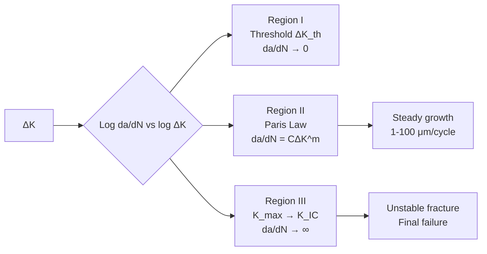
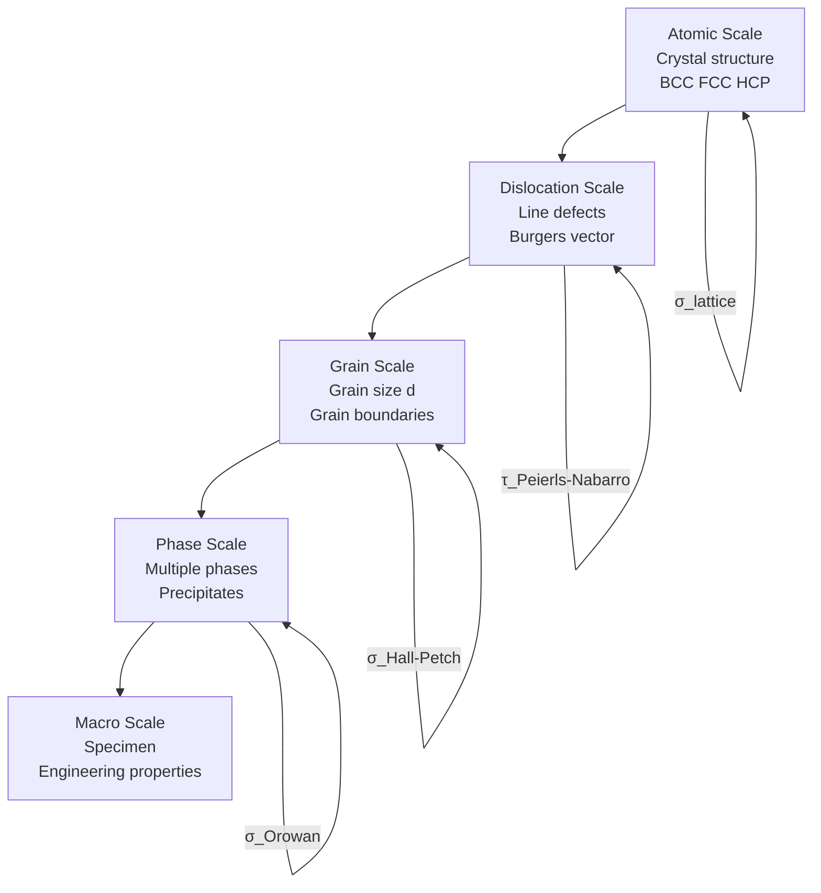

# 1.035 / 1.034 Multiscale Characterization of Materials

**MIT CEE Mechanics & Materials Track | 12 Units | Core**
**Prereq:** 1.050 or permission of instructor
**Instructor:** Prof. Andrew Whittle
**自學路徑：Bachelor → MEng SMD → Materials Research / NDT Engineer**

> **Source:** MIT Catalog (2024-25) — "Covers the structure and properties of natural and manufactured engineering materials with an emphasis on the fundamentals of mechanical behavior of materials, while considering their use in civil and environmental engineering design."
> **Topics:** Multiscale characterization, microstructure, mechanical testing, nondestructive evaluation

---

## 問題 1：這個領域所有專家共享的 5 個核心心智模型是什麼？

1. **材料性能是多尺度的**
   Mechanical properties emerge from hierarchical structure across scales: atomic bonds → crystal structure → grains → phases → macroscopic specimen. Each scale contributes to the macroscopic behavior.

2. **顯微組織決定宏觀性能**
   Grain size, phase distribution, defects (dislocations, voids), and interfaces control strength, toughness, and durability. Heat treatment, alloying, and processing modify microstructure to engineer properties.

3. **損傷是演化的過程**
   Damage accumulation — void growth, microcracking, fatigue — evolves under loading. Understanding damage evolution (rather than just failure load) is essential for life prediction.

4. **尺度效應是真實材料的本質**
   Smaller specimens, nanocrystalline materials, and thin films show size-dependent mechanical properties. Classical continuum mechanics does not capture these effects.

5. **表徵是多尺度的橋樑**
   Techniques from macro-scale (uniaxial testing) to micro-scale (SEM, TEM) to atomic scale (AFM, XRD) connect structure to properties.

---

## 問題 2：這個領域的專家在哪 3 個地方存在根本分歧？

### 分歧 1: 微觀結構 vs 連續介質
- **微觀派**: Understanding properties requires tracking microstructure explicitly (dislocations, grain boundaries, phases). Continuum models without microstructural basis cannot predict size effects.
- **連續介質派**: For engineering design, macroscopic constitutive models (J2 plasticity, damage mechanics) are sufficient. Microstructural details are averaged.

### 分歧 2: 破壞力學的連續介質 vs 分子動力學方法
- **連續介質破壞派** (LEFM, Cohesive zone): Fracture is governed by stress intensity K or energy release rate G. The crack tip singularity is characterized by these parameters.
- **分子動力學派** (MD, atomistic): At the atomistic scale, bond breaking is the mechanism. Bridging between atomistic and continuum is needed for multiscale modeling.

### 分歧 3: 破壞韌性 vs 疲勞閾值
- **韌性派**: K_IC is the fundamental fracture toughness. It governs rapid crack propagation.
- **疲勞閾值派**: ΔK_th is the fundamental threshold below which fatigue cracks do not propagate. Design for infinite fatigue life requires staying below ΔK_th.

---

## 問題 3：10 個深度問題

1. Hall-Petch 關係 σ_y = σ_0 + k·d^{−1/2} 中的 d（晶粒尺寸）如何從冶煉和熱處理過程控制？動態回復（dynamic recovery）和動態再結晶（dynamic recrystallization）如何影響微觀組織？
2. 從微觀結構解釋：為什麼低碳鋼在高應變率下表現得更脆，而鋁合金的應變率效應較小？
3. Vickers 硬度 HV = 1.8544P/d²（其中 d 為壓痕對角線長度）與拉伸強度之間的經驗關係是什麼？這個關係為什麼只在彈性-塑性材料中成立？
4. 在掃描電子顯微鏡（SEM）中，電子與樣品的相互作用深度（escape depth）如何影響圖像對比度？背散射電子（BSE）與二次電子（SE）的成像原理有何不同？
5. 疲勞裂紋擴展速率 da/dN = C(ΔK)^m 中的 C 和 m 如何從 Paris 圖的不同區域得出？threshold、linear Paris regime、near-critical regime 的物理意義是什麼？
6. 能量釋放率 G = −∂Π/∂a（其中 Π 是總勢能，a 是裂紋長度）與裂紋尖端應力強度因子 K_I = √(GE') 的關係是什麼？在平面應力與平面應變之間，E' 如何不同？
7. 描述 CTOD（裂紋尖端張開位移）和 J 積分的物理意義。兩者如何在彈塑性斷裂力學中連接微觀裂紋擴展與宏觀能量消散？
8. 說明超聲波探傷（ultrasonic testing）中的脈衝-回波法（pulse-echo）和穿透法（through-transmission）的原理，以及如何從回波幅度和時間計算缺陷深度。
9. 顯微硬度測試（nanoindentation）中的連續剛度測量（CSM）技術如何在單次加載中同時測量硬度和彈性模量？Oliver-Pharr 方法的推導步驟是什麼？
10. 在 X 射線衍射（XRD）中，Scherrer 方程 D = Kλ/(β cos θ) 如何從峰寬 β 計算晶粒尺寸？這個方程的適用範圍和局限性是什麼？

---

# 核心心智模型深化

## 1. 顯微組織與強度

### 1.1 Bilingual 概念對照
| English | 中英對照 | 定義 | 工程應用 |
|---|---|---|---|
| Grain boundary | 晶界 | Interface between crystals of different orientation | Strengthening mechanism |
| Dislocation | 位錯 | Line defect in crystal lattice | Plastic deformation carrier |
| Solid solution | 固溶體 | Alloying atoms in host lattice | Solution strengthening |
| Precipitation | 析出相 | Hard particles dispersed in matrix | Age hardening |

### 1.2 Key Derivation — Hall-Petch Relation

**Grain boundary strengthening** (Hall-Petch equation):
σ_y = σ_0 + k_H·d^{−1/2}

Where:
- σ_0 = friction stress (lattice resistance to dislocation motion)
- k_H = Hall-Petch coefficient (~0.5-1.0 MPa·m^{1/2} for steel)
- d = average grain diameter

**Derivation** (from dislocation pile-up model):
Dislocations pile up at grain boundaries. The stress at the lead dislocation from N dislocations: τ_eff = n·τ_applied. When τ_eff exceeds the Hall-Petch stress, the grain boundary "yields."

For BCC steel: k_H ≈ 0.74 MPa·m^{1/2}
If d = 10 μm: σ_y = σ_0 + 0.74×10^{−0.5} = σ_0 + 74 MPa
If d = 1 μm (nanocrystalline): σ_y = σ_0 + 0.74×10^{0} = σ_0 + 740 MPa

**Inverse Hall-Petch**: Below d ≈ 100 nm, softening (not strengthening) — grain boundary diffusion becomes dominant.

### 1.3 Engineering Applications
- **Thermo-mechanical processing**: Controlled rolling and accelerated cooling (TMCP) refines grain size to improve steel strength and toughness.
- **Precipitation hardening** (Al-Cu alloys): Guinier-Preston zones → θ'' (coherent) → θ' (semi-coherent) → θ (non-coherent). Peak hardness when θ' is uniformly distributed.
- **ASTM E112 grain size number G**: n = 2^{G−1} grains per mm² at 100× magnification.

---

## 2. 斷裂力學基礎

### 2.1 Bilingual 概念對照
| English | 中英對照 | 定義 | 工程應用 |
|---|---|---|---|
| Stress intensity factor | 應力強度因子 | K = βσ√(πa) | Crack tip stress field |
| Fracture toughness | 斷裂韌性 | K_IC — resistance to crack propagation | Material property |
| Energy release rate | 能量釋放率 | G = −∂Π/∂a | Fracture driving force |
| Paris law | Paris 定律 | da/dN = C(ΔK)^m | Fatigue crack growth |

### 2.2 Key Derivation — K vs G

**Irwin's relation** (plane stress): G = K_I²/E
**Irwin's relation** (plane strain): G = K_I²(1−ν²)/E

**Example — Central through-crack of length 2a in infinite plate**:
K_I = σ√(πa)
For σ = 200 MPa, a = 10 mm: K_I = 200×√(π×10) = 200×5.6 = **1120 MPa·mm^{1/2}** = **1.12 MPa·m^{1/2}**
For steel K_IC ≈ 50-100 MPa·m^{1/2}: a_crit = (K_IC/(σ√π))² = (50/(200×√3.14))² = (50/355)² = **0.0198 m = 19.8 mm**

This is the critical flaw size at which unstable fracture occurs.

### 2.3 Engineering Applications
- **Fracture toughness testing** (ASTM E399): Use CT (compact tension) or SENB (single-edge notch bend) specimens. K_IC requires valid plane strain conditions: B, a ≥ 2.5(K_IC/σ_y)².
- **Welded structures**: Post-weld heat treatment (PWHT) relieves residual stresses and can improve apparent toughness.
- **Fracture in concrete**: K_IC for concrete ≈ 0.5-2 MPa·m^{1/2} (much lower than steel). Crack tip process zone (FPZ) is large relative to crack size.

---

## 3. 疲勞裂紋擴展

### 3.1 Bilingual 概念對照
| English | 中英對照 | 定義 | 工程應用 |
|---|---|---|---|
| Paris regime | Paris 區 | da/dN = C(ΔK)^m | Steady fatigue crack growth |
| Threshold | 閾值 | ΔK_th — below which da/dN ≈ 0 | Infinite fatigue life |
| Closure | 裂紋閉合 | Crack wake roughness induces closure | Reduces effective ΔK |

### 3.2 Key Derivation — Paris Law and Three Regimes

**Fatigue crack growth rate** (Paris, 1963):
da/dN = C(ΔK)^m

Typical values:
- Steels: C ≈ 1.5×10^{−11}, m ≈ 3 (in SI units: m/cycle, MPa·m^{1/2})
- Aluminum: C ≈ 4×10^{−11}, m ≈ 3

**Three regimes**:
1. **Threshold regime** (ΔK → ΔK_th): da/dN ≈ 0. Below ΔK_th, crack does not propagate.
2. **Paris regime** (linear in log-log): da/dN = C(ΔK)^m. Steady growth.
3. **Near-critical regime** (K_max → K_IC): da/dN → ∞. Rapid, unstable fracture.

**Example — Steel with ΔK = 20 MPa·m^{1/2}, ΔK_th = 5 MPa·m^{1/2}**:
da/dN = 1.5×10^{−11} × (20)^3 = 1.5×10^{−11} × 8000 = 1.2×10^{−7} m/cycle
= 0.12 μm/cycle

For a crack to grow from a = 1 mm to a_crit = 30 mm:
Δa = 29 mm = 29×10^6 μm → N = 29×10^6/0.12 = 2.4×10^8 cycles

---

## 4. 超聲波表徵

### 4.1 Bilingual 概念對照
| English | 中英對照 | 定義 | 工程應用 |
|---|---|---|---|
| Pulse-echo | 脈衝-回波 | Transducer sends and receives pulse | Flaw detection |
| Time of flight | 飛行時間 | TOF = 2d/V | Defect depth |
| Acoustic impedance | 聲阻抗 | Z = ρV | Reflection coefficient |
| Wavelength | 波長 | λ = V/f | Resolution limit |

### 4.2 Key Derivation — Reflection at Interface

**Reflection coefficient** (normal incidence):
R = (Z_2 − Z_1)/(Z_2 + Z_1)

Where Z = ρV (acoustic impedance).
- Steel-water: Z_steel ≈ 45×10⁶ Rayl, Z_water ≈ 1.5×10⁶ Rayl → R ≈ 0.94 (94% reflection at steel-water interface)
- Steel-air: Z_air ≈ 0.0004×10⁶ Rayl → R ≈ 1.0 (nearly total reflection at steel-air interface — cracks filled with air are excellent reflectors)

**Depth calculation**:
TOF = 2d/V → d = (TOF × V)/2

**Example**: Longitudinal wave in steel V_L = 5900 m/s, TOF = 2 μs (0.002 s):
d = 5900 × 0.002/2 = **5.9 mm** depth

---

## 5. X射線衍射與晶粒尺寸

### 5.1 Key Derivation — Scherrer Equation

**Scherrer equation**:
D = Kλ/(β cos θ)

Where:
- D = crystallite size (nm)
- K = shape factor ≈ 0.9 (spherical)
- λ = X-ray wavelength (Cu Kα: λ = 1.5406 Å)
- β = peak width at half maximum (radians)
- θ = Bragg angle

**Example**: Steel (110) peak at 2θ = 44.7°, β = 0.003 rad (from XRD pattern):
D = 0.9×1.5406/(0.003×cos(22.35°)) = 1.386/0.00277 = **500 nm** (0.5 μm grain size)

**Limitation**: Scherrer gives crystallite size, not grain size. Crystallites within a grain can be smaller than grains.

---

# 深度自測問題詳解

## 詳解 1: Hall-Petch 與動態再結晶
**Answer:** 
動態再結晶（DRX）發生在高溫變形過程（鍛造、軋製）中。當位錯密度增加到臨界值時，變形儲能驅動新晶粒的成核和生長，取代變形晶粒。

細晶粒鋼的實現：TMCP工藝：
1. 低碳微合金鋼（Nb, V, Ti）：Nb(C,N)在軋製過程中析出，釘扎晶界（Zener pinning）
2. 加速冷卻（ACC）：抑制奧氏體向鐵素體轉變，使鐵素體在更低溫度形成，細化最終組織
3. 結果：鐵素體晶粒 d < 10 μm，σ_y > 400 MPa

## 詳解 2: 應變率效應
**Answer:** 
低碳鋼的體心立方（BCC）結構有明顯的應變率敏感性：
- 在低應變率（10⁻³ s⁻¹）：σ_y ≈ 250 MPa
- 在高應變率（10³ s⁻¹）：σ_y ≈ 400-600 MPa（應變率硬化）
原因：BCC 材料的熱激活滑移需要時間，高應變率減少了熱激活機制的貢獻

鋁合金（FCC）的應變率敏感性較小：σ_y 變化 < 10-20%，因為 FCC 的獨立滑移系更多，熱激活對剪切應力的影響較小。

## 📊 Diagram 1: 疲勞裂紋擴展 Paris 圖

## 📊 Diagram 2: 顯微組織尺度層次

---

## 總結

1. **顯微組織是宏觀性能的微觀基礎**：Hall-Petch 關係、析出硬化、固溶強化都是微觀-宏觀連接的具體例子
2. **斷裂力學提供了裂紋擴展的量化框架**：K_I、能量釋放率 G 和 J 積分是三個等價的斷裂驅動力參數
3. **疲勞是循環載荷下的累積損傷**：Paris 定律連接循環次數與裂紋擴展速率，是疲勞壽命預測的基礎
4. **超聲波和 X 射線衍射是土木工程材料表徵的核心技術**：兩者分別提供內部缺陷和微觀結構的無損量測
5. **尺度效應在奈米和微米尺度變得重要**：當材料尺寸接近微觀特徵尺度時，連續介質假設失效

**Prerequisite chain**: 1.050 → 1.035 → 1.036 → MEng SMD / Materials Research
