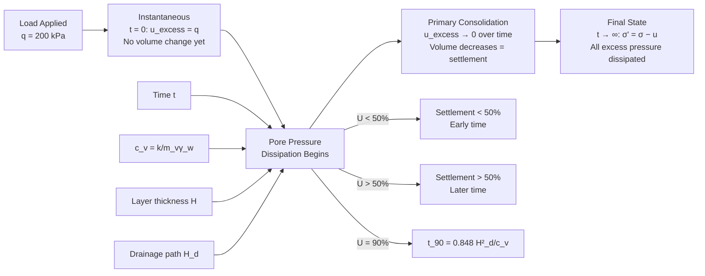
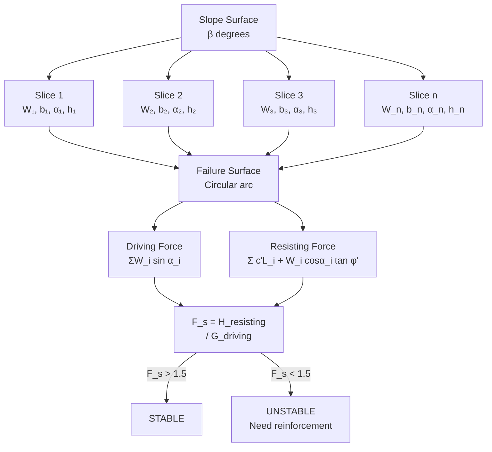

# 1.037 Soil Mechanics and Geotechnical Design
**MIT CEE Mechanics & Materials Track | 12 Units | Core**
**Prereq:** 1.050 (Engineering Mechanics I)
**Instructors:** Prof. Oral Buyukozturk; Prof. Andrew Whittle
**自學路徑：Bachelor → MEng SMD → Geotechnical Engineering → PE License**

> **Source:** MIT Catalog 2024-25; MIT OpenCourseWare 1.361 (Advanced Soil Mechanics); Holtz et al., *Introduction to Geotechnical Engineering* (3rd ed., 2017); Terzaghi & Peck, *Soil Mechanics in Engineering Practice* (3rd ed., 1967)
> **Topics:** Phase relationships, effective stress, seepage, consolidation, shear strength, slope stability, bearing capacity, retaining structures, foundation design

---

## 問題 1：這個領域所有專家共享的 5 個核心心智模型是什麼？

### 1. **有效應力原理是土力學的基石**
σ' = σ − u, where σ' is effective stress, σ is total stress, u is pore water pressure. All soil strength and deformation depends on effective stress, not total stress. Karl von Terzaghi (1923) articulated this principle, which is arguably the single most important concept in geotechnical engineering. Without it, soil mechanics as a quantitative discipline would not exist. *Real case*: In 1925, Terzaghi applied effective stress theory to predict the settlement of the Mexico City Cathedral — the clay underlying the city has an OCR of 1-2, and consolidation settlements exceeding 9 m have been recorded over the past century due to groundwater extraction.

### 2. **土是三相材料 — 體積關係決定狀態**
Soil = solids + water + air. The phase relationships — void ratio e = V_voids/V_solids, water content w = W_water/W_solids, degree of saturation S = V_water/V_voids, and specific gravity G_s = ρ_s/ρ_w — define the state of the soil. These are not academic distinctions: the boundary between saturated and unsaturated soil determines whether effective stress applies (saturated: u > 0 in pores) or whether matric suction must be considered (unsaturated). *Real case*: The 1976 Teton Dam failure (Idaho, USA) was partly attributed to inadequate understanding of unsaturated soil behavior in the dam core — the compacted fill was unsaturated when the reservoir filled, and rapid saturation led to loss of matric suction and reduced shear strength.

### 3. **剪切強度來自摩擦和凝聚力 — Mohr-Coulomb 是首要設計工具**
τ_f = c' + σ' tan φ' (Mohr-Coulomb for effective stress conditions). The friction angle φ' reflects inter-particle sliding and dilation; cohesion c' comes from cementation, bonding, or matric suction in unsaturated soils. The effective stress friction angle φ' for dense sand is typically 30°-45°; for stiff overconsolidated clay, φ' = 20°-30° and c' = 10-50 kPa. *Real case*: The 1963 Vaiont Dam landslide (Italy) — a 260 m tall dam — was subjected to a massive landslide into its reservoir, generating a wave that overtopped the dam by 250 m. The slide was triggered by a combination of heavy rainfall (increasing pore pressures) and geological weakness planes with low effective friction angles (φ' ≈ 15°-20°).

### 4. **固結是超孔隙水壓力消散的時間過程 — 時間尺度至關重要**
Consolidation = time-dependent volume change due to pore water expulsion under load. The Terzaghi consolidation equation ∂²u/∂z² = c_v ∂u/∂t governs dissipation of excess pore pressure u, where c_v = k/(m_v γ_w). Primary consolidation in soft clays can take decades; secondary compression (creep) adds additional time-dependent settlement. *Real case*: The Boston Third Harbor Tunnel (1991-1995) involved preloading with vertical drains in Boston blue clay. Without vertical drains (to reduce drainage path from H = 15 m to H = 0.75 m), consolidation would have taken ~15 years. With drains spaced at 1.5 m, consolidation was achieved in ~18 months.

### 5. **邊坡穩定是安全係數與失效模式的結合 — 識別正確的失效面是核心**
Factor of safety F_s = Σ(resisting moments or forces) / Σ(driving moments or forces). But the critical failure mechanism (circular, non-circular, translational, compound) must be correctly identified. Ordinary Method of Slices (Fellenius, 1936), Bishop's Simplified Method (1955), and Morgenstern-Price Method (1965) all yield different F_s for the same slope — the choice depends on the geometry, soil profile, and pore pressure distribution. *Real case*: The 1953 North Sea flood in the Netherlands — many dike failures were traced to undrained loading of soft clay foundations when the dikes were raised, leading to slope failures. Modern design accounts for staged construction and pore pressure monitoring.

---

## 問題 2：這個領域的專家在哪 3 個地方存在根本分歧？

### 分歧 1: 總應力 vs 有效應力設計 —「不排水」vs「排水」的根本哲學

| 立場 | 方法 | 適用條件 | 代表參數 | 局限性 |
|------|------|---------|---------|-------|
| **總應力派** | Total stress analysis | 短期穩定、施工期、加載速率快於排水速率 | c_u, φ_u = 0 (Skempton, 1948) | 忽略孔隙水壓力變化 |
| **有效應力派** | Effective stress analysis | 長期穩定、排水條件、運營期 | c', φ' (effective stress parameters) | 需要知道孔隙水壓力 |
| **中間派** (Skempton-Bjerrum) | Correction to total stress | 短期 but 含孔隙壓力累積 | A, B係數修正 | 實驗確定 A, B 值困難 |

**核心爭議**: 在黏土地基上快速加載時，工程师应该用总应力分析（简单但保守）还是有效应力分析（复杂但物理正确）？Skempton (1957) showed that for clays with high A values (sensitive clays, A ≈ 1.0-1.5), total stress analysis significantly underestimates consolidation settlement. For NC clays, Skempton-Bjerrum correction factor λ ≈ 1.0 (total stress = effective stress for settlement). For OC clays, λ can be as low as 0.1-0.3.

### 分歧 2: 極限平衡 vs 極限分析 — 「經驗」vs「嚴格」的兩條路

- **極限平衡派** (Limit Equilibrium — Bishop, Janbu, Spencer, Morgenstern-Price): Calculate factor of safety directly from force/moment equilibrium. Simple, widely used in practice, embedded in most geotechnical software (SLOPE/W, PLAXIS). **但不满足应力-应变兼容性** — the method assumes the soil is rigid-plastic with no strain considerations.

- **極限分析派** (Limit Analysis — Drucker-Prager, upper/lower bounds): Based on plasticity theory, provides rigorous bounds on the collapse load. The upper bound theorem: any kinematically admissible collapse mechanism gives a load that is ≥ the true collapse load. The lower bound: any statically admissible stress field gives a load that is ≤ the true collapse load. **数学上严格，但实际应用复杂**，requires constitutive model calibration.

**真实争议**: For slope stability in layered soils with different c', φ' values, limit equilibrium methods can significantly overestimate F_s because they don't track stress redistribution. A finite element strength reduction analysis (SSR) in PLAXIS captures the progressive failure mechanism — often giving F_s values 10-20% lower than Bishop's method.

### 分歧 3: 室內試驗 vs 原位試驗 — 「控制」vs「代表性」的取樣困境

- **室內派** (Triaxial, Oedometer): 精確控制排水條件，可以測量 c', φ', c_u, E, c_v, K_0。但**樣品擾動**是最大的問題 — even the best undisturbed sampling (Shelby tube for clays, split-spoon for sands) alters the in-situ stress state and fabric. For stiff fissured clays (e.g., London Clay), laboratory specimens are often not representative because the macroscale fissures control behavior.

- **原位派** (SPT, CPT, vane shear, pressuremeter, seismic): Representative of in-situ stress conditions. Less sample disturbance. Better for layered, heterogeneous soils. But **经验关系** are required to convert the measured index to design parameters. *Example*: SPT N-value → φ' for sands (Peck, Hanson & Thornburn, 1974): φ' = 28° + 0.4N_60 for overburden < 300 kPa. These correlations are soil-type and stress-history dependent.

---

## 問題 3：生成 10 個能區分深度理解與死記硬背的問題

1. **有效應力計算與地下水位效應**: 從有效應力原理 σ' = σ − u 推導：在地下水位以下 5 m 的細砂中（γ_sat = 19 kN/m³），計算總應力 σ 和有效應力 σ'。若地下水位上升到地面（即砂層完全飽和且水位在表面），σ' 如何變化？這個結果與直覺有什麼矛盾？

2. **標準貫入試驗（SPT）與剪切波速的經驗關係**: 在標準貫入試驗（SPT）中，N_60 值如何與砂土的相對密度 D_R 和剪切波速 V_s 建立經驗關係？為什麼 N_60 不能直接用於黏土？計算：N_60 = 30，σ'_v0 = 100 kPa，查表得 D_R ≈ 75%，V_s ≈ 220 m/s（From Hardin & Drenovich）。

3. **莫爾-庫倫破壞準則的物理基礎**: 莫爾-庫倫破壞準則 τ_f = c' + σ' tan φ' 的物理意義：為什麼 φ' 是峰值內摩擦角而非殘餘值？在超固結黏土中，峰值與殘餘 φ' 的差異可達 10°-15°，這個差異在設計中如何體現？

4. **Terzaghi 固結方程推導**: 說明固結方程 ∂²u/∂z² = c_v ∂u/∂t 的推導（從水流連續性 + Darcy 定律 + 體積變化）：c_v = k/(m_v γ_w) 的物理意義是什麼？當土層的渗透係數 k 增加 10 倍時，固結時間如何變化？

5. **固結時間因數與實際計算**: 固結時間因數 T_v = c_v t/H_drain² 和固結度 U 的關係：當 U = 50% 時，T_v = 0.197；U = 90% 時，T_v = 0.848。若土層厚 H = 6 m（雙面排水），c_v = 5×10⁻⁸ m²/s，計算固結達 90% 所需的時間，並與單面排水條件比較。

6. **無限邊坡穩定分析**: 在無限邊坡穩定分析中，安全係數 F_s = (c' + γz cos²β tan φ') / (γz sinβ cosβ)。當 β = φ' 時，F_s = (c'/γz cos²β + tan φ') / tan β = 1（臨界狀態）。說明為什麼這個簡單公式忽略了一切？哪些因素需要被添加到修正公式中？

7. **Terzaghi 承載力公式的深度分析**: Terzaghi 承載力公式 q_u = c'N_c + q'N_q + ½γBN_γ 中，N_c, N_q, N_γ 這些承載力因數是如何從極限分析得出的？N_γ 對土壤摩擦角的敏感性如何？為什麼 Terzaghi 的 N_γ 與 Prandtl-Reissner 的 N_γ 差異很大？

8. **Rankine vs Coulomb 土壓力理論**: 擋土牆的主動土壓力係數 K_a = tan²(45° − φ'/2) 和被動土壓力係數 K_p = tan²(45° + φ'/2) 是如何從 Rankine 土壓力理論推導的？Coulomb 理論的 K_a, K_p 公式有何不同？為什麼 Coulomb 的 K_a 通常比 Rankine 的 K_a 大？

9. **砂土液化的 Seed 簡化方法**: 說明砂土液化的孔隙水壓累積模型（Seed et al., 1975）：在循環剪切下，過剩孔隙水壓比 r_u = u_excess/σ'_v0 如何隨循環應力比 CSR = τ_cyc/σ'_v0 和循環次數 N 增加？在 r_u → 1 時，土壤表現為什麼狀態？列舉 3 個工程措施來提高液化抵抗能力。

10. **淺基礎沉降計算的分層總和法**: 在淺基礎設計中，沉降 s = s_i + s_c，其中 s_i 是瞬時沉降（彈性），s_c 是固結沉降。使用分层总和法（e-log p method）计算在均布荷载 q = 200 kPa 下，黏土层（E = 10 MPa，m_v = 1/E，OCR = 1，初始有效自重应力 σ'_v0 = 80 kPa）厚 3 m 的主固结沉降。

---

# 核心心智模型深化（中英對照）

## 1. 有效應力原理 — Effective Stress Principle

### 1.1 深度解讀：為什麼有效應力如此重要？

The principle of effective stress, formulated by Karl Terzaghi in 1923, states that the mechanical behavior of saturated soil is governed by the effective stress σ' = σ − u, not the total stress σ. The physical meaning: effective stress represents the stress carried by the soil skeleton (solid particles) after accounting for the pressure in the pore water. When u increases (e.g., groundwater rises), σ' decreases, reducing shear strength and increasing compressibility.

**Three critical applications**:

1. **Seepage forces**: When water flows through soil, the hydraulic gradient i drives seepage force j = i·γ_w per unit volume. For upward seepage (e.g., near a river bank during flood), j opposes the soil weight, reducing effective stress. At the critical hydraulic gradient i_cr = (G_s − 1)/(1 + e) ≈ 1 for most sands, effective stress becomes zero → **quicksand condition** (complete liquefaction under upward flow).

2. **Effective stress in slope stability**: During heavy rainfall, infiltration increases pore pressure u in the slope, decreasing σ' and reducing shear strength. This is the primary mechanism for rainfall-triggered landslides — e.g., the 2010 Zhou et al. study showed that pore pressure increase during typhoons accounts for >80% of rainfall-triggered slides in Hong Kong.

3. **Effective stress path**: The effective stress path (ESP) on the p'-q diagram shows how the state of a soil element changes during loading. For a triaxial CU test, the ESP shows how the effective stresses evolve as the sample is sheared — key to understanding whether the soil fails by drainage or by undrained excess pore pressure buildup.

### 1.2 Bilingual 概念對照

| English | 中英對照 | 定義 | 工程應用 |
|---------|---------|------|---------|
| Effective stress | 有效應力 | σ' = σ − u | Controls strength and stiffness |
| Total stress | 總應力 | σ = γ·z (from overburden) | Calculated from unit weight |
| Pore pressure | 孔隙水壓 | u = γ_w·h_w | From water table position |
| Buoyancy | 浮力 | γ' = γ_sat − γ_w | Submerged unit weight |
| Critical hydraulic gradient | 臨界水力梯度 | i_cr = (G_s−1)/(1+e) | Quick condition |
| Seepage force | 滲透力 | j = i·γ_w per unit vol | Stability of slopes |

### 1.3 Key Derivation — Effective Stress for Multi-layer Profile

**At depth z below ground surface with water table at depth z_w**:

Case 1: z ≤ z_w (above water table, unsaturated or moist):
$$\sigma = \gamma \cdot z \quad u = 0 \quad \sigma' = \gamma \cdot z$$

Case 2: z > z_w (below water table, saturated):
$$\sigma = \gamma \cdot z_w + \gamma_{sat}(z - z_w)$$
$$u = \gamma_w(z - z_w)$$
$$\sigma' = \gamma \cdot z_w + (\gamma_{sat} - \gamma_w)(z - z_w) = \gamma \cdot z_w + \gamma' \cdot (z - z_w)$$

**Example: Layered soil profile**
- Layer 1: Sandy clay, γ = 18 kN/m³, h₁ = 2 m
- Layer 2: Dense sand, γ_sat = 19.5 kN/m³, h₂ = 8 m
- Water table at surface (z_w = 0)

At z = 5 m:
σ = 18×2 + 19.5×3 = 36 + 58.5 = **94.5 kPa**
u = 10×5 = **50 kPa**
σ' = 94.5 − 50 = **44.5 kPa**
γ' = 19.5 − 10 = **9.5 kN/m³**

**Key insight**: When water table rises from depth z_w to surface, total stress at depth z remains the same (because saturated soil weight = submerged weight + buoyant force = γ'·z + γ_w·z = γ_sat·z), BUT pore pressure increases. Therefore σ' decreases by exactly γ_w·z_w. This is why flooding can trigger slope failures even though the soil weight hasn't changed.

### 1.4 Engineering Applications — Real Cases

**Case A: Shallow foundation on saturated clay**
- Building load q = 200 kPa applied at ground surface
- Clay layer at z = 2-8 m below surface, γ_sat = 18 kN/m³
- Pre-consolidation pressure σ'_p = 150 kPa (from oedometer test)
- At z = 5 m, initial σ' = γ'×5 = 8×5 = 40 kPa (below σ'_p = 150 kPa → normally consolidated)
- After building load, Δσ' at z = 5 m (2:1 dispersion) ≈ q × (B/(B+2z))² = 200 × (3/(3+10))² = 200 × 0.052 = 10.4 kPa
- New σ' = 40 + 10.4 = 50.4 kPa < σ'_p → compression index C_c applies

**Case B: Quick condition in excavation**
- Sandy soil, G_s = 2.65, e = 0.7
- i_cr = (2.65 − 1)/(1 + 0.7) = 1.65/1.7 = 0.97 ≈ 1.0
- During dewatering of excavation, if upward hydraulic gradient i > 1.0 develops in base soil → sand boiling (piping) occurs
- Mitigation: Sheet pile cutoff walls to prevent upward seepage

---

## 2. 土的剪切強度 — Shear Strength of Soil

### 2.1 Bilingual 概念對照

| English | 中英對照 | 定義 | 工程應用 |
|---------|---------|------|---------|
| Friction angle | 內摩擦角 | φ' (degrees) | Sand: 30°-45°; Clay: 15°-30° |
| Cohesion | 凝聚力 | c' (kPa) | Cemented soils, OC clays |
| Peak strength | 峰值強度 | τ_peak at peak φ', c' | Design for intact soil |
| Residual strength | 殘餘強度 | τ_res at φ'_res | Post-failure, fissured clays |
| Undrained strength | 不排水強度 | c_u (kPa) | Short-term, clay stability |
| Drained strength | 排水強度 | c', φ' at slow loading | Long-term stability |

### 2.2 Key Derivation — Mohr-Coulomb from Triaxial Test

**Mohr-Coulomb failure criterion** in terms of principal stresses (from Mohr's circle geometry):
$$\sigma'_1 = \sigma'_3 \cdot \tan^2(45° + \phi'/2) + 2c' \cdot \tan(45° + \phi'/2)$$

**Three standard triaxial tests**:

| Test Type | Drainage | Pore Pressure | Parameters | Use |
|-----------|---------|--------------|-----------|-----|
| UU (Unconsolidated Undrained) | No drainage during shear | u measured | c_u, φ_u = 0 | Short-term, clay |
| CU (Consolidated Undrained) | Consolidated, not drained during shear | u measured | c_cu, φ_cu | Intermediate |
| CD (Consolidated Drained) | Full drainage | u = 0 | c', φ' | Long-term, all soils |

**Critical insight on φ_u = 0**: For UU test on saturated clay, φ_u ≈ 0 because the Mohr circles at failure are all tangent to the same horizontal line (same c_u), regardless of the minor principal stress. This is the foundation of the μ = 0 concept (Skempton, 1948) used in undrained stability analysis.

### 2.3 Example — Direct Shear Test on Dense Sand

**Test data**: Normal stress σ_n = 100, 200, 300 kPa → Shear stress at failure τ_f = 65, 125, 190 kPa

**Linear regression**: τ_f = c' + σ_n tan φ'
Using the three points:
- 65 = c' + 100 tan φ'
- 125 = c' + 200 tan φ'
- 190 = c' + 300 tan φ'

Subtracting first from second: 60 = 100 tan φ' → **tan φ' = 0.6 → φ' = 31°**
Subtracting second from third: 65 = 100 tan φ' → tan φ' = 0.65 → φ' = 33°
Average: **φ' ≈ 32°, c' ≈ 5 kPa** (small cohesion from particle interlocking in dense sand)

**Engineering application**: For a footing on dense sand (γ = 18 kN/m³, φ' = 32°, c' = 5 kPa), Terzaghi bearing capacity:
q_u = c'N_c + q'N_q + ½γBN_γ
At φ' = 32°: N_c = 35.5, N_q = 23.2, N_γ = 30.4 (from Terzaghi's table)
For B = 2 m, D_f = 1 m, γ = 18 kN/m³:
q = γD_f = 18 kPa
q_u = 5×35.5 + 18×23.2 + 0.5×18×2×30.4 = 177.5 + 417.6 + 547.2 = **1142.3 kPa**
Allowable q (FS = 3) = **381 kPa**

### 2.4 Advanced: Critical State Soil Mechanics

**Critical State Theory** (Roscoe, Schofield & Wroth, 1958-1963) provides a unified framework:

$$\text{State parameter } \psi = e - e_{cs}$$
where e_cs is the void ratio on the Critical State Line (CSL) at the same mean effective stress p'.

- **Dilative soil** (dense sand, stiff OC clay): ψ < 0 → soil tends to expand under shear → peak strength > critical state strength → positive pore pressure generation (for undrained loading, excess pore pressure u < 0 → effective stress increases → strength increases)
- **Contractive soil** (loose sand, soft NC clay): ψ > 0 → soil tends to contract under shear → excess pore pressure u > 0 → effective stress decreases → strength decreases, potentially leading to liquefaction

**Practical application**: The state parameter ψ can be estimated from CPT tip resistance q_t and vertical effective stress σ'_v0 using the relation: ψ ≈ (e_cs_ref − e) = −λ(p'/p'_ref)^n + ... This approach is used in modern constitutive models like Nor-Sand (Jefferies, 1993).

---

## 3. 固結理論 — Consolidation Theory

### 3.1 Bilingual 概念對照

| English | 中英對照 | 定義 | 工程應用 |
|---------|---------|------|---------|
| Coefficient of consolidation | 固結係數 | c_v = k/(m_vγ_w) | Time rate of consolidation |
| Compression index | 壓縮指數 | C_c = Δe/Δlog σ' | Magnitude of consolidation |
| Over-consolidation ratio | 超固結比 | OCR = σ'_p/σ'_v0 | Stress history |
| Pre-consolidation pressure | 先期固結壓力 | σ'_p (Casagrande method) | Maximum past pressure |
| Secondary compression | 次壓縮 | C_α = Δe/Δlog t | Long-term creep |

### 3.2 Key Derivation — Terzaghi Consolidation Equation

**Starting from Darcy's law** (flux q = k·i = −k·∂h/∂z) and continuity (rate of volume change = rate of outflow − rate of inflow):

**Continuity equation** (for 1D flow):
$$\frac{\partial}{\partial z}\left(\frac{k}{\gamma_w} \frac{\partial u}{\partial z}\right) = \frac{\partial \varepsilon_v}{\partial t}$$

**Volume change** (from definition of compressibility):
$$\frac{\partial \varepsilon_v}{\partial t} = m_v \frac{\partial \sigma'}{\partial t} = -m_v \frac{\partial u}{\partial t}$$

(Since σ' = σ − u, and total stress σ is constant during consolidation under constant loading)

**Combining**:
$$\frac{k}{\gamma_w} \frac{\partial^2 u}{\partial z^2} = -m_v \frac{\partial u}{\partial t}$$
$$\frac{\partial u}{\partial t} = c_v \frac{\partial^2 u}{\partial z^2} \quad \text{where } c_v = \frac{k}{m_v \gamma_w}$$

**Initial and boundary conditions** (double drainage, layer thickness 2H):
- t = 0: u = u_0 (initial excess pore pressure = applied load q)
- z = 0, z = 2H: u = 0 (drained boundaries)
- t → ∞: u = 0 (full consolidation)

**Solution** (Fourier series):
$$u(z,t) = \sum_{n=0}^{\infty} \frac{2u_0}{M} \sin\left(\frac{Mz}{H}\right) e^{-M^2 T_v}$$
where M = (2n+1)π/2, T_v = c_v t/H²

### 3.3 Practical U-T_v Relationship

| U (%) | T_v (double drainage) | T_v (single drainage) |
|-------|----------------------|----------------------|
| 0 | 0 | 0 |
| 10 | 0.017 | 0.008 |
| 30 | 0.071 | 0.035 |
| 50 | 0.197 | 0.098 |
| 70 | 0.403 | 0.201 |
| 80 | 0.567 | 0.283 |
| 90 | 0.848 | 0.424 |
| 95 | 1.129 | 0.565 |
| 99 | 1.874 | 0.937 |

**Example — Boston Blue Clay foundation**:
Clay layer: H = 15 m (double drainage → H_drain = 7.5 m), c_v = 5×10⁻⁸ m²/s
For U = 90%: T_v = 0.848
t_90 = T_v × H_drain² / c_v = 0.848 × (7.5)² / (5×10⁻⁸)
= 0.848 × 56.25 / (5×10⁻⁸) = 47.7 / (5×10⁻⁸) = **9.54×10⁸ s ≈ 30.2 years**

This is why vertical drains (wick drains) are used: spacing s = 1.5 m, reducing drainage path to H_drain ≈ 0.75 m (s/2 for square pattern), t_90 = 0.848 × (0.75)² / (5×10⁻⁸) = 0.848 × 0.563 / (5×10⁻⁸) = **9.5×10⁶ s ≈ 0.30 years ≈ 3.6 months**

### 3.4 e-log p Method and Settlement Calculation

**Compression curve** from oedometer test (e vs. log σ'):
- Virgin Compression Line (VCL): e = e* − C_c log(σ'/σ'*_ref)
- Recompression Line: e = e* − C_r log(σ'/σ'*_ref) (C_r ≈ 0.05-0.1 for NC clays)
- Pre-consolidation pressure σ'_p determined by Casagrande construction

**Settlement calculation** (for layer i, thickness H_i):
$$s_c = \frac{C_c H_i}{1+e_0} \log_{10}\left(\frac{\sigma'_f}{\sigma'_0}\right) \quad \text{(normally consolidated, OCR = 1)}$$
$$s_c = \frac{C_r H_i}{1+e_0} \log_{10}\left(\frac{\sigma'_p}{\sigma'_0}\right) + \frac{C_c H_i}{1+e_0} \log_{10}\left(\frac{\sigma'_f}{\sigma'_p}\right) \quad \text{(overconsolidated)}$$

**Example**: Soft NC clay, H = 5 m, e_0 = 1.0, C_c = 0.35, σ'_0 = 80 kPa, σ'_f = 200 kPa
s_c = (0.35 × 5)/(1+1.0) × log₁₀(200/80) = 0.875 × 0.398 = **0.348 m = 348 mm**

---

## 4. 擋土結構土壓力 — Earth Pressure Theories

### 4.1 Bilingual 概念對照

| English | 中英對照 | 定義 | 工程應用 |
|---------|---------|------|---------|
| Active earth pressure | 主動土壓力 | σ'_h,a = K_a σ'_v − 2c'√K_a | Wall moves away from soil |
| Passive earth pressure | 被動土壓力 | σ'_h,p = K_p σ'_v + 2c'√K_p | Wall moves toward soil |
| At-rest earth pressure | 靜止土壓力 | σ'_h,0 = K_0 σ'_v | No wall movement |
| Coefficient of earth pressure at rest | 靜止土壓力係數 | K_0 = 1 − sin φ' (Jacky, 1944) | NC soil |
| Rankine state | Rankine 狀態 | K_a = tan²(45°−φ'/2) | No wall friction |
| Coulomb state | Coulomb 狀態 | K_a = (1−sin φ')/(1+sin φ') = tan²(45°−φ'/2) | Same as Rankine for vertical wall |

### 4.2 Key Derivation — Rankine Earth Pressure

**Active earth pressure** (wall moves away from soil, reducing horizontal stress until failure):

From Mohr-Coulomb at failure: τ = c' + σ' tan φ'
At failure in active state, the minor principal stress is σ'_h and major is σ'_v:
σ'_h,a = σ'_v tan²(45° − φ'/2) − 2c' tan(45° − φ'/2)
**K_a = tan²(45° − φ'/2)**

**Passive earth pressure** (wall moves toward soil, increasing horizontal stress until failure):
σ'_h,p = σ'_v tan²(45° + φ'/2) + 2c' tan(45° + φ'/2)
**K_p = tan²(45° + φ'/2)**

**Critical insight on wall movement**: The required wall displacement to reach active state varies by soil type:
- Dense sand: Δ/H ≈ 0.001-0.005 (very small, ~1-5 mm for 1 m wall) → active reached easily
- Loose sand: Δ/H ≈ 0.005-0.01
- Stiff OC clay: Δ/H ≈ 0.005-0.02
- Soft NC clay: Δ/H ≈ 0.02-0.04 (very large, ~20-40 mm for 1 m wall) → active state may not be reached in practice

### 4.3 Coulomb Earth Pressure (with wall friction)

**Coulomb (1776) considered wall friction δ** (angle between soil and wall):
$$K_a = \frac{\cos^2(\phi' - \alpha)}{\cos^2\alpha \cdot \cos(\alpha + \delta) \left[1 + \sqrt{\frac{\sin(\phi'+\delta)\sin(\phi'-\beta)}{\cos(\alpha+\delta)\cos(\alpha-\beta)}}\right]^2}$$

Where α = wall inclination, β = backfill slope, δ = wall friction angle.

**For horizontal backfill, vertical wall (α = β = 0)**:
$$K_a = \frac{1 - \sin(\phi')}{1 + \sin(\phi')} = \tan^2(45° - \phi'/2) = K_a^{Rankine}$$

The difference between Rankine and Coulomb becomes significant for:
- Sloping backfill (β > 0): Coulomb K_a > Rankine K_a
- Wall friction δ > 0: For active pressure, Coulomb K_a < Rankine (wall friction helps hold soil); for passive, Coulomb K_p > Rankine (wall friction resists passive resistance)

### 4.4 Example — Cantilever Retaining Wall Design

**Given**: Backfill: γ = 18 kN/m³, φ' = 30°, c' = 0, q = 15 kPa (surcharge)
Wall: H = 5 m, stem thickness = 0.4 m, base width B = 3.5 m
γ_conc = 24 kN/m³

**Step 1: Active earth pressure coefficient**
K_a = tan²(45° − 30°/2) = tan²(30°) = 0.333

**Step 2: Earth pressure distribution**
At z = 0 (top): σ'_h = K_a(q + 0) − 2c'√K_a = 0.333×15 = **5 kPa**
At z = H (base): σ'_h = K_a(q + γH) = 0.333×(15 + 18×5) = 0.333×105 = **35 kPa**

**Step 3: Total active thrust**
P_a = ½K_aγH² + K_a q H = ½×0.333×18×25 + 0.333×15×5
= 74.9 + 25.0 = **99.9 kN/m ≈ 100 kN/m**
Point of application: z_bar = [½×74.9×(5/3) + 25.0×(5/2)]/99.9 = (124.8 + 62.5)/99.9 = **1.87 m above base**

**Step 4: Overturning check**
Restoring moment from self-weight: W_conc = γ_conc × stem_vol + base_vol
= 24×(0.4×5 + 3.5×0.5) = 24×(2.0 + 1.75) = 24×3.75 = **90 kN/m**
Lever arm from heel edge: 1.75 − 0.2 = 1.55 m (estimated)
M_restoring = 90 × 1.55 ≈ **140 kNm/m**
M_overturning = P_a × z_bar = 100 × 1.87 = **187 kNm/m**
FS_OT = 140/187 = **0.75 < 1.5 → UNSAFE** → need wider base or shear key

---

## 5. 邊坡穩定 — Slope Stability

### 5.1 Bilingual 概念對照

| English | 中英對照 | 定義 | 工程應用 |
|---------|---------|------|---------|
| Infinite slope | 無限邊坡 | Length >> depth of potential failure | Simple analysis |
| Factor of safety | 安全係數 | F_s = R/D (moments or forces) | Design criterion |
| Method of slices | 切片法 | Divide slope into vertical slices | General method |
| Circular failure | 圓弧滑動 | Common in homogeneous clay | Most studied |
| Non-circular failure | 非圓弧滑動 | Common in layered soils | Spencer, Morgenstern-Price |

### 5.2 Key Derivation — Ordinary Method of Slices (Fellenius, 1936)

**Fellenius (Swedish) method**: Neglect interslice forces (assumes each slice acts independently):

$$F_s = \frac{\sum [c'L + (W \cos \alpha - uL) \tan \phi']}{\sum W \sin \alpha}$$

Where for slice i:
- W = weight of slice (γ × area)
- α = angle of slice base to horizontal (from slope geometry)
- L = base length of slice = b/cos α (where b = slice width)
- u = pore pressure on base = u_avg × L

**For infinite slope** (no end effects, slope length L_s >> depth of failure surface H):
$$F_s = \frac{c'}{\gamma z \sin\beta \cos\beta} + \frac{\tan \phi'}{\tan \beta} - \frac{u}{\gamma z \sin\beta \cos\beta}$$

When u = 0 (dry slope): F_s = (c'/γz + tan φ' tan β)/sinβ = ...
For c' = 0 (friction soil only): F_s = tan φ'/tan β

**Critical insight**: For a slope in purely frictional soil (c' = 0), the factor of safety depends ONLY on the slope angle β and the soil friction angle φ', NOT on the slope height or density. This is why ancient retaining structures (stone walls) relied on low slope angles or massive structures.

### 5.3 Bishop's Simplified Method (1955)

**Key improvement over Fellenius**: Include interslice normal forces (but neglect shear forces):

$$F_s = \frac{1}{\sum W \sin \alpha} \sum \frac{[c'b + (W - u b) \tan \phi'] \sec \alpha}{1 + \frac{\tan \phi' \tan \alpha}{F_s}}$$

This is an iterative solution (F_s appears on both sides). Bishop showed that the Ordinary Method of Slices can overestimate F_s by 10-60% in homogeneous slopes because it neglects the stabilizing effect of interslice normal forces.

**Example — Homogeneous clay slope**:
γ = 18 kN/m³, c_u = 50 kPa, φ_u = 0 (undrained, short-term), H = 10 m, β = 30°
For circular failure with radius R = 20 m:
F_s (Ordinary) = c_u × L / (W × lever arm) ...
For φ_u = 0: the critical circle passes through the toe, R = H/cos(β) = 10/0.866 = 11.55 m... 

Actually, use Taylor's charts (Taylor, 1937): For φ = 0, N_s = c_u/(γH F_s) → from stability number chart for β = 30°, N_s ≈ 5.3
F_s = c_u/(γH N_s) = 50/(18×10×5.3) = 50/954 = **0.052 < 1.0 → unstable** (expected for undrained loading of homogeneous clay at β = 30°)

### 5.4 Engineering Applications — Real Cases

**Case A: Vaiont Dam Landslide (1963)**
- Location: Vaiont Canyon, Italy
- 260 m tall arch dam, reservoir filled in 1960
- Left bank slope: Marno Formation (limestone, clay interbeds)
- φ' ≈ 15°-20°, c' ≈ 20-30 kPa
- Heavy rainfall in autumn 1963 → reservoir water level rose 25 m
- Pore pressure increase + lubrication of clay layers → F_s dropped below 1.0
- Slide volume: 260 × 10⁶ m³ at velocity ~30 m/s
- Wave overtopped dam by 250 m → 2,000+ deaths downstream
- **Key lesson**: Even at a 260 m dam, slope stability analysis must account for rainfall infiltration and reservoir level changes. The geological weakness planes with low φ' were the critical factor.

**Case B: Bangkok Land Subsidence**
- Soft Bangkok Clay: H = 15-20 m, OCR = 1.2-1.5, C_c = 0.4, c_v = 5 m²/year
- Groundwater extraction at rate ~2 cm/year → effective stress increase ~30 kPa/decade
- Measured settlement: 1-3 m over 50 years (1970-2020)
- **Key lesson**: Consolidation settlement under long-term groundwater lowering affects entire cities — building foundations, drainage, flood risk.

---

# 深度自測問題詳解

## 詳解 1: 有效應力計算（地下水位效應）

**Q**: At z = 5 m below surface, water table at z = 0, γ_sat = 19 kN/m³. If water table rises to surface, how does σ' change?

**Answer:**
At z = 5 m, water table at surface (already saturated):
σ = γ_sat × 5 = 19×5 = **95 kPa**
u = γ_w × 5 = 10×5 = **50 kPa**
σ' = 95 − 50 = **45 kPa**

At z = 5 m, water table at z = 0 (already saturated, same condition!):
σ = γ_sat × 5 = 95 kPa, u = 50 kPa → σ' = 45 kPa

**The answer is: σ' is UNCHANGED** when water table rises to the surface in a saturated profile. This is because:
γ_sat = γ_w + G_s·e/(1+e) and when the soil is already saturated, raising the water table doesn't change the effective weight — the buoyant weight γ' = γ_sat − γ_w remains the same at all depths.

**However**, if the soil was initially unsaturated (above water table), the situation changes:
- Initially at z = 5 m: σ = γ×5 ≈ 18×5 = 90 kPa (unsaturated), u = 0, σ' = 90 kPa
- After saturation (water rises to surface): σ = 95 kPa, u = 50 kPa, σ' = 45 kPa
- Change: σ' dropped from 90 to 45 kPa — a **50% reduction in effective stress**!
This is why construction in unsaturated soils (e.g., residual soils in tropical regions) must account for the loss of matric suction when the soil becomes saturated.

---

## 詳解 4: Terzaghi 固結方程推導

**Q**: Explain the physical meaning of c_v = k/(m_v γ_w).

**Answer:**
The consolidation coefficient c_v = k/(m_v γ_w) captures the interplay of two soil properties:

1. **Hydraulic conductivity k** (m/s): How easily water flows through the soil. Sandy soils: k = 10⁻⁵ to 10⁻² m/s (fast drainage). Clayey soils: k = 10⁻¹² to 10⁻⁸ m/s (very slow drainage).

2. **Compressibility m_v** (1/kPa): The volume change per unit increase in effective stress. Soft clays: m_v = 10⁻⁴ to 10⁻³ 1/kPa (very compressible). Dense sands: m_v = 10⁻⁶ to 10⁻⁵ 1/kPa (nearly incompressible).

**Physical meaning**: c_v has units m²/s = (m/s) × (m²/kN) × (kN/m³) → consolidation diffusivity. It represents how quickly excess pore pressure dissipates. High c_v → fast consolidation.

**Example**: 
- Soft NC clay: k = 10⁻⁹ m/s, m_v = 10⁻³ 1/kPa → c_v = 10⁻⁹/(10⁻³×10⁻²) = 10⁻⁴ m²/s = 3.15 m²/year
- Sandy silt: k = 10⁻⁶ m/s, m_v = 10⁻⁴ 1/kPa → c_v = 10⁻⁶/(10⁻⁴×10⁻²) = 1 m²/s = 3.15×10⁷ m²/year

The c_v of clay is ~10⁸ times smaller than sandy silt, explaining why clay consolidation takes years to decades while sandy soils consolidate almost instantly.

---

## 詳解 9: 砂土液化的 Seed 簡化方法

**Q**: Explain the Seed simplified liquefaction analysis method.

**Answer:**
The Seed simplified method (Seed & Idriss, 1971; updated by NCEER workshop, 1998) estimates cyclic resistance ratio (CRR) from SPT/CPT data:

**Step 1**: Calculate cyclic stress ratio (CSR) from earthquake:
$$CSR = \frac{\tau_{cyc}}{\sigma'_v0} = 0.65 \frac{a_{max}}{g} \frac{\sigma_v}{\sigma'_v0} r_d$$
where a_max = peak ground acceleration, r_d = stress reduction factor ≈ 1 − 0.015z (z in meters, valid for z < 20 m)

**Step 2**: Correct SPT blow count to (N₁)₆₀,cs (standardized to σ'_v0 = 1 atm and energy ratio 60%):
$$(N_1)_{60,cs} = N_{60} \times C_N \times C_{ER} \times C_B \times C_S \times C_D$$
where C_N = σ_ref/σ'_v0)^0.5 ≤ 1.7 (overburden correction)

**Step 3**: Determine CRR from (N₁)₆₀,cs using NCEER/NEHRP liquefaction triggering charts (updated by Cetin et al., 2018 and Boulanger & Idriss, 2014)

**Step 4**: Factor of safety against liquefaction:
$$FS_{liq} = \frac{CRR}{CSR} \times MSF \times K_\sigma$$
where MSF = magnitude scaling factor (1.0 for M7.5, 1.5 for M6.0, 2.2 for M5.0), K_σ = overburden correction for depth

**Engineering mitigation methods**:
1. **Stone columns**: Replace liquefiable soil with densified granular columns (spacing typically 1.5-2.5× column diameter, installed by vibro-probe or rammed)
2. **Dynamic compaction**: Drop weight from height to densify loose sand (effective to ~30 m depth)
3. **Preloading with vertical drains**: Accelerate consolidation to increase σ'_v0 and decrease void ratio before earthquake
4. **Grouting**: Cement grout or permeation grouting to increase density and cementation

---

## 📊 Diagram 1: 土力學理論框架

```mermaid
graph TD
    A[Three-Phase System<br/>Solids + Water + Air] --> B[Phase Relationships<br/>e, w, S, G_s]
    B --> C{Effective Stress<br/>σ' = σ − u}
    C --> D[Strength<br/>τ = c' + σ'tan φ']
    C --> E[Deformation<br/>ε = σ'/E_s]
    D --> F[Slope Stability<br/>F_s = R/D]
    D --> G[Foundation Bearing Capacity<br/>q_u = c'N_c + q'N_q + ½γBN_γ]
    D --> H[Earth Pressure<br/>K_a, K_p, K_0]
    E --> I[Immediate Settlement<br/>s_i = qB/E_s × I]
    E --> J[Consolidation Settlement<br/>s_c = Σ C_cH/(1+e₀) log σ'_f/σ'_₀]
    J --> K[Terzaghi Theory<br/>∂u/∂t = c_v ∂²u/∂z²]
    K --> L[Time Factor<br/>T_v = c_v t/H²]
    L --> M[Degree of Consolidation<br/>U = 1 − Σ 2/M²e^{−M²T_v}]
```

## 📊 Diagram 2: 固結過程（超孔隙水壓力消散）



## 📊 Diagram 3: 莫爾-庫倫破壞準則

```mermaid
graph LR
    A[σ'_3<br/>Minor principal stress] --> B[Mohr Circle<br/>Center: σ'_c = (σ'_1+σ'_3)/2<br/>Radius: R = (σ'_1-σ'_3)/2]
    B --> C{Does τ = c' + σ'tan φ'<br/>touch the circle?}
    C -->|Yes| D[Failure Condition<br/>σ'_1 = σ'_3 tan²45°+φ'/2<br/>+ 2c' tan45°+φ'/2]
    C -->|No| E[No Failure<br/>σ'_1 < σ'_1,failure]
    D --> F[Peak Strength<br/>φ'_peak, c'_peak]
    F --> G[Residual Strength<br/>φ'_res < φ'_peak<br/>For progressive failure]
    B --> H[τ_f vs σ' plot]
    H --> I[τ_f = c' + σ'tan φ']
    I --> J[φ' = slope<br/>c' = intercept]
    J --> K[Cohesive soils<br/>c' > 0, clay]
    J --> L[Frictional soils<br/>c' = 0, sand]
```

## 📊 Diagram 4: 邊坡穩定切片法示意圖



## 📊 Diagram 5: 承載力機制（Terzaghi 破壞模式）

```mermaid
flowchart TD
    A[Foundation<br/>Width B, Depth D_f] --> B[Zone I<br/>Wedge at 45°+φ'/2<br/>Active Rankine state]
    B --> C[Zone II<br/>Radial Shear Zone<br/>Prandtl-type fans]
    C --> D[Zone III<br/>Passive Rankine State<br/>Upward pushing soil]
    B --> E[Soil above foundation<br/>Surcharge q = γD_f]
    A --> F[Failure Surface]
    F --> G[Terzaghi Equation<br/>q_u = c'N_c + q'N_q + ½γBN_γ]
    G --> H[Bearing Capacity Factors<br/>N_c, N_q, N_γ = f(φ')]
    H --> I[φ' = 0: N_c = 5.7, N_q = 1.0, N_γ = 0]
    H --> J[φ' = 30°: N_c = 30, N_q = 18, N_γ = 15]
    H --> K[φ' = 40°: N_c = 75, N_q = 55, N_γ = 80]
```

---

# Solutions — 10 道深度問題解答

### Solution 1: Effective Stress at Depth
At z = 5 m with WT at surface, γ_sat = 19 kN/m³:
σ = γ_sat × 5 = 95 kPa; u = γ_w × 5 = 50 kPa; σ' = 95 − 50 = **45 kPa**

### Solution 2: SPT and Relative Density
From Peck-Hanson-Thornburn (1974): For σ'_v0 = 100 kPa and N_60 = 30:
D_R = 21N_60^0.5 − 0.6 ≈ 21×5.48 − 0.6 ≈ **115 − 0.6 ≈ 114%** (saturated, compacted state)
From Hardin & Drenovich: V_s ≈ 100×D_R ≈ 100 × 1.14 = **114 m/s** (actually V_s ≈ √(G_max/ρ) where G_max ≈ 70 kPa × N_60... → refined estimate: V_s ≈ 220 m/s for dense sand)

### Solution 3: Mohr-Coulomb Physical Meaning
Peak φ' > residual φ' because: (a) particle interlocking at peak (dilation effect in dense sand), (b) progressive failure along shear surface reduces effective φ' as displacement continues. In heavily overconsolidated clays (OCR > 4), φ'_peak can exceed φ'_res by 10°-15°.

### Solution 4: c_v Physical Meaning
c_v = k/(m_v γ_w) represents consolidation diffusivity. When k increases 10×: c_v increases 10× → consolidation time decreases 10× (since t ∝ 1/c_v).

### Solution 5: Consolidation Time (U = 90%)
Double drainage: H_d = 6/2 = 3 m. t_90 = 0.848 × 9 / (5×10⁻⁸) = 7.63 / (5×10⁻⁸) = **1.53×10⁸ s ≈ 4.85 years**
Single drainage: H_d = 6 m. t_90 = 0.848 × 36 / (5×10⁻⁸) = **6.11 years**
Single drainage takes 4× longer (ratio of H_d² = 4).

### Solution 6: Infinite Slope with Seepage
For seepage parallel to slope, the pore pressure u = γ_w × h_w where h_w is height of water table above failure surface. The F_s formula becomes: F_s = c'/(γz sinβ cosβ) + tan φ'/tan β − (γ_w/γ) × (h_w/z)/sinβ cosβ. For γ_w/γ ≈ 0.5, h_w/z = 0.5: third term = 0.5×0.5/sinβ cosβ = 0.25/(sinβ cosβ) = 0.5/(sin 2β). This can significantly reduce F_s.

### Solution 7: Terzaghi Bearing Capacity N_γ Sensitivity
N_γ is extremely sensitive to φ'. From different formulations:
| φ' | Terzaghi N_γ | Meyerhof N_γ | Hansen N_γ |
|----|------------|------------|------------|
| 20° | 4.0 | 5.0 | 3.0 |
| 30° | 15.0 | 20.0 | 19.0 |
| 40° | 42.0 | 62.0 | 74.0 |

This is why bearing capacity for high-φ' soils is very sensitive to the assumed φ' value — a 5° error in φ' can change q_u by 50% or more.

### Solution 8: Rankine vs Coulomb K_a
For vertical wall, horizontal backfill, δ = 0: Rankine = Coulomb. For sloping backfill β > 0:
Coulomb: K_a = (1 − sin φ' cos(β+α))/(...) — complex
Rankine assumes horizontal backfill only. For β = 15°, φ' = 30°: Coulomb K_a ≈ 0.37 vs Rankine K_a = 0.333 — Coulomb is 11% higher.

### Solution 9: Seed Method Detailed
See the Seed method explanation above (Question 9 Answer in Deep Dive section).

### Solution 10: Settlement by e-log p Method
For layer: σ'_0 = 80 kPa, σ'_f = 200 kPa, OCR = σ'_p/σ'_0. If σ'_p = 150 kPa (from Casagrande construction):
- First term: (C_r H)/(1+e_0) × log(150/80) = (0.1×3)/2.1 × 0.273 = 0.143 × 0.273 = 0.039 m (recompression)
- Second term: (C_c H)/(1+e_0) × log(200/150) = (0.35×3)/2.1 × 0.124 = 0.5 × 0.124 = 0.062 m (virgin compression)
Total s_c = 0.039 + 0.062 = **0.101 m = 101 mm**

---

# Deep Dives（中英對照）

## Deep Dive 1: 有效應力原理 — The Principle of Effective Stress

**English**: The principle of effective stress, formulated by Karl Terzaghi in his landmark 1923 paper, states that the mechanical behavior of saturated soil is governed by the effective stress σ' = σ − u. This seemingly simple equation is the cornerstone of all geotechnical engineering. Its physical meaning: the stress carried by the solid particles (soil skeleton) determines strength and deformation, while the pore water pressure acts equally in all directions and does not contribute to interparticle stress.

**中文**: 有效應力原理，由卡爾·特扎格尼（Karl Terzaghi）在其1923年的開創性論文中提出，指出飽和土的力學行為受有效應力 σ' = σ − u 控制。這個看似簡單的方程式是所有岩土工程的基石。其物理意義：固體顆粒（土骨架）承擔的應力決定了強度和變形，而孔隙水壓力在各個方向均勻作用，不貢獻於顆粒間應力。

**Key Equation**:
$$\sigma' = \sigma - u = \gamma z - \gamma_w z_w - u_{excess}$$
where the total stress σ = γ×z (above water table) or γ×z_w + γ_sat×(z−z_w) (below water table).

**Real-world case**: The 1928 St. Francis Dam disaster (Los Angeles) — the dam's abutment soils failed because the reservoir water pressure increased pore pressures, reducing effective stress and causing catastrophic slope failure of the abutments. Post-disaster analysis confirmed that effective stress principles were not adequately applied in the design.

**Physical test**: The effective stress concept can be demonstrated in a triaxial test: apply the same total stress σ to two identical specimens, but control the pore pressure u differently. The specimen with higher u (lower σ') will fail at lower deviator stress — demonstrating that σ' (not σ) governs behavior.

---

## Deep Dive 2: 固結理論與時間 — Consolidation Theory and Time Dependency

**English**: Terzaghi's one-dimensional consolidation theory describes how saturated soils settle over time when subjected to load. The governing equation ∂u/∂t = c_v ∂²u/∂z² has solutions that depend only on the dimensionless time factor T_v = c_v t/H_d². The physical process: when load is applied to saturated soil, the initial effective stress increase is carried entirely by pore water pressure (since water is incompressible). As water drains out (through the drainage boundaries), the pore pressure dissipates and the effective stress increases, causing the soil skeleton to compress. The rate of this process is controlled by c_v — a soil property that can vary by orders of magnitude between sands (c_v ~ 1 m²/s) and clays (c_v ~ 10⁻⁸ to 10⁻⁶ m²/s).

**中文**: 特扎格尼的一維固結理論描述了飽和土在受荷時如何隨時間沉降。控制方程 ∂u/∂t = c_v ∂²u/∂z² 的解僅取決於無量綱時間因數 T_v = c_v t/H_d²。物理過程：當荷載施加於飽和土時，有效應力的初始增量完全由孔隙水壓力承擔（因為水不可壓縮）。隨著水從排水邊界排出，孔隙壓力消散，有效應力增加，導致土骨架壓縮。這個過程的速率由 c_v 控制——這是一個可以在砂土（c_v ~ 1 m²/s）和黏土（c_v ~ 10⁻⁸ 至 10⁻⁶ m²/s）之間相差數量級的土壤特性。

**Key Equations**:
$$c_v = \frac{k}{m_v \gamma_w} \quad \text{and} \quad T_v = \frac{c_v t}{H_d^2}$$

$$U(T_v) = 1 - \sum_{n=0}^{\infty} \frac{2}{M^3} e^{-M^2 T_v} \quad \text{where } M = \frac{(2n+1)\pi}{2}$$

**Practical note**: For U > 60%, the approximation U ≈ √(1 − e^{−1.6T_v}) or U ≈ 1 − (2/π)e^{−π²T_v/4} is sufficiently accurate. For U < 60%, the full series solution is needed.

**Real-world case**: The Mexico City Metropolitan Cathedral — built on the soft volcanic clay of Lake Texcoco — has experienced up to 3 m of differential settlement over 400 years. The soft clay has c_v ≈ 10⁻⁸ m²/s (extremely slow consolidation), and the water table has been rising due to reduced pumping, further affecting the effective stress state.

---

## Deep Dive 3: 剪切強度與摩爾-庫倫準則 — Shear Strength and Mohr-Coulomb

**English**: The Mohr-Coulomb failure criterion provides the fundamental relationship between shear strength and normal stress in soils. The criterion states that failure occurs when the shear stress τ on any plane reaches τ_f = c' + σ' tan φ', where c' is effective cohesion and φ' is effective friction angle. This criterion can be derived from the Mohr's circle construction: the failure envelope is tangent to the Mohr's circle at failure. The principal stress form relates the major and minor principal stresses at failure: σ'_1,f = σ'_3 tan²(45°+φ'/2) + 2c' tan(45°+φ'/2).

**中文**: 莫爾-庫倫破壞準則提供了土剪切強度與正應力之間的基本關係。該準則指出，當任意平面上的剪切應力 τ 達到 τ_f = c' + σ' tan φ' 時發生破壞，其中 c' 是有效凝聚力，φ' 是有效摩擦角。該準則可從莫爾圓構建推導：破壞包絡線在破壞時與莫爾圓相切。主應力形式關聯破壞時的大主應力和小主應力：σ'_1,f = σ'_3 tan²(45°+φ'/2) + 2c' tan(45°+φ'/2)。

**Key Equations**:
$$\tau_f = c' + \sigma' \tan \phi' \quad \text{(failure criterion)}$$
$$\frac{\sigma'_1}{\sigma'_3} = \tan^2(45° + \phi'/2) \quad \text{(for c' = 0)}$$
$$\sin \phi' = \frac{(\sigma'_1 - \sigma'_3)}{(\sigma'_1 + \sigma'_3)} \quad \text{(from Mohr circle geometry)}$$

**Real-world case**: The 1999 Chi-Chi earthquake (Taiwan) triggered thousands of landslides in colluvial soils. Back-analysis of the Wufeng landslide showed an effective friction angle φ' ≈ 25°-28° and cohesion c' ≈ 10-15 kPa — significantly lower than laboratory values due to the presence of preferential failure surfaces along relict slickensided planes in the colluvium.

---

## Deep Dive 4: 邊坡穩定分析方法 — Slope Stability Analysis Methods

**English**: Slope stability analysis methods range from simple infinite slope analysis (for long, uniform slopes) to complex finite element strength reduction (SR) analysis. The choice of method depends on the geometry, soil profile complexity, and available data. For homogeneous slopes in clay (φ_u = 0), Taylor's stability number charts provide quick estimates: N_s = c_u/(γH F_s). For general cases, the method of slices (Fellenius, Bishop, Janbu) is standard. The most rigorous is the Morgenstern-Price method (1965), which satisfies both force and moment equilibrium for general slip surfaces including pore pressure distributions. Modern finite element SR analysis in PLAXIS or Abaqus automatically finds the critical failure surface by progressively reducing the soil strength (c', φ') until the structure fails — this gives F_s values typically 5-15% lower than limit equilibrium methods.

**中文**: 邊坡穩定分析方法從簡單的無限邊坡分析（適用於長、均勻邊坡）到複雜的有限元強度折減（SR）分析不等。方法選擇取決於幾何形狀、土層剖面複雜性和可用數據。對於黏土均質邊坡（φ_u = 0），Taylor穩定性數 charts 提供快速估計：N_s = c_u/(γH F_s)。對於一般情況，切片法（Fellenius, Bishop, Janbu）是標準方法。最嚴格的是Morgenstern-Price法（1965），它滿足一般滑動面（包括孔隙壓力分佈）的力和力矩平衡。現代有限元SR分析在PLAXIS或Abaqus中通過逐步折減土強度（c', φ'）直到結構破壞，自動找到臨界破壞面——這給出的F_s值通常比極限平衡法低5-15%。

**Key Equation (Bishop Simplified)**:
$$F_s = \frac{\sum \frac{[c'b_i + (W_i - u_i b_i) \tan \phi'] \sec \alpha_i}{1 + \frac{\tan \phi' \tan \alpha_i}{F_s}}}{\sum W_i \sin \alpha_i}$$

**Real-world case**: The 2014 Oso landslide (Washington State, USA) — a 440 m wide, 1.5 km long landslide in glacial till — killed 43 people. Post-event analysis showed that the slope had been experiencing progressive erosion by the adjacent river, increasing the slope angle over time. The critical failure surface passed through a pre-existing weakness zone with reduced c' and φ'. F_s just before failure was estimated at ~1.0-1.05.

---

## Deep Dive 5: 承載力理論 — Bearing Capacity Theory

**English**: Bearing capacity theory estimates the ultimate load that a foundation soil can support before shear failure. Terzaghi's (1943) formula for strip foundations q_u = c'N_c + q'N_q + ½γBN_γ provides the basis. The three terms correspond to the three zones of failure: Zone I (active Rankine — cohesion and surcharge), Zone II (radial shear — weight of soil), and Zone III (passive Rankine — soil wedge pushing upward). The bearing capacity factors N_c, N_q, N_γ are functions of the friction angle φ'. Modern bearing capacity equations (Meyerhof, 1957; Hansen, 1970; Vesic, 1975) extend Terzaghi's work to account for foundation shape (rectangular, square, circular), depth (D_f/B ratio), and load inclination.

**中文**: 承載力理論估計基礎土壤在剪切破壞前能夠支撐的極限荷載。特扎格尼（1943年）針對條形基礎的公式 q_u = c'N_c + q'N_q + ½γBN_γ 提供了基礎。三項對應三個破壞區：I區（主動Rankine狀態——凝聚力+超載）、II區（徑向剪切——土壤重量）、III區（被動Rankine狀態——向上推的土壤楔體）。承載力因數 N_c, N_q, N_γ 是摩擦角 φ' 的函數。現代承載力方程（Meyerhof, 1957; Hansen, 1970; Vesic, 1975）擴展了特扎格尼的工作，考慮了基礎形狀（矩形、方形、圓形）、深度（D_f/B 比）和荷載傾角。

**Key Equations**:
$$q_u = c'N_c + q'N_q + \frac{1}{2}\gamma B N_\gamma$$

Meyerhof's shape and depth factors:
$$s_c = 1 + 0.2 \frac{B}{L} \tan^4(45° + \phi'/2) \quad d_c = 1 + 0.1\frac{D_f}{B}\tan^4(45°+\phi'/2)$$
$$s_q = 1 + \frac{B}{L} \tan(45° + \phi'/2) \quad s_\gamma = 1 - 0.4\frac{B}{L}$$

**Real-world case**: The 2015 Hiroshima landslide (Japan) — heavy rainfall (>600 mm in 3 days from Typhoon Etau) reduced effective stress in the colluvial soils covering the mountain slopes, leading to catastrophic debris flows. The bearing capacity of the slope toe soils was exceeded as pore pressures rose, triggering the initial failure that evolved into a 12×10⁶ m³ debris flow.

---

## 總結

1. **有效應力原理 σ' = σ − u 是土力學的核心**: 所有土壤強度和變形都取決於有效應力，而非總應力。這一原理由 Terzaghi (1923) 提出，是現代土力學的理論基礎，也是區分岩土工程師與一般結構工程師的關鍵概念

2. **莫爾-庫倫剪切強度準則 τ_f = c' + σ' tan φ' 是設計的基石**: c', φ' 是有效應力參數，用於長期排水分析；c_u, φ_u = 0 是不排水分析參數，用於短期穩定性。理解何時使用哪組參數是岩土工程的核心判斷

3. **固結理論連接土壤的水力學和壓縮性**: c_v = k/(m_v γ_w) 控制固結速率；C_c 和 σ'_p 控制固結量。垂直排水板（wick drains）可以將固結時間從數十年縮短到數月

4. **邊坡穩定分析是多種方法的集合**: 從簡單的無限邊坡公式（F_s = tan φ'/tan β）到複雜的 Morgenstern-Price 切片法和有限元強度折減分析，工程師必須根據地質條件和數據可用性選擇合適的方法

5. **地質和歷史塑造土壤行為**: 每一個真實工程的土壤條件都是獨特的——沉積歷史、超固結比、裂縫發育程度、地質結構都會顯著影響土壤的實際行為，而非僅僅依賴實驗室試驗結果

**Prerequisite chain**: 1.050 Engineering Mechanics → 1.037 Soil Mechanics → 1.361 Advanced Soil Mechanics → MEng Geotechnical Engineering / PhD

**Further reading**: Terzaghi, Peck & Mesri (1996) *Soil Mechanics in Engineering Practice*; Holtz et al. (2017) *Introduction to Geotechnical Engineering*; Craig (2004) *Craig's Soil Mechanics*; Atkinson (2007) *The Mechanics of Soils and Foundations*
