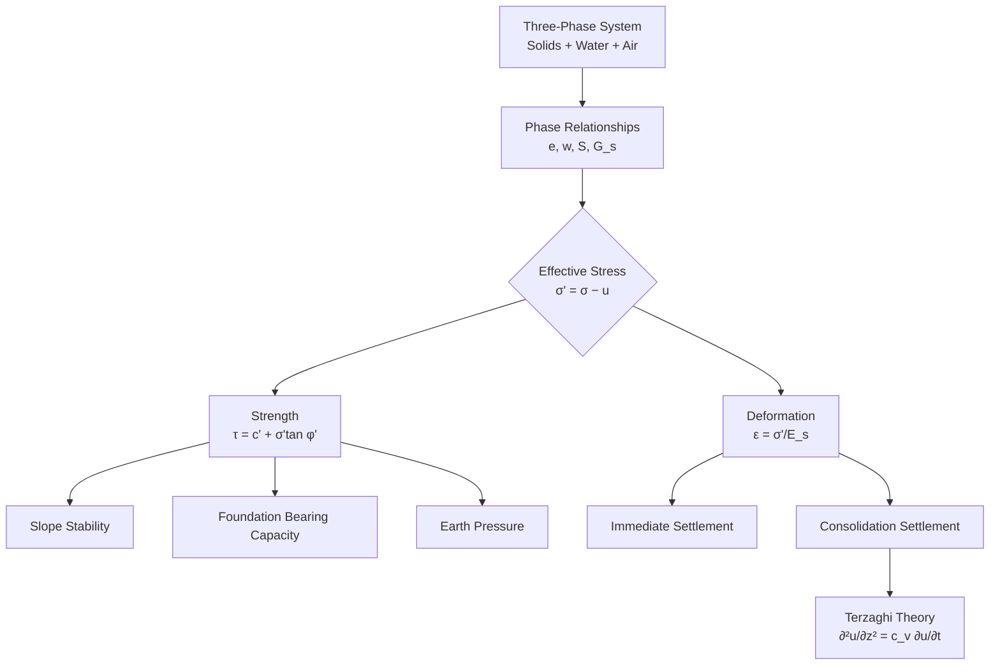
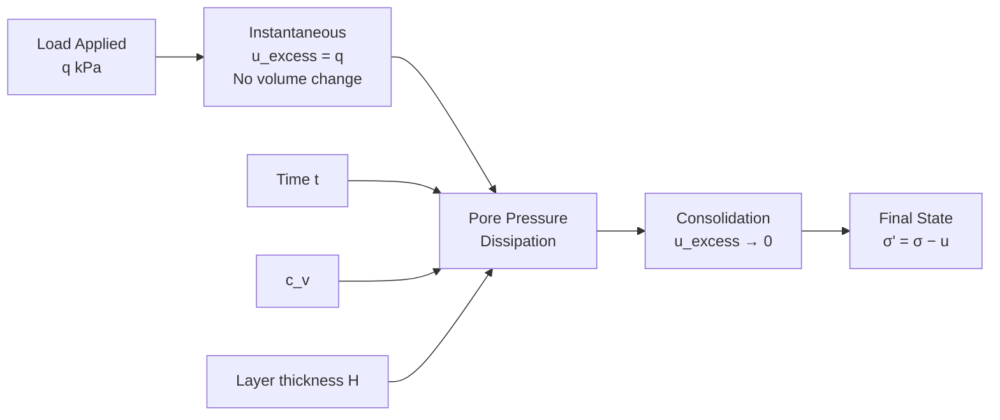

# 1.037 Soil Mechanics and Geotechnical Design

**MIT CEE Mechanics & Materials Track | 12 Units | Core**
**Prereq:** 1.050
**Instructor:** Prof. Oral Buyukozturk; Prof. Andrew Whittle
**自學路徑：Bachelor → MEng SMD → Geotechnical Engineering**

> **Source:** MIT Catalog (2024-25) — "Provides an introduction to soils as engineering materials, including classification and characterization, pore pressures and seepage, principles of effective stress and consolidation, deformation, and shear strength properties. Surveys analysis methods, with a focus on slope stability, limiting earth pressures and bearing capacity, and settlements of foundations."
> **Textbooks:** Terzaghi, Peck & Mesri, *Soil Mechanics*; Holtz et al., *Introduction to Geotechnical Engineering*

---

## 問題 1：這個領域所有專家共享的 5 個核心心智模型是什麼？

1. **有效應力原理是土力學的基石**
   σ' = σ − u, where σ' is effective stress, σ is total stress, u is pore water pressure. All soil strength and deformation depends on effective stress, not total stress.

2. **土是三相材料**
   Soil = solids + water + air. The phase relationships (void ratio e, degree of saturation S, water content w) define the state. Phase transformation (e.g., sand liquefaction) occurs when air escapes or water pressure rises.

3. **剪切強度來自摩擦和凝聚力**
   τ_f = c' + σ' tan φ' (Mohr-Coulomb for effective stress). The friction angle φ' reflects inter-particle sliding; cohesion c' comes from cementation, bonding, or matric suction.

4. **固結是超孔隙水壓力消散的時間過程**
   Consolidation = time-dependent volume change due to pore water expulsion under load. The Terzaghi consolidation equation ∂²u/∂z² = c_v ∂u/∂t governs dissipation.

5. **邊坡穩定是安全係數與失效模式的結合**
   Factor of safety F_s = resisting moments/Driving moments. But the critical failure mechanism (circular, non-circular, translational) must be correctly identified.

---

## 問題 2：3 個根本分歧

### 分歧 1: 總應力 vs 有效應力設計
- **總應力派**: For short-term analysis (undrained), total stress parameters c_u, φ_u = 0 are simpler and conservative.
- **有效應力派**: Only effective stress parameters (c', φ') represent the true physics of soil behavior. Total stress is an approximation.

### 分歧 2: 極限平衡 vs 極限分析
- **極限平衡派** (Limit equilibrium — Bishop, Janbu, Spencer): Calculate factor of safety directly from equilibrium. Simple, widely used, but ignores stress-strain compatibility.
- **極限分析派** (Limit analysis — Drucker-Prager, upper/lower bounds): Rigorous bounds on collapse load. Mathematically sound, but more complex.

### 分歧 3: 室內試驗 vs 原位試驗
- **室內派**: Triaxial, oedometer give precise, controlled conditions. Can measure c', φ', c_u, E, c_v.
- **原位派** (SPT, CPT, vane shear): Representative of in-situ stress conditions. Less sample disturbance. Better for layered, heterogeneous soils.

---

## 問題 3：10 個深度問題

1. 從有效應力原理 σ' = σ − u 推導：在地下水位以下 5 m 的細砂中（γ_sat = 19 kN/m³），計算總應力 σ 和有效應力 σ'。若地下水位上升到地面，σ' 如何變化？
2. 在標準貫入試驗（SPT）中，N 值（N_60）如何與砂土的相對密度 D_R 和剪切波速 V_s 建立經驗關係？為什麼 N 值不能直接用於黏土？
3. 莫爾-庫倫破壞準則 τ_f = c' + σ' tan φ' 的物理意義：為什麼 φ' 是峰值內摩擦角而非殘餘值？在超固結黏土中，峰值與殘餘 φ' 有何差異？
4. 說明固結方程 ∂²u/∂z² = c_v ∂u/∂t 的推導（從水流連續性 + Darcy 定律 + 體積變化）：c_v = k/(m_v γ_w) 的物理意義是什麼？
5. 固結時間因數 T_v = c_v t/H²² 和固結度 U 的關係：當 U = 90% 時，T_v = 0.848。若土層厚 H = 3 m，c_v = 5×10⁻⁸ m²/s，計算固結達 90% 所需的時間。
6. 在無限斜坡穩定分析中，安全係數 F_s = tan φ'/tan β（其中 β 是坡角）。當 β = φ' 時，F_s = 1（臨界狀態）。說明為什麼這個簡單公式忽略了一切？
7. Terzaghi 承載力公式 q_u = c'N_c + q'N_q + ½γBN_γ 中，N_c, N_q, N_γ 這些承載力因數是如何從極限分析得出的？N_γ 對土壤摩擦角的敏感性如何？
8. 擋土牆的主動土壓力係數 K_a = tan²(45° − φ'/2) 和被動土壓力係數 K_p = tan²(45° + φ'/2) 是如何從 Rankine 土壓力理論推導的？為什麼 K_a 與牆的位移無關而與土壤的應變有關？
9. 說明砂土液化的孔隙水壓累積模型（Seed et al.）：在循環剪切下，過剩孔隙水壓比 r_u = u_excess/σ'_v0 如何隨循環次數 N 增加？在 r_u → 1 時，土壤表現為什麼狀態？
10. 在淺基礎設計中，沉降 s = s_i + s_c，其中 s_i 是瞬時沉降（彈性），s_c 是固結沉降。計算在均布荷載 q = 200 kPa 下，黏土層（E = 10 MPa，m_v = 1/E）厚 3 m 的瞬時沉降。

---

# 核心心智模型深化

## 1. 有效應力原理

### 1.1 Bilingual 概念對照
| English | 中英對照 | 定義 | 工程應用 |
|---|---|---|---|
| Effective stress | 有效應力 | σ' = σ − u | Controls soil strength and stiffness |
| Total stress | 總應力 | σ = γ·z (from overburden) | Calculated from unit weight |
| Pore pressure | 孔隙水壓 | u = γ_w·h_w | From water table |
| Buoyancy | 浮力 | γ' = γ_sat − γ_w | Submerged unit weight |

### 1.2 Key Derivation

**Effective stress principle** (Terzaghi, 1923):
σ' = σ − u

At depth z below ground surface:
- **Above water table**: σ = γ·z (total unit weight)
- **Below water table**: σ = γ·z_above + γ_sat·z_below, u = γ_w·z_below
- **Effective weight**: γ' = γ_sat − γ_w (submerged unit weight)

**Example**:
Ground surface → z = 0
Water table at z = 2 m
At z = 5 m:
σ_total = γ·2 + γ_sat·3 = 18×2 + 19×3 = 36 + 57 = **93 kPa**
u = γ_w·(5−2) = 10×3 = **30 kPa**
σ' = 93 − 30 = **63 kPa**

### 1.3 Engineering Applications
- **Seepage forces**: When water flows through soil, seepage force j = i·γ_w acts in direction of flow. Critical hydraulic gradient i_cr = (G_s − 1)/(1 + e) ≈ 1 for most sands → quicksand condition (liquefaction).
- **Effective stress in slope stability**: During heavy rainfall, infiltration increases pore pressure u, decreasing σ' and reducing soil strength.

---

## 2. 土的剪切強度

### 2.1 Key Derivation — Mohr-Coulomb

**Mohr-Coulomb failure criterion**:
τ_f = c' + σ' tan φ'

In terms of principal stresses:
σ'_1 = σ'_3·tan²(45° + φ'/2) + 2c'·tan(45° + φ'/2)

**Total stress vs effective stress parameters**:
| Test | Parameter | Use |
|---|---|---|
| UU (Unconsolidated Undrained) | c_u, φ_u = 0 | Short-term, clay |
| CU (Consolidated Undrained) | c_cu, φ_cu | Intermediate |
| CD (Consolidated Drained) | c', φ' | Long-term, all soils |

### 2.2 Example — Direct Shear Test
Sand: γ = 18 kN/m³, φ' = 35°, c' = 0
At depth z = 3 m, σ' = γ·z = 54 kPa
τ_f = 0 + 54·tan(35°) = 54×0.700 = **37.8 kPa**

### 2.3 Engineering Applications
- **Shallow foundation**: Bearing capacity q_u = c'N_c + q'N_q + ½γBN_γ
- **Deep foundation**: Skin friction q_s = Kσ'_v tan δ
- **Slope stability**: F_s = Σ(c'L + (W cos α − uL)tan φ') / Σ(W sin α)

---

## 3. 固結理論

### 3.1 Key Derivation — Terzaghi Consolidation

**One-dimensional consolidation equation**:
∂²u/∂z² = c_v ∂u/∂t

Where c_v = k/(m_v γ_w):
- k = hydraulic conductivity (m/s)
- m_v = 1/E_s = coefficient of compressibility (1/kPa)
- γ_w = unit weight of water = 9.81 kN/m³

**Time factor**: T_v = c_v t/H²
**Degree of consolidation**: U = 1 − Σ(2M²·e^{−M²T_v}/π³) where M = π(2n+1)/2

**Practical U-T_v relation**:
| U (%) | T_v |
|---|---|
| 50 | 0.197 |
| 90 | 0.848 |
| 95 | 1.129 |

### 3.2 Example
Clay layer: H = 3 m (drainage both sides → H_drain = 1.5 m), c_v = 5×10⁻⁸ m²/s
For U = 90%: T_v = 0.848
t_90 = T_v·H_drain²/c_v = 0.848×(1.5)²/(5×10⁻⁸) = 0.848×2.25/(5×10⁻⁸) = 1.91/5×10⁻⁸ = **3.8×10⁷ s = 440 days ≈ 1.2 years**

---

## 4. 擋土結構土壓力

### 4.1 Rankine Earth Pressure
**Active earth pressure** (wall moves away from soil):
K_a = tan²(45° − φ'/2)
σ'_h = K_a σ'_v − 2c'√K_a

**Passive earth pressure** (wall moves toward soil):
K_p = tan²(45° + φ'/2)
σ'_h = K_p σ'_v + 2c'√K_p

### 4.2 Example — Cantilever retaining wall
Backfill: γ = 18 kN/m³, φ' = 30°, c' = 0, q = 20 kPa
K_a = tan²(45°−15°) = tan²(30°) = (1/√3)² = 0.333
At z = 4 m: σ'_h = K_a(γz + q) = 0.333×(18×4+20) = 0.333×92 = **30.7 kPa**
Total thrust on wall: P_a = ½K_a γ H² + K_a qH = ½×0.333×18×16 + 0.333×20×4 = 47.9 + 26.7 = **74.6 kN/m**

---

## 5. 邊坡穩定

### 5.1 Ordinary Method of Slices (Fellenius)
F_s = Σ(c'L + (W cos α)tan φ') / Σ(W sin α)

Where:
- W = weight of slice
- α = angle of slice base to horizontal
- L = slice base length

### 5.2 Example — Infinite slope
γ = 18 kN/m³, φ' = 30°, c' = 10 kPa, β = 20°, z = 5 m, u = 0
F_s = (c' + γz cos²β tan φ') / (γz sinβ cosβ) = (10 + 18×5×cos²20°×tan30°)/(18×5×sin20°×cos20°)
= (10 + 90×0.94×0.577)/(90×0.342×0.940) = (10+48.7)/(28.9) = **2.03 > 1.5 → Stable**

---

# 深度自測問題詳解

## 詳解 1: 有效應力計算
**Answer:**
At z = 5 m below surface, water table at z = 0:
σ = γ_sat × 5 = 19×5 = **95 kPa**
u = γ_w × 5 = 10×5 = **50 kPa**
σ' = 95 − 50 = **45 kPa**

If water table rises to surface:
σ = γ_sat × 5 = 95 kPa (unchanged — soil weight same)
u = γ_w × 5 = 50 kPa → σ' = 95 − 50 = **45 kPa** (unchanged!)
This is because γ_sat = γ_w + G_s·e/(1+e) and when fully saturated, the buoyant weight = γ' = γ_sat − γ_w.

---

## 詳解 5: 固結時間計算
**Answer:**
T_v for U = 90% = 0.848
H_drain = H/2 = 1.5 m (drainage both sides)
t = T_v × H_drain² / c_v = 0.848 × (1.5)² / (5×10⁻⁸)
= 0.848 × 2.25 / (5×10⁻⁸) = 1.91 / (5×10⁻⁸) = 3.82×10⁷ s
= 3.82×10⁷ / (3600×24×365) = **1.21 years**

---

## 📊 Diagram 1: 土力學理論框架

## 📊 Diagram 2: 固結過程

---

## 總結

1. **有效應力原理是土力學的核心**：σ' = σ − u 連接了水土兩相，是解釋所有土力學現象的基礎
2. **Mohr-Coulomb 剪切強度準則是岩土工程師的主要工具**：c', φ' 是有效應力參數，用於長期穩定分析；c_u, φ_u = 0 是總應力參數，用於短期不排水分析
3. **固結理論預測時間相關沉降**：Terzaghi 一維固結方程連接了土壤的渗透係數、壓縮性與時間
4. **邊坡穩定和基礎承載力是土力學的兩大應用**：兩者都基於剪切強度理論，但邊坡穩定需要考慮幾何和水位
5. **土工試驗是連接理論與實踐的橋樑**：SPT、CPT、三軸試驗提供了設計參數，但試驗結果的解釋需要工程判斷

**Prerequisite chain**: 1.050 Solid Mechanics → 1.037 Soil Mechanics → 1.013 Senior Capstone → MEng Geotechnical Engineering
