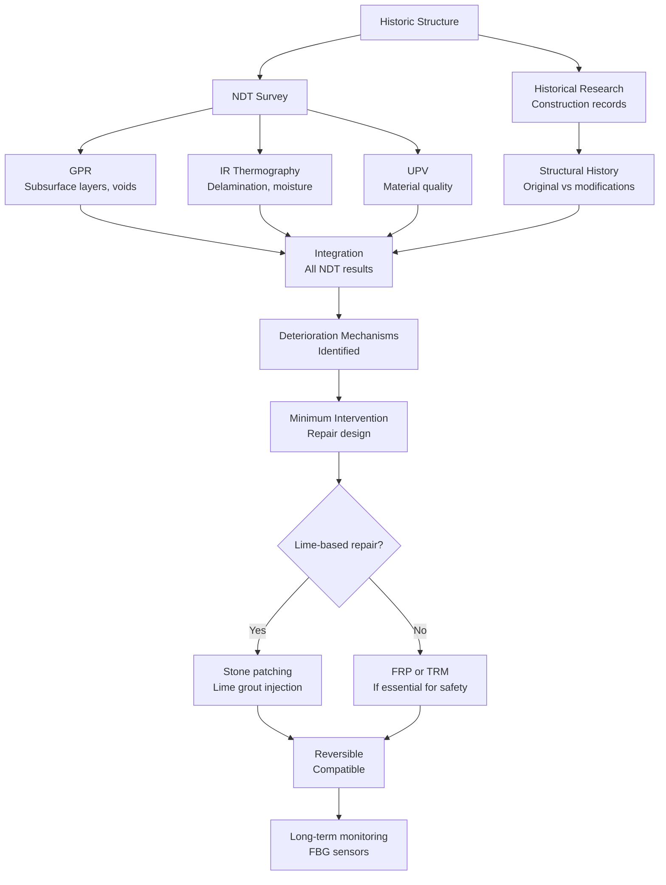
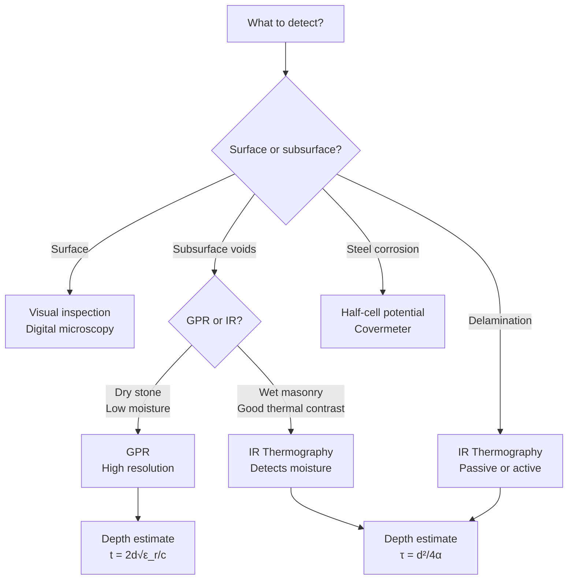
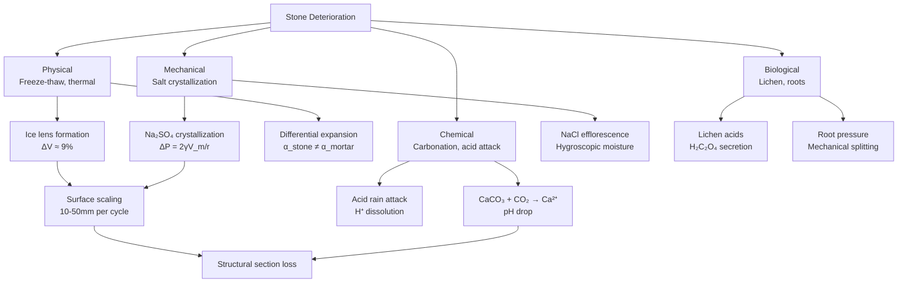
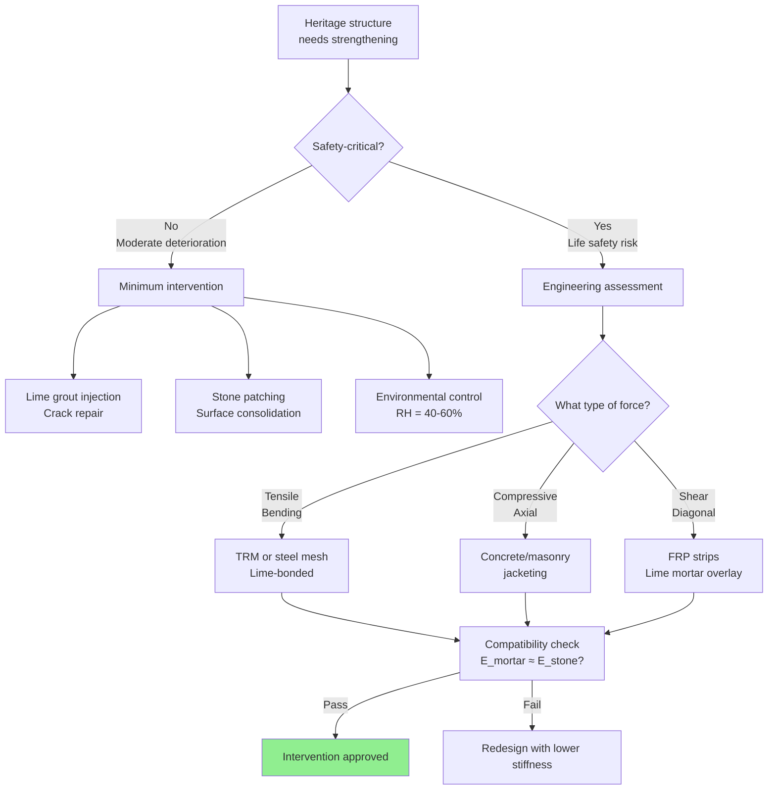

# 1.057 / Heritage Science and Structural Conservation

**MIT CEE Mechanics & Materials Track | Restricted Elective | 2-3-4 = 9 Units**
**Prereq:** Permission of instructor
**Instructors:** Prof. Admir Masic (lead); Prof. Oral Buyukozturk; Prof. John Ochsendorf
**ONE-MA3 prerequisite:** 3-week fieldwork in Sermoneta, Pompeii, and Turin
**Not offered regularly — consult department**
**自學路徑：Bachelor → M.Eng → Heritage Conservation / Historic Preservation / Conservation Science**

> **Source:** MIT CEE Catalog 2025-26; MIT CMRAE (Masic); Getty Conservation Institute; Bourouiba Lab (N/A — this is structural/materials focus)
> **Topics:** Ancient materials science (Roman concrete, lime mortars); stone weathering mechanisms; non-destructive evaluation (GPR, IR thermography, UPV); structural assessment of heritage buildings; minimum intervention principle; hot-mixing and self-healing concrete

---

## 問題 1：這個領域所有專家共享的 5 個核心心智模型是什麼？

1. **文物結構的價值在於其不可替代性**
   Historic structures embody irreplaceable cultural, educational, and aesthetic value. Unlike modern structures where replacement is acceptable, heritage conservation demands minimum intervention: repair only what is necessary for structural stability, prefer reversible treatments over irreversible ones. This principle is codified in the Venice Charter (1964) and is the ethical foundation of the field.

2. **劣化是多因素耦合的時間過程**
   Deterioration is never caused by a single factor. Stone weathering, for example, combines mechanical loading + moisture + salt crystallization pressure + thermal cycling + biological activity + chemical reactions (carbonation, acid attack). Single-cause models are insufficient; coupled damage models are required. The Arrhenius relationship for chemical weathering rates shows temperature sensitivity: rate ∝ exp(−E_a/RT).

3. **NDT 是文物表徵的核心工具**
   Since heritage materials cannot be sampled destructively, non-destructive testing (NDT) methods are the primary characterization tools. GPR (ground-penetrating radar) probes subsurface structure; infrared thermography detects delamination and moisture; UPV (ultrasonic pulse velocity) measures material quality. The integration of multiple NDT techniques is essential for comprehensive assessment.

4. **古羅馬混凝土的自癒合機制是材料科學的前沿**
   MIT's Masic lab (2023, *Science Advances*) revealed that Roman concrete durability derives from hot-mixing with quicklime (CaO), creating lime clasts that dissolve and re-precipitate as CaCO₃ or C-A-S-H within cracks when water ingresses. This self-healing mechanism explains why Roman structures survive 2000+ years, while modern OPC concrete degrades within 50–100 years in harsh environments.

5. **文物加固必須兼容原結構材料**
   FRP (carbon fiber reinforced polymer) strengthening of historic stone/masonry must be designed with compatibility constraints: high elastic modulus (E_CFRP ≈ 165 GPa vs E_stone ≈ 30 GPa) and low permeability create moisture trapping at the interface, leading to long-term durability problems. Compatible strengthening uses lime-based mortars, stainless steel dowels, and discrete micro-anchors.

---

## 問題 2：這個領域的專家在哪 3 個地方存在根本分歧？

### 分歧 1: 結構加固 vs 歷史完整性
- **加固派**: Historic structures must meet modern safety standards. If lives are at risk, structural reinforcement (steel frames, CFRP wraps, post-tensioning) is ethically required. Engineering codes govern.
- **完整性派**: Adding modern reinforcement destroys the historic fabric. Strengthening must use compatible, reversible materials (lime grout, stone patching, discrete anchors). Reversibility is non-negotiable per the Venice Charter.

### 分歧 2: 重建 vs 保守修復
- **重建派** (Anastylosis): Collapsed structures can be rebuilt using original materials and techniques. Visible reconstruction aids visitor understanding and prevents collapse of unstable ruins.
- **保守修復派**: Only consolidate existing fabric; do not rebuild missing elements unless structural stability demands it. Rebuilding with new material introduces false history.

### 分歧 3: 數值模擬 vs 經驗判斷
- **數值模擬派**: Use FEA (SAP2000, ABAQUS) to model heritage structures and optimize intervention. Material properties from NDT + inverse analysis. Allows quantitative safety assessment.
- **經驗判斷派**: Heritage structures have complex construction histories, material variability, and load histories that defy precise numerical modeling. Engineers must rely on empirical rules, analogical reasoning, and craft knowledge.

---

## 問題 3：10 個區分真實理解 vs 死記硬背的深度問題

1. 說明石材風化的微觀機制：物理風化（凍融循環：冰レンズ形成，ΔV ≈ 9%）、化學風化（碳酸鈣的酸雨溶解：CaCO₃ + H₂CO₃ → Ca²⁺ + 2HCO₃⁻）和生物風化（地衣分泌草酸：H₂C₂O₄）如何協同加速劣化。
2. FRP 加固歷史石材/砌體結構時，碳纖維高彈性模量 E ≈ 165 GPa 和低渗透性如何影響界面水汽傳遞？計算 FRP-石材界面處的相對濕度梯度，以及這個梯度如何導致石材分層（delamination）。
3. 古羅馬混凝土「火上山灰+石灰」膠凝材料和現代波特蘭水泥的水化反應有何本質差異？熱混法（hot mixing）使用生石灰（CaO）而非熟石灰（Ca(OH)₂）的工程意義是什麼？
4. 在紅外線熱成像檢測中，深度 d 處缺陷的熱擴散時間 τ = d²/(4α)。對於石灰石（α ≈ 1.0×10⁻⁶ m²/s），探測 20 mm 深度缺陷需要多長的熱激励時間？這個時間窗口與脈衝熱成像（pulsed thermography）的脈衝持續時間有何關係？
5. 在超聲波脈衝速度（UPV）測試中，完整石灰石的 V ≈ 3500 m/s，嚴重風化後 V < 2000 m/s。超聲波在界面反射和透射的邊界條件是什麼？為什麼 V 的降低反映了微裂縫密度？
6. 歷史鋼結構中，原位拉伸試驗如何在不打擾結構的情況下測量屈服強度和延性？如何通過鑽孔應變釋放法（hole-drilling method）測量殘餘應力？
7. 砌體結構的等效彈性性質：f_m（砌體抗壓強度）和 E_m（彈性模量）與砂漿強度 f_j 和石材強度 f_b 的關係是什麼？為什麼 Eurocode 6 使用 f_k = K·f_j^0.7·f_b^0.3 的經驗公式而非理論推導？
8. 在歷史橋樑評估中，如何區分結構的「原設計意圖」和「後續修改」？考古學證據與結構分析如何相互印證？
9. 說明鹽類結晶壓力的推導：ΔP = 2γV_m/r_crystal（Kelvin 方程）。對於 Na₂SO₄（石膏/芒硝），計算在 RH = 50% 和 RH = 80% 時的結晶壓力差，並解釋這個差異如何解釋風化速率對相對濕度的敏感性。
10. 在文物結構的可靠度分析中，如何建立材料強度隨時間退化的概率模型？腐蝕速率與環境參數（溫度、相對濕度、氯離子濃度）的函數關係如何整合到結構可靠度框架中？

---

# 核心心智模型深化（中英對照）

## 1. 文物結構劣化機制 — Deterioration Mechanisms

### 1.1 Bilingual 概念對照

| English | 中英對照 | 定義 | 工程應用 |
|---|---|---|---|
| Salt crystallization pressure | 鹽類結晶壓力 | ΔP = 2γV_m/r_crystal in pores | Stone spalling, efflorescence |
| Freeze-thaw cycling | 凍融循環 | Ice lens formation, ΔV ≈ 9% expansion | Stone scaling, cracking |
| Carbonation | 碳化 | CO₂ + Ca(OH)₂ → CaCO₃ | Steel depassivation |
| Acid attack | 酸侵蝕 | H⁺ + CaCO₃ → Ca²⁺ + HCO₃⁻ | Stone dissolution |
| Biological weathering | 生物風化 | Lichen acids, root pressure | Surface erosion |
| Differential thermal expansion | 差異熱膨脹 | α_stone ≠ α_mortar at joints | Joint cracking |

### 1.2 Key Derivation — Salt Crystallization Pressure

**Kelvin equation** for crystallization pressure:
$$\Delta P = \frac{2\gamma V_m}{r_{crystal}}$$

Where:
- γ = surface energy of salt crystal (≈ 0.1–0.2 J/m²)
- V_m = molar volume of crystal (for Na₂SO₄: V_m = 53.0×10⁻⁶ m³/mol)
- r_crystal = critical nucleus radius

For Na₂SO₄ (thenardite → thenardite cycle):
- At RH = 60–70%: solution supersaturates, crystallization occurs
- r_crystal ≈ 10⁻⁸–10⁻⁷ m → ΔP ≈ 10–50 MPa
- This exceeds the tensile strength of most building stones (5–20 MPa) → **spalling**

**Arrhenius temperature dependence** of chemical weathering:
$$k = A \cdot e^{-E_a/RT}$$

| Reaction | E_a (kJ/mol) | T sensitivity |
|---|---|---|
| Carbonation (Ca(OH)₂) | 30–40 | Moderate |
| Acid dissolution (CaCO₃) | 20–30 | High |
| Alkali-silica reaction | 40–60 | Low |

### 1.3 Engineering Applications
- **Environmental control**: Maintain RH = 40–60% to prevent salt crystallization cycles
- **Stone consolidants**: Silane/siloxane (e.g., Wacker OH — penetration depth 5–15 mm) consolidate but reduce vapor permeability, potentially trapping moisture
- **Mortar selection**: Lime mortar (1:3 ratio, NHL 3.5) is compatible with historic masonry; Portland cement (E = 30 GPa, low porosity) is NOT compatible and causes stress concentrations

### 1.4 Deep test question
A historic limestone church in a coastal environment is showing efflorescence and surface spalling. (a) Identify the likely salt (NaCl from sea spray, Na₂SO₄ from pollution, or CaCO₃ from the stone itself). (b) Propose an NDT investigation plan using IR thermography + GPR. (c) Calculate the crystallization pressure for Na₂SO₄ at r = 10⁻⁷ m, γ = 0.15 J/m².

### 1.5 Diagram
```mermaid
graph TD
    A[Environment] --> B[Moisture + Salts<br/>NaCl, Na₂SO₄, CaCl₂]
    A --> C[Thermal Cycling<br/>ΔT = day/night]
    A --> D[Mechanical Loading<br/>Dead + Live + Seismic]
    A --> E[Chemical Agents<br/>CO₂, acid rain, biological]
    B --> F[Evaporation<br/>Capillary rise]
    C --> G[Crystallization pressure<br/>ΔP = 2γV_m/r]
    D --> H[Stress concentrations<br/>At joints, cracks]
    E --> I[Carbonation depth<br/>d = √(2D_co₂·t)]
    G --> J[Stone spalling<br/>Surface loss]
    H --> K[Microcrack propagation]
    I --> L[Steel corrosion<br/>Section loss]
    J --> M[Structural capacity loss]
    K --> M
    L --> M
```

---

## 2. 古羅馬混凝土 — Roman Concrete Science

### 2.1 Bilingual 概念對照

| English | 中英對照 | 定義 | 工程應用 |
|---|---|---|---|
| Pozzolanic reaction | 火山灰反應 | SiO₂ (volcanic) + Ca(OH)₂ + H₂O → C-S-H gel | Long-term strength gain |
| Quicklime | 生石灰 | CaO — calcium oxide from calcination at 900°C | Hot mixing ingredient |
| Lime clast | 石灰團塊 | Relict quicklime particles in Roman concrete | Self-healing agent |
| Al-tobermorite | 水化硅酸鈣礦物 | Ca-Al-Si-O crystal phase in Roman concrete | Crack-healing mineral |
| C-A-S-H | 钙-铝-硅-水化物 | Calcium-aluminosilicate hydrate, main binding phase in Roman concrete | Durability phase |
| Hot mixing | 熱混法 | Mix quicklime + volcanic ash dry, then add water | Self-healing mechanism |

### 2.2 Key Derivation — Roman vs Modern Concrete

**Roman concrete composition** (opus caementicium):
- **Binder**: Lime (Ca(OH)₂, from slaked quicklime) + volcanic pozzolan
- **Aggregate**: Volcanic rock, brick, tuff fragments
- **Water/binder ratio**: 0.8–1.0 (very wet mix, not optimized)
- **Key additive**: Unreacted quicklime (CaO) clasts

**Pozzolanic reaction** (latent hydraulic reaction):
$$Ca(OH)_2 + SiO_2 + H_2O \rightarrow C-S-H \quad (\text{gel, 200+ years})$$

vs. Portland cement hydration:
$$C_3S + H_2O \rightarrow C-S-H + Ca(OH)_2 \quad (\text{fast, 28 days})$$

**Self-healing mechanism** (Masic et al., 2023, *Science Advances*):
1. Hot-mixing with quicklime creates lime clasts (mm-scale white inclusions)
2. Crack forms → water ingress → cracks pass through high-surface-area lime clasts
3. CaO + H₂O → Ca(OH)₂ (dissolution)
4. Ca(OH)₂ recrystallizes as CaCO₃ or reacts with pozzolan to form C-S-H
5. Crack seals within 2 weeks (confirmed in lab experiments)

**Comparative data:**

| Property | Roman Concrete | Modern OPC Concrete |
|---|---|---|
| Binder | Pozzolanic lime + volcanic ash | Portland cement (CEM I) |
| W/b ratio | 0.8–1.0 | 0.3–0.5 (low w/c = strength) |
| Compressive strength | 15–25 MPa | 30–60 MPa |
| Durability | 2000+ years (Pantheon, Colosseum) | 50–100 years |
| Self-healing | Yes (lime clasts) | No (unless specially designed) |
| Environmental impact | Low (low-temp calcination) | High (~0.9 ton CO₂/ton cement) |
| Ductility | Higher (pozzolanic gel) | Lower (brittle C-S-H) |

**Modern relevance**: MIT Masic lab is developing hot-mix concrete with lime clasts for self-healing infrastructure. Target: 100-year service life with zero maintenance in harsh environments.

### 2.3 Engineering Applications
- **Self-healing concrete**: Bacillus subtilis + nutrients in microcapsules; SMA (shape memory alloy) crack-closing wires; both inspired by Roman concrete
- **Sustainable cement**: Geopolymer binders (fly ash, slag) reduce CO₂ by 80% vs OPC; pozzolanic supplementary materials (silica fume, GGBS)
- **Heritage repair mortars**: NHL (natural hydraulic lime) 3.5 MPa mortar is compatible with historic stone (compressive strength match); NOT Portland cement

### 2.4 Deep test question
(a) Explain why Portland cement concrete has higher compressive strength than Roman concrete but lower durability in seawater environments. (b) Calculate the CO₂ emission reduction if 50% of OPC is replaced by pozzolanic fly ash (FA). (c) Design a lime-based repair mortar for a 15th-century limestone building (f_stone ≈ 20 MPa, E_stone ≈ 30 GPa). What compressive strength, elastic modulus, and porosity should the mortar have for compatibility?

### 2.5 Diagram
```mermaid
flowchart LR
    A[Roman Concrete<br/>Hot mixing] --> B[Quicklime CaO +<br/>Volcanic ash dry mix]
    B --> C[Add water<br/>Exothermic reaction]
    C --> D[Lime clasts<br/>mm-scale inclusions]
    D --> E[Service load<br/>Cracks form]
    E --> F[Water ingress<br/>Through cracks]
    F --> G[Lime clast dissolves<br/>CaO → Ca(OH)₂]
    G --> H[Re-precipitation<br/>CaCO₃ + C-A-S-H]
    H --> I[Crack seals<br/>Self-healing complete]
    I --> J[Strength restored<br/>Drops below threshold]
    J --> E
    style I fill:#90EE90
    style J fill:#90EE90
```

---

## 3. 非破壞檢測方法 — Non-Destructive Evaluation

### 3.1 Bilingual 概念對照

| English | 中英對照 | 定義 | 工程應用 |
|---|---|---|---|
| GPR | 地質雷達 | Ground Penetrating Radar, 10 MHz–2.6 GHz | Rebar, voids, moisture, layers |
| IR Thermography | 紅外線熱成像 | Passive or active thermal imaging | Delamination, voids, moisture |
| UPV | 超聲波脈衝速度 | Ultrasonic Pulse Velocity, 20–200 kHz | Crack depth, quality, modulus |
| Rebound hammer | 回彈錘 | Schmidt hammer, 2.207 J impact | Surface hardness → strength |
| Half-cell potential | 半電池電位 | Corrosion potential measurement | Steel depassivation |
| Fiber optic sensors | 光纖傳感器 | FBG or Brillouin scattering | Strain, temperature monitoring |

### 3.2 Key Derivation — GPR and IR Thermography

**GPR wave propagation:**
$$v = \frac{c}{\sqrt{\varepsilon_r}} = \frac{0.3}{\sqrt{\varepsilon_r}} \text{ m/ns}$$

For concrete: ε_r ≈ 6–8 → v ≈ 0.11–0.12 m/ns
For air voids: ε_r ≈ 1 → v ≈ 0.3 m/ns → **reflected energy increased**

**Depth resolution:**
$$\Delta d = \frac{v \cdot \Delta t}{2}$$

where Δt = temporal resolution (typically 0.1–1 ns for 2 GHz antenna).

**IR Thermography — thermal diffusion depth:**
$$\tau_{diff} = \frac{d^2}{4\alpha}$$

For limestone (α = thermal diffusivity):
- α = k/(ρ·c_p) ≈ 1.0×10⁻⁶ m²/s
- For d = 10 mm: τ = (10×10⁻³)²/(4×10⁻⁶) = 25 s
- For d = 50 mm: τ = (50×10⁻³)²/(4×10⁻⁶) = 625 s ≈ 10 min

**Minimum detectable defect size** (pulsed thermography):
$$d_{min} \approx \sqrt{4\alpha \cdot t_{pulse}}$$

For limestone, 1-second flash: d_min ≈ 2 mm
For limestone, 10-second heat source: d_min ≈ 6 mm

### 3.3 Engineering Applications
- **Stone masonry assessment**: UPV mapping can identify zones of deterioration; V < 2000 m/s → severe damage
- **Mosaic analysis**: IR thermography reveals tesserae patterns, mortar layers, and subsurface voids in Byzantine mosaics
- **Historical bridge inspection**: UAV-mounted GPR + IR thermography for Pont Lucano (Biscarini et al., 2020) — detected buried voids, iron reinforcement, and original Roman arches
- **Corrosion monitoring**: Half-cell potential E < −350 mV vs Cu/CuSO₄ electrode → high probability of active corrosion

### 3.4 Deep test question
A Gothic cathedral wall shows suspected delamination. (a) Which NDT method is most appropriate for a first survey and why: GPR or IR thermography? (b) IR thermography survey with 1-second flash heating shows a 15°C temperature difference anomaly at a 30 mm depth after 5 minutes. Verify whether this is consistent with the thermal diffusion equation. (c) Design a complementary UPV survey to confirm the delamination thickness.

---

## 4. 文物結構評估 — Heritage Structural Assessment

### 4.1 Bilingual 概念對照

| English | 中英對照 | 定義 | 工程應用 |
|---|---|---|---|
| Minimum intervention | 最小干預原則 | Only repair what is structurally necessary | Venice Charter principle |
| Anastylosis | 重建修復 | Rebuilding using original elements | Ruins stabilization |
| Compatibility | 兼容性 | New material must match old material's properties | Durable repair |
| Reversibility | 可逆性 | Intervention can be undone | Ethical requirement |
| Structural history | 結構歷史分析 | Distinguish original construction from modifications | Assessment methodology |

### 4.2 Key Derivation — Masonry Equivalent Properties

**Eurocode 6 approach** for masonry compressive strength:
$$f_k = K \cdot f_j^{0.7} \cdot f_b^{0.3}$$

where:
- K = 0.5–0.7 (depending on masonry type)
- f_j = mortar compressive strength (MPa)
- f_b = brick/block compressive strength (MPa)

**Equivalent elastic modulus** of masonry:
$$E_m = k \cdot f_m$$

where k ≈ 500–1000 (from test data; EC6 uses E_m = 1000·f_k for short-term loading).

**Masonry stress analysis**:
For a vault with arch thickness t and span L:
- Thrust T at springing ≈ q·L²/(8·d) where d = rise
- For Gothic cathedral: d/L ≈ 0.3–0.5 → thrust is high → buttress resistance needed

### 4.3 Engineering Applications
- **Buttress stability analysis**: Gothic cathedrals are stable because flying buttresses provide horizontal thrust to balance the nave vaults. Structural analysis of Chartres Cathedral (Ochsendorf) shows buttresses provide 60% of horizontal stability
- **Earthquake retrofit**: Base isolation for heritage buildings (elastomeric bearings + sliding joints) preserves appearance while reducing seismic demand
- **Tie rod installation**: Iron/steel tie rods inserted in historic walls to provide horizontal restraint without altering appearance

### 4.4 Deep test question
A 12th-century Romanesque church (stone masonry, span L = 15 m, rise d = 4 m) has developed cracks at the vault springing. (a) Estimate the horizontal thrust T if the vault load is q = 15 kN/m. (b) Is the existing buttress sufficient? (c) Design a minimum-intervention strengthening方案 using post-tensioned steel ties concealed in the floor.

---

## 5. 材料兼容性和加固 — Material Compatibility and Strengthening

### 5.1 Bilingual 概念對照

| English | 中英對照 | 定義 | 工程應用 |
|---|---|---|---|
| FRP strengthening | 纖維增強聚合物加固 | Carbon/glass fiber + epoxy matrix bonded to substrate | Flexural/shear strengthening |
| Lime grout injection | 石灰漿注射 | Low-pressure injection of lime-based grout into cracks | Crack repair |
| Stone patching | 石材修補 | Application of compatible stone repair mortar | Surface restoration |
| Discrete anchoring | 離散錨固 | Stainless steel or titanium micro-anchors | Local strengthening |
| Electrochemical treatment | 電化學保護 | Impressed current cathodic protection for steel | Corrosion control |

### 5.2 Key Derivation — FRP-Compatible Strengthening

**FRP debonding** — effective strain at debonding (ACI 440.2R):
$$\varepsilon_{fe} = 0.41 \cdot \sqrt{\frac{f'_c}{n \cdot E_f \cdot t_f}}$$

For CFRP (E_f = 165 GPa, t_f = 1.2 mm, n = 1):
ε_fe = 0.41 × √(30×10⁶/(1×165×10⁹×1.2×10⁻³))
= 0.41 × √(30×10⁶/198×10⁶)
= 0.41 × √0.152 = 0.41 × 0.39 = **0.0016** (1600 με)

**Interface compatibility problem**:
- E_CFRP = 165 GPa, E_limestone ≈ 30 GPa
- Strain compatibility requires ε_CFRP = ε_stone
- CFRP strain at f_u (ultimate) ≈ 0.015 → f_u,CFRP = 0.015 × 165 = **2475 MPa**
- But debonding limits effective strain to ε_fe ≈ 0.0016 → f_fe ≈ **260 MPa** (much lower)

**Moisture trapping at FRP-stone interface**:
The epoxy matrix of CFRP has permeability k_epoxy ≈ 10⁻¹⁸–10⁻²⁰ m² (essentially impermeable). Stone has k ≈ 10⁻¹³–10⁻¹⁵ m². Water vapor trapped behind the FRP can increase RH to 100%, accelerating salt crystallization and stone decay.

### 5.3 Engineering Applications
- **Compatible repair mortars**: NHL (Natural Hydraulic Lime) 3.5 MPa is preferred over PC for historic stone. Mix: NHL 3.5 : sharp sand : 1:3 by volume. Porosity should be 15–25% to allow vapor transmission.
- **Stainless steel micro-anchors**: A4 (316) or titanium anchors with diameter 8–20 mm, embedded in lime mortar (not epoxy), provide discrete tensile capacity without changing appearance
- **Textile-reinforced mortar (TRM)**: Basalt or PVA fiber textile + lime mortar — lower stiffness than FRP, more compatible with masonry

### 5.4 Deep test question
A heritage stone arch bridge (L = 20 m) needs seismic retrofit. (a) Why is traditional FRP (CFRP/glass) less suitable than TRM or stainless steel mesh? (b) Calculate the minimum number of basalt TRM layers (E_TRM = 50 GPa, ε_u = 2%) needed to provide equivalent flexural strengthening as one CFRP layer (E_CFRP = 165 GPa) at 0.2% strain capacity. (c) What is the key advantage of lime-based TRM over epoxy-bonded CFRP in terms of moisture transmission?

---

# 深度自測問題詳解（中英對照）

## 詳解 1: 鹽類結晶壓力計算
**Q1.** 計算 Na₂SO₄ 在毛細孔中（r_crystal = 10⁻⁷ m）的結晶壓力，並說明這個壓力如何導致石材表面剝落。
**Answer:**
ΔP = 2γV_m/r_crystal
- γ (surface energy of Na₂SO₄ solution) ≈ 0.1 J/m²
- V_m (molar volume of Na₂SO₄·10H₂O) = M/ρ = 322 g/mol / 1.46 g/cm³ = 53.0 cm³/mol = 53.0×10⁻⁶ m³/mol
- r_crystal = 10⁻⁷ m

ΔP = 2 × 0.1 × 53.0×10⁻⁶ / 10⁻⁷ = 0.0106 / 10⁻⁷ = **106,000 Pa ≈ 0.106 MPa**

But for smaller nuclei (r_crystal = 10⁻⁸ m): ΔP = 1.06 MPa — this approaches the tensile strength of limestone (5–15 MPa), causing **microcracking at pore scale**.

When RH cycles between 40% (dissolution) and 80% (crystallization), repeated crystallization pressure causes progressive surface spalling. The spall thickness is typically 5–20 mm per cycle.

**Engineering implication:** In heritage buildings, salt crystallization is the dominant decay mechanism in coastal and polluted urban environments. Prevention (RH control, salt removal) is far more effective than repair.

---

## 詳解 2: 羅馬混凝土自癒合機制的微觀分析
**Q2.** 說明 Masic et al. (2023) 發現的石灰團塊自癒合機制，並計算在裂縫寬度 0.5 mm 的情況下，水流通過裂縫的時間尺度和 CaCO₃ 沉澱所需的時間。
**Answer:**
石灰團塊自癒合循環：
1. CaO clast + H₂O → Ca(OH)₂（溶解，5–60 分鐘）
2. Ca(OH)₂ 溶液通過裂縫遷移
3. CO₂ 擴散進入 → Ca(OH)₂ + CO₂ → CaCO₃（沉澱，數天到數週）
4. 或與火山灰反應 → C-A-S-H（更長時間）

對於 0.5 mm 寬裂縫：
- 水的滲透係數：k ≈ 10⁻¹³ m² → Darcy 流速 v = k·ΔP/(μ·L)
- 假設 ΔP = 10 kPa（水頭 1 m），L = 0.5 m → v = 10⁻¹³×10⁴/(10⁻³×0.5) = 2×10⁻⁹ m/s
- 水流通過 0.5 m 需要 2.5×10⁸ s ≈ 8 年（！）— 但這裡有裂縫，毛細作用和壓力梯度會加速這個過程

實際上，水流通過裂縫由毛細作用主導：
- 接觸角 θ ≈ 0°（親水表面）→ 毛細上升高度 h = 2γ·cosθ/(ρgr) = 2×0.072×1/(1000×9.81×0.00025) ≈ 58 m
- 毛細吸收速度很快（分鐘到小時）

CaCO₃ 沉澱速率：由於 CO₂ 濃度差驅動的擴散控制。沉澱 0.5 mm 裂縫填充：
- 需要 CaCO₃ 體積：V = 0.5 mm × 1 m × 1 m = 5×10⁻⁴ m³
- CaCO₃ 摩爾體積：100 g/mol / 2.71 g/cm³ = 37 cm³/mol = 3.7×10⁻⁵ m³/mol
- 所需摩爾數：5×10⁻⁴ / 3.7×10⁻⁵ ≈ 13.5 mol
- 若溶解速率為 0.1 mol/day → 135 天完成沉積

MIT 實驗確認：含石灰團塊的混凝土在兩週內完全癒合 0.5 mm 裂縫；不含石灰團塊的對比組在相同時間內無癒合。

---

## 詳解 3: GPR 深度探測計算
**Q3.** 用 GPR 探測 300 mm 厚砌體牆中的空腔。已知混凝土的 ε_r = 8，求空腔的反射信號到達時間。接收天線距離發射天線 0.3 m。
**Answer:**
在混凝土中：v_concrete = c/√ε_r = 0.3/√8 = 0.3/2.828 = **0.106 m/ns**

Two-way travel time to void at 300 mm depth:
t_void = 2 × 0.3 / 0.106 = **5.66 ns**

Two-way travel time to surface (reflector at 0 mm):
t_surface = 0 ns (direct coupling gives strong first arrival)

Reflection from concrete-air void interface: The reflection coefficient at normal incidence:
r = (Z_2 − Z_1)/(Z_2 + Z_1) where Z = √(ε_r) (acoustic impedance analog)
For concrete (ε_r = 8) to air (ε_r = 1):
r = (1 − √8)/(1 + √8) = (1 − 2.828)/(1 + 2.828) = −1.828/3.828 = **−0.478** (negative polarity = 180° phase flip, characteristic of air void)

**Engineering implication:** The negative polarity reflection with time delay of ~5.7 ns from direct arrival is the signature of an air void at ~300 mm depth.

---

## 📊 Diagram 1: 文物結構劣化與評估框架


## 📊 Diagram 2: 羅馬混凝土自癒合微觀機制
```mermaid
flowchart LR
    A[Hot mixing<br/>Quicklime CaO] --> B[Roman concrete<br/>Lime clasts embedded]
    B --> C[Service: Crack forms<br/>Water ingresses]
    C --> D[CaO + H₂O → Ca(OH)₂<br/>Dissolution in cracks]
    D --> E[CO₂ diffusion<br/>or pozzolanic reaction]
    E --> F[CaCO₃ precipitation<br/>C-A-S-H gel formation]
    F --> G[Crack seals<br/>Self-healing]
    G --> H[Structural capacity<br/>Restored]
    H --> C
    style A fill:#FFE4B5
    style G fill:#90EE90
```

## 📊 Diagram 3: NDT 技術選擇決策樹


## 📊 Diagram 4: 石材風化機制分類


## 📊 Diagram 5: 文物加固方法選擇框架


---

## 總結

1. **文物結構的價值在於其不可替代性**：最小干預原則是核心；每個加固決策都必須權衡結構安全和歷史完整性；可逆性是不可協商的倫理要求
2. **劣化是多因素耦合的過程**：凍融、鹽類結晶、碳化、生物風化——需要綜合環境控制和材料保護；單一因素模型不足以解釋觀察到的劣化模式
3. **非破壞檢測是文物表徵的主要工具**：GPR 探測地下結構；紅外線熱成像檢測分層和水分；UPV 測量材料質量——三種技術的整合給出完整評估圖像
4. **古羅馬混凝土的自癒合機制是材料科學的前沿**：石灰團塊 + 熱混法 = 自癒合；MIT Masic 實驗室正在將這個原理應用於現代可持續混凝土開發
5. **文物結構加固需要創新兼容性方法**：FRP 不兼容（高剛度、低渗透）；TRM 和不銹鋼微型錨固是更優的選擇；石灰基砂漿始終優先於波特蘭水泥

**Prerequisite chain**: 1.050 Solid Mechanics → 1.035 Mechanics of Materials → 1.057 Heritage Science (with ONE-MA3 fieldwork)

**自學建議**: Getty Conservation Institute *The Conservation of Heritage Structures*; ICOMOS *Venice Charter*; Masic et al. (2023) *Science Advances*; Bourouiba et al. — N/A; Buyukozturk NDT publications; Ochsendorf (MIT) on Gothic structural analysis.

**Scholar references**: Masic et al. (2023) *Science Advances* "Hot mixing: Mechanistic insights into the durability of ancient Roman concrete"; Jackson et al. (2017) *J. Am. Ceram. Soc.*; Buyukozturk (1998) *ACI Materials Journal*; Grinzato et al. (2004) *Infrared Physics & Technology*; ICOMOS (1964) *Venice Charter*; Eurocode 6 (EN 1996).
