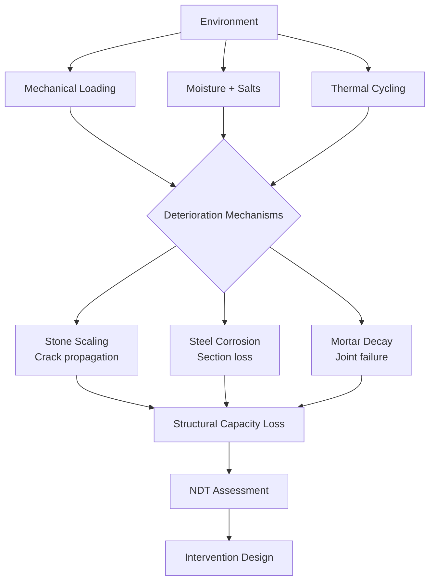

# 1.057 / 1.057 Heritage Science and Structural Conservation

**MIT CEE Mechanics & Materials Track | Elective | Materials Sub-area**
**Prereq:** 1.050, permission of instructor
**Instructor:** Prof. Oral Buyukozturk (Heritage Science emphasis)
**自學路徑：Bachelor → MEng → Heritage Conservation / Historic Preservation**

> **Source:** MIT CEE and international heritage science literature; Getty Conservation Institute
> **Topics:** Deterioration mechanisms in historic structures, non-destructive evaluation, material characterization, structural assessment of heritage buildings

---

## 問題 1：這個領域所有專家共享的 5 個核心心智模型是什麼？

1. **文物結構的價值在於其不可替代性**
   Historic structures have cultural, educational, and aesthetic value that cannot be replaced. Conservation decisions must balance structural safety with heritage preservation.

2. **劣化是多因素耦合的時間過程**
   Deterioration = mechanical loading + moisture + salt crystallization + thermal cycling + biological activity. Single-cause models miss the interaction effects.

3. **NDT（非破壞檢測）是文物表徵的核心**
   Since heritage materials cannot be sampled destructively, NDT methods (ultrasonic, infrared thermography, GPR) are the primary characterization tools.

4. **結構評估需要建立原結構與劣化狀態的區分**
   Distinguishing original structural intent from subsequent modifications and deterioration damage is the first step in heritage assessment.

5. **最小干預原則**
   Minimum intervention principle: repair only what is necessary for structural stability. Reversible interventions are preferred over irreversible ones.

---

## 問題 2：根本分歧

### 分歧 1: 結構加固 vs 歷史完整性
- **加固派**: Historic structures must be brought to modern safety standards. Structural reinforcement is ethically required if lives are at risk.
- **完整性派**: Adding modern reinforcement (steel frames, carbon fiber wraps) destroys the historic fabric. Strengthening should use compatible, reversible materials.

### 分歧 2: 重建 vs 保守修復
- **重建派** (Anastylosis): Collapsed structures can be rebuilt using original materials and techniques. Visible reconstruction increases visitor understanding.
- **保守修復派**: Only consolidate existing fabric; do not rebuild missing elements unless essential for stability.

---

## 問題 3：深度問題

1. 說明石材風化的微觀機制：物理風化（凍融循環）、化學風化（碳酸鈣的酸雨溶解）和生物風化（地衣分泌有機酸）如何協同作用。
2. 為什麼 FRP（碳纖維增強聚合物）加固歷史石材/砌體結構需要特別謹慎？碳纖維的高彈性模量和低渗透性如何影響文物結構的水汽傳遞和長期耐久性？
3. 在古羅馬混凝土中，火山灰（pozzolanic）膠凝材料和現代水泥的水化反應有何本質差異？為什麼古代混凝土可以持續 2000 年而現代混凝土在惡劣環境下退化更快？
4. 說明紅外線熱成像（Infrared thermography）如何檢測砌體結構中的空洞和裂縫：熱流差異如何產生表面溫差，以及最小可探測缺陷尺寸與波長和深度的關係。
5. 在歷史鋼結構中，原位拉伸試驗（in-situ tensile testing）如何在不打擾結構的情況下測量屈服強度和延性？如何考慮殘餘應力的影響？

---

# 核心心智模型深化

## 1. 文物結構劣化機制

### 1.1 Bilingual 概念對照
| English | 中英對照 | 定義 | 工程應用 |
|---|---|---|---|
| Deterioration | 劣化 | Loss of mechanical properties over time | Condition assessment |
| Salt crystallization | 鹽類結晶 | Pore pressure from NaCl, Na₂SO₄ crystallization | Efflorescence, spalling |
| Freeze-thaw | 凍融循環 | Ice lens formation and expansion | Stone scaling |
| Carbonation | 碳化 | CO₂ reaction with Ca(OH)₂ → CaCO₃ | Steel corrosion protection |

### 1.2 Key Derivation — Salt Crystallization Pressure

Crystallization pressure in pores:
ΔP = 2γV_m/r_crystal

Where:
- γ = surface tension of salt solution
- V_m = molar volume of crystal
- r_crystal = critical nucleus radius

For Na₂SO₄ (thenardite → thenardite): ΔP ≈ 10-50 MPa, sufficient to cause stone spalling.

**Environmental control**: Maintain RH between 40-60% to prevent salt solution crystallization cycles.

### 1.3 Engineering Applications
- **Stone consolidants**: Silane/siloxane treatments penetrate and consolidate. But they change vapor permeability and can cause blistering.
- **Mortar repointing**: Lime mortar (1:3 ratio) is more compatible with historic stone than cement mortar (higher modulus, lower porosity).

---

## 2. 古羅馬混凝土

### 2.1 Key Data — Roman vs Modern Concrete
| Property | Roman Concrete (opus caementicium) | Modern OPC Concrete |
|---|---|---|
| Binder | Pozzolanic lime + volcanic ash | Portland cement |
| Water/binder | High (0.8-1.0) | Low (0.3-0.5) |
| Compressive strength | 15-25 MPa | 30-60 MPa |
| Durability | 2000+ years | 50-100 years |
| Key feature | Self-healing (lime + water reaction) | Modern mix design |

**Roman concrete secret** (Jackson et al., 2017): Pozzolanic reaction creates Al-tobermorite crystals (Ca-Al-Si-O), which grow within the lime matrix and provide crack-healing capability.

### 2.2 Self-healing Mechanism
When cracks allow water ingress, unreacted lime (Ca(OH)₂) dissolves and re-precipitates as CaCO₃ or C-S-H within cracks, sealing them.

---

## 3. 非破壞檢測方法

### 3.1 Bilingual 概念對照
| English | 中英對照 | 定義 | 工程應用 |
|---|---|---|---|
| GPR | 地質雷達 | Ground Penetrating Radar | Rebar, voids, moisture |
| IR Thermography | 紅外線熱成像 | Infrared thermal imaging | Surface delamination, voids |
| UPV | 超聲波脈衝速度 | Ultrasonic Pulse Velocity | Crack depth, quality |

### 3.2 UPV in Heritage Stone
**Pulse velocity measurement**: V = d/t
- Intact limestone: V ≈ 3000-4000 m/s
- Microcracked stone: V ≈ 2000-3000 m/s
- Severely deteriorated: V < 2000 m/s

**Crack depth estimation**: d = V·t/2 measured by pulse-echo.

---

## 📊 Diagram 1: 文物結構劣化框架

---

## 總結

1. **文物結構的價值在於其不可替代性**：最小干預原則要求只加固必須加固的部分，優先使用可逆材料
2. **劣化是多因素耦合的過程**：凍融、鹽類結晶、碳化、硫酸鹽侵蝕——需要綜合環境控制和材料加固
3. **非破壞檢測是文物表徵的主要工具**：GPR、超聲波、紅外線熱成像——都是文物結構無損評估的核心技術
4. **古羅馬混凝土的自癒合機制是材料科學的前沿**：理解古代材料的成功因素可以啟發新一代可持續混凝土
5. **文物結構加固需要創新方法**：FRP、玻璃纖維加固、記憶合金——所有新技術都必須與文物材料兼容

**Prerequisite chain**: 1.050 Solid Mechanics → 1.035 Mechanics of Materials → 1.057 Heritage Science
