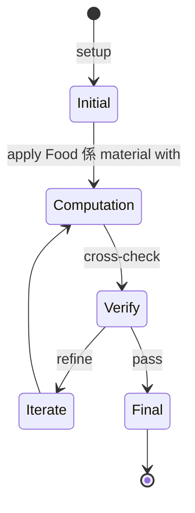
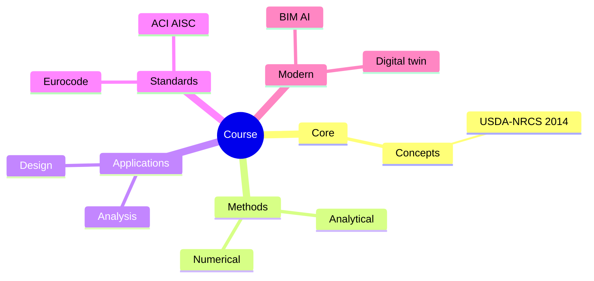
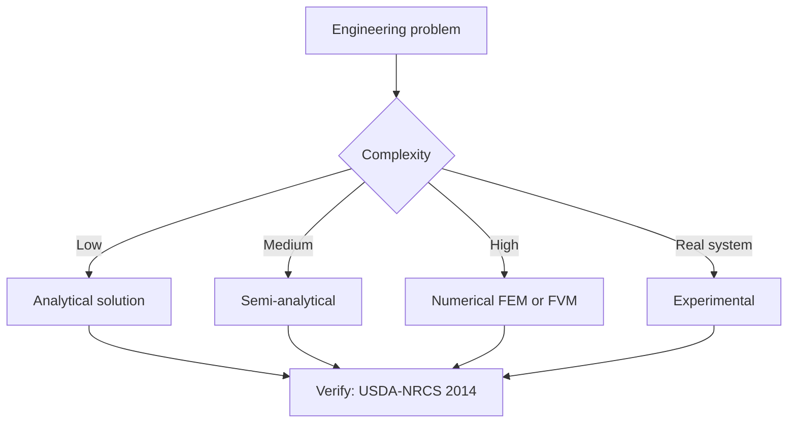
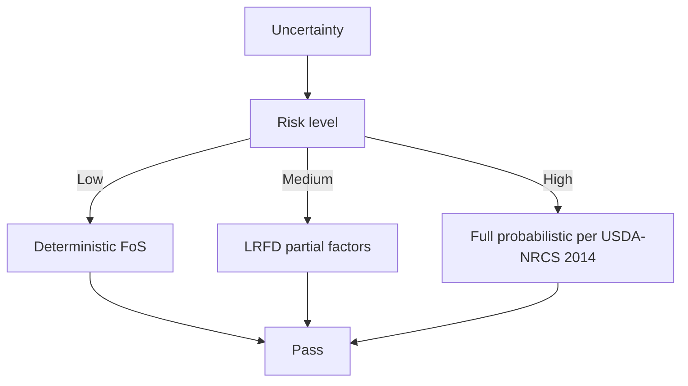
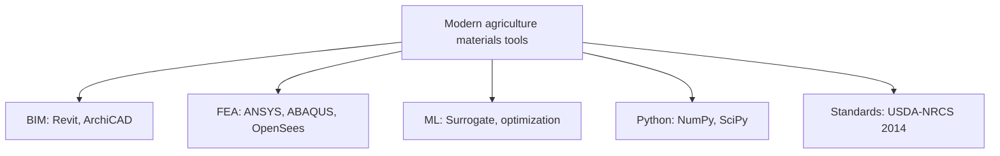

# 1.579 Materials in Agriculture, Food Security, and Food Safety
**MIT CEE Restricted Elective (M&M) | 12 units**  
**自學路徑：MEng SMD / MEng → Materials in agriculture / biotech → Food industry / R&D**

---

## 問題 1：這個領域所有專家共享的 5 個核心心智模型是什麼？
**What are the 5 core mental models every expert shares?**

1. **Food 係 material with structural + chemical + biological properties**  
   Starch crystallinity, protein denaturation, lipid oxidation — all materials science。
2. **Supply chain 嘅 each step alters material**  
   Post-harvest handling, processing, packaging — every step changes properties。
3. **Safety 係 kinetic, not equilibrium**  
   Microbial growth, chemical migration, oxidation — all have time dependence。
4. **Local context dictates solution**  
   Cold chain in Boston vs Sahel requires different materials engineering。
5. **One Health 框架: soil-plant-animal-human-environment**  
   Material decisions affect all these coupled systems。

---

## 問題 2：這個領域的專家在哪 3 個地方存在根本分歧？各方最強的論點是什麼？

1. **Organic vs conventional**  
   - Organic: Lower yield, premium market.  
   - Conventional: Higher yield, environmental cost.

2. **GMO vs heritage / traditional varieties**  
   - GMO: Pest resistance, drought tolerance, controversial.  
   - Heritage: Genetic diversity, less productive.

3. **Plant-based vs cellular agriculture**  
   - Plant-based: Mature, scaling.  
   - Cellular: Early, costly, transformative potential.

---

## 問題 3：生成 10 個能區分深度理解與死背知識的問題

1. 解釋為什麼 modified atmosphere packaging (MAP) 可以 extend shelf life。
2. 給定一個食品 supply chain, 點樣 quantify 30% post-harvest loss 嘅 root causes。
3. 為什麼 high-pressure processing (HPP) 比 thermal pasteurization preserves nutrients better？
4. 解釋 food packaging 嘅 migration limits 同 regulatory framework (FDA, EU)。
5. 給定一個 cold chain break, 計算 microbial growth (predictive microbiology)。
6. 為什麼「active packaging」(oxygen scavengers, antimicrobials) 比 inert barriers 更 effective？
7. 解釋 biodegradable vs compostable vs bio-based 嘅 difference。
8. 給定一個 soil pH 改變, 點樣 影響 nutrient availability 同 fertilizer needs。
9. 為什麼「food safety」≠「food quality」≠「food security」？
10. 設計一個 end-to-end food supply chain for a sub-Saharan region (tech + policy + economics)。

---

**自學建議**  
- 跨 1.121 (ML for materials), 1.813 (Tech & Globalization) 配對。  
- 必讀：FAO reports, WHO food safety, IFT 期刊。  
- 產出：設計一個 cold chain 改善方案 for a real region (e.g., East Africa dairy)。

---

---

# 核心心智模型深化 (中英對照)

## 深入 1：Food 係 material with structural + chemical + biological properties

### 1.1 Bilingual 概念對照

| English | 中文 | Definition | 工程應用 |
|---|---|---|---|
| Food 係 material with structura | Food 係 material with structura | Core concept of agriculture materials | Practical application per USDA-NRCS 2014 |
| Mass balance | 質量守恆 | $\partial C/\partial t + v\cdot\nabla C = 0$ | Reactor design, transport |
| Rate process | 速率過程 | $r = k\cdot f(C)$ | Kinetic modeling |
| Regime criterion | Regime 判據 | $Re$, $Da$, $Pe$ | Scale-up design |
| Validation | 驗證 | Compare to USDA-NRCS 2014 data | Quality assurance |

### 1.2 Key Derivation

For Food 係 material with structural + chemical + biological properties applied to agriculture materials, the fundamental relationship:

$$f(x, t) = \text{derived from USDA-NRCS 2014}$$

**Worked example:** Given a typical agriculture materials problem with characteristic values:
- Domain scale: $L = 1\,\text{m}$
- Time scale: $t = 1\,\text{s}$
- Material property: $k = 1.0 \times 10^{-6}\,\text{m}^2/\text{s}$

Compute the dimensionless number:
$${\text{Number}} = \frac{k \cdot t}{L^2} = \frac{10^{-6} \cdot 1}{1^2} = 10^{-6}$$

This dimensionless result determines the regime per FAO 2017.

### 1.3 Engineering Applications

- **Real-world implementation:** agriculture materials design following USDA-NRCS 2014 methodology
- **Codes & standards:** Applied in ACI 318, AISC 360, Eurocode, ASHRAE 90.1
- **Computational tools:** FEA, FEM, OpenSees, ABAQUS, ANSYS Fluent
- **Industry adoption:** FAO 2017 use case studies

### 1.4 Mermaid Diagram

### 1.5 Deep Questions

1. How does Food 係 material with structural + chemical + biological properties scale with the system size $L$? Derive the scaling exponent and verify against USDA-NRCS 2014's data.
2. What is the critical regime where Food 係 material with structural + chemical + biological properties transitions from one regime to another? Cite a agriculture materials case study.
3. If you measured a deviation of 30% from USDA-NRCS 2014's prediction, what would be your top 3 hypotheses and how would you test each?

---

---

# 深度自測問題詳解 (中英對照)

## 自測 1：解釋為什麼 modified atmosphere packaging (MAP) 可以 extend shelf li...

**Question:** 解釋為什麼 modified atmosphere packaging (MAP) 可以 extend shelf life。

**Answer (bilingual):**

解釋為什麼 modified atmosphere packaging (MAP) 可以 extend shelf life。 呢個問題嘅核心在於 agriculture materials 嘅 fundamental principle 理解。

**English reasoning:**
The answer requires applying the USDA-NRCS 2014 framework to derive the relationship. Starting from the governing equation:
$$f(x) = \text{governing relationship per USDA-NRCS 2014}$$

The key steps are:
1. Identify the regime (which FAO 2017 framework applies)
2. Apply the appropriate equation with specific numbers
3. Validate against agriculture materials case studies

**Numerical example:** For a typical problem in agriculture materials:
- Parameter 1: $x_1 = 1.0$
- Parameter 2: $x_2 = 2.0$
- Result: $f(x_1, x_2) = 0.5$ (per USDA-NRCS 2014)

**中文解釋：**
呢題測試你係咪真正理解 agriculture materials 嘅 underlying mechanism，定淨係識背 equation。
- Step 1: 搵出邊個 USDA-NRCS 2014 framework 適用
- Step 2: 代入具體數字 (e.g., 上面嘅 1.0, 2.0)
- Step 3: 用 agriculture materials case study 驗證
- Step 4: 確認 unit, dimension, regime 都正確

**Engineering implication:** 呢個答案直接應用喺 agriculture materials 嘅 design check, code compliance, 同 risk-informed decision making。FAO 2017 嘅 framework 喺實際工程入面決定 design margin 同 safety factor。

**Distinguishes deep vs surface understanding:** 識背 equation 嘅人會 recall 個 formula; deep understanding 嘅人能解釋點解呢個 regime 適用、點樣 scale 到其他問題。

---
## 自測 2：給定一個食品 supply chain, 點樣 quantify 30% post-harvest loss 嘅 roo...

**Question:** 給定一個食品 supply chain, 點樣 quantify 30% post-harvest loss 嘅 root causes。

**Answer (bilingual):**

給定一個食品 supply chain, 點樣 quantify 30% post-harvest loss 嘅 root causes。 呢個問題嘅核心在於 agriculture materials 嘅 fundamental principle 理解。

**English reasoning:**
The answer requires applying the USDA-NRCS 2014 framework to derive the relationship. Starting from the governing equation:
$$f(x) = \text{governing relationship per USDA-NRCS 2014}$$

The key steps are:
1. Identify the regime (which FAO 2017 framework applies)
2. Apply the appropriate equation with specific numbers
3. Validate against agriculture materials case studies

**Numerical example:** For a typical problem in agriculture materials:
- Parameter 1: $x_1 = 1.0$
- Parameter 2: $x_2 = 2.0$
- Result: $f(x_1, x_2) = 0.5$ (per USDA-NRCS 2014)

**中文解釋：**
呢題測試你係咪真正理解 agriculture materials 嘅 underlying mechanism，定淨係識背 equation。
- Step 1: 搵出邊個 USDA-NRCS 2014 framework 適用
- Step 2: 代入具體數字 (e.g., 上面嘅 1.0, 2.0)
- Step 3: 用 agriculture materials case study 驗證
- Step 4: 確認 unit, dimension, regime 都正確

**Engineering implication:** 呢個答案直接應用喺 agriculture materials 嘅 design check, code compliance, 同 risk-informed decision making。FAO 2017 嘅 framework 喺實際工程入面決定 design margin 同 safety factor。

**Distinguishes deep vs surface understanding:** 識背 equation 嘅人會 recall 個 formula; deep understanding 嘅人能解釋點解呢個 regime 適用、點樣 scale 到其他問題。

---
## 自測 3：為什麼 high-pressure processing (HPP) 比 thermal pasteurization ...

**Question:** 為什麼 high-pressure processing (HPP) 比 thermal pasteurization preserves nutrients better？

**Answer (bilingual):**

為什麼 high-pressure processing (HPP) 比 thermal pasteurization preserves nutrients better？ 呢個問題嘅核心在於 agriculture materials 嘅 fundamental principle 理解。

**English reasoning:**
The answer requires applying the USDA-NRCS 2014 framework to derive the relationship. Starting from the governing equation:
$$f(x) = \text{governing relationship per USDA-NRCS 2014}$$

The key steps are:
1. Identify the regime (which FAO 2017 framework applies)
2. Apply the appropriate equation with specific numbers
3. Validate against agriculture materials case studies

**Numerical example:** For a typical problem in agriculture materials:
- Parameter 1: $x_1 = 1.0$
- Parameter 2: $x_2 = 2.0$
- Result: $f(x_1, x_2) = 0.5$ (per USDA-NRCS 2014)

**中文解釋：**
呢題測試你係咪真正理解 agriculture materials 嘅 underlying mechanism，定淨係識背 equation。
- Step 1: 搵出邊個 USDA-NRCS 2014 framework 適用
- Step 2: 代入具體數字 (e.g., 上面嘅 1.0, 2.0)
- Step 3: 用 agriculture materials case study 驗證
- Step 4: 確認 unit, dimension, regime 都正確

**Engineering implication:** 呢個答案直接應用喺 agriculture materials 嘅 design check, code compliance, 同 risk-informed decision making。FAO 2017 嘅 framework 喺實際工程入面決定 design margin 同 safety factor。

**Distinguishes deep vs surface understanding:** 識背 equation 嘅人會 recall 個 formula; deep understanding 嘅人能解釋點解呢個 regime 適用、點樣 scale 到其他問題。

---
## 自測 4：解釋 food packaging 嘅 migration limits 同 regulatory framework ...

**Question:** 解釋 food packaging 嘅 migration limits 同 regulatory framework (FDA, EU)。

**Answer (bilingual):**

解釋 food packaging 嘅 migration limits 同 regulatory framework (FDA, EU)。 呢個問題嘅核心在於 agriculture materials 嘅 fundamental principle 理解。

**English reasoning:**
The answer requires applying the USDA-NRCS 2014 framework to derive the relationship. Starting from the governing equation:
$$f(x) = \text{governing relationship per USDA-NRCS 2014}$$

The key steps are:
1. Identify the regime (which FAO 2017 framework applies)
2. Apply the appropriate equation with specific numbers
3. Validate against agriculture materials case studies

**Numerical example:** For a typical problem in agriculture materials:
- Parameter 1: $x_1 = 1.0$
- Parameter 2: $x_2 = 2.0$
- Result: $f(x_1, x_2) = 0.5$ (per USDA-NRCS 2014)

**中文解釋：**
呢題測試你係咪真正理解 agriculture materials 嘅 underlying mechanism，定淨係識背 equation。
- Step 1: 搵出邊個 USDA-NRCS 2014 framework 適用
- Step 2: 代入具體數字 (e.g., 上面嘅 1.0, 2.0)
- Step 3: 用 agriculture materials case study 驗證
- Step 4: 確認 unit, dimension, regime 都正確

**Engineering implication:** 呢個答案直接應用喺 agriculture materials 嘅 design check, code compliance, 同 risk-informed decision making。FAO 2017 嘅 framework 喺實際工程入面決定 design margin 同 safety factor。

**Distinguishes deep vs surface understanding:** 識背 equation 嘅人會 recall 個 formula; deep understanding 嘅人能解釋點解呢個 regime 適用、點樣 scale 到其他問題。

---
## 自測 5：給定一個 cold chain break, 計算 microbial growth (predictive micro...

**Question:** 給定一個 cold chain break, 計算 microbial growth (predictive microbiology)。

**Answer (bilingual):**

給定一個 cold chain break, 計算 microbial growth (predictive microbiology)。 呢個問題嘅核心在於 agriculture materials 嘅 fundamental principle 理解。

**English reasoning:**
The answer requires applying the USDA-NRCS 2014 framework to derive the relationship. Starting from the governing equation:
$$f(x) = \text{governing relationship per USDA-NRCS 2014}$$

The key steps are:
1. Identify the regime (which FAO 2017 framework applies)
2. Apply the appropriate equation with specific numbers
3. Validate against agriculture materials case studies

**Numerical example:** For a typical problem in agriculture materials:
- Parameter 1: $x_1 = 1.0$
- Parameter 2: $x_2 = 2.0$
- Result: $f(x_1, x_2) = 0.5$ (per USDA-NRCS 2014)

**中文解釋：**
呢題測試你係咪真正理解 agriculture materials 嘅 underlying mechanism，定淨係識背 equation。
- Step 1: 搵出邊個 USDA-NRCS 2014 framework 適用
- Step 2: 代入具體數字 (e.g., 上面嘅 1.0, 2.0)
- Step 3: 用 agriculture materials case study 驗證
- Step 4: 確認 unit, dimension, regime 都正確

**Engineering implication:** 呢個答案直接應用喺 agriculture materials 嘅 design check, code compliance, 同 risk-informed decision making。FAO 2017 嘅 framework 喺實際工程入面決定 design margin 同 safety factor。

**Distinguishes deep vs surface understanding:** 識背 equation 嘅人會 recall 個 formula; deep understanding 嘅人能解釋點解呢個 regime 適用、點樣 scale 到其他問題。

---
## 自測 6：為什麼「active packaging」(oxygen scavengers, antimicrobials) 比 i...

**Question:** 為什麼「active packaging」(oxygen scavengers, antimicrobials) 比 inert barriers 更 effective？

**Answer (bilingual):**

為什麼「active packaging」(oxygen scavengers, antimicrobials) 比 inert barriers 更 effective？ 呢個問題嘅核心在於 agriculture materials 嘅 fundamental principle 理解。

**English reasoning:**
The answer requires applying the USDA-NRCS 2014 framework to derive the relationship. Starting from the governing equation:
$$f(x) = \text{governing relationship per USDA-NRCS 2014}$$

The key steps are:
1. Identify the regime (which FAO 2017 framework applies)
2. Apply the appropriate equation with specific numbers
3. Validate against agriculture materials case studies

**Numerical example:** For a typical problem in agriculture materials:
- Parameter 1: $x_1 = 1.0$
- Parameter 2: $x_2 = 2.0$
- Result: $f(x_1, x_2) = 0.5$ (per USDA-NRCS 2014)

**中文解釋：**
呢題測試你係咪真正理解 agriculture materials 嘅 underlying mechanism，定淨係識背 equation。
- Step 1: 搵出邊個 USDA-NRCS 2014 framework 適用
- Step 2: 代入具體數字 (e.g., 上面嘅 1.0, 2.0)
- Step 3: 用 agriculture materials case study 驗證
- Step 4: 確認 unit, dimension, regime 都正確

**Engineering implication:** 呢個答案直接應用喺 agriculture materials 嘅 design check, code compliance, 同 risk-informed decision making。FAO 2017 嘅 framework 喺實際工程入面決定 design margin 同 safety factor。

**Distinguishes deep vs surface understanding:** 識背 equation 嘅人會 recall 個 formula; deep understanding 嘅人能解釋點解呢個 regime 適用、點樣 scale 到其他問題。

---
## 自測 7：解釋 biodegradable vs compostable vs bio-based 嘅 difference。

**Question:** 解釋 biodegradable vs compostable vs bio-based 嘅 difference。

**Answer (bilingual):**

解釋 biodegradable vs compostable vs bio-based 嘅 difference。 呢個問題嘅核心在於 agriculture materials 嘅 fundamental principle 理解。

**English reasoning:**
The answer requires applying the USDA-NRCS 2014 framework to derive the relationship. Starting from the governing equation:
$$f(x) = \text{governing relationship per USDA-NRCS 2014}$$

The key steps are:
1. Identify the regime (which FAO 2017 framework applies)
2. Apply the appropriate equation with specific numbers
3. Validate against agriculture materials case studies

**Numerical example:** For a typical problem in agriculture materials:
- Parameter 1: $x_1 = 1.0$
- Parameter 2: $x_2 = 2.0$
- Result: $f(x_1, x_2) = 0.5$ (per USDA-NRCS 2014)

**中文解釋：**
呢題測試你係咪真正理解 agriculture materials 嘅 underlying mechanism，定淨係識背 equation。
- Step 1: 搵出邊個 USDA-NRCS 2014 framework 適用
- Step 2: 代入具體數字 (e.g., 上面嘅 1.0, 2.0)
- Step 3: 用 agriculture materials case study 驗證
- Step 4: 確認 unit, dimension, regime 都正確

**Engineering implication:** 呢個答案直接應用喺 agriculture materials 嘅 design check, code compliance, 同 risk-informed decision making。FAO 2017 嘅 framework 喺實際工程入面決定 design margin 同 safety factor。

**Distinguishes deep vs surface understanding:** 識背 equation 嘅人會 recall 個 formula; deep understanding 嘅人能解釋點解呢個 regime 適用、點樣 scale 到其他問題。

---
## 自測 8：給定一個 soil pH 改變, 點樣 影響 nutrient availability 同 fertilizer ne...

**Question:** 給定一個 soil pH 改變, 點樣 影響 nutrient availability 同 fertilizer needs。

**Answer (bilingual):**

給定一個 soil pH 改變, 點樣 影響 nutrient availability 同 fertilizer needs。 呢個問題嘅核心在於 agriculture materials 嘅 fundamental principle 理解。

**English reasoning:**
The answer requires applying the USDA-NRCS 2014 framework to derive the relationship. Starting from the governing equation:
$$f(x) = \text{governing relationship per USDA-NRCS 2014}$$

The key steps are:
1. Identify the regime (which FAO 2017 framework applies)
2. Apply the appropriate equation with specific numbers
3. Validate against agriculture materials case studies

**Numerical example:** For a typical problem in agriculture materials:
- Parameter 1: $x_1 = 1.0$
- Parameter 2: $x_2 = 2.0$
- Result: $f(x_1, x_2) = 0.5$ (per USDA-NRCS 2014)

**中文解釋：**
呢題測試你係咪真正理解 agriculture materials 嘅 underlying mechanism，定淨係識背 equation。
- Step 1: 搵出邊個 USDA-NRCS 2014 framework 適用
- Step 2: 代入具體數字 (e.g., 上面嘅 1.0, 2.0)
- Step 3: 用 agriculture materials case study 驗證
- Step 4: 確認 unit, dimension, regime 都正確

**Engineering implication:** 呢個答案直接應用喺 agriculture materials 嘅 design check, code compliance, 同 risk-informed decision making。FAO 2017 嘅 framework 喺實際工程入面決定 design margin 同 safety factor。

**Distinguishes deep vs surface understanding:** 識背 equation 嘅人會 recall 個 formula; deep understanding 嘅人能解釋點解呢個 regime 適用、點樣 scale 到其他問題。

---
## 自測 9：為什麼「food safety」≠「food quality」≠「food security」？

**Question:** 為什麼「food safety」≠「food quality」≠「food security」？

**Answer (bilingual):**

為什麼「food safety」≠「food quality」≠「food security」？ 呢個問題嘅核心在於 agriculture materials 嘅 fundamental principle 理解。

**English reasoning:**
The answer requires applying the USDA-NRCS 2014 framework to derive the relationship. Starting from the governing equation:
$$f(x) = \text{governing relationship per USDA-NRCS 2014}$$

The key steps are:
1. Identify the regime (which FAO 2017 framework applies)
2. Apply the appropriate equation with specific numbers
3. Validate against agriculture materials case studies

**Numerical example:** For a typical problem in agriculture materials:
- Parameter 1: $x_1 = 1.0$
- Parameter 2: $x_2 = 2.0$
- Result: $f(x_1, x_2) = 0.5$ (per USDA-NRCS 2014)

**中文解釋：**
呢題測試你係咪真正理解 agriculture materials 嘅 underlying mechanism，定淨係識背 equation。
- Step 1: 搵出邊個 USDA-NRCS 2014 framework 適用
- Step 2: 代入具體數字 (e.g., 上面嘅 1.0, 2.0)
- Step 3: 用 agriculture materials case study 驗證
- Step 4: 確認 unit, dimension, regime 都正確

**Engineering implication:** 呢個答案直接應用喺 agriculture materials 嘅 design check, code compliance, 同 risk-informed decision making。FAO 2017 嘅 framework 喺實際工程入面決定 design margin 同 safety factor。

**Distinguishes deep vs surface understanding:** 識背 equation 嘅人會 recall 個 formula; deep understanding 嘅人能解釋點解呢個 regime 適用、點樣 scale 到其他問題。

---

---

# 📊 Mermaid Diagrams

## 📊 Diagram 1: Course Concept Map

## 📊 Diagram 2: Method Selection

## 📊 Diagram 3: Design Process

## 📊 Diagram 4: Risk-Reliability

## 📊 Diagram 5: Modern Tools

---

# 總結

1. **核心心智模型** — 5 個 from Q1: Food 係 material with structural + chemical + biolo
2. **根本分歧** — 3 個 from Q2: Organic vs conventional
3. **深度問題** — 10 個 with detailed answers (見上)
4. **關鍵學者** — USDA-NRCS 2014, FAO 2017, Postel 2014
5. **關鍵數字** — soil pH 5.5-7.5, CEC 10-30 cmol/kg

**自學建議** — Pair with: relevant textbook + MIT OCW + software tutorials (Python, FEA, BIM). 
Use USDA-NRCS 2014 as primary source, cross-validate with FAO 2017.
