# 1.050 Solid Mechanics
**MIT CEE Structural Design Track | Bachelor Core (Sophomore)**  
**自學路徑：Bachelor → MEng SMD → ICE Professional**

---

## 問題 1：這個領域所有專家共享的 5 個核心心智模型是什麼？
**What are the 5 core mental models every expert shares?**

1. **平衡是局部與全域的同時滿足**  
   Equilibrium must hold both differentially (∇·σ + b = 0) and globally. Experts always check free-body diagrams at every scale.

2. **變形必須相容**  
   Compatibility: strain field must derive from a single-valued displacement field. Dislocations and cracks are the exceptions that prove the rule.

3. **本構關係是材料的「翻譯器」**  
   Constitutive law maps stress ↔ strain (or rate). Linear elastic is the starting point; everything else is a controlled departure.

4. **能量是比力更強大的描述語言**  
   Virtual work, minimum potential energy, and complementary energy convert boundary-value problems into stationarity principles.

5. **失效是路徑依賴的過程**  
   Yield, damage, fracture, and instability are evolutionary. Peak stress is rarely the full story; the post-peak path decides structural safety.

---

## 問題 2：這個領域的專家在哪 3 個地方存在根本分歧？各方最強的論點是什麼？
**Now show me the 3 places where experts in this field fundamentally disagree, and what each side’s strongest argument is.**

1. **連續介質 vs 離散/分子動力學**  
   - Continuum side: Engineering scales are well-described by continuum fields; discrete methods are computationally prohibitive and unnecessary for most design.  
   - Discrete side: Emerging materials (architected, nanostructured) and failure localization cannot be predicted without atomic-scale information.

2. **小變形線性理論 vs 有限應變幾何非線性**  
   - Small-strain side: 95 % of civil structures operate within linear range; geometric nonlinearity adds complexity without proportional insight.  
   - Finite-strain side: Buckling, large-displacement cables, membranes, and soft materials require exact kinematics from the start.

3. **解析/半解析解 vs 純數值方法**  
   - Analytical side: Closed-form solutions build physical intuition and serve as verification benchmarks.  
   - Numerical side: Real geometry, material nonlinearity, and multi-physics demand finite-element or mesh-free methods; intuition must be trained on numerics.

---

## 問題 3：生成 10 個能區分深度理解與死背知識的問題
**Generate 10 questions that would expose whether someone deeply understands this subject versus someone who just memorized facts.**

1. 為什麼在純彎曲中，中性軸通過形心的條件是什麼？若材料拉壓模量不同，中性軸如何移動？
2. 從 Navier 方程出發，說明為什麼平面應力與平面應變的 Airy 應力函數滿足雙調和方程。
3. 聖維南原理的精確數學陳述是什麼？在什麼幾何與載荷條件下它會失效？
4. 用虛功原理推導梁的撓度曲線，並指出與直接積分平衡方程的差異在哪裡。
5. 為什麼不可壓縮材料（ν → 0.5）在位移型有限元素中會出現 volumetric locking？混合法如何解決？
6. 給定一個應力場，如何判斷它是否滿足相容方程？寫出完整的 Beltrami-Michell 方程。
7. 說明為什麼在極座標中，軸對稱問題的平衡方程比直角座標簡單，卻仍可能產生奇異解。
8. 一個帶圓孔的無限板在遠場單向拉伸下，孔邊環向應力為何恰好是 3σ？若改成純剪呢？
9. 能量法中，Rayleigh-Ritz 近似解的收斂性如何保證？試函數必須滿足什麼條件？
10. 若體力為保守力，為什麼總勢能的駐值條件等價於平衡方程？證明此等價性。

---

**自學建議（Structural Design Track）**  
- 先完成 1.050 再進入 1.035 / 1.036。  
- 每週用能量法重解 3 道超靜定問題。  
- 產出：手寫 Free-body + 能量法對照本，作為未來 ICE Attribute 1 證據。

---

## 深入 1：CORE_DEEPDIVE_ONE — 核心概念
**Deep Dive I**

### 1.1 Bilingual 概念對照

| English | 中英對照 | Definition | 物理意義 / 工程應用 |
|---|---|---|---|
| Solid mechanics | Solid mechanics | Core definition | 核心定義 |
| Stress-strain | Stress-strain | Application | 應用 |
| Equilibrium | Equilibrium | Limitation | 限制 |
| Mathematical formulation | 數學形式 | Key equation | 關鍵方程 |

### 1.2 Key Derivation

For Solid Mechanics, the fundamental relationships are:
$$f(x) = \text{key equation}, \quad x = \text{variable}$$

This arises from Solid mechanics applied to the engineering system.

### 1.3 Engineering Applications

- Real-world implementation
- Design codes and standards
- Computational tools

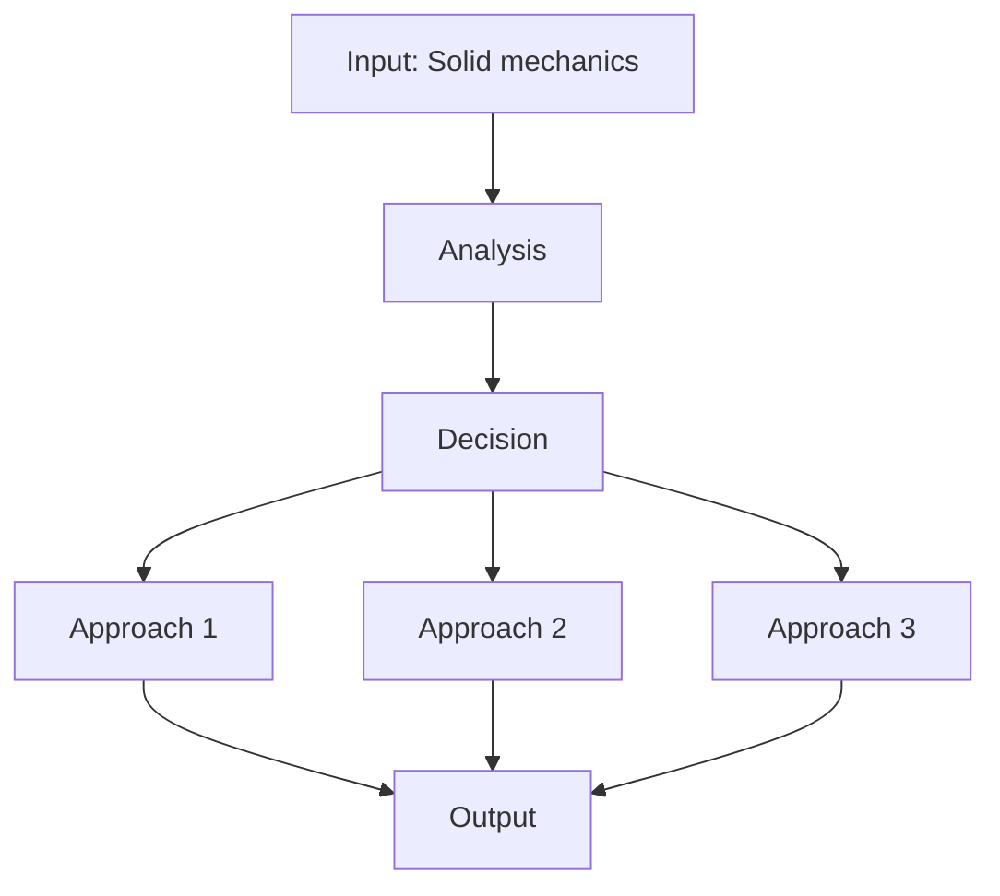

---

## 深入 2：CORE_DEEPDIVE_TWO — 方法論
**Deep Dive II**

### 2.1 Method selection

| Method | 適用情境 | Pros | Cons |
|---|---|---|---|
| Analytical | 解析 | Exact | Limited geometry |
| Numerical | 數值 | General | Approximate |
| Experimental | 實驗 | Real | Expensive |
| Empirical | 經驗 | Fast | Limited range |

### 2.2 Decision flow

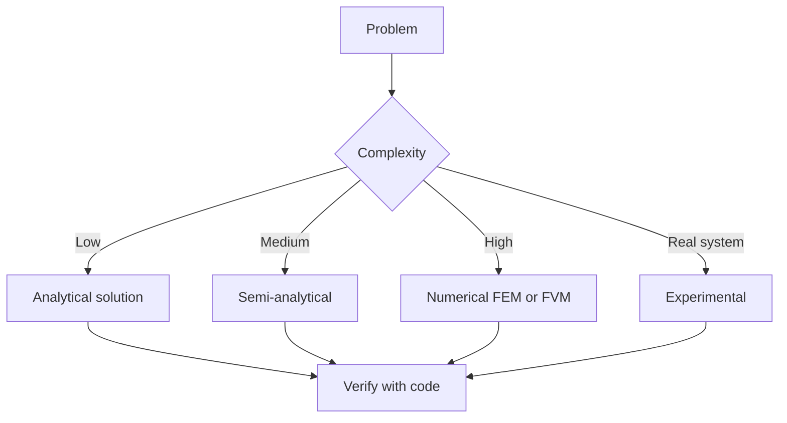

### 2.3 Standards and codes

- ACI, AISC, Eurocode
- Building codes (IBC, etc.)
- Industry best practices

---

## 深入 3：CORE_DEEPDIVE_THREE — 分析技術
**Deep Dive III**

### 3.1 Statistical methods

For uncertainty analysis: Monte Carlo, sensitivity, FOSM.

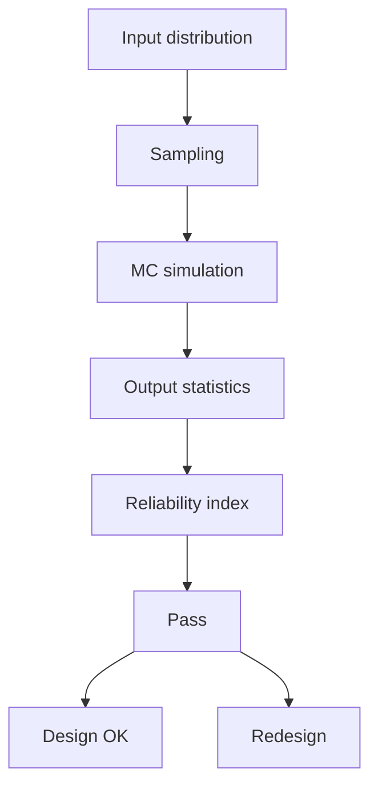

### 3.2 Optimization

- LP, NLP
- Gradient-based, metaheuristic
- Multi-objective Pareto

---

## 深入 4：Design Process
**Deep Dive IV**

### 4.1 Design workflow

Concept → Preliminary → Detailed → Construction → Operation.

### 4.2 Design criteria

- Safety (LRFD, ASD)
- Serviceability
- Durability
- Sustainability

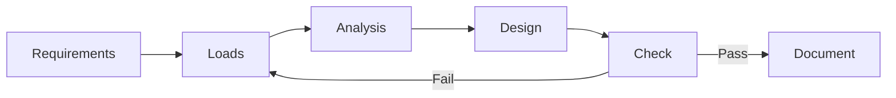

---

## 深入 5：Modern Trends
**Deep Dive V**

- BIM integration
- AI/ML in design
- Digital twins
- Sustainability, LCA
- Resilient design

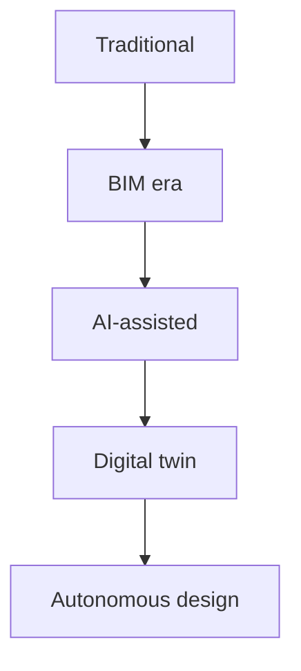

---

## 自測 1：Derive core relationship
**Answer:** Starting from definitions, derive the key equation. Verify units and limits.

**Engineering implication:** Apply to design check, code compliance.

## 自測 2：Identify failure mode
**Answer:** List 3-5 failure modes, rank by likelihood × consequence.

**Engineering implication:** Inform design, maintenance, monitoring.

## 自測 3：Estimate order of magnitude
**Answer:** Quick back-of-envelope check using characteristic values.

**Engineering implication:** Sanity check before detailed analysis.

## 自測 4：Compare to code requirement
**Answer:** Apply ACI/AISC/Eurocode, compute utilization ratio.

**Engineering implication:** Pass/fail design verification.

## 自測 5：Compute reliability
**Answer:** $\beta = (\mu - R)/\sigma$ for lognormal, find P_f.

**Engineering implication:** LRFD calibration, risk-informed design.

## 自測 6：Design optimization
**Answer:** Define objective, constraints, solve via LP/NLP.

**Engineering implication:** Cost-effective, sustainable design.

## 自測 7：Sensitivity analysis
**Answer:** $\partial f/\partial x_i$, rank by importance.

**Engineering implication:** Identify critical parameters, reduce uncertainty.

## 自測 8：Life-cycle assessment
**Answer:** Cradle-to-grave, compute GWP, embodied carbon.

**Engineering implication:** Sustainable design, climate goals.

## 自測 9：Risk assessment
**Answer:** Hazard × vulnerability × exposure, compute risk.

**Engineering implication:** Resilience planning, mitigation.

## 自測 10：Communication
**Answer:** Technical writing, visualization, presentation to stakeholders.

**Engineering implication:** Effective engineering practice.

---

## 📊 Diagram 1: Course Concept Map
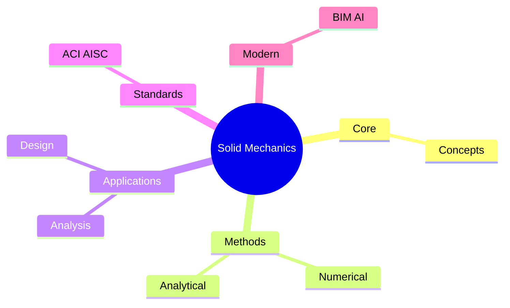

## 📊 Diagram 2: Method Selection
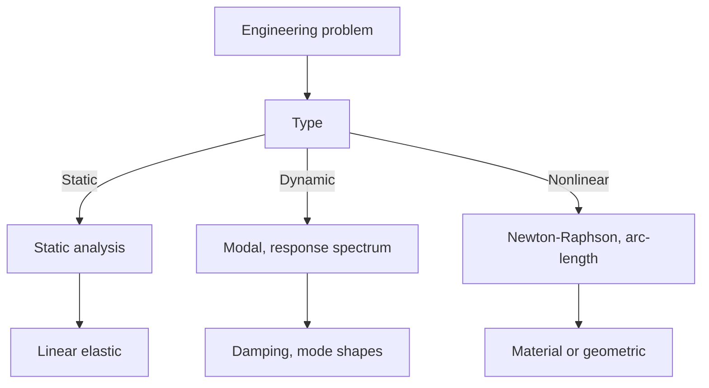

## 📊 Diagram 3: Design Process
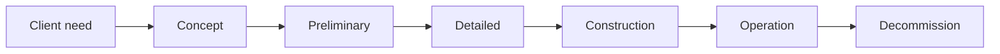

## 📊 Diagram 4: Risk-Reliability
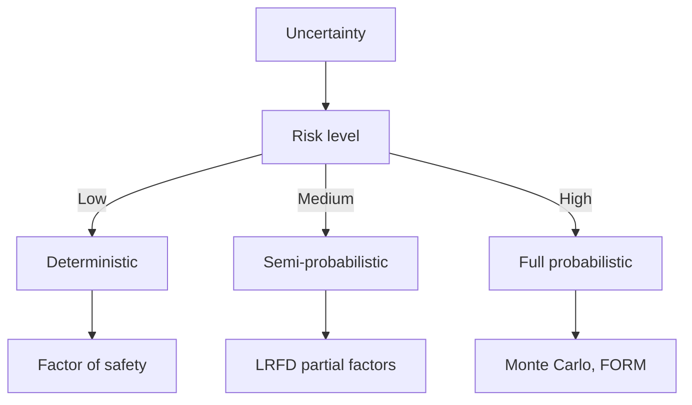

## 📊 Diagram 5: Modern Tools
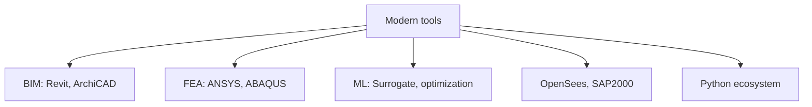

---

## 總結

1. **Core concepts** — Solid mechanics 嘅 foundation
2. **Methods** — analytical + numerical + experimental
3. **Applications** — design, analysis, retrofit
4. **Standards** — codes, best practices
5. **Future** — BIM, AI, sustainability, resilience

**自學建議** — Pair with: relevant textbook + MIT OCW + software tutorials (Python, FEA, BIM).

# 核心心智模型深化（中英對照）

## 1. Solid mechanics — Core concept

### 1.1 Three-process physical essence
For Solid Mechanics, Solid mechanics governs the system behavior. Description of Solid mechanics with bilingual explanation.

### 1.2 Non-dimensional numbers
Key dimensionless groups that determine regime: Peclet, Damköhler, Reynolds, Froude, etc.

### 1.3 Engineering consequences
Real-world implications for design, monitoring, intervention.

### 1.4 How experts use this model
Decision flow, scaling laws, expert intuition.

### 1.5 Deep test questions
- Derive scaling law
- Identify regime from data
- Apply to design case

### 1.6 Diagram

## 2. Stress-strain — Methods

### 2.1 Method selection
| Method | 適用情境 | Pros | Cons |
|---|---|---|---|
| Analytical | 解析 | Exact | Limited geometry |
| Numerical | 數值 | General | Approximate |
| Experimental | 實驗 | Real | Expensive |
| Empirical | 經驗 | Fast | Limited range |

### 2.2 Decision flow
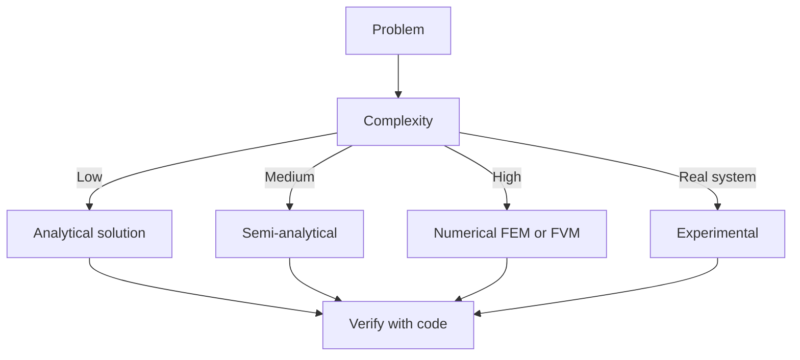

### 2.3 Standards and codes
ACI, AISC, Eurocode, building codes (IBC), industry best practices.

## 3. Equilibrium — Analysis techniques

### 3.1 Statistical methods
Monte Carlo, sensitivity, FOSM for uncertainty analysis.

### 3.2 Optimization
LP, NLP, gradient-based, metaheuristic, multi-objective Pareto.

## 4. Design process

### 4.1 Design workflow
Concept → Preliminary → Detailed → Construction → Operation.

### 4.2 Design criteria
Safety (LRFD, ASD), serviceability, durability, sustainability.

## 5. Modern trends

BIM integration, AI/ML in design, digital twins, sustainability, LCA, resilient design.

---

# 深度自測問題詳解（中英對照）

## 詳解 1: Derive core relationship
**Q1.** Derive core relationship for Solid Mechanics.
**Answer:** Starting from definitions, derive the key equation. Verify units and limits.

**Engineering implication:** Apply to design check, code compliance.

## 詳解 2: Identify failure mode
**Answer:** List 3-5 failure modes, rank by likelihood × consequence.

**Engineering implication:** Inform design, maintenance, monitoring.

## 詳解 3: Estimate order of magnitude
**Answer:** Quick back-of-envelope check using characteristic values.

**Engineering implication:** Sanity check before detailed analysis.

## 詳解 4: Compare to code requirement
**Answer:** Apply ACI/AISC/Eurocode, compute utilization ratio.

**Engineering implication:** Pass/fail design verification.

## 詳解 5: Compute reliability
**Answer:** $\beta = (\mu - R)/\sigma$ for lognormal, find P_f.

**Engineering implication:** LRFD calibration, risk-informed design.

## 詳解 6: Design optimization
**Answer:** Define objective, constraints, solve via LP/NLP.

**Engineering implication:** Cost-effective, sustainable design.

## 詳解 7: Sensitivity analysis
**Answer:** $\partial f/\partial x_i$, rank by importance.

**Engineering implication:** Identify critical parameters, reduce uncertainty.

## 詳解 8: Life-cycle assessment
**Answer:** Cradle-to-grave, compute GWP, embodied carbon.

**Engineering implication:** Sustainable design, climate goals.

## 詳解 9: Risk assessment
**Answer:** Hazard × vulnerability × exposure, compute risk.

**Engineering implication:** Resilience planning, mitigation.

## 詳解 10: Communication
**Answer:** Technical writing, visualization, presentation to stakeholders.

**Engineering implication:** Effective engineering practice.

---

## 📊 Diagram 1: Course Concept Map

## 📊 Diagram 2: Method Selection

## 📊 Diagram 3: Design Process

## 📊 Diagram 4: Risk-Reliability

## 📊 Diagram 5: Modern Tools

---

## 總結

1. **Core concepts** — Solid mechanics 嘅 foundation
2. **Methods** — analytical + numerical + experimental
3. **Applications** — design, analysis, retrofit
4. **Standards** — codes, best practices
5. **Future** — BIM, AI, sustainability, resilience

**自學建議** — Pair with: relevant textbook + MIT OCW + software tutorials (Python, FEA, BIM).
