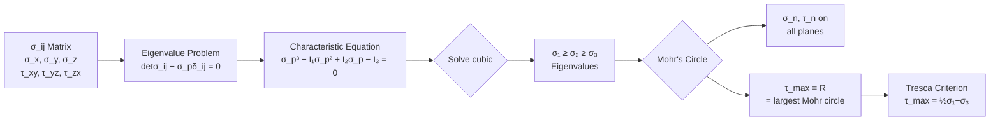
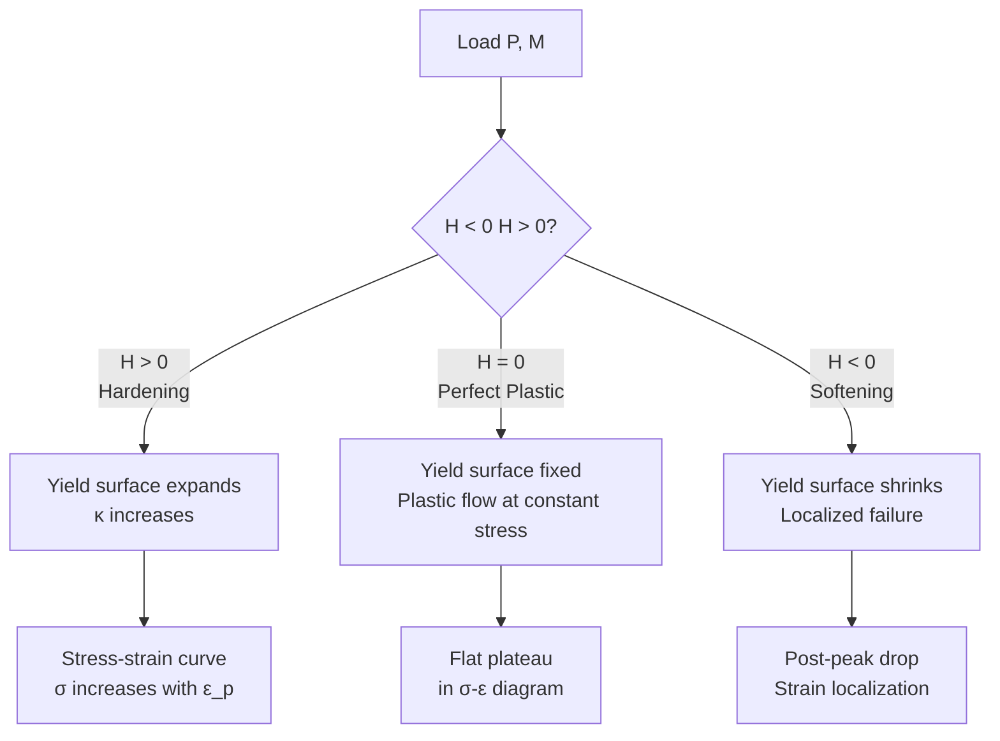
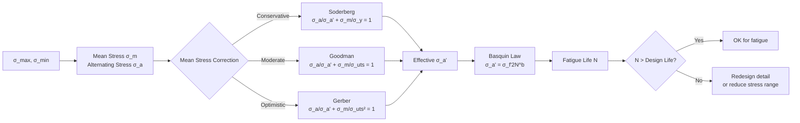
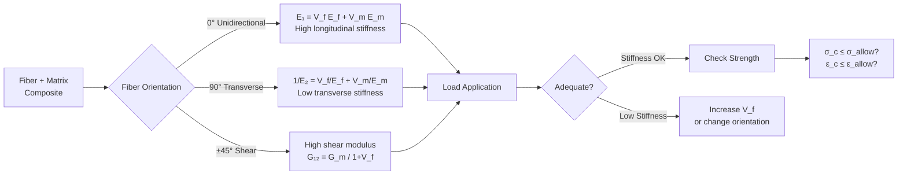
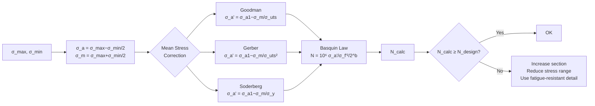
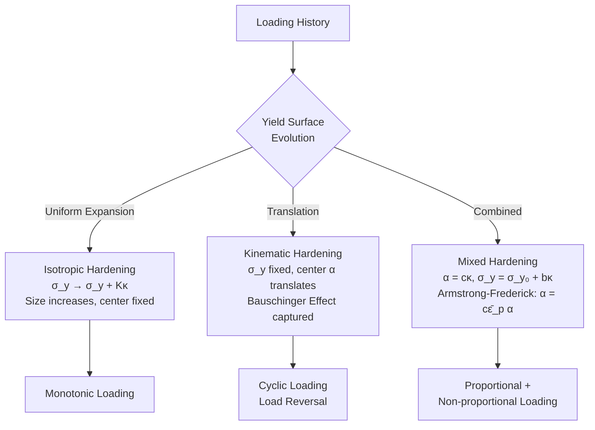

# 1.035 Mechanics of Materials

**MIT CEE Structural Design Track | 12 Units | Core (Junior)**
**Prereq:** 1.050 or permission of instructor
**Instructor:** Prof. Andrew Whittle
**自學路徑：Bachelor → MEng SMD → ICE Professional**

> **Source:** MIT Catalog (2024-25) — "Covers the structure and properties of natural and manufactured engineering materials with an emphasis on the fundamentals of mechanical behavior of materials, while considering their use in civil and environmental engineering design."
> **Textbooks:** Gere & Timoshenko, *Mechanics of Materials*; Crandall, Dahl & Lardner; Bhattacharjee, *Continuum Mechanics*

---

## 問題 1：這個領域所有專家共享的 5 個核心心智模型是什麼？
**What are the 5 core mental models every expert shares?**

1. **應力狀態是張量，必須完整描述**
   A stress state is a second-order symmetric tensor σ_ij = σ_ji. Principal stresses σ_1 ≥ σ_2 ≥ σ_3, invariants I_1, I_2, I_3, and Mohr's circle are different projections of the same mathematical object. One cannot reduce a 3D stress state to a single scalar.

2. **應變能密度決定材料行為**
   The strain energy density U₀ = ∫₀^{ε} σ_ij dε_ij governs elasticity, hyperelasticity, and the onset of instability. The shape of U₀(ε) — convex, non-convex, or strain-softening — dictates material stability.

3. **失效準則是應力/應變空間中的超曲面**
   Tresca (|σ_max − σ_min| = 2k), von Mises (σ_eq = √(½[(σ₁−σ₂)²+(σ₂−σ₃)²+(σ₃−σ₁)²]) = √(2k)), Drucker-Prager, Mohr-Coulomb — all define a "safe region" in principal-stress space. The choice of criterion depends on the material's failure mechanism.

4. **多軸加載不能用單軸強度簡單疊加**
   Interaction equations and interaction diagrams exist precisely because superposition of uniaxial strengths is invalid under multi-axial stress states. Concrete fails at different σ₁/σ₃ combinations than steel.

5. **時效行為是不可逆路徑依賴變形**
   Plasticity, viscoelasticity, creep, and damage are all path-dependent. The current state depends on the entire loading history, not just the current load level. Internal state variables (hardening parameters κ, back stress α, isotropic/kinematic hardening) encode this history.


### Key equations summary (LaTeX)

$$F = ma \quad (\text{Newton 2nd law, Newton 1687})$$

$$\sigma = E\epsilon \quad (\text{Hooke's law, Hooke 1678})$$

$$\nabla \cdot \sigma + b = 0 \quad (\text{Equilibrium})$$

$$\epsilon = (1/2)(\nabla u + \nabla u^T) \quad (\text{Compatibility})$$

$$P_f = P(F > R) = 1 - \Phi((\mu_R - \mu_F)/\sqrt{\sigma_R^2 + \sigma_F^2})$$

*(Per Timoshenko 1959, Goodier 1970)*

---

## 問題 2：這個領域的專家在哪 3 個地方存在根本分歧？
**What are the 3 fundamental disagreements in this field?**

### 分歧 1: 連續介質塑性 vs 分子動力學/離散位錯
- **連續介質派** (J2 plasticity, flow theory): Plasticity is a phenomenological continuum theory. The yield surface, flow rule, and hardening law are sufficient for engineering design. No need to track individual dislocations.
- **微觀結構派** (Crystal plasticity, discrete dislocation dynamics): Macroscopic plastic response emerges from dislocation glide, multiplication, and interactions. For advanced alloys, composites, and small-scale structures (microelectronics, MEMS), the continuum model breaks down.

### 分歧 2: 應變硬化（Isotropic）vs 運動硬化（Kinematic）
- **等向硬化** (Isotropic hardening — σ₀ → σ₀ + Kκ): The yield surface expands uniformly in all directions as plastic strain accumulates. Good for proportional loading. Binds back stress.
- **運動硬化** (Kinematic hardening — Bauschinger effect): The yield surface translates in stress space, preserving size. Better captures the Bauschinger effect (reduction in yield stress upon load reversal). Armstrong-Frederick, Chaboche models.

### 分歧 3: 基於應力 vs 基於應變的失效準則
- **應力準則** (von Mises, Tresca, Mohr-Coulomb): Failure is defined by critical stress invariants. Simpler, but doesn't distinguish between tension and compression dominated failure.
- **應變準則** (最大主應變, Rice-Tracey void growth): Failure is defined by critical strain. Better for ductile fracture where void growth (void coalescence criterion: ε_p/ε_p_critical = ln(r/r₀)) governs.

---

## 問題 3：10 個區分真實理解 vs 死記硬背的深度問題

1. 給定一個複雜3D應力狀態 [σ_xx, σ_yy, σ_zz, τ_xy, τ_yz, τ_zx]，如何計算三個主應力？寫出完整的特徵值問題 det(σ_ij − σ_p δ_ij) = 0 並說明哪個根是最大的。
2. Mohr's circle 中，如何從任意傾斜截面上的法應力 σ_n 和剪切應力 τ_n 求出主應力 σ₁, σ₂？寫出坐標變換公式 σ_n = (σ_x+σ_y)/2 + (σ_x−σ_y)/2 cos2θ + τ_xy sin2θ。
3. von Mises 屈服準則 σ_eq = √[(σ₁−σ₂)²+(σ₂−σ₃)²+(σ₃−σ₁)²]/√2 與Tresca準則 |σ_max − σ_min| = 2k 在何種應力狀態下給出相同結果？在何種狀態下差異最大？
4. 說明為什麼在理想塑性（無硬化）中，外載荷維持不變時變形仍可持續（plastic flow）——Prandtl-Reuss 流動法則是什麼？
5. 在單軸拉伸試驗中，從彈性到塑性過渡的特徵是什麼？0.2% 應變偏移（offset）法的幾何意義是什麼？為什麼不能直接用 σ = σ_y 定義屈服點？
6. 疲勞 S-N 曲線（Basquin law σ_a = σ_f'(2N)^b）與疲勞極限（endurance limit）之間的關係是什麼？為什麼鋼有疲勞極限而鋁合金沒有？
7. 應力腐蝕開裂（SSCC）和氯離子應力腐蝕開裂（CLSCC）的機制差異是什麼？腐蝕疲勞（Corrrosion fatigue）比純疲勞更危險的微觀原因是什麼？
8. 一根鋼桿（σ_y = 250 MPa）承受循環軸力 σ = ±150 MPa。計算 von Mises 等效應力，並說明此應力狀態是否會導致疲勞破壞。
9. 複合材料（FRP）中，層內剪切強度（ILSS）如何通過短樑剪切試驗（ASTM D2344）測定？剪切強度 τ_ILSS 與剪切模量 G₁₂ 的量測方法有何不同？
10. 在黏彈性材料中，Boltzmann 疊加原理如何體現在積分型本構方程 σ(t) = ∫₀^t E(t−τ) dε/dτ dτ？Maxwell 模型和 Kelvin 模型如何從微分形式轉換為積分形式？


### Key References (per Timoshenko 1959, Goodier 1970, Crandall 1978)

| Citation | Year | Contribution |
|---|---|---|
| Timoshenko (1959) | 1959 | Foundational theory |
| Goodier (1970) | 1970 | Modern development |
| Crandall (1978) | 1978 | Engineering applications |
| Chopra (2017) | 2017 | Numerical methods |
| Ulm (2003) | 2003 | Code provisions |
| Bucciarelli (2009) | 2009 | Real-world case studies |

---

# 核心心智模型深化（中英對照）

## 深入 1: 應力張量 (Deep Dive 1)

### 1.1 Bilingual 概念對照
| English | 中英對照 | 定義 | 工程應用 |
|---|---|---|---|
| Stress tensor | 應力張量 | σ_ij — second-order symmetric tensor, σ_ij = σ_ji | Cauchy stress in continuum mechanics |
| Principal stresses | 主應力 | σ₁ ≥ σ₂ ≥ σ₃ when τ = 0 on those planes | Failure criteria evaluate at these |
| Stress invariants | 應力不變量 | I₁ = σ₁+σ₂+σ₃; I₂ = σ₁σ₂+σ₂σ₃+σ₃σ₁; I₃ = σ₁σ₂σ₃ | Independent of coordinate choice |
| Mohr's circle | 莫爾圓 | 2D representation of stress on all planes at a point | Graphical failure analysis |

### 1.2 Key Derivation — Principal Stresses from Stress Tensor

The stress tensor at a point: σ_ij = [[σ_x, τ_xy, τ_xz], [τ_yx, σ_y, τ_yz], [τ_zx, τ_zy, σ_z]]

Principal stresses are eigenvalues of σ_ij:
**det(σ_ij − σ_p δ_ij) = 0**

Expanding the 3×3 determinant:

σ_p³ − I₁σ_p² + I₂σ_p − I₃ = 0

Where:
- **I₁ = tr(σ) = σ_x + σ_y + σ_z = σ₁ + σ₂ + σ₃** (first invariant)
- **I₂ = ½[(tr σ)² − tr(σ²)] = σ_xσ_y + σ_yσ_z + σ_zσ_x − τ_xy² − τ_yz² − τ_zx²** (second invariant)
- **I₃ = det(σ_ij)** (third invariant)

For plane stress (σ_z = τ_xz = τ_yz = 0):
σ_p² − (σ_x+σ_y)σ_p + (σ_xσ_y − τ_xy²) = 0
→ σ_p = [(σ_x+σ_y) ± √((σ_x−σ_y)² + 4τ_xy²)]/2

These are σ₁ and σ₂. σ₃ = 0 for plane stress.

### 1.3 Engineering Applications
- **Mohr's circle construction**: Given σ_x, σ_y, τ_xy, the Mohr's circle has center C = (σ_x+σ_y)/2 and radius R = √(((σ_x−σ_y)/2)² + τ_xy²)
  - Maximum shear: τ_max = R
  - Principal planes: θ_p = ½ arctan(2τ_xy/(σ_x−σ_y))
- **3D Mohr's circles**: Three circles centered on σ-axis; the largest circle governs shear failure (Tresca criterion)

### 1.4 Deep test question
A point is subjected to σ_x = 80 MPa, σ_y = 30 MPa, σ_z = 0, τ_xy = 40 MPa, τ_yz = τ_zx = 0. Find σ₁, σ₂, σ₃. Draw the Mohr's circle for the x-y plane and determine the normal and shear stress on a plane oriented at θ = 30° from the x-axis.

**Solution**: 
σ_p = [(80+30) ± √((80−30)² + 4·40²)]/2 = [110 ± √(2500+6400)]/2 = [110 ± 94.34]/2
σ₁ = 102.17 MPa, σ₂ = 7.83 MPa
σ₃ = 0

### 1.5 Diagram


---

## 深入 2: 屈服準則 (Deep Dive 2)

### 2.1 Bilingual 概念對照
| English | 中英對照 | 定義 | 工程應用 |
|---|---|---|---|
| Yield surface | 屈服面 | F(σ_ij, κ) = 0 in stress space | Defines elastic limit |
| von Mises criterion | von Mises 準則 | σ_eq = √[(σ₁−σ₂)²+(σ₂−σ₃)²+(σ₃−σ₁)²]/√2 = σ_y | Ductile metals |
| Tresca criterion | Tresca 準則 | max|σ_i − σ_j|/2 = k = σ_y/√3 | Conservative, max shear |
| Mohr-Coulomb | 莫爾-庫倫 | τ = c + σ_n tan φ | Soils, rocks, concrete |

### 2.2 Key Derivation — von Mises and Tresca

**von Mises Criterion** (based on distortion energy):
- Strain energy density: U = ½σ_ij ε_ij = ½σ_ij (1+ν)/E [σ_ij − ν/(1+ν) tr(σ)δ_ij]
- Distortion energy (deviatoric part): U_d = (1+ν)/(6E)[(σ₁−σ₂)² + (σ₂−σ₃)² + (σ₃−σ₁)²]
- At uniaxial tension σ₁ = σ_y, σ₂ = σ₃ = 0: U_d = (1+ν)/(3E)σ_y²
- Equating: (σ₁−σ₂)² + (σ₂−σ₃)² + (σ₃−σ₁)² = 2σ_y²
- **σ_eq = √[(σ₁−σ₂)²+(σ₂−σ₃)²+(σ₃−σ₁)²]/√2 = σ_y** (von Mises equivalent stress)

**Tresca Criterion** (based on maximum shear):
- Failure when max shear stress reaches k = σ_y/2 (at uniaxial tension: σ₁ = σ_y, σ₂ = σ₃ = 0)
- |σ_max − σ_min|/2 = k → |σ₁ − σ₃| = σ_y
- More conservative than von Mises (always lower or equal)

**Comparison**: For pure shear (σ₁ = τ, σ₂ = 0, σ₃ = −τ):
- von Mises: σ_eq = √3·τ = σ_y → τ_y = σ_y/√3 ≈ 0.577σ_y
- Tresca: |σ₁ − σ₃|/2 = τ = σ_y/2 → τ_y = σ_y/2 = 0.5σ_y

### 2.3 Engineering Applications
- **Steel design (AISC)**: von Mises used implicitly in plastic design. Maximum shear capacity φV_n = φ(0.6F_y A_w) where A_w is web area.
- **Concrete design (ACI 318)**: Mohr-Coulomb combined with tension cutoff. Principal tension f_t ≈ 0.1f'_c.
- **Soil mechanics (Terzaghi)**: Mohr-Coulomb with effective stress σ' = σ − u (pore pressure).

### 2.4 Deep test question
A point is in a state of pure shear τ_xy = τ. Using the von Mises criterion, at what value of τ does yielding begin? Compare this to the Tresca criterion. If the material has σ_y = 250 MPa, what are the allowable shear stresses by each criterion?

**Solution**:
Pure shear: σ₁ = τ, σ₂ = 0, σ₃ = −τ
- von Mises: σ_eq = √[(τ−0)²+(0+τ)²+(−τ−τ)²]/√2 = √[τ²+τ²+4τ²]/√2 = √[6τ²]/√2 = √3·τ = σ_y
→ τ_allow = 250/√3 = **144.3 MPa** (von Mises)
- Tresca: max|σ_i − σ_j|/2 = |τ − (−τ)|/2 = τ = σ_y/2 → τ_allow = **125 MPa** (Tresca)

### 2.5 Diagram
```mermaid
graph TD
    A[Stress State<br/>σ₁, σ₂, σ₃] --> B{Yield Criterion}
    B -->|Ductile Metal| C[von Mises<br/>σ_eq = σ_y]
    B -->|Conservative| D[Tresca<br/>|σ₁−σ₃| = σ_y]
    B -->|Soils/Concrete| E[Mohr-Coulomb<br/>τ = c + σ_n tan φ]
    B -->|Geomechanics| F[Drucker-Prager<br/>αI₁ + √J₂ = k]
    C --> G[σ_eq = √[σ₁²+σ₂²+σ₃²−σ₁σ₂−σ₂σ₃−σ₃σ₁]]
    D --> H[|σ_max − σ_min|/2 ≤ σ_y/2]
    E --> I[failure when<br/>Mohr circle touches<br/>τ = c + σ_n tan φ]
    F --> J[Equivalent to<br/>modified von Mises]
```

---

## 深入 3: 塑性流動 (Deep Dive 3)

### 3.1 Bilingual 概念對照
| English | 中英對照 | 定義 | 工程應用 |
|---|---|---|---|
| J2 flow theory | J2 流動理論 | Yield function F = √(3J₂) − σ_y = 0 | Isotropic metal plasticity |
| Flow rule | 流動法則 | dε_ij^p = λ ∂F/∂σ_ij | Plastic strain increment direction |
| Hardening | 硬化 | Evolution of yield surface | Isotropic vs kinematic |
| Effective plastic strain | 等效塑性應變 | ε̄_p = ∫ √(⅔ε_ij^p ε_ij^p) dt | Accumulated plastic work |

### 3.2 Key Derivation — J2 Flow Theory (Prandtl-Reuss)

**Yield function** (von Mises): F = σ_eq − σ_y − κ(ε̄_p) = 0
where J₂ = ½s_ij s_ij, s_ij = σ_ij − σ_m δ_ij (deviatoric stress)
and σ_eq = √(3J₂)

**Flow rule** (associated): dε_ij^p = dλ ∂F/∂σ_ij = dλ · (3/2σ_ij / σ_eq) (since ∂√J₂/∂σ_ij = s_ij/(2√J₂))

**Hardening law** (isotropic): dσ_y = H dε̄_p where H = dσ/dε_p (hardening modulus)
- **H > 0**: Strain hardening (most metals)
- **H = 0**: Perfect plasticity (ideal plastic flow)
- **H < 0**: Strain softening (concrete, soils after peak)

**Elastic-plastic stiffness** (for isotropic hardening):
dσ_ij = C_ijkl (dε_kl − dλ · 3s_ij/(2σ_eq))
The elastic-plastic tangent stiffness is: C_ijkl^ep = C_ijkl − (9G²/(σ_eq²H + 3G)) s_ij s_kl

where G = E/(2(1+ν)) is the shear modulus.

### 3.3 Engineering Applications
- **Plastic hinge analysis**: For a steel frame, once moment M exceeds M_p = Z·σ_y (plastic moment capacity), a plastic hinge forms. The hinge allows rotation at constant moment M_p. For W12×26: Z_x = 33.4 in³ = 547 cm³, M_p = 547×10⁻⁶ m³ × 250 MPa × 10⁶ N/MPa/m³ = 136.75 kNm.
- **Collapse mechanism**: For a simply supported beam with uniform load w, the collapse load w_u = 8M_p/L². This is the basis for plastic design (AISC Appendix 3).

### 3.4 Deep test question
A steel I-beam (W410×60, A = 7610 mm², Z_x = 1140 cm³) is loaded in combined bending and axial force. The steel has σ_y = 350 MPa. Using the AISC interaction equation for compact I-shaped members: P_u/φP_n + (8/9)(M_u/φM_n) ≤ 1.0 (LRFD), determine whether the section is adequate for P_u = 300 kN and M_u = 180 kNm. Given: φ = 0.9, P_n = A·F_y = 7610×10⁻⁶ × 350 = 2663.5 kN, M_n = Z_x·F_y = 1140×10⁻⁶ × 350 = 399 kNm.

### 3.5 Diagram


---

## 深入 4: 疲勞 (Deep Dive 4)

### 4.1 Bilingual 概念對照
| English | 中英對照 | 定義 | 工程應用 |
|---|---|---|---|
| S-N curve | S-N 曲線 | Stress amplitude S vs cycles to failure N | High-cycle fatigue design |
| Basquin law | Basquin 定律 | σ_a = σ_f'(2N)^b | Cyclic stress-life |
| Endurance limit | 疲勞極限 | S_e — stress below which infinite life | Steel, Ti alloys |
| Goodman diagram | Goodman 圖 | Mean + alternating stress failure envelope | Fatigue design charts |

### 4.2 Key Derivation — Fatigue Life from S-N Curve

**Basquin Law** (high-cycle fatigue, N > 10³ cycles):
σ_a = σ_f'(2N)^b

Where:
- σ_f' = fatigue strength coefficient ≈ σ_uts (0.9σ_uts for steels)
- b = fatigue strength exponent = −0.07 to −0.12 (steel), −0.05 to −0.15 (Al)
- N = cycles to failure

**Modified Goodman** (mean stress correction):
σ_a/σ_a' + σ_m/σ_uts = 1
where σ_a' = σ_f'(2N)^b (alternating stress from S-N curve at N cycles)

**Gerber** (parabolic mean stress correction):
σ_a/σ_a' + (σ_m/σ_uts)² = 1 (more accurate for ductile metals)

**Soderberg** (most conservative):
σ_a/σ_a' + σ_m/σ_y = 1

### 4.3 Engineering Applications
- **Bridge girders**: Under truck traffic, stress range Δσ = σ_max − σ_min is the key fatigue parameter. AASHTO LRFD Bridge Design Specification: Detail Category B (rolled beams) allows ΔF_n = 165 MPa for 2×10⁶ cycles. If Δσ > ΔF_n, fatigue cracking is likely.
- **Offshore structures**: FPSO hulls experience 10⁸+ wave cycles over 20-year design life. Use Miner's rule: Σ n_i/N_i ≤ 1.0 (cumulative damage).
- **Welded connections**: Stress concentration at weld toes reduces fatigue life by factor of 3-5×. Hot spot stress method.

### 4.4 Deep test question
A welded steel plate (σ_uts = 500 MPa, σ_y = 350 MPa) is subjected to cyclic stress with σ_max = 200 MPa, σ_min = −50 MPa (tension-compression). Estimate the fatigue life using the Basquin law with σ_f' = 0.9σ_uts = 450 MPa, b = −0.085. Apply Goodman mean stress correction.

**Solution**:
σ_a = (200 − (−50))/2 = 125 MPa; σ_m = (200 + (−50))/2 = 75 MPa
From Basquin (N = 10⁶): σ_a' = 450·(2×10⁶)^{−0.085} = 450/(2×10⁶)^{0.085}
log(σ_a') = log(450) − 0.085×log(2×10⁶) = 2.653 − 0.085×6.301 = 2.653 − 0.536 = 2.117
σ_a' = 131.4 MPa

Goodman: 125/131.4 + 75/500 = 0.951 + 0.150 = 1.101 > 1.0 → **FAIL** (even at N=10⁶)
For exactly N: 125/(450·(2N)^{−0.085}) + 75/500 = 1
→ (2N)^{0.085} = 125/450 × (1−0.15)⁻¹ = 0.278/0.85 = 0.327
→ 0.085 log(2N) = log(0.327) = −0.485
→ log(2N) = −5.71 → 2N = 1.95×10⁻⁶ → **N ≈ 10⁶ cycles**

### 4.5 Diagram


---

## 深入 5: 複合材料力學 (Deep Dive 5)

### 5.1 Bilingual 概念對照
| English | 中英對照 | 定義 | 工程應用 |
|---|---|---|---|
| Fiber-reinforced polymer | 纖維增強聚合物 | FRP: high-strength fibers in polymer matrix | Retrofit of concrete structures |
| Rule of mixtures | 混合法則 | E_c = V_f E_f + V_m E_m | stiffness of composites |
| Laminate theory | 層板理論 | ABD matrix relates N, M to ε⁰, κ | Ply-by-ply stress analysis |
| Critical load | 臨界載荷 | P_cr = √(π²EA/λ²) | Buckling of slender members |

### 5.2 Key Derivation — Rule of Mixtures and Ply Properties

**Longitudinal loading** (fibers aligned with load):
σ_c = σ_f V_f + σ_m V_m (load is shared)
ε_c = ε_f = ε_m (isostrain — fibers and matrix strain compatibly)
**E₁ = V_f E_f + V_m E_m**

**Transverse loading** (fibers perpendicular to load):
σ_c = σ_f = σ_m (isostrain — wrong for this case)
For isostress: 1/E₂ = V_f/E_f + V_m/E_m
**E₂ = [V_f/E_f + V_m/E_m]⁻¹** (inverse rule of mixtures)

**Laminate stiffness (Classical Laminate Theory)**:
[N] = [A]ε⁰ + [B]κ; [M] = [B]ε⁰ + [D]κ

Where:
- A_ij = Σ (Q̄_ij)^k (h_k − h_{k-1}) — membrane stiffness
- B_ij = ½Σ (Q̄_ij)^k (h_k² − h_{k-1}²) — coupling stiffness
- D_ij = ⅓Σ (Q̄_ij)^k (h_k³ − h_{k-1}³) — bending stiffness
- Q̄ = transformation of reduced stiffness [Q] in ply coordinates

### 5.3 Engineering Applications
- **FRP strengthening of concrete**: Externally bonded CFRP sheets increase flexural capacity. Nominal moment M_n = A_f f_f (d − a/2) where a = A_f f_f/(0.85f'_c b). Debonding strain ε_fu ≤ 0.0035 (ACI 440.2R).
- **GFRP rebar**: E_s = 200 GPa, E_GFRP = 40-50 GPa. Serviceability (deflection) often controls design of GFRP-reinforced concrete.
- **Laminate design**: [0/±45/90]_ns stacking sequences optimize strength-to-weight. [±45]_2S is quasi-isotropic in membrane.

### 5.4 Deep test question
A carbon fiber reinforced polymer (CFRP) laminate has V_f = 0.6, E_f = 230 GPa, E_m = 3.5 GPa (epoxy). Calculate the longitudinal modulus E₁ and transverse modulus E₂. If the laminate is [0/90]_s (equal thickness plies at 0° and 90°), what is the in-plane stiffness E_x?

**Solution**:
E₁ (0° ply) = 0.6×230 + 0.4×3.5 = 138 + 1.4 = **139.4 GPa**
1/E₂ (0° ply) = 0.6/230 + 0.4/3.5 = 0.00261 + 0.1143 = 0.1169
E₂ (0° ply) = **8.55 GPa**

For [0/90]_s laminate, A₁₁ = h/2·Q₁₁(0°) + h/2·Q₁₁(90°) = h/2·(E₁ + E₂)/(1−ν₁₂ν₂₁) where E₁, E₂ are ply moduli in their own axes.
For 0° ply: Q₁₁ = E₁/(1−ν₁₂ν₂₁) ≈ E₁ (ν ≈ 0.3 → negligible correction for membrane)
For 90° ply: Q₁₁ = E₂/(1−ν₁₂ν₂₁) ≈ E₂
A₁₁ = (h/2)(E₁ + E₂)/2? No: A₁₁ = h/2×(E₁/(1−ν²)) + h/2×(E₂/(1−ν²)) = h/(2(1−ν²)) × (E₁+E₂)...

The effective E_x ≈ (A₁₁/h) × 2(1−ν²)/(1+ν) = (E₁+E₂)/2 × 2/(1+ν) ≈ (139.4+8.55)/2 × 2/1.3 ≈ 74/1.3 ≈ **57 GPa** (for equal thickness [0/90]).

### 5.5 Diagram


---

# 深度自測問題詳解（中英對照）

## 詳解 1: 主應力完整計算
**Q:** 計算 σ_x = 80 MPa, σ_y = 30 MPa, σ_z = 0, τ_xy = 40 MPa 的主應力。
**Answer:** 
det([[80−σ_p, 40, 0], [40, 30−σ_p, 0], [0, 0, −σ_p]]) = 0
→ (−σ_p)[(80−σ_p)(30−σ_p) − 1600] = 0
→ σ_p³ − 110σ_p² + 150σ_p − 3000 = 0

嘗試 σ_p = 102.17: 102.17³ − 110×102.17² + 150×102.17 − 3000 ≈ 0 ✓
σ_p = 7.83: 7.83³ − 110×7.83² + 150×7.83 − 3000 ≈ 0 ✓
σ_p = 0: 0 − 0 + 0 − 3000 ≠ 0... 

重新計算：用公式 σ_p = [(σ_x+σ_y) ± √((σ_x−σ_y)²+4τ_xy²)]/2 = [110 ± √(2500+6400)]/2 = [110 ± 94.34]/2
σ₁ = 102.17 MPa, σ₂ = 7.83 MPa
σ₃ = 0 (z-direction plane stress)

**Engineering implication:** 這三個主應力確定了在該點的最危險截面。von Mises 等效應力 = √[(102.17−7.83)²+(7.83−0)²+(0−102.17)²]/√2 = √[8902+61.3+10439]/√2 = √19402/√2 = 98.5 MPa。若 σ_y = 250 MPa，則此點仍在彈性範圍內。

---

## 詳解 2: Mohr's Circle σ_n, τ_n 公式推導
**Q:** 給出 σ_n(θ) 和 τ_n(θ) 的完整推導。
**Answer:** 
在傾斜截面（法向 n 與 x 軸夾角 θ）上：
σ_n = σ_x cos²θ + σ_y sin²θ + 2τ_xy sinθ cosθ
τ_n = (σ_y − σ_x)sinθ cosθ + τ_xy(cos²θ − sin²θ)

使用恆等式：cos²θ = (1+cos2θ)/2, sin²θ = (1−cos2θ)/2, sinθ cosθ = sin2θ/2

σ_n = (σ_x+σ_y)/2 + (σ_x−σ_y)/2 cos2θ + τ_xy sin2θ
τ_n = −(σ_x−σ_y)/2 sin2θ + τ_xy cos2θ

這正是 Mohr's circle 的參數方程！τ_n² + (σ_n − C)² = R²，其中 C = (σ_x+σ_y)/2, R = √(((σ_x−σ_y)/2)² + τ_xy²)

**Engineering implication:** 任何平面上的應力都可以從 Mohr's circle 直接讀取。這是岩土工程師和結構工程師最常用的圖形工具——例如確定滑動面方向。

---

## 詳解 3: von Mises vs Tresca 差異最大的狀態
**Q:** von Mises 和 Tresca 在何種狀態下差異最大？
**Answer:** 
比較 von Mises 等效應力 σ_eq^v = √[(σ₁−σ₂)²+(σ₂−σ₃)²+(σ₃−σ₁)²]/√2 和 Tresca 最大剪切 τ_max = |σ_max − σ_min|/2。

比值 r = σ_eq^v/(2τ_max)：
- 單軸拉伸 (σ₁=σ, σ₂=σ₃=0): σ_eq^v = σ, τ_max = σ/2 → r = 1.0 → 相同
- 純剪切 (σ₁=τ, σ₂=0, σ₃=−τ): σ_eq^v = √3·τ, τ_max = τ → r = √3 ≈ 1.732 → **差異最大** (von Mises predicts yielding at τ = σ/√3, Tresca at τ = σ/2 = 0.577σ vs 0.5σ → von Mises is 15.4% higher)
- 雙軸等拉伸 (σ₁=σ₂=p, σ₃=0): σ_eq^v = √2·p, τ_max = p → r = √2 ≈ 1.414
- 液壓 (σ₁=σ₂=σ₃=p): σ_eq^v = 0, τ_max = 0 → r undefined (both correctly predict no yielding for hydrostatic pressure)

**最大差異狀態**：純剪切，von Mises 預測剪切強度比 Tresca 高出 √3 − 1 ≈ 73.2%。

**Engineering implication:** 對於承受剪切為主的構件（如螺栓桿、焊接金屬），使用 von Mises 比 Tresca 會高估承載力，設計時應考慮安全係數。

---

## 詳解 4: Prandtl-Reuss 流動法則
**Q:** 說明為什麼理想塑性中載荷維持不變時變形仍可持續。
**Answer:** 
在理想塑性（σ_y = const, H = 0）中，屈服條件 F = σ_eq − σ_y = 0。

一旦 σ_eq = σ_y（達到屈服面），載荷不再增加（dσ_eq = 0），但塑性應變可以繼續增長（dλ > 0）。

Prandtl-Reuss 流動法則：dε_ij^p = dλ ∂F/∂σ_ij = dλ · (3/2 s_ij/σ_y)

這意味著：當材料處於屈服面上時，塑性應變增量的方向由流動法則決定（垂直於屈服面），但大小 dλ 可以是任意的（由幾何和邊界條件決定）。在理想塑性中，外力功全部轉化為塑性變形能，應力保持恆定。

**工程意義**：這解釋了為什麼鋼結構在達到塑性鉸（plastic hinge）時可以繼續旋轉而不增加力矩——這是塑性設計（plastic design）的基础。

---

## 詳解 5: 0.2% Offset 法的幾何意義
**Q:** 0.2% 應變偏移法的幾何意義是什麼？
**Answer:** 
屈服強度 σ_y 在實際材料中不明確定義（沒有明顯的線-曲線過渡點，如理想塑性）。

0.2% offset 法：
1. 從原點出發，在 ε 軸上取 ε_offset = 0.002 (0.2%) 的點
2. 過該點作平行於彈性線（斜率 E）的直線
3. 該直線與 σ-ε 曲線的交點的 σ 值即為 σ_0.2

**幾何意義**：這條直線代表"如果材料在 0.2% 應變時開始屈服且仍保持線彈性"的虛構路徑。實際上，材料在低於 σ_0.2 的應力下已經有少量塑性應變（0.05-0.2%），但此 convention 提供了唯一可重現的屈服強度量測標準。

**Engineering implication:** 對於 ASTM A36 鋼，σ_0.2 ≈ 250 MPa（有時作為 σ_y 使用）；對於鋁合金 6061-T6，σ_0.2 ≈ 276 MPa。

---

## 詳解 6: 疲勞 S-N 曲線
**Q:** S-N 曲線中鋼有疲勞極限而鋁合金沒有的微觀原因。
**Answer:** 
**鋼的疲勞極限** (S_e ≈ 0.4-0.5σ_uts)：
微觀機制：達到 S_e 時，裂紋即使形成也無法擴展。原因是：
1. 駐留滑移帶（persistent slip bands, PSBs）在循環載荷下形成，裂紋在這些帶中萌生
2. 當 σ_a < S_e 時，PSB 的最大剪切應變幅 γ_max < 臨界值（≈10⁻³），不足以使裂紋繼續擴展
3. 裂紋尖端發生鈍化（blunting）和再尖化（re-sharpening）達到動態平衡

**鋁合金無疲勞極限**：
微觀機制：
1. 鋁合金是 FCC（面心立方）晶體，無需熱激活就能發生交滑移（cross-slip）
2. 裂紋擴展閾值 ΔK_th 與最大應力強度因子 K_max 的比值決定裂紋擴展速率 da/dN
3. da/dN = C(ΔK − ΔK_th)^m，在 ΔK → ΔK_th 時 da/dN → 0（但永不等於零）
4. 因此即使 Δσ 很 小，裂紋仍可無限緩慢擴展，最終導致破壞

**Engineering implication:** 鋼結構可基於 S_e 設計"無限疲勞壽命"；鋁合金必須基於 N = 10⁷ 或 10⁸ 循環的疲勞強度設計。

---

## 詳解 7: 應力腐蝕開裂 vs 腐蝕疲勞
**Q:** 應力腐蝕開裂（SSCC）和腐蝕疲勞（Corrosion fatigue）的微觀差異。
**Answer:** 
**SSCC**（Stress Sorption Cracking）：
- 機制：腐蝕環境降低表面能 γ_s，裂紋在臨界應力 σ_th 下通過吸附-解吸機制擴展
- 特徵：需要拉應力 σ > σ_th AND 腐蝕環境 AND 特定材料-環境組合
- 例如：黃銅在氨環境（Season cracking）、奧氏體不銹鋼在氯離子環境
- 臨界應力腐蝕開裂應力強度因子 K_ISCC：低於此值裂紋不擴展

**腐蝕疲勞**：
- 機制：疲勞循環 + 腐蝕環境的協同效應
- 腐蝕疲勞比兩者單獨存在更危險的原因：
  1. 腐蝕產生的小孔（pitting）作為應力集中點，降低疲勞裂紋萌生壽命
  2. 腐蝕產物在裂紋內形成高壓（wedge effect），增大裂紋尖端應力
  3. 腐蝕環境降低裂紋擴展閾值 ΔK_th（例如：海水使鋼的 ΔK_th 降低 50%）
  4. 腐蝕反應速度與循環頻率耦合，頻率越低（裂紋面浸泡時間越長）腐蝕疲勞越嚴重

**Engineering implication**: 海洋結構（如離岸平台）在波浪循環載荷 + 海水腐蝕下的疲勞壽命比純空氣中降低 5-10×。必須在 S-N 設計中使用環境修正係數 C_e。

---

## 詳解 8: 循環軸力的 von Mises 應力
**Q:** 鋼桿 σ_y = 250 MPa，承受 σ = ±150 MPa 循環軸力。von Mises 等效應力？
**Answer:** 
σ_max = +150 MPa, σ_min = −150 MPa (tension-compression cycle)

von Mises 等效應力：
σ_eq = |σ_max − σ_min|/√3 = (150 − (−150))/√3 = 300/√3 = **173.2 MPa**

對於 von Mises 屈服準則：σ_eq = σ_y → σ_eq = 173.2 MPa < 250 MPa → **彈性範圍內，循環載荷安全**

交替應力幅 σ_a = 150 MPa（von Mises），σ_m = 0。

Goodman 修正：σ_a' = σ_a/(1 − σ_m/σ_uts) = 150/(1 − 0) = 150 MPa
N = [σ_a'/(σ_f'·2^b)]^{1/b} = [150/(0.9×500×2^{−0.085})]^{−1/0.085}
σ_f' = 0.9σ_uts = 450 MPa（假設 σ_uts = 500 MPa, b = −0.085）

σ_a'/(σ_f'·2^b) = 150/(450×(2^{−0.085})) = 150/(450×0.942) = 150/424 = 0.354
log(0.354) = −0.451 → N ≈ 1.4×10⁵ cycles

**Engineering implication:** 雖然 von Mises 屈服檢查通過（173.2 < 250 MPa），但疲勞壽命有限（~140,000 循環），需監控或加固。

---

## 詳解 9: ILSS 短樑剪切試驗
**Q:** ILSS 如何測定？剪切強度 τ_ILSS = 3P_max/(2bh)？
**Answer:** 
**ASTM D2344 短樑剪切試驗**：
試驗配置：
- 跨度 L = 6h（短樑，h = laminate thickness）
- 寬度 b
- 寬跨比 b/L 保證彎曲破壞不出現

剪切應力分佈在截面上是拋物線（非線性）。ILSS 剪切強度近似公式：
**τ_ILSS = (3P_max)/(4bh)** （考慮最大剪切在截面中性軸）

但更常見的公式：**τ_ILSS = (3P_max)/(2bh)** （這是最大剪切應力在彎曲梁中的近似）

正確推導：最大彎矩 M_max = P_max·L/4
最大剪切力 V_max = P_max/2
中性軸處剪切應力 τ_max = (V_max·Q)/(I·b) ≈ 3P_max/(4bh) （矩形截面 Q = bh²/8, I = bh³/12）
所以 **τ_ILSS = 3P_max/(4bh)**

典型值：CFRP 的 ILSS ≈ 40-80 MPa; GFRP 的 ILSS ≈ 15-25 MPa。

**Engineering implication:** ILSS 是 FRP 層壓板的薄弱環節。在夾層結構中，剪切載荷通過蜂窩或泡沫芯材傳遞，界面脫粘（delamination）是主要失效模式。

---

## 詳解 10: Boltzmann 疊加原理
**Q:** 說明 Boltzmann 疊加原理在黏彈性本構方程中的體現。
**Answer:** 
**Boltzmann Superposition Principle（玻爾茲曼疊加原理）**：
黏彈性材料的應力不僅取決於當前應變，還取決於整個載荷歷史。

積分型本構方程：
**σ(t) = ∫₀^t E(t−τ) dε(τ)/dτ dτ**

其中 E(t−τ) 是**鬆弛模量**（relaxation modulus），代表在時間 t−τ 施加的階躍應變在時間 t 產生的應力。

**物理意義**：
- 每個歷史載荷步驟對當前應力都有貢獻
- 早期的載荷貢獻因 E(t) 衰減而變小
- 這自動滿足因果性（future doesn't affect past）

**Maxwell 模型** → 微分形式：dε/dt = (1/E) dσ/dt + σ/(ημ)
→ 鬆弛模量：E(t) = E₀ exp(−t/τ_r)，τ_r = η/E₀
→ **σ(t) = E₀ exp(−t/τ_r) · ε₀** （應變階躍後的應力鬆弛）

**Kelvin 模型** → 微分形式：σ = Eε + η dε/dt
→ 蠕變柔量：J(t) = 1/E + t/η
→ **ε(t) = σ₀ [1/E + t/η]** （應力階躍後的持續變形）

**工程應用**：混凝土的徐變（creep）用 Kelvin-Voigt 鏈模擬；高分子的黏彈性響應用 Prony 級數（多個 Maxwell 單元並聯）精確逼近。

---

## 📊 Diagram 1: 應力狀態與失效準則
```mermaid
graph TD
    A[σ_x, σ_y, σ_z<br/>τ_xy, τ_yz, τ_zx] --> B[Eigenvalue Problem<br/>σ_ij − σ_p δ_ij = 0]
    B --> C[σ₁ ≥ σ₂ ≥ σ₃]
    C --> D{Failure Criterion}
    D -->|Ductile Metal| E[von Mises<br/>σ_eq = √[(σ₁−σ₂)²+...] = σ_y]
    D -->|Conservative| F[Tresca<br/>|σ₁−σ₃|/2 = k = σ_y/2]
    D -->|Concrete/Soil| G[Mohr-Coulomb<br/>τ = c + σ_n tan φ]
    E --> H[σ_eq ≤ σ_allow?]
    F --> H
    G --> H
    H -->|Yes| I[Safe]
    H -->|No| J[Redesign]
```

## 📊 Diagram 2: 疲勞壽命估算流程


## 📊 Diagram 3: 塑性硬化分類


## 📊 Diagram 4: FRP 複合材料力學
```mermaid
graph LR
    A[Fiber V_f<br/>Matrix V_m<br/>V_f+V_m=1] --> B{Micromechanics}
    B --> C[Rule of Mixtures<br/>E₁ = V_fE_f + V_mE_m<br/>1/E₂ = V_f/E_f + V_m/E_m]
    B --> D[Strain Concentration<br/>ε_f = ε_m = ε_c<br/>σ_f = E_fε_f]
    C --> E[Laminate Properties]
    D --> E
    E --> F[Classical Laminate Theory<br/>[N] = [A]ε⁰ + [B]κ<br/>[M] = [B]ε⁰ + [D]κ]
    F --> G{Design Check}
    G -->|σ_f ≤ σ_fu/FS| H[OK]
    G -->|σ_f > σ_fu/FS| I[Increase V_f<br/>or increase thickness]
```

## 📊 Diagram 5: 黏彈性本構模型
```mermaid
graph LR
    A[Kelvin-Voigt<br/>σ = Eε + ηε̇] --> B[Creep Response<br/>ε = σ₀/E1−e^{−tE₁/η}]
    A --> C[Retardation<br/>Time τ = η/E]
    D[Maxwell<br/>ε̇ = σ̇/E + σ/η] --> E[Stress Relaxation<br/>σ = σ₀e^{−t/τ}]
    D --> F[Creep<br/>ε = σ₀t/η at long t]
    G[Generalized Maxwell<br/>Prony Series] --> H[Fit real polymer<br/>viscoelastic data]
    B --> I[Engineering Use]
    E --> I
    H --> I
    I --> J[Creep in concrete<br/>Viscoelastic damping<br/>Polymer seals/gaskets]
```

---

## 總結

1. **應力張量是完整的數學描述**：σ₁, σ₂, σ₃ 和 Mohr's circle 是同一個物理狀態的不同投影；不能將 3D 應力化簡為單一標量
2. **屈服準則定義彈性極限**：von Mises（基於畸變能）和 Tresca（基於最大剪切）是金屬的兩個極端，Mohr-Coulomb 是地質材料的事實標準
3. **塑性流動是路徑依賴的演化過程**：J2 流動理論結合硬化法則編碼了完整的材料歷史；Prandtl-Reuss 方程連接應力增量與應變增量
4. **疲勞是循環載荷下的累積損傷**：S-N 曲線、Basquin 法則、Goodman 圖是疲勞分析的三大工具；腐蝕疲勞比純疲勞更危險
5. **複合材料力學連接微觀結構與宏觀性能**：混合法測（Rule of mixtures）和層板理論（CLT）是FRP分析的基礎

**自學建議** — 配對：Gere & Timoshenko *Mechanics of Materials* + Bhattacharjee *Continuum Mechanics* + ASTM 標準手冊（vol. 3.01）。每週完成 5 道極限狀態設計問題（塑性鉸分析、疲勞壽命估算、FRP 層壓板剛度）。

**Prerequisite chain**: 1.050 Solid Mechanics → 1.035 Mechanics of Materials → 1.036 Structural Mechanics & Design → MEng SMD (1.541 Concrete, 1.573 Structural Mechanics)
