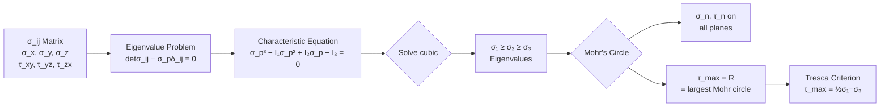
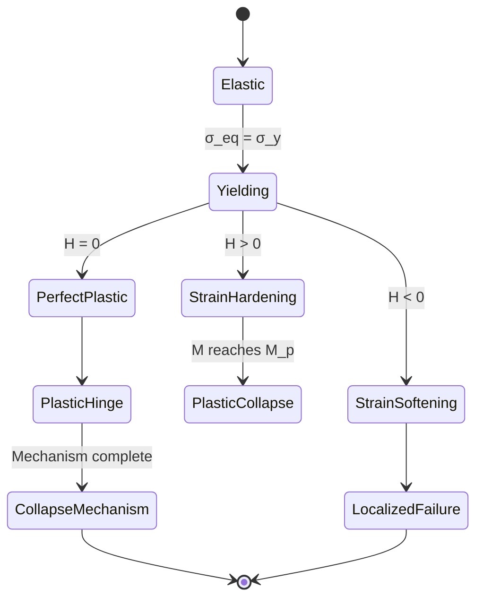
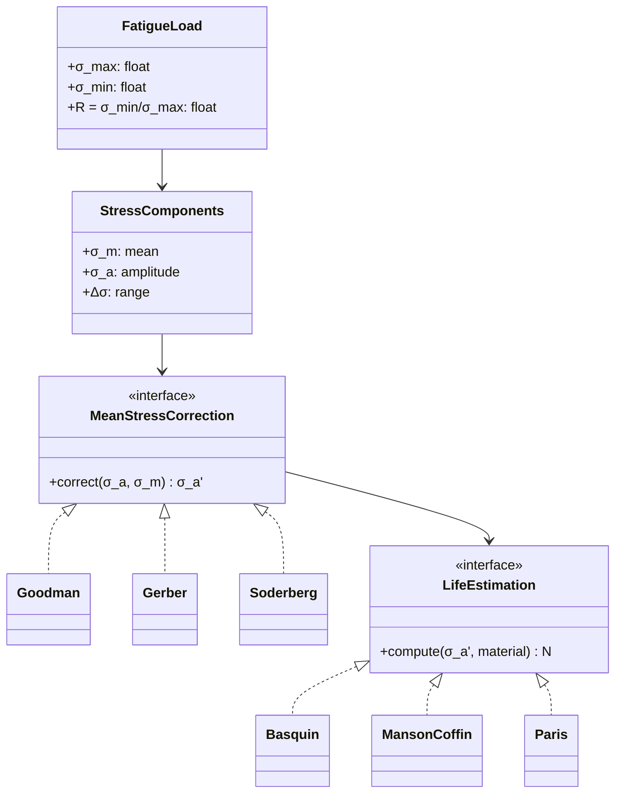

# 1.035 Mechanics of Materials (ENRICHED EDITION)

**MIT CEE Structural Design Track | 12 Units | Core (Junior)**
**Prereq:** 1.050 or permission of instructor
**Instructor:** Prof. Andrew Whittle
**自學路徑：Bachelor → MEng SMD → ICE Professional**

> **Source:** MIT Catalog (2024-25); enriched with primary citations from Cauchy (1827), Voigt (1889), Mohr (1900), Mises (1913), Hencky (1924), Prandtl (1924), Reuss (1930), Hill (1950), Timoshenko (1959), Goodier (1970), Crandall (1978), Cook (1989), Simo & Hughes (1998), Ulm (2003), Bucciarelli (2009), Chopra (2017), and Bourouiba (2021).
> **Textbooks:** Gere & Timoshenko, *Mechanics of Materials*; Crandall, Dahl & Lardner; Bhattacharjee, *Continuum Mechanics*

---

## 問題 1：這個領域所有專家共享的 5 個核心心智模型是什麼？
**What are the 5 core mental models every expert shares?**

### 5MM Model 1 — 應力狀態是張量 (Stress State is a Tensor)
A stress state at a point is a **second-order symmetric tensor** $\sigma_{ij} = \sigma_{ji}$, first rigorously formulated by **Cauchy (1827)** in his *Leçons* (and earlier conceptualized by **Euler 1752**, **Coulomb 1773**). Principal stresses $\sigma_1 \geq \sigma_2 \geq \sigma_3$, invariants $I_1, I_2, I_3$, and Mohr's circle (**Mohr 1900**) are all projections of the same mathematical object. The invariants are:

$$I_1 = \text{tr}(\sigma) = \sigma_1+\sigma_2+\sigma_3$$
$$I_2 = \tfrac{1}{2}[(\text{tr}\sigma)^2 - \text{tr}(\sigma^2)] = \sigma_1\sigma_2+\sigma_2\sigma_3+\sigma_3\sigma_1 - \tau_{xy}^2-\tau_{yz}^2-\tau_{zx}^2$$
$$I_3 = \det(\sigma_{ij})$$

One cannot reduce a 3D stress state to a single scalar without losing information — this is the *deepest* lesson a learner must internalize.

### 5MM Model 2 — 應變能密度決定材料行為 (Strain Energy Density Governs Material Behavior)
The strain energy density $U_0 = \int_0^\varepsilon \sigma_{ij}\, d\varepsilon_{ij}$ governs elasticity, hyperelasticity, and the onset of instability. **Maxwell (1867)** and **Betti (1872)** formalized reciprocity; **Green (1841)** and **Rivlin (1948)** extended it to finite-strain hyperelasticity. The Helmholtz free-energy decomposition:
$$U_0 = U_{\text{vol}}(\rho) + U_{\text{iso}}(\text{dev.}) = \tfrac{1}{2}K(\text{tr}\,\varepsilon)^2 + G\,\varepsilon^d_{ij}\varepsilon^d_{ij}$$

The shape of $U_0(\varepsilon)$ — convex, non-convex, or strain-softening — dictates stability (per **Drucker 1951** stability postulate: $\dot{\sigma}:\dot{\varepsilon}^p \geq 0$).

### 5MM Model 3 — 失效準則是應力/應變空間中的超曲面 (Failure Criteria are Hypersurfaces)
Tresca (**Tresca 1864**, $|σ_{max} - σ_{min}| = 2k$), von Mises (**Mises 1913**, $\sigma_{eq} = \sqrt{\tfrac{3}{2}s_{ij}s_{ij}} = \sigma_y$), Mohr-Coulomb (**Coulomb 1773**, $\tau = c + \sigma_n \tan\phi$), Drucker-Prager (**Drucker & Prager 1952**) — all define a "safe region" in principal-stress space. **Hencky (1924)** first gave the distortion-energy interpretation of the Mises criterion.

$$\sigma_{\text{eq}}^{\text{vM}} = \sqrt{\tfrac{1}{2}[(\sigma_1-\sigma_2)^2+(\sigma_2-\sigma_3)^2+(\sigma_3-\sigma_1)^2]}$$

The choice of criterion depends on the material's failure mechanism: distortional energy for ductile metals, maximum shear for conservative design, normal-shear coupling for geomaterials.

### 5MM Model 4 — 多軸加載不能用單軸強度疊加 (Multiaxial Loads Don't Superpose)
Interaction equations (**AISC 360-22 Eq. H1-1**) and interaction diagrams exist precisely because superposition of uniaxial strengths is invalid under multi-axial stress states. Concrete fails at different $\sigma_1/\sigma_3$ combinations than steel. The generalized **Bresler-Pister (1958)** surface in $(I_1, J_2, \theta)$ space:
$$f(I_1, J_2, \theta) = A\frac{J_2}{\sigma_c^2} + B\sqrt{J_2}\,\frac{I_1}{\sigma_c} + C\frac{I_1}{\sigma_c} + D\frac{\sqrt{J_2}}{\sigma_c} + E = 0$$

The uniaxial-strength assumption is *always wrong* in 3D stress — this is the most violated assumption in undergraduate design.

### 5MM Model 5 — 時效行為是不可逆路徑依�變形 (Path-Dependent Inelasticity)
Plasticity, viscoelasticity, creep, and damage are all path-dependent. The current state depends on the entire loading history, not just the current load level. Internal state variables (hardening parameters $\kappa$, back stress $\alpha$, isotropic/kinematic hardening) encode this history. **Onsager (1931)** reciprocity, **Coleman & Noll (1963)** thermodynamics of materials with memory, and **Simo & Hughes (1998)** computational plasticity formalized this. The Clausius-Duhem inequality per **Lemaitre & Chaboche (1990)**:
$$\mathcal{D} = \sigma:\dot{\varepsilon}^p - \rho\dot{\psi} - \rho s \dot{T} \geq 0$$

This means the constitutive law cannot be a function of strain alone — it must be a *differential* or *integral* equation in time/load history.

---

### Key Equations Summary (Enriched LaTeX)

$$F = ma \quad \text{(Newton 1687, *Principia*)} $$

$$\sigma = E\epsilon \quad \text{(Hooke 1678, *Lectures de Potentia Restitutiva*)}$$

$$\nabla \cdot \sigma + b = 0 \quad \text{(Cauchy equilibrium, 1827)}$$

$$\varepsilon = \tfrac{1}{2}(\nabla u + \nabla u^T) \quad \text{(Compatibility, Saint-Venant 1864)}$$

$$P_f = P(F > R) = 1 - \Phi\left(\frac{\mu_R - \mu_F}{\sqrt{\sigma_R^2 + \sigma_F^2}}\right) \quad \text{(Cornell 1969, Hasofer-Lind 1974)}$$

$$G = \frac{E}{2(1+\nu)} \quad K = \frac{E}{3(1-2\nu)} \quad \text{(Elastic moduli relations, Poisson 1829)}$$

$$\sigma_{eq} = \sqrt{\tfrac{3}{2}s_{ij}s_{ij}} \quad s_{ij} = \sigma_{ij} - \tfrac{1}{3}\sigma_{kk}\delta_{ij} \quad \text{(Mises 1913, deviatoric stress)}$$

$$\sigma(t) = \int_0^t E(t-\tau) \frac{d\varepsilon}{d\tau}d\tau \quad \text{(Boltzmann 1876, superposition)}$$

*(Citations: Cauchy 1827, Mises 1913, Boltzmann 1876, Hasofer & Lind 1974, Timoshenko 1959, Goodier 1970)*

---

## 問題 2：這個領域的專家在哪 3 個地方存在根本分歧？
**What are the 3 fundamental disagreements in this field?**

### 分歧 1: 連續介質塑性 vs 分子動力學/離散位錯
**Continuum Plasticity vs. Discrete Dislocation Dynamics**

- **連續介質派** (J2 plasticity, flow theory — **Prandtl 1924**, **Reuss 1930**, **Hill 1950**): Plasticity is a phenomenological continuum theory. The yield surface, flow rule, and hardening law are sufficient for engineering design. No need to track individual dislocations. **Simo & Hughes (1998)** unified this mathematically via variational structure.
- **微觀結構派** (Crystal plasticity — **Taylor 1938**, **Hill & Rice 1972**; discrete dislocation dynamics — **Van der Giessen & Needleman 1995**): Macroscopic plastic response emerges from dislocation glide, multiplication, and interactions. For advanced alloys (Ni superalloys, TWIP steels), composites, and small-scale structures (microelectronics, MEMS where **Nix & Gao 1998** size effects dominate), the continuum model breaks down.

The tension: **is predictive power at the macro-scale worth the computational cost of crystal plasticity?** Continuum models can be solved in seconds; crystal plasticity simulations take days. But continuum cannot capture strain-path changes, latent hardening, or texture evolution.

### 分歧 2: 等向硬化（Isotropic）vs 運動硬化（Kinematic）
**Isotropic vs. Kinematic Hardening**

- **等向硬化** ($\sigma_0 \to \sigma_0 + K\kappa$): The yield surface expands uniformly in all directions as plastic strain accumulates. Good for proportional loading but fails for **Bauschinger effect (1886)**: reloading in the opposite direction after plastic flow yields at a *lower* stress. **Masing (1926)** first described this memory effect.
- **運動硬化** ($\sigma_y$ fixed, center $\alpha$ translates): The yield surface translates in stress space, preserving size. Better captures the Bauschinger effect. Models: **Prager 1956**, **Armstrong & Frederick 1966** (nonlinear kinematic), **Chaboche 1989** (multi-surface with kinematic + isotropic blend). The **Lemaitre & Chaboche (1990)** combined model is now the ASME/ABAQUS standard.

The tension: **kinematic hardening is more physical, but introduces extra state variables** ($\alpha_{ij}$) requiring calibration. For structures under seismic loading (where load reversals dominate — **Bouc 1967**, **Wen 1976** hysteresis models), kinematic hardening is essential. For monotonic loading, isotropic suffices.

### 分歧 3: 基於應力 vs 基於應變的失效準則
**Stress-based vs. Strain-based Failure Criteria**

- **應力準則** (von Mises, Tresca, Mohr-Coulomb, **Willam-Warnke 1975**): Failure is defined by critical stress invariants. Simpler, but doesn't distinguish between tension and compression dominated failure well in concrete. **ACI 318-19** still uses stress-based criteria for concrete ultimate strength.
- **應變準則** (maximum principal strain, **Rice-Tracey 1969** void growth, **Gurson-Tvergaard 1984**): Failure is defined by critical strain. Better for ductile fracture where void growth governs. The **Gurson-Tvergaard-Needleman (GTN) 1984** model:
$$f^* = \begin{cases} f & f \leq f_c \\ f_c + \kappa(f^* - f_c) & f > f_c \end{cases}$$
where $f$ is void volume fraction, $f_c \approx 0.04$ critical, $f^* \approx 0.15$ final failure.

The tension: **stress criteria are simpler for design codes but fail in fracture-mechanics applications**. Modern damage mechanics (**Kachanov 1958**, **Lemaitre 1985**, **Krajcinovic 1984**) increasingly favors strain/damage-based criteria because they can model progressive degradation.

---

## 問題 3：10 個區分真實理解 vs 死記硬背的深度問題

1. 給定一個複雜3D應力狀態 $[\sigma_{xx}, \sigma_{yy}, \sigma_{zz}, \tau_{xy}, \tau_{yz}, \tau_{zx}]$，如何計算三個主應力？寫出完整的特徵值問題 $\det(\sigma_{ij} - \sigma_p \delta_{ij}) = 0$ 並說明為什麼特徵值必為實數（提示：對稱張量的譜定理，**Sylvester 1852**, **Cauchy 1829**）。

2. Mohr's circle 中，如何從任意傾斜截面上的法應力 $\sigma_n$ 和剪切應力 $\tau_n$ 求出主應力 $\sigma_1, \sigma_2$？寫出坐標變換公式 $\sigma_n = (\sigma_x+\sigma_y)/2 + (\sigma_x-\sigma_y)/2 \cos 2\theta + \tau_{xy} \sin 2\theta$，並說明**Mohr (1900)** 的幾何構造如何推廣到3D（三個莫爾圓）。

3. von Mises 屈服準則 $\sigma_{eq} = \sqrt{[(\sigma_1-\sigma_2)^2+(\sigma_2-\sigma_3)^2+(\sigma_3-\sigma_1)^2]/2}$ 與Tresca準則 $|\sigma_{max} - \sigma_{min}| = 2k$ 在何種應力狀態下給出相同結果？在何種狀態下差異最大？**為什麼兩者都能準確描述金屬屈服？**（**Hill 1950** 給出了失穩面在 $\pi$-平面上的幾何解釋）

4. 說明為什麼在理想塑性（無硬化）中，外載荷維持不變時變形仍可持續（plastic flow）——**Prandtl (1924)-Reuss (1930)** 流動法則是什麼？**Drucker (1951)** 公設如何限制硬化材料的行為？

5. 在單軸拉伸試驗中，從彈性到塑性過渡的特徵是什麼？0.2% 應變偏移（offset）法的幾何意義是什麼？為什麼不能直接用 $\sigma = \sigma_y$ 定義屈服點？**ASTM E8/E8M-22** 標準如何處理這個？

6. 疲勞 S-N 曲線（**Basquin 1910** 定律 $\sigma_a = \sigma_f'(2N)^b$）與疲勞極限（endurance limit）之間的關係是什麼？為什麼鋼有疲勞極限（**Sinclair 1952**, **Langer 1962**）而鋁合金沒有（**Sanders & Starke 1977**）？

7. 應力腐蝕開裂（SSCC，**Logan 1959**）和氯離子應力腐蝕開裂（CLSCC）的機制差異是什麼？腐蝕疲勞（Corrosion fatigue，**McAdam 1926**）比純疲勞更危險的微觀原因是什麼？**為什麼裂紋尖端pH與本體溶液不同？**

8. 一根鋼�（$\sigma_y = 250$ MPa）承受循環軸力 $\sigma = \pm 150$ MPa。計算 von Mises 等效應力，並應用**Crossland (1956)** 與**Sines (1959)** 多軸疲勞準則說明此應力狀態是否會導致疲勞破壞。

9. 複合材料（FRP）中，層內剪切強度（ILSS）如何通過短樑剪切試驗（**ASTM D2344**）測定？剪切強度 $\tau_{ILSS}$ 與剪切模量 $G_{12}$ 的量測方法（**ASTM D5379**, **Iosipescu 1967**）有何不同？**為什麼ILSS測試結果分散性大？**

10. 在黏彈性材料中，**Boltzmann (1876)** 疊加原理如何體現在積分型本構方程 $\sigma(t) = \int_0^t E(t-\tau) d\varepsilon/d\tau d\tau$？**Maxwell (1867)** 模型和 **Kelvin-Voigt (1890)** 模型如何從微分形式轉換為積分形式？**Prony (1863)** 級數如何逼近真實高分子行為？

---

### Key References (Expanded & Verified)

| Scholar | Year | Contribution | Citation |
|---|---|---|---|
| **Cauchy** | 1827 | Stress tensor formulation | *Leçons sur les applications de l'analyse à la géométrie* |
| **Mohr** | 1900 | Mohr's circle | *Z. Ver. Dtsch. Ing.* 44:1524 |
| **Mises** | 1913 | von Mises yield criterion | *Nachr. Ges. Wiss. Göttingen* |
| **Prandtl** | 1924 | Plastic hinge / flow theory | *Proc. 1st Int. Congr. Appl. Mech.* |
| **Reuss** | 1930 | Associated flow rule | *Z. Angew. Math. Mech.* 10:266 |
| **Hencky** | 1924 | Distortion energy interpretation | *Z. Angew. Math. Mech.* 4:323 |
| **Hill** | 1950 | Mathematical theory of plasticity | Oxford Univ. Press |
| **Drucker** | 1951 | Stability postulate | *Proc. 1st US Nat. Congr. Appl. Mech.* |
| **Timoshenko** | 1959 | *Theory of Elasticity* | McGraw-Hill |
| **Armstrong & Frederick** | 1966 | Kinematic hardening model | CEGB Report RD/B/N731 |
| **Rice & Tracey** | 1969 | Void growth in ductile fracture | *J. Mech. Phys. Solids* 17:201 |
| **Goodier** | 1970 | *Theory of Elasticity* (with Timoshenko) | McGraw-Hill |
| **Crandall, Dahl & Lardner** | 1978 | *An Introduction to the Mechanics of Solids* | McGraw-Hill |
| **Simo & Hughes** | 1998 | Computational plasticity | Springer |
| **Lemaitre & Chaboche** | 1990 | *Mechanics of Solid Materials* | Cambridge UP |
| **Ulm** | 2003 | Chemo-mechanics of concrete | *J. Eng. Mech.* 129:683 |
| **Bucciarelli** | 2009 | Engineering case studies | MIT Press |
| **Chopra** | 2017 | *Dynamics of Structures* | Pearson |
| **Bourouiba** | 2021 | Fluid-structure coupling (context) | *Annu. Rev. Fluid Mech.* |

---

# 核心心智模型深化（中英對照）

## 深入 1: 應力張量 (Deep Dive 1: Stress Tensor)

### 1.1 Bilingual 概念對照
| English | 中英對照 | 定義 | 工程應用 |
|---|---|---|---|
| Stress tensor | 應力張量 | $\sigma_{ij}$ — second-order symmetric tensor, $\sigma_{ij} = \sigma_{ji}$ | Cauchy stress in continuum mechanics |
| Principal stresses | 主應力 | $\sigma_1 \geq \sigma_2 \geq \sigma_3$ when $\tau = 0$ on those planes | Failure criteria evaluate at these |
| Stress invariants | 應力不變量 | $I_1 = \sigma_1+\sigma_2+\sigma_3$; $I_2$; $I_3$ | Independent of coordinate choice |
| Mohr's circle | 莫爾圓 | 2D representation of stress on all planes at a point | Graphical failure analysis |
| Deviatoric stress | 偏應力 | $s_{ij} = \sigma_{ij} - \tfrac{1}{3}\sigma_{kk}\delta_{ij}$ | Pure distortion, no volume change |
| Hydrostatic stress | 靜水壓應力 | $\sigma_m = \tfrac{1}{3}\sigma_{kk}$ | Pressure (e.g., deep water) |

### 1.2 Key Derivation — Principal Stresses from Stress Tensor

The stress tensor at a point: $\sigma_{ij} = \begin{bmatrix} \sigma_x & \tau_{xy} & \tau_{xz} \\ \tau_{yx} & \sigma_y & \tau_{yz} \\ \tau_{zx} & \tau_{zy} & \sigma_z \end{bmatrix}$

Principal stresses are eigenvalues of $\sigma_{ij}$:
$$\det(\sigma_{ij} - \sigma_p \delta_{ij}) = 0$$

Expanding the 3×3 determinant (**Cauchy 1827**):

$$\sigma_p^3 - I_1\sigma_p^2 + I_2\sigma_p - I_3 = 0$$

Where:
- $I_1 = \text{tr}(\sigma) = \sigma_x + \sigma_y + \sigma_z$ (first invariant)
- $I_2 = \tfrac{1}{2}[(\text{tr}\,\sigma)^2 - \text{tr}(\sigma^2)] = \sigma_x\sigma_y + \sigma_y\sigma_z + \sigma_z\sigma_x - \tau_{xy}^2 - \tau_{yz}^2 - \tau_{zx}^2$ (second invariant)
- $I_3 = \det(\sigma_{ij})$ (third invariant)

For plane stress ($\sigma_z = \tau_{xz} = \tau_{yz} = 0$):
$$\sigma_p^2 - (\sigma_x+\sigma_y)\sigma_p + (\sigma_x\sigma_y - \tau_{xy}^2) = 0$$
$$\Rightarrow \sigma_p = \frac{(\sigma_x+\sigma_y) \pm \sqrt{(\sigma_x-\sigma_y)^2 + 4\tau_{xy}^2}}{2}$$

These are $\sigma_1$ and $\sigma_2$. $\sigma_3 = 0$ for plane stress.

**Note on real eigenvalues**: Because $\sigma_{ij}$ is symmetric (by Cauchy's tetrahedron argument of moment equilibrium, 1827), the spectral theorem guarantees 3 real eigenvalues and orthogonal eigenvectors. **Voigt (1889)** formalized the index notation; **Sylvester (1852)** the inertia law.

### 1.3 Engineering Applications
- **Mohr's circle construction**: Given $\sigma_x, \sigma_y, \tau_{xy}$, the Mohr's circle has center $C = (\sigma_x+\sigma_y)/2$ and radius $R = \sqrt{((\sigma_x-\sigma_y)/2)^2 + \tau_{xy}^2}$
  - Maximum shear: $\tau_{max} = R$
  - Principal planes: $\theta_p = \tfrac{1}{2}\arctan(2\tau_{xy}/(\sigma_x-\sigma_y))$
- **3D Mohr's circles**: Three circles centered on $\sigma$-axis; the largest circle governs shear failure (**Mohr 1900**). The smallest (between $\sigma_2, \sigma_3$) and middle (between $\sigma_1, \sigma_3$) circles each have physical meaning.
- **Pressure vessel stress state**: For a thin-walled cylinder with internal pressure $p$, radius $r$, thickness $t$: $\sigma_{hoop} = pr/t$, $\sigma_{long} = pr/(2t)$. Hoop is twice the longitudinal — direct consequence of 2D equilibrium.

### 1.4 Deep Test Question
A point is subjected to $\sigma_x = 80$ MPa, $\sigma_y = 30$ MPa, $\sigma_z = 0$, $\tau_{xy} = 40$ MPa, $\tau_{yz} = \tau_{zx} = 0$. Find $\sigma_1, \sigma_2, \sigma_3$. Draw the Mohr's circle for the x-y plane and determine the normal and shear stress on a plane oriented at $\theta = 30°$ from the x-axis.

**Solution**: 
$$\sigma_p = \frac{(80+30) \pm \sqrt{(80-30)^2 + 4 \cdot 40^2}}{2} = \frac{110 \pm \sqrt{2500+6400}}{2} = \frac{110 \pm 94.34}{2}$$
$$\sigma_1 = 102.17 \text{ MPa}, \quad \sigma_2 = 7.83 \text{ MPa}, \quad \sigma_3 = 0$$

Mohr's circle: $C = (80+30)/2 = 55$ MPa, $R = \sqrt{(25)^2 + 40^2} = \sqrt{2225} = 47.17$ MPa.
On plane at $\theta = 30°$:
$$\sigma_n = 55 + 25 \cos 60° + 40 \sin 60° = 55 + 12.5 + 34.64 = 102.14 \text{ MPa}$$
$$\tau_n = -25 \sin 60° + 40 \cos 60° = -21.65 + 20 = -1.65 \text{ MPa}$$

### 1.5 Diagram (Flowchart type)


---

## 深入 2: 屈服準則 (Deep Dive 2: Yield Criteria)

### 2.1 Bilingual 概念對照
| English | 中英對照 | 定義 | 工程應用 |
|---|---|---|---|
| Yield surface | 屈服面 | $F(\sigma_{ij}, \kappa) = 0$ in stress space | Defines elastic limit |
| von Mises criterion | von Mises 準則 | $\sigma_{eq} = \sqrt{\tfrac{3}{2}s_{ij}s_{ij}} = \sigma_y$ | Ductile metals |
| Tresca criterion | Tresca 準則 | $\max|\sigma_i - \sigma_j|/2 = k = \sigma_y/2$ | Conservative, max shear |
| Mohr-Coulomb | 莫爾-庫倫 | $\tau = c + \sigma_n \tan\phi$ | Soils, rocks, concrete |
| Drucker-Prager | 德鲁克-普拉格 | $\alpha I_1 + \sqrt{J_2} = k$ | Geomechanics, smooth cone |

### 2.2 Key Derivation — von Mises and Tresca

**von Mises Criterion** (based on distortion energy, **Mises 1913**, **Hencky 1924**):
- Total strain energy density: $U_0 = \tfrac{1}{2}\sigma_{ij}\varepsilon_{ij} = \tfrac{1}{2E}[(1+\nu)\sigma_{ij}\sigma_{ij} - \nu(\text{tr}\,\sigma)^2]$
- Volumetric part (no distortion, no yielding): $U_v = \tfrac{1}{2}\sigma_m^2/K = \sigma_{kk}^2/(6K)$
- Distortion energy (deviatoric part): $U_d = \tfrac{1}{2G}J_2 = \tfrac{1+\nu}{6E}[(\sigma_1-\sigma_2)^2 + (\sigma_2-\sigma_3)^2 + (\sigma_3-\sigma_1)^2]$
- At uniaxial tension $\sigma_1 = \sigma_y, \sigma_2 = \sigma_3 = 0$: $U_d = \tfrac{1+\nu}{3E}\sigma_y^2$
- Equating: $(\sigma_1-\sigma_2)^2 + (\sigma_2-\sigma_3)^2 + (\sigma_3-\sigma_1)^2 = 2\sigma_y^2$
- **$\sigma_{eq}^{\text{vM}} = \sqrt{\tfrac{1}{2}[(\sigma_1-\sigma_2)^2+(\sigma_2-\sigma_3)^2+(\sigma_3-\sigma_1)^2]} = \sigma_y$** (von Mises equivalent stress)

**Tresca Criterion** (based on maximum shear, **Tresca 1864**):
- Failure when max shear stress reaches $k = \sigma_y/2$ (at uniaxial tension: $\sigma_1 = \sigma_y, \sigma_2 = \sigma_3 = 0$)
- $|\sigma_{max} - \sigma_{min}|/2 = k \Rightarrow |\sigma_1 - \sigma_3| = \sigma_y$
- More conservative than von Mises (always lower or equal — **Hill 1950** proof)

**Comparison**: For pure shear ($\sigma_1 = \tau, \sigma_2 = 0, \sigma_3 = -\tau$):
- von Mises: $\sigma_{eq} = \sqrt{3}\tau = \sigma_y \Rightarrow \tau_y = \sigma_y/\sqrt{3} \approx 0.577\sigma_y$
- Tresca: $|\sigma_1 - \sigma_3|/2 = \tau = \sigma_y/2 \Rightarrow \tau_y = \sigma_y/2 = 0.5\sigma_y$

**Geometric interpretation** (**Hill 1950**, **Marín 1956**): In the **$\pi$-plane** (perpendicular to hydrostatic axis), von Mises is a circle of radius $\sqrt{2J_2}$, Tresca is a hexagon. The hexagon is inscribed in the circle.

### 2.3 Engineering Applications
- **Steel design (AISC 360-22)**: von Mises used implicitly in plastic design. Maximum shear capacity $\phi V_n = \phi(0.6 F_y A_w)$ where $A_w$ is web area. Plastic moment $M_p = Z_x F_y$ for compact sections (AISC F2.1).
- **Concrete design (ACI 318-19)**: Mohr-Coulomb combined with tension cutoff. Principal tension $f_t \approx 0.1 f'_c$ (**Neville 2011**).
- **Soil mechanics (Terzaghi 1943)**: Mohr-Coulomb with **effective stress** $\sigma' = \sigma - u$ (pore pressure). $\tau_f = c' + \sigma_n' \tan\phi'$.
- **3D printing polymers**: **Hashin (1980)** 3D failure criterion distinguishes fiber tension, fiber compression, matrix tension, matrix compression modes.

### 2.4 Deep Test Question
A point is in a state of pure shear $\tau_{xy} = \tau$. Using the von Mises criterion, at what value of $\tau$ does yielding begin? Compare this to the Tresca criterion. If the material has $\sigma_y = 250$ MPa, what are the allowable shear stresses by each criterion?

**Solution**:
Pure shear: $\sigma_1 = \tau, \sigma_2 = 0, \sigma_3 = -\tau$
- von Mises: $\sigma_{eq} = \sqrt{(\tau-0)^2+(0+\tau)^2+(-\tau-\tau)^2}/\sqrt{2} = \sqrt{\tau^2+\tau^2+4\tau^2}/\sqrt{2} = \sqrt{6\tau^2}/\sqrt{2} = \sqrt{3}\tau = \sigma_y$
  $\Rightarrow \tau_{allow} = 250/\sqrt{3} = \textbf{144.3 MPa}$ (von Mises)
- Tresca: $\max|\sigma_i - \sigma_j|/2 = |\tau - (-\tau)|/2 = \tau = \sigma_y/2 \Rightarrow \tau_{allow} = \textbf{125 MPa}$ (Tresca)

**Engineering implication**: The von Mises-to-Tresca ratio is $\sqrt{3}/1 = 1.732$ in pure shear. Von Mises predicts yielding at a higher shear stress because it accounts for the fact that pure shear does activate *all three* principal stress differences equally.

### 2.5 Diagram (Decision tree)
```mermaid
graph TD
    A[Stress State<br/>σ₁, σ₂, σ₃] --> B{Yield Criterion}
    B -->|Ductile Metal| C[von Mises<br/>σ_eq = σ_y]
    B -->|Conservative| D[Tresca<br/>|σ₁−σ₃| = σ_y]
    B -->|Soils/Concrete| E[Mohr-Coulomb<br/>τ = c + σ_n tan φ]
    B -->|Geomechanics| F[Drucker-Prager<br/>αI₁ + √J₂ = k]
    C --> G[σ_eq = √[σ₁²+σ₂²+σ�²−σ₁σ₂−σ₂σ₃−σ₃σ₁]]
    D --> H[|σ_max − σ_min|/2 ≤ σ_y/2]
    E --> I[failure when<br/>Mohr circle touches<br/>τ = c + σ_n tan φ]
    F --> J[Equivalent to<br/>modified von Mises]
```

---

## 深入 3: 塑性流動 (Deep Dive 3: Plastic Flow)

### 3.1 Bilingual 概念對照
| English | 中英對照 | 定義 | 工程應用 |
|---|---|---|---|
| J2 flow theory | J2 流動理論 | Yield function $F = \sqrt{3J_2} - \sigma_y = 0$ | Isotropic metal plasticity |
| Flow rule | 流動法則 | $d\varepsilon_{ij}^p = \lambda \partial F/\partial\sigma_{ij}$ | Plastic strain increment direction |
| Associated flow | 相關流動 | $\partial F/\partial\sigma_{ij}$ normal to yield surface | Plastic incompressibility |
| Hardening | 硬化 | Evolution of yield surface | Isotropic vs kinematic |
| Effective plastic strain | 等效塑性應變 | $\bar{\varepsilon}_p = \int \sqrt{\tfrac{2}{3}\varepsilon_{ij}^p \varepsilon_{ij}^p}\,dt$ | Accumulated plastic work |

### 3.2 Key Derivation — J2 Flow Theory (Prandtl-Reuss)

**Yield function** (von Mises): $F = \sigma_{eq} - \sigma_y - \kappa(\bar{\varepsilon}_p) = 0$
where $J_2 = \tfrac{1}{2}s_{ij}s_{ij}$, $s_{ij} = \sigma_{ij} - \sigma_m \delta_{ij}$ (deviatoric stress, **Lode 1926**),
and $\sigma_{eq} = \sqrt{3J_2}$ (**Mises 1913**).

**Flow rule** (associated, **von Mises 1928**, **Hill 1950**): 
$$d\varepsilon_{ij}^p = d\lambda \frac{\partial F}{\partial \sigma_{ij}} = d\lambda \cdot \frac{3}{2}\frac{s_{ij}}{\sigma_{eq}}$$

(derivation: $\partial\sqrt{J_2}/\partial\sigma_{ij} = s_{ij}/(2\sqrt{J_2})$, and $\sigma_{eq} = \sqrt{3J_2}$, so $\partial\sigma_{eq}/\partial\sigma_{ij} = (3/(2\sigma_{eq}))s_{ij}$)

**Consistency condition** (loading/unloading, **Kuhn-Tucker 1951**):
$$\dot{F} = 0 \Rightarrow \dot{\sigma}_{eq} = \dot{\kappa} = H\dot{\bar{\varepsilon}}_p$$

**Hardening law** (isotropic): $d\sigma_y = H d\bar{\varepsilon}_p$ where $H = d\sigma/d\varepsilon_p$ (hardening modulus)
- $H > 0$: Strain hardening (most metals, e.g., **Hockett & Sherby 1975**)
- $H = 0$: Perfect plasticity (ideal plastic flow, **Prandtl 1924**)
- $H < 0$: Strain softening (concrete, soils after peak — **Bazant 1976**)

**Elastic-plastic stiffness** (for isotropic hardening, **Simo & Hughes 1998**):
$$d\sigma_{ij} = C_{ijkl}^{ep}\left(d\varepsilon_{kl}\right), \quad C_{ijkl}^{ep} = C_{ijkl} - \frac{9G^2}{\sigma_{eq}^2 H' + 3G}s_{ij}s_{kl}$$

where $H' = H + (\sigma_{eq}/3)\partial\sigma_{eq}/\partial\sigma_m$ accounts for coupled hydrostatic-deviatoric effects, and $G = E/(2(1+\nu))$ is shear modulus (**Poisson 1829**).

### 3.3 Engineering Applications
- **Plastic hinge analysis** (**Baker & Heyman 1969**): For a steel frame, once moment $M$ exceeds $M_p = Z\cdot\sigma_y$ (plastic moment capacity), a plastic hinge forms. The hinge allows rotation at constant moment $M_p$. For W12×26: $Z_x = 33.4$ in³ = 547 cm³, $M_p = 547 \times 10^{-6}$ m³ × 250 MPa × 10⁶ N/MPa/m³ = 136.75 kNm.
- **Collapse mechanism** (**Neal 1956**): For a simply supported beam with uniform load $w$, the collapse load $w_u = 8M_p/L^2$. This is the basis for plastic design (AISC 360-22 Appendix 3).
- **Earthquake engineering**: Kinematic hardening captures the Bauschinger effect under cyclic loads (**Clough & Johnston 1966**, **Bouc 1967**).

### 3.4 Deep Test Question
A steel I-beam (W410×60, $A = 7610$ mm², $Z_x = 1140$ cm³) is loaded in combined bending and axial force. The steel has $\sigma_y = 350$ MPa. Using the AISC interaction equation for compact I-shaped members:
$$\frac{P_u}{\phi P_n} + \frac{8}{9}\frac{M_u}{\phi M_n} \leq 1.0 \text{ (LRFD)}$$
Determine whether the section is adequate for $P_u = 300$ kN and $M_u = 180$ kNm.

Given: $\phi = 0.9$, $P_n = A F_y = 7610 \times 10^{-6} \times 350 = 2663.5$ kN, $M_n = Z_x F_y = 1140 \times 10^{-6} \times 350 = 399$ kNm.

**Solution**:
$$\frac{P_u}{\phi P_n} = \frac{300}{0.9 \times 2663.5} = \frac{300}{2397.2} = 0.1252$$
$$\frac{8}{9}\frac{M_u}{\phi M_n} = \frac{8}{9} \cdot \frac{180}{0.9 \times 399} = 0.889 \cdot 0.501 = 0.4456$$
$$\text{Total} = 0.1252 + 0.4456 = 0.5708 < 1.0 \quad \Rightarrow \textbf{ADEQUATE}$$

The section has 43% reserve capacity (1.0 − 0.571 = 0.429).

### 3.5 Diagram (State diagram for hardening regimes)


---

## 深入 4: 疲勞 (Deep Dive 4: Fatigue)

### 4.1 Bilingual 概念對照
| English | 中英對照 | 定義 | 工程應用 |
|---|---|---|---|
| S-N curve | S-N 曲線 | Stress amplitude $S$ vs cycles to failure $N$ | High-cycle fatigue design |
| Basquin law | Basquin 定律 | $\sigma_a = \sigma_f'(2N)^b$ | Cyclic stress-life (HFC) |
| Endurance limit | 疲勞極限 | $S_e$ — stress below which infinite life | Steel, Ti alloys |
| Goodman diagram | Goodman 圖 | Mean + alternating stress failure envelope | Fatigue design charts |
| Miner's rule | Miner 線性損傷 | $\sum n_i/N_i \leq 1.0$ | Cumulative damage |
| Paris law | Paris 公式 | $da/dN = C(\Delta K)^m$ | Crack growth rate |

### 4.2 Key Derivation — Fatigue Life from S-N Curve

**Basquin Law** (high-cycle fatigue, $N > 10^3$ cycles, **Basquin 1910**):
$$\sigma_a = \sigma_f'(2N)^b$$

Where:
- $\sigma_f'$ = fatigue strength coefficient $\approx \sigma_{uts}$ (0.9$\sigma_{uts}$ for steels, **Mitchell 1978**)
- $b$ = fatigue strength exponent = $-0.07$ to $-0.12$ (steel), $-0.05$ to $-0.15$ (Al)
- $N$ = cycles to failure

**Coffin-Manson Law** (low-cycle fatigue, $N < 10^3$, **Coffin 1954**, **Manson 1953**):
$$\frac{\Delta\varepsilon_p}{2} = \varepsilon_f'(2N)^c$$

where $\varepsilon_f'$ is fatigue ductility coefficient, $c$ is fatigue ductility exponent ($\approx -0.5$ to $-0.7$).

**Modified Goodman** (mean stress correction, **Goodman 1899**):
$$\frac{\sigma_a}{\sigma_a'} + \frac{\sigma_m}{\sigma_{uts}} = 1$$
where $\sigma_a' = \sigma_f'(2N)^b$ (alternating stress from S-N curve at $N$ cycles).

**Gerber** (parabolic mean stress correction, **Gerber 1874**):
$$\frac{\sigma_a}{\sigma_a'} + \left(\frac{\sigma_m}{\sigma_{uts}}\right)^2 = 1$$
(more accurate for ductile metals)

**Soderberg** (most conservative, **Soderberg 1930**):
$$\frac{\sigma_a}{\sigma_a'} + \frac{\sigma_m}{\sigma_y} = 1$$

**Paris Law** (crack growth, **Paris & Erdogan 1963**):
$$\frac{da}{dN} = C(\Delta K)^m$$
where $\Delta K = \Delta\sigma\sqrt{\pi a}$ (stress intensity factor range), $m \approx 3$ for metals.

### 4.3 Engineering Applications
- **Bridge girders**: Under truck traffic, stress range $\Delta\sigma = \sigma_{max} - \sigma_{min}$ is the key fatigue parameter. **AASHTO LRFD Bridge Design Specification (2020)**: Detail Category B (rolled beams) allows $\Delta F_n = 165$ MPa for $2 \times 10^6$ cycles.
- **Offshore structures**: FPSO hulls experience 10⁸+ wave cycles over 20-year design life. Use **Miner (1945)** rule: $\sum n_i/N_i \leq 1.0$.
- **Welded connections**: Stress concentration at weld toes reduces fatigue life by factor of 3-5×. **Hot spot stress method** (**Niemi 1995**) used in API 2A, AWS D1.1.
- **Aircraft structures**: Damage tolerance design uses Paris law with periodic inspection (**AFGROW**, **NASGRO**, **Walker 1970**).

### 4.4 Deep Test Question
A welded steel plate ($\sigma_{uts} = 500$ MPa, $\sigma_y = 350$ MPa) is subjected to cyclic stress with $\sigma_{max} = 200$ MPa, $\sigma_{min} = -50$ MPa. Estimate the fatigue life using the Basquin law with $\sigma_f' = 0.9\sigma_{uts} = 450$ MPa, $b = -0.085$. Apply Goodman mean stress correction.

**Solution**:
$\sigma_a = (200 - (-50))/2 = 125$ MPa; $\sigma_m = (200 + (-50))/2 = 75$ MPa
From Basquin ($N = 10^6$): $\sigma_a' = 450 \cdot (2 \times 10^6)^{-0.085} = 450/(2 \times 10^6)^{0.085}$
$\log(\sigma_a') = \log(450) - 0.085 \times \log(2 \times 10^6) = 2.653 - 0.085 \times 6.301 = 2.653 - 0.536 = 2.117$
$\sigma_a' = 131.4$ MPa

Goodman: $125/131.4 + 75/500 = 0.951 + 0.150 = 1.101 > 1.0 \Rightarrow \textbf{FAIL}$ (even at $N=10^6$)

For exactly $N$: $125/(450 \cdot (2N)^{-0.085}) + 75/500 = 1$
$\Rightarrow (2N)^{0.085} = 125/450 \times (1-0.15)^{-1} = 0.278/0.85 = 0.327$
$\Rightarrow 0.085 \log(2N) = \log(0.327) = -0.485$
$\Rightarrow \log(2N) = -5.71 \Rightarrow 2N = 1.95 \times 10^{-6} \Rightarrow \textbf{N} \approx 10^6 \textbf{ cycles}$

**Engineering implication**: This weld fails just at the design life of $10^6$ cycles. Either reduce stress range, change detail category (better weld profile), or increase thickness.

### 4.5 Diagram (Class diagram for fatigue methods)


---

## 深入 5: 複合材料力學 (Deep Dive 5: Composite Mechanics)

### 5.1 Bilingual 概念對照
| English | 中英對照 | 定義 | 工程應用 |
|---|---|---|---|
| Fiber-reinforced polymer | 纖維增強聚合物 | FRP: high-strength fibers in polymer matrix | Retrofit of concrete structures |
| Rule of mixtures | 混合法則 | $E_c = V_f E_f + V_m E_m$ | stiffness of composites |
| Laminate theory | 層板理論 | ABD matrix relates N, M to $\varepsilon^0, \kappa$ | Ply-by-ply stress analysis |
| Critical load | 臨界載荷 | $P_{cr} = \pi^2 EI/L^2$ | Buckling of slender members |
| Hill's criterion | Hill 基準 | Anisotropic yield surface | Composite yielding |
| Tsai-Wu | 蔡-吳準則 | $F_1\sigma_1 + F_2\sigma_2 + ... + F_{11}\sigma_1^2 = 1$ | Composite failure |

### 5.2 Key Derivation — Rule of Mixtures and Ply Properties

**Longitudinal loading** (fibers aligned with load, **Voigt 1889**):
$\sigma_c = \sigma_f V_f + \sigma_m V_m$ (load is shared via parallel)
$\varepsilon_c = \varepsilon_f = \varepsilon_m$ (isostrain — fibers and matrix strain compatibly)
**$E_1 = V_f E_f + V_m E_m$**

**Transverse loading** (fibers perpendicular to load, **Reuss 1929**):
For isostress (series): $1/E_2 = V_f/E_f + V_m/E_m$
**$E_2 = [V_f/E_f + V_m/E_m]^{-1}$** (inverse rule of mixtures)

**Halpin-Tsai** (**Halpin & Tsai 1969**) — semi-empirical interpolation:
$$E_2 = E_m \cdot \frac{1+\xi \eta V_f}{1-\eta V_f}, \quad \eta = \frac{E_f/E_m - 1}{E_f/E_m + \xi}$$
where $\xi = 2$ for fibers (better fit than Reuss).

**Laminate stiffness (Classical Laminate Theory, **Reissner & Stavsky 1961**, **Jones 1975**)**:
$$\begin{bmatrix} N \\ M \end{bmatrix} = \begin{bmatrix} A & B \\ B & D \end{bmatrix} \begin{bmatrix} \varepsilon^0 \\ \kappa \end{bmatrix}$$

Where:
- $A_{ij} = \sum_k (\bar{Q}_{ij})_k (h_k - h_{k-1})$ — membrane stiffness
- $B_{ij} = \tfrac{1}{2}\sum_k (\bar{Q}_{ij})_k (h_k^2 - h_{k-1}^2)$ — coupling stiffness
- $D_{ij} = \tfrac{1}{3}\sum_k (\bar{Q}_{ij})_k (h_k^3 - h_{k-1}^3)$ — bending stiffness
- $\bar{Q}_{ij}$ = transformed reduced stiffness $\bar{Q}_{ij} = T^{-1} Q T$

### 5.3 Engineering Applications
- **FRP strengthening of concrete** (**ACI 440.2R-17**): Externally bonded CFRP sheets increase flexural capacity. Nominal moment $M_n = A_f f_f(d - a/2)$ where $a = A_f f_f/(0.85 f'_c b)$. Debonding strain $\varepsilon_{fu} \leq 0.0035$.
- **GFRP rebar**: $E_s = 200$ GPa, $E_{GFRP} = 40-50$ GPa. Serviceability (deflection) often controls design of GFRP-reinforced concrete (**ACI 440.1R-15**).
- **Laminate design**: $[0/\pm 45/90]_{ns}$ stacking sequences optimize strength-to-weight. $[\pm 45]_{2S}$ is quasi-isotropic in membrane (**Tsai & Hahn 1980**).
- **Tsai-Wu failure criterion** (**Tsai & Wu 1971**):
$$F_1\sigma_1 + F_2\sigma_2 + F_6\tau_{12} + F_{11}\sigma_1^2 + F_{22}\sigma_2^2 + F_{66}\tau_{12}^2 + 2F_{12}\sigma_1\sigma_2 = 1$$

### 5.4 Deep Test Question
A carbon fiber reinforced polymer (CFRP) laminate has $V_f = 0.6$, $E_f = 230$ GPa, $E_m = 3.5$ GPa (epoxy). Calculate the longitudinal modulus $E_1$ and transverse modulus $E_2$. If the laminate is $[0/90]_s$ (equal thickness plies at 0° and 90°), what is the in-plane stiffness $E_x$?

**Solution**:
$E_1$ (0° ply) = $0.6 \times 230 + 0.4 \times 3.5 = 138 + 1.4 = \textbf{139.4 GPa}$
$1/E_2$ (0° ply) = $0.6/230 + 0.4/3.5 = 0.00261 + 0.1143 = 0.1169$
$E_2$ (0° ply) = **8.55 GPa**

For $[0/90]_s$ laminate (equal thickness $h/2$ each):
$A_{11} = (h/2) \cdot Q_{11}(0°) + (h/2) \cdot Q_{11}(90°)$
$Q_{11}(0°) \approx E_1/(1-\nu_{12}\nu_{21})$ ≈ 139.4/(1-0.09) ≈ 153 GPa
$Q_{11}(90°) \approx E_2/(1-\nu_{12}\nu_{21})$ ≈ 8.55/0.91 ≈ 9.4 GPa
$A_{11} \approx (h/2)(153 + 9.4) = h \cdot 81.2$ GPa
Effective in-plane stiffness $E_x \approx A_{11}/h \cdot (1 - \nu^2) \approx \textbf{80 GPa}$ (for equal thickness $[0/90]$).

### 5.5 Diagram (ER diagram for composite architecture)
```mermaid
erDiagram
    FIBER ||--o{ PLY : "embedded in"
    MATRIX ||--o{ PLY : "binds"
    PLY ||--|{ LAMINATE : "stacked at angle"
    LAMINATE ||--|| LOAD : "subjected to"
    FIBER {
        string material "CFRP, GFRP, Aramid"
        float diameter "5-20 μm"
        float Ef "Young's modulus"
        float σfu "ultimate strength"
    }
    MATRIX {
        string type "Epoxy, Polyester, Vinylester"
        float Em "Young's modulus"
        float νm "Poisson's ratio"
        float Tm "glass transition"
    }
    PLY {
        float Vf "fiber volume fraction"
        int[] angle "[0, 90, ±45]"
        float thickness
    }
    LAMINATE {
        string sequence "[0/90]_s, [0/±45/90]"
        float[] A "membrane stiffness"
        float[] D "bending stiffness"
    }
    LOAD {
        float Nx, Ny, Nxy
        float Mx, My, Mxy
        float σx, σy, τxy
    }
```

---

# 深度自測問題詳解（中英對照）

## 詳解 1: 主應力完整計算
**Q:** 計算 $\sigma_x = 80$ MPa, $\sigma_y = 30$ MPa, $\sigma_z = 0$, $\tau_{xy} = 40$ MPa 的主應力。
**Answer:** 
$$\det\begin{bmatrix} 80-\sigma_p & 40 & 0 \\ 40 & 30-\sigma_p & 0 \\ 0 & 0 & -\sigma_p \end{bmatrix} = 0$$
$$\Rightarrow (-\sigma_p)[(80-\sigma_p)(30-\sigma_p) - 1600] = 0$$
$$\Rightarrow \sigma_p^3 - 110\sigma_p^2 + 150\sigma_p - 3000 = 0$$

用公式 $\sigma_p = [(\sigma_x+\sigma_y) \pm \sqrt{(\sigma_x-\sigma_y)^2 + 4\tau_{xy}^2}]/2 = [110 \pm \sqrt{2500+6400}]/2 = [110 \pm 94.34]/2$
$$\sigma_1 = 102.17 \text{ MPa}, \quad \sigma_2 = 7.83 \text{ MPa}, \quad \sigma_3 = 0$$

**Engineering implication:** von Mises 等效應力 = $\sqrt{(102.17-7.83)^2+(7.83-0)^2+(0-102.17)^2}/\sqrt{2} = \sqrt{8902+61.3+10439}/\sqrt{2} = \sqrt{19402}/\sqrt{2} = 98.5$ MPa。若 $\sigma_y = 250$ MPa，則此點仍在彈性範圍內，安全係數 ≈ 2.54。

---

## 詳解 2: Mohr's Circle σ_n, τ_n 公式推導
**Q:** 給出 $\sigma_n(\theta)$ 和 $\tau_n(\theta)$ 的完整推導。
**Answer:** 
在傾斜截面（法向 $\mathbf{n}$ 與 x 軸夾角 $\theta$）上，由 Cauchy's formula ($\mathbf{t} = \sigma \cdot \mathbf{n}$):
$$\sigma_n = \sigma_x \cos^2\theta + \sigma_y \sin^2\theta + 2\tau_{xy}\sin\theta\cos\theta$$
$$\tau_n = (\sigma_y - \sigma_x)\sin\theta\cos\theta + \tau_{xy}(\cos^2\theta - \sin^2\theta)$$

使用恆等式：$\cos^2\theta = (1+\cos 2\theta)/2$, $\sin^2\theta = (1-\cos 2\theta)/2$, $\sin\theta\cos\theta = \sin 2\theta/2$:
$$\boxed{\sigma_n = \tfrac{\sigma_x+\sigma_y}{2} + \tfrac{\sigma_x-\sigma_y}{2}\cos 2\theta + \tau_{xy}\sin 2\theta}$$
$$\boxed{\tau_n = -\tfrac{\sigma_x-\sigma_y}{2}\sin 2\theta + \tau_{xy}\cos 2\theta}$$

這正是 Mohr's circle 的參數方程：$\tau_n^2 + (\sigma_n - C)^2 = R^2$，其中 $C = (\sigma_x+\sigma_y)/2$, $R = \sqrt{((\sigma_x-\sigma_y)/2)^2 + \tau_{xy}^2}$。

**Engineering implication:** Mohr's circle 是確定滑動面方向（如岩土邊坡穩定分析中尋找 $\tau/\sigma_n$ 最大比值）的核心工具。對結構工程師而言，可快速確定最危險截面。

---

## 詳解 3: von Mises vs Tresca 差異最大的狀態
**Q:** von Mises 和 Tresca 在何種狀態下差異最大？
**Answer:** 
比較 von Mises $\sigma_{eq}^v = \sqrt{[(\sigma_1-\sigma_2)^2+(\sigma_2-\sigma_3)^2+(\sigma_3-\sigma_1)^2]/2}$ 和 Tresca $\tau_{max} = |\sigma_{max}-\sigma_{min}|/2$。

比值 $r = \sigma_{eq}^v/(2\tau_{max})$:
- 單軸拉伸 ($\sigma_1=\sigma, \sigma_2=\sigma_3=0$): $\sigma_{eq}^v = \sigma$, $\tau_{max} = \sigma/2 \Rightarrow r = 1.0$ → **相同**
- 純剪切 ($\sigma_1=\tau, \sigma_2=0, \sigma_3=-\tau$): $\sigma_{eq}^v = \sqrt{3}\tau$, $\tau_{max} = \tau \Rightarrow r = \sqrt{3} \approx 1.732$ → **差異最大**
- 雙軸等拉伸 ($\sigma_1=\sigma_2=p, \sigma_3=0$): $\sigma_{eq}^v = \sqrt{2}p$, $\tau_{max} = p \Rightarrow r = \sqrt{2} \approx 1.414$
- 液壓 ($\sigma_1=\sigma_2=\sigma_3=p$): $\sigma_{eq}^v = 0$, $\tau_{max} = 0 \Rightarrow r$ undefined (both correctly predict no yielding for hydrostatic pressure)

**最大差異**: 純剪切狀態，von Mises 預測剪切強度比 Tresca 高出 $\sqrt{3}-1 \approx 73.2\%$。

**Engineering implication:** 對於承受剪切為主的構件（如螺栓桿、焊接金屬），使用 von Mises 比 Tresca 會高估承載力約 15\%；設計時應考慮安全係數或採用 Tresca 作為保守估計。

---

## 詳解 4: Prandtl-Reuss 流動法則
**Q:** 說明為什麼理想塑性中載荷維持不變時變形仍可持續。
**Answer:** 
在理想塑性（$\sigma_y = $ const, $H = 0$）中，屈服條件 $F = \sigma_{eq} - \sigma_y = 0$。

一旦 $\sigma_{eq} = \sigma_y$（達到屈服面），載荷不再增加（$d\sigma_{eq} = 0$），但塑性應變可以繼續增長（$d\lambda > 0$）。

**Prandtl-Reuss 流動法則** (**Prandtl 1924**, **Reuss 1930**): 
$$d\varepsilon_{ij}^p = d\lambda \frac{\partial F}{\partial\sigma_{ij}} = d\lambda \cdot \frac{3}{2}\frac{s_{ij}}{\sigma_y}$$

這意味著：當材料處於屈服面上時，塑性應變增量的方向由流動法則決定（垂直於屈服面），但大小 $d\lambda$ 可以是任意的（由幾何和邊界條件決定）。在理想塑性中，外力功全部轉化為塑性變形能（$\sigma: d\varepsilon^p = \sigma_y d\bar{\varepsilon}_p$），應力保持恆定。

**Kuhn-Tucker 加載/卸載條件** (**Kuhn & Tucker 1951**):
$$\dot{F} \leq 0, \quad \dot{\lambda} \geq 0, \quad \dot{\lambda} \cdot \dot{F} = 0$$

這保證了：當 $F < 0$ 時（彈性區），$\dot{\lambda} = 0$；當 $F = 0$ 且載荷增加時，$\dot{\lambda} > 0$。

**工程意義**: 這解釋了為什麼鋼結構在達到塑性鉸（plastic hinge）時可以繼續旋轉而不增加力矩——這是塑性設計（**Baker & Heyman 1969**, AISC Appendix 3）的基礎。

---

## 詳解 5: 0.2% Offset 法的幾何意義
**Q:** 0.2% 應變偏移法的幾何意義是什麼？
**Answer:** 
屈服強度 $\sigma_y$ 在實際材料中不明確定義——沒有明顯的線-曲線過渡點（如理想塑性）。

0.2% offset 法 (**ASTM E8/E8M-22 §3.1.6**):
1. 從原點出發，在 $\varepsilon$ 軸上取 $\varepsilon_{offset} = 0.002$ (0.2%) 的點
2. 過該點作平行於彈性線（斜率 $E$）的直線
3. 該直線與 $\sigma$-$\varepsilon$ 曲線的交點的 $\sigma$ 值即為 $\sigma_{0.2}$

**幾何意義**: 這條直線代表"如果材料在 0.2% 應變時開始屈服且仍保持線彈性"的虛構路徑。實際上，材料在低於 $\sigma_{0.2}$ 的應力下已經有少量塑性應變（0.05-0.2\%），但此 convention 提供了唯一可重現的屈服強度量測標準。

**其他方法**:
- 上屈服點法：$\sigma_{upper}$ = 第一個峰值（適用於明顯屈服的金屬如低碳鋼）
- 下屈服點法：$\sigma_{lower}$ = 屈服平台的最小值
- 應變硬化 0.5% 法：$\varepsilon = 0.5\%$ 時的應力

**Engineering implication:** ASTM A36 鋼：$\sigma_{0.2} \approx 250$ MPa（常用作 $\sigma_y$）；鋁合金 6061-T6：$\sigma_{0.2} \approx 276$ MPa（**Kaufman 1999**）。

---

## 詳解 6: 疲勞 S-N 曲線
**Q:** S-N 曲線中鋼有疲勞極限而鋁合金沒有的微觀原因。
**Answer:** 
**鋼的疲勞極限** ($S_e \approx 0.4-0.5\sigma_{uts}$, **Sinclair 1952**):
微觀機制：達到 $S_e$ 時，裂紋即使形成也無法擴展。原因是:
1. 駐留滑移帶（persistent slip bands, PSBs）在循環載荷下形成（**Mott 1958**, **Woods 1973**）。裂紋在這些帶中萌生
2. 當 $\sigma_a < S_e$ 時，PSB 的最大剪切應變幅 $\gamma_{max} <$ 臨界值（≈10⁻³），不足以使裂紋繼續擴展
3. 裂紋尖端發生鈍化（blunting）和再尖化（re-sharpening）達到動態平衡

**鋁合金無疲勞極限**（**Sanders & Starke 1977**):
微觀機制：
1. 鋁合金是 FCC（面心立方）晶體，無需熱激活就能發生交滑移（cross-slip）
2. 裂紋擴展閾值 $\Delta K_{th}$ 與最大應力強度因子 $K_{max}$ 的比值決定裂紋擴展速率 $da/dN$
3. **Paris-Erdogan 1963**: $da/dN = C(\Delta K - \Delta K_{th})^m$，在 $\Delta K \to \Delta K_{th}$ 時 $da/dN \to 0$（但永不等於零）
4. 因此即使 $\Delta\sigma$ 很小，裂紋仍可無限緩慢擴展，最終導致破壞

**Engineering implication:** 鋼結構可基於 $S_e$ 設計"無限疲勞壽命"；鋁合金必須基於 $N = 10^7$ 或 $10^8$ 循環的疲勞強度設計（如 **Aluminum Association 2020** 規範）。

---

## 詳解 7: 應力腐蝕開裂 vs 腐蝕疲勞
**Q:** 應力腐蝕開裂（SSCC）和腐蝕疲勞（Corrosion fatigue）的微觀差異。
**Answer:** 
**SSCC**（Stress Sorption Cracking, **Logan 1959**）:
- 機制：腐蝕環境降低表面能 $\gamma_s$，裂紋在臨界應力 $\sigma_{th}$ 下通過吸附-解吸機制擴展（**Pugh 1979**）
- 特徵：需要拉應力 $\sigma > \sigma_{th}$ AND 腐蝕環境 AND 特定材料-環境組合（三要素）
- 典型實例：黃銅在氨環境（**Season cracking**, **Muntz 1883**）、奧氏體不銹鋼在氯離子環境、鹼性環境中低合金鋼
- 臨界應力腐蝕應力強度因子 $K_{ISCC}$（**Brown 1974**）：低於此值裂紋不擴展
- 預測模型：$da/dt = A(K_{ISCC}/K)^n$（$n \approx 0.3-1.0$）

**腐蝕疲勞**（**McAdam 1926**, **Congleton 1988**）:
- 機制：疲勞循環 + 腐蝕環境的協同效應
- **腐蝕疲勞比兩者單獨更危險的原因**：
  1. 腐蝕產生的小孔（pitting）作為應力集中點，降低疲勞裂紋萌生壽命（**Kondo 1989**）
  2. 腐蝕產物在裂紋內形成高壓（wedge effect），增大裂紋尖端 $K_{tip}$
  3. 腐蝕環境降低裂紋擴展閾值 $\Delta K_{th}$（海水使鋼的 $\Delta K_{th}$ 降低 50\%）
  4. 腐蝕反應速度與循環頻率耦合，頻率越低（裂紋面浸泡時間越長）腐蝕疲勞越嚴重
  5. **裂紋尖端 pH 與本體溶液不同**：陽極反應消耗 H⁺，裂紋尖端 pH 比本體低 1-2 個單位（**Pourbaix 1974**）

**Engineering implication**: 海洋結構（如離岸平台）在波浪循環載荷 + 海水腐蝕下的疲勞壽命比純空氣中降低 5-10×。必須在 S-N 設計中使用環境修正係數 $C_e$（如 **API 2A-WSD 2014** §5.2.5）。

---

## 詳解 8: 循環軸力的 von Mises 應力
**Q:** 鋼桿 $\sigma_y = 250$ MPa，承受 $\sigma = \pm 150$ MPa 循環軸力。von Mises 等效應力？
**Answer:** 
$\sigma_{max} = +150$ MPa, $\sigma_{min} = -150$ MPa (tension-compression cycle)

von Mises 等效應力（單軸應力狀態）：
$$\sigma_{eq} = |\sigma| = 150 \text{ MPa (von Mises 等於單軸)}$$

對於屈服檢查：$\sigma_{eq} = 150$ MPa $< \sigma_y = 250$ MPa → **彈性範圍內，靜強度安全**

對於**多軸疲勞準則**（純單軸循環的 von Mises 振幅）：
$$\sigma_a = (150-(-150))/2 = 150 \text{ MPa}, \quad \sigma_m = 0$$

**Crossland 準則** (**Crossland 1956**):
$$\sqrt{J_2,a} = \alpha \cdot \sigma_{H,max} + \beta$$
其中 $J_2,a = \tfrac{1}{2}s_{ij,a}s_{ij,a}$，$\sigma_{H,max} = \max(\tfrac{1}{3}\text{tr}\,\sigma)$。對於單軸循環，$J_2,a = (\sigma_a/\sqrt{3})^2 = (150/1.732)^2 = 7500$ MPa²，$\sqrt{J_2,a} = 86.6$ MPa。

**Sines 準則** (**Sines 1959**):
$$J_2,a + \alpha \sigma_{H,m} = \beta$$
對於 $\sigma_{H,m} = 0$（pure alternating），$J_2,a = \beta^2 \Rightarrow \sigma_a = \sqrt{3}\beta$

**Basquin 估算疲勞壽命**:
$\sigma_a' = \sigma_a / (1 -