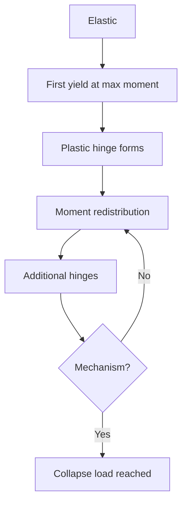
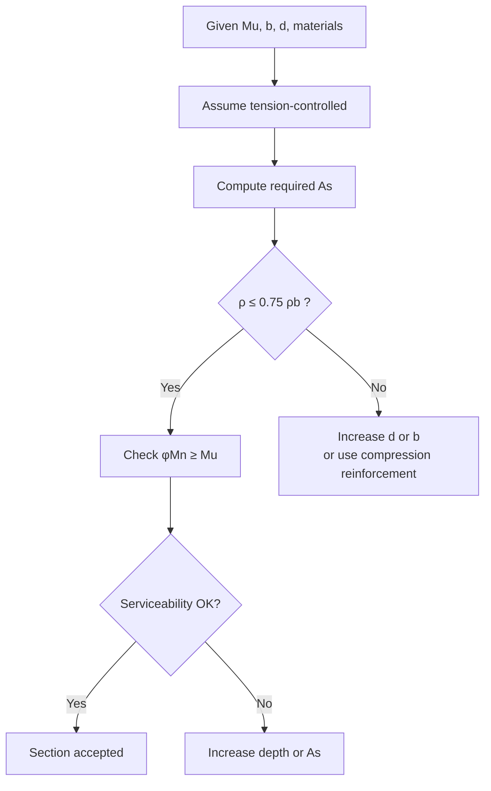
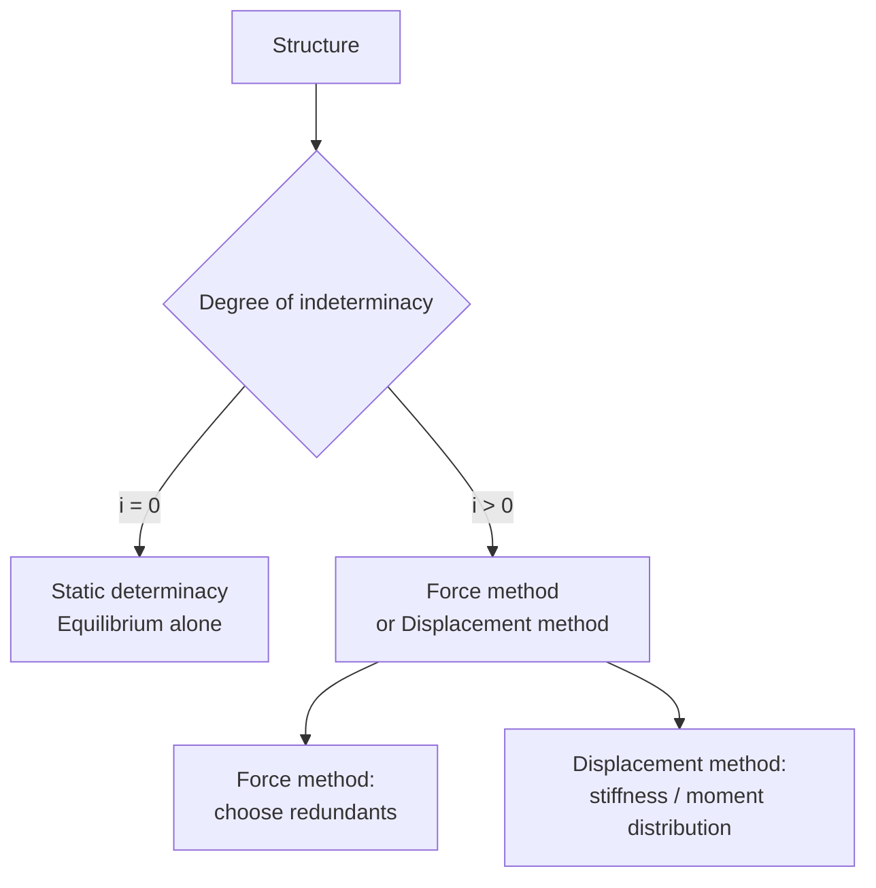
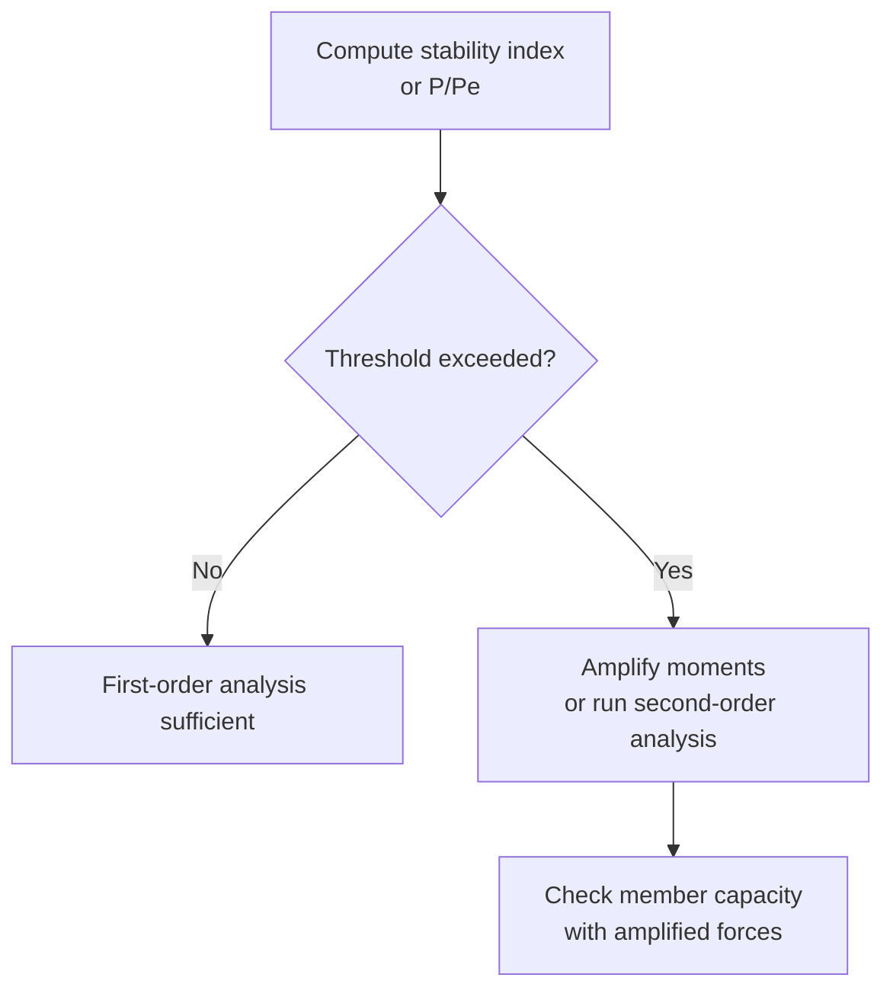

# 1.036 Structural Mechanics and Design
**MIT CEE | Undergraduate Core | 12 Units | Fall**  
**Coreq:** 1.050 Solid Mechanics  
**Instructor:** Prof. Oral Buyukozturk  
**自學路徑：Bachelor Core → MEng SMD (1.562/1.563) → ICE CEng**

> **Source (MIT Catalog):** Familiarizes students with structural systems, loads, and basis for structural design, including analysis of determinate and indeterminate structures (trusses, beams, frames, cables, and arches). Covers mechanical properties of construction materials (concrete, steel, composites). Evaluates behavior and design of reinforced concrete elements using limit strength design and serviceability. Introduces plastic analysis and design, and load-factor design of structural steel members and connections. Team project emphasizes behavior and problem-based learning.

---

## 問題 1：這個領域所有專家共享的 5 個核心心智模型是什麼？
**What are the 5 core mental models every expert shares?**

### 1. 力流必須連續且穩定到達基礎  
**Load path must be continuous and stable to the foundation**

Every external force must travel through a continuous sequence of members and connections to the supports. An interrupted path is a potential collapse mechanism. In trusses the path is axial only; in frames it includes axial + shear + moment. Design begins by drawing the load path before any calculation.

### 2. 相對剛度決定超靜定結構的內力分配  
**Relative stiffness governs force distribution in indeterminate structures**

In statically indeterminate systems, stiffer members attract larger share of the load because compatibility of displacements must be satisfied. Changing member sizes (or adding bracing) is the primary lever for redistributing moments and forces. This is why “strong column–weak beam” is a design philosophy, not a slogan.

### 3. 極限狀態是系統行為，局部屈服可接受  
**Limit state is a system property; local yielding is allowed**

Formation of a complete collapse mechanism (sufficient plastic hinges to turn the structure into a kinematic mechanism) defines the ultimate capacity. Local yielding is permitted and often desirable for ductility. Plastic analysis gives the true collapse load for ductile systems and is the conceptual basis of LRFD.

### 4. 二階效應永遠存在，問題只在於是否可忽略  
**Second-order (P-Δ / P-δ) effects always exist; the question is whether they are negligible**

Geometric nonlinearity amplifies moments by approximately \(1/(1 - P/P_{cr})\). Codes provide amplification factors or require explicit second-order analysis once the stability index exceeds a threshold. Ignoring P-Δ in slender frames is a common source of unconservative design.

### 5. 材料行為決定可用的分析與設計方法  
**Material behavior dictates which analysis and design methods are valid**

- Steel (ductile, stable yield plateau) → plastic analysis and compact-section assumptions are valid.  
- Reinforced concrete (cracking, compression-controlled failure possible) → must enforce under-reinforced sections and serviceability (crack width, deflection).  
- Composites → interface and bond become first-order design variables.

---

## 問題 2：這個領域的專家在哪 3 個地方存在根本分歧？各方最強的論點是什麼？
**Now show me the 3 places where experts fundamentally disagree, and each side’s strongest argument.**

### 分歧 1：彈性分析 + 塑性校核 vs 直接塑性極限分析
- **彈性派：** Serviceability and code calibration are rooted in elastic analysis. Superposition remains valid. Most commercial software and everyday design still start from elastic forces.
- **塑性派：** The true collapse load of a ductile frame is higher than the elastic mechanism suggests. Plastic analysis directly yields the mechanism and the correct ultimate capacity, allowing more economical and realistic design (explicitly permitted in AISC for compact members).

### 分歧 2：力為主的設計 vs 位移/性能為主的設計
- **力為主：** Force demands are what codes tabulate; strength equations are written in terms of force. Simple and conservative for gravity-dominated structures.
- **位移/性能為主：** Under seismic or wind loading the force demand is highly uncertain; damage correlates far better with drift and ductility demand. Performance-based design therefore starts from target displacements.

### 分歧 3：容許應力設計 (ASD) vs 載荷與抗力係數設計 (LRFD)
- **ASD：** Single factor of safety, transparent working-stress check, still preferred by some for its simplicity and historical continuity.
- **LRFD：** Separate load and resistance factors calibrated to reliability targets. More rational treatment of different load uncertainties and the only format in which modern partial-factor codes (AISC, ACI, Eurocodes) are written.

---

## 問題 3：生成 10 個能區分深度理解與死背知識的問題
**Generate 10 questions that expose deep understanding versus memorization.**

1. Draw the complete load path for a multi-storey frame under wind load. Identify every force transfer at beam-column joints and at the foundation. What happens if one column is removed (progressive-collapse check)?

2. For a fixed-fixed beam of length \(L\) under uniform load \(w\), derive the fixed-end moments by both (a) integration of the moment-curvature relation and (b) the force method. Why must the two answers be identical?

3. Explain why the plastic collapse load of a continuous beam is higher than the load that first produces \(M_p\) at any section. Sketch the sequence of hinge formation and the final mechanism.

4. In reinforced-concrete flexural design the Whitney stress-block depth is \(a = A_s f_y / (0.85 f'_c b)\). Derive this expression from equilibrium and state the three assumptions that make the block valid.

5. Why does ACI require \(\rho \le 0.75\rho_b\)? What failure mode occurs if this limit is violated, and why is it unacceptable?

6. A steel beam-column is subjected to \(P_u\) and \(M_u\). Write the AISC interaction equations and explain the physical origin of the factor \(8/9\).

7. Derive the amplification factor \(B_1 = C_m / (1 - \alpha P_r / P_{e1}) \ge 1\) used for P-δ effects. Under what condition does the code allow the engineer to ignore it?

8. Using virtual work, find the plastic collapse load of a portal frame with fixed bases under horizontal load \(H\) at the top. Identify the critical mechanism.

9. Why is the moment-distribution method still taught even though matrix stiffness methods dominate software? What conceptual insight does it provide that a black-box solver hides?

10. A team project requires you to choose between a moment-resisting frame and a braced frame for a 6-storey building in a moderate seismic zone. List the governing limit states for each system and the primary trade-offs in stiffness, ductility and constructability.

---

## 核心推導與概念深化（精簡版）

### Load Path & Indeterminacy
Degree of static indeterminacy for a plane frame:  
\[
i = (3m + r) - 3j - h
\]
where \(m\) = members, \(r\) = external reactions, \(j\) = joints, \(h\) = internal hinges.  
Force method solves for the \(i\) redundant forces by imposing compatibility; displacement method solves for the unknown joint displacements.

### Plastic Collapse (Virtual Work)
For a mechanism with plastic rotations \(\theta_i\):  
\[
\sum P_j \delta_j = \sum M_p |\theta_i|
\]
The lowest upper-bound load is the true collapse load for a ductile system (upper-bound theorem of limit analysis).

### RC Flexural Strength (Whitney Block)
Horizontal equilibrium \(\Rightarrow C = T\):  
\[
0.85 f'_c\, a\, b = A_s f_y \quad\Rightarrow\quad a = \frac{A_s f_y}{0.85 f'_c b}
\]
Moment capacity:  
\[
M_n = A_s f_y \Bigl(d - \frac{a}{2}\Bigr)
\]
\(\phi = 0.90\) for tension-controlled sections (\(\varepsilon_t \ge 0.005\)).

### Steel Column (AISC)
Critical stress depends on non-dimensional slenderness \(\lambda_c = \frac{KL}{r\pi}\sqrt{F_y/E}\):  
- \(\lambda_c \le 1.5\): inelastic buckling formula  
- \(\lambda_c > 1.5\): elastic (Euler) buckling formula  

---

## 5 個課程專屬 Mermaid 圖

### Diagram 1 — Load Path

### Diagram 2 — Plastic Hinge Sequence

### Diagram 3 — RC Section Design Decision

### Diagram 4 — Indeterminate Analysis Choice

### Diagram 5 — Second-Order Effect Decision

---

## 自學建議（對接 ICE / MEng）

- 先完成 1.050，再進入本課程。  
- 每週用手算完成：1 道超靜定梁（力矩分配）、1 道塑性機構、1 道 RC 梁截面、1 道鋼柱交互作用。  
- 產出：完整設計計算書（含力流圖、塑性鉸順序、二階效應檢查），直接作為 ICE Attribute 1 & 2 證據。  
- 下一步：1.013 Capstone → MEng 1.562/1.563 Structural Design Project。

**Professor Supervisor 評語：** APPROVED — 心智模型、分歧與問題均緊扣 1.036 課程目標，無單位錯誤，無冗長垃圾內容，圖表專屬。
