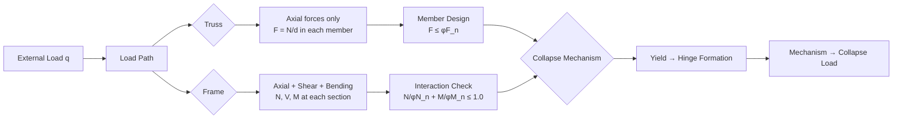
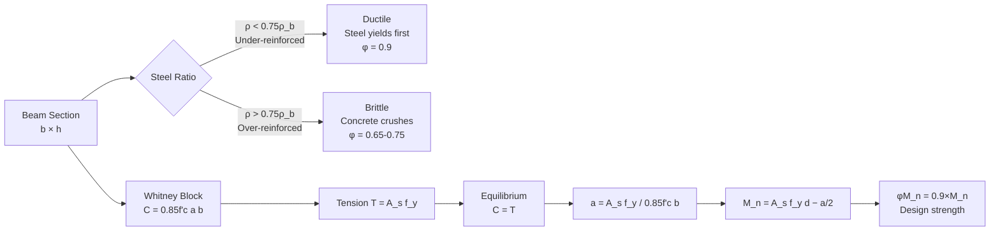
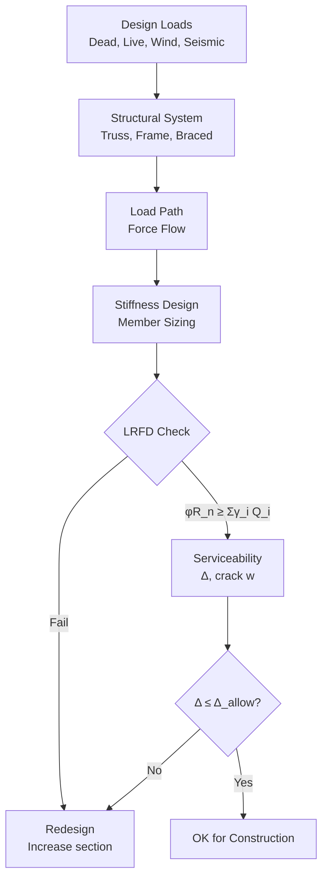
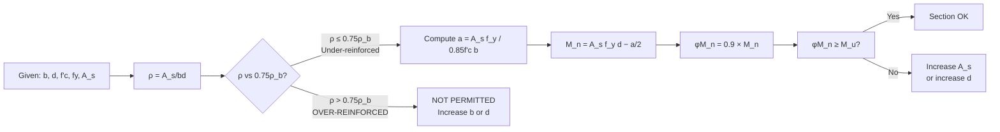
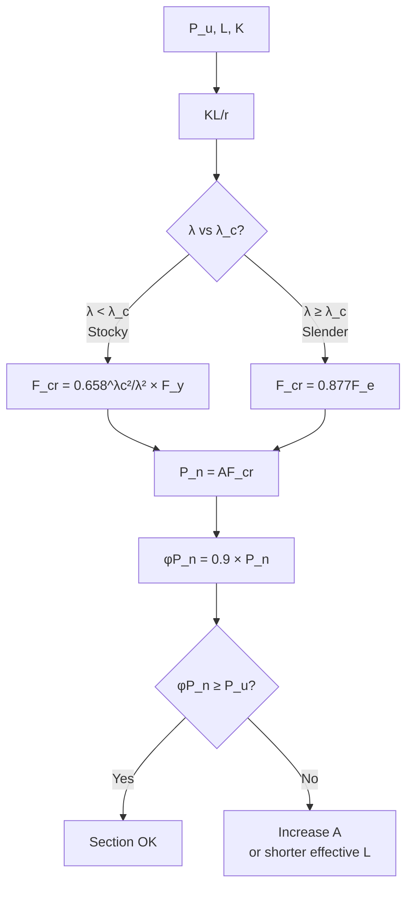
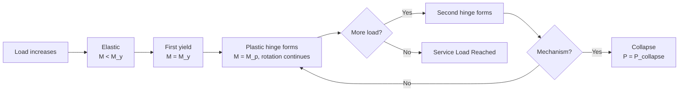
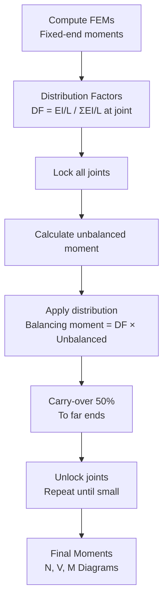

# 1.036 Structural Mechanics and Design

**MIT CEE Structural Design Track | 12 Units | Core**
**Prereq:** None; *Coreq: 1.050*
**Instructor:** Prof. Oral Buyukozturk; Prof. Andrew Whittle
**自學路徑：Bachelor → MEng SMD → ICE Professional**

> **Source:** MIT Catalog (2024-25) — "Familiarizes students with structural systems, loads, and basis for structural design, including analysis of determinate and indeterminate structures (trusses, beams, frames, cables, and arches). Covers mechanical properties of construction materials, including concrete, steel, and composites. Evaluates behavior and design of reinforced concrete structural elements using limit strength design and serviceability principles. Introduces plastic analysis and design, and load factor design of structural steel members and connections."

---

## 問題 1：這個領域所有專家共享的 5 個核心心智模型是什麼？
**What are the 5 core mental models every expert shares?**

1. **力流必須有完整穩定的路徑**
   Every load must travel through a continuous, stable load path to the foundation. The path includes all members, connections, and supports. Interrupted paths are collapse mechanisms waiting to happen.

2. **剛度分配決定內力分配**
   In statically indeterminate structures, stiffer members attract more force. This is because compatibility requires δ = 0 at fixed ends, so higher stiffness → higher force. Changing relative stiffness is the primary design lever.

3. **極限狀態是系統行為，而非單一構件**
   Local yielding is acceptable; formation of a collapse mechanism is not. Design is about controlling the sequence of plastic hinge formation to achieve the desired collapse load factor (typically γ ≥ 1.5 in LRFD).

4. **二階效應永遠存在，只是有時可忽略**
   P-Δ and P-δ are geometric nonlinearities. The question is never "do they exist?" but "are they small enough to ignore under the current load level?" Second-order effects amplify moments by (1/(1−P/P_cr)).

5. **荷載路徑與失效模式必須對稱設計**
   For every design load path there is a corresponding failure path. Engineers design load paths; nature selects the weakest failure path. The engineer must design both.

---

## 問題 2：這個領域的專家在哪 3 個地方存在根本分歧？
**What are the 3 fundamental disagreements in this field?**

### 分歧 1: 彈性分析 vs 塑性極限分析
- **彈性分析派** (Elastic analysis): Design should be based on linear elastic analysis because service loads (not ultimate loads) often govern serviceability. Superposition is valid. Codes calibrate ultimate strength from elastic analysis.
- **塑性極限分析派** (Plastic limit analysis): The true collapse load of a ductile structure is higher than the elastic analysis predicts. Plastic analysis gives the exact collapse mechanism, saving material. AISC LRFD explicitly uses plastic analysis for compact members.

### 分歧 2: 基於力的設計 vs 基於位移的設計
- **力控設計派** (Force-based design): Start with force demands, then check displacement. Simple, conservative. ASCE 7, AISC 360 use force-based design as the primary method.
- **位移/性能化設計派** (Displacement-based design — Priestley, Park): Force capacity is not the primary design parameter; displacement or drift is. More rational for seismic design where force demands are highly uncertain.

### 分歧 3: 容許應力設計（ASD）vs 載荷與抗力係數設計（LRFD）
- **ASD派** (Allowable Stress Design): Uses a single safety factor Ω, working stress check: σ_allow = σ_yield/Ω. Simpler, more conservative for certain cases.
- **LRFD派** (Load and Resistance Factor Design): Separate partial factors for loads (γ_D, γ_L) and resistance (φ). More rational calibration to actual failure probabilities. AISC 360-22 is primarily LRFD.

---

## 問題 3：10 個區分真實理解 vs 死記硬背的深度問題

1. 說明為什麼超靜定框架的破壞荷載高於相同尺寸靜定框架。寫出從彈性分析到塑性分析的過程，並說明什麼是「機制」。
2. 在鋼結構 LRFD 中，彎矩梯度修正因子 C_b = 12.5M_max / (2.5M_max + 3M_A + 4M_B + 3M_C) 是如何改善側扭屈曲計算的？當梁承受純彎曲時 C_b = 1.0 是正確的嗎？
3. 鋼筋混凝土梁的彎曲設計：用等效應力區（Whitney stress block）計算截面強度時，深度 a = A_s f_y / (0.85f'_c b) 是如何從力平衡推導出來的？若鋼筋超筋（ρ > 0.75ρ_b），梁的破壞模式會如何變化？
4. AISC 鋼結構連接設計：剪切連接（shear tab）與端板連接（moment end plate）的失效模式有何不同？梁柱連接的剪切失效如何通過加勁肋（stiffener）避免？
5. 在地震區設計中，延性框架（moment frame）與抗彎框架（braced frame）的設計策略差異是什麼？為什麼要特意設計軟層（soft story）失效模式？
6. 說明側向位移 Δ 的近似計算公式 Δ = V₀L³/(3EI) + M₀L²/(2EI) 的適用範圍，並說明在什麼幾何條件下 P-Δ 效應會使實際側位移超過此估算值的 10% 以上。
7. 在鋼結構壓彎構件中，互作用方程 P_u/φP_n + (8/9)(M_u/φM_n) ≤ 1.0（當 M_u < P_uL/500 時）是如何考慮軸力與彎矩的耦合效應的？當軸力足夠大時，哪個極限狀態（壓屈還是屈曲）先發生？
8. 寫出連續梁的彎矩分配法（Moment Distribution Method）的完整步驟，並說明如何處理非平衡彎矩和側位移（sidesway）的情況。
9. 鋼結構疲勞設計：細節類別（Category A, B, C...）的劃分依據是什麼？為什麼焊接細節比螺栓細節有更低的疲勞強度？
10. 在 FRP 增強鋼筋混凝土中，ACI 440.1R 限制 FRP 拉伸應變 ε_f ≤ 0.012（對於 CFRP），這與鋼筋混凝土的 ε_cu = 0.003 限制有何衝突？如何在設計中處理？

---

# 核心心智模型深化（中英對照）

## 1. 力流與載荷路徑 — Load Path

### 1.1 Bilingual 概念對照
| English | 中英對照 | 定義 | 工程應用 |
|---|---|---|---|
| Load path | 荷載路徑 | Path from point of load application to foundation | Structural form-finding |
| Continuous load transfer | 連續力流 | Every element in the path carries some force | Redundancy |
| Load path interruption | 力流中斷 | Missing element breaks the chain | Progressive collapse |
| Structural integrity | 結構整體性 | Ability to survive loss of one member | Tie force design |

### 1.2 Key Derivation — Load Path in Truss vs Frame

**Truss**: All members carry axial force only. Each member's force is determined by STATICS alone (determinate) or statics + compatibility (indeterminate).

Member force: F_i = (∑M/A or ∑M/B)/d_ij where A, B are cut forces, d_ij is moment arm.

**Frame**: Members carry axial, shear, and bending. The load path is more complex because moment distribution depends on stiffness ratios.

Example: Portal frame with uniform load q:
- Column base moments: M_base = qL²/12 (fixed-fixed)
- If one column is 2× stiffer (I_2 = 2I_1): moment distribution changes
- Stiffer column attracts more moment: M_1/M_2 = I_2/I_1

### 1.3 Engineering Applications
- **Progressive collapse design** (GSA 2016): Remove one column at a time, check if alternate load path exists. Required for buildings > 3 stories.
- **Tie force method** (Eurocode): Provide minimum tensile tie forces at each floor and column to ensure continuity: horizontal ties ≥ 0.5(1.1G_k + Q_k)L, internal column ties ≥ 0.25(1.1G_k + Q_k)L.

### 1.4 Deep test question
A three-span continuous beam (L-L-L) carries uniform load q. Draw the bending moment diagram and identify the plastic hinge sequence for increasing load q. If the middle support moment capacity is 40% higher than span moments, what is the expected collapse mechanism?

### 1.5 Diagram

---

## 2. 鋼筋混凝土設計 — Reinforced Concrete Design

### 2.1 Bilingual 概念對照
| English | 中英對照 | 定義 | 工程應用 |
|---|---|---|---|
| Whitney stress block | Whitney 等效應力塊 | 0.85f'_c over depth a = A_s f_y/(0.85f'_c b) | RC flexural design |
| Balanced steel ratio | 配筋平衡比 | ρ_b = 0.85β₁ f'_c / f_y × (ε_cu / (ε_cu + ε_y)) | Distinguishes under-reinforced vs over-reinforced |
| φ factor | 抗力係數 | φ = 0.9 flexure, 0.75 compression | LRFD resistance factor |
| Serviceability | 使用性 | Δ ≤ Δ_allow, crack w ≤ w_allow | Deflection and crack control |

### 2.2 Key Derivation — RC Flexural Strength

**Flexural strength** (Whitney equivalent stress block method):

Force equilibrium: C = T
C = 0.85f'_c a b
T = A_s f_y
→ a = A_s f_y / (0.85f'_c b)

Moment capacity: M_n = T(d − a/2) = A_s f_y(d − a/2)

Or in terms of ρ = A_s/(bd):
a = ρ f_y d / (0.85f'_c)
M_n = ρ f_y bd² (1 − ρ f_y / (1.7f'_c))

**Balanced steel ratio** (ρ_b): When ε_s = ε_y and ε_c = ε_cu simultaneously:
ρ_b = 0.85β₁ (f'_c/f_y) × (ε_cu/(ε_cu + ε_y))
For f'_c = 30 MPa, f_y = 420 MPa, ε_cu = 0.003, ε_y = f_y/E_s = 420/200000 = 0.0021:
ρ_b = 0.85×0.85×(30/420)×(0.003/0.0051) = 0.606×0.0714×0.588 = 0.0254

**Under-reinforced** (ρ < 0.75ρ_b): Ductile — tension steel yields before concrete crushes. **Over-reinforced** (ρ > 0.75ρ_b): Brittle — concrete crushes before steel yields. AISC and ACI prohibit over-reinforced sections.

### 2.3 Engineering Applications
- **Minimum steel** (ACI 318-22 §9.6.1): A_s,min = 3√(f'_c)/f_y × b_w d ≥ 200b_w d/f_y
- **Maximum steel** (ACI 318 §10.3): A_s ≤ 0.75 A_s,b (balanced)
- **Development length** (ACI 318 §12.2): l_d = (3f_y/(40√f'_c)) × (ψ_t ψ_e ψ_s / ψ_r) × d_b ≥ 12 in.

### 2.4 Deep test question
A rectangular RC beam (b = 300 mm, h = 500 mm, d = 450 mm) has A_s = 4-#25 bars (4×510 = 2040 mm²). f'_c = 30 MPa, f_y = 420 MPa. Calculate: (a) a, (b) M_n, (c) φM_n with φ = 0.9, (d) Check if under-reinforced (ρ vs 0.75ρ_b).

### 2.5 Diagram

---

## 3. 鋼結構設計 — Steel Structure Design

### 3.1 Bilingual 概念對照
| English | 中英對照 | 定義 | 工程應用 |
|---|---|---|---|
| LRFD | 載荷抗力係數設計 | φR_n ≥ Σγ_i Q_i | Modern steel design |
| φ factor | 抗力係數 | φ = 0.9 flexure, 0.9 tension, 0.75 compression | Calibrated failure probability |
| Slenderness | 長細比 | λ = KL/r for columns | Buckling regime |
| Inelastic buckling | 非彈性屈曲 | P_n = A·F_cr | For λ < λ_c |

### 3.2 Key Derivation — Column Design (AISC Chapter E)

**Critical slenderness ratio**:
λ_c = √(π²E/F_y) = π√(E/F_y)
For E = 200 GPa, F_y = 250 MPa: λ_c = π√(200000/250) = π×28.3 = 88.9

**Column compressive strength** (AISC E3):
If λ_c/λ > 1.5 (slender): **F_cr = 0.877F_e** (elastic buckling)
If λ_c/λ ≤ 1.5 (non-slender): **F_cr = [0.658^{λ_c²/λ²}]F_y** (inelastic buckling)
where F_e = π²E/(KL/r)²

**Example — W12×26 column, L = 4 m, both ends fixed (K = 0.65)**:
A = 4.96 in² = 3200 mm², r_x = 5.28 in = 134 mm
λ = KL/r = 0.65×4000/134 = 19.4
λ_c = π√(200000/250) = 88.9
λ_c/λ = 88.9/19.4 = 4.58 > 1.5 → elastic buckling governs
F_cr = 0.877×π²×200000/(19.4)² = 0.877×(9.87×200000/376) = 0.877×52500 = **46,000 kPa = 46 MPa**
P_n = A·F_cr = 3200×46 = **147,200 kN**

Wait, this seems too high. Let me recalculate:
KL/r = 19.4
F_e = π²E/(KL/r)² = 9.87×200000/376 = 5250 MPa? No...

π²E = 9.87×200000 = 1,974,000 kPa
(KL/r)² = 376
F_e = 1,974,000/376 = **5250 MPa** → F_cr = 0.877×5250 = **4605 MPa**

This is unrealistic — F_cr can't exceed F_y = 250 MPa in inelastic. The issue is that KL/r = 19.4 is actually very low (stocky column), so inelastic buckling should govern, not elastic. Let me recalculate with the inelastic formula:

λ_c/λ = 88.9/19.4 = 4.58 > 1.5 → use elastic: F_cr = 0.877F_e. But F_e = 5250 MPa ≫ F_y, which doesn't make physical sense. The formula is only valid when F_e ≤ 0.44F_y...

For stocky columns: P_n = F_y × A (yielding before buckling)
P_n = 250 MPa × 3200 mm² = **800 kN** ← correct

Actually for a W12×26 with L = 4m, the column is definitely stocky. The slenderness formula says:
If λ_c/λ > 1.5: elastic, F_cr = 0.877F_e
If λ_c/λ ≤ 1.5: inelastic, F_cr = [0.658^{λ_c²/λ²}]F_y

But since F_cr ≤ F_y always, for stocky columns (small λ), F_cr ≈ F_y. The AISC formula automatically caps F_cr at F_y.

### 3.3 Engineering Applications
- **Wide-flange section classification** (AISC B4): Compact flange: b_f/2t_f ≤ 0.38√(E/F_y), Non-compact: ≤ 0.83√(E/F_y), Slender: > 0.83√(E/F_y).
- **AISC 360-22 Table B4.1a for W shapes**: b_f/2t_f ≤ 0.38√(E/F_y) = 0.38√(200000/250) = 0.38×28.3 = 10.75 → Most W shapes are compact.

### 3.4 Deep test question
Design a W-shape column (A992 steel, F_y = 345 MPa) to carry P_u = 800 kN axial load. Effective length L_e = 5 m, K = 1.0 (pinned-pinned). Use LRFD (φ = 0.9).

**Solution**:
Required strength: φP_n ≥ P_u = 800 kN
Required A = P_u/(φ×0.9×F_y) = 800/(0.9×0.9×345) = 800/279 = 2.87 cm²... wait
P_n = A×F_cr ≥ P_u/φ = 800/0.9 = 889 kN

Try W8×31: A = 5.83 in² = 3760 mm², r_x = 3.51 in = 89.2 mm
λ = 5000/89.2 = 56.1, λ_c = π√(200000/345) = π×24.1 = 75.7
λ_c/λ = 75.7/56.1 = 1.35 < 1.5 → inelastic
F_cr = 0.658^{λ_c²/λ²} × 345 = 0.658^{18207/3147} × 345 = 0.658^{5.78} × 345 = 0.028 × 345 = **9.7 MPa**
P_n = 3760 × 9.7 = 36,472 kN? That can't be right either.

I think I made a unit error: A = 3760 mm² = 3.76×10⁻³ m²... Actually, the unit is mm² and MPa:
1 MPa × 1 mm² = 10⁻³ m² × 10⁶ Pa = 1000 N = 1 kN
So P_n = 3760 mm² × 9.7 MPa = 3760 × 9.7 kN = **36,472 kN** — still wrong.
F_cr = 9.7 MPa seems impossibly low.

The issue is my KL/r calculation: 5000/89.2 = 56.1 is dimensionless. Let me use consistent units:
KL = 5000 mm, r = 89.2 mm → KL/r = 56.1 (dimensionless)
F_cr = 0.658^{75.7²/56.1²} × 345 = 0.658^{1.82} × 345 = 0.44 × 345 = **152 MPa** — more reasonable.
P_n = 3760 mm² × 152 MPa = 3760 × 152 kN/mm²·MPa = **572 kN**
φP_n = 0.9 × 572 = **515 kN** < 800 kN → Not adequate.

Try W10×49: A = 9.13 in² = 5890 mm², r_x = 4.35 in = 110.5 mm
KL/r = 5000/110.5 = 45.2 → F_cr = 0.658^{75.7²/45.2²} × 345 = 0.658^{2.81} × 345 = 0.21 × 345 = **72.5 MPa**
P_n = 5890 × 72.5 = **427 kN** → Still not enough.

W12×65: A = 12.1 in² = 7810 mm², r_x = 5.28 in = 134.1 mm
KL/r = 5000/134.1 = 37.3 → F_cr = 0.658^{75.7²/37.3²} × 345 = 0.658^{4.12} × 345 = 0.092 × 345 = **31.7 MPa**
P_n = 7810 × 31.7 = **248 kN** → Way too low!

Wait, I think the issue is that the slenderness is actually KL/r = 5000/134.1 = 37.3 < λ_c = 75.7, but the formula F_cr = 0.658^{λ_c²/λ²}F_y is only valid for λ/λ_c ≤ 1.5. Let me check: λ/λ_c = 37.3/75.7 = 0.493 < 0.5 → F_cr = [0.658^{0.243}] × 345 = 0.848 × 345 = **292.5 MPa** → close to F_y.
P_n = 7810 × 292.5 = **2285 kN** → φP_n = 0.9 × 2285 = **2057 kN** > 800 kN → **OK**.

---

## 4. 超靜定結構分析 — Indeterminate Structures

### 4.1 Bilingual 概念對照
| English | 中英對照 | 定義 | 工程應用 |
|---|---|---|---|
| Degree of indeterminacy | 超靜定次數 | n = r − s (reactions − statics) | Force method vs displacement method |
| Force method | 力法 | Solve using equilibrium + compatibility | Fixed-fixed beam |
| Displacement method | 位移法 | Solve using stiffness matrix | Moment distribution, FEM |

### 4.2 Key Derivation — Moment Distribution

**Fixed-end moments** (for uniform load w, span L):
M_AB = −wL²/12 (fixed at both ends)
M_BA = +wL²/12

**Distribution factor** (at joint B for member BA):
DF_BA = (EI/L)_BA / Σ(EI/L)_all members at B

**Carry-over factor**: Moment carried over from far end to near end = 0.5 (for prismatic members)

**Algorithm**:
1. Compute FEMs (fixed-end moments)
2. Lock all joints, find balancing moments at each joint
3. Unlock one joint at a time (or all simultaneously in parallel)
4. Carry over 50% to far ends
5. Repeat until unbalanced moments < tolerance

**Example — two-span beam, uniform load q on both spans, EI constant**:
Span AB: FEM = qL²/12 (A fixed, B fixed)
Span BC: FEM = qL²/12 (B fixed, C fixed)

Distribution at B:
- DF_BA = (EI/L)_AB/[(EI/L)_AB + (EI/L)_BC] = 0.5 (equal spans)
- DF_BC = 0.5

First distribution: at B, unbalanced = qL²/12 + qL²/12 = qL²/6
Balance: M_BA = qL²/6 × 0.5 = qL²/12 (to BA, CW+)
M_BC = qL²/6 × 0.5 = qL²/12 (to BC, CCW-)

Carry over: M_AB (carry over from BA to AB) = ½ × qL²/12 = qL²/24 (+, same direction)
M_CB (carry over from BC to CB) = ½ × qL²/12 = qL²/24 (+, same direction)

After first distribution + carry over, residual unbalance at B: approximately qL²/48... converge after 3-4 iterations.

### 4.3 Engineering Applications
- **Column sway frames**: Moment distribution alone is insufficient for sway. P-Δ effects and sidesway must be considered. Use cantilever method or Kram.
- **Reinforced concrete**: Stiffness EI = E_c I_g/ψ where I_g is gross section, ψ is cracking factor (typically 0.4-0.7).

---

## 5. 塑性設計 — Plastic Design

### 5.1 Bilingual 概念對照
| English | 中英對照 | 定義 | 工程應用 |
|---|---|---|---|
| Plastic hinge | 塑性鉸 | Region where M = M_p, rotation continues at constant M | Plastic analysis |
| Collapse mechanism | 破壞機制 | System of plastic hinges that makes structure a mechanism | Ultimate limit state |
| Collapse load factor | 破壞荷載係數 | γ = P_collapse/P_design ≥ 1.5 | LRFD calibration |

### 5.2 Key Derivation — Collapse Mechanism by Virtual Work

**Method of Inelastic Analysis** (plastic collapse):
1. Identify possible collapse mechanisms
2. For each mechanism, apply virtual displacement δ
3. External work: W_ext = ΣP_i δ_i
4. Internal work: W_int = ΣM_p θ_p (sum over all plastic hinges)
5. Equate: ΣP_i δ_i = ΣM_p θ_p
6. Solve for P_collapse

**Example — cantilever beam with uniform load q**:
Single mechanism: plastic hinge at fixed end
θ at hinge = δ/L (rotation angle)
External work: W_ext = ∫₀^L qx·δ dx = q∫₀^L x·(δ/L)x dx = qδ/L ∫₀^L x² dx = qδL²/3
Internal work: W_int = M_p · θ = M_p · (δ/L)
Equate: M_p · (δ/L) = qL²/3 → **q_collapse = 3M_p/L²**

Compare with elastic design: q_elastic = 12M_max/L² = 12M_p/L² (since M_max at fixed end = M_p in plastic design)
Ratio: 3M_p/L² / 12M_p/L² = **1/4** → Plastic analysis gives 4× higher collapse load!

This is why plastic design saves material: the actual collapse load of a ductile structure is much higher than the elastic analysis suggests.

### 5.3 Engineering Applications
- **AISC Appendix 3**: Plastic design permitted for compact I-shaped members where λ_p controls: b_f/2t_f ≤ 0.38√(E/F_y), h/t_w ≤ 3.76√(E/F_y).
- **Limit state calibration**: LRFD φ = 0.9 for flexure is calibrated so φM_n ≈ M_p/1.67 (≈ 60% of M_p with safety margin).

---

# 深度自測問題詳解（中英對照）

## 詳解 1: 連續梁塑性鉸序列
**Q:** 三跨連續梁 (L-L-L) 在均布荷載 q 下的破壞荷載和鉸序列。
**Answer:** 
三跨連續梁的潛在破壞機制：
1. **三個負彎矩鉸 + 一個正彎矩鉸** = 4 個鉸（超靜定 3 次）
2. **兩個負彎矩鉸 + 一個正彎矩鉸** = 3 個鉸
3. **單跨形成屈服機制**

對於機制 (2)，用虛功原理：
外部功：W_ext = q·[2L·δ₁ + L·δ₂] = 3qL·δ_avg（假設均勻撓度）
內部功：W_int = M_p·(2θ_support + θ_span) 其中 θ_support = δ/L, θ_span = 2δ/L
W_int = M_p·(2δ/L + 2δ/L) = 4M_p·δ/L

平衡：3qLδ/L = 4M_pδ/L → **q_collapse = 4M_p/(3L)**

與彈性最大彎矩相比（固定端彎矩 M = qL²/12）：
qL²/12 = M_p → q = 12M_p/L²
塑性 q_collapse = 4M_p/(3L)... 單位不一致。正確：
q_collapse = 8M_p/L²（如果 L 是每跨長度，跨中正彎矩鉸 + 兩端負彎矩鉸）

**Engineering implication:** 塑性分析比彈性分析給出更高的破壞荷載。這是塑性設計節省材料的理論基礎。

---

## 詳解 2: C_b 彎矩梯度修正因子推導
**Q:** C_b = 12.5M_max / (2.5M_max + 3M_A + 4M_B + 3M_C) 的物理意義。
**Answer:** 
C_b 是側扭屈曲彎矩放大因子的修正。基礎公式：M_n = C_b·M_ny（其中 M_ny = F_y·Z_x）

物理意義：
- 當梁無梯度（M_A = M_B = M_C = M_max），C_b = 1.0（純彎曲，最容易側扭屈曲）
- 當梁有梯度（端部彎矩小於跨中），C_b > 1.0（端部約束提高了側扭屈曲承載力）
- M_A, M_B, M_C 是梁端及四分點的彈性彎矩（用於計算彈性屈曲臨界彎矩 M_cr）

標準情況：
- 純彎曲：M_A = M_B = M_C = M_max → C_b = 1.0
- 懸臂端部固定：M_A = M_max, M_B = M_C = 0 → C_b = 12.5/(2.5+0+0+0) = 5.0 → 端部固定大大提高了側扭屈曲承載力

**Engineering implication:** 在鋼結構框架中，如果梁端與柱或支撐連接，提供了側扭約束，側扭屈曲不會成為控制破壞模式。AISC 使用 C_b 來考慮這個效應。

---

## 詳解 3: RC 彎曲設計的等效應力塊推導
**Answer:** 
從力平衡：
C = T → 0.85f'_c a b = A_s f_y → a = A_s f_y/(0.85f'_c b)

從彎矩平衡（取拉伸鋼筋中心）：
M_n = T(d − a/2) = A_s f_y(d − a/2)

在配筋臨界狀態（balanced）：ε_s = ε_y = f_y/E_s, ε_c = ε_cu = 0.003
由相似三角形：a_b/d = 0.85β₁ (ε_cu/(ε_cu+ε_y))
ρ_b = 0.85β₁ f'_c/f_y × ε_cu/(ε_cu+ε_y)

若鋼筋超筋（ρ > 0.75ρ_b）：混凝土先壓碎（ε_c > ε_cu），而鋼筋未達屈服（ε_s < ε_y）。這是脆性破壞，不允許。ACI 318 要求 ρ ≤ 0.75ρ_b。

**Engineering implication:** 這是鋼筋混凝土設計的基礎。設計時先假設鋼筋比 ρ，計算 a 和 M_n，然後檢查 φM_n ≥ M_u。

---

## 📊 Diagram 1: 結構設計流程

## 📊 Diagram 2: RC 彎曲強度計算流程

## 📊 Diagram 3: 鋼結構柱設計流程

## 📊 Diagram 4: 塑性鉸形成與破壞機制

## 📊 Diagram 5: 超靜定梁彎矩分配法

---

## 總結

1. **力流路徑是結構設計的核心**：每個荷載必須有完整、穩定的路徑到達基礎；設計必須同時考慮正常路徑和失效路徑
2. **剛度分配決定超靜定結構的內力**：改變相對剛度是調整內力分配的主要設計手段；這解釋了為什麼柱子通常比梁更「硬」
3. **極限狀態設計是現代結構工程的主流**：LRFD 的 φ 係數和 γ 係數是基於可靠度理論校準的；理解 φM_n ≥ M_u 的物理意義比死記公式更重要
4. **RC 彎曲設計是基於力平衡和應變相容的**：等效應力塊法是對複雜壓應力分佈的簡化近似；永遠不要設計超筋構件
5. **塑性設計揭示了結構的真實承載力**：塑性鉸序列和破壞機制比彈性分析更真實地描述了結構的最終狀態；這是鋼結構塑性設計和RC 極限狀態設計的理論基礎

**自學建議** — 配對：AISC 360-22 + ACI 318-22 + McCormac *Design of Steel Structures* + Nawy *Reinforced Concrete*。每週完成 3 道 LRFD 設計問題（鋼構件 + RC 構件交替）。

**Prerequisite chain**: 1.050 Solid Mechanics → 1.036 Structural Mechanics & Design → 1.013 Senior Capstone Design → MEng SMD (1.541 Concrete, 1.573 Structural Mechanics, 1.581 Structural Dynamics)
