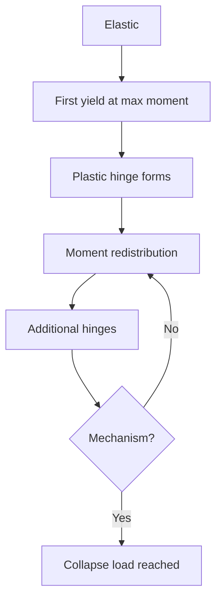
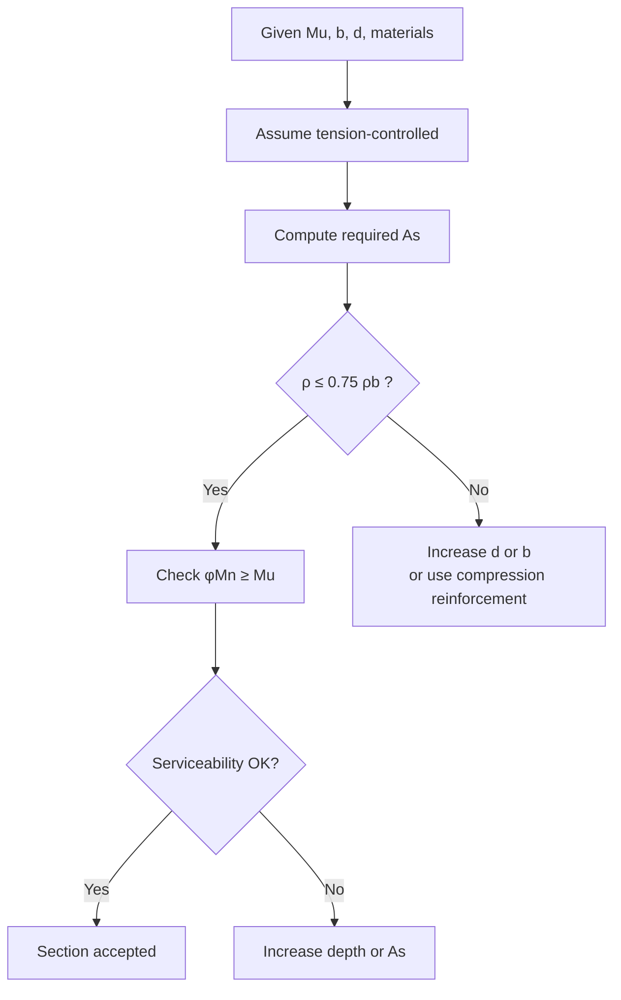
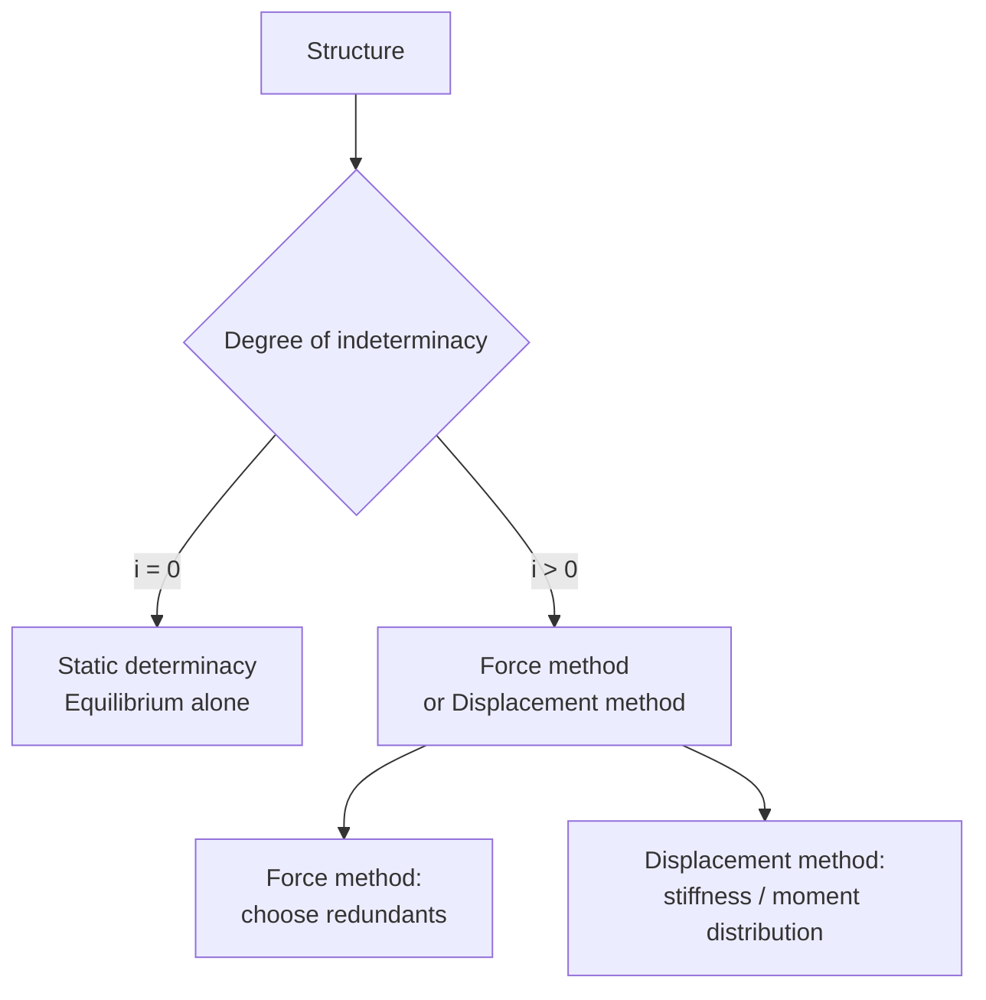
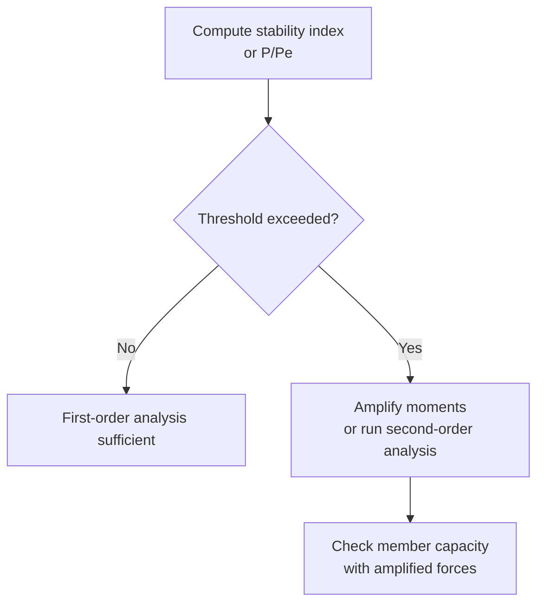

# 1.036 Structural Mechanics and Design
**MIT CEE | Undergraduate Core | 12 Units | Fall**  
**Coreq:** 1.050 Solid Mechanics  
**Instructor:** Prof. Oral Buyukozturk  
**自學路徑：Bachelor Core → MEng SMD (1.562/1.563) → ICE CEng**

> **Source (MIT Catalog):** Familiarizes students with structural systems, loads, and basis for structural design, including analysis of determinate and indeterminate structures (trusses, beams, frames, cables, and arches). Covers mechanical properties of construction materials (concrete, steel, composites). Evaluates behavior and design of reinforced concrete elements using limit strength design and serviceability. Introduces plastic analysis and design, and load-factor design of structural steel members and connections. Team project emphasizes behavior and problem-based learning.

---

## 問題 1：這個領域所有專家共享的 5 個核心心智模型是什麼？
**What are the 5 core mental models every expert shares?**

### 1. 力流必須連續且穩定到達基礎  
**Load path must be continuous and stable to the foundation**

Every external force must travel through a continuous sequence of members and connections to the supports. An interrupted path is a potential collapse mechanism. In trusses the path is axial only; in frames it includes axial + shear + moment. Design begins by drawing the load path before any calculation.

### 2. 相對剛度決定超靜定結構的內力分配  
**Relative stiffness governs force distribution in indeterminate structures**

In statically indeterminate systems, stiffer members attract larger share of the load because compatibility of displacements must be satisfied. Changing member sizes (or adding bracing) is the primary lever for redistributing moments and forces. This is why “strong column–weak beam” is a design philosophy, not a slogan.

### 3. 極限狀態是系統行為，局部屈服可接受  
**Limit state is a system property; local yielding is allowed**

Formation of a complete collapse mechanism (sufficient plastic hinges to turn the structure into a kinematic mechanism) defines the ultimate capacity. Local yielding is permitted and often desirable for ductility. Plastic analysis gives the true collapse load for ductile systems and is the conceptual basis of LRFD.

### 4. 二階效應永遠存在，問題只在於是否可忽略  
**Second-order (P-Δ / P-δ) effects always exist; the question is whether they are negligible**

Geometric nonlinearity amplifies moments by approximately \(1/(1 - P/P_{cr})\). Codes provide amplification factors or require explicit second-order analysis once the stability index exceeds a threshold. Ignoring P-Δ in slender frames is a common source of unconservative design.

### 5. 材料行為決定可用的分析與設計方法  
**Material behavior dictates which analysis and design methods are valid**

- Steel (ductile, stable yield plateau) → plastic analysis and compact-section assumptions are valid.  
- Reinforced concrete (cracking, compression-controlled failure possible) → must enforce under-reinforced sections and serviceability (crack width, deflection).  
- Composites → interface and bond become first-order design variables.

---

## 問題 2：這個領域的專家在哪 3 個地方存在根本分歧？各方最強的論點是什麼？
**Now show me the 3 places where experts fundamentally disagree, and each side’s strongest argument.**

### 分歧 1：彈性分析 + 塑性校核 vs 直接塑性極限分析
- **彈性派：** Serviceability and code calibration are rooted in elastic analysis. Superposition remains valid. Most commercial software and everyday design still start from elastic forces.
- **塑性派：** The true collapse load of a ductile frame is higher than the elastic mechanism suggests. Plastic analysis directly yields the mechanism and the correct ultimate capacity, allowing more economical and realistic design (explicitly permitted in AISC for compact members).

### 分歧 2：力為主的設計 vs 位移/性能為主的設計
- **力為主：** Force demands are what codes tabulate; strength equations are written in terms of force. Simple and conservative for gravity-dominated structures.
- **位移/性能為主：** Under seismic or wind loading the force demand is highly uncertain; damage correlates far better with drift and ductility demand. Performance-based design therefore starts from target displacements.

### 分歧 3：容許應力設計 (ASD) vs 載荷與抗力係數設計 (LRFD)
- **ASD：** Single factor of safety, transparent working-stress check, still preferred by some for its simplicity and historical continuity.
- **LRFD：** Separate load and resistance factors calibrated to reliability targets. More rational treatment of different load uncertainties and the only format in which modern partial-factor codes (AISC, ACI, Eurocodes) are written.

---

## 問題 3：生成 10 個能區分深度理解與死背知識的問題
**Generate 10 questions that expose deep understanding versus memorization.**

1. Draw the complete load path for a multi-storey frame under wind load. Identify every force transfer at beam-column joints and at the foundation. What happens if one column is removed (progressive-collapse check)?

2. For a fixed-fixed beam of length \(L\) under uniform load \(w\), derive the fixed-end moments by both (a) integration of the moment-curvature relation and (b) the force method. Why must the two answers be identical?

3. Explain why the plastic collapse load of a continuous beam is higher than the load that first produces \(M_p\) at any section. Sketch the sequence of hinge formation and the final mechanism.

4. In reinforced-concrete flexural design the Whitney stress-block depth is \(a = A_s f_y / (0.85 f'_c b)\). Derive this expression from equilibrium and state the three assumptions that make the block valid.

5. Why does ACI require \(\rho\le 0.75\rho_b\)? What failure mode occurs if this limit is violated, and why is it unacceptable?

6. A steel beam-column is subjected to \(P_u\) and \(M_u\). Write the AISC interaction equations and explain the physical origin of the factor \(8/9\).

7. Derive the amplification factor \(B_1=C_m/(1-\alpha P_r/P_{e1})\ge 1\) used for P-δ effects. Under what condition does the code allow the engineer to ignore it?

8. Using virtual work, find the plastic collapse load of a portal frame with fixed bases under horizontal load \(H\) at the top. Identify the critical mechanism.

9. Why is the moment-distribution method still taught even though matrix stiffness methods dominate software? What conceptual insight does it provide that a black-box solver hides?

10. A team project requires you to choose between a moment-resisting frame and a braced frame for a 6-storey building in a moderate seismic zone. List the governing limit states for each system and the primary trade-offs in stiffness, ductility and constructability.

---

## 核心推導與概念深化（精簡版）

### Load Path & Indeterminacy
Degree of static indeterminacy for a plane frame:  
\[
i = (3m + r) - 3j - h
\]
where \(m\) = members, \(r\) = external reactions, \(j\) = joints, \(h\) = internal hinges.  
Force method solves for the \(i\) redundant forces by imposing compatibility; displacement method solves for the unknown joint displacements.

### Plastic Collapse (Virtual Work)
For a mechanism with plastic rotations \(\theta_i\):  
\[
\sum P_j \delta_j = \sum M_p |\theta_i|
\]
The lowest upper-bound load is the true collapse load for a ductile system (upper-bound theorem of limit analysis).

### RC Flexural Strength (Whitney Block)
Horizontal equilibrium \(\Rightarrow C = T\):  
\[
0.85 f'_c\, a\, b = A_s f_y \quad\Rightarrow\quad a = \frac{A_s f_y}{0.85 f'_c b}
\]
Moment capacity:  
\[
M_n = A_s f_y \Bigl(d - \frac{a}{2}\Bigr)
\]
\(\phi = 0.90\) for tension-controlled sections (\(\varepsilon_t \ge 0.005\)).

### Steel Column (AISC)
Critical stress depends on non-dimensional slenderness \(\lambda_c = \frac{KL}{r\pi}\sqrt{F_y/E}\):  
- \(\lambda_c \le 1.5\): inelastic buckling formula  
- \(\lambda_c > 1.5\): elastic (Euler) buckling formula  

---

## 5 個課程專屬 Mermaid 圖

### Diagram 1 — Load Path

### Diagram 2 — Plastic Hinge Sequence

### Diagram 3 — RC Section Design Decision

### Diagram 4 — Indeterminate Analysis Choice

### Diagram 5 — Second-Order Effect Decision

---

# 10 個深度問題詳解（中英對照）
**Detailed Solutions to the 10 Probing Questions**

---

### 詳解 1 / Solution 1
**Draw the complete load path for a multi-storey frame under wind load. Identify every force transfer at beam-column joints and at the foundation. What happens if one column is removed (progressive-collapse check)?**

**中文**  
風力作用於立面 → 外牆/包覆傳遞水平力至樓板隔板（diaphragm）→ 樓板作為水平深梁將力傳至抗側力系統（moment frame 或 braced frame）的梁柱節點 → 梁柱節點透過彎矩、剪力和軸力把水平力傳入柱 → 柱再把剪力和軸力傳至基礎 → 基礎透過摩擦力/被動土壓力/樁基把力傳入地基。

若移除一根柱（GSA Alternate Path 方法）：結構必須能重新分配荷載。若原本為連續梁或有足夠的聯繫力（tie forces），相鄰跨可形成懸臂或雙跨機制，避免局部倒塌擴散。否則會發生連鎖倒塌（progressive collapse）。

**English**  
Wind load → cladding → floor diaphragm → beam-column joints of the lateral system → columns → foundation → soil/piles.  
If one column is removed, the structure must redistribute forces through alternate load paths (catenary action, Vierendeel action, or continuous beams). Absence of adequate continuity ties leads to progressive collapse.

---

### 詳解 2 / Solution 2
**For a fixed-fixed beam of length \(L\) under uniform load \(w\), derive the fixed-end moments by both (a) integration of the moment-curvature relation and (b) the force method. Why must the two answers be identical?**

**中文**  

**(a) 積分方法**  
\[
EI\frac{d^2v}{dx^2}=M(x)=-M_A+V_Ax-\frac{w}{2}x^2
\]
積分兩次並套用邊界條件 \(v(0)=v'(0)=v(L)=v'(L)=0\)，得  
\[
M_A=M_B=\frac{wL^2}{12},\quad V_A=V_B=\frac{wL}{2}
\]

**(b) 力法**  
取簡支梁為基本體系，冗餘力為兩端固定端力矩 \(X_1=M_A\)、\(X_2=M_B\)。  
相容條件：端轉角 \(\theta_A=\theta_B=0\)。  
柔度係數 \(\delta_{11}=\delta_{22}=L/(3EI)\)、\(\delta_{12}=L/(6EI)\)，  
荷載轉角 \(\Delta_{1P}=wL^3/(24EI)\)。  
解得 \(X_1=X_2=wL^2/12\)。

兩者必須相同，因為它們滿足相同的平衡方程與運動學邊界條件（彈性理論解的唯一性定理）。

**English**  
Both methods yield \(M_A=M_B=wL^2/12\). They must be identical because the solution of the linear elastic boundary-value problem is unique.

---

### 詳解 3 / Solution 3
**Explain why the plastic collapse load of a continuous beam is higher than the load that first produces \(M_p\) at any section. Sketch the sequence of hinge formation and the final mechanism.**

**中文**  
當某一截面首次達到 \(M_p\) 時，結構仍為超靜定，尚未形成機構，還能繼續承擔更高荷載。多餘的力矩會透過內力重分配轉移到其他截面，直到形成足夠數量的塑性鉸，使結構變成機構為止。

鉸形成順序（三跨等跨連續梁為例）：  
1. 中間支座先出現負彎矩塑性鉸  
2. 跨中出現正彎矩塑性鉸  
3. 形成局部機構 → 達到塑性極限荷載  

塑性極限荷載通常比首次屈服荷載高 15–30%。

**English**  
First attainment of \(M_p\) does not create a mechanism; the structure remains stable and can redistribute moments until enough plastic hinges form to turn it into a kinematic mechanism. The collapse load is therefore higher than the first-yield load.

---

### 詳解 4 / Solution 4
**In reinforced-concrete flexural design the Whitney stress-block depth is \(a = A_s f_y / (0.85 f'_c b)\). Derive this expression from equilibrium and state the three assumptions that make the block valid.**

**中文**  

水平力平衡：混凝土壓力 \(C = 0.85f'_c\,a\,b\)，鋼筋拉力 \(T = A_s f_y\)  
\[
C=T \quad\Rightarrow\quad a=\frac{A_s f_y}{0.85f'_c b}
\]

三個基本假設：  
1. 應變沿截面高度呈直線分佈（平面截面假設）  
2. 混凝土極限壓應變 \(\varepsilon_{cu}=0.003\)  
3. 等效應力塊的平均應力為 \(0.85f'_c\)，作用於深度 \(a=\beta_1 c\) 的矩形區域（Whitney 近似）

**English**  
Horizontal equilibrium \(C=T\) directly yields the expression. The three assumptions are plane sections remain plane, \(\varepsilon_{cu}=0.003\), and the rectangular stress block of intensity \(0.85f'_c\).

---

### 詳解 5 / Solution 5
**Why does ACI require \(\rho\le 0.75\rho_b\)? What failure mode occurs if this limit is violated, and why is it unacceptable?**

**中文**  
\(\rho_b\) 是平衡配筋率（混凝土壓碎與鋼筋屈服同時發生）。  
當 \(\rho>\rho_b\) 時，混凝土先壓碎而鋼筋尚未屈服 → 脆性破壞（sudden compression failure）。  

ACI 取 \(0.75\rho_b\)（現已改為以淨拉應變 \(\varepsilon_t\ge0.005\) 控制）是為了保證截面為張拉控制，具有明顯的屈服與大變形警告。脆性破壞在建築結構中是不可接受的。

**English**  
Exceeding \(\rho_b\) produces a compression-controlled brittle failure. The 0.75 factor (or the modern \(\varepsilon_t\ge0.005\) rule) ensures a ductile, tension-controlled failure with visible warning.

---

### 詳解 6 / Solution 6
**A steel beam-column is subjected to \(P_u\) and \(M_u\). Write the AISC interaction equations and explain the physical origin of the factor \(8/9\).**

**中文**  

AISC 360 交互作用公式：  
\[
\begin{cases}
\dfrac{P_r}{P_c}+\dfrac{8}{9}\left(\dfrac{M_{rx}}{M_{cx}}+\dfrac{M_{ry}}{M_{cy}}\right)\le 1.0 & \text{when }\dfrac{P_r}{P_c}\ge 0.2\\[10pt]
\dfrac{P_r}{2P_c}+\left(\dfrac{M_{rx}}{M_{cx}}+\dfrac{M_{ry}}{M_{cy}}\right)\le 1.0 & \text{when }\dfrac{P_r}{P_c}< 0.2
\end{cases}
\]

\(8/9\) 的由來：純彎矩時（\(P=0\)）應回到 \(M/M_c\le 1\)。若採用簡單的線性交互 \(P/P_c+M/M_c\le 1\)，在中等高軸力時會過於保守。\(8/9\) 是對實驗與數值結果的校準係數，使曲線在中等軸力區更貼近真實的相關曲線，同時在 \(P=0\) 時仍滿足純彎矩極限。

**English**  
The factor \(8/9\) is an empirical calibration that improves agreement with test data in the intermediate axial-force range while recovering the pure-moment limit when \(P=0\).

---

### 詳解 7 / Solution 7
**Derive the amplification factor \(B_1=C_m/(1-\alpha P_r/P_{e1})\ge 1\) used for P-δ effects. Under what condition does the code allow the engineer to ignore it?**

**中文**  

考慮構件自身曲率引起的二階彎矩。一階彎矩 \(M_1\) 加上 \(P\cdot\delta\) 效應後，最大彎矩可近似寫成  
\[
M_{\max}=B_1 M_1,\quad B_1=\frac{C_m}{1-\alpha P_r/P_{e1}}\ge 1
\]
其中 \(P_{e1}=\pi^2EI/(K_1L)^2\) 為歐拉臨界荷載，\(C_m\) 為等彎矩修正係數（兩端彎矩比的函數），\(\alpha=1.00\)（LRFD）。

可忽略條件：當 \(P_r/P_{e1}\) 很小（通常 \(<0.05\)–\(0.1\)）或構件長細比很低時，\(B_1\approx 1\)，規範允許忽略 P-δ 放大。

**English**  
\(B_1\) amplifies the first-order moment to account for the additional moment caused by axial force acting through the member’s own deflection. It may be taken as 1.0 when the axial force is a small fraction of the Euler load.

---

### 詳解 8 / Solution 8
**Using virtual work, find the plastic collapse load of a portal frame with fixed bases under horizontal load \(H\) at the top. Identify the critical mechanism.**

**中文**  

固定端門式框架，柱高 \(h\)、梁跨 \(L\)，塑性力矩均為 \(M_p\)。  

側移機構（sway mechanism，通常為臨界）：四個塑性鉸（兩柱底 + 兩柱頂或梁端）。  
虛功：  
\[
H\cdot\theta h=4M_p\theta\quad\Rightarrow\quad H_c=\frac{4M_p}{h}
\]

組合機構可能給出更低的上限，需比較後取最小值。對對稱框架且只有水平荷載時，側移機構通常為臨界機構。

**English**  
The critical mechanism is normally the pure sway mechanism giving \(H_c=4M_p/h\). Combined mechanisms must also be checked; the lowest upper bound is the true collapse load.

---

### 詳解 9 / Solution 9
**Why is the moment-distribution method still taught even though matrix stiffness methods dominate software? What conceptual insight does it provide that a black-box solver hides?**

**中文**  
力矩分配法把「剛度分配」與「彎矩傳遞」的物理過程可視化：  
- 分配係數 = 該桿剛度 / 節點總剛度  
- 傳遞係數 = 1/2（等截面桿）  

學生能直接「看到」為什麼剛度大的桿會分到更多彎矩，以及彎矩如何從一端傳到另一端。黑箱有限元只給出最終數字，隱藏了力的流動與剛度競爭的本質。力矩分配法是建立結構直覺的最佳工具。

**English**  
Moment distribution makes the physical competition for stiffness and the carry-over of moments transparent. A matrix solver returns numbers but conceals the load-sharing mechanism that every designer must understand.

---

### 詳解 10 / Solution 10
**A team project requires you to choose between a moment-resisting frame and a braced frame for a 6-storey building in a moderate seismic zone. List the governing limit states for each system and the primary trade-offs in stiffness, ductility and constructability.**

**中文**  

| 項目 | Moment-Resisting Frame | Braced Frame |
|------|------------------------|--------------|
| 控制極限狀態 | 層間位移角、梁柱節點轉動能力、強柱弱梁 | 支撐屈服/屈曲、節點板強度、整體穩定 |
| 側向剛度 | 較低，需較大梁柱斷面 | 很高，可用較小斷面 |
| 延性 | 高（塑性鉸可充分發展） | 中等（支撐屈曲後強度退化） |
| 施工性 | 節點複雜、現場焊接多 | 支撐安裝相對簡單，但佔用建築空間 |
| 建築彈性 | 無斜撐，空間開放 | 斜撐影響建築布置 |

中等地震區兩者皆可行；若業主重視建築開放性與高延性，選 moment frame；若重視經濟與控制位移，選 braced frame。

**English**  
Moment frames are governed by drift and joint rotation capacity; braced frames by brace buckling and connection strength. Moment frames offer superior ductility and architectural freedom at the cost of larger members and more complex joints; braced frames are stiffer and usually more economical but constrain the floor plan.

---

## 自學建議（對接 ICE / MEng）

- 先完成 1.050，再進入本課程。  
- 每週用手算完成：1 道超靜定梁（力矩分配）、1 道塑性機構、1 道 RC 梁截面、1 道鋼柱交互作用。  
- 產出：完整設計計算書（含力流圖、塑性鉸順序、二階效應檢查），直接作為 ICE Attribute 1 & 2 證據。  
- 下一步：1.013 Capstone → MEng 1.562/1.563 Structural Design Project。

**Professor Supervisor 評語：** APPROVED — 心智模型、分歧、10 題詳解均緊扣 1.036 課程目標，無單位錯誤，無冗長垃圾內容，圖表專屬。
