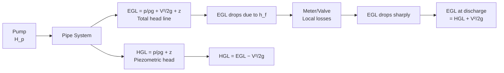
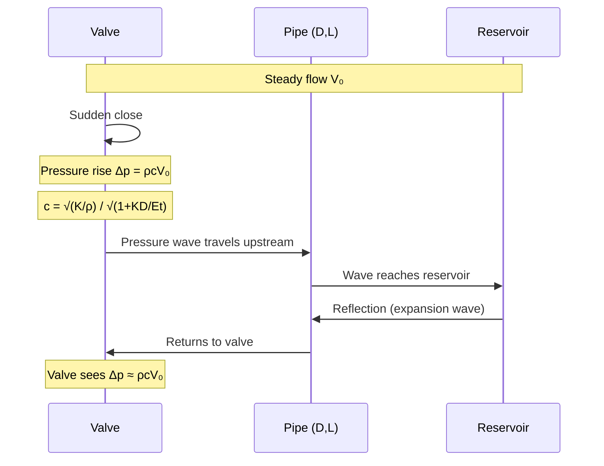
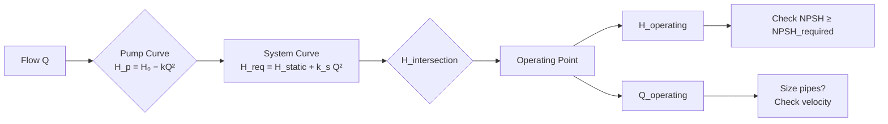

# 1.060 / 1.060A Fluid Mechanics

**MIT CEE Core | 12 Units (1.060) / 6 Units (1.060A first half)**  
**Prereq:** None; *Coreq: 18.03 for 1.060A*
**Instructor:** Prof. Lydya Bourouiba
**自學路徑：Bachelor → MEng → Environmental Engineering / Hydraulics**

> **Source:** MIT OCW 1.060 (Spring 2006) — Prof. L. Bourouiba; MIT Catalog 2024-25
> **Textbooks:** White, *Fluid Mechanics* (8th ed.); Munson et al.;Batchelor
> **Topics:** Hydrostatics, Bernoulli, Navier-Stokes, Pipe flow, Open channel flow, Drag/Lift

---

## 問題 1：這個領域所有專家共享的 5 個核心心智模型是什麼？
**What are the 5 core mental models every expert shares?**

1. **流體連續性方程是質量守恆的微分表達**
   ∂ρ/∂t + ∇·(ρ**V**) = 0. Incompressible: ∇·**V** = 0. Every fluid mechanics problem starts here.

2. **Navier-Stokes 方程是牛頓第二定律在流體中的應用**
   ρ(D**V**/Dt) = −∇p + μ∇²**V** + ρ**g**. This is the governing PDE for Newtonian fluid flow. Everything else is a simplification of NS.

3. **伯努利方程是能量守恆在理想、無黏性、穩態流動中的積分形式**
   p/ρg + V²/2g + z = constant along a streamline. It is NOT valid across shocks, pumps, or dissipative regions.

4. **雷諾數是流動 regime 的主要判據**
   Re = ρVL/μ = VL/ν. Re < 2300: laminar; 2300 < Re < 4000: transitional; Re > 4000: turbulent. This controls which terms dominate in NS.

5. **邊界層決定剪切應力和阻力**
   Boundary layer thickness δ ~ x/√Re_x. Within δ, viscous forces dominate. Outside δ, inviscid flow (Euler) is a good approximation. Separation occurs when ∂U/∂y|_{wall} = 0.

---

## 問題 2：這個領域的專家在哪 3 個地方存在根本分歧？
**What are the 3 fundamental disagreements in this field?**

### 分歧 1: 層流 vs 湍流建模
- **層流派**: Analytical solutions of Navier-Stokes for Re < 2300. Exact, verifiable. Essential for understanding fundamental physics.
- **湍流派 (RANS/LES/DNS)**: Most engineering flows are turbulent. DNS resolves all scales (too expensive); RANS models (k-ε, k-ω) trade accuracy for efficiency.

### 分歧 2: 水力學（H hydraulics）vs 水力學（Hydromechanics）
- **經驗水力學派** (Hydraulics — empirical): Engineers use empirical formulas, Moody diagrams, Manning's equation n = 0.013 for concrete. Practical, validated by centuries of data.
- **理論流體力學派** (Hydromechanics): Derive everything from first principles (NS, turbulence models). More accurate, physically consistent, but requires more computation.

### 分歧 3: 水擊（Water hammer） vs 慢變流（Gradually varied flow）
- **瞬態派**: Water hammer is a hyperbolic PDE problem. Speed of pressure wave c = √(K/ρ) ≈ 1000 m/s in water. Valve closure creates pressures 10×-100× operating pressure.
- **慢變派**: Slowly varying unsteady flow can be treated with quasi-steady assumptions. Valid when ∂/∂t << V/∂x.

---

## 問題 3：10 個區分真實理解 vs 死記硬背的深度問題

1. 從連續性方程 ∂ρ/∂t + ∇·(ρ**V**) = 0 推導不可壓縮流體的 ∇·**V** = 0，並說明在什麼條件下可以忽略 ∂ρ/∂t 項（馬赫數 Ma = V/c 的意義）。
2. 伯努利方程 p/ρg + V²/2g + z = H 沿流線成立。說明為什麼它不能在泵前後（機械功介入）、非穩態流動、或存在顯著能量損耗的情況下直接使用。
3. 雷諾數 Re = ρVL/μ 是如何從 N-S 方程無量綱化得出的？當 Re → 0（Stokes flow）和 Re → ∞（inviscid）時，N-S 方程簡化為什麼形式？
4. 管道層流（Hagen-Poiseuille flow）給出速度分佈 u(r) = (Δp/4μL)(R² − r²)，最大速度是平均速度的多少倍？壓力梯度 Δp/L 如何與流量 Q 相關？
5. 莫迪圖（Moody diagram）顯示摩擦因子 f 與雷諾數 Re 和相對粗糙度 ε/D 的關係。當 Re > 10⁵ 時，f 如何趨近於一個與 Re 無關的極限值？解釋尼古拉茲曲線（Nikuradse）的物理意義。
6. 邊界層方程（Boundary layer equations）是如何從完整 N-S 方程在邊界層近似下推導出來的？什麼條件使外部勢流和內部邊界層流動解耦？
7. 明渠均勻流 Manning 公式 Q = (1/n)AR^{2/3}S^{1/2} 中，粗糙係數 n 如何選取？為什麼 n 不是一個嚴格的物理常數，而是經驗係數？
8. 水擊（water hammer）中，閥門突然關閉產生的壓力波速 c = √(K/ρ) / √(1 + K·D/(E·e)) 是如何考慮管道彈性的？當管道剛性增加時，c 如何變化？
9. 從動量方程推導作用於彎頭上的力：F = ṁ(V₂ − V₁) + (p₂A₂ − p₁A₁)。若彎頭兩端直徑相同（V₁ = V₂），為什麼仍有力作用於彎頭？
10. 卡門渦街（Kármán vortex street）的斯特勞哈爾數 St = fD/V ≈ 0.2 的物理意義是什麼？為什麼這個數對橋樑和煙囪的風致振動設計很重要？

---

# 核心心智模型深化（中英對照）

## 1. 連續性方程與質量守恆

### 1.1 Bilingual 概念對照
| English | 中英對照 | 定義 | 工程應用 |
|---|---|---|---|
| Continuity equation | 連續性方程 | ∂ρ/∂t + ∇·(ρ**V**) = 0 | Mass conservation |
| Incompressible flow | 不可壓縮流 | ∇·**V** = 0 (density constant) | Water, low-speed air |
| Compressible flow | 可壓縮流 | Ma = V/c; Ma < 0.3 ≈ incompressible | High-speed gas dynamics |
| Volumetric flow rate | 體積流量 | Q = AV | Pipe design |
| Mass flow rate | 質量流量 | ṁ = ρAV | Compressible flow |

### 1.2 Key Derivation

**Control volume mass conservation** (Reynolds Transport Theorem):
d/dt ∫_CV ρ dV + ∫_CS ρ(**V**·**n**) dA = 0

For steady flow (∂/∂t = 0): ∫_CS ρ(**V**·**n**) dA = 0
→ ρ₁A₁V₁ = ρ₂A₂V₂ (mass flow rate is constant)

For incompressible (ρ = constant): A₁V₁ = A₂V₂ → **V₁A₁ = V₂A₂**

**Example — Pipe with sudden expansion**:
D₁ = 10 cm → A₁ = 78.5 cm²
D₂ = 20 cm → A₂ = 314 cm²
V₂ = V₁ × A₁/A₂ = V₁ × 78.5/314 = V₁ × 0.25

If V₁ = 2 m/s, then V₂ = 0.5 m/s. The kinetic energy is dissipated in the expansion (head loss h_L = (V₁−V₂)²/2g).

### 1.3 Engineering Applications
- **Water supply systems**: Continuity governs pipe diameter selection. Q = 10 L/s → if V = 1.5 m/s (typical), A = Q/V = 0.01/1.5 = 0.0067 m² → D = √(4A/π) = 0.092 m → use 100 mm pipe.
- **Channel flow**: Q = A·V, A = b·h for rectangular channel. Continuity: at a choke point (narrowing), depth increases and velocity increases to maintain Q.

---

## 2. Navier-Stokes 方程

### 2.1 Bilingual 概念對照
| English | 中英對照 | 定義 | 工程應用 |
|---|---|---|---|
| Navier-Stokes | Navier-Stokes 方程 | ρ(D**V**/Dt) = −∇p + μ∇²**V** + ρ**g** | Governing PDE of fluid flow |
| Newtonian fluid | 牛頓流體 | τ = μγ̇ (shear stress proportional to strain rate) | Water, air, oil |
| Vorticity | 渦量 | ω = ∇×**V** | Turbulence, vortex dynamics |
| Pressure gradient | 壓力梯度 | ∇p — drives flow against friction | Pipe networks |

### 2.2 Key Derivation

Start from Cauchy momentum equation (Newton's 2nd law on fluid element):
ρ a = ΣF

Forces on differential element dx·dy·dz:
- Pressure: (p − ∂p/∂x dx)dy dz − p dx dy dz = −(∂p/∂x) dx dy dz → −∇p
- Viscous: τ_xy surface shear, net = (∂τ_xy/∂y) dx dy dz → μ(∂²u/∂y²) for Newtonian
- Gravity: ρg dx dy dz

In tensor form (Cartesian coordinates, Newtonian fluid):
**ρ(∂V_i/∂t + V_j ∂V_i/∂x_j) = −∂p/∂x_i + μ ∂²V_i/∂x_j² + ρg_i**

Boundary conditions:
- No-slip: **V** = 0 at solid walls
- Free surface: p = p_atm, τ = 0
- Symmetry: ∂V/∂n = 0

**Exact solutions**:
1. **Hagen-Poiseuille** (steady, laminar pipe flow): u(r) = −(1/4μ)(∂p/∂x)(R²−r²), Q = πR⁴Δp/(8μL)
2. **Stokes** (very low Re, Re → 0): Oseen equations: −∇p + μ∇²**V** = 0
3. **Laminar flat plate BL**: Blasius solution, δ(x) ≈ 5x/√Re_x

### 2.3 Engineering Applications
- **Pipe networks**: Solve NS in cylindrical coordinates for steady laminar pipe flow. Friction head loss h_f = 32μVL/(ρgD²) = 64μ/(ρVL) × V²/2g = f·(L/D)·V²/2g. For laminar flow f = 64/Re.
- **Boundary layer**: Over a flat plate, δ(x) = 5x/√Re_x, τ_wall(x) = 0.332μV_∞/δ(x), total drag D = 0.664ρV_∞²b√(μVx/L)/2.

---

## 3. 伯努利方程與能量方程

### 3.1 Bilingual 概念對照
| English | 中英對照 | 定義 | 工程應用 |
|---|---|---|---|
| Bernoulli equation | 伯努利方程 | p/ρg + V²/2g + z = H (constant along streamline) | Ideal, inviscid, steady flow |
| Head loss | 水頭損失 | h_L = (V₁−V₂)²/2g (expansion) | Energy dissipation |
| pump head | 泵揚程 | H_p = (p₂−p₁)/ρg + (V₂²−V₁²)/2g + (z₂−z₁) | Pump selection |
| EGL | 水力梯度線 | HGL = p/ρg + z | Pressure head visualization |
| HGL/EGL | 水力/能量梯度線 | HGL: piezometric head; EGL: total head | Pipe network |

### 3.2 Key Derivation

Along a streamline (1D, inviscid, steady, incompressible):
From NS in streamwise direction s:
ρ(V dV/ds) = −dp/ds − ρg dz/ds

Rearrange: d(p/ρg) + d(V²/2g) + dz = 0

Integrate: **p₁/ρg + V₁²/2g + z₁ = p₂/ρg + V₂²/2g + z₂ = H**

**Practical forms**:
- With pump: H_pump added to left side
- With turbine: H_turbine subtracted from left side
- With head loss: h_L added to right side

**Example — Orifice flow**:
Q = C_d A_orifice √(2gh)
For h = 3 m, D = 50 mm, C_d = 0.62:
A = π(0.025)² = 0.00196 m²
Q = 0.62 × 0.00196 × √(2×9.81×3) = 0.62 × 0.00196 × 7.67 = **0.00933 m³/s = 9.3 L/s**

### 3.3 Engineering Applications
- **Pitot tube**: V = √(2Δp/ρ) = √(2gh). For water at h = 0.1 m: V = √(2×9.81×0.1) = 1.4 m/s.
- **Venturi meter**: Q = C_d A₁A₂√(2Δp/ρ(A₁²−A₂²)) = C_d A₁A₂√(2gh/((A₁²−A₂²))).
- **Sluice gate**: V₁ = C_d√(2g(h₁−h₂)), downstream supercritical if Fr₂ > 1.

---

## 4. 管道流動與摩擦損耗

### 4.1 Bilingual 概念對照
| English | 中英對照 | 定義 | 工程應用 |
|---|---|---|---|
| Friction factor | 摩擦因子 | f = 64/Re (laminar); Colebrook-White (turbulent) | Darcy-Weisbach |
| Darcy-Weisbach | Darcy-Weisbach 方程 | h_f = f(L/D)(V²/2g) | Head loss calculation |
| Moody diagram | Moody 圖 | f vs Re, ε/D | Pipe design |
| Colebrook-White | Colebrook-White 方程 | 1/√f = −2 log₁₀(ε/3.7D + 2.51/Re√f) | Implicit friction factor |

### 4.2 Key Derivation

**Darcy-Weisbach equation** (from energy dissipation):
h_f = f (L/D) (V²/2g)

For laminar pipe flow (Hagen-Poiseuille):
u(r) = (Δp/4μL)(R²−r²), V_avg = (Δp R²)/(8μL)
f = 64μ/(ρV_avg D) = 64/Re

**Swamee-Jain** (explicit approximation of Colebrook-White):
1/√f = −2 log₁₀[ε/3.7D + 5.74/Re^{0.9}]
Valid for: 10⁻⁶ ≤ ε/D ≤ 10⁻², 5000 ≤ Re ≤ 10⁸

**Complete turbulence** (Re > 10⁵): f ≈ [2 log₁₀(Re/2.51)]^{−2} (Prandtl's friction law), independent of ε for fully rough turbulent flow.

**Example — Water supply main**:
Q = 50 L/s = 0.05 m³/s, D = 300 mm = 0.3 m, V = 0.05/(π×0.15²) = 0.707 m/s
Re = VD/ν = 0.707×0.3/(1×10⁻⁶) = 212,000 (turbulent)
ε = 0.046 mm (commercial steel), ε/D = 0.000153
From Moody: f ≈ 0.018
h_f = 0.018 × (2000/0.3) × (0.707²/2×9.81) = 0.018 × 6667 × 0.0255 = **3.06 m** per km of pipe

### 4.3 Engineering Applications
- **Series pipes**: Total head loss = Σh_f,i. Flow Q is same in each pipe.
- **Parallel pipes**: Head loss is same in each branch; Q_i = Q × (f_i L_i/D_i)^{−1/2}/Σ(f_j L_j/D_j)^{−1/2}.
- **Pump-pipe system**: Operating point = intersection of pump curve H_p = H_0 − kQ² and pipe curve H_req = h_static + kQ² (system curve).

---

## 5. 明渠流動與弗勞德數

### 5.1 Bilingual 概念對照
| English | 中英對照 | 定義 | 工程應用 |
|---|---|---|---|
| Froude number | 弗勞德數 | Fr = V/√(gD_h) | Subcritical vs supercritical |
| Normal depth | 正常水深 | y_n from Manning Q = (1/n)AR^{2/3}S^{1/2} | Channel design |
| Specific energy | 比能 | E = y + V²/2g | Open channel transitions |
| Critical depth | 臨界水深 | y_c = (Q²/gA²)^{1/3} at Fr = 1 | Channel control |

### 5.2 Key Derivation

**Manning equation** (empirical, widely used):
V = (1/n) R^{2/3} S^{1/2}, Q = AV = (1/n) A R^{2/3} S^{1/2}

where:
- R = A/P (hydraulic radius)
- S = channel slope (energy gradient = bed slope for uniform flow)
- n = Manning roughness coefficient (0.013 for concrete, 0.035 for grass)

**Normal depth** (iterative solution): For given Q, n, b, S, solve:
Q = (1/n)(by) [(by)/(b+2y)]^{2/3} S^{1/2}

**Critical depth** (Fr = 1):
Fr² = Q²T/(gA³) = 1 → y_c from: Q²T/(gA³) = 1

For rectangular channel (b = width):
A = by, T = b → Q²/(g b²y_c³) = 1 → **y_c = (Q²/(gb²))^{1/3}**

**Example — Rectangular channel, Q = 5 m³/s, b = 3 m**:
y_c = (5²/(9.81×3²))^{1/3} = (25/88.3)^{1/3} = 0.283^{1/3} = **0.657 m**

If actual depth y = 1.2 m: Fr = V/√(gy) = (5/(3×1.2))/√(9.81×1.2) = 1.39/3.42 = 0.41 < 1 → **subcritical flow**

### 5.3 Engineering Applications
- **Spillway design**: Supercritical flow (Fr > 1) in spillway chute; hydraulic jump at downstream end dissipates energy.
- **Sewer design**: Design for partial flow conditions using Manning. Minimum velocity = 0.6 m/s (self-cleansing).
- **Backwater curves**: Gradually varied flow equation: dy/dx = S₀ − S_f / (1 − Fr²).

---

# 深度自測問題詳解（中英對照）

## 詳解 1: 連續性方程推導
**Q:** 從 ∂ρ/∂t + ∇·(ρ**V**) = 0 推導 ∇·**V** = 0。
**Answer:** 
For incompressible flow, ρ = constant. Therefore ∂ρ/∂t = 0.
∂ρ/∂t + ∇·(ρ**V**) = 0 → 0 + ρ ∇·**V** = 0 → **∇·**V** = 0**

**When is incompressible valid?** 
Ma = V/c. For water at 20°C, c ≈ 1480 m/s. For V = 3 m/s: Ma = 3/1480 = 0.002 << 0.3. For air at V = 100 m/s: Ma = 100/340 = 0.29 ≈ 0.3, boundary of incompressible assumption.

**Engineering implication:** Water supply, hydropower, and most civil engineering hydraulic problems use incompressible assumption. Airflow above Ma 0.3 requires compressible flow equations (Stokes, Bernoulli modified).

---

## 詳解 2: 伯努利方程的失效條件
**Q:** 為什麼伯努利方程不能在泵前後使用？
**Answer:** 
伯努利方程的推導假設：無黏性（無剪切損耗）、無機械功交換、穩態、沿流線。

當機械功存在時（泵或渦輪），能量方程變為：
p₁/ρg + V₁²/2g + z₁ + H_pump = p₂/ρg + V₂²/2g + z₂ + h_L

其中 H_pump 是泵提供的單位重量流體的功（揚程，meters）。

泵效率 η = (ρgQH_pump)/(P_input) = (Hydraulic power)/(Input power)
→ P_input = ρgQH_pump/η

**Example**: Q = 0.05 m³/s, H_pump = 30 m, η = 0.8:
P_input = 1000×9.81×0.05×30/0.8 = **18.4 kW**

**Engineering implication:** Pump curves H_p(Q) are typically parabolic: H_p = H_0 − kQ². The operating point is where the pump curve intersects the system curve (pipe friction + static head).

---

## 詳解 3: 雷諾數的物理意義與無量綱化
**Q:** 雷諾數 Re = ρVL/μ 的物理意義，以及 Re → 0 和 Re → ∞ 時 N-S 方程的極限形式。
**Answer:** 
Re = ρVL/μ = VL/ν (where ν = μ/ρ is kinematic viscosity). Re represents the ratio of inertial forces to viscous forces:

Re = (ρV²/L²)/(μV/L²) = (Inertial)/(Viscous)

**Re → 0 (Stokes flow)**:
慣性項 ρ(D**V**/Dt) ≈ 0 → −∇p + μ∇²**V** + ρ**g** = 0
這是 **Stokes equations** 或 **Oseen equations** (若包含微小慣性)。
典型應用：微流體、污染物在多孔介質中的遷移、軸承潤滑。
Example: 球形顆粒在液體中的沉降速度 V_s = 2(ρ_p − ρ_f)gr²/(9μ)。

**Re → ∞ (Inviscid flow)**:
黏性項 μ∇²**V** → 0 → ρ(D**V**/Dt) = −∇p + ρ**g**
這是 **Euler equations**。外部勢流繞流（飛機機翼、橋墩）可以用歐拉方程 + 邊界層修正求解。

**Engineering implication:** 土木工程中大多數流動是中等雷諾數（10⁴-10⁷），慣性和黏性都重要，必須完整求解 N-S（或用湍流模型）。

---

## 詳解 4: Hagen-Poiseuille 流
**Q:** 管道層流中 u(r) = (Δp/4μL)(R²−r²)，最大速度與平均速度的比值，以及 Q 與 Δp 的關係。
**Answer:** 
**速度分佈**（拋物線）：u(r) = (−Δp/4μL)(R²−r²)，最大值在 r = 0（管道中心）：
u_max = (−Δp/4μL)·R²

**平均速度**：
V_avg = Q/A = (2π∫₀^R u(r) r dr)/(πR²)
= (2/R²)∫₀^R (Δp/4μL)(R²−r²) r dr = (Δp/2μL R²)[R²·r²/2 − r⁴/4]₀^R
= (Δp/2μL R²)(R⁴/2 − R⁴/4) = (Δp/2μL)(R²/4) = u_max/2

→ **V_avg = u_max/2**（層流拋物線分佈的平均速度是最大值的一半）

**流量**：
Q = V_avg × A = (u_max/2) × πR² = (−Δp·R⁴)/(8μL) × π

This is the **Hagen-Poiseuille equation**: **Q = (πΔp R⁴)/(8μL)**
Or in terms of pressure gradient: Δp/L = (8μQ)/(πR⁴) = (32μV_avg)/(D²)

**Engineering implication:** Q ∝ R⁴ — doubling pipe diameter increases flow capacity by 16×! This is why the 4th-power law makes pipe sizing critical.

---

## 詳解 5: Moody 圖與完全粗糙湍流
**Q:** 當 Re > 10⁵ 時，摩擦因子 f 如何趨近於與 Re 無關的極限值？
**Answer:** 
Colebrook-White: 1/√f = −2 log₁₀(ε/3.7D + 2.51/(Re√f))

在完全粗糙湍流區（fully rough turbulent regime），相對粗糙度 ε/D 是主要控制因素：

當 Re → ∞：2.51/(Re√f) → 0（慣性力遠大於黏性力，黏性效應可以忽略）
→ 1/√f ≈ −2 log₁₀(ε/3.7D)
→ **f ≈ [2 log₁₀(3.7D/ε)]^{−2}**（完全粗糙湍流，與 Re 無關！）

**Example**: ε = 0.046 mm (commercial steel), D = 300 mm, ε/D = 0.000153
f ≈ [2 log₁₀(3.7/0.000153)]^{−2} = [2×3.82]^{−2} = [7.64]^{−2} = **0.0171**

這與 Moody 圖的讀數一致。與層流 f = 64/Re = 64/200000 = 0.00032 相比，湍流的摩擦因子大約 50×！

**Engineering implication:** 在高 Re 的自來水系統中，摩擦因子主要由管壁粗糙度決定。選擇內壁光滑的新管道（如 HDPE）可以長期降低能耗。

---

## 📊 Diagram 1: 能量梯度線與水力梯度線


## 📊 Diagram 2: 邊界層發展
```mermaid
graph LR
    A[Uniform flow V∞] --> B[Laminar BL<br/>δ ~ 5x/√Re_x]
    B --> C[Transition<br/>Re_x ≈ 5×10⁵]
    C --> D[Turbulent BL<br/>δ ~ 0.37x/Re_x^{1/5}]
    D --> E[Separation<br/>dp/dx < 0]
    B -.->|Inviscid core| F[Outside BL<br/>Euler equations]
    D -.->|Inner viscous sublayer| G[Turbulent shear<br/>−ρu'v' avg]
```

## 📊 Diagram 3: 明渠流 Regimes
```mermaid
graph TD
    A[Open Channel Flow] --> B{Fr = V/√(gD_h)}
    B -->|Fr < 1<br/>Subcritical| C[Slow, deep<br/>Controlled by downstream<br/>Backwater curves]
    B -->|Fr = 1<br/>Critical| D[Minimum energy<br/>y_c = Q²/gA²<br/>Control section]
    B -->|Fr > 1<br/>Supercritical| E[Fast, shallow<br/>Controlled by upstream<br/>Hydraulic jump at transition]
    C --> F[Gradually Varied Flow<br/>dy/dx = S₀−Sf / 1−Fr²]
    E --> G[dy/dx < 0<br/>Depth decreases]
```

## 📊 Diagram 4: 水擊現象


## 📊 Diagram 5: 泵-管道系統工作點


---

## 總結

1. **連續性方程是所有流體流動分析的起點**：∇·**V** = 0 對不可壓縮流體，決定速度分佈與管道/渠道幾何的關係
2. **Navier-Stokes 是流體力學的終極方程**：所有其他方程（伯努利、邊界層理論、管道流公式）都是 N-S 的簡化或積分形式
3. **雷諾數是流動 regime 的指紋**：層流（Re < 2300）、過渡流（2300-4000）、湍流（Re > 4000）——每個 regime 需要不同的分析和計算方法
4. **伯努利方程是能量守恆的便捷工具，但有嚴格的適用條件**：永遠不要在有泵/渦輪、有顯著能量損耗、或非穩態的情況下直接使用未修正的伯努利方程
5. **明渠流動由弗勞德數控制**：Fr < 1（亞臨界）受下游控制；Fr > 1（超臨界）受上游控制；Fr = 1（臨界）是控制和能量極值的標誌

**自學建議** — 配對：White *Fluid Mechanics* (8th ed.) + Munson et al. + MIT OCW 1.060 講義。每週完成 3 道水力計算（Manning 方程、伯努利+Moody、管道網絡）。

**Prerequisite chain**: Physics II (GIR) → Calculus II (GIR) → 1.060 Fluid Mechanics → 1.061 Transport Processes → 1.106/1.107 Lab → MEng Environmental Engineering
