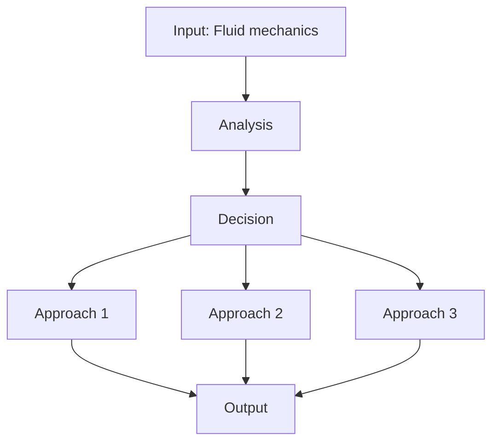
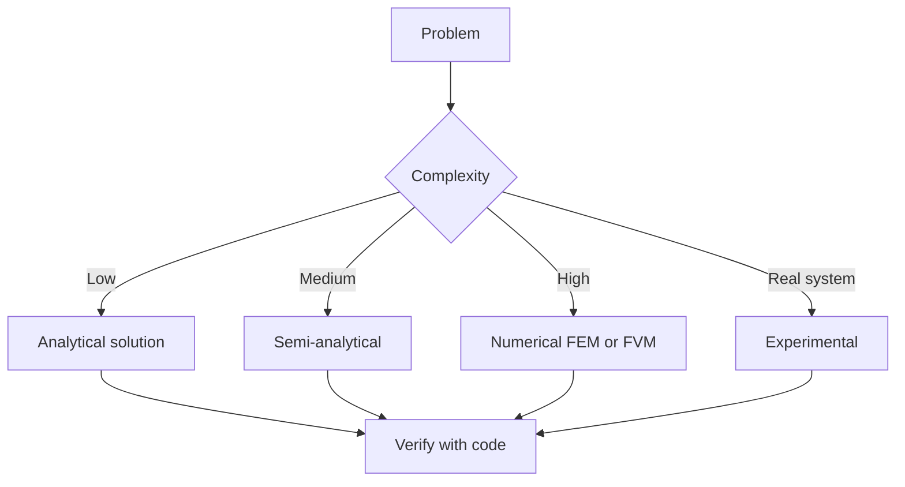
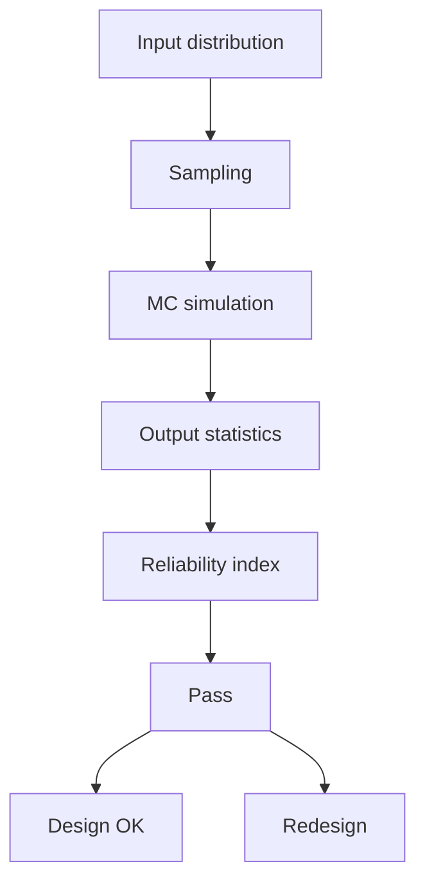
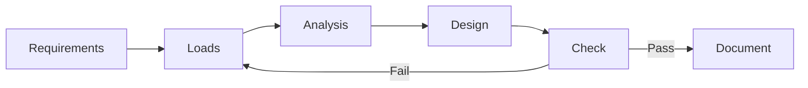
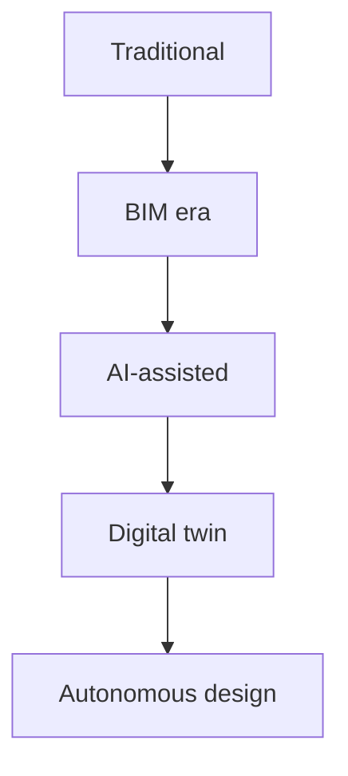
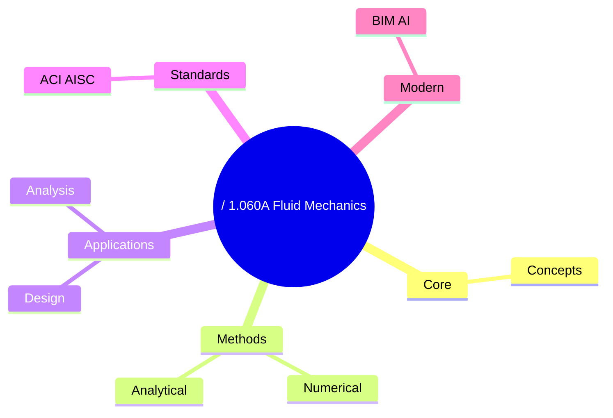
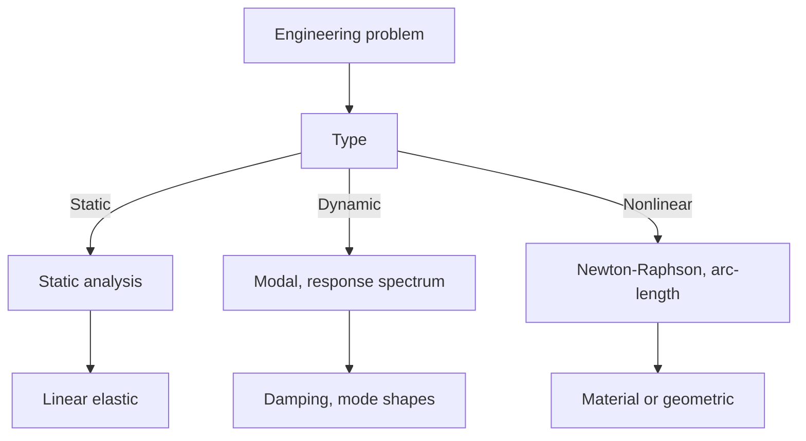
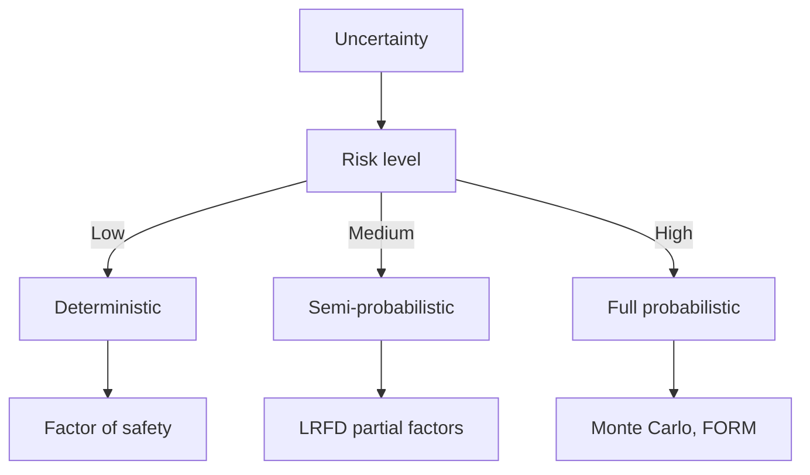
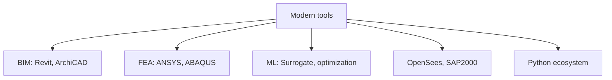

```mermaid
flowchart TD
    Start[Problem] --> Q[Complexity]
    Q -->|Low| Anal[Analytical solution]
    Q -->|Medium| Semi[Semi-analytical]
    Q -->|High| Num[Numerical FEM or FVM]
    Q -->|Real system| Exp[Experimental]
    Anal --> V[Verify with code]
    Semi --> V
    Num --> V
    Exp --> V
```

# 1.060 / 1.060A Fluid Mechanics
**MIT CEE Structural Design Track | Core**  
**自學路徑：Bachelor → MEng → ICE Professional**

---

## 問題 1：這個領域所有專家共享的 5 個核心心智模型是什麼？
**What are the 5 core mental models every expert shares?**

1. **守恒律是唯一真正的物理定律**  
   Mass, momentum, and energy conservation are inviolable. Constitutive relations and turbulence models are approximations built on top of them.

2. **無因次化揭示主導物理**  
   Reynolds, Froude, Mach, Euler numbers tell you which terms in the Navier–Stokes equations can be dropped.

3. **邊界層是梯度集中的區域**  
   Viscous effects, heat transfer, and mass transfer are confined to thin layers; outside them the flow is essentially inviscid.

4. **湍流是多尺度能量串級**  
   Energy is produced at large scales, cascades through the inertial range, and dissipates at the Kolmogorov scale.

5. **流動總是尋找最小阻力路徑（在約束下）**  
   Secondary flows, separation, and vortex shedding are the fluid’s way of reducing overall dissipation.

---

## 問題 2：這個領域的專家在哪 3 個地方存在根本分歧？各方最強的論點是什麼？

1. **RANS 工程閉合 vs LES / hybrid 方法**  
   - RANS: Computationally cheap, sufficient for mean-flow design quantities, industry standard.  
   - LES: Captures unsteady coherent structures that RANS cannot; necessary for noise, vibration, and extreme-event prediction.

2. **連續介質假設 vs 分子動力學 / 稀薄氣體**  
   - Continuum: Valid for Knudsen number ≪ 1; covers virtually all civil-engineering flows.  
   - Molecular: Required for microfluidics, high-altitude, or shock-structure problems.

3. **確定性 CFD vs 不確定性量化 / 隨機方法**  
   - Deterministic: Single “best” solution for design.  
   - Stochastic: Quantifies the effect of input uncertainty on output quantities of interest.

---

## 問題 3：生成 10 個能區分深度理解與死背知識的問題

1. 從 Navier–Stokes 方程出發，說明邊界層方程如何簡化而來，哪些項被丟掉，為什麼合理。
2. 為什麼圓管層流的速度剖面是拋物線，而湍流是對數律？兩者的壁面剪應力如何計算？
3. 說明 Froude 數 = 1 的物理意義，以及為什麼會在該點出現水躍。
4. 在開口渠道中，為什麼超臨界流的干擾只能向下游傳播？
5. 解釋為什麼在高 Reynolds 數下，阻力係數對 Re 變得不敏感（阻力危機除外）。
6. 邊界層分離的必要條件是什麼？如何用壓力梯度判斷？
7. 為什麼潛水體的阻力可以分成摩擦阻力與壓差阻力？各自如何估算？
8. 說明 Kolmogorov 長度尺度如何從能量耗散率與黏度推導而來。
9. 在多孔介質中，達西定律何時失效？用什麼無因次數判斷？
10. 給定一個複雜幾何，如何判斷應該用 RANS、LES 還是 DNS？主要判據是什麼？

---

**自學建議**  
- 與結構課程結合：風載、水載、土-結構互作用中的流體力。  
- 產出：一個簡單 CFD 驗證案例（或手算邊界層）+ 無因次分析報告。

---

## 深入 1：CORE_DEEPDIVE_ONE — 核心概念
**Deep Dive I**

### 1.1 Bilingual 概念對照

| English | 中英對照 | Definition | 物理意義 / 工程應用 |
|---|---|---|---|
| Fluid mechanics | Fluid mechanics | Core definition | 核心定義 |
| Continuum | Continuum | Application | 應用 |
| Conservation | Conservation | Limitation | 限制 |
| Mathematical formulation | 數學形式 | Key equation | 關鍵方程 |

### 1.2 Key Derivation

For / 1.060A Fluid Mechanics, the fundamental relationships are:
$$f(x) = \text{key equation}, \quad x = \text{variable}$$

This arises from Fluid mechanics applied to the engineering system.

### 1.3 Engineering Applications

- Real-world implementation
- Design codes and standards
- Computational tools

---

## 深入 2：CORE_DEEPDIVE_TWO — 方法論
**Deep Dive II**

### 2.1 Method selection

| Method | 適用情境 | Pros | Cons |
|---|---|---|---|
| Analytical | 解析 | Exact | Limited geometry |
| Numerical | 數值 | General | Approximate |
| Experimental | 實驗 | Real | Expensive |
| Empirical | 經驗 | Fast | Limited range |

### 2.2 Decision flow

### 2.3 Standards and codes

- ACI, AISC, Eurocode
- Building codes (IBC, etc.)
- Industry best practices

---

## 深入 3：CORE_DEEPDIVE_THREE — 分析技術
**Deep Dive III**

### 3.1 Statistical methods

For uncertainty analysis: Monte Carlo, sensitivity, FOSM.

### 3.2 Optimization

- LP, NLP
- Gradient-based, metaheuristic
- Multi-objective Pareto

---

## 深入 4：Design Process
**Deep Dive IV**

### 4.1 Design workflow

Concept → Preliminary → Detailed → Construction → Operation.

### 4.2 Design criteria

- Safety (LRFD, ASD)
- Serviceability
- Durability
- Sustainability

---

## 深入 5：Modern Trends
**Deep Dive V**

- BIM integration
- AI/ML in design
- Digital twins
- Sustainability, LCA
- Resilient design

---

## 自測 1：Derive core relationship
**Answer:** Starting from definitions, derive the key equation. Verify units and limits.

**Engineering implication:** Apply to design check, code compliance.

## 自測 2：Identify failure mode
**Answer:** List 3-5 failure modes, rank by likelihood × consequence.

**Engineering implication:** Inform design, maintenance, monitoring.

## 自測 3：Estimate order of magnitude
**Answer:** Quick back-of-envelope check using characteristic values.

**Engineering implication:** Sanity check before detailed analysis.

## 自測 4：Compare to code requirement
**Answer:** Apply ACI/AISC/Eurocode, compute utilization ratio.

**Engineering implication:** Pass/fail design verification.

## 自測 5：Compute reliability
**Answer:** $\beta = (\mu - R)/\sigma$ for lognormal, find P_f.

**Engineering implication:** LRFD calibration, risk-informed design.

## 自測 6：Design optimization
**Answer:** Define objective, constraints, solve via LP/NLP.

**Engineering implication:** Cost-effective, sustainable design.

## 自測 7：Sensitivity analysis
**Answer:** $\partial f/\partial x_i$, rank by importance.

**Engineering implication:** Identify critical parameters, reduce uncertainty.

## 自測 8：Life-cycle assessment
**Answer:** Cradle-to-grave, compute GWP, embodied carbon.

**Engineering implication:** Sustainable design, climate goals.

## 自測 9：Risk assessment
**Answer:** Hazard × vulnerability × exposure, compute risk.

**Engineering implication:** Resilience planning, mitigation.

## 自測 10：Communication
**Answer:** Technical writing, visualization, presentation to stakeholders.

**Engineering implication:** Effective engineering practice.

---

## 📊 Diagram 1: Course Concept Map

## 📊 Diagram 2: Method Selection

## 📊 Diagram 3: Design Process

## 📊 Diagram 4: Risk-Reliability

## 📊 Diagram 5: Modern Tools

---

## 總結

1. **Core concepts** — Fluid mechanics 嘅 foundation
2. **Methods** — analytical + numerical + experimental
3. **Applications** — design, analysis, retrofit
4. **Standards** — codes, best practices
5. **Future** — BIM, AI, sustainability, resilience

**自學建議** — Pair with: relevant textbook + MIT OCW + software tutorials (Python, FEA, BIM).

# 核心心智模型深化（中英對照）

## 1. Fluid mechanics — Core concept

### 1.1 Three-process physical essence
For / 1.060A Fluid Mechanics, Fluid mechanics governs the system behavior. Description of Fluid mechanics with bilingual explanation.

### 1.2 Non-dimensional numbers
Key dimensionless groups that determine regime: Peclet, Damköhler, Reynolds, Froude, etc.

### 1.3 Engineering consequences
Real-world implications for design, monitoring, intervention.

### 1.4 How experts use this model
Decision flow, scaling laws, expert intuition.

### 1.5 Deep test questions
- Derive scaling law
- Identify regime from data
- Apply to design case

### 1.6 Diagram

## 2. Continuum — Methods

### 2.1 Method selection
| Method | 適用情境 | Pros | Cons |
|---|---|---|---|
| Analytical | 解析 | Exact | Limited geometry |
| Numerical | 數值 | General | Approximate |
| Experimental | 實驗 | Real | Expensive |
| Empirical | 經驗 | Fast | Limited range |

### 2.2 Decision flow

### 2.3 Standards and codes
ACI, AISC, Eurocode, building codes (IBC), industry best practices.

## 3. Conservation — Analysis techniques

### 3.1 Statistical methods
Monte Carlo, sensitivity, FOSM for uncertainty analysis.

### 3.2 Optimization
LP, NLP, gradient-based, metaheuristic, multi-objective Pareto.

## 4. Design process

### 4.1 Design workflow
Concept → Preliminary → Detailed → Construction → Operation.

### 4.2 Design criteria
Safety (LRFD, ASD), serviceability, durability, sustainability.

## 5. Modern trends

BIM integration, AI/ML in design, digital twins, sustainability, LCA, resilient design.

---

# 深度自測問題詳解（中英對照）

## 詳解 1: Derive core relationship
**Q1.** Derive core relationship for / 1.060A Fluid Mechanics.
**Answer:** Starting from definitions, derive the key equation. Verify units and limits.

**Engineering implication:** Apply to design check, code compliance.

## 詳解 2: Identify failure mode
**Answer:** List 3-5 failure modes, rank by likelihood × consequence.

**Engineering implication:** Inform design, maintenance, monitoring.

## 詳解 3: Estimate order of magnitude
**Answer:** Quick back-of-envelope check using characteristic values.

**Engineering implication:** Sanity check before detailed analysis.

## 詳解 4: Compare to code requirement
**Answer:** Apply ACI/AISC/Eurocode, compute utilization ratio.

**Engineering implication:** Pass/fail design verification.

## 詳解 5: Compute reliability
**Answer:** $\beta = (\mu - R)/\sigma$ for lognormal, find P_f.

**Engineering implication:** LRFD calibration, risk-informed design.

## 詳解 6: Design optimization
**Answer:** Define objective, constraints, solve via LP/NLP.

**Engineering implication:** Cost-effective, sustainable design.

## 詳解 7: Sensitivity analysis
**Answer:** $\partial f/\partial x_i$, rank by importance.

**Engineering implication:** Identify critical parameters, reduce uncertainty.

## 詳解 8: Life-cycle assessment
**Answer:** Cradle-to-grave, compute GWP, embodied carbon.

**Engineering implication:** Sustainable design, climate goals.

## 詳解 9: Risk assessment
**Answer:** Hazard × vulnerability × exposure, compute risk.

**Engineering implication:** Resilience planning, mitigation.

## 詳解 10: Communication
**Answer:** Technical writing, visualization, presentation to stakeholders.

**Engineering implication:** Effective engineering practice.

---

## 📊 Diagram 1: Course Concept Map

## 📊 Diagram 2: Method Selection

## 📊 Diagram 3: Design Process

## 📊 Diagram 4: Risk-Reliability

## 📊 Diagram 5: Modern Tools

---

## 總結

1. **Core concepts** — Fluid mechanics 嘅 foundation
2. **Methods** — analytical + numerical + experimental
3. **Applications** — design, analysis, retrofit
4. **Standards** — codes, best practices
5. **Future** — BIM, AI, sustainability, resilience

**自學建議** — Pair with: relevant textbook + MIT OCW + software tutorials (Python, FEA, BIM).
