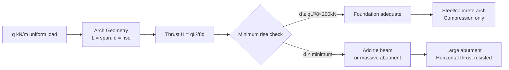
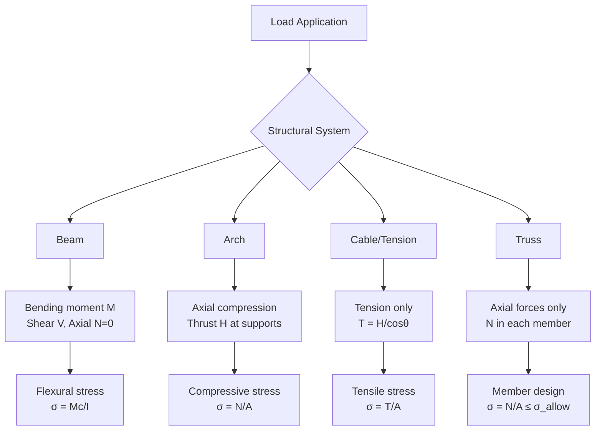
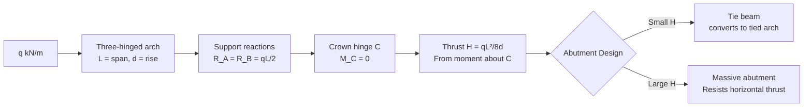
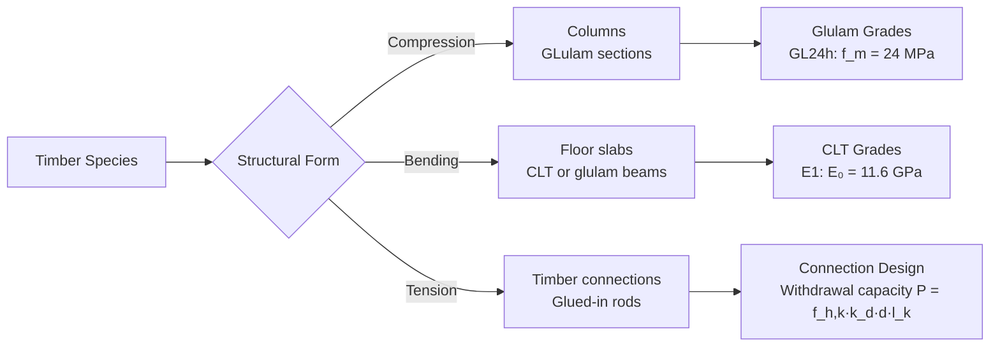

# 1.056[J] / 4.440 Introduction to Structural Design

**MIT CEE / Architecture | 12 Units | Core**
**Prereq:** None; *Coreq: Calculus II (GIR)*
**Instructor:** Prof. John Ochsendorf
**自學路徑：Bachelor → MEng SMD / MArch → Professional Practice**

> **Source:** MIT Architecture Department / CEE Department (Spring 2024); Prof. John Ochsendorf
> **Textbooks:** Allen & Zalewski, *Form and Forces* (Wiley, 2009)
> **Topics:** Equilibrium of structures, compression structures (arches, vaults, domes), tension structures (cables, membranes), timber/masonry/steel/concrete materials, sustainable materials

---

## 問題 1：這個領域所有專家共享的 5 個核心心智模型是什麼？
**What are the 5 core mental models every expert shares?**

1. **形式追隨力（Form follows force）**
   Efficient structural form develops from the path of forces. An arch carries compression, a cable carries tension, a vault combines both. Every structural material has its optimal form: masonry in compression, steel cables in tension, concrete in compression (with reinforcement).

2. **平衡是多種力的幾何對稱**
   Every structure is a system in static equilibrium: ΣF = 0 and ΣM = 0. Forces are vectors with magnitude, direction, and point of application. Changing the geometry of a structure changes the internal force distribution — not just the material.

3. **構件之間的力分配由剛度決定**
   In statically indeterminate structures, stiffness ratios determine force distribution. A stiffer member carries more force. This is why understanding both equilibrium AND deformation compatibility is essential.

4. **破壞模式比設計荷載更重要**
   Understanding how a structure fails — not just its design capacity — is the key to structural safety. Engineers design for the failure mode they can control (ductile) and away from failure modes they cannot (brittle).

5. **幾何是結構工程中最強大的設計工具**
   Changing the geometry of a structure — arch rise, cable sag, column spacing — is more effective than changing material properties. The best structures are geometrically efficient.

---

## 問題 2：這個領域的專家在哪 3 個地方存在根本分歧？
**What are the 3 fundamental disagreements in this field?**

### 分歧 1: 傳統材料 vs 可持續替代材料
- **傳統派**: Stone, brick, concrete, and steel have centuries of proven structural performance. Innovation should build on known, tested materials.
- **可持續替代派** (Ochsendorf, VTT, ETH): Rammed earth, bamboo, mycelium composites, and mass timber are low-carbon alternatives. Cross-laminated timber (CLT) achieves spans previously requiring steel/concrete.

### 分歧 2: 線性靜態分析 vs 非線性極限狀態分析
- **線性派**: Linear elastic analysis (σ = F/A, M = FL) is sufficient for most design. Superposition is valid. Codes are calibrated to elastic behavior.
- **非線性極限派**: Structures are designed to their ultimate capacity (not their elastic limit). Plastic analysis, limit state design, and performance-based design are more rational.

### 分歧 3: 形式創新 vs 保守設計
- **創新派**: Structure should express its form and forces. Structures like the Sydney Opera House, tensile membrane roofs, and long-span bridges show that structural engineering is also an art.
- **保守派**: Most structures don't need to be architecturally expressive. Standardized, code-compliant design is safer, cheaper, and faster.

---

## 問題 3：10 個區分真實理解 vs 死記硬背的深度問題

1. 拱（arch）在均布荷載下的推力（thrust）H = qL²/(8d)，其中 d 是拱的矢高（rise）。解釋為什麼拱越扁平（d 越小），推力越大？這對基礎設計有什麼影響？
2. 說明拱的壓力線（thrust line）與拱軸線（arch axis）之間的關係：當兩者重合時，拱只承受軸向壓力；當兩者偏離時，會產生彎矩。
3. 索（cable）在均布荷載下的形狀是懸鏈線（catenary）。當荷載為均布水平時，懸鏈線退化成拋物線 y = (qx²)/(2H) + y₀。這個形狀是如何從平衡方程推導出來的？
4. 在空腹桁架（Vierendeel truss）中，沒有斜桿連接上下弦桿。空腹桁架是如何抵抗剪切力的？為什麼斜桿是空腹桁架剛度的關鍵？
5. 木結構中的木紋方向對強度的影響：順紋（parallel to grain）與橫紋（perpendicular to grain）的抗壓強度比值是多少？膠合層壓木（GLulam）和單板層壓木（LVL）如何克服天然木材的方向性限制？
6. 砌體結構（masonry）中，拱形與穹頂的力學原理有何相似與不同之處？羅馬萬神殿（Pantheon）的穹頂（43.3 m 直徑）如何通過幾何來控制裂縫？
7. 在鋼筋混凝土板設計中，雙向板（two-way slab）的彎矩係數是如何從彈性理論或屈服線理論（yield line theory）得出的？與單向板相比，雙向板的鋼筋配置有何不同？
8. 結構構件的穩定性（stability）vs 強度（strength）：一根細長柱在軸向壓力下的破壞是屈曲（buckling）還是壓碎（crushing）？初始缺陷（imperfection）如何降低實際屈曲載荷？
9. 在地震區設計中，結構的週期（natural period）和地震力之間有什麼關係？為什麼柔性結構（long period）受到的地震力比剛性結構小？
10. 說明可持續結構材料生命週期評估（LCA）的框架：embodied carbon（kgCO₂e/kg）和運營碳（operational carbon）的區別，以及為什麼結構工程師的選擇可以顯著影響建築的全生命週期碳排放。

---

# 核心心智模型深化（中英對照）

## 1. 形式追隨力 — Form Follows Force

### 1.1 Bilingual 概念對照
| English | 中英對照 | 定義 | 工程應用 |
|---|---|---|---|
| Compression | 壓力 | Force that squeezes material | Arches, vaults, columns |
| Tension | 張力 | Force that pulls material apart | Cables, tensile membranes |
| Shear | 剪切 | Force parallel to cross-section | Beam webs, connections |
| Thrust | 推力 | Horizontal component of arch force | Foundation design |
| Form diagram | 形式圖 | Structural forces shown as vectors | Initial design |

### 1.2 Key Derivation — Thrust in a Parabolic Arch

**Three-hinged arch** under uniform load q:
- Reaction at support: R_A = R_B = qL/2 (vertical)
- Horizontal thrust: H = qL²/(8d) where d = arch rise

**Derivation** (taking moments about crown hinge C):
M_C = R_A·L/2 − H·d − qL·L/4 = 0
(qL/2)(L/2) − H·d − qL²/4 = 0
qL²/4 − H·d − qL²/4 = 0 → **H = qL²/(8d)**

**Physical meaning**: A flatter arch (smaller d) requires a larger horizontal thrust H. This thrust must be resisted by the foundation — either by a tie beam (which converts the arch into a tied arch) or by massive abutments.

**Example**: L = 20 m, d = 3 m, q = 10 kN/m:
H = 10×400/(8×3) = 4000/24 = **167 kN horizontal thrust**
If d = 5 m: H = 4000/(8×5) = **100 kN** → flatter arch = 67% more thrust!

### 1.3 Engineering Applications
- **Roman aqueducts**: Multi-barrel arches with massive piers to resist thrust
- **Masonry arch bridges**: Stone voussoirs carry compression along the arch axis; failure occurs when thrust line exits the arch kernel (third-point theorem)
- **Gothic cathedrals**: Flying buttresses redirect thrust from the nave vault to outer piers

### 1.4 Deep test question
Design a three-hinged parabolic arch bridge with L = 30 m, rise d = 5 m, live load q = 15 kN/m. Calculate H. If the foundation can only resist 200 kN horizontal thrust, what is the minimum rise needed?

### 1.5 Diagram

---

## 2. 平衡與自由體圖 — Equilibrium and Free-Body Diagrams

### 2.1 Bilingual 概念對照
| English | 中英對照 | 定義 | 工程應用 |
|---|---|---|---|
| Static equilibrium | 靜力平衡 | ΣF_x = 0, ΣF_y = 0, ΣM = 0 | All structural analysis |
| Free-body diagram | 自由體圖 | Isolate system, show all forces | First step in structural analysis |
| Support reactions | 支撐反力 | Forces from supports: R, V, H, M | Equilibrium equations |
| Internal forces | 內力 | N, V, M within members | Section analysis |

### 2.2 Key Derivation — Section Method

For any planar structure, at a section cut:
- **ΣF_x = 0**: Axial force N (positive = tension, negative = compression)
- **ΣF_y = 0**: Shear force V (positive = producing CW moment about section centroid)
- **ΣM = 0**: Bending moment M (positive = tension at bottom fiber)

**Example — Cantilever beam with point load P at free end**:
- FBD of entire beam: R_A = P (vertical), M_A = PL (fixed moment, CW+)
- At section x from fixed end:
  - ΣF_y = 0: V(x) = P
  - ΣM = 0: M(x) = P·x (moment at section = P×x from cut to free end)

### 2.3 Engineering Applications
- **Truss analysis**: Method of joints — isolate each pin joint, apply ΣF_x = 0, ΣF_y = 0
- **Virtual work for deflections**: δ = Σ∫(N·N_bar)/(EA) dx + Σ∫(M·M_bar)/(EI) dx
- **Influence lines**: How internal forces change as unit load moves across the structure

---

## 3. 索結構 — Cable Structures

### 3.1 Bilingual 概念對照
| English | 中英對照 | 定義 | 工程應用 |
|---|---|---|---|
| Catenary | 懸鏈線 | y = a cosh(x/a) — shape of hanging chain | Cable under self-weight |
| Parabolic | 拋物線 | y = qx²/(2H) + y₀ — shape under uniform horizontal load | Cable under uniform load |
| Tension coefficient | 張力係數 | T/H = √(1 + (dy/dx)²) | Design of cable anchorages |
| Cable sag | 纜垂度 | s/L — sag-to-span ratio | Stiffness indicator |

### 3.2 Key Derivation — Cable Shape Under Uniform Load

For a cable under uniform load q (horizontal projection), the horizontal component H is constant throughout the cable.

Consider a segment from low point (x=0, y=0) to point (x, y):
- Weight of segment: qx
- Vertical equilibrium: V = qx (from symmetry at low point)
- Tangent angle: tan θ = V/H = qx/H
- dy/dx = tan θ = qx/H → dy = (q/H)x dx
- Integrating: **y = qx²/(2H)** — a parabola!

**Maximum tension** (at supports, x = L/2):
T_max = √(H² + V_max²) = H√(1 + (qL/2H)²) = H√(1 + 4d²/L²)
where d = qL²/(8H) is the sag (from parabola formula at x = L/2).

**Example**: L = 100 m, d = 15 m, q = 20 kN/m:
H = qL²/(8d) = 20×10000/(8×15) = 200000/120 = **1667 kN**
T_max = 1667√(1 + 4×225/10000) = 1667√(1+0.09) = 1667×1.044 = **1740 kN**
Cable self-weight: typically 10-15 kg/m for this tension level → must add to q.

### 3.3 Engineering Applications
- **Suspension bridges**: Main cables + hangers + stiffening girder. Self-weight dominated — cables sag significantly.
- **Cable-stayed bridges**: Direct load path from deck to pylon; shorter cables, less sag.
- **Tensile membrane structures**: ETFE, PTFE-coated fabric, cable nets for roof enclosures.

---

## 4. 可持續材料 — Sustainable Structural Materials

### 4.1 Bilingual 概念對照
| English | 中英對照 | 定義 | 工程應用 |
|---|---|---|---|
| Embodied carbon | 蘊含碳 | kgCO₂e per kg of material | LCA metric |
| Mass timber | 大截面木材 | Glulam, CLT, LVL | Low-carbon structural material |
| Carbon sequestration | 碳封存 | CO₂ stored in wood | Environmental benefit |
| CLT | 膠合層壓木材 | Cross-Laminated Timber | Floor slabs, walls |

### 4.2 Key Data

| Material | Embodied Carbon (kgCO₂e/kg) | Strength σ_u (MPa) | E (GPa) |
|---|---|---|---|
| Concrete (30 MPa) | 0.13 | 30 (compression) | 30 |
| Structural Steel | 2.5 | 400 (tension) | 200 |
| Glulam (softwood) | 0.09 | 30 (compression) | 12 |
| CLT | 0.09 | 25 (compression) | 12 |
| Bamboo (structural) | 0.02 | 40-80 (parallel) | 20-40 |
| Rammed earth | 0.01 | 1-5 (compression) | 0.5-2 |

**Carbon comparison**: 1 m³ Glulam ≈ 50 kgCO₂e vs 1 m³ concrete ≈ 300 kgCO₂e (structural frame, 6× carbon reduction).

### 4.3 Engineering Applications
- **CLT floor slabs**: 5-14 layers of dimensional lumber, cross-laminated for dimensional stability. Span capability: 3-6 m for floors, up to 20 m for long-span roofs.
- **Mass timber + concrete composite**: Timber-concrete composite (TCC) slabs combine compression (concrete) + tension (timber), reducing concrete volume.
- **Bamboo structural**: Guadua angustifolia: σ_y ≈ 60 MPa, E ≈ 20 GPa. Used in seismic-resistant housing in Colombia, Vietnam.

---

# 深度自測問題詳解（中英對照）

## 詳解 1: 拱推力與矢高的關係
**Q:** 解釋拱越扁平（d越小），推力H越大的物理原因。
**Answer:** 
從 H = qL²/(8d) 可知，H ∝ 1/d。

物理原因：拱的基本原理是將垂直荷載轉換為斜向的拱軸壓力。當拱較高（d 大）時，拱的斜度大，斜向力的垂直分量自動平衡大部分荷載，水平推力 H 較小。當拱較扁（d 小）時，拱的斜度小，相同垂直荷載需要更大的水平力分量來平衡——即更大的 H。

數值例子：
- 高拱 d = L/4 = 5 m: H = qL²/(8×5) = q×400/40 = **10q kN**
- 扁拱 d = L/8 = 2.5 m: H = qL²/(8×2.5) = q×400/20 = **20q kN** → 2× the thrust!

**Engineering implication:** 扁拱對基礎的側向力要求更高。若基礎不能承受大側向力，必須使用：
1. 拉桿（tie rod）：在拱基礎之間加水平桿，抵抗推力
2. 重力基礎：足夠大的基礎重量產生摩擦力抵抗水平滑動
3. 扶壁（buttress）：側向支撐

---

## 詳解 2: 懸鏈線 vs 拋物線
**Q:** 為什麼懸鏈線在均布荷載（self-weight）下是拋物線而非懸鏈線？
**Answer:** 
**懸鏈線**（catenary）：y = a cosh(x/a) — 是理想柔性鏈在均布重力荷載（w = constant per unit length of cable）下的自然形狀。這裡的 w 是沿纜長度的均布荷載。

**拋物線**（parabolic）：y = qx²/(2H) — 是均布水平投影荷載（q = constant per unit horizontal length）下的形狀。這裡的 q 是單位水平長度的均布荷載。

對於懸索橋的主纜：纜的自重是沿纜長度均布的（w = constant per m of cable），這給出懸鏈線。但若橋面板荷載是沿水平投影均布的（橋面板荷載 q + 纜自重 w sinθ ≈ constant per m horizontal），合荷載近似沿水平均布，則形狀是拋物線。

工程近似：當 sag/span > 1/10 時，懸鏈線與拋物線差異 > 5%。對於小垂跨比（sag/span < 1/10），兩者几乎相同。

---

## 📊 Diagram 1: 結構形式與力流

## 📊 Diagram 2: 三鉸拱受力分析

## 📊 Diagram 3: 木結構系統

---

## 總結

1. **形式追隨力是最核心的結構工程原理**：壓力構件→拱、柱子；張力構件→纜、膜；彎曲構件→梁、板——每種材料有最優化的幾何形式
2. **平衡是多力的幾何對稱**：ΣF = 0, ΣM = 0 是所有結構分析的起點；自由體圖是溝通力學直覺與數學計算的工具
3. **懸索橋是力學之美的極致**：主纜的拋物線形狀、吊桿的張力傳遞、橋塔的壓力承擔——每一個元素都在其最優狀態
4. **可持續材料正在改變結構工程的實踐**：Mass timber、bamboo、FRP 是低蘊含碳的替代材料；LCA 是新一代結構工程師的必備技能
5. **幾何是比材料更強大的設計工具**：改變拱矢高比改變鋼筋或混凝土強度更有效——理解這點是結構直覺的核心

**自學建議** — 配對：Allen & Zalewski *Form and Forces* + Ochsendorf's structural design lectures (MIT OCW 4.440). 每週用手繪完成 3 道形式圖（force diagram）練習。
