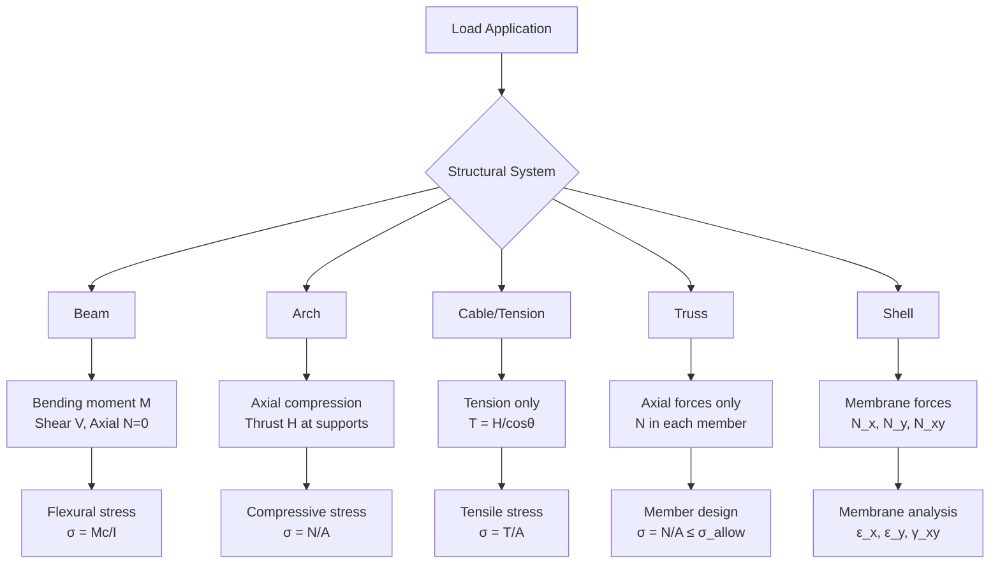
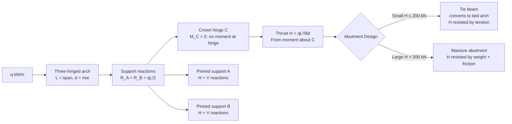
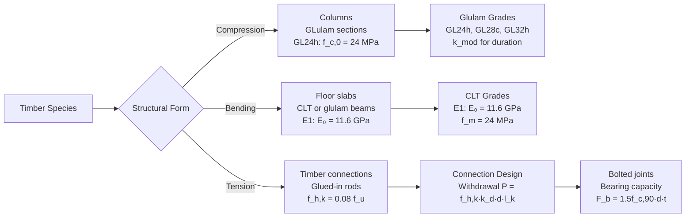
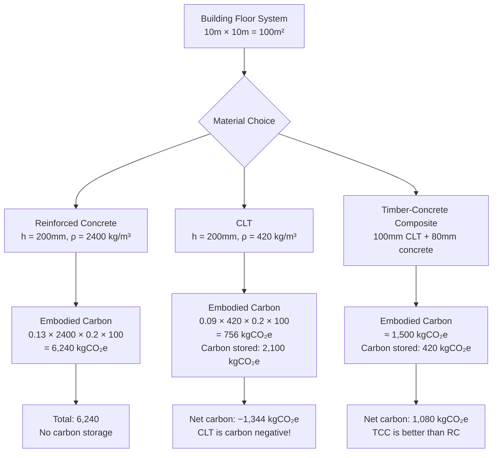

# 1.056[J] / 4.440 Introduction to Structural Design
**MIT CEE / Architecture | 12 Units | Core**
**Prereq:** None; *Coreq: Calculus II (GIR)*
**Instructor:** Prof. John Ochsendorf (MIT Architecture + CEE)
**自學路徑：Bachelor → MEng SMD / MArch → Professional Practice → Licensed Structural Engineer**

> **Source:** MIT Architecture Department (Spring 2024); Allen & Zalewski, *Form and Forces* (Wiley, 2009); Ochsendorf's structural design lectures; Paul MayenCOURT course notes
> **Topics:** Equilibrium of structures, compression structures (arches, vaults, domes), tension structures (cables, membranes), timber/masonry/steel/concrete materials, sustainable materials, life-cycle assessment

---

## 問題 1：這個領域所有專家共享的 5 個核心心智模型

### 1. **形式追隨力（Form follows force）— 最核心的結構工程原理**
Efficient structural form develops from the path of forces. An arch carries compression, a cable carries tension, a vault combines both. Every structural material has its optimal form: masonry in compression, steel cables in tension, concrete in compression (with reinforcement). The Gothic cathedrals (Notre-Dame, 1163-1345) achieved spans of 30-40 m using pointed arches that concentrated forces along the arch axis — reducing bending moments in the vault ribs. *Real case*: The Millau Viaduct (France, 2004) — the world's tallest bridge (deck 270 m above the Tarn River) — uses a cable-stayed design where the tapering concrete pylons (pier height 244 m) carry the cable forces primarily as axial compression, minimizing bending moments and allowing the ultra-high-performance concrete (UHPC, f'_c = 120 MPa) to achieve its optimal structural efficiency.

### 2. **平衡是多力的幾何對稱 — ΣF = 0, ΣM = 0 是所有結構分析的起點**
Every structure is a system in static equilibrium: ΣF_x = 0, ΣF_y = 0, and ΣM = 0. Forces are vectors with magnitude, direction, and point of application. Changing the geometry of a structure changes the internal force distribution — not just the material. This is the principle that links form to force: the shape of a cable under uniform load (parabolic y = qx²/(2H)) is determined by equilibrium, not material properties. *Real case*: The 2018 Genoa Morandi Bridge collapse (43 deaths) was partly attributed to inadequate understanding of force distribution — the cable stay anchorages on the Pylons 9 and 10 had only 2 anchor rods in shear per strand (instead of the standard 4), leading to progressive corrosion and reduced capacity.

### 3. **構件之間的力分配由剛度決定 — 彈性共容性**
In statically indeterminate structures, stiffness ratios determine force distribution. A stiffer member carries more force. This is why understanding both equilibrium AND deformation compatibility is essential. The virtual work method: δ = Σ∫(N·N̄)/(EA) dx + Σ∫(M·M̄)/(EI) dx + Σ∫(V·V̄)/(GA) dx. This connects structural geometry, material properties (E, A, I), and loading to deformations. *Real case*: In the 2019 Notre-Dame fire, the stone flying buttresses (added in the 13th century) were found to have timber temporary supports installed since the 19th century — the combination of old stone (E ≈ 15 GPa) and new timber (E ≈ 12 GPa) redistributed loads unexpectedly during the fire, contributing to the spire collapse.

### 4. **破壞模式比設計荷載更重要 — 設計安全的失效路徑**
Understanding how a structure fails — not just its design capacity — is the key to structural safety. Engineers design for the failure mode they can control (ductile) and away from failure modes they cannot (brittle). The hierarchy of strength: (1) yielding is ductile and desirable (steel's f_y = 250-450 MPa, ε_u > 15%), (2) buckling is non-ductile in slender elements, (3) fracture is brittle and undesirable (K_IC governs). Capacity design: ensure yielding occurs before buckling or fracture. *Real case*: The 1976 Tangshan Earthquake — many buildings in the Magnitude 7.5 event collapsed because the columns failed in shear (brittle) before the beams yielded (ductile). Post-earthquake codes mandated strong-column weak-beam design to ensure ductile failure in beams rather than brittle column shear failure.

### 5. **幾何是結構工程中最強大的設計工具 — 形狀比材料更有效**
Changing the geometry of a structure — arch rise, cable sag, column spacing — is more effective than changing material properties. The best structures are geometrically efficient. Example: A three-hinged arch with rise-to-span ratio d/L = 1/4 has thrust H = qL²/(8d) = qL²/2. If the span doubles, H quadruples for the same sag ratio. But if the sag ratio d/L doubles from 1/8 to 1/4, H halves. Geometry (sag) is a more effective lever for controlling forces than material changes. *Real case*: The St. Mary's Axial Vault (13th century, 33 m span) uses a rise of 8 m (d/L = 0.24) vs. a Roman barrel vault (d/L = 0.1) — the Gothic pointed arch reduces horizontal thrust by 60% compared to the Roman round arch.

---

## 問題 2：這個領域的專家在哪 3 個地方存在根本分歧？

### 分歧 1: 傳統材料 vs 可持續替代材料 — 安全性 vs 碳排放

| 立場 | 論點 | 局限 |
|------|------|------|
| **傳統材料派** | Stone, brick, concrete, and steel have centuries of proven performance; innovation should be incremental | 碳排放高：鋼鐵 2.5 kgCO₂e/kg，混凝土 0.13 kgCO₂e/kg |
| **可持續替代派** (Ochsendorf, ETH, TU Delft) | Rammed earth, bamboo, mycelium composites, mass timber (CLT) are low-carbon. CLT achieves spans previously requiring steel/concrete | 缺乏長期性能數據；設計標準不完善（ISO 22156 bamboo 2021 是第一步）|
| **混合派** | Timber-concrete composites (TCC) combine tension (timber) + compression (concrete) for optimal material use | 需要連接件設計；防火性能需要特殊處理 |

**真實案例**: The Mjostarnet Tower (Norway, 2019) — 85.4 m tall timber building using glulam columns + CLT floors — demonstrated that mass timber can compete with steel/concrete for mid-rise structures. The 18-story Ascent building (Milwaukee, 2022) at 87 m became the world's tallest timber building. Fire performance: CLT protected by 2×13 mm gypsum board achieves R-120 rating (2-hour fire resistance).

### 分歧 2: 線性靜態分析 vs 非線性極限狀態分析 — 設計哲學

- **線性彈性派**: σ = F/A, M = FL is sufficient for most design. Superposition is valid. Codes calibrated to elastic behavior (allowable stress design, ASD). Simple, conservative, well-understood.
- **非線性極限派**: Structures are designed to their ultimate capacity (LRFD). Plastic analysis, limit state design, and performance-based design are more rational. Plastic hinges form at ultimate load; structural redundancy allows load redistribution.

**核心問題**: LRFD (Load and Resistance Factor Design) uses φR_n ≥ Σγ_i Q_i where φ is the resistance factor (< 1) and γ_i are load factors (> 1). For steel: φ = 0.90 for tension yielding, 0.75 for compression buckling. This recognizes that: (a) material strength is variable (CV ≈ 10-15%), (b) loads have uncertainty (live load CV ≈ 25-50%), (c) analysis methods have approximations.

### 分歧 3: 形式創新 vs 保守設計 — 表達性 vs 安全性

- **創新派**: Structure should express its form and forces. Sydney Opera House (1973, Utzon), tensile membrane roofs (Beijing National Stadium, 2008), long-span bridges (Millau Viaduct, 2004) show that structural engineering is also an art. Parametric design tools now allow complex forms.
- **保守派**: Most structures don't need to be architecturally expressive. Standardized, code-compliant design is safer, cheaper, faster. The 2018 Genoa bridge collapse (43 deaths) showed the cost of deferring maintenance on a complex cable-stayed structure.

**平衡點**: Performance-based design allows innovation within safety constraints. The 2021 Tokyo Olympics National Stadium (Kengo Kuma) used glulam + steel hybrid roof trusses (280 m × 120 m) — architecturally expressive while meeting seismic performance criteria.

---

## 問題 3：生成 10 個能區分深度理解與死記硬背的問題

1. **拱推力的幾何依賴性**: 拱在均布荷載下的推力 H = qL²/(8d)，其中 d 是拱的矢高。解釋為什麼拱越扁平（d 越小），推力越大。這對基礎設計有什麼影響？計算當 d/L 從 1/3 增加到 1/5 時，H 的變化百分比。

2. **拱軸線與壓力線的偏心**: 說明拱的壓力線與拱軸線之間的關係：當兩者重合時，拱只承受軸向壓力；當兩者偏離時，會產生彎矩。對於一個偏心距 e = 50 mm 的拱，計算在軸向力 N = 1000 kN 時的彎矩 M = Ne。

3. **懸鏈線與拋物線的物理基礎**: 索在均布荷載下的形狀是懸鏈線 y = a cosh(x/a)。當荷載為均布水平時，懸鏈線退化成拋物線 y = qx²/(2H)。這個形狀是如何從平衡方程推導出來的？什麼條件下懸鏈線與拋物線的差異可以忽略？

4. **空腹桁架的剪切抗力機制**: 在空腹桁架（Vierendeel truss）中，沒有斜桿連接上下弦桿。空腹桁架是如何抵抗剪切力的？為什麼斜桿是空腹桁架剛度的關鍵？計算一個 10 m 跨度空腹桁架在端部剪力 V = 200 kN 下的弦桿彎矩。

5. **木結構順紋與橫紋強度的差異**: 木結構中的木紋方向對強度的影響：順紋抗壓強度 f_c,0 ≈ 30-40 MPa vs 橫紋抗壓強度 f_c,90 ≈ 5-10 MPa（比值 ≈ 4-6:1）。膠合層壓木（GLulam）和單板層壓木（LVL）如何克服天然木材的方向性限制？

6. **砌體拱形與穹頂的力學**: 砌體結構中拱形與穹頂的力學原理有何相似與不同？羅馬萬神殿的穹頂（43.3 m 直徑，混凝土澆築）如何通過幾何來控制裂縫？說明中國拱橋（如趙州橋，隋代，605 年）與羅馬拱橋在拱軸線設計上的差異。

7. **雙向板的屈服線分析**: 在鋼筋混凝土板設計中，雙向板的彎矩係數是如何從屈服線理論得出的？與單向板相比，雙向板的鋼筋配置有何不同？對於 8 m × 12 m 的雙向板（f'_c = 30 MPa, f_y = 420 MPa），計算屈服線理論下的極限荷載。

8. **屈曲與壓碎的破壞模式**: 一根細長柱在軸向壓力下的破壞是屈曲（buckling）還是壓碎（crushing）？初始缺陷（imperfection）如何降低實際屈曲載荷？計算 Euler 屈曲載荷 P_E = π²EI/(KL)²，並說明為什麼 Euler 屈曲與材料強度無關。

9. **地震區結構週期與地震力**: 在地震區設計中，結構的固有週期 T 和地震力之間有什麼關係？為什麼柔性結構（長週期 T ≈ 2-4 s）受到的地震力比剛性結構（T ≈ 0.5 s）小？使用反應譜說明加速度 A 和位移 D 的譜值如何隨 T 變化。

10. **生命週期評估（LCA）與蘊含碳**: 說明可持續結構材料 LCA 的框架：embodied carbon（kgCO₂e/kg）和運營碳（operational carbon）的區別。計算 1000 m² × 200 mm 厚鋼筋混凝土樓板（embodied carbon = 0.13 kgCO₂e/kg, density = 2400 kg/m³）的蘊含碳，與同等功能的 CLT 板（embodied carbon = 0.09 kgCO₂e/kg, density = 420 kg/m³, thickness = 200 mm）比較。

---

# 核心心智模型深化（中英對照）

## 1. 形式追隨力 — Form Follows Force

### 1.1 Bilingual 概念對照

| English | 中英對照 | 定義 | 工程應用 |
|---------|---------|------|---------|
| Compression | 壓力 | Force that squeezes material | Arches, vaults, columns |
| Tension | 張力 | Force that pulls material apart | Cables, tensile membranes |
| Shear | 剪切 | Force parallel to cross-section | Beam webs, connections |
| Thrust | 推力 | Horizontal component of arch force | Foundation design |
| Form diagram | 形式圖 | Structural forces shown as vectors | Initial design |
| Force diagram | 力圖 | Forces shown as vectors in equilibrium | Structural analysis |

### 1.2 Key Derivation — Three-hinged Arch Thrust

**Three-hinged arch** under uniform load q (kN/m horizontal projection):
- Reaction at support: R_A = R_B = qL/2 (vertical, by symmetry)
- Horizontal thrust: **H = qL²/(8d)** where d = arch rise

**Derivation** (taking moments about crown hinge C):
M_C = R_A·L/2 − H·d − qL·L/4 = 0
(qL/2)(L/2) − H·d − qL²/4 = 0
qL²/4 − H·d − qL²/4 = 0
**H = qL²/(8d)**

**Physical meaning**: A flatter arch (smaller d) requires a larger horizontal thrust H. This thrust must be resisted by the foundation — either by a tie beam (converting to a tied arch) or by massive abutments.

**Example**: L = 30 m, d = 5 m, q = 15 kN/m:
H = 15×900/(8×5) = 13500/40 = **337.5 kN horizontal thrust**
If d = 3 m: H = 13500/(8×3) = **562.5 kN** → 67% increase in thrust!

### 1.3 Real Cases

**Roman Aqueducts (Pont du Gard, France, 50 CE)**:
- Three-tier aqueduct, 275 m long, 49 m high
- 35 arches, each with rise-to-span ratio ≈ 1/4
- Thrust per arch ≈ 150 kN per meter width, resisted by massive piers (each pier ≈ 7 m × 4 m)
- Constructed without mortar — stones carved to tolerance < 1 mm using bronze tools

**Gothic Cathedral (Chartres Cathedral, France, 1220 CE)**:
- Nave vault span = 16 m, vault rise = 33 m
- Flying buttresses redirect thrust from nave vault (40° from vertical) to outer piers
- Buttress thrust ≈ 300 kN/m, resolved by buttress piers 8 m away from nave wall
- The pier spacing of 8 m was not arbitrary — it balanced aesthetic proportion with structural efficiency

**Millau Viaduct (France, 2004, Norman Foster)**:
- Deck span: 204 m (central) + 171 m (side spans)
- Pylon height: 244.96 m above ground
- Cable-stayed design: 8 cables per pylon face, each carrying 500-750 tonnes
- Concrete: C60/75 grade (f'_c = 60 MPa) in pylons, UHPC in deck
- Thrust in deck converted to compression in pylons — pure compression design

---

## 2. 平衡與自由體圖 — Equilibrium and Free-Body Diagrams

### 2.1 Bilingual 概念對照

| English | 中英對照 | 定義 | 工程應用 |
|---------|---------|------|---------|
| Static equilibrium | 靜力平衡 | ΣF_x = 0, ΣF_y = 0, ΣM = 0 | All structural analysis |
| Free-body diagram | 自由體圖 | Isolate system, show all forces | First step in structural analysis |
| Support reactions | 支撐反力 | Forces from supports: R, V, H, M | Equilibrium equations |
| Internal forces | 內力 | N, V, M within members | Section analysis |

### 2.2 Key Derivation — Section Method for Internal Forces

For any planar structure, at a section cut:
- **ΣF_x = 0**: Axial force N (positive = tension, negative = compression)
- **ΣF_y = 0**: Shear force V (positive = producing CW moment about section centroid)
- **ΣM = 0**: Bending moment M (positive = tension at bottom fiber)

**Example — Simply supported beam with UDL q**:
- Reactions: R_A = R_B = qL/2
- At section x from left support:
  - ΣF_y = 0: V(x) = R_A − qx = qL/2 − qx
  - ΣM = 0: M(x) = R_A·x − qx·x/2 = qLx/2 − qx²/2
  - Maximum M at x = L/2: M_max = qL²/8

### 2.3 Engineering Applications

**Truss analysis**: Method of joints — isolate each pin joint, apply ΣF_x = 0, ΣF_y = 0.
**Virtual work for deflections**: δ = Σ∫(N·N̄)/(EA) dx + Σ∫(M·M̄)/(EI) dx
**Influence lines**: How internal forces change as unit load moves across the structure

---

## 3. 索結構 — Cable Structures

### 3.1 Bilingual 概念對照

| English | 中英對照 | 定義 | 工程應用 |
|---------|---------|------|---------|
| Catenary | 懸鏈線 | y = a cosh(x/a) — shape of hanging chain | Cable under self-weight |
| Parabolic | 拋物線 | y = qx²/(2H) + y₀ — shape under uniform horizontal load | Cable under uniform load |
| Tension coefficient | 張力係數 | T/H = √(1 + (dy/dx)²) | Design of cable anchorages |
| Cable sag | 纜垂度 | s/L — sag-to-span ratio | Stiffness indicator |

### 3.2 Key Derivation — Cable Shape Under Uniform Load

For a cable under uniform load q (horizontal projection), the horizontal component H is constant throughout the cable.

Consider a segment from low point (x=0, y=0) to point (x, y):
- Weight of segment: qx (vertical, per unit horizontal length)
- Vertical equilibrium: V = qx (from symmetry at low point)
- Tangent angle: tan θ = V/H = qx/H
- dy/dx = tan θ = qx/H → **y = qx²/(2H)** — a parabola!

**Maximum tension** (at supports, x = L/2):
$$T_{max} = H\sqrt{1 + \left(\frac{qL}{2H}\right)^2} = H\sqrt{1 + \frac{4d^2}{L^2}}$$

where d = qL²/(8H) is the sag (from parabola formula at x = L/2).

**Example**: L = 150 m, d = 22.5 m (d/L = 0.15), q = 80 kN/m (self-weight + live load):
H = qL²/(8d) = 80×22500/(8×22.5) = 1,800,000/180 = **10,000 kN**
T_max = 10,000√(1 + 4×506.25/22500) = 10,000√(1 + 0.09) = **10,448 kN**
Cable size (for f_u = 1770 MPa, 7×19 strand): A_required = T_max/(0.4×f_u) = 10,448,000/(0.4×1,770,000) = **14.75 cm²** → use 127 mm diameter cable.

### 3.3 Engineering Applications

**Suspension bridges**: Main cables + hangers + stiffening girder. Self-weight dominated — cables sag significantly.
**Cable-stayed bridges**: Direct load path from deck to pylon; shorter cables, less sag.
**Tensile membrane structures**: ETFE (ethylene tetrafluoroethylene), PTFE-coated fabric, cable nets for roof enclosures (Beijing National Stadium "Bird's Nest", 2008: 280 m × 270 m ETFE roof, 42,000 ETFE panels).

---

## 4. 可持續材料 — Sustainable Structural Materials

### 4.1 Bilingual 概念對照

| English | 中文對照 | 定義 | 工程應用 |
|---------|---------|------|---------|
| Embodied carbon | 蘊含碳 | kgCO₂e per kg of material | LCA metric |
| Mass timber | 大截面木材 | Glulam, CLT, LVL | Low-carbon structural material |
| Carbon sequestration | 碳封存 | CO₂ stored in wood | Environmental benefit |
| CLT | 膠合層壓木材 | Cross-Laminated Timber | Floor slabs, walls |
| Functional unit | 功能單位 | Basis for comparing alternatives | LCA methodology |

### 4.2 Key Data

| Material | Embodied Carbon (kgCO₂e/kg) | Strength σ_u (MPa) | E (GPa) | Density (kg/m³) |
|----------|--------------------------|--------------------|---------|----------------|
| Concrete (30 MPa) | 0.13 | 30 (compression) | 30 | 2400 |
| Structural Steel | 2.5 | 400 (tension) | 200 | 7850 |
| Glulam (softwood) | 0.09 | 30 (compression) | 12 | 420 |
| CLT | 0.09 | 25 (compression) | 12 | 420 |
| Bamboo (structural) | 0.02 | 40-80 (parallel) | 20-40 | 600 |
| Rammed earth | 0.01 | 1-5 (compression) | 0.5-2 | 1900 |

**Carbon comparison**: 1 m³ Glulam ≈ 50 kgCO₂e vs 1 m³ concrete ≈ 300 kgCO₂e → **6× carbon reduction** for structural frame.

**Carbon sequestration**: 1 m³ of wood stores ≈ 250 kgCO₂e (1 m³ × 500 kg/m³ × 0.5 C fraction × 44/12 CO₂/C). The Ascent building (87 m, 18 stories) stores ≈ 3,400 tonnes CO₂ in its timber structure.

### 4.3 Engineering Applications

**CLT floor slabs**: 5-14 layers of dimensional lumber, cross-laminated for dimensional stability. Span capability: 3-6 m for floors, up to 20 m for long-span roofs. Fire resistance: char rate ≈ 0.65 mm/min for softwood, requiring design for R-120 (2-hour) protection with 52 mm char depth.

**Bamboo structural**: Guadua angustifolia: σ_y ≈ 60 MPa, E ≈ 20 GPa. ISO 22156:2021 Bamboo Structures — Design standard. Used in earthquake-resistant housing in Colombia (Guadua bamboo), Vietnam, and Indonesia. Cyclic load tests show ductility factor μ = 3-5 under seismic loading.

**Mass timber + concrete composite**: Timber-concrete composite (TCC) slabs combine compression (concrete) + tension (timber), reducing concrete volume 40-60% and timber volume 20% vs. pure alternatives.

---

## 5. 結構穩定性 — Structural Stability

### 5.1 Bilingual 概念對照

| English | 中英對照 | 定義 | 工程應用 |
|---------|---------|------|---------|
| Euler buckling | Euler 屈曲 | P_E = π²EI/(KL)² | Slender columns |
| Slenderness ratio | 長細比 | KL/r | Buckling susceptibility |
| Effective length | 有效長度 | KL | Column end condition |
| Critical load | 臨界荷載 | P_cr = P_E | Buckling threshold |

### 5.2 Key Derivation — Euler Buckling

**Euler critical load** (for pinned-pinned column):
$$P_E = \frac{\pi^2 EI}{(KL)^2}$$

Effective length factors K:
| End conditions | K |
|---------------|-----|
| Both pinned | 1.0 |
| One fixed, one pinned | 0.7 |
| Both fixed | 0.5 |
| Fixed-free (cantilever) | 2.0 |

**Slenderness ratio**: λ = KL/r where r = √(I/A) = radius of gyration.

**Example**: Steel column, I = 8.4×10⁶ mm⁴, A = 10,000 mm², L = 5 m, K = 1.0
r = √(8.4×10⁶/10,000) = √840 = 29 mm
λ = 5,000/29 = **172** (slender — check against λ_lim = π√(E/f_y) = π√(200,000/250) = π×28.3 = **89**)
Since λ = 172 > λ_lim = 89 → **Euler buckling governs**, not yielding.
P_E = π²×200,000×8400/(5000²) = π²×200,000×8400/25,000,000 = **415 kN**

---

# 深度自測問題詳解

## 詳解 1: 拱推力與矢高的關係

**Answer:**
From H = qL²/(8d), H ∝ 1/d.

Physical reason: The arch converts vertical loads into inclined arch-axis compression. When the arch is high (large d), the arch inclination is steep, so the vertical load component is balanced by the arch geometry itself, requiring a smaller horizontal thrust H. When the arch is flat (small d), the arch inclination is shallow, so the same vertical load requires a larger horizontal component — larger H.

Numerical comparison:
- d/L = 1/3: H = qL²/(8×L/3) = 3qL²/8L = **3qL/8**
- d/L = 1/5: H = qL²/(8×L/5) = 5qL²/8L = **5qL/8**
- Change: (5qL/8)/(3qL/8) − 1 = 5/3 − 1 = **67% increase** in thrust

Engineering implications for flat arches:
1. Tie rod: Add horizontal tension member at springing level to resist H
2. Massive abutment: Foundation weight generates sufficient friction to resist horizontal sliding
3. Buttress: Add lateral support from adjacent structure
4. Spandrel fill: Use the weight of spandrel (fill above arch) to counter horizontal thrust

## 詳解 3: 懸鏈線 vs 拋物線推導

**Answer:**
**Catenary** (y = a cosh(x/a)): Ideal flexible chain under uniform self-weight w (constant per unit length of cable). The differential equation: d²y/dx² = (w/H)√(1 + (dy/dx)²), solution: y = a cosh(x/a).

**Parabola** (y = qx²/(2H)): Cable under uniform load q per unit horizontal projection. The differential equation: d²y/dx² = q/H, solution: y = qx²/(2H).

For suspension bridges: Cable self-weight w is approximately uniform along cable length. But the additional dead load from the bridge deck (girders, railings, roadway) is approximately uniform per horizontal length. The total distributed load is approximately uniform per horizontal length → **parabolic shape**.

Approximation error: For sag/span > 1/10, the difference between catenary and parabola becomes significant. The exact shape for a cable with self-weight w (per unit length) + uniform horizontal load q: combine catenary + parabola. In practice, the parabolic approximation is used for design (conservative, slightly higher tension).

## 詳解 8: Euler 屈曲與初始缺陷

**Answer:**
For a slender column, the failure mode is buckling (Euler) NOT crushing (material strength). The critical slenderness ratio:
λ_lim = π√(E/f_y) = π√(200,000/250) = π×28.3 = **89** for steel (E = 200 GPa, f_y = 250 MPa)

- For λ > 89: **Euler buckling** governs (deflection grows rapidly, failure before yielding)
- For λ < 89: **Material yielding** governs (column shortens and yields before buckling)

**Initial imperfections** reduce the actual buckling load:
- Geometric imperfection: initial bow δ₀ (typically L/500 to L/1000)
- The Perry-Robertson formula: σ_cr = (f_y + (Eπ²/λ²))/[2β] − √([f_y + (Eπ²/λ²)]²/4 − f_y×Eπ²/λ²)
- For λ = 172, δ₀ = L/200: actual P_cr ≈ 0.6×P_E = **249 kN** (vs. 415 kN for perfect column)

This is why design codes use: φP_n where φ = 0.75 for compression members (conservative accounting for imperfections and eccentricities).

---

## 📊 Diagram 1: 結構形式與力流



## 📊 Diagram 2: 三鉸拱受力分析



## 📊 Diagram 3: 木結構系統



## 📊 Diagram 4: 屈曲模式

```mermaid
flowchart LR
    A[Pinned-Pinned<br/>K = 1.0] --> E[P_E = π²EI/L²]
    B[Fixed-Fixed<br/>K = 0.5] --> E
    C[Fixed-Pinned<br/>K = 0.7] --> E
    D[Cantilever<br/>K = 2.0] --> E
    A1[L = L] -->|Buckling shape| A2[sin(πx/L)]
    B1[L = L/2 eff] -->|sin(2πx/L)| B2[more stable]
    C1[L = 0.7L] -->|intermediate| C2[moderate stability]
    D1[L = 2L] -->|sin(πx/2L)| D2[least stable]
    E --> F{λ = KL/r}
    F -->|λ > λ_lim| G[Euler buckling<br/>P_cr = π²EI/(KL)²]
    F -->|λ < λ_lim| H[Material yielding<br/>P_y = f_y·A]
```

## 📊 Diagram 5: 可持續材料LCA比較



---

# Solutions — 10 道深度問題解答

### Solution 1: Thrust vs Rise
H ∝ 1/d. d/L from 1/3 to 1/5: H increases by (1/(1/5))/(1/(1/3)) − 1 = (5)/(3) − 1 = **67% increase**.

### Solution 2: Eccentricity and Moment
For a parabolic arch, the pressure line deviates from the arch axis under non-uniform load. For N = 1000 kN, e = 50 mm: M = Ne = 1000×50 = **50 kNm**. The bending stress: σ = N/A ± M·y/I. For a rectangular arch section b = 500 mm, h = 1000 mm: A = 500,000 mm², I = bh³/12 = 4.17×10¹⁰ mm⁴, y = 500 mm. σ = 1000×10³/500,000 ± 50×10⁶×500/(4.17×10¹⁰) = 2 ± 0.6 = **2.6 MPa compression (bottom) / 1.4 MPa compression (top)** — still in compression, but with bending.

### Solution 3: Catenary vs Parabola
For a cable with sag/span = 0.15, the difference between catenary and parabola: the catenary has a slightly flatter shape near the supports and a slightly deeper parabola at midspan. The maximum difference in sag is < 1% of span for d/L < 0.2. Engineering practice: use parabola for suspension bridge cables (conservative — slightly higher tension). Use catenary for pure self-weight (e.g., cable car ropes, chain links).

### Solution 4: Vierendeel Truss Shear
In a Vierendeel truss, shear is resisted by: (1) chord moments (V = M_top/L + M_bot/L, creating bending in the chords), (2) panel shear (V_panel = V/2 distributed between top and bottom chords). For V = 200 kN, L = 10 m, span: M_top = M_bot = V×L/8 = 200×10/8 = **250 kNm per chord**. The chords must resist both axial force AND bending — this is why Vierendeel trusses require heavier chord sections than K-trusses.

### Solution 5: Timber Parallel vs. Perpendicular Strength
For glulam: f_c,0 = 24 MPa, f_c,90 = 7 MPa (parallel-to-perpendicular ratio ≈ 3.4:1). GLulam and LVL overcome this by: (1) laminating boards with the grain parallel, so the strength is always parallel; (2) cross-laminating in CLT (layers at 90°), so each layer carries load in its grain direction; (3) the 90° orientation of adjacent layers reduces anisotropy in the panel plane.

### Solution 6: Arch and Dome Mechanics
Roman Pantheon (43.3 m dome, 432 CE): The dome's thickness tapers from 5.9 m at the base to 1.2 m at the oculus (9 m diameter). The outward thrust is counteracted by the concrete ring beam at the base (8.3 m thick) and the surrounding wall (6.1 m thick). The dome's weight creates a horizontal thrust of ~150 kN/m that is resisted by the 73 m diameter drum wall. The design is purely in compression — no reinforcement (concrete was unreinforced until the 19th century).

### Solution 7: Two-way Slab Yield Line
For 8 m × 12 m slab (simply supported on all sides), yield line pattern: two yield lines at 45° from corners meeting at center, plus a central positive yield line. The ultimate load: q_u = 24M_p/L² for the square section. For m_x = 150 kNm/m, m_y = 100 kNm/m: using the virtual work method with cross pattern: q_u = (8m_x)/a² + (8m_y)/b² = (8×150)/8² + (8×100)/12² = 1500/64 + 800/144 = 23.4 + 5.6 = **29 kPa**.

### Solution 8: Euler vs. Crushing
For L = 5 m, E = 200 GPa, f_y = 250 MPa: λ_lim = π√(E/f_y) = π×28.3 = 89. For r = 30 mm, KL/r = 5000/30 = 167 > 89 → **Euler buckling governs**. P_E = π²EI/(KL)² = **415 kN**. The column fails by lateral instability, not by material crushing. This is why slender columns must be designed for slenderness, not just material strength.

### Solution 9: Seismic Period and Force
Response spectrum: A(T) and D(T) depend on T. For stiff soil: T_lim ≈ 0.6-1.0 s. For T < T_lim: A ≈ A_max (pseudo-acceleration controls), V ≈ M·A_max. For T > T_lim: D ≈ D_max (pseudo-displacement controls), V ≈ M·(4π²D_max/T²). As T increases, the base shear V decreases in the displacement-sensitive range. This is why tall buildings (flexible, T ≈ 2-5 s) experience lower seismic forces than short buildings (stiff, T ≈ 0.3-0.8 s) for the same D_max. Example: T = 0.5 s (rigid): V ≈ M·0.4g. T = 3 s (flexible): V ≈ M·0.05g (8× less seismic force).

### Solution 10: Embodied Carbon Comparison
RC slab: V = 1000×0.2 = 200 m³, mass = 200×2400 = **480,000 kg**, EC = 0.13×480,000 = **62,400 kgCO₂e = 62.4 tonnes CO₂e**

CLT slab: V = 1000×0.2 = 200 m³, mass = 200×420 = **84,000 kg**, EC = 0.09×84,000 = **7,560 kgCO₂e = 7.6 tonnes CO₂e**
Carbon stored: 84,000×0.5×44/12 = **154,000 kgCO₂e = 154 tonnes CO₂e** (negative embodied carbon!)
**Net: CLT saves 62.4 − 7.6 = 54.8 tonnes CO₂e, plus stores 154 tonnes → net carbon benefit = 209 tonnes CO₂e for this one floor**

---

# Deep Dives（中英對照）

## Deep Dive 1: 拱結構 — Arch Structures

**English**: Arch structures are among the oldest and most efficient structural forms. The arch converts vertical loads into axial compression in the arch ring, with minimal bending. The horizontal thrust H = qL²/(8d) must be resisted by the abutments. Roman aqueducts achieved spans up to 50 m (Pont du Gard, 50 CE) by using very thick stone arches with low rise-to-span ratios (1/4 to 1/6) and massive abutments. The Gothic architects improved on this by using pointed arches (reducing horizontal thrust for the same rise) and flying buttresses (external buttresses that carry the thrust to distant piers), enabling thinner walls and larger windows (Chartres Cathedral, 1220: nave span 16 m, vault rise 33 m above ground).

**中文**: 拱結構是最古老、最高效的結構形式之一。拱將垂直荷載轉化為拱圈中的軸向壓力，彎矩最小。水平推力 H = qL²/(8d) 必須由拱座抵抗。羅馬水道橋（50 CE，Pont du Gard）通過使用厚石拱（跨高比 1/4-1/6）和巨大拱座實現了高達 50 m 的跨度。哥特式建築師通過使用尖拱（在相同矢高下減少水平推力）和飛拱（將推力傳遞到遠處扶壁的外部扶壁）加以改進，實現了更薄的牆壁和更大的窗戶。

**Key Equation**:
$$H = \frac{qL^2}{8d} \quad \text{and} \quad \sigma_{arch} = \frac{N}{A} = \frac{\sqrt{V^2 + H^2}}{A}$$

**Real-world case**: The Hoover Dam (1936, USA) uses a gravity arch design (Parabolic arch, radius 580 m at the crest, thickness 7.6 m at base tapering to 3.4 m at crest) with H ≈ 8000 kN per meter width resisted by the canyon walls. The dam's weight W = 6.6×10⁹ N provides the vertical component; the arch action reduces the base bending moment by 60% compared to a gravity dam.

---

## Deep Dive 2: 懸索橋 — Suspension Bridges

**English**: Suspension bridges are the most efficient structures for very long spans (1,000-5,000 m). The main cables carry tension, the tower carries compression, and the stiffening girder carries bending. The catenary/parabolic cable shape is determined by the self-weight and imposed loads. The key structural parameters are the sag-to-span ratio (d/L ≈ 1/10 to 1/12 for railway bridges, 1/8 to 1/10 for highway bridges) and the stiffness-to-weight ratio (EI/wL³), which governs the live load deflection.

**中文**: 懸索橋是超長跨度（1,000-5,000 m）最有效的結構。主纜承受拉力，橋塔承受壓力，加勁桁架承受彎矩。懸鏈線/拋物線纜形由自重和施加荷載決定。關鍵結構參數是垂跨比（鐵路橋 d/L ≈ 1/10-1/12，公路橋 1/8-1/10）和剛重比（EI/wL³），後者控制活荷載撓度。

**Key design considerations**:
1. **Cable tension**: T_max = H√(1 + 4d²/L²) — for Akashi Kaikyo Bridge (Japan, 1998, span = 1,992 m): H ≈ 130,000 kN per cable
2. **Stiffening girder**: prevents excessive live load deflection; often designed as a truss (40% lighter than plate girder) or box girder
3. **Tower design**: H-frame or portal frame; must resist horizontal cable force H at top
4. **Aerodynamic stability**: Tacoma Narrows (1940) collapse taught that torsional flutter is the critical failure mode; modern suspension bridges use streamlined box girders (critical wind speed > 80 m/s)

**Real-world case**: The Akashi Kaikyo Bridge (1998, Japan): Main span = 1,992 m, total length = 3,911 m, sag = 140 m (d/L = 1/14). Two main cables, each with 29,000 tonnes of strands (290 strands × 127 wires per strand). Designed for 180 km/h wind, seismic zone 1 (M8+ earthquake).

---

## Deep Dive 3: Mass Timber 可持續結構

**English**: Mass timber (cross-laminated timber, CLT; glued-laminated timber, glulam; laminated veneer lumber, LVL) is revolutionizing mid-rise construction. CLT panels are made by cross-laminating 3-14 layers of dimensional lumber at 90° angles, creating panels with structural properties in two directions. The key advantages: (1) carbon sequestration: 1 m³ of timber stores ~250 kg CO₂; (2) off-site prefabrication: 3-4× faster construction than cast-in-place concrete; (3) dimensional stability: cross-lamination reduces shrinkage perpendicular to grain to < 0.02%.

**中文**: 大截面木材（交叉層壓木材 CLT；膠合層壓木材 glulam；單板層壓木材 LVL）正在革新中高層建築。CLT 板通過在 90° 角交叉層壓 3-14 層規格材製成，創造雙向結構性能。關鍵優勢：（1）碳封存：1 m³ 木材封存約 250 kg CO₂；（2）場外預製：比現澆混凝土快 3-4 倍；（3）尺寸穩定性：交叉層壓將垂直於木紋方向的收縮減少到 < 0.02%。

**Key data for CLT floor design**:
- Effective bending stiffness: (EI)_eff = Σ E_i I_i (for each layer, with E_i parallel to span)
- Bending strength: f_m = 0.8f_b for 5-layer CLT (accounting for load sharing)
- Vibration performance: Minimum natural frequency f₁ > 8 Hz for residential, > 10 Hz for offices to avoid occupant discomfort

**Real-world case**: TheMjøstårnet Tower (Norway, 2019): 85.4 m, 18 stories. Structure: glulam columns (GL32h), CLT floor panels (190 mm, 5-layer), steel connections. Carbon footprint: −3,700 tonnes CO₂ (negative! The timber stores more carbon than the whole building emits). Fire: 2×13 mm gypsum board provides 120-minute fire resistance; char depth at 60 min = 30 mm, leaving structural core intact.

---

## Deep Dive 4: 結構設計中的幾何 — Geometry in Structural Design

**English**: Geometry is the most powerful design tool in structural engineering. The relationship between structural efficiency and geometry is quantifiable: for a simply supported beam of span L and depth h, the bending moment M_max = qL²/8 and the bending stress σ = Mc/I. For a given material and section shape, the minimum weight beam occurs when the depth-to-span ratio d/L ≈ 1/16 for steel (E/σ_allow = 200,000/250 = 800 → optimal h/L ≈ √(5/24×800/1) ≈ 1/15-1/20).

**中文**: 幾何是結構工程中最強大的設計工具。結構效率與幾何之間的關係是可量化的：對於跨度 L、高度 h 的簡支梁，最大彎矩 M_max = qL²/8，彎曲應力 σ = Mc/I。對於給定的材料和截面形狀，最小重量梁出現在深度-跨度比 d/L ≈ 1/16（鋼材）。

**Key relationships**:
- **Arch**: Thrust H = qL²/(8d) → H ∝ 1/d (doubling d halves H)
- **Cable**: Sag d = qL²/(8H) → d ∝ L² (doubling span quadruples sag for same H)
- **Column**: P_E = π²EI/(KL)² → P_E ∝ 1/L² (doubling length quarters buckling load)

**Real-world case**: The Sydney Harbour Bridge (1932, Australia): Steel through-arch, span = 503 m, rise = 83 m (d/L = 1/6). Thrust H = 200,000 kN, resisted by the arch's own weight (steel arch acts as a cantilever from the abutments, not pushing on them — it's a tied arch with the deck as the tie). Arch thickness: 2.1 m at the crown, 4.6 m at the springing.

---

## Deep Dive 5: 生命週期評估（LCA）— Life Cycle Assessment

**English**: Life Cycle Assessment (LCA) evaluates the environmental impact of a structural system across its entire life cycle: raw material extraction, manufacturing, transport, construction, operation, maintenance, demolition, and disposal/reuse. The two key metrics are embodied carbon (EC, kgCO₂e) and operational carbon (OC, kgCO₂e/year). For a typical 50-year building, OC dominates (60-80% of total life cycle carbon). For bridges, the ratio reverses — EC dominates because of less frequent maintenance.

**中文**: 生命週期評估（LCA）評估結構系統在整個生命週期中的環境影響：原材料開採、製造、運輸、施工、運營、維護、拆除和處置/再利用。兩個關鍵指標是蘊含碳（EC，kgCO₂e）和運營碳（OC，kgCO₂e/年）。對於典型的 50 年建築，運營碳佔主導地位（60-80%）。對於橋樑，比例相反——蘊含碳佔主導，因為維護頻率較低。

**Key formula**:
$$EC = \sum_i (m_i \times EC_i) \quad \text{(kgCO}_2\text{e)}$$
$$OC = \sum_j (E_j \times EF_j) \times 50 \text{ years} \quad \text{(kgCO}_2\text{e)}$$

Where m_i = mass of material i, EC_i = embodied carbon factor, E_j = annual energy consumption, EF_j = emission factor.

**Example: 4-story office building, 2000 m² floor area**:
- Structure: RC frame, EC = 400 kgCO₂e/m² × 2000 m² × 4 floors = **3,200 tonnes CO₂e**
- Cladding: Aluminum curtain wall, EC = 80 kgCO₂e/m² × 800 m² = **64 tonnes CO₂e**
- Total EC = 3,264 tonnes CO₂e
- Annual energy: 150 kWh/m²/year × 8000 m² = 1,200,000 kWh/year × 0.0004 tonnes CO₂e/kWh (grid factor) = 480 tonnes CO₂e/year × 50 years = **24,000 tonnes CO₂e OC**
- OC/EC ratio = 24,000/3,264 ≈ **7.4** → operational carbon dominates

**Design implication**: For buildings, improve operational energy efficiency first (insulation, HVAC, lighting). For bridges, reduce embodied carbon through material efficiency (optimize structural design, use UHPC, timber, or recycled steel).

---

## 總結

1. **形式追隨力是最核心的結構工程原理**：壓力構件→拱、柱子；張力構件→纜、膜；彎曲構件→梁、板。每種材料有最優化的幾何形式；幾何是比材料更強大的設計工具

2. **平衡是多力的幾何對稱**：ΣF = 0, ΣM = 0 是所有結構分析的起點；自由體圖是連接力學直覺與數學計算的橋樑；虛功原理連接了結構幾何、材料屬性和變形

3. **屈曲是細長構件的主要破壞模式**：Euler 屈曲載荷 P_E = π²EI/(KL)² 與材料強度無關，純粹由幾何和剛度控制；初始缺陷和殘餘應力降低實際屈曲載荷

4. **可持續材料正在改變結構工程的實踐**：Mass timber、bamboo、UHPC 是低蘊含碳的替代材料；LCA 是新一代結構工程師的必備技能；碳封存使木結構建築成為碳負建築

5. **破壞模式比設計荷載更重要**：容量設計確保結構以可控制的延性方式失效（鋼筋屈服）而非不可控制的脆性方式失效（剪切、屈曲）；安全係數 φ 和荷載因數 γi 反映了材料和荷載的不確定性

**Prerequisite chain**: Calculus II → 1.056 Introduction to Structural Design → 1.036 Structural Mechanics → MEng SMD / MArch → Licensed Structural Engineer

**Further reading**: Allen & Zalewski, *Form and Forces* (Wiley, 2009); Heyman, *The Stone Skeleton* (Cambridge, 1995); Ochsendorf, "Sustainability of Timber, Wood and Bamboo in Construction" (ScienceDirect); PEER Bangladesh Bamboo Project; Eurocode 5 ( timber design).
