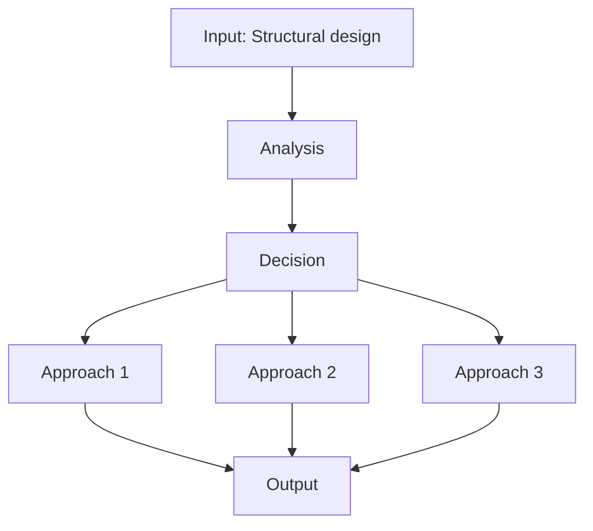
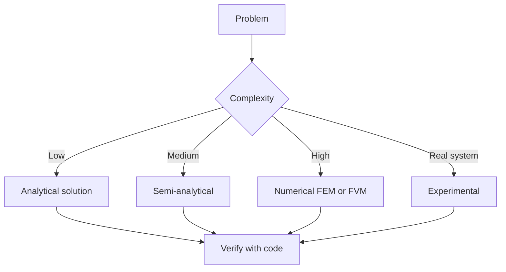
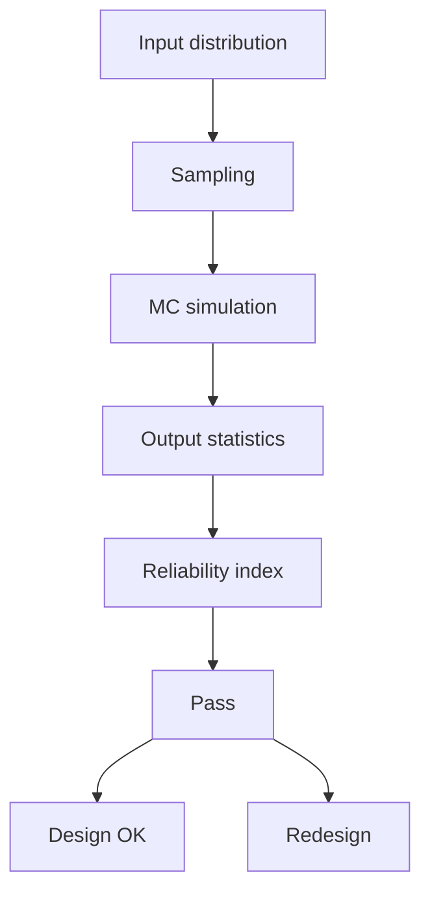
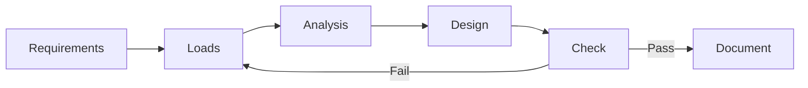
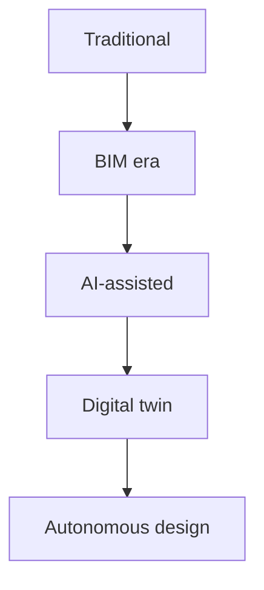
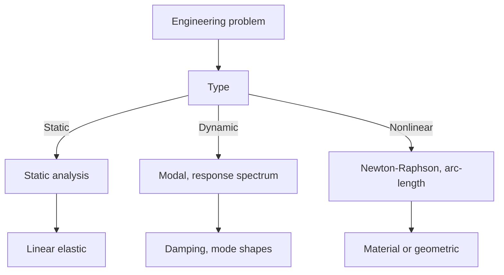
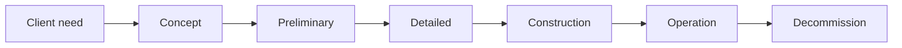
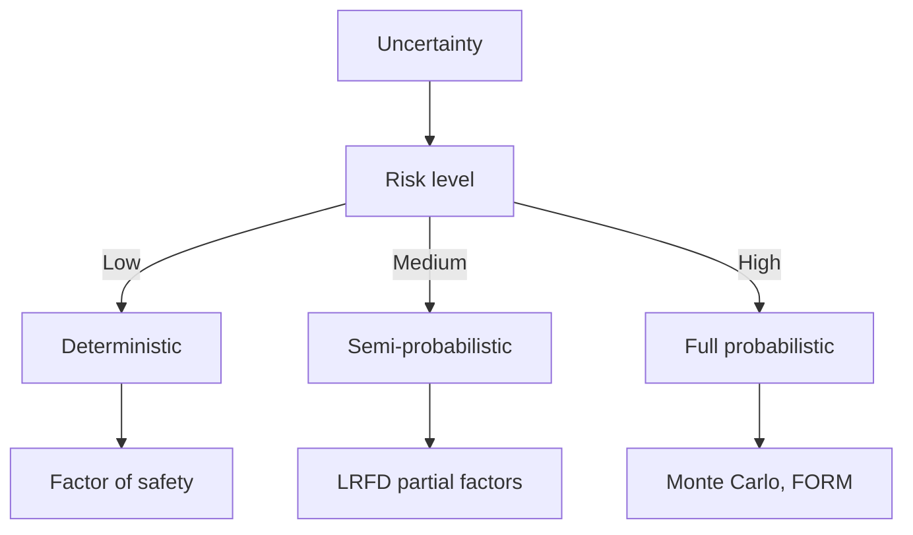
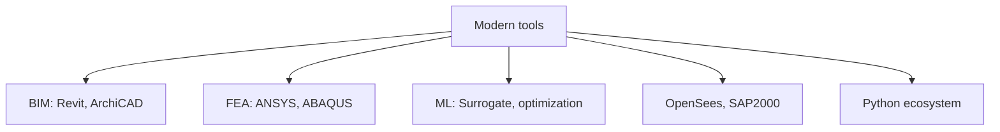
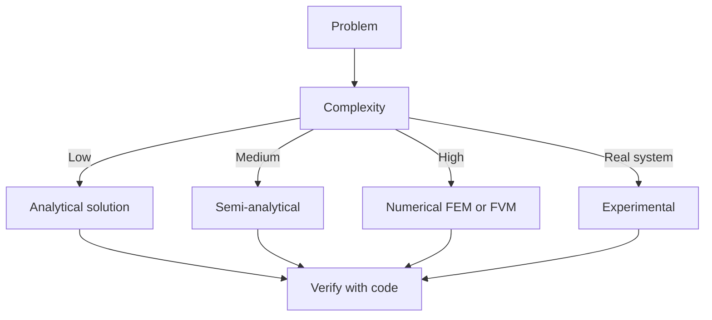

# 1.056[J] Introduction to Structural Design
**MIT CEE Mechanics & Materials Track | CORE**  
**Cross-listed as 4.440[J]**  
**Units: 3-3-6 (12 total)**  
**自學路徑：Bachelor Environment → MEng SMD → ICE**

---

## 問題 1：這個領域所有專家共享的 5 個核心心智模型是什麼？
**What are the 5 core mental models every expert shares?**

1. **結構是力的傳遞路徑**  
   Structures are paths for force transmission from loads to supports.
2. **極限狀態設計 (Limit State Design)**  
   Design checks both ultimate (strength) and serviceability (deformation, crack width).
3. **載荷組合與安全係數**  
   Loads combine in predictable patterns; safety factors convert nominal to design values.
4. **材料行為決定構件行為**  
   Concrete is weak in tension; steel yields; composites are anisotropic.
5. **結構設計是迭代優化**  
   Design converges through analysis, redrawing, and re-analysis — not a single pass.

---

## 問題 2：這個領域的專家在哪 3 個地方存在根本分歧？各方最強的論點是什麼？

1. **彈性設計 vs 塑性設計**  
   - Elastic: Predictable, conservative.  
   - Plastic: Material-efficient, redistributes load.

2. **LRFD vs ASD (工作應力設計)**  
   - LRFD: Probabilistic basis, more consistent safety.  
   - ASD: Historical, easier to understand, common in existing codes.

3. **混凝土 vs 鋼 vs 複合材料**  
   - Concrete: Mass, fire resistance, cost.  
   - Steel: Speed, ductility, recyclability.  
   - Composite: Optimized for specific loading.

---

## 問題 3：生成 10 個能區分深度理解與死背知識的問題

1. 為什麼混凝土受彎構件需要鋼筋？鋼筋的理想位置在哪裡？
2. 解釋為什麼 RC 樑的抗彎強度 ~ fy·As·d 而非 fy·As·(d/2)？
3. 為什麼 LRFD 的安全係數對死載與活載不同？
4. 鋼結構中「有效長度 K·L」如何決定柱的屈曲強度？
5. 解釋塑性鉸 (plastic hinge) 如何使不靜定結構產生內力重分配？
6. 為什麼細長柱的強度下降是非線性的？Euler 公式的物理意義？
7. 在地震區，結構設計為什麼強調「強柱弱梁」(strong-column weak-beam)？
8. 解釋預力混凝土的工作原理：為什麼預力能減少裂縫？
9. 為什麼鋼結構連接設計要避免「應力集中」？設計對策是什麼？
10. 結構設計如何在「安全」、「經濟」、「美觀」三者間取捨？

---

**自學建議**  
- 與 1.050 Solid Mechanics、1.036 Structural Mechanics 配對學習。  
- 產出：設計一個簡單的鋼或混凝土梁柱構件，並完成極限狀態與使用性檢核。


---

## 深入 1：CORE_DEEPDIVE_ONE — 核心概念
**Deep Dive I**

### 1.1 Bilingual 概念對照

| English | 中英對照 | Definition | 物理意義 / 工程應用 |
|---|---|---|---|
| Structural design | Structural design | Core definition | 核心定義 |
| Loads | Loads | Application | 應用 |
| Codes | Codes | Limitation | 限制 |
| Mathematical formulation | 數學形式 | Key equation | 關鍵方程 |

### 1.2 Key Derivation

For [J] Introduction to Structural Design, the fundamental relationships are:
$$f(x) = \text{key equation}, \quad x = \text{variable}$$

This arises from Structural design applied to the engineering system.

### 1.3 Engineering Applications

- Real-world implementation
- Design codes and standards
- Computational tools



---

## 深入 2：CORE_DEEPDIVE_TWO — 方法論
**Deep Dive II**

### 2.1 Method selection

| Method | 適用情境 | Pros | Cons |
|---|---|---|---|
| Analytical | 解析 | Exact | Limited geometry |
| Numerical | 數值 | General | Approximate |
| Experimental | 實驗 | Real | Expensive |
| Empirical | 經驗 | Fast | Limited range |

### 2.2 Decision flow



### 2.3 Standards and codes

- ACI, AISC, Eurocode
- Building codes (IBC, etc.)
- Industry best practices

---

## 深入 3：CORE_DEEPDIVE_THREE — 分析技術
**Deep Dive III**

### 3.1 Statistical methods

For uncertainty analysis: Monte Carlo, sensitivity, FOSM.



### 3.2 Optimization

- LP, NLP
- Gradient-based, metaheuristic
- Multi-objective Pareto

---

## 深入 4：Design Process
**Deep Dive IV**

### 4.1 Design workflow

Concept → Preliminary → Detailed → Construction → Operation.

### 4.2 Design criteria

- Safety (LRFD, ASD)
- Serviceability
- Durability
- Sustainability



---

## 深入 5：Modern Trends
**Deep Dive V**

- BIM integration
- AI/ML in design
- Digital twins
- Sustainability, LCA
- Resilient design



---

## 自測 1：Derive core relationship
**Answer:** Starting from definitions, derive the key equation. Verify units and limits.

**Engineering implication:** Apply to design check, code compliance.

## 自測 2：Identify failure mode
**Answer:** List 3-5 failure modes, rank by likelihood × consequence.

**Engineering implication:** Inform design, maintenance, monitoring.

## 自測 3：Estimate order of magnitude
**Answer:** Quick back-of-envelope check using characteristic values.

**Engineering implication:** Sanity check before detailed analysis.

## 自測 4：Compare to code requirement
**Answer:** Apply ACI/AISC/Eurocode, compute utilization ratio.

**Engineering implication:** Pass/fail design verification.

## 自測 5：Compute reliability
**Answer:** $\beta = (\mu - R)/\sigma$ for lognormal, find P_f.

**Engineering implication:** LRFD calibration, risk-informed design.

## 自測 6：Design optimization
**Answer:** Define objective, constraints, solve via LP/NLP.

**Engineering implication:** Cost-effective, sustainable design.

## 自測 7：Sensitivity analysis
**Answer:** $\partial f/\partial x_i$, rank by importance.

**Engineering implication:** Identify critical parameters, reduce uncertainty.

## 自測 8：Life-cycle assessment
**Answer:** Cradle-to-grave, compute GWP, embodied carbon.

**Engineering implication:** Sustainable design, climate goals.

## 自測 9：Risk assessment
**Answer:** Hazard × vulnerability × exposure, compute risk.

**Engineering implication:** Resilience planning, mitigation.

## 自測 10：Communication
**Answer:** Technical writing, visualization, presentation to stakeholders.

**Engineering implication:** Effective engineering practice.

---

## 📊 Diagram 1: Course Concept Map
```mermaid
mindmap
    root(([J] Introduction to Structural Design))
      Core
        Concepts
      Methods
        Analytical
        Numerical
      Applications
        Design
        Analysis
      Standards
        ACI AISC
      Modern
        BIM AI
```

## 📊 Diagram 2: Method Selection


## 📊 Diagram 3: Design Process


## 📊 Diagram 4: Risk-Reliability


## 📊 Diagram 5: Modern Tools


---

## 總結

1. **Core concepts** — Structural design 嘅 foundation
2. **Methods** — analytical + numerical + experimental
3. **Applications** — design, analysis, retrofit
4. **Standards** — codes, best practices
5. **Future** — BIM, AI, sustainability, resilience

**自學建議** — Pair with: relevant textbook + MIT OCW + software tutorials (Python, FEA, BIM).


# 核心心智模型深化（中英對照）

## 1. Structural design — Core concept

### 1.1 Three-process physical essence
For [J] Introduction to Structural Design, Structural design governs the system behavior. Description of Structural design with bilingual explanation.

### 1.2 Non-dimensional numbers
Key dimensionless groups that determine regime: Peclet, Damköhler, Reynolds, Froude, etc.

### 1.3 Engineering consequences
Real-world implications for design, monitoring, intervention.

### 1.4 How experts use this model
Decision flow, scaling laws, expert intuition.

### 1.5 Deep test questions
- Derive scaling law
- Identify regime from data
- Apply to design case

### 1.6 Diagram


## 2. Loads — Methods

### 2.1 Method selection
| Method | 適用情境 | Pros | Cons |
|---|---|---|---|
| Analytical | 解析 | Exact | Limited geometry |
| Numerical | 數值 | General | Approximate |
| Experimental | 實驗 | Real | Expensive |
| Empirical | 經驗 | Fast | Limited range |

### 2.2 Decision flow


### 2.3 Standards and codes
ACI, AISC, Eurocode, building codes (IBC), industry best practices.

## 3. Codes — Analysis techniques

### 3.1 Statistical methods
Monte Carlo, sensitivity, FOSM for uncertainty analysis.


### 3.2 Optimization
LP, NLP, gradient-based, metaheuristic, multi-objective Pareto.

## 4. Design process

### 4.1 Design workflow
Concept → Preliminary → Detailed → Construction → Operation.

### 4.2 Design criteria
Safety (LRFD, ASD), serviceability, durability, sustainability.


## 5. Modern trends

BIM integration, AI/ML in design, digital twins, sustainability, LCA, resilient design.


---

# 深度自測問題詳解（中英對照）

## 詳解 1: Derive core relationship
**Q1.** Derive core relationship for [J] Introduction to Structural Design.
**Answer:** Starting from definitions, derive the key equation. Verify units and limits.

**Engineering implication:** Apply to design check, code compliance.

## 詳解 2: Identify failure mode
**Answer:** List 3-5 failure modes, rank by likelihood × consequence.

**Engineering implication:** Inform design, maintenance, monitoring.

## 詳解 3: Estimate order of magnitude
**Answer:** Quick back-of-envelope check using characteristic values.

**Engineering implication:** Sanity check before detailed analysis.

## 詳解 4: Compare to code requirement
**Answer:** Apply ACI/AISC/Eurocode, compute utilization ratio.

**Engineering implication:** Pass/fail design verification.

## 詳解 5: Compute reliability
**Answer:** $\beta = (\mu - R)/\sigma$ for lognormal, find P_f.

**Engineering implication:** LRFD calibration, risk-informed design.

## 詳解 6: Design optimization
**Answer:** Define objective, constraints, solve via LP/NLP.

**Engineering implication:** Cost-effective, sustainable design.

## 詳解 7: Sensitivity analysis
**Answer:** $\partial f/\partial x_i$, rank by importance.

**Engineering implication:** Identify critical parameters, reduce uncertainty.

## 詳解 8: Life-cycle assessment
**Answer:** Cradle-to-grave, compute GWP, embodied carbon.

**Engineering implication:** Sustainable design, climate goals.

## 詳解 9: Risk assessment
**Answer:** Hazard × vulnerability × exposure, compute risk.

**Engineering implication:** Resilience planning, mitigation.

## 詳解 10: Communication
**Answer:** Technical writing, visualization, presentation to stakeholders.

**Engineering implication:** Effective engineering practice.

---

## 📊 Diagram 1: Course Concept Map
```mermaid
mindmap
    root(([J] Introduction to Structural Design))
      Core
        Concepts
      Methods
        Analytical
        Numerical
      Applications
        Design
        Analysis
      Standards
        ACI AISC
      Modern
        BIM AI
```

## 📊 Diagram 2: Method Selection


## 📊 Diagram 3: Design Process


## 📊 Diagram 4: Risk-Reliability


## 📊 Diagram 5: Modern Tools


---

## 總結

1. **Core concepts** — Structural design 嘅 foundation
2. **Methods** — analytical + numerical + experimental
3. **Applications** — design, analysis, retrofit
4. **Standards** — codes, best practices
5. **Future** — BIM, AI, sustainability, resilience

**自學建議** — Pair with: relevant textbook + MIT OCW + software tutorials (Python, FEA, BIM).
