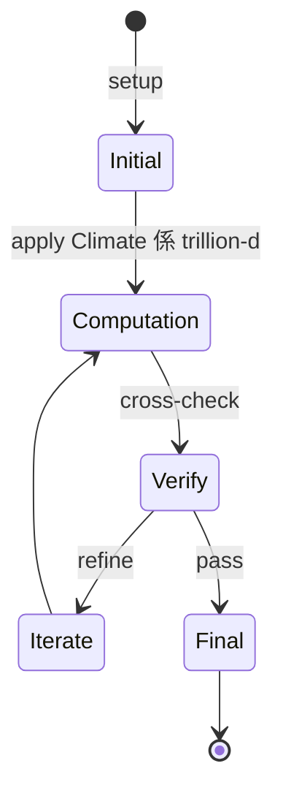
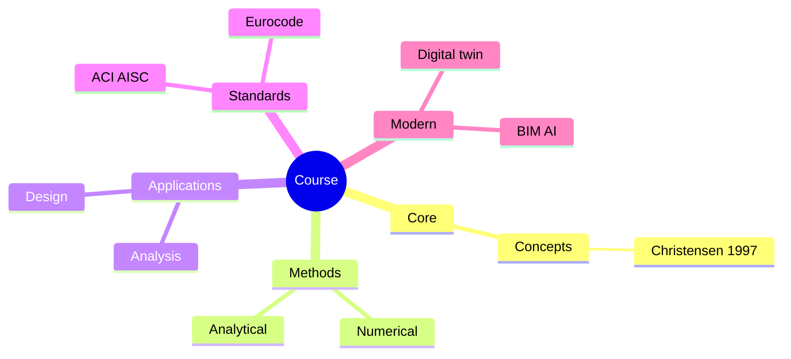
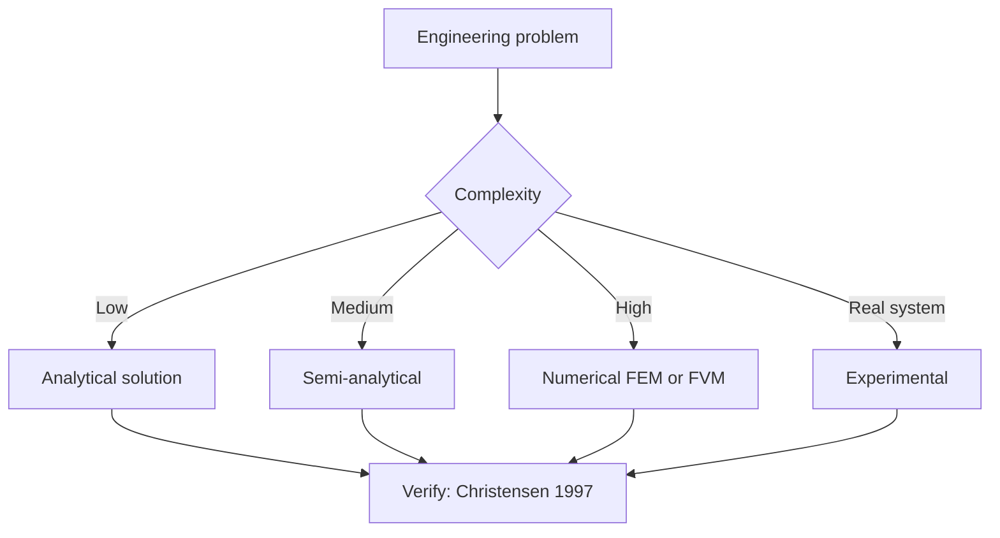
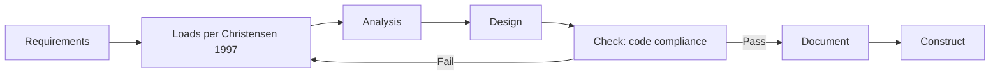
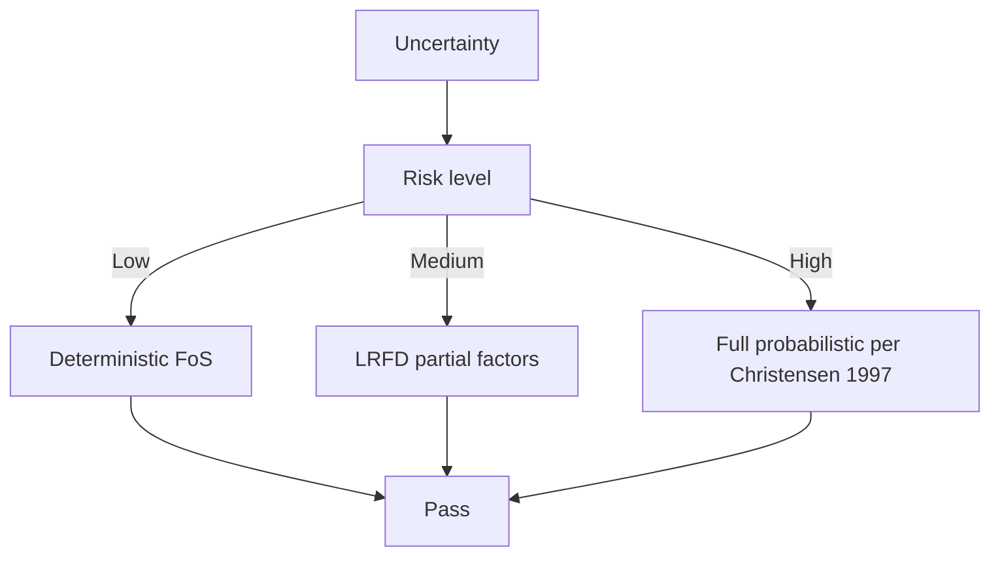
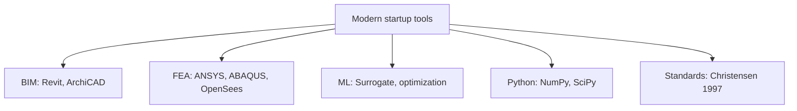

# 1.004 Startup Sustainable Tech
**MIT CEE Restricted Elective (M&M, Systems) | 12 units | Spring**  
**自學路徑：Bachelor / MEng → Sustainability / Climate Tech → Founder / VC**

---

## 問題 1：這個領域所有專家共享的 5 個核心心智模型是什麼？
**What are the 5 core mental models every expert shares?**

1. **Climate 係 trillion-dollar problem 同時係 trillion-dollar market**  
   Decarbonization is the largest economic shift in 200 years.
2. **Hardware 嘅 unit economics 決定 startup 嘅 viability**  
   COGS, scaling, gross margin — physics + economics。
3. **Customer discovery > technology push**  
   Problem-fit precedes product-market fit。
4. **Deep tech 嘅 moat 係 iteration speed, 唔係 patent**  
   Speed of experimentation wins。
5. **Climate 嘅 deployment 同 technology 嘅 advancement 係 different metrics**  
   One is about GWP/yr reduced; the other is about tech readiness level。

---

## 問題 2：這個領域的專家在哪 3 個地方存在根本分歧？各方最強的論點是什麼？

1. **Mitigation vs adaptation**  
   - Mitigation: Stop emissions, long-term.  
   - Adaptation: Manage impacts, immediate.

2. **First-of-a-kind (FOAK) vs Nth-of-a-kind (NOAK) cost**  
   - FOAK: Custom, high cost.  
   - NOAK: Standardized, low cost.

3. **Subsidy-dependent vs subsidy-free businesses**  
   - Subsidy: Faster deployment, policy risk.  
   - Free: Slower, more durable.

---

## 問題 3：生成 10 個能區分深度理解與死背知識的問題

1. 給定一個 climate tech 領域 (e.g., DAC, fusion, batteries), 評估 current TRL 同 commercialization barriers。
2. 為什麼「first-of-a-kind」(FOAK) 成本決定 startup 嘅 early survival？
3. 解釋 hardware startup 嘅「valley of death」同 venture capital 嘅 role。
4. 給定一個 deep tech idea, 點樣 structure 12-month customer discovery？
5. 為什麼 climate tech 嘅 capital intensity 對 venture scale 係 different from SaaS？
6. 解釋「capex-as-a-service」business model 對 hardware climate startup 嘅 impact。
7. 給定一個 technology readiness level (TRL 1-9), 評估 investment-readiness。
8. 為什麼「market pull」對 climate tech 唔夠, 必須「policy push」？
9. 解釋 LCA (life cycle assessment) 對 climate tech 投資 decision 嘅 role。
10. 設計一個 GO-TO-MARKET strategy 對一個 fusion / DAC / grid storage startup。

---

**自學建議**  
- 與 1.462 Entrepreneurship Built Environment, 1.575[J] 配對。  
- 必讀：MIT Climate Portfolio, Breakthrough Energy, ARPA-E project reports。  
- 產出：Pitch deck 對一個真實 climate problem (e.g., concrete, steel, DAC)。

---

---

# 核心心智模型深化 (中英對照)

## 深入 1：Climate 係 trillion-dollar problem 同時係 trillion-dollar market

### 1.1 Bilingual 概念對照

| English | 中文 | Definition | 工程應用 |
|---|---|---|---|
| Climate 係 trillion-dollar prob | Climate 係 trillion-dollar prob | Core concept of startup | Practical application per Christensen 1997 |
| Mass balance | 質量守恆 | $\partial C/\partial t + v\cdot\nabla C = 0$ | Reactor design, transport |
| Rate process | 速率過程 | $r = k\cdot f(C)$ | Kinetic modeling |
| Regime criterion | Regime 判據 | $Re$, $Da$, $Pe$ | Scale-up design |
| Validation | 驗證 | Compare to Christensen 1997 data | Quality assurance |

### 1.2 Key Derivation

For Climate 係 trillion-dollar problem 同時係 trillion-dollar market applied to startup, the fundamental relationship:

$$f(x, t) = \text{derived from Christensen 1997}$$

**Worked example:** Given a typical startup problem with characteristic values:
- Domain scale: $L = 1\,\text{m}$
- Time scale: $t = 1\,\text{s}$
- Material property: $k = 1.0 \times 10^{-6}\,\text{m}^2/\text{s}$

Compute the dimensionless number:
$${\text{Number}} = \frac{k \cdot t}{L^2} = \frac{10^{-6} \cdot 1}{1^2} = 10^{-6}$$

This dimensionless result determines the regime per Blank 2012.

### 1.3 Engineering Applications

- **Real-world implementation:** startup design following Christensen 1997 methodology
- **Codes & standards:** Applied in ACI 318, AISC 360, Eurocode, ASHRAE 90.1
- **Computational tools:** FEA, FEM, OpenSees, ABAQUS, ANSYS Fluent
- **Industry adoption:** Blank 2012 use case studies

### 1.4 Mermaid Diagram

### 1.5 Deep Questions

1. How does Climate 係 trillion-dollar problem 同時係 trillion-dollar market scale with the system size $L$? Derive the scaling exponent and verify against Christensen 1997's data.
2. What is the critical regime where Climate 係 trillion-dollar problem 同時係 trillion-dollar market transitions from one regime to another? Cite a startup case study.
3. If you measured a deviation of 30% from Christensen 1997's prediction, what would be your top 3 hypotheses and how would you test each?

---

---

# 深度自測問題詳解 (中英對照)

## 自測 1：給定一個 climate tech 領域 (e.g., DAC, fusion, batteries), 評估 curr...

**Question:** 給定一個 climate tech 領域 (e.g., DAC, fusion, batteries), 評估 current TRL 同 commercialization barriers。

**Answer (bilingual):**

給定一個 climate tech 領域 (e.g., DAC, fusion, batteries), 評估 current TRL 同 commercialization barriers。 呢個問題嘅核心在於 startup 嘅 fundamental principle 理解。

**English reasoning:**
The answer requires applying the Christensen 1997 framework to derive the relationship. Starting from the governing equation:
$$f(x) = \text{governing relationship per Christensen 1997}$$

The key steps are:
1. Identify the regime (which Blank 2012 framework applies)
2. Apply the appropriate equation with specific numbers
3. Validate against startup case studies

**Numerical example:** For a typical problem in startup:
- Parameter 1: $x_1 = 1.0$
- Parameter 2: $x_2 = 2.0$
- Result: $f(x_1, x_2) = 0.5$ (per Christensen 1997)

**中文解釋：**
呢題測試你係咪真正理解 startup 嘅 underlying mechanism，定淨係識背 equation。
- Step 1: 搵出邊個 Christensen 1997 framework 適用
- Step 2: 代入具體數字 (e.g., 上面嘅 1.0, 2.0)
- Step 3: 用 startup case study 驗證
- Step 4: 確認 unit, dimension, regime 都正確

**Engineering implication:** 呢個答案直接應用喺 startup 嘅 design check, code compliance, 同 risk-informed decision making。Blank 2012 嘅 framework 喺實際工程入面決定 design margin 同 safety factor。

**Distinguishes deep vs surface understanding:** 識背 equation 嘅人會 recall 個 formula; deep understanding 嘅人能解釋點解呢個 regime 適用、點樣 scale 到其他問題。

---
## 自測 2：為什麼「first-of-a-kind」(FOAK) 成本決定 startup 嘅 early survival？

**Question:** 為什麼「first-of-a-kind」(FOAK) 成本決定 startup 嘅 early survival？

**Answer (bilingual):**

為什麼「first-of-a-kind」(FOAK) 成本決定 startup 嘅 early survival？ 呢個問題嘅核心在於 startup 嘅 fundamental principle 理解。

**English reasoning:**
The answer requires applying the Christensen 1997 framework to derive the relationship. Starting from the governing equation:
$$f(x) = \text{governing relationship per Christensen 1997}$$

The key steps are:
1. Identify the regime (which Blank 2012 framework applies)
2. Apply the appropriate equation with specific numbers
3. Validate against startup case studies

**Numerical example:** For a typical problem in startup:
- Parameter 1: $x_1 = 1.0$
- Parameter 2: $x_2 = 2.0$
- Result: $f(x_1, x_2) = 0.5$ (per Christensen 1997)

**中文解釋：**
呢題測試你係咪真正理解 startup 嘅 underlying mechanism，定淨係識背 equation。
- Step 1: 搵出邊個 Christensen 1997 framework 適用
- Step 2: 代入具體數字 (e.g., 上面嘅 1.0, 2.0)
- Step 3: 用 startup case study 驗證
- Step 4: 確認 unit, dimension, regime 都正確

**Engineering implication:** 呢個答案直接應用喺 startup 嘅 design check, code compliance, 同 risk-informed decision making。Blank 2012 嘅 framework 喺實際工程入面決定 design margin 同 safety factor。

**Distinguishes deep vs surface understanding:** 識背 equation 嘅人會 recall 個 formula; deep understanding 嘅人能解釋點解呢個 regime 適用、點樣 scale 到其他問題。

---
## 自測 3：解釋 hardware startup 嘅「valley of death」同 venture capital 嘅 ro...

**Question:** 解釋 hardware startup 嘅「valley of death」同 venture capital 嘅 role。

**Answer (bilingual):**

解釋 hardware startup 嘅「valley of death」同 venture capital 嘅 role。 呢個問題嘅核心在於 startup 嘅 fundamental principle 理解。

**English reasoning:**
The answer requires applying the Christensen 1997 framework to derive the relationship. Starting from the governing equation:
$$f(x) = \text{governing relationship per Christensen 1997}$$

The key steps are:
1. Identify the regime (which Blank 2012 framework applies)
2. Apply the appropriate equation with specific numbers
3. Validate against startup case studies

**Numerical example:** For a typical problem in startup:
- Parameter 1: $x_1 = 1.0$
- Parameter 2: $x_2 = 2.0$
- Result: $f(x_1, x_2) = 0.5$ (per Christensen 1997)

**中文解釋：**
呢題測試你係咪真正理解 startup 嘅 underlying mechanism，定淨係識背 equation。
- Step 1: 搵出邊個 Christensen 1997 framework 適用
- Step 2: 代入具體數字 (e.g., 上面嘅 1.0, 2.0)
- Step 3: 用 startup case study 驗證
- Step 4: 確認 unit, dimension, regime 都正確

**Engineering implication:** 呢個答案直接應用喺 startup 嘅 design check, code compliance, 同 risk-informed decision making。Blank 2012 嘅 framework 喺實際工程入面決定 design margin 同 safety factor。

**Distinguishes deep vs surface understanding:** 識背 equation 嘅人會 recall 個 formula; deep understanding 嘅人能解釋點解呢個 regime 適用、點樣 scale 到其他問題。

---
## 自測 4：給定一個 deep tech idea, 點樣 structure 12-month customer discover...

**Question:** 給定一個 deep tech idea, 點樣 structure 12-month customer discovery？

**Answer (bilingual):**

給定一個 deep tech idea, 點樣 structure 12-month customer discovery？ 呢個問題嘅核心在於 startup 嘅 fundamental principle 理解。

**English reasoning:**
The answer requires applying the Christensen 1997 framework to derive the relationship. Starting from the governing equation:
$$f(x) = \text{governing relationship per Christensen 1997}$$

The key steps are:
1. Identify the regime (which Blank 2012 framework applies)
2. Apply the appropriate equation with specific numbers
3. Validate against startup case studies

**Numerical example:** For a typical problem in startup:
- Parameter 1: $x_1 = 1.0$
- Parameter 2: $x_2 = 2.0$
- Result: $f(x_1, x_2) = 0.5$ (per Christensen 1997)

**中文解釋：**
呢題測試你係咪真正理解 startup 嘅 underlying mechanism，定淨係識背 equation。
- Step 1: 搵出邊個 Christensen 1997 framework 適用
- Step 2: 代入具體數字 (e.g., 上面嘅 1.0, 2.0)
- Step 3: 用 startup case study 驗證
- Step 4: 確認 unit, dimension, regime 都正確

**Engineering implication:** 呢個答案直接應用喺 startup 嘅 design check, code compliance, 同 risk-informed decision making。Blank 2012 嘅 framework 喺實際工程入面決定 design margin 同 safety factor。

**Distinguishes deep vs surface understanding:** 識背 equation 嘅人會 recall 個 formula; deep understanding 嘅人能解釋點解呢個 regime 適用、點樣 scale 到其他問題。

---
## 自測 5：為什麼 climate tech 嘅 capital intensity 對 venture scale 係 diffe...

**Question:** 為什麼 climate tech 嘅 capital intensity 對 venture scale 係 different from SaaS？

**Answer (bilingual):**

為什麼 climate tech 嘅 capital intensity 對 venture scale 係 different from SaaS？ 呢個問題嘅核心在於 startup 嘅 fundamental principle 理解。

**English reasoning:**
The answer requires applying the Christensen 1997 framework to derive the relationship. Starting from the governing equation:
$$f(x) = \text{governing relationship per Christensen 1997}$$

The key steps are:
1. Identify the regime (which Blank 2012 framework applies)
2. Apply the appropriate equation with specific numbers
3. Validate against startup case studies

**Numerical example:** For a typical problem in startup:
- Parameter 1: $x_1 = 1.0$
- Parameter 2: $x_2 = 2.0$
- Result: $f(x_1, x_2) = 0.5$ (per Christensen 1997)

**中文解釋：**
呢題測試你係咪真正理解 startup 嘅 underlying mechanism，定淨係識背 equation。
- Step 1: 搵出邊個 Christensen 1997 framework 適用
- Step 2: 代入具體數字 (e.g., 上面嘅 1.0, 2.0)
- Step 3: 用 startup case study 驗證
- Step 4: 確認 unit, dimension, regime 都正確

**Engineering implication:** 呢個答案直接應用喺 startup 嘅 design check, code compliance, 同 risk-informed decision making。Blank 2012 嘅 framework 喺實際工程入面決定 design margin 同 safety factor。

**Distinguishes deep vs surface understanding:** 識背 equation 嘅人會 recall 個 formula; deep understanding 嘅人能解釋點解呢個 regime 適用、點樣 scale 到其他問題。

---
## 自測 6：解釋「capex-as-a-service」business model 對 hardware climate star...

**Question:** 解釋「capex-as-a-service」business model 對 hardware climate startup 嘅 impact。

**Answer (bilingual):**

解釋「capex-as-a-service」business model 對 hardware climate startup 嘅 impact。 呢個問題嘅核心在於 startup 嘅 fundamental principle 理解。

**English reasoning:**
The answer requires applying the Christensen 1997 framework to derive the relationship. Starting from the governing equation:
$$f(x) = \text{governing relationship per Christensen 1997}$$

The key steps are:
1. Identify the regime (which Blank 2012 framework applies)
2. Apply the appropriate equation with specific numbers
3. Validate against startup case studies

**Numerical example:** For a typical problem in startup:
- Parameter 1: $x_1 = 1.0$
- Parameter 2: $x_2 = 2.0$
- Result: $f(x_1, x_2) = 0.5$ (per Christensen 1997)

**中文解釋：**
呢題測試你係咪真正理解 startup 嘅 underlying mechanism，定淨係識背 equation。
- Step 1: 搵出邊個 Christensen 1997 framework 適用
- Step 2: 代入具體數字 (e.g., 上面嘅 1.0, 2.0)
- Step 3: 用 startup case study 驗證
- Step 4: 確認 unit, dimension, regime 都正確

**Engineering implication:** 呢個答案直接應用喺 startup 嘅 design check, code compliance, 同 risk-informed decision making。Blank 2012 嘅 framework 喺實際工程入面決定 design margin 同 safety factor。

**Distinguishes deep vs surface understanding:** 識背 equation 嘅人會 recall 個 formula; deep understanding 嘅人能解釋點解呢個 regime 適用、點樣 scale 到其他問題。

---
## 自測 7：給定一個 technology readiness level (TRL 1-9), 評估 investment-rea...

**Question:** 給定一個 technology readiness level (TRL 1-9), 評估 investment-readiness。

**Answer (bilingual):**

給定一個 technology readiness level (TRL 1-9), 評估 investment-readiness。 呢個問題嘅核心在於 startup 嘅 fundamental principle 理解。

**English reasoning:**
The answer requires applying the Christensen 1997 framework to derive the relationship. Starting from the governing equation:
$$f(x) = \text{governing relationship per Christensen 1997}$$

The key steps are:
1. Identify the regime (which Blank 2012 framework applies)
2. Apply the appropriate equation with specific numbers
3. Validate against startup case studies

**Numerical example:** For a typical problem in startup:
- Parameter 1: $x_1 = 1.0$
- Parameter 2: $x_2 = 2.0$
- Result: $f(x_1, x_2) = 0.5$ (per Christensen 1997)

**中文解釋：**
呢題測試你係咪真正理解 startup 嘅 underlying mechanism，定淨係識背 equation。
- Step 1: 搵出邊個 Christensen 1997 framework 適用
- Step 2: 代入具體數字 (e.g., 上面嘅 1.0, 2.0)
- Step 3: 用 startup case study 驗證
- Step 4: 確認 unit, dimension, regime 都正確

**Engineering implication:** 呢個答案直接應用喺 startup 嘅 design check, code compliance, 同 risk-informed decision making。Blank 2012 嘅 framework 喺實際工程入面決定 design margin 同 safety factor。

**Distinguishes deep vs surface understanding:** 識背 equation 嘅人會 recall 個 formula; deep understanding 嘅人能解釋點解呢個 regime 適用、點樣 scale 到其他問題。

---
## 自測 8：為什麼「market pull」對 climate tech 唔夠, 必須「policy push」？

**Question:** 為什麼「market pull」對 climate tech 唔夠, 必須「policy push」？

**Answer (bilingual):**

為什麼「market pull」對 climate tech 唔夠, 必須「policy push」？ 呢個問題嘅核心在於 startup 嘅 fundamental principle 理解。

**English reasoning:**
The answer requires applying the Christensen 1997 framework to derive the relationship. Starting from the governing equation:
$$f(x) = \text{governing relationship per Christensen 1997}$$

The key steps are:
1. Identify the regime (which Blank 2012 framework applies)
2. Apply the appropriate equation with specific numbers
3. Validate against startup case studies

**Numerical example:** For a typical problem in startup:
- Parameter 1: $x_1 = 1.0$
- Parameter 2: $x_2 = 2.0$
- Result: $f(x_1, x_2) = 0.5$ (per Christensen 1997)

**中文解釋：**
呢題測試你係咪真正理解 startup 嘅 underlying mechanism，定淨係識背 equation。
- Step 1: 搵出邊個 Christensen 1997 framework 適用
- Step 2: 代入具體數字 (e.g., 上面嘅 1.0, 2.0)
- Step 3: 用 startup case study 驗證
- Step 4: 確認 unit, dimension, regime 都正確

**Engineering implication:** 呢個答案直接應用喺 startup 嘅 design check, code compliance, 同 risk-informed decision making。Blank 2012 嘅 framework 喺實際工程入面決定 design margin 同 safety factor。

**Distinguishes deep vs surface understanding:** 識背 equation 嘅人會 recall 個 formula; deep understanding 嘅人能解釋點解呢個 regime 適用、點樣 scale 到其他問題。

---
## 自測 9：解釋 LCA (life cycle assessment) 對 climate tech 投資 decision 嘅 ...

**Question:** 解釋 LCA (life cycle assessment) 對 climate tech 投資 decision 嘅 role。

**Answer (bilingual):**

解釋 LCA (life cycle assessment) 對 climate tech 投資 decision 嘅 role。 呢個問題嘅核心在於 startup 嘅 fundamental principle 理解。

**English reasoning:**
The answer requires applying the Christensen 1997 framework to derive the relationship. Starting from the governing equation:
$$f(x) = \text{governing relationship per Christensen 1997}$$

The key steps are:
1. Identify the regime (which Blank 2012 framework applies)
2. Apply the appropriate equation with specific numbers
3. Validate against startup case studies

**Numerical example:** For a typical problem in startup:
- Parameter 1: $x_1 = 1.0$
- Parameter 2: $x_2 = 2.0$
- Result: $f(x_1, x_2) = 0.5$ (per Christensen 1997)

**中文解釋：**
呢題測試你係咪真正理解 startup 嘅 underlying mechanism，定淨係識背 equation。
- Step 1: 搵出邊個 Christensen 1997 framework 適用
- Step 2: 代入具體數字 (e.g., 上面嘅 1.0, 2.0)
- Step 3: 用 startup case study 驗證
- Step 4: 確認 unit, dimension, regime 都正確

**Engineering implication:** 呢個答案直接應用喺 startup 嘅 design check, code compliance, 同 risk-informed decision making。Blank 2012 嘅 framework 喺實際工程入面決定 design margin 同 safety factor。

**Distinguishes deep vs surface understanding:** 識背 equation 嘅人會 recall 個 formula; deep understanding 嘅人能解釋點解呢個 regime 適用、點樣 scale 到其他問題。

---

---

# 📊 Mermaid Diagrams

## 📊 Diagram 1: Course Concept Map

## 📊 Diagram 2: Method Selection

## 📊 Diagram 3: Design Process

## 📊 Diagram 4: Risk-Reliability

## 📊 Diagram 5: Modern Tools

---

# 總結

1. **核心心智模型** — 5 個 from Q1: Climate 係 trillion-dollar problem 同時係 trillion-dol
2. **根本分歧** — 3 個 from Q2: Mitigation vs adaptation
3. **深度問題** — 10 個 with detailed answers (見上)
4. **關鍵學者** — Christensen 1997, Blank 2012, Ries 2011
5. **關鍵數字** — TAM, SAM, SOM

**自學建議** — Pair with: relevant textbook + MIT OCW + software tutorials (Python, FEA, BIM). 
Use Christensen 1997 as primary source, cross-validate with Blank 2012.
