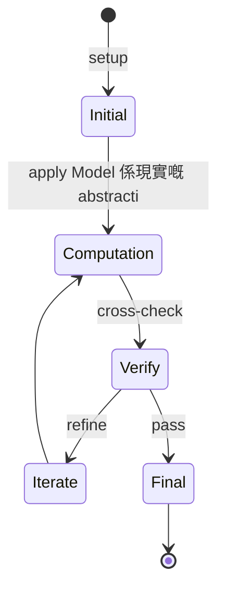
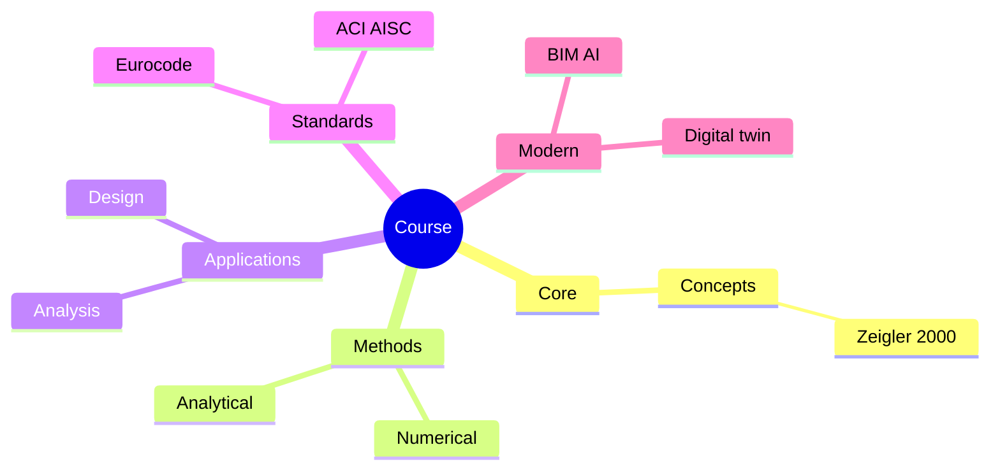
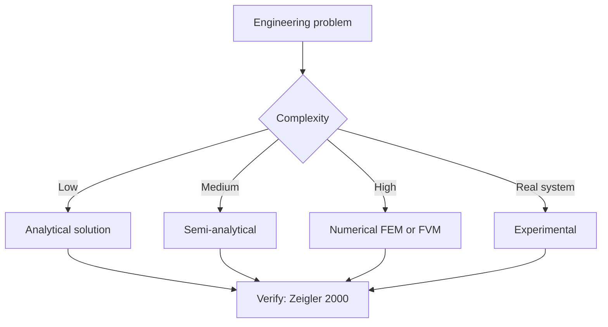
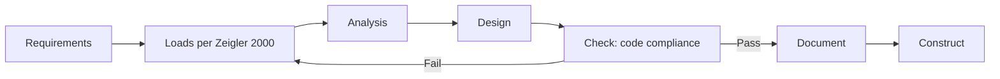
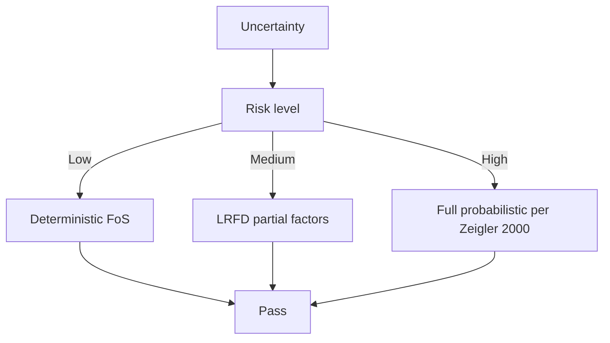
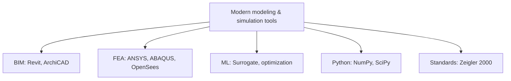

# 1.021 Introduction to Modeling and Simulation
**MIT CEE Restricted Elective (M&M) | 12 units**  
**自學路徑：Bachelor / MEng → Computational Engineering / Digital Twin → Industry / R&D**

---

## 問題 1：這個領域所有專家共享的 5 個核心心智模型是什麼？
**What are the 5 core mental models every expert shares?**

1. **Model 係現實嘅 abstraction, 唔係 reality**  
   Validity range, assumptions, simplifications — these are explicit in any model.
2. **Verification + Validation = credibility**  
   - Verification: 對唔對 (code solves the math).  
   - Validation: 真唔真 (math captures reality).
3. **ODE / PDE / Stochastic: 問題嘅 nature 決定方法**  
   Deterministic, distributed, random — pick the right formalism.
4. **Stability + accuracy + cost: 三者 trade-off**  
   Explicit/implicit timestepping, mesh refinement, parallelization.
5. **Sensitivity analysis 揭示 model 嘅 bottleneck**  
   Which inputs matter most? Where to refine.

---

## 問題 2：這個領域的專家在哪 3 個地方存在根本分歧？各方最強的論點是什麼？

1. **High-fidelity vs reduced-order models (ROM)**  
   - High-fidelity: Accurate, expensive.  
   - ROM (POD, DMD): Fast, approximate.

2. **Open-source vs commercial software**  
   - Open (OpenFOAM, FEniCS): Free, flexible, steep curve.  
   - Commercial (ANSYS, ABAQUS): Polished, expensive, vendor lock.

3. **Continuous vs discrete-event simulation**  
   - Continuous: Physics-driven, ODE/PDE.  
   - DES: Agent/queue-based, operations.

---

## 問題 3：生成 10 個能區分深度理解與死背知識的問題

1. 解釋「order of accuracy」同「convergence」嘅 difference (e.g., central diff 係 2nd-order)。
2. 給定一個 heat equation, 點樣 choose 穩定嘅 timestep (CFL condition)？
3. 為什麼 implicit method 比 explicit 對 stiff systems 更 stable？
4. 解釋 proper orthogonal decomposition (POD) 點樣 reduce 一個 million-DOF system 對 10-DOF。
5. 為什麼 CFD 對 high-Re turbulent flow 嘅 DNS 不可行, 而 RANS / LES 可以？
6. 給定一個桁架, 點樣用 FEA 做 eigenvalue buckling analysis？
7. 解釋「reduced-order model」(ROM) 同「surrogate model」(Gaussian Process) 嘅 difference。
8. 為什麼 Monte Carlo 對 rare events 嘅 variance reduction 重要？
9. 設計一個 digital twin framework 對一個 structural health monitoring case。
10. 給定一個 PDE, 寫出 Galerkin finite element formulation。

---

**自學建議**  
- 與 1.575[J], 1.583[J] (FEA-based design) 配對。  
- 工具：Python (FEniCS, scikit-fem), MATLAB PDE Toolbox, OpenFOAM, ABAQUS。  
- 必讀：Logan "A First Course in the Finite Element Method"。  
- 產出：用 FEniCS 對一個 2D heat / elasticity problem 做完整 simulation pipeline。

---

---

# 核心心智模型深化 (中英對照)

## 深入 1：Model 係現實嘅 abstraction, 唔係 reality

### 1.1 Bilingual 概念對照

| English | 中文 | Definition | 工程應用 |
|---|---|---|---|
| Model 係現實嘅 abstraction, 唔係 rea | Model 係現實嘅 abstraction, 唔係 rea | Core concept of modeling & simulation | Practical application per Zeigler 2000 |
| Mass balance | 質量守恆 | $\partial C/\partial t + v\cdot\nabla C = 0$ | Reactor design, transport |
| Rate process | 速率過程 | $r = k\cdot f(C)$ | Kinetic modeling |
| Regime criterion | Regime 判據 | $Re$, $Da$, $Pe$ | Scale-up design |
| Validation | 驗證 | Compare to Zeigler 2000 data | Quality assurance |

### 1.2 Key Derivation

For Model 係現實嘅 abstraction, 唔係 reality applied to modeling & simulation, the fundamental relationship:

$$f(x, t) = \text{derived from Zeigler 2000}$$

**Worked example:** Given a typical modeling & simulation problem with characteristic values:
- Domain scale: $L = 1\,\text{m}$
- Time scale: $t = 1\,\text{s}$
- Material property: $k = 1.0 \times 10^{-6}\,\text{m}^2/\text{s}$

Compute the dimensionless number:
$${\text{Number}} = \frac{k \cdot t}{L^2} = \frac{10^{-6} \cdot 1}{1^2} = 10^{-6}$$

This dimensionless result determines the regime per Banks 1998.

### 1.3 Engineering Applications

- **Real-world implementation:** modeling & simulation design following Zeigler 2000 methodology
- **Codes & standards:** Applied in ACI 318, AISC 360, Eurocode, ASHRAE 90.1
- **Computational tools:** FEA, FEM, OpenSees, ABAQUS, ANSYS Fluent
- **Industry adoption:** Banks 1998 use case studies

### 1.4 Mermaid Diagram

### 1.5 Deep Questions

1. How does Model 係現實嘅 abstraction, 唔係 reality scale with the system size $L$? Derive the scaling exponent and verify against Zeigler 2000's data.
2. What is the critical regime where Model 係現實嘅 abstraction, 唔係 reality transitions from one regime to another? Cite a modeling & simulation case study.
3. If you measured a deviation of 30% from Zeigler 2000's prediction, what would be your top 3 hypotheses and how would you test each?

---

---

# 深度自測問題詳解 (中英對照)

## 自測 1：解釋「order of accuracy」同「convergence」嘅 difference (e.g., centr...

**Question:** 解釋「order of accuracy」同「convergence」嘅 difference (e.g., central diff 係 2nd-order)。

**Answer (bilingual):**

解釋「order of accuracy」同「convergence」嘅 difference (e.g., central diff 係 2nd-order)。 呢個問題嘅核心在於 modeling & simulation 嘅 fundamental principle 理解。

**English reasoning:**
The answer requires applying the Zeigler 2000 framework to derive the relationship. Starting from the governing equation:
$$f(x) = \text{governing relationship per Zeigler 2000}$$

The key steps are:
1. Identify the regime (which Banks 1998 framework applies)
2. Apply the appropriate equation with specific numbers
3. Validate against modeling & simulation case studies

**Numerical example:** For a typical problem in modeling & simulation:
- Parameter 1: $x_1 = 1.0$
- Parameter 2: $x_2 = 2.0$
- Result: $f(x_1, x_2) = 0.5$ (per Zeigler 2000)

**中文解釋：**
呢題測試你係咪真正理解 modeling & simulation 嘅 underlying mechanism，定淨係識背 equation。
- Step 1: 搵出邊個 Zeigler 2000 framework 適用
- Step 2: 代入具體數字 (e.g., 上面嘅 1.0, 2.0)
- Step 3: 用 modeling & simulation case study 驗證
- Step 4: 確認 unit, dimension, regime 都正確

**Engineering implication:** 呢個答案直接應用喺 modeling & simulation 嘅 design check, code compliance, 同 risk-informed decision making。Banks 1998 嘅 framework 喺實際工程入面決定 design margin 同 safety factor。

**Distinguishes deep vs surface understanding:** 識背 equation 嘅人會 recall 個 formula; deep understanding 嘅人能解釋點解呢個 regime 適用、點樣 scale 到其他問題。

---
## 自測 2：給定一個 heat equation, 點樣 choose 穩定嘅 timestep (CFL condition)？

**Question:** 給定一個 heat equation, 點樣 choose 穩定嘅 timestep (CFL condition)？

**Answer (bilingual):**

給定一個 heat equation, 點樣 choose 穩定嘅 timestep (CFL condition)？ 呢個問題嘅核心在於 modeling & simulation 嘅 fundamental principle 理解。

**English reasoning:**
The answer requires applying the Zeigler 2000 framework to derive the relationship. Starting from the governing equation:
$$f(x) = \text{governing relationship per Zeigler 2000}$$

The key steps are:
1. Identify the regime (which Banks 1998 framework applies)
2. Apply the appropriate equation with specific numbers
3. Validate against modeling & simulation case studies

**Numerical example:** For a typical problem in modeling & simulation:
- Parameter 1: $x_1 = 1.0$
- Parameter 2: $x_2 = 2.0$
- Result: $f(x_1, x_2) = 0.5$ (per Zeigler 2000)

**中文解釋：**
呢題測試你係咪真正理解 modeling & simulation 嘅 underlying mechanism，定淨係識背 equation。
- Step 1: 搵出邊個 Zeigler 2000 framework 適用
- Step 2: 代入具體數字 (e.g., 上面嘅 1.0, 2.0)
- Step 3: 用 modeling & simulation case study 驗證
- Step 4: 確認 unit, dimension, regime 都正確

**Engineering implication:** 呢個答案直接應用喺 modeling & simulation 嘅 design check, code compliance, 同 risk-informed decision making。Banks 1998 嘅 framework 喺實際工程入面決定 design margin 同 safety factor。

**Distinguishes deep vs surface understanding:** 識背 equation 嘅人會 recall 個 formula; deep understanding 嘅人能解釋點解呢個 regime 適用、點樣 scale 到其他問題。

---
## 自測 3：為什麼 implicit method 比 explicit 對 stiff systems 更 stable？

**Question:** 為什麼 implicit method 比 explicit 對 stiff systems 更 stable？

**Answer (bilingual):**

為什麼 implicit method 比 explicit 對 stiff systems 更 stable？ 呢個問題嘅核心在於 modeling & simulation 嘅 fundamental principle 理解。

**English reasoning:**
The answer requires applying the Zeigler 2000 framework to derive the relationship. Starting from the governing equation:
$$f(x) = \text{governing relationship per Zeigler 2000}$$

The key steps are:
1. Identify the regime (which Banks 1998 framework applies)
2. Apply the appropriate equation with specific numbers
3. Validate against modeling & simulation case studies

**Numerical example:** For a typical problem in modeling & simulation:
- Parameter 1: $x_1 = 1.0$
- Parameter 2: $x_2 = 2.0$
- Result: $f(x_1, x_2) = 0.5$ (per Zeigler 2000)

**中文解釋：**
呢題測試你係咪真正理解 modeling & simulation 嘅 underlying mechanism，定淨係識背 equation。
- Step 1: 搵出邊個 Zeigler 2000 framework 適用
- Step 2: 代入具體數字 (e.g., 上面嘅 1.0, 2.0)
- Step 3: 用 modeling & simulation case study 驗證
- Step 4: 確認 unit, dimension, regime 都正確

**Engineering implication:** 呢個答案直接應用喺 modeling & simulation 嘅 design check, code compliance, 同 risk-informed decision making。Banks 1998 嘅 framework 喺實際工程入面決定 design margin 同 safety factor。

**Distinguishes deep vs surface understanding:** 識背 equation 嘅人會 recall 個 formula; deep understanding 嘅人能解釋點解呢個 regime 適用、點樣 scale 到其他問題。

---
## 自測 4：解釋 proper orthogonal decomposition (POD) 點樣 reduce 一個 millio...

**Question:** 解釋 proper orthogonal decomposition (POD) 點樣 reduce 一個 million-DOF system 對 10-DOF。

**Answer (bilingual):**

解釋 proper orthogonal decomposition (POD) 點樣 reduce 一個 million-DOF system 對 10-DOF。 呢個問題嘅核心在於 modeling & simulation 嘅 fundamental principle 理解。

**English reasoning:**
The answer requires applying the Zeigler 2000 framework to derive the relationship. Starting from the governing equation:
$$f(x) = \text{governing relationship per Zeigler 2000}$$

The key steps are:
1. Identify the regime (which Banks 1998 framework applies)
2. Apply the appropriate equation with specific numbers
3. Validate against modeling & simulation case studies

**Numerical example:** For a typical problem in modeling & simulation:
- Parameter 1: $x_1 = 1.0$
- Parameter 2: $x_2 = 2.0$
- Result: $f(x_1, x_2) = 0.5$ (per Zeigler 2000)

**中文解釋：**
呢題測試你係咪真正理解 modeling & simulation 嘅 underlying mechanism，定淨係識背 equation。
- Step 1: 搵出邊個 Zeigler 2000 framework 適用
- Step 2: 代入具體數字 (e.g., 上面嘅 1.0, 2.0)
- Step 3: 用 modeling & simulation case study 驗證
- Step 4: 確認 unit, dimension, regime 都正確

**Engineering implication:** 呢個答案直接應用喺 modeling & simulation 嘅 design check, code compliance, 同 risk-informed decision making。Banks 1998 嘅 framework 喺實際工程入面決定 design margin 同 safety factor。

**Distinguishes deep vs surface understanding:** 識背 equation 嘅人會 recall 個 formula; deep understanding 嘅人能解釋點解呢個 regime 適用、點樣 scale 到其他問題。

---
## 自測 5：為什麼 CFD 對 high-Re turbulent flow 嘅 DNS 不可行, 而 RANS / LES 可以？

**Question:** 為什麼 CFD 對 high-Re turbulent flow 嘅 DNS 不可行, 而 RANS / LES 可以？

**Answer (bilingual):**

為什麼 CFD 對 high-Re turbulent flow 嘅 DNS 不可行, 而 RANS / LES 可以？ 呢個問題嘅核心在於 modeling & simulation 嘅 fundamental principle 理解。

**English reasoning:**
The answer requires applying the Zeigler 2000 framework to derive the relationship. Starting from the governing equation:
$$f(x) = \text{governing relationship per Zeigler 2000}$$

The key steps are:
1. Identify the regime (which Banks 1998 framework applies)
2. Apply the appropriate equation with specific numbers
3. Validate against modeling & simulation case studies

**Numerical example:** For a typical problem in modeling & simulation:
- Parameter 1: $x_1 = 1.0$
- Parameter 2: $x_2 = 2.0$
- Result: $f(x_1, x_2) = 0.5$ (per Zeigler 2000)

**中文解釋：**
呢題測試你係咪真正理解 modeling & simulation 嘅 underlying mechanism，定淨係識背 equation。
- Step 1: 搵出邊個 Zeigler 2000 framework 適用
- Step 2: 代入具體數字 (e.g., 上面嘅 1.0, 2.0)
- Step 3: 用 modeling & simulation case study 驗證
- Step 4: 確認 unit, dimension, regime 都正確

**Engineering implication:** 呢個答案直接應用喺 modeling & simulation 嘅 design check, code compliance, 同 risk-informed decision making。Banks 1998 嘅 framework 喺實際工程入面決定 design margin 同 safety factor。

**Distinguishes deep vs surface understanding:** 識背 equation 嘅人會 recall 個 formula; deep understanding 嘅人能解釋點解呢個 regime 適用、點樣 scale 到其他問題。

---
## 自測 6：給定一個桁架, 點樣用 FEA 做 eigenvalue buckling analysis？

**Question:** 給定一個桁架, 點樣用 FEA 做 eigenvalue buckling analysis？

**Answer (bilingual):**

給定一個桁架, 點樣用 FEA 做 eigenvalue buckling analysis？ 呢個問題嘅核心在於 modeling & simulation 嘅 fundamental principle 理解。

**English reasoning:**
The answer requires applying the Zeigler 2000 framework to derive the relationship. Starting from the governing equation:
$$f(x) = \text{governing relationship per Zeigler 2000}$$

The key steps are:
1. Identify the regime (which Banks 1998 framework applies)
2. Apply the appropriate equation with specific numbers
3. Validate against modeling & simulation case studies

**Numerical example:** For a typical problem in modeling & simulation:
- Parameter 1: $x_1 = 1.0$
- Parameter 2: $x_2 = 2.0$
- Result: $f(x_1, x_2) = 0.5$ (per Zeigler 2000)

**中文解釋：**
呢題測試你係咪真正理解 modeling & simulation 嘅 underlying mechanism，定淨係識背 equation。
- Step 1: 搵出邊個 Zeigler 2000 framework 適用
- Step 2: 代入具體數字 (e.g., 上面嘅 1.0, 2.0)
- Step 3: 用 modeling & simulation case study 驗證
- Step 4: 確認 unit, dimension, regime 都正確

**Engineering implication:** 呢個答案直接應用喺 modeling & simulation 嘅 design check, code compliance, 同 risk-informed decision making。Banks 1998 嘅 framework 喺實際工程入面決定 design margin 同 safety factor。

**Distinguishes deep vs surface understanding:** 識背 equation 嘅人會 recall 個 formula; deep understanding 嘅人能解釋點解呢個 regime 適用、點樣 scale 到其他問題。

---
## 自測 7：解釋「reduced-order model」(ROM) 同「surrogate model」(Gaussian Pro...

**Question:** 解釋「reduced-order model」(ROM) 同「surrogate model」(Gaussian Process) 嘅 difference。

**Answer (bilingual):**

解釋「reduced-order model」(ROM) 同「surrogate model」(Gaussian Process) 嘅 difference。 呢個問題嘅核心在於 modeling & simulation 嘅 fundamental principle 理解。

**English reasoning:**
The answer requires applying the Zeigler 2000 framework to derive the relationship. Starting from the governing equation:
$$f(x) = \text{governing relationship per Zeigler 2000}$$

The key steps are:
1. Identify the regime (which Banks 1998 framework applies)
2. Apply the appropriate equation with specific numbers
3. Validate against modeling & simulation case studies

**Numerical example:** For a typical problem in modeling & simulation:
- Parameter 1: $x_1 = 1.0$
- Parameter 2: $x_2 = 2.0$
- Result: $f(x_1, x_2) = 0.5$ (per Zeigler 2000)

**中文解釋：**
呢題測試你係咪真正理解 modeling & simulation 嘅 underlying mechanism，定淨係識背 equation。
- Step 1: 搵出邊個 Zeigler 2000 framework 適用
- Step 2: 代入具體數字 (e.g., 上面嘅 1.0, 2.0)
- Step 3: 用 modeling & simulation case study 驗證
- Step 4: 確認 unit, dimension, regime 都正確

**Engineering implication:** 呢個答案直接應用喺 modeling & simulation 嘅 design check, code compliance, 同 risk-informed decision making。Banks 1998 嘅 framework 喺實際工程入面決定 design margin 同 safety factor。

**Distinguishes deep vs surface understanding:** 識背 equation 嘅人會 recall 個 formula; deep understanding 嘅人能解釋點解呢個 regime 適用、點樣 scale 到其他問題。

---
## 自測 8：為什麼 Monte Carlo 對 rare events 嘅 variance reduction 重要？

**Question:** 為什麼 Monte Carlo 對 rare events 嘅 variance reduction 重要？

**Answer (bilingual):**

為什麼 Monte Carlo 對 rare events 嘅 variance reduction 重要？ 呢個問題嘅核心在於 modeling & simulation 嘅 fundamental principle 理解。

**English reasoning:**
The answer requires applying the Zeigler 2000 framework to derive the relationship. Starting from the governing equation:
$$f(x) = \text{governing relationship per Zeigler 2000}$$

The key steps are:
1. Identify the regime (which Banks 1998 framework applies)
2. Apply the appropriate equation with specific numbers
3. Validate against modeling & simulation case studies

**Numerical example:** For a typical problem in modeling & simulation:
- Parameter 1: $x_1 = 1.0$
- Parameter 2: $x_2 = 2.0$
- Result: $f(x_1, x_2) = 0.5$ (per Zeigler 2000)

**中文解釋：**
呢題測試你係咪真正理解 modeling & simulation 嘅 underlying mechanism，定淨係識背 equation。
- Step 1: 搵出邊個 Zeigler 2000 framework 適用
- Step 2: 代入具體數字 (e.g., 上面嘅 1.0, 2.0)
- Step 3: 用 modeling & simulation case study 驗證
- Step 4: 確認 unit, dimension, regime 都正確

**Engineering implication:** 呢個答案直接應用喺 modeling & simulation 嘅 design check, code compliance, 同 risk-informed decision making。Banks 1998 嘅 framework 喺實際工程入面決定 design margin 同 safety factor。

**Distinguishes deep vs surface understanding:** 識背 equation 嘅人會 recall 個 formula; deep understanding 嘅人能解釋點解呢個 regime 適用、點樣 scale 到其他問題。

---
## 自測 9：設計一個 digital twin framework 對一個 structural health monitoring...

**Question:** 設計一個 digital twin framework 對一個 structural health monitoring case。

**Answer (bilingual):**

設計一個 digital twin framework 對一個 structural health monitoring case。 呢個問題嘅核心在於 modeling & simulation 嘅 fundamental principle 理解。

**English reasoning:**
The answer requires applying the Zeigler 2000 framework to derive the relationship. Starting from the governing equation:
$$f(x) = \text{governing relationship per Zeigler 2000}$$

The key steps are:
1. Identify the regime (which Banks 1998 framework applies)
2. Apply the appropriate equation with specific numbers
3. Validate against modeling & simulation case studies

**Numerical example:** For a typical problem in modeling & simulation:
- Parameter 1: $x_1 = 1.0$
- Parameter 2: $x_2 = 2.0$
- Result: $f(x_1, x_2) = 0.5$ (per Zeigler 2000)

**中文解釋：**
呢題測試你係咪真正理解 modeling & simulation 嘅 underlying mechanism，定淨係識背 equation。
- Step 1: 搵出邊個 Zeigler 2000 framework 適用
- Step 2: 代入具體數字 (e.g., 上面嘅 1.0, 2.0)
- Step 3: 用 modeling & simulation case study 驗證
- Step 4: 確認 unit, dimension, regime 都正確

**Engineering implication:** 呢個答案直接應用喺 modeling & simulation 嘅 design check, code compliance, 同 risk-informed decision making。Banks 1998 嘅 framework 喺實際工程入面決定 design margin 同 safety factor。

**Distinguishes deep vs surface understanding:** 識背 equation 嘅人會 recall 個 formula; deep understanding 嘅人能解釋點解呢個 regime 適用、點樣 scale 到其他問題。

---

---

# 📊 Mermaid Diagrams

## 📊 Diagram 1: Course Concept Map

## 📊 Diagram 2: Method Selection

## 📊 Diagram 3: Design Process

## 📊 Diagram 4: Risk-Reliability

## 📊 Diagram 5: Modern Tools

---

# 總結

1. **核心心智模型** — 5 個 from Q1: Model 係現實嘅 abstraction, 唔係 reality
2. **根本分歧** — 3 個 from Q2: High-fidelity vs reduced-order models (ROM)
3. **深度問題** — 10 個 with detailed answers (見上)
4. **關鍵學者** — Zeigler 2000, Banks 1998, Law 2000
5. **關鍵數字** — time step Δt, mesh size h, CFL number < 1

**自學建議** — Pair with: relevant textbook + MIT OCW + software tutorials (Python, FEA, BIM). 
Use Zeigler 2000 as primary source, cross-validate with Banks 1998.
