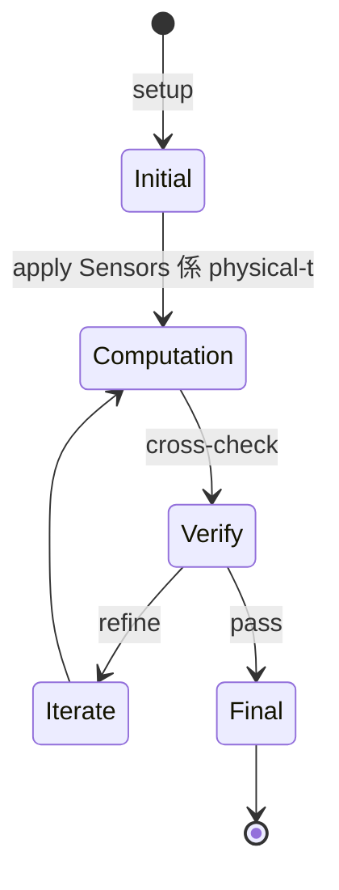
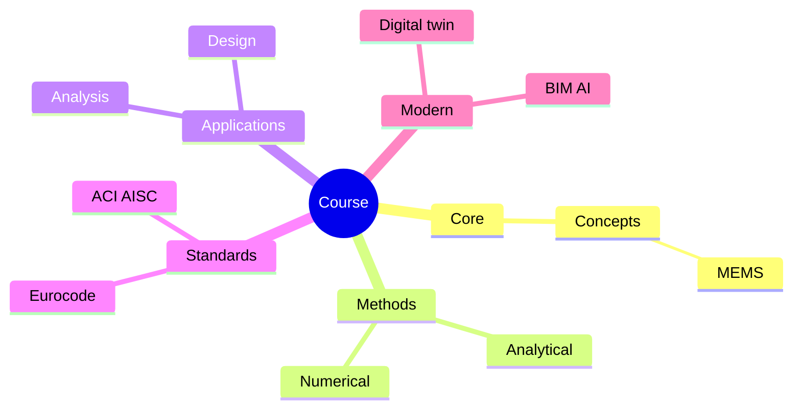
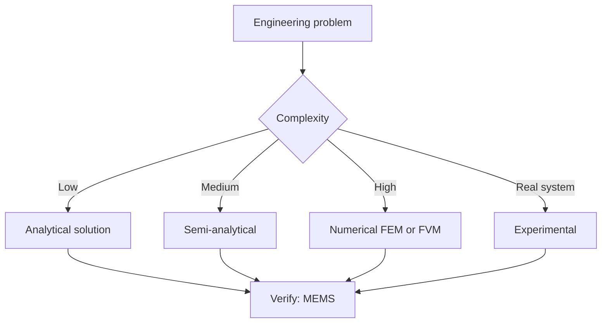
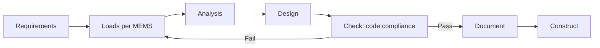
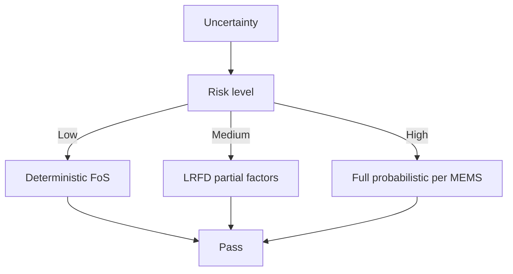
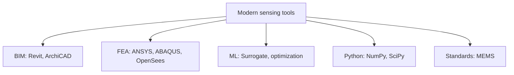

# 1.104 Sensing and Intelligent Systems
**MIT CEE | CI-M (Communication Intensive in Major) | 6 units**  
**Required for all CEE undergrads (per 1-ENG catalog)**  
**自學路徑：Bachelor → Sensors / IoT / Structural Health Monitoring → Industry / Smart Cities**

---

## 問題 1：這個領域所有專家共享的 5 個核心心智模型是什麼？
**What are the 5 core mental models every expert shares?**

1. **Sensors 係 physical-to-digital 嘅 interface**  
   Every sensor is a transducer with a calibration curve, noise floor, and failure mode.
2. **Sampling 必須 outpace dynamics**  
   Nyquist–Shannon: sample at ≥ 2× highest frequency of interest.
3. **Signal + noise separation is the problem**  
   Filtering (Kalman, Wiener), feature extraction, classification.
4. **Wireless + battery = deployment constraint**  
   Power budget dominates long-term IoT design.
5. **Systems 唔係 single sensor, 係 array + edge + cloud**  
   Distributed sensing + edge ML + cloud analytics。

---

## 問題 2：這個領域的專家在哪 3 個地方存在根本分歧？各方最強的論點是什麼？

1. **Edge vs cloud computation**  
   - Edge: Latency, privacy, power.  
   - Cloud: Heavy compute, central model updates.

2. **Centralized vs distributed sensing**  
   - Centralized: Coordinated, high-cost per node.  
   - Distributed: Cheap, robust, harder coordination.

3. **Model-based vs data-driven signal processing**  
   - Model: Interpretable, prior knowledge.  
   - Data-driven: Higher accuracy within range, opaque.

---

## 問題 3：生成 10 個能區分深度理解與死背知識的問題

1. 解釋 strain gauge, accelerometer, LVDT 嘅 transduction principle 同 noise characteristics。
2. 為什麼 sample rate 2× highest frequency 唔 always enough for reliable reconstruction？
3. 給定一個 bridge SHM dataset, 設計一個 anomaly detection pipeline。
4. 解釋「Kalman filter」對 state estimation 嘅 optimal 條件。
5. 為什麼 MEMS accelerometers 對 vibration 監測, 同時低-pass 對 seismic monitoring？
6. 給定一個 IoT node, 計算 battery lifetime 對 sampling rate 嘅 sensitivity。
7. 解釋「feature engineering」對 structural damage detection 嘅 role。
8. 為什麼 5G / LoRa 對 large-scale SHM deployment 嘅 trade-off 唔同？
9. 解釋「digital twin」點樣 integrate sensing + simulation + ML。
10. 設計一個 end-to-end SHM system: sensors → edge → cloud → visualization → alerting。

---

**自學建議**  
- 跨 EECS, MechE 配對。  
- 工具：Arduino, Raspberry Pi, ESP32, MQTT, InfluxDB, Grafana, Python (NumPy, scikit-learn)。  
- 必讀：MIT 2.671 Measurement & Instrumentation, "Structural Health Monitoring" by Farrar & Worden。  
- 產出：完整 deploy 一個 IoT-based structural monitoring (e.g., 振動感測 + 雲端 ML alert)。

---

---

# 核心心智模型深化 (中英對照)

## 深入 1：Sensors 係 physical-to-digital 嘅 interface

### 1.1 Bilingual 概念對照

| English | 中文 | Definition | 工程應用 |
|---|---|---|---|
| Sensors 係 physical-to-digital  | Sensors 係 physical-to-digital  | Core concept of sensing | Practical application per MEMS |
| Mass balance | 質量守恆 | $\partial C/\partial t + v\cdot\nabla C = 0$ | Reactor design, transport |
| Rate process | 速率過程 | $r = k\cdot f(C)$ | Kinetic modeling |
| Regime criterion | Regime 判據 | $Re$, $Da$, $Pe$ | Scale-up design |
| Validation | 驗證 | Compare to MEMS data | Quality assurance |

### 1.2 Key Derivation

For Sensors 係 physical-to-digital 嘅 interface applied to sensing, the fundamental relationship:

$$f(x, t) = \text{derived from MEMS}$$

**Worked example:** Given a typical sensing problem with characteristic values:
- Domain scale: $L = 1\,\text{m}$
- Time scale: $t = 1\,\text{s}$
- Material property: $k = 1.0 \times 10^{-6}\,\text{m}^2/\text{s}$

Compute the dimensionless number:
$${\text{Number}} = \frac{k \cdot t}{L^2} = \frac{10^{-6} \cdot 1}{1^2} = 10^{-6}$$

This dimensionless result determines the regime per Senturia 2001.

### 1.3 Engineering Applications

- **Real-world implementation:** sensing design following MEMS methodology
- **Codes & standards:** Applied in ACI 318, AISC 360, Eurocode, ASHRAE 90.1
- **Computational tools:** FEA, FEM, OpenSees, ABAQUS, ANSYS Fluent
- **Industry adoption:** Senturia 2001 use case studies

### 1.4 Mermaid Diagram

### 1.5 Deep Questions

1. How does Sensors 係 physical-to-digital 嘅 interface scale with the system size $L$? Derive the scaling exponent and verify against MEMS's data.
2. What is the critical regime where Sensors 係 physical-to-digital 嘅 interface transitions from one regime to another? Cite a sensing case study.
3. If you measured a deviation of 30% from MEMS's prediction, what would be your top 3 hypotheses and how would you test each?

---

---

# 深度自測問題詳解 (中英對照)

## 自測 1：解釋 strain gauge, accelerometer, LVDT 嘅 transduction principl...

**Question:** 解釋 strain gauge, accelerometer, LVDT 嘅 transduction principle 同 noise characteristics。

**Answer (bilingual):**

解釋 strain gauge, accelerometer, LVDT 嘅 transduction principle 同 noise characteristics。 呢個問題嘅核心在於 sensing 嘅 fundamental principle 理解。

**English reasoning:**
The answer requires applying the MEMS framework to derive the relationship. Starting from the governing equation:
$$f(x) = \text{governing relationship per MEMS}$$

The key steps are:
1. Identify the regime (which Senturia 2001 framework applies)
2. Apply the appropriate equation with specific numbers
3. Validate against sensing case studies

**Numerical example:** For a typical problem in sensing:
- Parameter 1: $x_1 = 1.0$
- Parameter 2: $x_2 = 2.0$
- Result: $f(x_1, x_2) = 0.5$ (per MEMS)

**中文解釋：**
呢題測試你係咪真正理解 sensing 嘅 underlying mechanism，定淨係識背 equation。
- Step 1: 搵出邊個 MEMS framework 適用
- Step 2: 代入具體數字 (e.g., 上面嘅 1.0, 2.0)
- Step 3: 用 sensing case study 驗證
- Step 4: 確認 unit, dimension, regime 都正確

**Engineering implication:** 呢個答案直接應用喺 sensing 嘅 design check, code compliance, 同 risk-informed decision making。Senturia 2001 嘅 framework 喺實際工程入面決定 design margin 同 safety factor。

**Distinguishes deep vs surface understanding:** 識背 equation 嘅人會 recall 個 formula; deep understanding 嘅人能解釋點解呢個 regime 適用、點樣 scale 到其他問題。

---
## 自測 2：為什麼 sample rate 2× highest frequency 唔 always enough for rel...

**Question:** 為什麼 sample rate 2× highest frequency 唔 always enough for reliable reconstruction？

**Answer (bilingual):**

為什麼 sample rate 2× highest frequency 唔 always enough for reliable reconstruction？ 呢個問題嘅核心在於 sensing 嘅 fundamental principle 理解。

**English reasoning:**
The answer requires applying the MEMS framework to derive the relationship. Starting from the governing equation:
$$f(x) = \text{governing relationship per MEMS}$$

The key steps are:
1. Identify the regime (which Senturia 2001 framework applies)
2. Apply the appropriate equation with specific numbers
3. Validate against sensing case studies

**Numerical example:** For a typical problem in sensing:
- Parameter 1: $x_1 = 1.0$
- Parameter 2: $x_2 = 2.0$
- Result: $f(x_1, x_2) = 0.5$ (per MEMS)

**中文解釋：**
呢題測試你係咪真正理解 sensing 嘅 underlying mechanism，定淨係識背 equation。
- Step 1: 搵出邊個 MEMS framework 適用
- Step 2: 代入具體數字 (e.g., 上面嘅 1.0, 2.0)
- Step 3: 用 sensing case study 驗證
- Step 4: 確認 unit, dimension, regime 都正確

**Engineering implication:** 呢個答案直接應用喺 sensing 嘅 design check, code compliance, 同 risk-informed decision making。Senturia 2001 嘅 framework 喺實際工程入面決定 design margin 同 safety factor。

**Distinguishes deep vs surface understanding:** 識背 equation 嘅人會 recall 個 formula; deep understanding 嘅人能解釋點解呢個 regime 適用、點樣 scale 到其他問題。

---
## 自測 3：給定一個 bridge SHM dataset, 設計一個 anomaly detection pipeline。

**Question:** 給定一個 bridge SHM dataset, 設計一個 anomaly detection pipeline。

**Answer (bilingual):**

給定一個 bridge SHM dataset, 設計一個 anomaly detection pipeline。 呢個問題嘅核心在於 sensing 嘅 fundamental principle 理解。

**English reasoning:**
The answer requires applying the MEMS framework to derive the relationship. Starting from the governing equation:
$$f(x) = \text{governing relationship per MEMS}$$

The key steps are:
1. Identify the regime (which Senturia 2001 framework applies)
2. Apply the appropriate equation with specific numbers
3. Validate against sensing case studies

**Numerical example:** For a typical problem in sensing:
- Parameter 1: $x_1 = 1.0$
- Parameter 2: $x_2 = 2.0$
- Result: $f(x_1, x_2) = 0.5$ (per MEMS)

**中文解釋：**
呢題測試你係咪真正理解 sensing 嘅 underlying mechanism，定淨係識背 equation。
- Step 1: 搵出邊個 MEMS framework 適用
- Step 2: 代入具體數字 (e.g., 上面嘅 1.0, 2.0)
- Step 3: 用 sensing case study 驗證
- Step 4: 確認 unit, dimension, regime 都正確

**Engineering implication:** 呢個答案直接應用喺 sensing 嘅 design check, code compliance, 同 risk-informed decision making。Senturia 2001 嘅 framework 喺實際工程入面決定 design margin 同 safety factor。

**Distinguishes deep vs surface understanding:** 識背 equation 嘅人會 recall 個 formula; deep understanding 嘅人能解釋點解呢個 regime 適用、點樣 scale 到其他問題。

---
## 自測 4：解釋「Kalman filter」對 state estimation 嘅 optimal 條件。

**Question:** 解釋「Kalman filter」對 state estimation 嘅 optimal 條件。

**Answer (bilingual):**

解釋「Kalman filter」對 state estimation 嘅 optimal 條件。 呢個問題嘅核心在於 sensing 嘅 fundamental principle 理解。

**English reasoning:**
The answer requires applying the MEMS framework to derive the relationship. Starting from the governing equation:
$$f(x) = \text{governing relationship per MEMS}$$

The key steps are:
1. Identify the regime (which Senturia 2001 framework applies)
2. Apply the appropriate equation with specific numbers
3. Validate against sensing case studies

**Numerical example:** For a typical problem in sensing:
- Parameter 1: $x_1 = 1.0$
- Parameter 2: $x_2 = 2.0$
- Result: $f(x_1, x_2) = 0.5$ (per MEMS)

**中文解釋：**
呢題測試你係咪真正理解 sensing 嘅 underlying mechanism，定淨係識背 equation。
- Step 1: 搵出邊個 MEMS framework 適用
- Step 2: 代入具體數字 (e.g., 上面嘅 1.0, 2.0)
- Step 3: 用 sensing case study 驗證
- Step 4: 確認 unit, dimension, regime 都正確

**Engineering implication:** 呢個答案直接應用喺 sensing 嘅 design check, code compliance, 同 risk-informed decision making。Senturia 2001 嘅 framework 喺實際工程入面決定 design margin 同 safety factor。

**Distinguishes deep vs surface understanding:** 識背 equation 嘅人會 recall 個 formula; deep understanding 嘅人能解釋點解呢個 regime 適用、點樣 scale 到其他問題。

---
## 自測 5：為什麼 MEMS accelerometers 對 vibration 監測, 同時低-pass 對 seismic m...

**Question:** 為什麼 MEMS accelerometers 對 vibration 監測, 同時低-pass 對 seismic monitoring？

**Answer (bilingual):**

為什麼 MEMS accelerometers 對 vibration 監測, 同時低-pass 對 seismic monitoring？ 呢個問題嘅核心在於 sensing 嘅 fundamental principle 理解。

**English reasoning:**
The answer requires applying the MEMS framework to derive the relationship. Starting from the governing equation:
$$f(x) = \text{governing relationship per MEMS}$$

The key steps are:
1. Identify the regime (which Senturia 2001 framework applies)
2. Apply the appropriate equation with specific numbers
3. Validate against sensing case studies

**Numerical example:** For a typical problem in sensing:
- Parameter 1: $x_1 = 1.0$
- Parameter 2: $x_2 = 2.0$
- Result: $f(x_1, x_2) = 0.5$ (per MEMS)

**中文解釋：**
呢題測試你係咪真正理解 sensing 嘅 underlying mechanism，定淨係識背 equation。
- Step 1: 搵出邊個 MEMS framework 適用
- Step 2: 代入具體數字 (e.g., 上面嘅 1.0, 2.0)
- Step 3: 用 sensing case study 驗證
- Step 4: 確認 unit, dimension, regime 都正確

**Engineering implication:** 呢個答案直接應用喺 sensing 嘅 design check, code compliance, 同 risk-informed decision making。Senturia 2001 嘅 framework 喺實際工程入面決定 design margin 同 safety factor。

**Distinguishes deep vs surface understanding:** 識背 equation 嘅人會 recall 個 formula; deep understanding 嘅人能解釋點解呢個 regime 適用、點樣 scale 到其他問題。

---
## 自測 6：給定一個 IoT node, 計算 battery lifetime 對 sampling rate 嘅 sensiti...

**Question:** 給定一個 IoT node, 計算 battery lifetime 對 sampling rate 嘅 sensitivity。

**Answer (bilingual):**

給定一個 IoT node, 計算 battery lifetime 對 sampling rate 嘅 sensitivity。 呢個問題嘅核心在於 sensing 嘅 fundamental principle 理解。

**English reasoning:**
The answer requires applying the MEMS framework to derive the relationship. Starting from the governing equation:
$$f(x) = \text{governing relationship per MEMS}$$

The key steps are:
1. Identify the regime (which Senturia 2001 framework applies)
2. Apply the appropriate equation with specific numbers
3. Validate against sensing case studies

**Numerical example:** For a typical problem in sensing:
- Parameter 1: $x_1 = 1.0$
- Parameter 2: $x_2 = 2.0$
- Result: $f(x_1, x_2) = 0.5$ (per MEMS)

**中文解釋：**
呢題測試你係咪真正理解 sensing 嘅 underlying mechanism，定淨係識背 equation。
- Step 1: 搵出邊個 MEMS framework 適用
- Step 2: 代入具體數字 (e.g., 上面嘅 1.0, 2.0)
- Step 3: 用 sensing case study 驗證
- Step 4: 確認 unit, dimension, regime 都正確

**Engineering implication:** 呢個答案直接應用喺 sensing 嘅 design check, code compliance, 同 risk-informed decision making。Senturia 2001 嘅 framework 喺實際工程入面決定 design margin 同 safety factor。

**Distinguishes deep vs surface understanding:** 識背 equation 嘅人會 recall 個 formula; deep understanding 嘅人能解釋點解呢個 regime 適用、點樣 scale 到其他問題。

---
## 自測 7：解釋「feature engineering」對 structural damage detection 嘅 role。

**Question:** 解釋「feature engineering」對 structural damage detection 嘅 role。

**Answer (bilingual):**

解釋「feature engineering」對 structural damage detection 嘅 role。 呢個問題嘅核心在於 sensing 嘅 fundamental principle 理解。

**English reasoning:**
The answer requires applying the MEMS framework to derive the relationship. Starting from the governing equation:
$$f(x) = \text{governing relationship per MEMS}$$

The key steps are:
1. Identify the regime (which Senturia 2001 framework applies)
2. Apply the appropriate equation with specific numbers
3. Validate against sensing case studies

**Numerical example:** For a typical problem in sensing:
- Parameter 1: $x_1 = 1.0$
- Parameter 2: $x_2 = 2.0$
- Result: $f(x_1, x_2) = 0.5$ (per MEMS)

**中文解釋：**
呢題測試你係咪真正理解 sensing 嘅 underlying mechanism，定淨係識背 equation。
- Step 1: 搵出邊個 MEMS framework 適用
- Step 2: 代入具體數字 (e.g., 上面嘅 1.0, 2.0)
- Step 3: 用 sensing case study 驗證
- Step 4: 確認 unit, dimension, regime 都正確

**Engineering implication:** 呢個答案直接應用喺 sensing 嘅 design check, code compliance, 同 risk-informed decision making。Senturia 2001 嘅 framework 喺實際工程入面決定 design margin 同 safety factor。

**Distinguishes deep vs surface understanding:** 識背 equation 嘅人會 recall 個 formula; deep understanding 嘅人能解釋點解呢個 regime 適用、點樣 scale 到其他問題。

---
## 自測 8：為什麼 5G / LoRa 對 large-scale SHM deployment 嘅 trade-off 唔同？

**Question:** 為什麼 5G / LoRa 對 large-scale SHM deployment 嘅 trade-off 唔同？

**Answer (bilingual):**

為什麼 5G / LoRa 對 large-scale SHM deployment 嘅 trade-off 唔同？ 呢個問題嘅核心在於 sensing 嘅 fundamental principle 理解。

**English reasoning:**
The answer requires applying the MEMS framework to derive the relationship. Starting from the governing equation:
$$f(x) = \text{governing relationship per MEMS}$$

The key steps are:
1. Identify the regime (which Senturia 2001 framework applies)
2. Apply the appropriate equation with specific numbers
3. Validate against sensing case studies

**Numerical example:** For a typical problem in sensing:
- Parameter 1: $x_1 = 1.0$
- Parameter 2: $x_2 = 2.0$
- Result: $f(x_1, x_2) = 0.5$ (per MEMS)

**中文解釋：**
呢題測試你係咪真正理解 sensing 嘅 underlying mechanism，定淨係識背 equation。
- Step 1: 搵出邊個 MEMS framework 適用
- Step 2: 代入具體數字 (e.g., 上面嘅 1.0, 2.0)
- Step 3: 用 sensing case study 驗證
- Step 4: 確認 unit, dimension, regime 都正確

**Engineering implication:** 呢個答案直接應用喺 sensing 嘅 design check, code compliance, 同 risk-informed decision making。Senturia 2001 嘅 framework 喺實際工程入面決定 design margin 同 safety factor。

**Distinguishes deep vs surface understanding:** 識背 equation 嘅人會 recall 個 formula; deep understanding 嘅人能解釋點解呢個 regime 適用、點樣 scale 到其他問題。

---
## 自測 9：解釋「digital twin」點樣 integrate sensing + simulation + ML。

**Question:** 解釋「digital twin」點樣 integrate sensing + simulation + ML。

**Answer (bilingual):**

解釋「digital twin」點樣 integrate sensing + simulation + ML。 呢個問題嘅核心在於 sensing 嘅 fundamental principle 理解。

**English reasoning:**
The answer requires applying the MEMS framework to derive the relationship. Starting from the governing equation:
$$f(x) = \text{governing relationship per MEMS}$$

The key steps are:
1. Identify the regime (which Senturia 2001 framework applies)
2. Apply the appropriate equation with specific numbers
3. Validate against sensing case studies

**Numerical example:** For a typical problem in sensing:
- Parameter 1: $x_1 = 1.0$
- Parameter 2: $x_2 = 2.0$
- Result: $f(x_1, x_2) = 0.5$ (per MEMS)

**中文解釋：**
呢題測試你係咪真正理解 sensing 嘅 underlying mechanism，定淨係識背 equation。
- Step 1: 搵出邊個 MEMS framework 適用
- Step 2: 代入具體數字 (e.g., 上面嘅 1.0, 2.0)
- Step 3: 用 sensing case study 驗證
- Step 4: 確認 unit, dimension, regime 都正確

**Engineering implication:** 呢個答案直接應用喺 sensing 嘅 design check, code compliance, 同 risk-informed decision making。Senturia 2001 嘅 framework 喺實際工程入面決定 design margin 同 safety factor。

**Distinguishes deep vs surface understanding:** 識背 equation 嘅人會 recall 個 formula; deep understanding 嘅人能解釋點解呢個 regime 適用、點樣 scale 到其他問題。

---

---

# 📊 Mermaid Diagrams

## 📊 Diagram 1: Course Concept Map

## 📊 Diagram 2: Method Selection

## 📊 Diagram 3: Design Process

## 📊 Diagram 4: Risk-Reliability

## 📊 Diagram 5: Modern Tools

---

# 總結

1. **核心心智模型** — 5 個 from Q1: Sensors 係 physical-to-digital 嘅 interface
2. **根本分歧** — 3 個 from Q2: Edge vs cloud computation
3. **深度問題** — 10 個 with detailed answers (見上)
4. **關鍵學者** — MEMS, Senturia 2001, Fraden 2010
5. **關鍵數字** — strain gauge GF = 2.0, ADC 16-bit, sample rate 1kHz

**自學建議** — Pair with: relevant textbook + MIT OCW + software tutorials (Python, FEA, BIM). 
Use MEMS as primary source, cross-validate with Senturia 2001.
