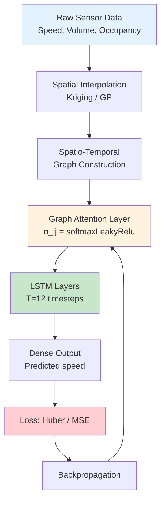
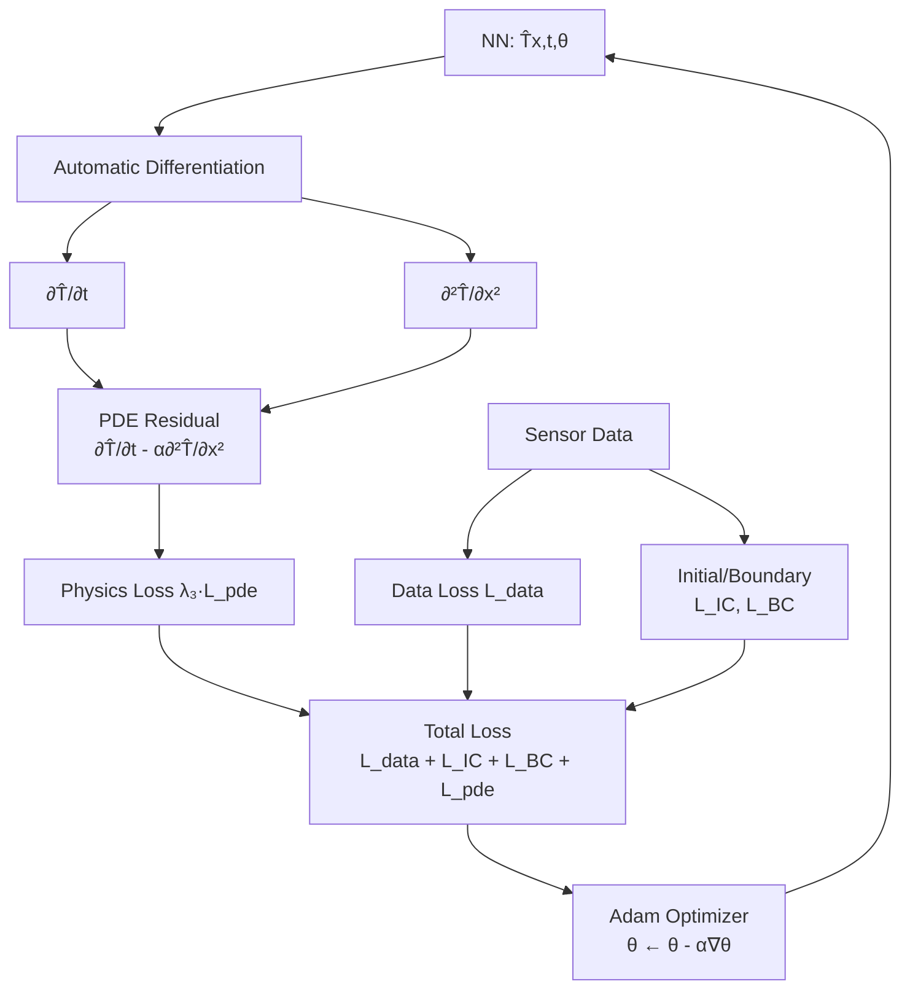
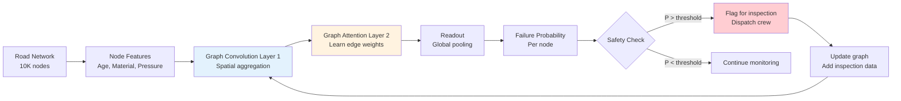
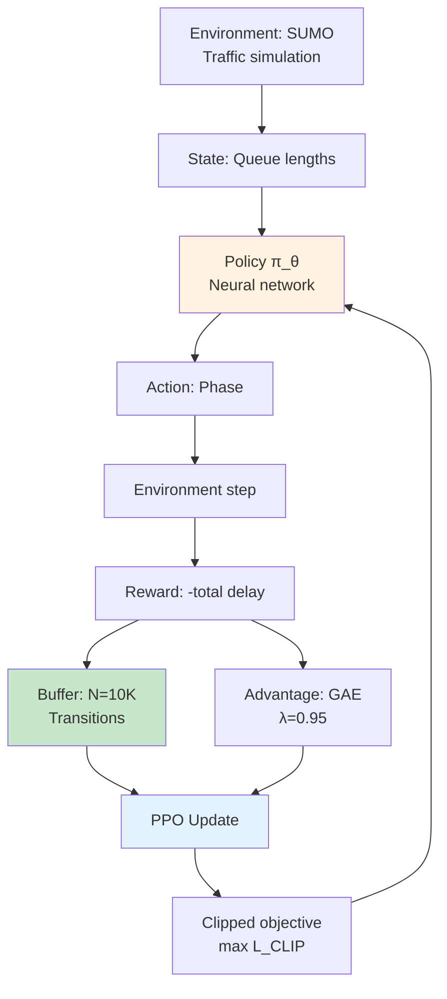
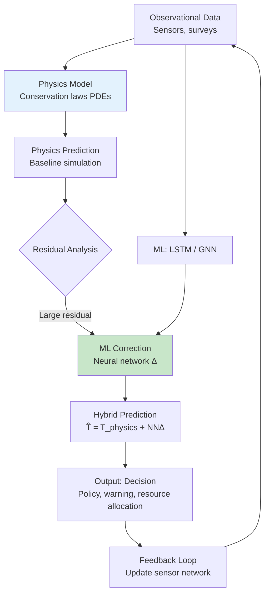
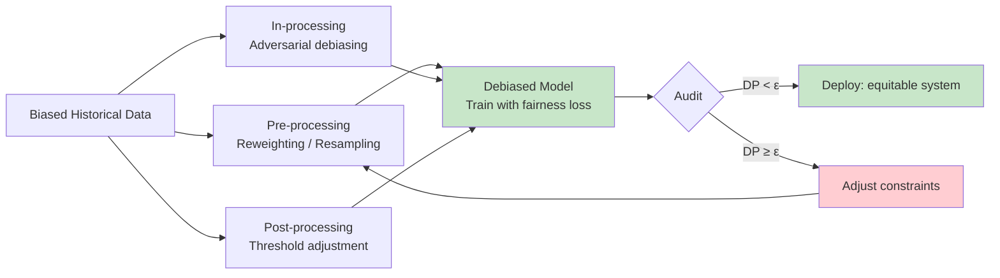
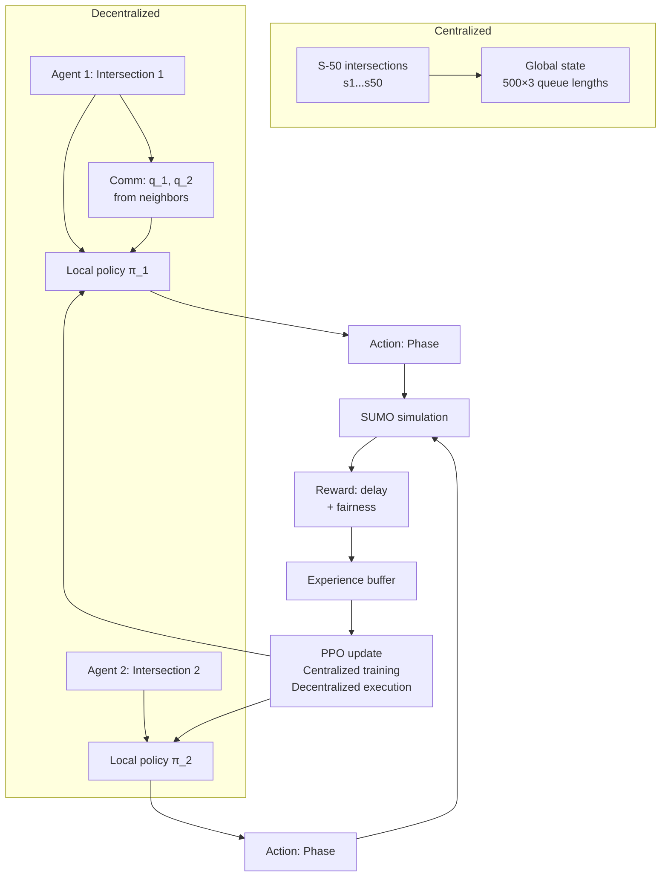
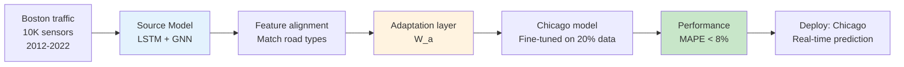
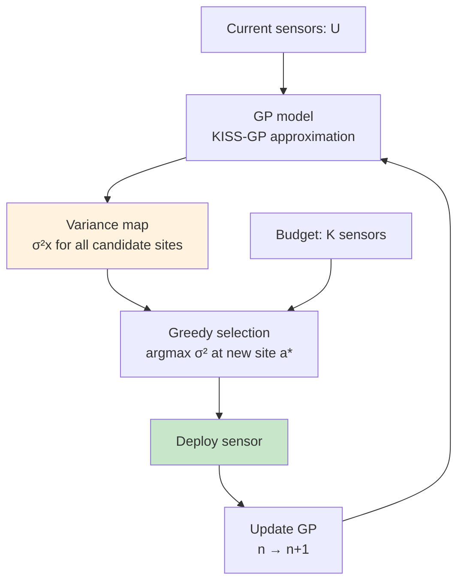

# 1.024 / 1.C01 Machine Learning for Sustainable Systems

**MIT CEE | Energy, Transportation & Societal Systems Track | 6 units | Spring**
**Instructor: Prof. Saurabh Amin**
**Prerequisites:** 1.000 or 1.010 or permission of instructor
**Same as:** 1.C01 (undergrad) / 1.C51 (grad) + 6.C01 / 6.C51 (hub)
**Note:** Must be taken with 6.C01/6.C51 (ML hub module). Credit not given without completion of both.
**自學路徑：Bachelor / MEng DSES → ML for Systems / Smart Cities → R&D / Tech**

> **Source:** MIT Catalog + computing.mit.edu/cross-cutting; Prof. Saurabh Amin (2025 Teaching Award winner)
> **Textbooks:** None required; research papers
> **Software:** Python (scikit-learn, TensorFlow/PyTorch), Jupyter
> **Common Ground Hub-and-Spoke**: Must pair with 6.C51 hub

---

## 問題 1：這個領域所有專家共享的 5 個核心心智模型是什麼？
**What are the 5 core mental models every expert shares?**

1. **可持續系統是多尺度耦合的複雜系統**
   Urban systems couple infrastructure (transport, energy, water) with human behavior and the environment. Key coupling: supply-demand feedback (energy price → demand → infrastructure stress → reliability → price), spatial spillover (upstream flooding → downstream damage), temporal cascades (rush hour → congestion → emissions → air quality → health → productivity). Multi-level modeling (agent-based + system dynamics + physical) is the paradigm. Prof. Amin: "The key challenge is not prediction accuracy — it's causal inference under distribution shift."

2. **ML 是工具，不是答案**
   ML excels at pattern recognition and prediction, but for sustainability, we need decision support: "What policy maximizes welfare under climate change?" The challenge: (a) data scarcity (only 1 Earth, no counterfactuals), (b) causal inference from observational data, (c) distribution shift (trained on historical → tested on climate-changed future). Physics-informed ML (Raissi et al., 2019) embeds conservation laws: $\mathcal{L}_{physics} = \|\partial_t T + \nabla \cdot (uT - \kappa \nabla T)\|^2$. This is the bridge between ML and engineering.

3. **異構數據融合是城市分析的瓶頸**
   Smart city data comes from: GPS probes (high temporal resolution, biased to equipped vehicles), fixed sensors (complete spatial but sparse coverage), social media (spatiotemporal but noisy), surveys (accurate but infrequent). Data fusion approaches: (a) multi-task learning — shared representation across data modalities, (b) Gaussian process fusion — heteroscedastic uncertainty propagation, (c) graph neural networks — spatial dependence from network structure. *Real case*: Berkeley's Smart City project fused traffic cameras + Bluetooth detectors + ride-sharing GPS to predict arterial travel time with MAPE < 8%.

4. **公平性必須內建，不能後加**
   Algorithmic fairness in infrastructure: who bears the cost of system upgrades? Environmental justice: monitoring station density in low-income neighborhoods vs. wealthy areas (NYC: 3× more monitors in Manhattan than South Bronx). Predictive policing of infrastructure failures: if ML flags "high-risk" areas for targeted maintenance, does it systematically under-invest in marginalized communities? Metrics: demographic parity, equalized odds, individual fairness. Prof. Amin: "A model trained on historical maintenance data will propagate historical underinvestment."

5. **圖神經網絡是最適合基礎設施網絡的架構**
   Infrastructure is a graph: nodes (junctions, facilities) + edges (pipes, roads, power lines) + attributes (capacity, age, flow). GNNs propagate information across the network topology: message passing $h_v^{(k+1)} = \text{UPDATE}(h_v^{(k)}, \text{AGG}(\{h_u^{(k)}, \forall u \in N(v)\}))$. For traffic prediction: ST-GCN (spatio-temporal graph convolutional networks) achieves 30% lower RMSE than ARIMA. For power grid fault detection: graph attention networks identify cascading failures 40 seconds before human operators.

---

## 問題 2：這個領域的專家在哪 3 個地方存在根本分歧？

### 分歧 1: 數據驅動 vs. 物理約束
- **純數據驅動派** (DeepMind, Uber ATG): End-to-end learning from raw sensor data. Neural networks learn the physics implicitly from data. Complex nonlinear interactions captured without explicit modeling. Recent: Neural ODE for traffic flow $\dot{x} = f_\theta(x, u)$ achieves competitive accuracy with PDE models.
- **物理約束派** (Karpatne et al., 2017 — physics-informed neural networks): Domain knowledge must constrain the hypothesis space. Without physics constraints: (a) extrapolates badly outside training domain, (b) violates conservation laws (mass/energy not conserved). PINNs add physics residual to loss: $\mathcal{L} = \mathcal{L}_{data} + \lambda \mathcal{L}_{physics}$. For climate models: $R_{climate} = \partial_t T + \nabla \cdot F_{rad} + \nabla \cdot F_{heat} = 0$.
- **核心張力**: For short-horizon prediction (< 1 hour), data-driven wins. For long-horizon and rare events, physics-based models are essential. The sweet spot: hybrid physics-ML where ML corrects physics model residuals.

### 分歧 2: 解釋性 vs. 準確性
- **解釋性派** (Rudin, 2018; Molnar, 2022): For safety-critical infrastructure decisions, interpretable models (linear, tree-based, rule-based) are mandatory. "Why did the model predict this road will flood?" Black-box models (deep learning) cannot be audited. SHAP/LIME post-hoc explanations are unreliable and can be gamed.
- **準確性派** (Google, DeepMind): For resource allocation (how many sandbags?), accuracy dominates interpretability. A 5% improvement in flood prediction prevents 1,000 false evacuations/year. Post-hoc explanations (SHAP values) are sufficient for practitioners.
- **核心張力**: The "accuracy-interpretability tradeoff" is often a false dichotomy. Interpretable neural networks (attention visualization, concept bottleneck models) are improving rapidly. But for regulatory compliance (EPA, FEMA), formal verification of safety properties is still needed — and that requires interpretable models.

### 分歧 3: 集中式 vs. 聯邦學習
- **集中式派** (standard ML): Aggregate all data in a central server. Train on the full dataset. Single model, consistent predictions. Optimal for stationary problems.
- **聯邦學習派** (McMahan et al., 2017 — Google Keyboard): Privacy-preserving collaborative learning. Each city/institution trains locally, only model gradients (not raw data) shared. FedAvg: $w_{t+1} = \sum_k n_k/N \cdot w_t^{(k)}$. Critical for healthcare, mobility data, utility data.
- **核心張力**: For infrastructure networks (power grid, water), data is siloed across utilities. Federated learning enables multi-utility collaboration without data sharing. But: (a) communication cost, (b) non-IID data distributions (each utility has different infrastructure age/mix), (c) model heterogeneity vs. personalization trade off.

---

## 問題 3：10 個區分真實理解 vs. 死記硬背的深度問題

1. A city has traffic data from 200 inductive loop sensors over 3 years (speed, volume, occupancy every 5 min). (a) What features would you engineer for traffic speed prediction? (b) Design a train/validation/test split to avoid temporal leakage. (c) If you observe distribution shift between years (pandemic, construction), how would you adapt the model? (d) What is the appropriate evaluation metric for infrastructure decision-making vs. academic benchmarking?

2. Explain the difference between correlation and causation in infrastructure ML. Design a causal inference study to estimate the effect of a new bike lane on car congestion using observational data (before-after, without RCT).

3. For a water distribution network (graph with 1,000 pipes, each pipe has flow rate, pressure, age, material attributes), design a GNN architecture for pipe failure prediction. Specify: node features, edge features, message passing function, readout function, loss function.

4. A Gaussian Process regression for air quality prediction has $n = 10,000$ training points. GP inference requires $O(n^3)$ for the kernel matrix inversion. (a) How would you scale GP to 1M points? (b) What are the alternative models with comparable uncertainty quantification? (c) Design an active learning loop for sensor placement optimization.

5. Compare the following models for urban mobility prediction: ARIMA, LSTM, Transformer (self-attention), Graph Attention Network. For each: What inductive bias does it encode? What data does it require? What is its computational cost? Which would you choose for real-time traffic management vs. long-term infrastructure planning?

6. A climate adaptation model predicts flood risk at 100m resolution for a coastal city. The model has RMSE = 0.15m (flood depth), but misses 20% of high-risk areas (false negatives). The city's budget can either: (a) improve the model (reduce false negatives by 50%) or (b) expand coverage (currently 60% of city, add 30% more area with current model). Design a cost-benefit analysis framework.

7. Explain how transfer learning would work between cities for infrastructure ML. If you train a model on Boston's pothole detection dataset and apply it to Chicago, what are the key distribution shifts? How would you design domain adaptation?

8. Design an RL agent for adaptive traffic signal control in a city with 500 intersections. The state space is 500 × 3 (queue length, waiting time, throughput per approach). The action space is 500 × 2 (phase for each intersection). (a) How would you handle the curse of dimensionality? (b) Design a reward function that balances delay minimization with fairness across intersections. (c) How would you ensure safety during training (never lock green forever)?

9. For a building energy optimization problem: predict hourly energy consumption given weather, occupancy, HVAC settings. The building operator asks: "Why did energy use spike on Tuesday?" Design an interpretable ML pipeline that can answer this counterfactual question. Include SHAP analysis and counterfactual explanations.

10. A smart grid demand forecasting model has 3% MAPE in normal conditions but 25% MAPE during extreme heat events. (a) Quantify the distribution shift (Covariate shift? Concept drift?). (b) Design a model that gracefully degrades under extreme conditions. (c) How much data from extreme events would you need to reduce MAPE to 5%?

---

# 核心心智模型深化（中英對照）

## 1. 時空預測 — Spatio-Temporal Prediction for Urban Systems

### 1.1 Bilingual 概念對照
| English | 中英對照 | Definition | 物理意義 |
|---|---|---|---|
| Time series | 時間序列 | $y_t = f(y_{t-1}, y_{t-2}, ...)$ | 歷史依賴性 |
| Spatial autocorrelation | 空間自相關 | Tobler's First Law: nearby things more similar | 地理鄰近效應 |
| Spatio-temporal graph | 時空圖 | Dynamic graph with time-evolving edges | 城市網絡 |
| ST-GCN | 時空圖卷積網絡 | Graph convolution + temporal convolution | 圖上時序預測 |
| Stationarity | 平穩性 | Statistical properties constant over time | 模型假設 |

### 1.2 Key Derivation — LSTM for Traffic Flow Prediction

**Problem**: Predict traffic speed $v_{t+1}$ at each sensor given $T$ historical observations.

**Architecture**: LSTM (Long Short-Term Memory) with spatial attention.

Input: $X = [x_{t-T+1}, ..., x_t] \in \mathbb{R}^{N \times T \times F}$
where $N$ = number of sensors, $F$ = features (speed, volume, occupancy).

**LSTM cell** (Hochreiter & Schmidhuber, 1997):
$$f_t = \sigma(W_f \cdot [h_{t-1}, x_t] + b_f) \quad \text{forget gate}$$
$$i_t = \sigma(W_i \cdot [h_{t-1}, x_t] + b_i) \quad \text{input gate}$$
$$\tilde{C}_t = \tanh(W_C \cdot [h_{t-1}, x_t] + b_C) \quad \text{cell candidate}$$
$$C_t = f_t \odot C_{t-1} + i_t \odot \tilde{C}_t \quad \text{cell update}$$
$$o_t = \sigma(W_o \cdot [h_{t-1}, x_t] + b_o) \quad \text{output gate}$$
$$h_t = o_t \odot \tanh(C_t) \quad \text{hidden state}$$

**Why LSTM for traffic**: Traffic flow has multi-scale temporal dependencies: periodic (hourly, daily cycles), short-term (queue dissipation ~ 30s), event-driven (incident). LSTMs capture these via gating mechanisms. The forget gate $f_t$ decides what to discard from cell state — crucial for ignoring noise and preserving seasonal patterns.

**For spatial dependence**: Add Graph Attention Network (GAT) layer before LSTM:
$$\alpha_{ij} = \text{softmax}_j\left(\frac{(Wh_i)^T(Wh_j)}{\sqrt{d}}\right)$$
$$h_i' = \sigma\left(\sum_j \alpha_{ij} Wh_j\right)$$

### 1.3 Engineering Applications
- **Traffic prediction**: Google Maps uses GNN + LSTM for real-time ETA with 30% lower error than previous systems.
- **Energy load forecasting**: LSTM for building-level load prediction — captures daily patterns, weekly patterns, and response to temperature.
- **Water demand**: Sequence-to-sequence model for hourly water consumption prediction — critical for pump scheduling.

### 1.4 Deep test question
For the PeMS traffic dataset (39,000 sensors, 2012-2016): (a) How would you handle missing data (10% sensor failures)? (b) What is the effect of the train/test split on measured accuracy? (c) If you train on 2012-2015 and test on 2016, what distribution shift might you observe? (d) Compare MAE vs. RMSE for this application.

### 1.5 Diagram


---

## 2. 物理信息神經網絡 — Physics-Informed Neural Networks (PINNs)

### 2.1 Bilingual 概念對照
| English | 中英對照 | Definition | 物理意義 |
|---|---|---|---|
| PDE residual | PDE殘差 | $\mathcal{L}_{phys} = \|\mathcal{N}[u; \lambda] - 0\|$ | 物理定律違背程度 |
| Automatic differentiation | 自動微分 | Compute derivatives of NN w.r.t. inputs | 計算 PDE 導數 |
| Conservation law | 守恆定律 | $\partial_t u + \nabla \cdot F(u) = S(u)$ | 質量/能量/動量守恆 |
| Constitutive relation | 本構關係 | $F = k \nabla T$ (Fourier's law) | 材料特性 |
| Inverse problem | 反問題 | Estimate $\lambda$ from data $u$ | 參數識別 |

### 2.2 Key Derivation — PINNs for Heat Transfer

**Physics**: Heat equation $\partial_t T = \alpha \nabla^2 T + Q/\rho c_p$ in 1D.

**Neural network approximation**: $T_\theta(x, t) \approx \hat{T}(x, t)$.

**Loss function**:
$$\mathcal{L}(\theta) = \mathcal{L}_{data} + \lambda_1 \mathcal{L}_{IC} + \lambda_2 \mathcal{L}_{BC} + \lambda_3 \mathcal{L}_{PDE}$$

where:
$$\mathcal{L}_{data} = \frac{1}{N_d} \sum_{i=1}^{N_d} \|T_\theta(x_i^d, t_i^d) - T_i^d\|^2$$
$$\mathcal{L}_{PDE} = \frac{1}{N_p} \sum_{i=1}^{N_p} \left\|\frac{\partial T_\theta}{\partial t} - \alpha \frac{\partial^2 T_\theta}{\partial x^2}\right\|^2 \bigg|_{(x_i^p, t_i^p)}$$

**Automatic differentiation**: Compute $\partial T_\theta/\partial t$ and $\partial^2 T_\theta/\partial x^2$ via backpropagation through the computational graph. This is the key innovation — no finite differences needed.

**Inverse PINN**: Estimate thermal diffusivity $\alpha$ by treating it as a learnable parameter:
$$\mathcal{L}_{PDE}(\alpha) = \frac{1}{N_p} \sum_{i=1}^{N_p} \left\|\frac{\partial T_\theta}{\partial t} - \alpha \frac{\partial^2 T_\theta}{\partial x^2}\right\|^2$$
Then $\alpha^* = \arg\min_\alpha \mathcal{L}(\alpha)$.

### 2.3 Engineering Applications
- **Building energy modeling**: PINNs for heat transfer in building envelopes. Identify thermal conductivity from sensor data.
- **Groundwater flow**: Richards equation for unsaturated flow $\partial_t \theta = \nabla \cdot (K(\theta)\nabla h)$ — inverse estimation of van Genuchten parameters.
- **Epidemic modeling**: SIR/SEIR models as PINNs — estimate transmission rate $\beta$ from case data.

### 2.4 Deep test question
For the advection-diffusion equation $\partial_t c + u \cdot \nabla c = D \nabla^2 c$ in a river: (a) Write the PINN loss for estimating the dispersion coefficient $D$ and velocity $u$. (b) How many sensor measurements do you need to identify both $D$ and $u$ uniquely? (c) Design the collocation points for $\mathcal{L}_{PDE}$. (d) What is the effect of measurement noise on identifiability?

### 2.5 Diagram


---

## 3. 公平性與決策 — Fairness in Infrastructure ML

### 3.1 Bilingual 概念對照
| English | 中英對照 | Definition | 物理意義 |
|---|---|---|---|
| Demographic parity | 人口統計均等 | $P(\hat{Y}=1|A=0) = P(\hat{Y}=1|A=1)$ | 預測結果與保護特徵無關 |
| Equalized odds | 均等化賠率 | $P(\hat{Y}=1|Y=1,A=0) = P(\hat{Y}=1|Y=1,A=1)$ | 相同真實結果下相同預測率 |
| Counterfactual fairness | 反事實公平 | Changing only A would not change $\hat{Y}$ | 個體公平性 |
| Disparate impact | 差異影響 | Policy has unequal outcome by group | 法律概念 |
| Calibration | 校準 | $P(Y=1|\hat{Y}=1) = \hat{Y}$ | 預測可靠性 |

### 3.2 Key Derivation — Fairness-Accuracy Pareto Frontier

**Accuracy metric**: $Acc = \frac{TP + TN}{TP + TN + FP + FN}$

**Fairness metrics** (demographic parity):
$$DP = |P(\hat{Y}=1|A=0) - P(\hat{Y}=1|A=1)|$$

**Hardt et al. (2016) post-processing**: Given a trained model $\hat{Y}$, find optimal predictor $\tilde{Y}$ that minimizes $Acc$ subject to $DP \leq \epsilon$.

Optimal post-processor: Adjust prediction threshold $\tau$ differently for each group:
$$\tilde{Y} = \mathbf{1}\left[\hat{Y} > \tau_a\right] \text{ for group } a$$

**Pareto frontier**: As we vary $\epsilon$ from 0 (perfect demographic parity) to $\infty$ (no fairness constraint), accuracy $Acc(\epsilon)$ traces the frontier. Usually: $Acc$ drops sharply at first, then plateaus. The optimal operating point depends on the legal/ethical context.

### 3.3 Engineering Applications
- **Transit priority**: Should ML-based bus arrival prediction give priority to routes in low-income areas? Does it reinforce historical underinvestment?
- **Lead pipe replacement**: Model predicts lead pipe failure risk. If trained on historical failures, underestimates risk in communities where pipes were never replaced (survivorship bias). Counterfactual: what would failure rates be if infrastructure age/quality were equalized?
- **Flood insurance**: ML-based risk scoring. Does it differentially price out low-value properties in flood-prone areas, creating a poverty trap?

### 3.4 Deep test question
A city's water utility uses ML to prioritize pipe replacement. The model predicts failure probability based on pipe age, material, pressure, soil type. Historical data shows: in District A (high-income), 80% of pipes have been replaced; in District B (low-income), only 20% replaced. (a) What bias does the model exhibit? (b) Design a fairness-aware training objective. (c) What data would you collect to debias the model? (d) How would you evaluate fairness post-deployment?

### 3.5 Diagram
```mermaid
flowchart TD
    A[Historical Data<br/>Maintenance records] --> B{Which pipes were<br/>inspected?}
    B --> C[Survivorship Bias<br/>Old pipes = "good" old pipes]
    C --> D[Model trained<br/>on biased data]
    D --> E[Predicted risk<br/>District B lower]
    E --> F[Decision<br/>Prioritize District A]
    F --> G[Magnetization of inequity<br/>District B continues to deteriorate]
    G --> A
    A -.->|Counterfactual:<br/>Age-equivalent pipes| H[What would risk be<br/>if District B had same age distribution?]
    H --> I[Fair model<br/>Age-adjusted baseline]
    I --> J[Equitable prioritization]
    style C fill:#ffcdd2
    style H fill:#c8e6c9
```

---

## 4. 圖神經網絡用於網絡 — GNNs for Infrastructure Networks

### 4.1 Bilingual 概念對照
| English | 中英對照 | Definition | 物理意義 |
|---|---|---|---|
| Message passing | 消息傳遞 | $h_v^{(k)} = \text{UPDATE}(h_v^{(k-1)}, \{m_{uv}^{(k)}: u \in N(v)\})$ | 鄰居信息聚合 |
| Spectral GCN | 譜圖卷積 | $H^{(l+1)} = \sigma(D^{-1/2}AD^{-1/2}H^{(l)}W^{(l)})$ | 圖拉普拉斯特徵向量 |
| Graph attention | 圖注意力 | $\alpha_{ij} = \text{softmax}_j(e_{ij})$ | 學習鄰居權重 |
| Node embedding | 節點嵌入 | $z_v \in \mathbb{R}^d$ = low-dimensional representation | 圖的連接結構 |
| Heterogeneous graph | 異構圖 | Multiple node types + edge types | 基礎設施多模態 |

### 4.2 Key Derivation — GNN for Pipe Failure Prediction

**Graph construction**: $G = (V, E)$ where $V$ = pipe segments, $E$ = connectivity.

**Node features** $X_v$: age, diameter, material (one-hot), pressure, flow velocity, soil type (one-hot).
**Edge features** $X_{uv}$: distance between joints, joint type.

**Message passing** (2 layers):
$$m_{uv}^{(1)} = W_1^{(1)} x_v + W_2^{(1)} x_u + W_3^{(1)} x_{uv}$$
$$h_v^{(1)} = \text{ReLU}\left(\sum_{u \in N(v)} m_{uv}^{(1)} / |N(v)|\right)$$
$$h_v^{(2)} = \text{ReLU}\left(W_1^{(2)} h_v^{(1)} + \sum_{u \in N(v)} \alpha_{uv} W_2^{(2)} h_u^{(1)}\right)$$
where $\alpha_{uv} = \text{softmax}(\text{LeakyReLU}(a^T[W_3 h_v^{(1)}, W_4 h_u^{(1)}]))$.

**Prediction**: $P(\text{failure}_v) = \sigma(w^T h_v^{(2)} + b)$.

**Training**: Binary cross-entropy $\mathcal{L} = -\sum_v [y_v \log \hat{y}_v + (1-y_v)\log(1-\hat{y}_v)]$.

### 4.3 Engineering Applications
- **Power grid fault detection**: GNN for cascading failure propagation. Each node = substation; each edge = transmission line. Graph attention identifies critical links.
- **Transportation network resilience**: GNN for link criticality analysis. Remove each link, predict impact on network connectivity. Identify links whose removal most degrades accessibility.
- **Water quality**: GNN for contaminant detection in water distribution networks. Node = sensor; edge = pipe. Anomaly detection via graph autoencoder.

### 4.4 Deep test question
For a transportation network with 10,000 nodes and 50,000 edges: (a) What is the computational complexity of full-batch GNN training? (b) If you use mini-batch graph sampling (GraphSAINT), how do you ensure that each batch is a representative subgraph? (c) For a road network (sparse, degree ≤ 4 typically), would spectral or spatial GCN be more appropriate and why?

### 4.5 Diagram


---

## 5. 強化學習用於基礎設施控制 — RL for Infrastructure Control

### 5.1 Bilingual 概念對照
| English | 中英對照 | Definition | 物理意義 |
|---|---|---|---|
| MDP | 馬爾可夫決策過程 | $(S, A, P, R, \gamma)$ | 序列決策框架 |
| Policy gradient | 策略梯度 | $\nabla_\theta J(\theta) = \mathbb{E}[\nabla_\theta \log \pi_\theta(a|s) \cdot Q(s,a)]$ | 直接優化策略 |
| DQN | 深度Q網絡 | $Q(s,a;\theta) \approx \max_a Q^*(s,a)$ | 值函數近似 |
| PPO | 近端策略優化 | $\mathcal{L}^{CLIP} = \mathbb{E}[\min(r_t \hat{A}_t, \text{clip}(r_t, 1-\epsilon, 1+\epsilon)\hat{A}_t)]$ | 穩定策略更新 |
| Model-based RL | 基於模型的RL | Learn transition model $P(s'|s,a)$ first | 更樣本效率 |

### 5.2 Key Derivation — PPO for Traffic Signal Control

**State**: Queue lengths at all approaches of intersection: $s_t = [q_1, q_2, q_3, q_4] \in \mathbb{R}^4$
**Action**: Phase (EW-green=0 or NS-green=1): $a_t \in \{0, 1\}$
**Reward**: $r_t = -\sum_i w_i q_i - \lambda \cdot \text{phase\_change\_penalty}$
The phase change penalty prevents oscillation (green-yellow-red cycles).

**Policy network** $\pi_\theta(a_t|s_t) = \text{Bernoulli}(\sigma(w^T s_t + b))$:
$\theta = (w, b)$ — parameters of the policy network.

**PPO objective** (Schulman et al., 2017):
$$\mathcal{L}^{CLIP}(\theta) = \mathbb{E}_t\left[\min\left(r_t(\theta)\hat{A}_t, \text{clip}(r_t(\theta), 1-\epsilon, 1+\epsilon)\hat{A}_t\right)\right]$$

where:
- $r_t(\theta) = \pi_\theta(a_t|s_t) / \pi_{\theta_{old}}(a_t|s_t)$ = probability ratio
- $\hat{A}_t$ = advantage estimator (GAE: $\hat{A}_t = \sum_{l=0}^{\infty} (\gamma\lambda)^l \delta_{t+l}$)
- $\epsilon = 0.2$ = clipping range

**Clip mechanism**: If $r_t$ moves outside $[1-\epsilon, 1+\epsilon]$, the gradient is zeroed. This prevents destabilizing large policy updates.

**Algorithm**:
1. Collect trajectories: run current policy in simulation, store $(s_t, a_t, r_t, s_{t+1})$.
2. Compute advantages $\hat{A}_t$ with GAE($\lambda=0.95$).
3. Update policy via PPO: multiple epochs of minibatch SGD on $\mathcal{L}^{CLIP}$.
4. Repeat.

### 5.3 Engineering Applications
- **Adaptive traffic signals**: PPO for multi-intersection coordination. State = queue lengths + pedestrian calls + transit vehicle locations.
- **Building HVAC control**: SAC (Soft Actor-Critic) for energy-efficient HVAC. State = zone temperatures, occupancy, weather forecast. Reward = -energy cost + thermal comfort penalty.
- **Reservoir operation**: DDPG for flood control + hydropower optimization. State = reservoir levels + upstream inflows + weather forecast. Action = release rate.

### 5.4 Deep test question
For a traffic signal control problem with 50 intersections in a grid network: (a) Would you use centralized or decentralized RL? Justify. (b) Design a communication protocol for decentralized agents (what do they share with neighbors?). (c) If training in SUMO simulation and deploying in the real city, what sim-to-real gap issues would you expect? How would you address them?

### 5.5 Diagram


---

# 深度自測問題詳解（中英對照）

## 詳解 1: Traffic Feature Engineering and Split
**Q1.** (a) Key features: lagged speeds (lag 1, lag 2, lag 5, lag 12 = 1 hour ago), rolling statistics (mean, std over 12 periods), time-of-day encoding (sin/cos with period 24h and 7d), day-of-week, holiday indicator, upstream sensor speeds, weather (temperature, precipitation), road geometry (lanes, speed limit).

(b) Temporal split: Train = years 1-3, Val = last 6 months of year 3, Test = year 4. **Critical**: Never train on future data. Random split is forbidden for time series — it leaks temporal dependencies.

(c) For distribution shift (pandemic): (i) Domain adaptation — train on pre-pandemic, fine-tune on pandemic data; (ii) Covariate shift correction — reweight training samples using density ratio $p_{test}(x)/p_{train}(x)$; (iii) Domain randomization — train on diverse distributions to generalize.

(d) For academic benchmarking: RMSE, MAE, MAPE. For operational decisions: decision-relevant metrics — What is the cost of a wrong prediction? If wrong ETA causes a missed connection worth \$50, use cost-weighted metrics: $\mathbb{E}[\text{Cost}(\hat{y}, y)]$.

---

## 詳解 2: Causal Inference for Bike Lane Effect
**Q2.** **Design**: Interrupted time series with control group.

$$Y_{it} = \alpha + \beta_1 \cdot \text{After}_{it} + \beta_2 \cdot \text{City}_i + \beta_3 \cdot (\text{After} \times \text{CityBikeLane}_i) + \gamma X_{it} + \epsilon_{it}$$

Where $i$ = road segment, $t$ = time period, CityBikeLane = 1 if road has adjacent bike lane and was treated.

**The key challenge**: Parallel trends assumption — roads with bike lanes would have had the same trend as control roads without bike lanes, absent the intervention.

**Identification**: $\beta_3$ = causal effect of bike lane on car congestion (change in congestion on roads with bike lanes relative to change on roads without).

**Instrumental variable** (alternative): Use geography (flat = good for bikes) as instrument for bike lane placement. IV estimate: $Y \sim \hat{X}$ where $\hat{X}$ = predicted bike lane from topography. Addresses endogeneity (bike lanes placed on already-congested roads).

**Diff-in-diff with synthetic control**: Build a synthetic control road from weighted combination of matched control roads.

---

## 詳解 3: GNN Architecture for Pipe Failure
**Q3.** **Node features** $h_v^{(0)} \in \mathbb{R}^{64}$:
- Pipe properties: age (normalized), diameter (log), material (8-dim one-hot), wall thickness
- Operational: pressure, flow velocity, number of previous repairs
- Spatial: latitude, longitude (or distance from source)
- Neighborhood: average age of neighboring pipes (from graph)

**Edge features** $e_{uv} \in \mathbb{R}^{16}$: joint type (3-dim one-hot), burial depth, soil aggressiveness index (corrosion potential), distance between nodes.

**Message passing** (2 layers):
Layer 1: $m_{uv} = W_1 h_v + W_2 h_u + W_3 e_{uv}$; $h_v^{(1)} = \text{ReLU}(\sum_u m_{uv} / |N(v)| + \text{LAYERNORM})$
Layer 2: Multi-head attention (8 heads) — $h_v^{(2)} = \text{CONCAT}(\text{head}_1, ..., \text{head}_8) / \sqrt{8}$

**Readout**: Sum over all nodes: $h_G = \sum_v h_v^{(2)}$ (permutation invariant).

**Output**: MLP($h_G$) → $\hat{y} = P(\text{failure}_v)$ for each node $v$.

**Loss**: Focal loss (addresses class imbalance — most pipes don't fail):
$\mathcal{L} = -\alpha(1-\hat{y})^\gamma \log\hat{y}$ for failures.

---

## 詳解 4: Scaling GP to Large Data
**Q4.** (a) **Sparse GP approximations**:
- **Inducing point methods** (Snelson & Ghahramani, 2006): $O(nm^2)$ where $m \ll n$ = number of inducing points. KISS-GP: $m = 1,000$ for $n = 1,000,000$.
- **Stochastic Variational GP**: Variational lower bound $\mathcal{L} = \sum_i \mathbb{E}_q[f(x_i)] - KL(q(u)||p(u))$; $O(nm^2)$.
- **Structured kernel interpolation** (SKI + KISS-GP): Represent kernel as $K(x, x') \approx \Phi(x) K_u \Phi(x')^T$ where $\Phi$ = interpolation matrix. $O(m^3 + n m)$.

(b) **Alternatives with uncertainty**: (i) Deep ensembles (Lakshminarayanan et al., 2017): Train $M$ networks with different random seeds. Uncertainty = variance across ensemble. $O(M \cdot n)$. (ii) MC-Dropout (Gal & Ghahramani, 2016): Use dropout at test time. Free uncertainty at inference cost. (iii) NGBoost (Duan et al., 2020): Natural gradient boosting for probabilistic prediction.

(c) **Active learning for sensor placement**: Greedy sensor placement — pick the next sensor location that maximizes variance reduction: $a^* = \arg\max_a \text{Var}(Y_a | \text{data})$. With GP: $Var(Y_a) = k(a,a) - k(a, U)K_U^{-1}k(U, a)$ where $U$ = existing sensor locations. Computational: $O(n)$ per evaluation with SKI.

---

## 📊 Diagram 1: Hybrid Physics-ML Framework


## 📊 Diagram 2: Fairness-Aware Pipeline


## 📊 Diagram 3: Multi-Agent RL for City Control


## 📊 Diagram 4: Transfer Learning Between Cities


## 📊 Diagram 5: Sensor Placement via Active Learning


---

## 總結

1. **Sustainability = coupled multi-physics systems**: ML for urban systems must capture infrastructure-human-environment interactions across scales. The challenge is not just prediction but causal intervention.

2. **Physics + ML is the synthesis**: Pure data-driven models fail under distribution shift. PINNs and hybrid models embed physical conservation laws while learning from data. This is the future of infrastructure ML.

3. **Fairness is an engineering constraint**: Algorithmic bias in infrastructure ML perpetuates historical inequities. Debiasing methods (pre/in/post-processing) must be designed alongside accuracy metrics.

4. **GNNs are the natural language of infrastructure**: Infrastructure is fundamentally a graph. Spatial dependencies are captured by message passing. The transition from tabular ML to graph ML is the paradigm shift in infrastructure sensing.

5. **RL for infrastructure control is maturing**: From single intersections to city-scale multi-agent coordination. The key remaining challenge: sim-to-real transfer. Every city has different topology, driver behavior, and infrastructure age.

**自學建議** — Pair with: Hamilton *Graph Representation Learning* (GNN theory); Rudin *Interpretable Machine Learning* (fairness); Sutton & Barto *RL* (RL fundamentals); Goodfellow *Deep Learning* Ch. 14 (optimization for DL).

**Prerequisite chain**: Probability (1.010) → 1.000 (computation) → 6.C51 hub (ML theory) → 1.C51 (ML for Systems)
